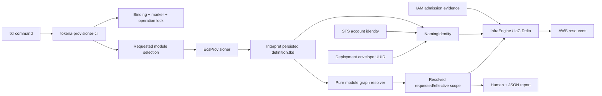
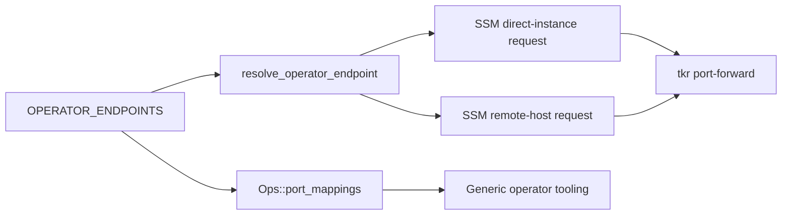
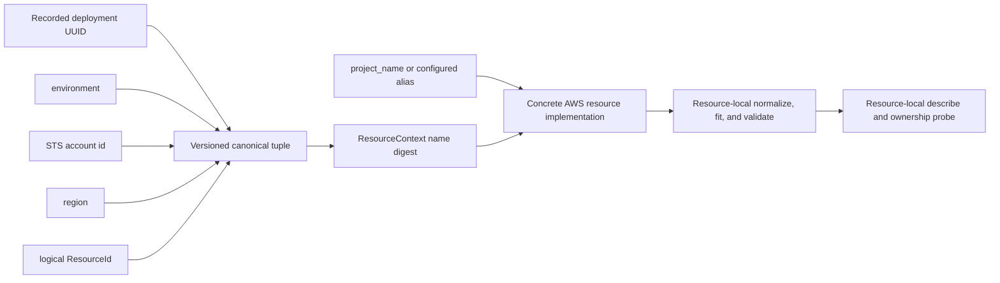
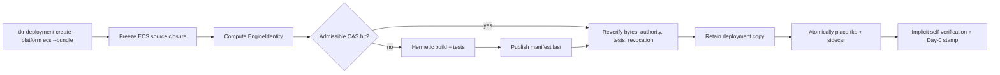

# Design Document: ECS Production Readiness

## Overview

This design closes the production-readiness gaps identified in
[`requirements.md`](./requirements.md) without replacing the ECS platform's existing authority model.
The persisted `definition.tkd` remains the sole desired-state source. The platform-bound `tkp-ecs`
continues to interpret it, the IaC engine remains the only mutation path, and the shared provisioner
continues to own binding, locking, configuration revisions, bundle integrity, upgrade, and rollback.

Seven additions fit those existing seams:

1. A pure module-graph resolver turns an optional requested module set into the exact prerequisite or
   dependent closure required by the verb. The shared provisioner shell carries the resolved selection
   into the platform and its reports; no ECS command substitutes `ModuleSelection::All`.
2. One typed endpoint inventory projects both generic `Ops::port_mappings` values and executable SSM
   forwarding requests.
3. A declarative network policy creates one host security group per capacity-provider plane and typed,
   separately managed security-group rules.
4. A live IAM admission reader proves preexisting DSQL role trust and effective permission coverage before
   an engine mutation can begin. Managed roles are rendered from the same permission model.
5. An immutable naming identity supplies the versioned digest inputs, while each concrete AWS resource
   implementation owns its provider-specific normalization, fitting, validation, and collision checks.
6. ECS is registered with the existing provisioner-bundle acquisition pipeline; no ECS-specific bundle
   format or trust path is introduced.
7. An explicitly invoked live-AWS harness drives the real `tkr`/`tkp` boundary and records redacted,
   machine-readable qualification evidence.

No Temporal API behaviour is involved. The design is derived from the current ECS definition and code,
the shared platform/provisioner specifications, and the required live-AWS observations.

## Dependencies and Non-Goals

### Owning relationships

- `platform-config-dsl` owns persisted `definition.tkd`, interpretation, engine identity versus
  configuration revision, and the prohibition on ambient authority inside the language. This design only
  injects recorded deployment identity and live AWS identity at the host realization boundary.
- `platform-provisioner-binary` owns the deployment envelope, binding gate, remote operation lock,
  configuration history, bundle admission, upgrade, and definition-driven rollback. This design extends
  its operation request/report shape and adds the recorded deployment UUID; it does not fork those
  mechanics.
- `tokeira-iac` owns composition validation, fail-closed deletion, dependency ordering, refresh, and Delta
  application. This design supplies a correct active module set and typed AWS resources.
- `tokeira-orchestrator` owns the `Ops` and `InfraEngine` facades. This design extends their endpoint and
  scoped-operation inputs rather than bypassing them.
- `tokeira-aws` owns provider calls and AWS resource implementations. Each concrete resource owns its
  provider-facing name policy and collision probe; ECS supplies readable aliases, logical ids, and the
  recorded naming identity.
- `tkr` remains the operator cockpit and transparent launcher; `tkp-ecs` remains the only infrastructure
  mutator.

### State-format consequence

`DeploymentStateEnvelope` gains an optional, serialized `deployment_uuid`. `tkr deployment create`
already creates `DeploymentMetadata.id`; the create flow passes that UUID into the provisioner's implicit
inception path, and `tkp` records it before any non-state resource is created. A schema migration adds the
optional field but does not guess a UUID from a directory name or mutable definition. ECS operations
requiring managed physical names fail closed when a legacy envelope has no UUID; the ECS engine upgrade
supplies and records the registry UUID under the normal migration/binding gate. Ordinary verbs trust the
envelope thereafter.

The existing `deployment_id` field remains the human/project identity for compatibility. The UUID is a
separate uniqueness input, not a rename of that field and not part of `definition.tkd`.

### Non-goals

- No second desired-state file, compiled ECS definition, or direct replica mutation path.
- No module selection for the rollback B-delete phase; it remains the exact recorded resource-id set.
- No public ingress for operator-only endpoints.
- No automatic mutation of adopted IAM roles.
- No tag-only or name-only ownership inference.
- No new provisioner bundle format, artifact store, signing scheme, or workload-image build path.
- No live AWS dependency in the default workspace test suite.
- No new third-party dependency solely for name encoding; the small fixed base32 encoder is local and
  covered by properties.
- No centralized AWS resource-name registry, resource-kind enum, or cross-resource provider-policy match;
  physical naming remains part of each concrete resource implementation.

## Architecture

### Lifecycle and identity path



The shell parses an optional repeatable `--module <NAME>` on `infra plan|apply|destroy` and
`deploy plan|apply`. Absence is `All`; a named request is preserved as an ordered set. The shell loads the
envelope, runs its existing read or mutation guards, and passes an operation context containing the
recorded UUID and requested selection to `ProvisionerPlatform`.

ECS interprets the definition once, derives the module graph from the interpreted `Deployment`, and
resolves the scope before opening AWS clients or state. Plan/apply use the prerequisite closure. Destroy
uses the dependent closure. The resulting definition-ordered names become `InfraComposition.active_modules`
and `ModuleSelection::Only`; the known universe remains all interpreted modules. The rollback
`infra_destroy_selected` method is unchanged.

A selected apply still consumes and retains the whole persisted definition as the shared configuration
revision. `config_revision` identifies the desired definition used by the operation, not a claim that every
module is converged. The selection trace records which modules were reconciled; a subsequent full plan is
the convergence oracle for the rest. Unselected resource state remains untouched.

### Operator-access path



The inventory is platform code, not definition configuration: these ports are compatibility/operational
contracts already validated as canonical. `Ops::port_mappings` projects a generic `PortMapping`; the ECS
port-forward command consumes its typed access mode. A local port override is applied after endpoint
resolution, so it cannot change the remote port.

### Network-isolation path

The networking module realizes security groups as shells, then realizes ingress/egress rules as separate
resources depending on both endpoint groups. This avoids artificial dependency cycles between groups and
lets each rule be diffed, described, deleted, and audited independently. AWS's default allow-all egress is
revoked when a managed group is created; only declarative egress resources are then admitted.

Task-ENI groups remain separate from host groups. Each launch template depends on exactly one of the eight
host groups. Host groups have no inbound rules. The network-policy table is the sole constructor of rule
resources:

| Source | Destination | Protocol/port | Reason |
|---|---|---|---|
| Each host group | VPC endpoint group | TCP/443 | Host egress plus endpoint-group ingress for ECS, ECR, Auto Scaling, SSM, Cloud Map, and DSQL control APIs |
| ALB group | Edge task group | TCP/7233 and TCP/7234 | Registered edge target traffic |
| SSM forwarding host group | Its mapped task group | Inventory TCP port | Remote-host operator tunnel |
| Managed groups | VPC DNS resolver | UDP/TCP 53 | Private DNS and Service Connect resolution |
| Managed groups | S3 gateway prefix list | TCP/443 | ECR layer and state-object access |
| Declared service source group | Declared service destination group | Canonical service port | Definition topology only |

The implementation represents security-group, prefix-list, and resolver peers as distinct enum variants.
A VPC CIDR is accepted only for a provider edge that cannot be represented by a group or prefix-list peer.

### IAM admission path

For `dsql.mode = preexisting`, definition admission additionally requires `dsql.cluster_arn`; endpoint-only
identity cannot prove a DSQL permission resource. Before planning a mutation, ECS:

1. Parses both role ARNs and requires their account component to equal the STS caller account.
2. Calls `iam:GetRole` and evaluates the decoded trust policy for the ECS task principal.
3. Retrieves every inline role policy and every attached managed policy's default version, plus the
   permissions-boundary policy when present.
4. Builds the exact required `(action, resource)` pairs from one `DsqlPermissionProfile` model.
5. Calls `iam:SimulatePrincipalPolicy` for those exact pairs. `allowed` is required; explicit deny,
   implicit deny, missing context, or an unevaluable result fails closed.
6. Records policy/version digests, simulation decisions, and least-privilege findings as plan evidence.

Simulation is the effective-coverage decision, including the role's permissions boundary. Document
inspection provides trust validation, complete evidence, and broad/extra-grant findings. Live qualification
then proves the real runtime/admin boundary with assumed sessions, covering external controls that IAM
simulation does not authoritatively model.

Managed role JSON is rendered from the same `DsqlPermissionProfile`; it cannot drift into a second list of
required actions. Adopted role resources consume immutable admission evidence from `ProvisionContext` and
never call IAM mutation APIs.

### Physical naming path



`ResourceContext` carries one immutable `NamingIdentity` for the operation. Its only shared naming
operation is the domain-separated digest over the deployment identity and logical `ResourceId`; it has no
resource-kind enum, provider-constraint table, role mapping, truncation policy, or collision registry.

Each managed resource implementation chooses its stable role token and owns the provider contract adjacent
to the API calls that consume the name: allowed syntax, alias sanitization, reserved forms, length budget,
candidate assembly, provider lookup, and collision/adoption classification. For example, ALB rules remain
in `resources/elbv2.rs`, IAM role rules remain in `resources/iam_role.rs`, and S3 bucket rules remain in
`resources/s3_bucket.rs`. Adding a named resource therefore requires changing that resource, not
registering it in a second list.

The canonical digest input is domain-separated (`tokeira/aws-physical-name/v1`) and length-prefixed in
this order: deployment UUID, environment, account id, region, logical resource id. The full SHA-256 digest
is retained in plan evidence. The physical suffix is the first 80 bits encoded as 16 lowercase RFC 4648
base32 characters without padding.

The resource-local conceptual candidate is
`<sanitized-project-or-alias>-<resource-role>-<suffix>`. If a configured alias differs from
`project_name`, the readable portion is `<project_name>-<alias>` before that resource normalizes it. The
resource truncates only the readable portion; its complete role and suffix survive. If its provider budget
cannot fit separators, role, and suffix, admission fails rather than weakening uniqueness.

Logical `ResourceId`s are stable role identities and never embed a configured or provider-assigned
physical name. Changing a managed alias therefore produces a visible physical replacement under the
existing destructive-plan gate, not a new logical resource that could orphan the old one.

Before mutation, each resource's own describe/preflight path classifies its candidate as `Available`,
`Owned`, `Adopted`, or `Collision`. `Owned` requires the recorded physical id and naming identity to agree.
`Adopted` requires that resource's typed preexisting contract. Matching tags or names alone never
establish ownership. A changed ambient account or region is a retarget refusal before digest generation.

### Bundle inception path



ECS is added to the existing platform-to-bundle-target registry: package
`tokeira-ecs-deployment`, source binary `tkp-ecs`, placed binary `tkp`. The existing
`obtain_provisioner`, `BundleStore`, `BinaryStore`, sidecar, and self-verifying implicit inception flow
remain the only path. The ECS-specific create refusal is removed. Production admission supplies a
`TrustedCi` floor; local development may continue to omit `--bundle` and use the native dev path.

No deployment metadata, Day-0 envelope, placed provisioner, or AWS mutation is committed before bundle
admission. Build staging uses temporary paths and atomic rename; failure removes staging but never rewinds
other worktree content.

### Live-AWS qualification path

The harness lives as an ignored integration target under `platforms/ecs/tests/live_aws.rs`, with reusable
support under `platforms/ecs/tests/support/`. It executes the real `tkr` binary and admitted `tkp`, then
uses the existing AWS SDK clients only for observations and controlled failure injection.

The invocation explicitly supplies an allow-listed non-production account id, region, artifact directory,
maximum duration, and cleanup policy. STS identity must match before create. The harness creates a unique
project prefix from the run id; the production naming function adds the deployment digest.

For interruption scenarios, the child emits a structured progress event only after its durable marker is
committed. The harness reads that event from the child pipe and terminates the process immediately, then
re-runs the same verb. This synchronizes on a committed phase and introduces no timing sleep or test-only
branch into production mutation logic. AWS SDK waiters or event-driven status APIs, each with deadlines,
replace fixed sleeps for eventual consistency.

Evidence is an append-only event stream folded into a versioned final record. Cleanup runs from a guard on
success, failure, or interruption. Residual discovery uses recorded ids plus account/region/tag inventory;
tags help discover but never prove ownership for deletion. Any residual managed resource fails the run and
is reported for operator cleanup.

## Components and Interfaces

### Shared operation selection (`crates/tokeira-provisioner-cli/src/selection.rs`)

```rust
#[derive(Debug, Clone, PartialEq, Eq, Serialize, Deserialize)]
pub enum RequestedModules {
    All,
    Named(Vec<String>),
}

#[derive(Debug, Clone, Copy, PartialEq, Eq)]
pub enum SelectionPurpose {
    PlanApply,
    Destroy,
}

#[derive(Debug, Clone, PartialEq, Eq, Serialize, Deserialize)]
pub struct SelectionTrace {
    pub requested: RequestedModules,
    pub effective: Vec<String>,
}

#[derive(Debug, Clone, PartialEq, Eq)]
pub struct Scoped<T> {
    pub selection: SelectionTrace,
    pub value: T,
}
```

`PlanArgs`, `ApplyArgs`, and `DestroyArgs` gain repeatable `--module <NAME>`. The equivalent `tkr` args
forward without reinterpretation. `ProvisionerPlatform` receives `RequestedModules` on infra/deploy
plan/apply/destroy and returns `Scoped<T>`. Platforms that do not implement named selection return
`NotApplicable` for `Named`; `All` preserves current behaviour. `infra_destroy_selected(ids)` is unchanged.

Selection is included in human reports and as an additive, schema-versioned field in explanation/JSON
models. Requested and effective names use definition order, not hash-map or CLI order.

### ECS graph resolver (`platforms/ecs/src/selection.rs`)

```rust
#[derive(Debug, Clone, PartialEq, Eq)]
pub struct ModuleNode {
    pub name: String,
    pub prerequisites: Vec<String>,
    pub definition_index: usize,
}

#[derive(Debug, Clone, PartialEq, Eq)]
pub struct ModuleGraph {
    pub nodes: Vec<ModuleNode>,
}

impl ModuleGraph {
    pub fn resolve(
        &self,
        requested: &RequestedModules,
        purpose: SelectionPurpose,
    ) -> Result<SelectionTrace, SelectionError>;
}
```

The graph is built from the interpreted deployment, not a second hard-coded module list. Resolution first
validates uniqueness, references, and acyclicity. `PlanApply` walks prerequisites; `Destroy` walks reverse
edges. A `BTreeSet` deduplicates membership, then `definition_index` determines reporting order. The
result converts to `ModuleSelection::All` or `ModuleSelection::Only(effective)`.

`InfraEngine::compose` is adjusted so `known_modules` remains the full definition while desired/active
modules are exactly the effective set. Remote state is not silently active unless it is in that set or its
presence is a prerequisite of the selected graph.

### Operation identity context (`tokeira-provisioner` and `tokeira-provisioner-cli`)

```rust
#[derive(Debug, Clone, PartialEq, Eq, Serialize, Deserialize)]
pub struct DeploymentUuid(pub uuid::Uuid);

pub struct ProvisionOperation<'a> {
    pub deployment_dir: &'a Path,
    pub deployment_uuid: DeploymentUuid,
    pub requested_modules: &'a RequestedModules,
}
```

The envelope field is optional only for backward decoding. ECS realization requires it. The implicit
inception path receives the UUID from `tkr` metadata and persists it. Normal operations construct
`ProvisionOperation` from the envelope; no platform method reads mutable registry metadata or infers a
UUID from the path.

### Operator endpoint inventory (`platforms/ecs/src/operator_endpoints.rs`)

```rust
#[derive(Debug, Clone, Copy, PartialEq, Eq, Serialize, Deserialize)]
pub enum SsmAccess {
    DirectInstance,
    RemoteHost { service_connect_name: &'static str },
}

#[derive(Debug, Clone, Copy, PartialEq, Eq, Serialize, Deserialize)]
pub struct OperatorEndpoint {
    pub service: &'static str,
    pub remote_port: u16,
    pub capacity_provider_suffix: &'static str,
    pub access: SsmAccess,
}

pub const OPERATOR_ENDPOINTS: [OperatorEndpoint; 6];
```

`PortMapping` gains a serializable `access` enum distinguishing ordinary published ports from SSM direct
instance and SSM remote host. Compose/local map to `Published`; ECS maps from `OperatorEndpoint`. The SSM
command builder accepts the resolved mapping and local port, so it cannot maintain another service/port
match statement.

### Typed security groups and rules (`crates/tokeira-aws/src/resources/security_group.rs`)

```rust
#[derive(Debug, Clone, PartialEq, Eq, Serialize, Deserialize)]
pub enum SecurityPeer {
    SelfGroup,
    SecurityGroup(ResourceId),
    PrefixList(ResourceId),
    Ipv4Cidr(String),
}

#[derive(Debug, Clone, Copy, PartialEq, Eq, Serialize, Deserialize)]
pub enum RuleDirection {
    Ingress,
    Egress,
}

pub struct SecurityGroupRuleResource {
    pub destination: ResourceId,
    pub direction: RuleDirection,
    pub peer: SecurityPeer,
    pub protocol: String,
    pub from_port: u16,
    pub to_port: u16,
    pub module: String,
}
```

`SecurityGroup` creates/describes/deletes the group shell and revokes default egress. Rule resources own
provider authorization/revocation and include referenced group/prefix-list ids in dependencies. Rule
identity is a canonical tuple, not a description string. The ECS networking module builds both task and
host groups plus rules from `network_policy()`; the cluster module consumes `host_group_for_plane()`.

### IAM admission (`platforms/ecs/src/iam_admission.rs`)

```rust
#[derive(Debug, Clone, PartialEq, Eq, Serialize, Deserialize)]
pub struct RequiredPermission {
    pub action: String,
    pub resource: String,
}

#[derive(Debug, Clone, PartialEq, Eq, Serialize, Deserialize)]
pub struct DsqlPermissionProfile {
    pub role: DsqlRoleKind,
    pub trust_principal: String,
    pub permissions: Vec<RequiredPermission>,
}

#[derive(Debug, Clone, PartialEq, Eq, Serialize, Deserialize)]
pub struct IamAdmissionEvidence {
    pub role_arn: String,
    pub trust_policy_digest: String,
    pub policy_version_digests: Vec<PolicyVersionDigest>,
    pub boundary_digest: Option<String>,
    pub decisions: Vec<PermissionDecision>,
    pub findings: Vec<LeastPrivilegeFinding>,
}
```

The reader is async and AWS-facing; profile construction, trust evaluation, simulation-request generation,
decision reduction, managed-policy rendering, and finding classification are pure. Evidence is inserted in
`ProvisionContext` for adopted resources and plan reporting. No policy document or session credential is
written to evidence; only identifiers, digests, required pairs, decisions, and redacted findings remain.

`DsqlConfig`/`definition.tkd` add `cluster_arn: Option<String>` and require it in preexisting mode. The
adopted DSQL cluster state records that ARN, allowing server config, policy proof, and ownership evidence
to agree.

### Naming identity and resource-local names (`crates/tokeira-aws/src/context.rs` and `resources/*.rs`)

```rust
#[derive(Debug, Clone, PartialEq, Eq, Serialize, Deserialize)]
pub struct NamingIdentity {
    pub project_name: String,
    pub deployment_uuid: DeploymentUuid,
    pub environment: String,
    pub account_id: String,
    pub region: String,
}

#[derive(Debug, Clone, PartialEq, Eq, Serialize, Deserialize)]
pub struct NameDigest {
    pub digest_hex: String,
    pub suffix: String,
}

impl ResourceContext {
    pub fn name_digest(&self, logical_resource_id: &ResourceId) -> NameDigest;
}
```

ECS obtains the account id once through STS during operation-context setup and supplies the recorded
`NamingIdentity` when it constructs `ResourceContext`. `name_digest` implements only the versioned
canonical hash and fixed suffix encoding required to keep every resource on the same identity basis.

Every concrete resource that has a provider-facing managed name adds its own private derivation and
validation method beside its constructor and provider operations. That method owns the resource role,
provider syntax, reserved forms, maximum length, readable-prefix truncation, final candidate, and lookup
semantics. It returns its final name plus digest/truncation evidence for the plan. The resource's
`describe`/preflight path owns collision and adoption classification because only that implementation can
interpret the provider response and typed adoption contract correctly.

There is deliberately no `naming.rs`, `AwsNameKind`, `NamePolicy`, or registry of named resources. New
resource types become name-aware by implementing their own contract; no central list must be kept in sync.
Affected ECS constructors stop deriving names from `ResourceContext.project` alone, but generic identity
hashing remains shared so resource-local policies cannot change the required uniqueness input.

### ECS bundle registration (`apps/tkr/src/bundle_create.rs`)

The existing platform registry gains an ECS entry containing package, binary, source-closure seed, and
placed name. Generic obtain/admit/retain/place code is unchanged. The old ECS refusal is deleted rather
than replaced with an ECS-specific branch.

### Qualification evidence (`platforms/ecs/tests/support/evidence.rs`)

```rust
#[derive(Debug, Clone, Serialize, Deserialize)]
pub struct QualificationEvidence {
    pub schema_version: u32,
    pub run: RunIdentity,
    pub engine_identity: String,
    pub definition_digest: String,
    pub bundle_manifest_digest: String,
    pub events: Vec<QualificationEvent>,
    pub resources: Vec<ObservedResource>,
    pub health: Vec<HealthObservation>,
    pub permission_checks: Vec<PermissionObservation>,
    pub recovery_checks: Vec<RecoveryObservation>,
    pub cleanup: CleanupObservation,
    pub outcome: QualificationOutcome,
}
```

Each event type controls its serialization and redaction; arbitrary AWS debug output is never embedded.
The finalizer verifies required scenario evidence before it can emit `Qualified`.

## Data and State Invariants

1. **Definition authority:** selection, UUID, account identity, admission evidence, and generated names are
   host operation context; none becomes an operator-editable desired-state source.
2. **Stable logical identity:** `ResourceId` names the resource role; physical name changes are field diffs
   and replacements, never resource-map key changes.
3. **Selection isolation:** the full graph is known, only the effective closure is active, and every
   returned change belongs to an active module.
4. **UUID authority:** naming reads only the envelope UUID; missing or mismatched identity fails before AWS
   mutation.
5. **IAM immutability:** adopted role resources have no IAM mutation branch.
6. **Network default deny:** host groups have no ingress and no implicit egress; every rule is a managed
   resource generated by the policy matrix.
7. **Bundle before inception:** admission and retention complete before Day-0 state or placement becomes
   committed.
8. **Evidence redaction:** qualification records contain digests and decisions, never credentials or raw
   secret-bearing policy/session values.
9. **Resource-local naming:** shared context derives only the canonical identity digest; each concrete AWS
   resource owns its provider-facing role, normalization, bounds, validation, and collision/adoption path.

## Correctness Properties

Property tests carry `// Feature: ecs-production-readiness, Property N` and run at least 128 cases.

### Property 1: Module closure equals the graph reference model

*For any* valid acyclic module graph and any absent or non-empty known-name request, resolution SHALL return
all modules for an absent request, the exact transitive prerequisite closure for plan/apply, and the exact
transitive dependent closure for destroy, deduplicated in definition order.

**Validates: Requirements 1.1, 1.3, 1.4, 1.5**

### Property 2: Invalid or unforwardable selection is mutation-free

*For any* empty-present request, unknown name, cyclic graph, or platform unable to represent named scope,
selection SHALL fail before state/provider calls and never fall back to `All`.

**Validates: Requirements 1.2, 1.6, 1.8**

### Property 3: Scoped Delta isolation

*For any* valid composition, state, resolved scope, and computed Delta, a selected plan/apply/destroy SHALL
expose or enact only changes whose module belongs to the effective set, retain unrelated state, and use the
same scope for ECS infra and deploy aliases without changing the definition source.

**Validates: Requirements 1.7, 1.8, 1.9**

### Property 4: Endpoint projections cannot disagree

*For any* supported endpoint and any valid local-port override, generic mapping and SSM request generation
SHALL project the same service, protocol, remote port, capacity provider, and access mode; the override
changes only the local listener, and an unsupported name yields the same supported-name error in both
paths.

**Validates: Requirements 2.1, 2.2, 2.3, 2.4, 2.5, 2.6, 2.7**

### Property 5: Operator access remains private

*For any* endpoint inventory entry, its access plan SHALL use an SSM session through a private instance and
contain no public address, public-listener request, public-subnet requirement, or workstation CIDR rule.

**Validates: Requirement 2.8**

### Property 6: Capacity planes and host groups are bijective

*For any* valid ECS configuration, realization SHALL produce exactly the eight declared capacity planes,
eight distinct host-group logical ids, and one launch-template dependency on the matching host group per
plane; the rendered audit view preserves the same mapping.

**Validates: Requirements 3.1, 3.2, 3.8**

### Property 7: Network rules equal the declarative policy

*For any* valid endpoint/service configuration, realized ingress and egress rule identities SHALL equal
the canonical network-policy edges, leave host groups without inbound edges, constrain SSM forwarding to
its mapped target/port, and contain no VPC CIDR peer where a group or prefix-list peer exists.

**Validates: Requirements 3.3, 3.4, 3.5**

### Property 8: Host-group migration preserves capacity and dependencies

*For any* generated old/new host-group assignment and valid capacity bounds, the replacement state machine
SHALL report the destructive/rolling effect, retain the old group while any instance depends on it, and
never schedule healthy capacity below the configured minimum.

**Validates: Requirements 3.6, 3.7**

### Property 9: IAM admission equals the permission-pair reference model

*For any* synthetic role trust document, complete inline/managed policy set, optional boundary, and
simulation results over the required pairs, admission SHALL succeed exactly when the role account/trust
are valid and every required pair is allowed without an explicit/implicit deny or indeterminate result;
every fetched policy version and boundary contributes evidence.

**Validates: Requirements 4.1, 4.2, 4.3, 4.4, 4.5, 4.6, 4.7, 4.8**

### Property 10: Managed and adopted DSQL roles share one profile

*For any* DSQL naming identity and cluster ARN, rendering managed role policy and constructing adopted-role
simulation requests SHALL yield the same required action/resource set; extra grants produce findings, and
successful adopted-role admission leaves the supplied role representation unchanged through apply/destroy.

**Validates: Requirements 4.9, 4.10, 4.11**

### Property 11: Resource-local physical naming is deterministic and provider-bounded

*For any* concrete managed AWS resource, valid naming identity, logical resource id, and configured prefix,
that resource's local naming policy SHALL use the versioned reference digest, preserve its complete role
plus 80-bit suffix under readable-prefix truncation, satisfy its own provider contract, remain stable on
repetition, and expose the same scope inputs and decision in human and JSON plan views.

**Validates: Requirements 5.1, 5.2, 5.3, 5.4, 5.6, 5.7, 5.11**

### Property 12: Resource-local admission follows ownership precedence

*For any* resource-local candidate observation and recorded identity, that resource's admission path SHALL
preserve exact names only for its typed adoption contract, classify a matching recorded physical id plus
identity as owned, reject every other existing candidate, reject account/region retargeting before
mutation, and never elevate tags or a name match to ownership.

**Validates: Requirements 5.5, 5.8, 5.9, 5.10**

### Property 13: Bundle acquisition is an admission state machine

*For any* snapshot/identity, cache state, artifact bytes, authority floor, test evidence, and revocation
set, ECS bundle acquisition SHALL match the shared reference state machine: reverify an admissible hit,
build once on a true miss, reject insufficient/tampered/revoked/failing evidence, and commit no
placement/Day-0/AWS side effect before admission and retention succeed.

**Validates: Requirements 6.1, 6.2, 6.3, 6.4, 6.5, 6.6, 6.7, 6.8**

### Property 14: Definition revisions are orthogonal to bundle identity

*For any* admitted ECS engine bundle and any sequence of valid `definition.tkd` edits, the engine identity
and provisioner bytes SHALL remain unchanged while successful applies advance configuration revision and
retain the edited definition.

**Validates: Requirement 6.9**

### Property 15: Qualification evidence cannot overstate success

*For any* generated qualification event stream, the evidence fold SHALL emit `Qualified` only when every
required scenario has a successful, correctly identified observation and cleanup reports no residual
managed resource; redaction removes credentials/secrets, and any missing/failing/residual event produces a
non-qualified result with remediation evidence.

**Validates: Requirements 7.2, 7.12, 7.13**

The real-AWS behaviours in Requirements 7.1 and 7.3–7.11 are integration qualifications, not simulated
properties. Requirement 7.14 is enforced by the ignored-test placement and CI command selection.

## Error Handling

All failures occur before mutation unless the row explicitly describes recovery from a committed provider
or state step. Human errors include what happened, why, and the next action; JSON reports use the stable
reason code shown below.

| Condition | Internal error | External reason code / handling |
|---|---|---|
| Present empty module request | `SelectionError::Empty` | `selection_empty`; non-zero, no provider/state access |
| Unknown module | `SelectionError::UnknownModule` | `selection_unknown_module`; lists definition names |
| Cycle/missing graph edge | `SelectionError::InvalidGraph` | `selection_invalid_graph`; composition refused |
| Platform cannot forward named scope | `SelectionError::Unsupported` | `selection_unsupported`; never substitutes `All` |
| Unsupported operator endpoint | `OperatorAccessError::UnknownService` | `operator_endpoint_unknown`; same supported list for mapping/forwarding |
| No matching active instance | `OperatorAccessError::NoTargetInstance` | `operator_endpoint_unavailable`; names capacity provider |
| SSM plugin/session failure | `OperatorAccessError::Ssm` | `operator_tunnel_failed`; command/remediation without credentials |
| Broad or undeclared network edge | `NetworkPolicyError::UndeclaredEdge` | `network_policy_violation`; plan refused |
| Provider cannot fit a safe name | `NamingError::BudgetTooSmall` | `physical_name_unrepresentable`; no shortened suffix |
| Invalid provider name | `NamingError::InvalidForProvider` | `physical_name_invalid`; names violated rule |
| Existing unowned candidate | `NamingError::Collision` | `physical_name_collision`; conflicting provider identity |
| Missing recorded UUID | `NamingError::MissingDeploymentUuid` | `deployment_identity_incomplete`; upgrade/recreate remediation |
| Account/region changed | `NamingError::Retarget` | `deployment_identity_retarget`; no silent rename |
| Missing/malformed/wrong-account role | `IamAdmissionError::RoleIdentity` | `iam_role_identity_invalid` |
| Invalid ECS task trust | `IamAdmissionError::Trust` | `iam_role_trust_invalid` |
| Policy/version/boundary unreadable | `IamAdmissionError::EvidenceUnavailable` | `iam_evidence_unavailable`; fail closed |
| Required pair implicit/explicit deny | `IamAdmissionError::PermissionDenied` | `iam_required_permission_denied`; pair and decision reported |
| Simulation indeterminate/context missing | `IamAdmissionError::Indeterminate` | `iam_permission_indeterminate`; fail closed |
| Extra/broad IAM grants | `LeastPrivilegeFinding` | Warning evidence; does not hide a coverage failure |
| Bundle snapshot/build/test/admission failure | Existing shared bundle errors | Existing stable bundle reason; no inception/AWS mutation |
| Qualification account mismatch | `QualificationError::AccountMismatch` | `qualification_wrong_account`; abort before create |
| Interrupted verb after durable marker | Existing operation marker | Re-run same verb; idempotent resume under one lock |
| Residual resource after cleanup | `QualificationError::ResidualResources` | `qualification_cleanup_incomplete`; not qualified, inventory retained |
| Evidence missing/secret-bearing | `QualificationError::EvidenceInvalid` | `qualification_evidence_invalid`; not qualified |

## Testing Strategy

### Property tests

Use workspace-standard `proptest`, at least 128 cases, with the required property tags:

- Properties 1–3: `platforms/ecs/src/selection.rs` and scoped shell tests in
  `crates/tokeira-provisioner-cli` using generated DAGs, requests, Deltas, and spy platforms.
- Properties 4–5: `platforms/ecs/src/operator_endpoints.rs`, comparing generic mapping and SSM request
  projection from the same generated inventory entry.
- Properties 6–8: `platforms/ecs/src/modules/networking.rs`,
  `platforms/ecs/src/modules/cluster.rs`, and pure network-policy/migration models; AWS calls are fakes.
- Properties 9–10: `platforms/ecs/src/iam_admission.rs`, using generated policy documents, boundaries,
  exact-pair simulation decisions, and a spy IAM mutator.
- Properties 11–12: co-located with each affected module under
  `crates/tokeira-aws/src/resources/`; generated identities use one digest reference model, while each
  resource tests its own role, provider bounds, reserved forms, truncation, lookup, and adoption outcomes.
  No test enumerates resource kinds through a central registry.
- Properties 13–14: extend the existing bundle-store/obtain and config-revision property suites rather than
  creating an ECS-only bundle implementation.
- Property 15: `platforms/ecs/tests/support/evidence.rs`, folding generated event sequences and scanning
  serialized output for forbidden credential/secret shapes.

### Example-based unit tests

Use unit tests for fixed facts that are not useful generated properties:

- the exact seven-module ECS graph and six endpoint rows;
- the exact eight capacity-plane/host-group assignments;
- the exact DSQL runtime/admin action table and canonical trust principal;
- provider-specific name limits and reserved forms in each owning resource module;
- the ECS bundle registry entry (`tokeira-ecs-deployment`, `tkp-ecs`, placed `tkp`);
- exact reason-code rendering and remediation text.

### Hermetic integration tests

- Shared CLI forwarding tests run `tkr` → fake `tkp` and assert requested/effective selection survives
  unchanged in human and JSON output.
- ECS engine tests use fake AWS clients/state stores to prove no unrelated module mutation, no IAM mutation
  for adoption, security-rule dependency ordering, collision refusal, bundle-before-inception ordering,
  and config revision retention.
- Envelope migration tests round-trip the optional UUID field and prove ECS refuses a missing UUID rather
  than deriving one.
- Bundle tests use the existing Dagger boundary mock; no network or Docker is required.

### Live-AWS qualification

The ignored integration target is invoked explicitly, for example:

```text
cargo test -p tokeira-ecs-deployment --test live_aws --features live-aws-qualification -- --ignored --nocapture
```

It runs the complete matrix from Requirements 7.1–7.13 against an allow-listed non-production account.
The default `cargo test --workspace --locked` compiles but does not execute the credentialed campaign.
Qualification evidence is written under an ignored operator-selected artifact directory and is never
committed automatically.

### Design traceability

| Requirement area | Primary properties | Non-property evidence |
|---|---|---|
| Selective reconciliation | 1–3 | CLI forwarding and fake-engine integration |
| Operator access | 4–5 | SSM command unit/integration tests |
| Host isolation | 6–8 | AWS resource fake integration; live connectivity |
| DSQL IAM admission | 9–10 | IAM API fake integration; real assumed-role boundary checks |
| Physical naming | 11–12 | Provider validation/collision fake integration |
| ECS bundles | 13–14 | Existing obtain/store/placement integration |
| Live production qualification | 15 | Required real-AWS scenario matrix |
