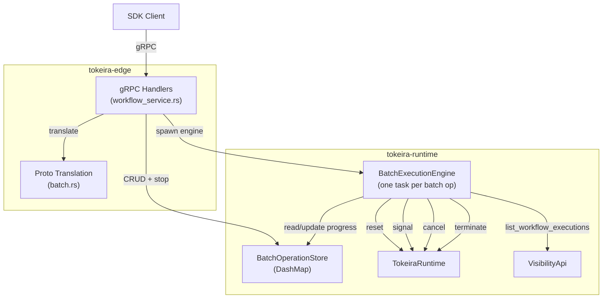
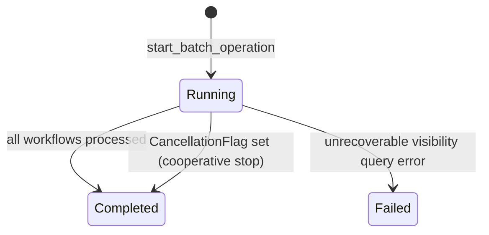

# Design Document: Edge Batch Operations Transport

## Overview

This design implements the Batch Operations Transport layer for Tokeira — 4 gRPC handlers for Temporal's batch operations feature, plus the backing `BatchOperationStore` and `BatchExecutionEngine`. Batch operations allow operators to perform bulk actions (terminate, cancel, signal, delete, reset) on workflow executions matching a visibility query or an explicit execution list.

The architecture follows the same principles as the schedule transport: the batch store lives in `tokeira-runtime` (using `DashMap`), proto translation stays in `tokeira-edge`, and the execution engine is a per-operation background task in `tokeira-runtime` using `CancellationToken` for cooperative stop.

This is simpler than schedule transport — no matching times computation, no overlap policies, no execution engine tick loop. Each batch operation spawns one tokio task that iterates workflows, applies the operation, and updates progress counters.

### Phased Delivery

| Phase | Scope | Handlers |
|-------|-------|----------|
| 1 | Batch store, start handler, proto translation | `start_batch_operation` |
| 2 | Execution engine (visibility iteration, operation dispatch, progress tracking, rate limiting) | — |
| 3 | Lifecycle handlers | `stop_batch_operation`, `describe_batch_operation`, `list_batch_operations` |

## Architecture



### Key Design Decisions

1. **In-memory batch store with `DashMap`** — `DashMap<(NamespaceId, JobId), BatchOperationEntry>` provides lock-free concurrent reads and fine-grained write locking. Same pattern as `ScheduleStore` and `VersioningRuleStore`. Durable persistence deferred to DSQL storage spec.

2. **One spawned task per batch operation** — Unlike the schedule engine (single ticker loop), each batch operation spawns its own tokio task. The task runs to completion or until cancelled. This is simpler and avoids the need for a shared tick loop since batch operations are finite.

3. **CancellationToken for cooperative stop** — Each `BatchOperationEntry` holds a `CancellationToken`. The `stop_batch_operation` handler calls `cancel()` on it. The engine checks `is_cancelled()` between individual workflow operations. Same pattern as `run_timer_scanner`.

4. **Progress via `AtomicU64` counters** — `total_operation_count`, `complete_operation_count`, and `failure_operation_count` are `AtomicU64` fields on the store entry, allowing lock-free updates from the engine task and reads from the describe handler.

5. **Rate limiting via `tokio::time::sleep`** — When `max_operations_per_second` is set, the engine sleeps `1.0 / rate` seconds between operations. Default rate limit of 50 ops/sec when unset, to prevent system overload.

6. **Engine calls runtime methods directly** — The `BatchExecutionEngine` lives in `tokeira-runtime` and calls `TokeiraRuntime::terminate_workflow`, `cancel_workflow`, `signal_workflow`, `reset_workflow` directly. For delete, it calls the edge-layer `delete_workflow_execution` path (which terminates then removes from visibility). This avoids a crate cycle.

7. **Visibility query via existing path** — The engine uses the existing `VisibilityApi::list_workflows` path with pagination to discover matching workflows. For explicit execution lists, it iterates the provided list directly.

8. **Shared ownership** — `Arc<BatchOperationStore>` shared between `WorkflowService` (handlers) and spawned engine tasks. Each engine task holds `Arc<TokeiraRuntime>` and `Arc<dyn VisibilityApi>`.

## Components and Interfaces

### BatchOperationStore

New file: `crates/tokeira-runtime/src/batch.rs`

```rust
use dashmap::DashMap;
use std::sync::atomic::{AtomicU64, Ordering};
use std::sync::Arc;
use time::OffsetDateTime;
use tokio_util::sync::CancellationToken;
use tokeira_types::{NamespaceId, Payloads, Header};

/// Unique batch job identifier within a namespace.
#[derive(Clone, Debug, PartialEq, Eq, Hash)]
pub struct JobId(pub String);

/// The type of batch operation to perform.
#[derive(Clone, Debug, PartialEq)]
pub enum BatchOperationType {
    Terminate,
    Cancel,
    Signal,
    Delete,
    Reset,
}

/// The lifecycle state of a batch operation.
#[derive(Clone, Debug, PartialEq, Copy)]
pub enum BatchOperationState {
    Running,
    Completed,
    Failed,
}

/// Parameters specific to each operation type.
#[derive(Clone, Debug, PartialEq)]
pub enum BatchOperationParams {
    Terminate {
        details: Option<Payloads>,
        identity: String,
    },
    Cancel {
        identity: String,
    },
    Signal {
        signal_name: String,
        input: Option<Payloads>,
        header: Option<Header>,
        identity: String,
    },
    Delete {
        identity: String,
    },
    Reset {
        identity: String,
        options: Option<tokeira_kernel::ResetOptions>,
    },
}
```

**Progress counters** (atomic, lock-free):

```rust
/// Atomic progress counters for a batch operation.
/// Updated by the engine task, read by the describe handler.
pub struct BatchProgressCounters {
    pub total: AtomicU64,
    pub complete: AtomicU64,
    pub failure: AtomicU64,
}
```

**Store entry:**

```rust
/// The full stored state of a batch operation.
pub struct BatchOperationEntry {
    pub job_id: JobId,
    pub namespace_id: NamespaceId,
    pub operation_type: BatchOperationType,
    pub operation_params: BatchOperationParams,
    pub state: BatchOperationState,
    pub start_time: OffsetDateTime,
    pub close_time: Option<OffsetDateTime>,
    pub counters: Arc<BatchProgressCounters>,
    pub visibility_query: Option<String>,
    pub executions: Option<Vec<WorkflowExecutionRef>>,
    pub reason: String,
    pub identity: String,
    pub max_operations_per_second: f32,
    pub cancellation_token: CancellationToken,
}

/// A reference to a specific workflow execution for explicit lists.
#[derive(Clone, Debug, PartialEq)]
pub struct WorkflowExecutionRef {
    pub workflow_id: String,
    pub run_id: Option<String>,
}
```

**Store:**

```rust
#[derive(Default)]
pub struct BatchOperationStore {
    entries: DashMap<(NamespaceId, JobId), BatchOperationEntry>,
}
```

**Public API:**

| Method | Description |
|--------|-------------|
| `create(&self, entry: BatchOperationEntry) -> Result<(), BatchError>` | Inserts new entry. Errors if already exists. |
| `describe(&self, ns, job_id) -> Result<BatchOperationSnapshot, BatchError>` | Returns a snapshot of the entry (with current counter values). Errors if not found. |
| `stop(&self, ns, job_id, reason, identity) -> Result<(), BatchError>` | Sets cancellation token, stores stop reason/identity. Errors if not found. Returns Ok for terminal states (idempotent). |
| `set_state(&self, ns, job_id, state, close_time) -> Result<(), BatchError>` | Updates state and close_time. Called by engine on completion/failure. |
| `list(&self, ns, page_size, page_token) -> (Vec<BatchOperationInfo>, Option<PageToken>)` | Paginated listing for a namespace. |
| `get_cancellation_token(&self, ns, job_id) -> Option<CancellationToken>` | Returns the cancellation token for the engine to check. |

`BatchOperationSnapshot` is a read-only view with counter values resolved from atomics:

```rust
/// Read-only snapshot of a batch operation entry.
pub struct BatchOperationSnapshot {
    pub job_id: JobId,
    pub namespace_id: NamespaceId,
    pub operation_type: BatchOperationType,
    pub state: BatchOperationState,
    pub start_time: OffsetDateTime,
    pub close_time: Option<OffsetDateTime>,
    pub total_operation_count: u64,
    pub complete_operation_count: u64,
    pub failure_operation_count: u64,
    pub identity: String,
    pub reason: String,
}

/// Summary info for list responses.
pub struct BatchOperationInfo {
    pub job_id: JobId,
    pub state: BatchOperationState,
    pub start_time: OffsetDateTime,
    pub close_time: Option<OffsetDateTime>,
}
```

### BatchExecutionEngine

Background task in `crates/tokeira-runtime/src/batch.rs`:

```rust
/// Run a single batch operation to completion or cancellation.
///
/// This function is spawned as a tokio task per batch operation.
/// It iterates matching workflows (via visibility query or explicit list),
/// applies the requested operation, and updates progress counters.
pub async fn run_batch_operation<R>(
    store: Arc<BatchOperationStore>,
    runtime: Arc<TokeiraRuntime<R>>,
    visibility: Arc<dyn VisibilityApi>,
    namespace_id: NamespaceId,
    job_id: JobId,
    cancellation_token: CancellationToken,
) where
    R: RunRepository + 'static,
{
    // 1. Read operation params from store
    // 2. Discover workflows (visibility query with pagination, or explicit list)
    // 3. For each workflow:
    //    a. Check cancellation_token.is_cancelled()
    //    b. Apply operation (terminate/cancel/signal/delete/reset)
    //    c. Increment complete or failure counter
    //    d. Sleep for rate limiting
    // 4. Set state to Completed (or Failed on unrecoverable error)
}
```

**Rate limiting logic:**

```rust
const DEFAULT_RATE_LIMIT: f32 = 50.0;

fn compute_sleep_duration(max_ops_per_second: f32) -> tokio::time::Duration {
    let rate = if max_ops_per_second > 0.0 {
        max_ops_per_second
    } else {
        DEFAULT_RATE_LIMIT
    };
    tokio::time::Duration::from_secs_f64(1.0 / rate as f64)
}
```

**Operation dispatch:**

```rust
/// Apply the batch operation to a single workflow execution.
async fn apply_operation<R>(
    runtime: &TokeiraRuntime<R>,
    namespace_id: NamespaceId,
    workflow_ref: &WorkflowExecutionRef,
    params: &BatchOperationParams,
) -> Result<(), anyhow::Error>
where
    R: RunRepository + 'static,
{
    let execution = ExecutionRef {
        namespace_id,
        workflow_id: workflow_ref.workflow_id.clone(),
        run_id: workflow_ref.run_id.clone(),
    };
    match params {
        BatchOperationParams::Terminate { details, identity } => {
            runtime.terminate_workflow(execution, TerminateRequest { ... }).await?;
        }
        BatchOperationParams::Cancel { identity } => {
            runtime.cancel_workflow(execution, CancelRequest { ... }).await?;
        }
        BatchOperationParams::Signal { signal_name, input, .. } => {
            runtime.signal_workflow(execution, SignalRequest { ... }).await?;
        }
        BatchOperationParams::Delete { identity } => {
            // Delete uses terminate + visibility removal
            runtime.terminate_workflow(execution, TerminateRequest { ... }).await?;
        }
        BatchOperationParams::Reset { options, identity } => {
            runtime.reset_workflow(execution, ResetRequest { ... }).await?;
        }
    }
    Ok(())
}
```

### Proto Translation

New file: `crates/tokeira-edge/src/translate/batch.rs`

| Function | Direction | Description |
|----------|-----------|-------------|
| `start_batch_request_to_edge()` | proto → domain | Parse `StartBatchOperationRequest` into creation params |
| `describe_batch_response_to_proto()` | domain → proto | Build `DescribeBatchOperationResponse` from `BatchOperationSnapshot` |
| `list_batch_response_to_proto()` | domain → proto | Build `ListBatchOperationsResponse` from `Vec<BatchOperationInfo>` |
| `batch_operation_type_to_proto()` | domain → proto | Map internal `BatchOperationType` to proto enum |
| `batch_operation_type_from_proto()` | proto → domain | Map proto enum to internal `BatchOperationType` |
| `batch_operation_state_to_proto()` | domain → proto | Map internal `BatchOperationState` to proto enum |
| `batch_operation_state_from_proto()` | proto → domain | Map proto enum to internal `BatchOperationState` |

### Integration with WorkflowService

Add `batch_store: Arc<BatchOperationStore>` to the `WorkflowService` struct (same pattern as `schedule_store`):

```rust
pub struct WorkflowService {
    // ... existing fields ...
    batch_store: Arc<BatchOperationStore>,
}
```

The `start_batch_operation` handler:
1. Translates the proto request
2. Validates inputs (non-empty job_id, presence of query/executions, presence of operation variant)
3. Creates the store entry
4. Spawns `run_batch_operation` as a tokio task
5. Returns success

## Data Models

### BatchOperationEntry (per namespace + job_id)

| Field | Type | Description |
|-------|------|-------------|
| `job_id` | `JobId` | Unique identifier within namespace |
| `namespace_id` | `NamespaceId` | Owning namespace |
| `operation_type` | `BatchOperationType` | Terminate, Cancel, Signal, Delete, or Reset |
| `operation_params` | `BatchOperationParams` | Type-specific parameters (signal name, termination details, etc.) |
| `state` | `BatchOperationState` | Running, Completed, or Failed |
| `start_time` | `OffsetDateTime` | When the batch operation was created |
| `close_time` | `Option<OffsetDateTime>` | When the batch operation finished (None while Running) |
| `counters` | `Arc<BatchProgressCounters>` | Atomic progress counters |
| `visibility_query` | `Option<String>` | Visibility query for discovering workflows |
| `executions` | `Option<Vec<WorkflowExecutionRef>>` | Explicit list of workflow executions |
| `reason` | `String` | User-provided reason for the batch operation |
| `identity` | `String` | Identity of the caller |
| `max_operations_per_second` | `f32` | Rate limit (0 = use default) |
| `cancellation_token` | `CancellationToken` | For cooperative stop |

### BatchProgressCounters

| Field | Type | Description |
|-------|------|-------------|
| `total` | `AtomicU64` | Total workflows discovered |
| `complete` | `AtomicU64` | Successfully processed workflows |
| `failure` | `AtomicU64` | Failed individual operations |

### BatchOperationState Lifecycle




## Correctness Properties

*A property is a characteristic or behavior that should hold true across all valid executions of a system — essentially, a formal statement about what the system should do. Properties serve as the bridge between human-readable specifications and machine-verifiable correctness guarantees.*

### Property 1: Batch store CRUD correctness

*For any* sequence of create and describe operations applied to a `BatchOperationStore`: (a) creating an entry and then describing it returns a snapshot with matching job_id, namespace_id, operation_type, state, identity, and reason; (b) creating an entry with an existing (namespace_id, job_id) returns `ALREADY_EXISTS`; (c) describing or stopping a non-existent (namespace_id, job_id) returns `NOT_FOUND`.

**Validates: Requirements 1.1, 1.3, 1.4**

### Property 2: Progress counter accuracy

*For any* batch operation with N total workflows where S succeed and F fail (S + F = N), after the engine completes: `total_operation_count` SHALL equal N, `complete_operation_count` SHALL equal S, and `failure_operation_count` SHALL equal F.

**Validates: Requirements 1.5, 4.8, 4.9, 4.10**

### Property 3: Proto translation round-trip for batch types

*For any* valid internal `BatchOperationType`, converting to proto and back SHALL produce the same variant. *For any* valid internal `BatchOperationState`, converting to proto and back SHALL produce the same variant. *For any* valid `BatchOperationSnapshot`, converting to a `DescribeBatchOperationResponse` proto SHALL preserve all modeled fields (job_id, state, start_time, close_time, counters, identity, reason).

**Validates: Requirements 3.1, 3.2, 3.3, 3.5, 3.6**

### Property 4: Proto validation rejects invalid inputs

*For any* `StartBatchOperationRequest` proto with an empty job_id, or missing operation variant, or missing both visibility_query and executions, the translation function SHALL return an error rather than silently defaulting.

**Validates: Requirements 3.4**

### Property 5: Pagination completeness

*For any* set of batch operations in a namespace and *for any* page size, iterating through all pages using `next_page_token` SHALL return every batch operation exactly once with no duplicates and no omissions. Each `BatchOperationInfo` SHALL include `job_id`, `state`, `start_time`, and `close_time`.

**Validates: Requirements 9.1, 9.2, 9.3, 9.4, 9.5**

### Property 6: Idempotent stop on terminal state

*For any* batch operation in a terminal state (`Completed` or `Failed`), calling `stop` SHALL return success without error.

**Validates: Requirements 7.3**

## Error Handling

### Batch Store Errors

| Error | gRPC Status | Trigger |
|-------|-------------|---------|
| Batch operation already exists | `ALREADY_EXISTS` | `start_batch_operation` with existing job_id in namespace |
| Batch operation not found | `NOT_FOUND` | describe/stop on non-existent (namespace_id, job_id) |

### Handler Validation Errors

| Handler | Error | gRPC Status |
|---------|-------|-------------|
| `start_batch_operation` | Empty job_id | `INVALID_ARGUMENT` |
| `start_batch_operation` | Missing visibility_query and executions | `INVALID_ARGUMENT` |
| `start_batch_operation` | Missing operation variant | `INVALID_ARGUMENT` |
| `describe_batch_operation` | Missing namespace or job_id | `INVALID_ARGUMENT` |
| `stop_batch_operation` | Missing namespace or job_id | `INVALID_ARGUMENT` |

### Execution Engine Errors

| Error | Behavior |
|-------|----------|
| Individual operation fails (workflow not found, conflict) | Increment `failure_operation_count`, continue processing |
| Visibility query pagination fails (unrecoverable) | Set state to `Failed`, record `close_time` |
| CancellationToken cancelled | Stop processing, set state to `Completed`, record `close_time` |

## Testing Strategy

### Property-Based Tests (proptest, minimum 100 iterations each)

| Test | Property | Description |
|------|----------|-------------|
| `property_batch_store_crud_correctness` | Property 1 | Generate random create/describe sequences, verify state matches: create-then-describe round-trip, ALREADY_EXISTS on duplicate, NOT_FOUND on missing |
| `property_progress_counter_accuracy` | Property 2 | Generate random success/failure outcome sequences, run engine with mock runtime, verify final counters match expected sums |
| `property_proto_translation_round_trip` | Property 3 | Generate random BatchOperationType and BatchOperationState values, verify round-trip through proto conversion. Generate random BatchOperationSnapshot, verify describe response preserves all fields |
| `property_proto_validation_rejects_invalid` | Property 4 | Generate StartBatchOperationRequest protos with various invalid fields (empty job_id, missing operation, missing query+executions), verify translation returns errors |
| `property_pagination_completeness` | Property 5 | Generate random batch operation sets and page sizes, verify iterating all pages returns every entry exactly once with correct info fields |
| `property_idempotent_stop_on_terminal` | Property 6 | Generate batch operations in Completed or Failed state, call stop, verify success returned |

Each property test is tagged: `// Feature: edge-batch-operations-transport, Property N: <title>`

### Unit Tests (example-based)

| Test | Requirement | Description |
|------|-------------|-------------|
| `test_start_creates_running_entry` | 2.1 | Start with valid params, verify entry exists with Running state and start_time |
| `test_start_empty_job_id_rejected` | 2.2 | Empty job_id returns INVALID_ARGUMENT |
| `test_start_missing_query_and_executions_rejected` | 2.3 | Neither field set returns INVALID_ARGUMENT |
| `test_start_missing_operation_rejected` | 2.4 | No operation variant returns INVALID_ARGUMENT |
| `test_start_duplicate_job_id_rejected` | 2.5 | Duplicate job_id returns ALREADY_EXISTS |
| `test_start_stores_reason_identity_rate` | 2.7 | Verify reason, identity, max_operations_per_second stored |
| `test_start_stores_signal_params` | 2.8 | Signal variant stores signal_name, input, header |
| `test_start_stores_termination_params` | 2.9 | Termination variant stores details |
| `test_start_stores_reset_params` | 2.10 | Reset variant stores options |
| `test_engine_completes_with_close_time` | 5.1 | Engine finishes, state is Completed with close_time |
| `test_engine_fails_on_visibility_error` | 5.2 | Visibility error sets state to Failed with close_time |
| `test_default_rate_limit_applied` | 5.4 | Zero rate uses default 50 ops/sec |
| `test_stop_sets_cancellation_flag` | 7.1 | Stop on Running op sets cancellation token |
| `test_stop_not_found` | 7.2 | Stop on non-existent returns NOT_FOUND |
| `test_stop_stores_reason_identity` | 7.4 | Stop stores reason and identity |
| `test_describe_not_found` | 8.2 | Describe non-existent returns NOT_FOUND |
| `test_describe_terminal_has_close_time` | 8.4 | Completed op has close_time in describe |
| `test_list_empty_namespace` | 9.6 | Empty namespace returns empty list, no token |
| `test_cancellation_stops_processing` | 6.2 | Cancel mid-batch, verify state Completed and remaining workflows skipped |
| `test_cancellation_preserves_applied_ops` | 6.3 | Cancel mid-batch, verify already-applied ops not rolled back |

### Integration Tests

| Test | Requirement | Description |
|------|-------------|-------------|
| `test_engine_spawned_on_start` | 2.6 | Start batch op, verify engine processes workflows (progress counts advance) |
| `test_engine_terminates_workflows` | 4.3 | Mock runtime, start terminate batch, verify terminate_workflow called per workflow |
| `test_engine_cancels_workflows` | 4.4 | Mock runtime, start cancel batch, verify cancel_workflow called |
| `test_engine_signals_workflows` | 4.5 | Mock runtime, start signal batch, verify signal_workflow called with params |
| `test_engine_deletes_workflows` | 4.6 | Mock runtime, start delete batch, verify delete path called |
| `test_engine_resets_workflows` | 4.7 | Mock runtime, start reset batch, verify reset_workflow called with options |
| `test_engine_follows_visibility_pagination` | 4.1 | Mock visibility with multiple pages, verify all pages consumed |
| `test_engine_iterates_explicit_list` | 4.2 | Start with explicit list, verify all executions processed |
| `test_describe_running_shows_progress` | 8.3 | Describe mid-execution, verify partial progress counts |
| `test_rate_limiting_respected` | 5.3 | Set rate limit, verify sleep between operations |

### Test Library

All property-based tests use `proptest` (already a project dependency). Configuration: `ProptestConfig { cases: 100, .. }` minimum.
