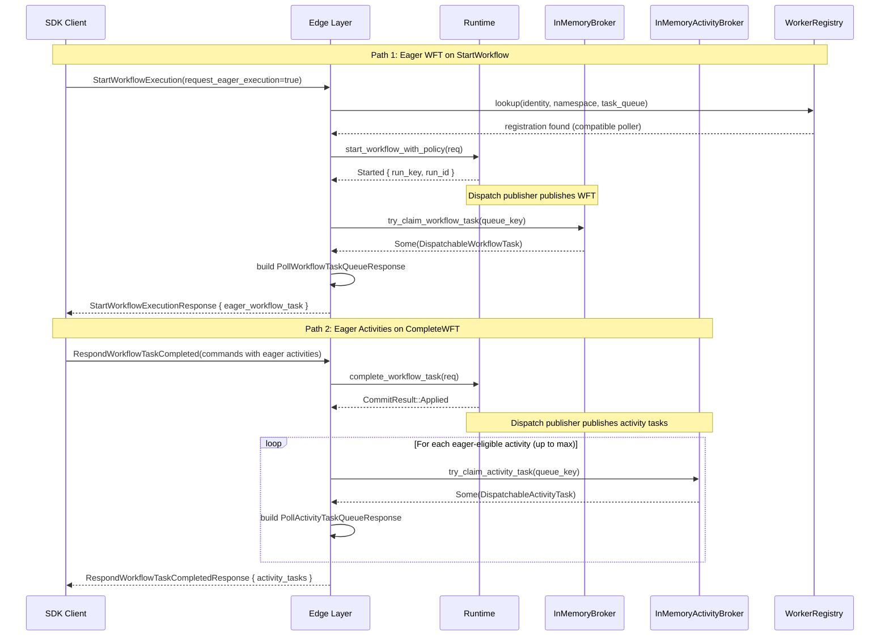

# Design Document: Edge Eager Dispatch

## Overview

Eager dispatch is a latency optimization that returns a workflow task or activity task inline with the gRPC response that triggered it, eliminating a separate poll round-trip. This design covers two independent paths:

1. **Eager WFT on `StartWorkflowExecution`**: After `runtime.start_workflow_with_policy` commits and the dispatch publisher publishes the first WFT to the `InMemoryBroker`, the edge start handler attempts a non-blocking `try_claim_workflow_task` on the broker. If the claim succeeds and the caller is a compatible poller (verified via `WorkerRegistry`), the claimed task is built into a `PollWorkflowTaskQueueResponse` and returned in `StartWorkflowExecutionResponse.eager_workflow_task`.

2. **Eager activity tasks on `RespondWorkflowTaskCompleted`**: After `runtime.complete_workflow_task` commits and the dispatch publisher publishes activity tasks to the `InMemoryActivityBroker`, the edge complete handler attempts non-blocking `try_claim_activity_task` calls for each eager-eligible activity command. Claimed tasks are built into `PollActivityTaskQueueResponse` entries and returned in `RespondWorkflowTaskCompletedResponse.activity_tasks`.

Both paths reuse the existing poll response building and task token encoding. No new timeout or recovery mechanisms are introduced — eagerly claimed tasks are indistinguishable from normally polled tasks once claimed, so the existing WFT timeout scanner and activity timeout scanners handle recovery if the client drops.

The edge layer already has a partial eager pattern: `build_eager_query_workflow_task` builds an inline query-only WFT when `return_new_workflow_task=true` and buffered queries exist. This spec extends that pattern to the two proto-defined eager dispatch paths.

## Architecture



The `try_claim_*` methods are simple non-blocking take operations: acquire the broker's `Mutex`, pop from the front of the ready queue, remove from the dedup set, release the lock, return. They never wake pollers and never block.

## Components and Interfaces

### Broker Layer (`tokeira-runtime/src/broker.rs`)

Two new public methods on existing structs:

```rust
impl InMemoryBroker {
    /// Non-blocking claim of the next general-tier workflow task for `queue`.
    /// Returns `None` if the queue is empty. Removes the task from the
    /// deduplication set so it cannot be delivered again via normal polling.
    /// Does not wake any waiting pollers.
    pub async fn try_claim_workflow_task(
        &self,
        queue: &QueueKey,
    ) -> Option<DispatchableWorkflowTask>;
}

impl InMemoryActivityBroker {
    /// Non-blocking claim of the next activity task for `queue`.
    /// Returns `None` if the queue is empty. Removes the task from the
    /// deduplication set so it cannot be delivered again via normal polling.
    /// Does not wake any waiting pollers.
    pub async fn try_claim_activity_task(
        &self,
        queue: &QueueKey,
    ) -> Option<DispatchableActivityTask>;
}
```

Both follow the same pattern as the existing `try_take` private methods but skip sticky-tier logic (eager claims target the general tier only) and skip the worker-deny check (the caller has already been validated as a compatible poller).

### Worker Registry Check (`tokeira-runtime/src/worker_registry.rs`)

A new method on `WorkerRegistry`:

```rust
impl WorkerRegistry {
    /// Returns true if a worker with the given identity is registered
    /// on the specified (namespace, task_queue) combination.
    pub fn is_compatible_poller(
        &self,
        worker_identity: &WorkerIdentity,
        namespace_id: NamespaceId,
        task_queue: &TaskQueueName,
    ) -> bool;
}
```

This is a simple `HashMap::contains_key` check on the existing `inner` map using a `WorkerRegistrationKey`.

### Edge Layer — Start Handler (`tokeira-edge/src/workflow_service.rs`)

`start_workflow_execution` gains an eager dispatch tail after the `Started` branch:

1. Check `request_eager_execution` flag on the request.
2. If true, call `worker_registry.is_compatible_poller(identity, namespace_id, task_queue)`.
3. If compatible, call `broker.try_claim_workflow_task(&queue_key)`.
4. If claimed, build a `PollWorkflowTaskQueueResponse` using `from_internal::poll_response` (same path as normal polling) and attach it to the response.

### Edge Layer — Complete Handler (`tokeira-edge/src/workflow_service.rs`)

`respond_workflow_task_completed` gains an eager activity dispatch tail after the commit:

1. Collect eager-eligible activity commands (those with `request_eager_execution=true`).
2. For each eligible command (up to the configured max), call `activity_broker.try_claim_activity_task(&queue_key)`.
3. For each claimed task, build a `PollActivityTaskQueueResponse` using `from_internal::poll_activity_response` (same path as normal polling).
4. Attach the list to the response.

### DTO Changes

**`StartWorkflowExecutionRequest`** (translate/mod.rs): Add `request_eager_execution: bool` and `identity: Option<String>` (identity is already present but needs threading).

**`StartWorkflowExecutionResponse`** (translate/mod.rs): Add `eager_workflow_task: Option<PollWorkflowTaskQueueResponse>`.

**`RespondWorkflowTaskCompletedResponse`** (translate/mod.rs): Add `activity_tasks: Vec<PollActivityTaskQueueResponse>`.

**`ScheduleActivityTask` command** (kernel): The `request_eager_execution` flag needs to be threaded through the command representation.

### Proto Translation (`tokeira-edge/src/grpc/translate.rs`)

**`start_response_to_proto`**: Serialize the optional `eager_workflow_task` using the existing `poll_response_to_proto` function.

**`completed_response_to_proto`**: Serialize the `activity_tasks` list using the existing `poll_activity_response_to_proto` function (to be extracted or reused from the activity poll path).

**`start_request_to_edge`**: Parse `request_eager_execution` from the proto request.

### Configuration

A new config field on the edge layer for the maximum number of eager activity tasks per completion response. Default: 3.

```rust
pub struct EagerDispatchConfig {
    /// Maximum number of activity tasks returned inline per
    /// RespondWorkflowTaskCompleted response.
    pub max_eager_activity_tasks_per_response: usize,
}
```

## Data Models

### Existing Types (Unchanged)

- `DispatchableWorkflowTask` — the broker entry for workflow tasks, keyed by `(RunKey, LogicalTaskSeq)`.
- `DispatchableActivityTask` — the broker entry for activity tasks, keyed by `(RunKey, activity_id, attempt)`.
- `WorkflowTaskToken` — the serde-serialized task token containing `run_key`, `logical_seq`, `started_event_id`, `attempt`, `shard_epoch`.
- `QueueKey` — the `(namespace_id, task_queue, task_kind, deployment, build_id)` tuple used to key broker queues.
- `WorkerRegistrationKey` — the `(worker_identity, namespace_id, task_queue)` tuple used to key the worker registry.

### Modified Types

**`StartWorkflowExecutionRequest`** (edge DTO):
```rust
pub struct StartWorkflowExecutionRequest {
    // ... existing fields ...
    pub request_eager_execution: bool,
}
```

**`StartWorkflowExecutionResponse`** (edge DTO):
```rust
pub struct StartWorkflowExecutionResponse {
    // ... existing fields ...
    pub eager_workflow_task: Option<PollWorkflowTaskQueueResponse>,
}
```

**`RespondWorkflowTaskCompletedResponse`** (edge DTO):
```rust
pub struct RespondWorkflowTaskCompletedResponse {
    // ... existing fields ...
    pub activity_tasks: Vec<PollActivityTaskQueueResponse>,
}
```

No new storage tables or persistent state. The broker's in-memory `HashMap<QueueKey, VecDeque<...>>` and `HashSet` dedup structures are the only data touched, and they already exist.


## Correctness Properties

*A property is a characteristic or behavior that should hold true across all valid executions of a system — essentially, a formal statement about what the system should do. Properties serve as the bridge between human-readable specifications and machine-verifiable correctness guarantees.*

### Property 1: request_eager_execution flag preservation

*For any* `StartWorkflowExecutionRequest` proto with `request_eager_execution` set to any boolean value, translating to the internal DTO and back should preserve the flag value exactly.

**Validates: Requirements 1.1, 1.2**

### Property 2: Compatible poller lookup correctness

*For any* `WorkerRegistrationKey` (worker_identity, namespace_id, task_queue), `is_compatible_poller` SHALL return `true` if and only if the key has been registered in the `WorkerRegistry`.

**Validates: Requirements 2.2, 2.3**

### Property 3: Workflow broker try_claim correctness

*For any* sequence of workflow tasks published to the `InMemoryBroker` on a given `QueueKey`, calling `try_claim_workflow_task` SHALL return `Some(task)` when the general ready queue is non-empty (removing the task from both the ready queue and the deduplication set), and SHALL return `None` without blocking when the queue is empty.

**Validates: Requirements 9.1, 9.2, 9.3, 9.4**

### Property 4: Activity broker try_claim correctness

*For any* sequence of activity tasks published to the `InMemoryActivityBroker` on a given `QueueKey`, calling `try_claim_activity_task` SHALL return `Some(task)` when the ready queue is non-empty (removing the task from both the ready queue and the deduplication set), and SHALL return `None` without blocking when the queue is empty.

**Validates: Requirements 10.1, 10.2, 10.3, 10.4**

### Property 5: Eager activity task limit enforcement

*For any* number of eager-eligible activity commands in a `RespondWorkflowTaskCompletedRequest`, the number of activity tasks returned in the response SHALL never exceed `max_eager_activity_tasks_per_response`.

**Validates: Requirements 7.1, 7.2**

### Property 6: Eager activity flag threading through commands

*For any* `ScheduleActivityTask` command with `request_eager_execution` set to any boolean value, translating through the internal command representation SHALL preserve the flag value exactly.

**Validates: Requirements 5.1, 5.2, 5.3**

### Property 7: Start response proto translation preserves eager_workflow_task

*For any* internal `StartWorkflowExecutionResponse`, the proto translation SHALL set the `eager_workflow_task` field if and only if the internal response contains `Some(eager_workflow_task)`.

**Validates: Requirements 4.1, 4.2**

### Property 8: Complete response proto translation preserves activity_tasks

*For any* internal `RespondWorkflowTaskCompletedResponse`, the proto translation SHALL populate the `activity_tasks` repeated field with exactly the same number of entries as the internal response's `activity_tasks` list.

**Validates: Requirements 8.1, 8.2**

### Property 9: Claimed task is not delivered to normal pollers

*For any* workflow task published to the `InMemoryBroker`, if `try_claim_workflow_task` returns `Some(task)`, then a subsequent `poll_workflow_task` on the same queue SHALL NOT return that task.

**Validates: Requirements 9.2, 9.4**

### Property 10: Claimed activity task is not delivered to normal pollers

*For any* activity task published to the `InMemoryActivityBroker`, if `try_claim_activity_task` returns `Some(task)`, then a subsequent `poll_activity_task` on the same queue SHALL NOT return that task.

**Validates: Requirements 10.2, 10.4**

## Error Handling

### Claim Failures

Both `try_claim_workflow_task` and `try_claim_activity_task` return `Option` — they never error. A `None` result means the task was not available (race with a poller, not yet published, or queue empty). The edge handler treats `None` as a no-op: the response is returned without the eager field, and the task will be delivered via normal polling.

### Proto Translation Errors

If `serde_json::to_vec` fails when encoding the task token for an eagerly claimed task, the error is logged and the eager field is omitted from the response. The claimed task is effectively lost from the broker, but the existing WFT/activity timeout scanner will detect the non-completion and reschedule it.

### Connection Drop After Eager Response

If the gRPC response containing an eager task fails to reach the client (connection drop, client crash), the claimed task is never completed. The existing timeout scanners handle recovery:
- WFT timeout scanner reschedules the workflow task after `workflow_task_timeout`.
- Activity timeout scanners reschedule the activity after `schedule_to_start_timeout` or `start_to_close_timeout`.

No special error handling is needed because eagerly claimed tasks are indistinguishable from normally polled tasks once claimed.

### Incompatible Poller

If the caller is not a compatible poller (not registered in `WorkerRegistry`), the eager dispatch path is skipped entirely. The response is returned without the eager field. This is not an error — it's the expected behavior for clients that don't poll on the workflow's task queue.

## Testing Strategy

### Property-Based Tests (using `proptest`)

Each correctness property maps to a property-based test with minimum 100 iterations:

- **Broker claim tests** (Properties 3, 4, 9, 10): Generate random `QueueKey` values and task sequences, publish to the broker, claim, and verify the invariants. These are pure in-memory operations — fast and deterministic.
- **WorkerRegistry tests** (Property 2): Generate random registration keys, register/unregister, verify `is_compatible_poller` correctness. The registry is already tested with proptest; extend the existing suite.
- **Proto translation tests** (Properties 1, 6, 7, 8): Generate random DTO instances, translate to/from proto, verify field preservation.
- **Limit enforcement** (Property 5): Generate random counts of eager-eligible commands, verify the response never exceeds the configured maximum.

Tag format: `Feature: edge-eager-dispatch, Property {N}: {title}`

### Unit Tests

- `try_claim_workflow_task` on an empty queue returns `None`.
- `try_claim_workflow_task` does not wake waiting pollers (use a `Notify` listener to verify no wake).
- `try_claim_activity_task` does not wake waiting pollers.
- `start_response_to_proto` with `eager_workflow_task: None` leaves the proto field unset.
- `completed_response_to_proto` with empty `activity_tasks` produces an empty repeated field.
- `EagerDispatchConfig` default value is 3.

### Integration Tests

- Start a workflow with `request_eager_execution=true` and a registered compatible poller → response contains `eager_workflow_task` with valid task token and history.
- Start a workflow with `request_eager_execution=true` but no registered poller → response has no `eager_workflow_task`.
- Complete a WFT with eager-eligible activity commands → response contains `activity_tasks`.
- Complete a WFT with more eager-eligible activities than the configured max → response contains exactly `max` activity tasks.
- Claim an eager WFT, don't complete it → WFT timeout scanner reschedules it.
- Claim an eager activity, don't complete it → activity timeout scanner reschedules it.
