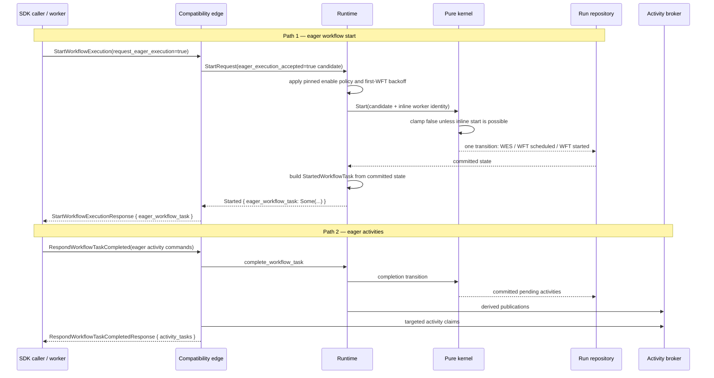

# Design Document: Edge Eager Dispatch

## Overview

Eager dispatch returns work inline with the RPC that made it ready. This design covers two independent paths:

1. **Eager workflow start.** `StartWorkflowExecution(request_eager_execution=true)` is pre-gated by the runtime. When enabled and free of first-WFT backoff, the existing reserved-start kernel branch commits `WorkflowExecutionStarted`, `WorkflowTaskScheduled`, and `WorkflowTaskStarted` together. The runtime builds the inline poll response from that committed state; the workflow broker is not part of the correctness path.
2. **Eager activity dispatch.** Eager-eligible activities authored by `RespondWorkflowTaskCompleted` are committed first, published as a derived effect, then targeted-claimed from the activity broker for the inline response.

Wire shape comes from `proto/upstream/`. Behaviour is grounded in `service/history/api/startworkflow/api.go`, `service/history/api/create_workflow_util.go`, and `service/history/historybuilder/event_factory.go @ v1.31.0`. In particular, the API handler decides acceptance and the history event records that already-gated decision. A server-observed active poller is not an acceptance condition.

## Dependencies and Non-Goals

- Poll response fidelity and task-token encoding remain owned by the existing poll path.
- Workflow-task start-to-close recovery and activity timeout recovery remain unchanged.
- The eager-enable value is the pinned v1.31.0 default `true`; this work does not add an operator configuration knob.
- `WorkflowCommand::ScheduleActivity.request_eager_execution` is eager **activity** dispatch and remains distinct from workflow-start acceptance.
- Targeted workflow-broker claims remain available for non-start direct-delivery paths, but eager workflow start no longer depends on them.

## Architecture



The workflow-start path structurally subsumes Temporal's `task_already_dispatched` denial race: the first WFT is either committed as started for the inline caller or remains on the normal dispatch path. There is no publish-then-reclaim window.

## Components and Interfaces

### Runtime Admission and Start Preparation

The edge faithfully threads `request_eager_execution`. The runtime converts that request into the kernel-facing `eager_execution_accepted` candidate using the pinned enable value. After applying client-cron/start-delay normalization, it clamps the candidate to false when the effective first-WFT backoff is positive.

For an accepted start, the runtime sets `reserved_poller_identity` to the request caller's identity without consulting `PollerRegistry` or reserving a parked broker poller. This reuses the kernel's existing atomic direct-start mechanism while keeping active-poller liveness out of the public acceptance contract. Non-eager starts may continue using the existing broker-reserved sync-match optimisation.

### Kernel Start Event and Clamp

`StartRequest` gains an `eager_execution_accepted: bool` input. The kernel never promotes it to true. It records true only when:

- the runtime supplied true;
- `positive_start_delay(workflow_start_delay)` is absent; and
- `reserved_poller_identity` is present, so this transition actually starts the first WFT.

If any condition is absent, the kernel records false and follows the existing delayed or normally dispatched start branch.

The persisted history enum uses postcard's positional encoding. Adding a field in place to `WorkflowExecutionStarted` is unsafe: the old variant has no encoded field count, so a new decoder would consume EOF or the next event byte instead of invoking `#[serde(default)]`. The design therefore preserves `WorkflowExecutionStarted` byte-for-byte as a legacy decode shape and appends `WorkflowExecutionStartedV2` as the new emitted variant. Both serialize to Temporal event type `WORKFLOW_EXECUTION_STARTED`; V1 maps `eager_execution_accepted=false`, while V2 carries the durable bool.

This follows the existing `WorkflowExecutionUpdateCompletedV2` compatibility precedent. A pre-change byte fixture proves that the immediate pre-Tier-3.18 V1 batch still decodes; a V2 round trip guards the new encoding.

### Runtime Result and Request-ID Retry

`StartWorkflowResult::Started` and `StartWorkflowResult::Deduped` carry an optional `StartedWorkflowTask`.

- A fresh accepted start builds the task from the just-committed state.
- An immediate same-request-ID retry loads event 1 and the existing run, then returns the task only when the event records `eager_execution_accepted=true`, the current pending WFT is still the first started WFT (`started_event_id == 3`, `attempt == 1`), and its start-to-close deadline has not elapsed.
- After timeout/fallback, after the deadline elapses even if the coarse scanner has not yet authored the timeout, or when no such task exists, the deduped response omits the eager task.

Reconstruction reads authoritative run state and history. It never depends on a broker entry and never authors another transition.

### Edge Translation and Capability Advertisement

The edge removes the `PollerRegistry::has_active_poller` gate and the post-publication workflow-broker claim. It maps the runtime's optional started task through the normal `from_internal::poll_response` path.

History serialization handles both started-event variants:

- legacy `WorkflowExecutionStarted` -> proto `eager_execution_accepted=false`;
- `WorkflowExecutionStartedV2` -> the persisted value.

Because the v1.31.0 default is enabled and Tier 3.18 exercises the behaviour, `GetSystemInfo.capabilities.eager_workflow_start` and namespace capabilities report true. The compatibility matrix moves to `Implemented` only after the suite is clean.

### Activity Broker Path

The activity path retains `try_claim_activity_task(queue, run_key, activity_id)`. Claims occur only after the completion transition and derived publication. A failed claim leaves correctness in the authoritative pending activity and normal polling remains the fallback.

`try_claim_workflow_task` remains a supported direct-delivery primitive for callers other than eager workflow start. Its targeted-removal and dedup-set invariants remain covered.

## Data Models

### Kernel Start Request

```rust
pub struct StartRequest {
    // existing fields
    pub eager_execution_accepted: bool,
}
```

All non-eager and internally derived start constructors set this field to false. The public workflow-start translator supplies the pre-gated candidate.

### Durable Started Event

```rust
pub enum HistoryEventKind {
    WorkflowExecutionStarted {
        // unchanged legacy fields; decode-only after this change
    },
    // appended last in the enum
    WorkflowExecutionStartedV2 {
        // same semantic fields
        eager_execution_accepted: bool,
    },
}
```

No new `WorkflowState` field or storage table is required. The acceptance value is authoritative in event 1, and the pending started WFT already exists in durable state.

### Runtime Start Result

```rust
pub enum StartWorkflowResult {
    Started {
        run_key: RunKey,
        run_id: RunId,
        mutation_metadata: MutationMetadata,
        eager_workflow_task: Option<StartedWorkflowTask>,
    },
    Deduped {
        run_key: RunKey,
        run_id: RunId,
        execution_status: ExecutionStatus,
        eager_workflow_task: Option<StartedWorkflowTask>,
    },
    // unchanged remaining variants
}
```

## Correctness Properties

### Property 1: Request flag preservation

*For any* `StartWorkflowExecutionRequest`, proto-to-edge translation SHALL preserve `request_eager_execution` exactly.

**Validates: Requirements 1.1, 1.2**

### Property 2: Runtime eager admission

*For any* requested flag, enable value, and effective first-WFT backoff, runtime admission SHALL yield true exactly when requested and enabled and the backoff is not positive; it SHALL not depend on `PollerRegistry` state.

**Validates: Requirements 2.1, 2.3, 2.4, 2.5**

### Property 3: Kernel acceptance clamp

*For any* runtime-supplied acceptance value, start delay, and optional inline worker identity, the kernel SHALL record true only when the supplied value is true, the delay is not positive, and the identity is present; it SHALL never promote false to true.

**Validates: Requirements 2.6, 2.7, 3.1, 3.7, 3.8**

### Property 4: Atomic eager-start history

*For any* accepted fresh start, the committed transition SHALL contain a V2 started event with `eager_execution_accepted=true`, a scheduled first WFT, and a started first WFT in that order, with no workflow-broker publication required for delivery.

**Validates: Requirements 3.1, 3.2, 3.3, 12.1**

### Property 5: Inline response/history agreement

*For any* successful fresh start response, `eager_workflow_task.is_some()` SHALL equal the effective `eager_execution_accepted` value serialized from committed event 1.

**Validates: Requirements 3.7, 3.8, 4.1, 4.2, 4.3**

### Property 6: Request-ID retry reconstruction

*For any* deduped eager start, the runtime SHALL return an eager task exactly when authoritative event 1 records eager acceptance, the pending WFT remains started with event ID 3 and attempt 1, and its deadline remains live, without changing transition sequence or history.

**Validates: Requirements 13.1, 13.2, 13.3, 13.4**

### Property 7: Legacy started-event decoding

*For the recorded pre-Tier-3.18 V1 history bytes*, decoding SHALL preserve the legacy event and serialize it with `eager_execution_accepted=false`; newly encoded V2 events SHALL round-trip their bool.

**Validates: Requirements 4.3, 4.4**

### Property 8: Activity targeted-claim correctness

*For any* sequence of activity tasks, `try_claim_activity_task` SHALL remove only the requested `(run_key, activity_id)` entry and its dedup key, leaving all other entries available.

**Validates: Requirements 6.1, 6.2, 6.3, 10.1, 10.2, 10.3, 10.4**

### Property 9: Eager activity limit

*For any* count of eager-eligible activity commands, the inline response SHALL contain no more than the configured maximum.

**Validates: Requirements 7.1, 7.2**

### Property 10: Eager activity flag preservation

*For any* `ScheduleActivityTask` command, translation SHALL preserve `request_eager_execution` exactly.

**Validates: Requirements 5.1, 5.2, 5.3**

### Property 11: Response translation fidelity

*For any* internal start or WFT-completion response, proto translation SHALL preserve the presence/count of eager workflow/activity tasks.

**Validates: Requirements 4.1, 4.2, 8.1, 8.2**

### Property 12: Claimed tasks are excluded from normal polling

*For any* broker task successfully targeted-claimed, a later normal poll SHALL not return that same broker entry.

**Validates: Requirements 9.2, 9.4, 10.2, 10.4**

### Property 13: Workflow broker targeted-claim correctness

*For any* sequence of workflow tasks in the general broker tier, `try_claim_workflow_task(queue, run_key)` SHALL remove only the requested run's task and dedup key, leaving all other tasks available.

**Validates: Requirements 9.1, 9.2, 9.3, 9.4**

### Property 14: Capability agreement

*For any* server boot using the pinned eager-enable default, system and namespace capabilities SHALL both advertise the same enabled value used by runtime admission.

**Validates: Requirements 14.1, 14.2**

## Error Handling

| Condition | Behaviour |
|---|---|
| Eager disabled or not requested | Start normally; event records false; response omits eager WFT. |
| Positive first-WFT backoff | Kernel clamps false; start-delay path remains authoritative. |
| Missing inline identity despite a true candidate | Kernel clamps false; no inconsistent accepted event is authored. |
| Immediate request-ID retry | Return the authoritative first started WFT without mutation. |
| Retry after deadline/timeout/fallback | Return the deduped start response without an eager WFT, even before the coarse timeout scanner authors its transition. |
| Eager response lost after commit | Start-to-close timeout recovery reschedules from durable pending state. |
| Activity targeted claim misses | Omit that inline activity; normal polling remains available. |

## Testing Strategy

### Property-Based Tests

- Runtime admission truth table (Property 2), including disabled, `Duration::ZERO`, and positive backoff.
- Kernel clamp and atomic event sequence (Properties 3 and 4).
- Existing broker, activity-limit, flag, translation, and capability properties (Properties 8-14).

Every property test runs at least 100 cases and carries `// Feature: edge-eager-dispatch, Property N`.

### Fixed Golden and Unit Tests

- Decode a byte literal generated by the pre-Tier-3.18 DSQL history codec and assert the V1 event maps to accepted=false.
- Round-trip a V2 accepted event.
- Assert the exact fresh accepted history prefix is events 1/2/3.
- Assert client cron/start delay clamps acceptance false.
- Assert a live request-ID retry returns the same event-3/attempt-1 task without mutation, while an elapsed retry omits it.
- Assert every internal start constructor supplies false.
- Assert `GetSystemInfo` and namespace capability flags are true.

### Integration and Functional Tests

- Fresh eager start returns a complete task whose event 1 records accepted=true.
- No active long poll is required.
- A dropped eager task times out and is delivered through normal matching.
- An immediate same-request retry returns the same live first WFT; a post-timeout retry omits it.
- Workflow retry successors are not themselves eager.
- Temporal `TestEagerWorkflowTestSuite` passes clean except the cited `OverrideDynamicConfig(WorkflowIdReuseMinimalInterval=0)` leaf, which is a classified skip.
- Earlier clean workflow, WFT-timeout, retry, conflict-policy, history, and activity cohorts remain green.
