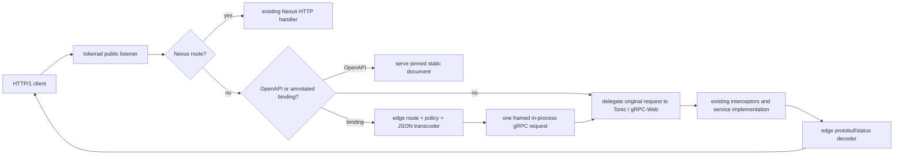

# Design Document: Edge HTTP API Gateway

## Overview

This design adds Temporal's public HTTP/JSON surface as a transport adapter around Tokeira's
existing Tonic services. It discovers `google.api.http` bindings from the vendored public descriptor
set, converts an HTTP request into the annotated protobuf request, submits one standard unary gRPC
request to the existing in-process Tower service, and converts that service's protobuf response or
gRPC status back to Temporal JSON.

The observable contract is verified against `service/frontend/http_api_server.go`,
`service/frontend/protojson_marshaler.go`, `service/frontend/openapi_http_handler.go`, and
`tests/http_api_test.go @ v1.31.0`. The route and message surface comes from the independently pinned
vendored API. Tokeira deliberately does not copy Temporal's separate HTTP listener or reflective Go
inline client: one public listener and one existing service stack remain authoritative.

The feature changes transport, configuration, observability, and conformance plumbing only. It adds
no command, state, I/O, or semantic decision to `tokeira-kernel`; it does not change runtime,
storage, history, or projections.

## Goals and Non-Goals

### Goals

- Serve every annotated unary WorkflowService and OperatorService binding, including direct
  additional bindings, from the current public listener.
- Preserve v1.31.0 path, query, header, host-policy, protobuf-JSON, payload-shorthand, error, and
  OpenAPI behavior.
- Reuse the full existing Tonic service path so HTTP cannot bypass authentication, authorization,
  validation, compatibility handling, metrics, or workflow behavior.
- Derive routes and dynamic message types from one descriptor pool rather than hand-writing one
  adapter per RPC.
- Keep protocol recognition disjoint: Nexus first, then OpenAPI/annotated HTTP, then unchanged
  delegation to native gRPC and gRPC-Web.

### Non-goals

- A second listener, loopback client, workflow service, or operator service.
- Server-streaming or client-streaming HTTP transcoding; the two target services expose annotated
  unary bindings for this surface.
- New workflow semantics, durable state, visibility state, or kernel changes.
- Implementing unsupported gRPC methods merely because their HTTP annotations are visible. The
  existing service returns its established status, which the gateway translates.
- A general dynamic-configuration subsystem. Only the already sanctioned conformance override
  registry is live.

## Architecture



The app-owned Tower adapter is the only component coupled to Hyper's body type and the concrete
Tonic router. The edge-owned gateway is transport-neutral: it owns descriptors, route matching,
policy evaluation, dynamic protobuf conversion, and response rendering, but receives and emits
bounded byte-oriented envelopes. This preserves the existing crate boundary in which
`tokeira-edge` translates public contracts and `tokeirad` wires transports.

## Dependencies

The feature adds `prost-reflect = { version = "0.12", features = ["serde"] }` at the workspace
boundary and consumes it from `tokeira-edge`. Version `0.12` matches the workspace's `prost` and
`prost-types` major/minor line. It provides:

- decoding of `tokeira_proto::public::FILE_DESCRIPTOR_SET`;
- access to method-option extensions, including `google.api.http`;
- `DynamicMessage` protobuf encode/decode; and
- canonical protobuf-JSON serialization/deserialization against the same descriptor pool,
  including well-known types and resolvable `Any` values.

No route-regex, HTTP client, YAML, or compression dependency is needed. Path templates and wildcard
hosts use small bounded parsers. Query decoding uses the already present `url` crate. OpenAPI
artifacts are committed uncompressed and embedded with `include_bytes!` so serving them performs no
filesystem I/O and adds no decompressor to the server.

## Component Design

### 1. Descriptor-derived route catalog

`tokeira-edge::http_api::HttpApiGateway::build` decodes the public descriptor set once during
startup. It resolves these services by fully-qualified name:

- `temporal.api.workflowservice.v1.WorkflowService`;
- `temporal.api.operatorservice.v1.OperatorService`.

For every unary method, the builder reads the `google.api.http` method extension and flattens the
primary rule plus its direct `additional_bindings`. Each rule becomes an immutable `HttpBinding`:

```rust
struct HttpBinding {
    method: HttpVerb,
    template: HttpPathTemplate,
    body: BodySelector,
    grpc_path: String,
    input: MessageDescriptor,
    output: MessageDescriptor,
    query_exclusions: FieldPathSet,
}
```

The builder rejects streaming methods with annotations, nested additional bindings, invalid field
selectors, malformed templates, and indistinguishable same-verb routes. Diagnostics name the
service method and offending annotation. This makes descriptor/API drift fail at boot rather than
silently removing a public route.

The catalog is immutable after construction and shared through `Arc`. Runtime matching never
mutates descriptors or routes.

### 2. Path templates and route precedence

`HttpPathTemplate` compiles literals, `*`, `**`, variable templates, nested field selectors, and
custom verb suffixes into typed segments. Matching uses the legacy unescaping behavior selected by
gRPC-Gateway v2.27.1 in Temporal v1.31.0: the request path is decoded once before segment matching;
captured values are not decoded a second time. A malformed percent sequence is an invalid request.

Routes are indexed by HTTP verb. Within a verb, more-specific templates precede less-specific
templates: literal/custom-verb segments, then single-segment captures, then multi-segment captures.
A stable fully-qualified method-name tie-breaker makes construction deterministic, while startup
validation rejects a tie that could change the selected operation. The pinned Temporal descriptor
set has no intentional ambiguous pair.

Recognition has four results:

```rust
enum RouteMatch {
    OpenApi(OpenApiVersion),
    Binding { binding: Arc<HttpBinding>, captures: Vec<PathCapture> },
    MethodNotAllowed,
    Miss,
}
```

Nexus recognition runs in its existing outer layer before this catalog. `/swagger.json` and
`/openapi.yaml` use v1.31.0's prefix behavior and precede bindings. A path matching another verb is
converted by `DefaultRoutingErrorHandler` to gRPC `UNIMPLEMENTED` with message
`Method Not Allowed`; Temporal's custom error handler therefore emits HTTP `501`, not `405`. A true
miss is delegated unchanged to Tonic. `X-HTTP-Method-Override` and the form-encoded POST-to-GET
path-length fallback are retained only where v1.31.0's gateway enables them; they never turn POST
into a destructive verb.

The Nexus recognizer is narrowed from the whole `/namespaces/` prefix to the two concrete Nexus
route grammars it already handles. This correction follows the existing Nexus spec's requirement
that unrelated paths be delegated and prevents ordinary workflow HTTP routes from being consumed
as Nexus 404s.

### 3. Bounded request admission

The app-owned `HttpApiLayer<S>` performs route recognition before deciding whether a body is read.
For a binding it:

1. evaluates Host admission using the edge gateway and the complete URI authority/Host value;
2. when the binding has a body selector, consumes at most 4 MiB and stops as soon as the next chunk
   would cross the bound;
3. moves the original request extensions into the eventual synthetic request so peer/TLS context
   and transport-scoped values remain available;
4. passes method, URI, headers, remote information, captures, and bounded bytes to the edge
   transcoder.

OpenAPI requests do not enter protobuf or gRPC admission. A body on a binding with no body selector
is dropped without decoding or reading it solely to trigger the limit, matching generated v1.31.0
handlers. Dropping the inbound future drops collection or the inner-service future; no detached
task is spawned.

### 4. Host and header policy

`tokeira-config` adds a defaulted `HttpApiPolicyConfig` under `[policy.http_api]`:

```rust
struct HttpApiPolicyConfig {
    allowed_hosts: Vec<String>,
    additional_forwarded_headers: Vec<String>,
}
```

Validation compiles each host pattern and header rule at startup. Host matching is a full-string,
case-sensitive glob in which only `*` is special. The default compiled pattern is `*`. Additional
header names are normalized case-insensitively; a single trailing `*` means prefix matching, while
other `*` placement is rejected as ambiguous.

In conformance builds the gateway reads `frontend.httpAllowedHosts` from
`tokeira-conformance::overrides()` for every matched binding. A present JSON string array replaces
the static host patterns. Clearing it reveals the static policy again. A malformed present value is
logged and rejects the request, avoiding an accidental fail-open.

Incoming metadata reproduces `runtime.DefaultHeaderMatcher` from the gRPC-Gateway version used by
v1.31.0:

- permanent HTTP headers become `grpcgateway-<lowercase-name>`;
- `Grpc-Metadata-*` loses that prefix;
- configured exact/prefix additions and Temporal's four additions retain their lower-case names;
- `Authorization` is also emitted as unprefixed `authorization` for gRPC-Gateway's explicit
  backward-compatibility rule, in addition to `grpcgateway-authorization`;
- `x-forwarded-host` is derived from the incoming value or Host, and `x-forwarded-for` combines the
  supplied chain with the available peer address;
- invalid metadata names, invalid non-ASCII text values, and malformed `-bin` base64 values follow
  the v1.31.0 skip/error behavior.

Missing `client-name` and `client-version` values are filled with `temporal-server-http` and
`TEMPORAL_SERVER_COMPAT`. The result is installed as ordinary gRPC headers; there is no parallel
identity or policy check.

### 5. Dynamic request transcoding

The transcoder creates an empty `DynamicMessage` from the binding's input descriptor, then applies
sources in v1.31.0 order:

1. decode the selected body, if any;
2. overwrite path-selected fields with captured values;
3. populate query fields not excluded by a path/body selector.

For `body: "*"`, the JSON value is decoded as the complete input message. For a named body field,
the value is decoded against that field descriptor and inserted along a validated singular-message
field path. Unknown JSON fields and incompatible protobuf JSON values are rejected.

Query field paths accept protobuf text names and JSON names. Singular nested messages are created
as needed. Repeated fields consume every supplied value; a singular field with multiple values is
invalid. `field[key]=value` fills map entries. Unknown query keys are ignored, as in
gRPC-Gateway's `DefaultQueryParser`. Scalar conversion covers strings, booleans, signed/unsigned
numbers, floating point, base64 bytes, symbolic/numeric enums, and well-known message forms.
`pretty` and `noPayloadShorthand` are representation controls and are removed before population.

The completed `DynamicMessage` is encoded as protobuf bytes. The app transport wraps those bytes in
one uncompressed unary gRPC frame (`0`, big-endian length, message), changes the URI to the
binding's full gRPC path, sets HTTP/2 plus `application/grpc` and `te: trailers`, attaches the
forwarded metadata and moved extensions, and calls the existing inner Tower service once.

### 6. Canonical protobuf JSON and Temporal payload shorthand

`prost-reflect`'s serde support is configured to the canonical protobuf mapping: lower-camel JSON
names, enum names, base64 bytes, string-form 64-bit integers, omitted defaults, strict unknown
fields, and the shared descriptor pool for `Any`.

Temporal payload shorthand is a descriptor-guided JSON-tree transform around canonical protobuf
JSON; it never guesses by Rust field/type names. On input it recognizes fields whose descriptor is
`temporal.api.common.v1.Payload` or `Payloads` and expands eligible shorthand before dynamic-message
deserialization. On output it first obtains canonical JSON, then contracts eligible payload values.

The transform preserves v1.31.0's all-or-nothing `Payloads` rule:

- `null` becomes `binary/null` with empty data;
- ordinary JSON becomes compact `json/plain` data;
- an object with string `_protoMessageType` becomes `json/protobuf`, with that member removed from
  compact data and copied to `messageType` metadata;
- a structurally valid canonical payload remains canonical on input;
- `json/plain` is shorthand-eligible only with exactly its encoding metadata;
- `json/protobuf` is shorthand-eligible only with exactly encoding plus non-empty message type;
- if one member is ineligible, the whole `Payloads` value remains canonical.

Inbound representation is selected from `Content-Type`; outbound representation is selected from
`Accept`. The presence of the `pretty` and `noPayloadShorthand` query keys rewrites outbound
selection exactly as `serveHTTP` does in v1.31.0, independent of their values. Unary success and
error paths call the marshaler directly rather than its stream encoder, so compact output has no
formatting newline; pretty output uses two spaces and therefore contains structural newlines.

### 7. In-process gRPC response handling

The app transport collects the inner unary response body and trailers. It supports Tonic's normal
trailers-only error response and one uncompressed message frame followed by trailers. Compression,
zero messages on success, multiple messages, malformed lengths, or a non-OK status after a partial
message are typed transport failures rather than partial successes.

On success, the gateway decodes the frame with the binding's output descriptor and renders the
selected JSON mode. On failure, it obtains code and percent-decoded message from the gRPC headers or
trailers. If `grpc-status-details-bin` contains a serialized `google.rpc.Status`, the gateway
decodes that dynamic message with the shared pool so typed `Any` details—including
`WorkflowExecutionAlreadyStarted.runId`—retain canonical JSON. Otherwise it builds the same status
from code and message.

The HTTP mapping is pinned to gRPC-Gateway v2.27.1, bundled by Temporal v1.31.0:

| gRPC code | HTTP |
|---|---:|
| OK | 200 |
| CANCELED | 499 |
| INVALID_ARGUMENT, FAILED_PRECONDITION, OUT_OF_RANGE | 400 |
| UNAUTHENTICATED | 401 |
| PERMISSION_DENIED | 403 |
| NOT_FOUND | 404 |
| ALREADY_EXISTS, ABORTED | 409 |
| RESOURCE_EXHAUSTED | 429 |
| UNIMPLEMENTED | 501 |
| UNAVAILABLE | 503 |
| DEADLINE_EXCEEDED | 504 |
| UNKNOWN, INTERNAL, DATA_LOSS, unrecognized | 500 |

An unauthenticated response also sets `WWW-Authenticate` to the status message, matching the
gateway default. Existing gRPC response metadata remains available for the normal
`Grpc-Metadata-*` / trailer forwarding policy; Tier 9.43 does not invent service-specific response
headers.

### 8. OpenAPI artifact ownership

The exact uncompressed OpenAPI v2 JSON and v3 YAML assets from Temporal API
`TEMPORAL_PROTO_VERSION` are vendored beside the upstream API input and exposed as byte constants by
`tokeira-proto`. Their provenance/version is documented next to the files. The proto compatibility
test verifies that both documents parse, name the pinned Temporal API version where supplied, and
contain every descriptor-derived HTTP path. This makes a future proto update fail until its
OpenAPI artifacts advance in the same change.

The app returns those bytes for v1.31.0's `/swagger.json` and `/openapi.yaml` path prefixes. Although
the upstream helper receives OAI media-type strings, it never installs them; Go's response writer
therefore sniffs both documents as `text/plain; charset=utf-8`. Tokeira sets that observable value
explicitly rather than relying on Hyper to reproduce Go sniffing. No runtime file read or
decompression occurs.

### 9. Metrics and conformance seams

Immediately before the one inner-service call, the gateway increments
`tokeira_edge_http_service_requests_total` with:

- `operation`: the full `/package.Service/Method` gRPC path;
- `namespace`: the decoded top-level `namespace` string or the existing unknown label.

Recognition, Host rejection, OpenAPI serving, and transcoding failure occur before this point and
emit no sample. An admitted inner error still has exactly one sample. The Temporal fork's metrics
bridge maps this native name to `http_service_requests`; no production metric is renamed for the
test.

The conformance override registry wires `frontend.httpAllowedHosts` as JSON only when the live read
site lands. The fork's generated temporary `tokeirad` config adds its existing exact and prefix
forwarded-header rules under `[policy.http_api]`. No corpus test body changes.

The existing Shape-2 authorization callback is also used by HTTP-originated synthetic gRPC calls.
The conformance authenticator sends the complete forwarded metadata map to the corpus process,
which reconstructs an incoming gRPC metadata context before invoking the suite's installed
`SetOnAuthorize` closure. This is a conformance transport for the corpus-owned decision, not a
second authorization implementation; production HTTP calls continue through the ordinary
authenticator/authorizer stack in-process.

One timing seam is intentionally confined to `--features conformance`. After a successful HTTP
`SignalWorkflowExecution` inner call, the adapter grants the already-dispatched worker a bounded
turn before returning the HTTP response. The v1.31.0 corpus immediately follows that response with
a non-long-poll, close-event-only history read; Temporal's separate HTTP listener/service boundary
naturally gives its dispatched worker this opportunity, whereas Tokeira's same-process inline call
can otherwise remove it. The grace occurs only after the signal transition is authoritative and
does not poll state, alter history-read semantics, or affect production HTTP/native gRPC. It is a
Shape-2 scheduling seam, not workflow behavior.

## Public and Internal Interfaces

The edge module exposes only the contracts required by the app transport:

```rust
pub struct HttpApiGateway { /* immutable descriptors, routes, policy */ }

pub enum HttpApiRecognition {
    Miss,
    MethodNotAllowed(HttpApiResponse),
    OpenApi(HttpApiResponse),
    Binding(HttpApiMatchedRequest),
}

pub struct HttpApiDispatch {
    pub grpc_path: String,
    pub protobuf: Vec<u8>,
    pub metadata: HeaderMap,
    pub representation: JsonRepresentation,
    pub output: MessageDescriptor,
}

pub struct HttpApiResponse {
    pub status: StatusCode,
    pub headers: HeaderMap,
    pub body: Vec<u8>,
}
```

Concrete names may be refined during implementation, but the boundary is fixed: edge never receives
the inner Tonic service, and `tokeirad` never implements protobuf field semantics.

## Error Model

`HttpApiError` keeps failure origins distinct:

- startup descriptor/annotation/config errors prevent server startup;
- route/capture/query/body errors become `INVALID_ARGUMENT` JSON without inner invocation;
- oversized bodies become the same bounded-request error exposed by v1.31.0;
- Host denial uses the required literal 403 body and bypasses normal status rendering;
- malformed inner gRPC framing becomes `INTERNAL` and is logged with operation context;
- inner statuses preserve their original code, message, and details.

Public errors never include descriptor debug dumps, raw protobuf bytes, authorization tokens, or
configuration contents. Logs carry method/path-class and structured cause, not request bodies.

## Correctness Properties

### Property 1: Descriptor route closure

*For every* unary WorkflowService or OperatorService method with a valid `google.api.http` option,
the catalog contains exactly its primary and direct additional bindings, and contains no binding
without such an option.

**Validates: Requirements 2.1-2.7, 10.5**

### Property 2: Path-template capture fidelity

*For every* generated valid template/path pair, matching returns exactly the decoded values for its
declared variable selectors; a non-matching path cannot produce a partial capture, and a wrong verb
cannot invoke a binding.

**Validates: Requirements 1.4, 1.8, 3.1-3.3**

### Property 3: Request-source precedence

*For every* descriptor-valid body, path-capture set, and query set, transcoding is equivalent to
body decode followed by path overwrite followed by unbound query population; bound fields cannot be
changed by query parameters.

**Validates: Requirements 3.3-3.8, 4.1-4.8**

### Property 4: Canonical protobuf-JSON round trip

*For every* dynamically generated supported request/response message, canonical serialization then
deserialization through the shared pool preserves its protobuf wire value, including enums, bytes,
64-bit integers, maps, well-known types, and resolvable `Any` values.

**Validates: Requirements 4.4, 5.8, 9.3-9.4**

### Property 5: Payload shorthand preservation

*For every* eligible Payload/Payloads value, shorthand encode then decode preserves its canonical
protobuf value; if any member is ineligible, the complete Payloads value remains canonical.

**Validates: Requirements 6.1-6.9**

### Property 6: Host-policy equivalence

*For every* host and valid configured wildcard set, admission equals anchored case-sensitive glob
matching where only `*` spans arbitrary text; a present live override wholly replaces the static
set.

**Validates: Requirements 8.1-8.7, 12.6**

### Property 7: Header-policy confinement

*For every* header map and valid exact/prefix policy, forwarded metadata contains all and only the
default, Temporal-added, configured, and explicitly synthesized context entries, with
Authorization's two required aliases.

**Validates: Requirements 7.1-7.9**

### Property 8: Unary gRPC envelope integrity

*For every* protobuf byte string within bounds, frame then parse returns exactly one identical
message. Truncation, extra frames, compression, or non-OK trailers cannot be accepted as success.

**Validates: Requirements 9.1-9.3, 9.8-9.9**

### Property 9: Status translation fidelity

*For every* gRPC status code/message and valid `google.rpc.Status` detail envelope, HTTP rendering
preserves the status JSON and selects the pinned HTTP code.

**Validates: Requirements 5.6-5.10, 9.4-9.7**

### Property 10: Protocol non-interference

*For every* inbound request, exactly one of Nexus, OpenAPI, annotated HTTP, or unchanged Tonic
delegation owns it; an HTTP binding produces exactly one inner call and cancellation cannot leave a
detached call.

**Validates: Requirements 1.1-1.8, 13.1-13.6**

### Property 11: HTTP metric singularity

*For every* admitted binding, exactly one HTTP-service counter is emitted before the inner result;
all pre-admission outcomes emit none.

**Validates: Requirements 11.1-11.6**

## Testing Strategy

### Edge unit and property tests

- Route-catalog golden counts and method/path fixtures from the pinned descriptor set.
- At least 100 cases for Properties 1-9 and 11.
- Golden JSON tests for all four media modes, compact no-newline/pretty indentation behavior,
  canonical status details, and every shorthand eligibility boundary.
- Exact Host denial body, wildcard cases, live override replacement/clear/malformed behavior.
- Default, configured, binary, Authorization, forwarded-host, and forwarded-for header cases.
- Query singular/repeated/map/unknown/excluded-field behavior and invalid scalar cases.

### App transport integration tests

- A mock inner Tower service proves framing, metadata, moved extensions, response/trailer parsing,
  one-call behavior, and drop cancellation.
- Same-listener tests prove native gRPC and gRPC-Web delegation is unchanged.
- Nexus route tests prove concrete Nexus ownership and ordinary `/namespaces/...` HTTP delegation.
- OpenAPI responses prove media type, parseability, and no inner invocation.

### Config, proto, and conformance tests

- Config default, strict unknown-field rejection, validation, and TOML round trip.
- Proto/OpenAPI alignment checks cover every descriptor-derived path.
- Conformance override registry/control tests cover JSON set, replace, clear, and malformed input.
- Temporal fork seam tests cover generated header policy and metric-name mapping.
- Two consecutive clean `TestHttpApiTestSuite` runs are required before Tier 9.43 is green.

### Regression gates

Focused crate checks/tests precede the suite. Final merge readiness uses the repository's enforced
format, lint, check, test, and documentation commands, with `--locked` where applicable. No existing
Nexus, native gRPC, gRPC-Web, authorization, or workflow behavior is weakened to make HTTP tests
pass.

## Alternatives Rejected

### Loopback gRPC client

Opening a client channel back to Tokeira would duplicate network/TLS configuration, consume another
connection, and create a cancellation and identity boundary absent from the architecture. Calling
the existing Tower service in-process preserves exactly one admission stack.

### Calling edge service methods directly

Direct calls would bypass Tonic framing and transport/interceptor behavior and require a second
method registry. A synthetic unary gRPC request is slightly more mechanical but makes HTTP use the
same public service path as native clients.

### Hand-written route table or per-RPC adapters

The vendored annotations already define the surface. Manual routes would drift on API updates and
would make coverage depend on remembering each additional binding.

### Generated Rust gateway code

No maintained generator in the current workspace produces the required Tower/Tonic shape plus
Temporal's custom payload JSON. Descriptor-driven translation keeps one small general mechanism and
is testable against the complete pinned route set.

### Runtime or kernel ownership

HTTP method names, JSON formatting, Host policy, and gRPC frames are wire concerns. Putting them in
runtime or kernel would violate plane boundaries and make durable correctness depend on a transport.

## Security and Operational Considerations

- Body collection is bounded before full allocation and before service admission.
- Host policy runs before body decoding and authentication work.
- The gateway never logs bodies, payload bytes, authorization values, or status-detail contents.
- Dynamic descriptors and route tables are immutable after startup, eliminating per-request schema
  races.
- Unknown HTTP paths are not turned into privileged calls; they retain the existing Tonic result.
- HTTP metadata enters the same authentication and authorization interceptors as native gRPC.
- Default allow-all Host behavior is a compatibility default, not an authentication boundary;
  operators can narrow it explicitly.
- Static OpenAPI bytes require no filesystem access and cannot be modified after process startup.

## Traceability

| Requirement | Design sections |
|---|---|
| 1 | Architecture; Components 2-3; Property 10 |
| 2 | Component 1; Property 1 |
| 3-4 | Component 5; Properties 2-4 |
| 5-6 | Component 6; Properties 4-5, 9 |
| 7-8 | Components 3-4; Properties 6-7 |
| 9 | Components 5 and 7; Properties 8-10 |
| 10 | Component 8; Property 1 |
| 11-12 | Component 9; Properties 6 and 11 |
| 13 | Overview; Architecture; Property 10; regression gates |
