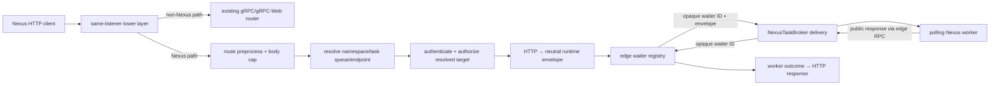

# Design Document: Edge Nexus HTTP Dispatch

## Overview

This design adds Temporal v1.31.0's caller-facing Nexus HTTP Start/Cancel
surface to the same listener that serves Temporal gRPC. It preprocesses the two
route families, resolves a worker target, authenticates and authorizes the
resolved call, translates HTTP into a public Nexus worker request, waits through
the `NexusTaskBroker`, and serializes the worker outcome back to the Nexus HTTP
protocol.

Ground truth is `service/frontend/nexus_http_handler.go`,
`service/frontend/nexus_handler.go`, `common/nexus/nexusrpc`, and
`common/nexus/routes.go @ v1.31.0`. Worker token/correlation semantics are owned
by `edge-nexus-task-transport`; endpoint CRUD is owned by
`api-conformance-nexus-admin`; identity and production policy are owned by
`authorization-foundation`.

## Dependencies and Non-Goals

- This feature consumes the live `NexusEndpointStore`, `NamespaceCache`, shared
  edge authorizer, the edge-owned HTTP waiter registry, and the neutral
  `NexusTaskBroker` delivery API.
- External endpoint targets are rejected for inbound endpoint dispatch, matching
  v1.31.0's worker-target-only security posture.
- Multi-cluster forwarding is out of scope for tokeira's single-cluster topology.
- The completion-callback listener remains separate and is not routed through
  this handler.
- The conformance callback bridge exists only behind the `conformance` feature;
  it is not a production authentication mechanism.

## Architecture



## Components and Interfaces

### Same-listener routing

`tokeirad` installs a `NexusHttpLayer` around the tonic route service before
serving. The layer sees every HTTP/1 request:

- paths beginning `/namespaces/` or `/nexus/endpoints/` are collected into a
  bounded edge request and passed to `NexusHttpHandler`;
- every other path is delegated unchanged to the existing tonic/gRPC-Web
  service.

This keeps one bound address and avoids a second public listener. The transport
adapter converts tonic's legacy HTTP body into the edge-owned neutral
`NexusHttpRequest` and converts the neutral response back to the tonic body type.

### Route preprocessing

`NexusHttpHandler::preprocess` recognizes:

- `/namespaces/{namespace}/task-queues/{task_queue}/nexus-services/{service}/{operation}`;
- `/nexus/endpoints/{endpoint_id}/services/{service}/{operation}`;
- the normal `/cancel` suffix and deprecated token-in-path cancel form.

Segments are percent-decoded exactly once. Namespace routes validate the maximum
ID length before lookup. Endpoint routes load by ID from the live store and
accept only Worker targets. The result is:

```rust
struct ResolvedNexusTarget {
    namespace_id: NamespaceId,
    namespace_name: String,
    task_queue: TaskQueueName,
    endpoint_id: Option<String>,
    endpoint_name: Option<String>,
    api_name: NexusDispatchApi,
}
```

Outer-route and endpoint-resolution failures return a Nexus HandlerError response
and increment `nexus_request_preprocess_errors`; no task is published. A valid
namespace route whose namespace is absent is handled later as the distinct
`nexus_requests{outcome="namespace_not_found"}` case, without a preprocess sample.

### Authentication and scoped conformance callback

After target resolution and before namespace-state validation or broker publish,
the handler invokes the shared authorization seam with the resolved namespace,
API name, and optional endpoint name (`nexus_handler.go:156-181 @ v1.31.0`).

Production builds use the configured `authorization-foundation` mapper and
authorizer. Under `conformance`, a `ScopedAuthorizer` first looks up a callback
registered for the resolved namespace. If present it sends the full call target
to the harness callback server; otherwise it delegates to production policy.

The Temporal fork hosts the callback server inside the suite process. Its
namespace registry maps each namespace registered through its dedicated cluster
to that cluster's current `Host().SetOnAuthorize` closure. This retains the exact
Go closure—including endpoint-name assertions—and prevents parallel subtests
from racing through a process-global authorizer. Clearing the hook removes only
that cluster's namespace mappings.

### HTTP request translation

The handler converts the request body and `Content-*` headers into one Temporal
Payload. General headers are lower-cased and preserve their first value while
excluding content and callback headers. Callback URL/headers, links,
`Nexus-Request-Id`, timeout, failure-support capability, arrival time, and
endpoint name are preserved per the requirements policy tables.

The public payload limit is 2 MiB after metadata conversion. The transport body
reader is also capped at v1.31.0's 2 MiB raw-body limit so an oversized request
cannot allocate unbounded memory.

### Broker dispatch and cancellation

The handler registers a oneshot waiter in its edge-owned registry, then asks
`NexusTaskBroker` to publish a neutral task carrying only the waiter's opaque ID
as private correlation. Runtime registers that route before queue visibility and
returns a delivery lease. The handler awaits the edge waiter until the effective
request deadline. Timeout or future cancellation drops both waiter and lease;
a late worker response receives the normal unknown/expired task result. Public
Nexus protos and HTTP caller lifetimes never enter runtime.

### HTTP response serializer

One edge serializer maps `NexusHttpWorkerOutcome` to the status/body/header policy in
requirements.md: sync `200`, async `201`, operation error `424`, cancel `202`,
typed HandlerError statuses, upstream timeout `520`, worker failure-source,
retryable, operation-state, content metadata, links, and legacy/modern failure
selection.

## Correctness Properties

### Property 1: Route resolution totality

*For any* request path, preprocessing either returns the exact resolved target
for one supported route or a bounded Nexus error without publishing a task;
unrelated paths are delegated unchanged.

**Validates: Requirements 1.1-1.4, 2.1-2.8**

### Property 2: Start translation preservation

*For any* valid Start request within limits, HTTP translation preserves every
field listed in Requirement 3 and excludes only the explicitly filtered headers.

**Validates: Requirements 3.1-3.10**

### Property 3: Cancel token precedence

*For any* header/query combination on the current cancel route, cancellation
selects the header then query and rejects only when both are absent. *For any*
deprecated token-in-path route, the path token wins independently because it is
a separate route.

**Validates: Requirements 4.1-4.5**

### Property 4: Waiter isolation

*For any* concurrent set of HTTP dispatches, a worker response or cancellation
affects exactly the waiter sharing its `task_id`.

**Validates: Requirements 5.1-5.6**

### Property 5: Response mapping fidelity

*For any* valid worker outcome, serialization produces the v1.31.0 status, body,
headers, failure mode, and links for that outcome.

**Validates: Requirements 6.1-6.11**

### Property 6: Scoped authorization isolation

*For any* two namespaces with distinct conformance callbacks, authorization for
one namespace invokes only its callback with the correct API/namespace/endpoint
target; a namespace without a callback delegates to production policy.

**Validates: Requirements 8.1-8.9**

### Property 7: Terminal metric singularity

*For any* admitted operation, exactly one `nexus_requests` and one `nexus_latency`
sample are emitted with the resolved dimensions; preprocessing failures emit only
the preprocess counter except namespace-not-found's specified outcome row.

**Validates: Requirements 7.1-7.7**

## Error Handling

The canonical status/message/header matrix is the HTTP Response Mapping and
route/request policy tables in requirements.md. Implementations use a typed
`NexusHttpError` so preprocessing, authorization, worker, and timeout outcomes
cannot collapse into an undifferentiated `400`.

Authorization mapping is special: deny-with-reason becomes `UNAUTHORIZED`
`permission denied: <reason>`; deny-without-reason and hidden authorizer errors
become `UNAUTHORIZED` `permission denied`; exposed authorizer errors retain their
Nexus HandlerError type/message (`nexus_handler.go:168-178 @ v1.31.0`).

## Testing Strategy

- PBTs cover Properties 1-7 with at least 100 cases.
- Unit tests pin every Tier 7.36 route/error literal, payload-size boundary,
  timeout parsing, header filtering, and response status mapping.
- Same-listener integration proves Nexus HTTP and gRPC share one socket and
  unrelated paths remain unchanged.
- Broker integration proves HTTP publish→poll→respond and cancellation cleanup.
- Conformance integration proves parallel namespace-scoped Go callbacks do not
  race.
- Two clean `TestNexusAPIValidationTestSuite` runs are the Tier 7.36 gate.
