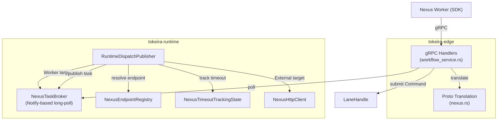

# Design Document: Edge Nexus Task Transport

## Overview

This design implements the Nexus Task Transport layer — 3 gRPC handlers for Temporal's Nexus worker polling and completion in `tokeira-edge`, plus the backing `NexusTaskBroker` in `tokeira-runtime`. Nexus task transport is the worker-facing side of Nexus operations: workers poll for Nexus tasks (start or cancel), execute them, and report results back via completion or failure handlers.

The architecture follows the same principles as workflow/activity task transport: the broker lives in `tokeira-runtime` using the same `Notify`-based long-poll pattern as `InMemoryBroker` and `InMemoryActivityBroker`, proto translation stays in `tokeira-edge`, and task tokens use JSON encoding (same as WFT/activity tokens via `serde_json::to_vec`).

The existing `RuntimeDispatchPublisher` dispatches `ScheduleNexusOperation` and `CancelNexusOperation` via `NexusHttpClient` to external endpoints. This spec adds the alternative path: when a Nexus endpoint has an `EndpointTarget::Worker` target, the operation is routed through the `NexusTaskBroker` to a polling worker instead.

> **Proto version note:** Targets Tokeira v1.43.0 proto. `RespondNexusTaskFailedRequest` uses `HandlerError error` field. The newer `Failure failure` field (field 5) is deferred until proto sync.

### Phased Delivery

| Phase | Scope | Handlers |
|-------|-------|----------|
| 1 | NexusTaskBroker, task token codec, poll handler, proto translation for request types | `poll_nexus_task_queue` |
| 2 | Completion and failure handlers, proto translation for response types | `respond_nexus_task_completed`, `respond_nexus_task_failed` |
| 3 | Worker-targeted dispatch routing, cancel routing, timeout integration, endpoint registry extension | — |

## Architecture



### Key Design Decisions

1. **Same broker pattern as WFT/activity** — `NexusTaskBroker` uses `Arc<Mutex<BrokerState>>` + `Arc<Notify>` for long-poll wake, matching `InMemoryBroker` and `InMemoryActivityBroker`. Tasks are keyed by `(NamespaceId, TaskQueueName)` matching the `EndpointTarget::Worker` configuration. No sticky tiers or deduplication needed — Nexus tasks are one-shot.

2. **JSON-encoded task tokens** — `NexusTaskToken` is a `#[derive(Serialize, Deserialize)]` struct containing `(RunKey, String, i64)` for `(run_key, operation_id, scheduled_event_id)`. Encoded via `serde_json::to_vec` / decoded via `serde_json::from_slice`, same pattern as WFT and activity tokens.

3. **Endpoint registry extended with target enum** — `NexusEndpointConfig` gains an `EndpointTarget` enum (`External { address }` | `Worker { namespace_id, task_queue }`). The publisher inspects the target to choose dispatch path. Existing HTTP-only configs map to `External`.

4. **Completion handlers use `WorkflowRuntimeApi::resolve_nexus_operation`** — `respond_nexus_task_completed` and `respond_nexus_task_failed` decode the task token, translate the proto response to a `NexusResolution`, and call a new `WorkflowRuntimeApi::resolve_nexus_operation(run_key, operation_id, scheduled_event_id, resolution)` method. This method is added to the runtime API trait so the edge layer can submit Nexus resolutions without depending on `LaneHandle` (which is runtime-internal). The runtime adapter implements it by submitting `Command::NexusOperationResolved` to the appropriate lane.

5. **Idempotent completion** — If the kernel rejects `NexusOperationResolved` (operation already resolved, run closed, etc.), the handler returns success. The operation was already resolved — no error to the worker.

6. **Timeout tracking reuse** — Broker-dispatched operations insert into the existing `NexusTimeoutTrackingState` and are scanned by the existing `NexusTimeoutScanner`. No scanner modifications needed.

## Components and Interfaces

### NexusTaskToken

New struct in `crates/tokeira-runtime/src/nexus.rs`:

```rust
#[derive(Clone, Debug, PartialEq, Serialize, Deserialize)]
pub struct NexusTaskToken {
    pub run_key: RunKey,
    pub operation_id: String,
    pub scheduled_event_id: i64,
}

impl NexusTaskToken {
    pub fn encode(&self) -> Result<Vec<u8>> {
        serde_json::to_vec(self).map_err(Into::into)
    }

    pub fn decode(bytes: &[u8]) -> Result<Self> {
        serde_json::from_slice(bytes).map_err(|e| {
            anyhow!("invalid nexus task token: {e}")
        })
    }
}
```

### NexusTask

Internal representation of a queued Nexus task:

```rust
#[derive(Clone, Debug)]
pub struct NexusTask {
    pub token: NexusTaskToken,
    pub request: NexusTaskRequest,
}

#[derive(Clone, Debug)]
pub enum NexusTaskRequest {
    StartOperation {
        service: String,
        operation: String,
        request_id: String,
        /// Single payload encoded from the dispatch op's `input: Payloads`.
        /// The first payload in the Payloads vec is used as the proto
        /// `common.v1.Payload`. If empty, payload is None.
        payload: Option<Payload>,
        /// Scheduled time from the dispatch op's timestamp.
        scheduled_time: Option<OffsetDateTime>,
    },
    CancelOperation {
        service: String,
        operation: String,
        operation_id: String,
    },
}
```

> **NOTE:** The upstream proto `StartOperationRequest` has `callback`, `callback_header`, `links`, and `header` fields. For worker-dispatched operations, these are not populated because the dispatch op does not carry them — the callback path is internal (the completion handler submits directly to the runtime). `callback` is set to empty string, `callback_header` and `links` are empty, and `header` is empty. These fields are only meaningful for external HTTP-dispatched operations.

### NexusTaskBroker

New struct in `crates/tokeira-runtime/src/nexus.rs`:

```rust
#[derive(Default, Clone)]
pub struct NexusTaskBroker {
    inner: Arc<Mutex<NexusBrokerState>>,
    wake: Arc<Notify>,
}

#[derive(Default)]
struct NexusBrokerState {
    ready: HashMap<(NamespaceId, TaskQueueName), VecDeque<NexusTask>>,
}
```

**Public API:**

| Method | Description |
|--------|-------------|
| `publish(&self, namespace_id, task_queue, task)` | Enqueue a NexusTask, wake waiting pollers |
| `poll(&self, namespace_id, task_queue, wait_for) -> Option<NexusTask>` | Long-poll for a task. Returns immediately if available, blocks up to `wait_for`, returns `None` on timeout |

The `poll` method follows the same Notify pattern as `InMemoryActivityBroker::poll_activity_task`:
1. Try take from queue
2. If empty, register `Notify` future, re-check, then await with timeout
3. On wake or timeout, try take again

### NexusEndpointConfig (Extended)

```rust
#[derive(Clone, Debug, PartialEq)]
pub enum EndpointTarget {
    External { address: String },
    /// Worker target stores the pre-resolved NamespaceId and task queue.
    /// Namespace name → NamespaceId resolution happens at endpoint registration
    /// time (when the operator configures the endpoint), not at dispatch time.
    /// This avoids the publisher needing a namespace resolver.
    Worker { namespace_id: NamespaceId, task_queue: TaskQueueName },
}

#[derive(Clone, Debug, PartialEq)]
pub struct NexusEndpointConfig {
    pub target: EndpointTarget,
}
```

> **NOTE:** The upstream proto uses `namespace: String` (name) on `EndpointTarget::Worker`. Resolution from namespace name to `NamespaceId` happens at endpoint registration/configuration time — when the endpoint is inserted into the `NexusEndpointRegistry`. The registry stores the resolved `NamespaceId`. The publisher does not need a namespace resolver at dispatch time, avoiding a crate cycle with `tokeira-edge`'s `NamespaceCache`.

The existing `NexusEndpointRegistry` API (`resolve`) is unchanged — callers inspect the returned `NexusEndpointConfig.target` to determine dispatch path.

### RuntimeDispatchPublisher (Extended)

Add `nexus_broker: NexusTaskBroker` field:

```rust
pub struct RuntimeDispatchPublisher<R> {
    // ... existing fields ...
    nexus_broker: NexusTaskBroker,
}
```

The `handle_schedule_nexus_operation` method gains a target check:

```rust
match config.target {
    EndpointTarget::External { ref address } => {
        // existing NexusHttpClient path
    }
    EndpointTarget::Worker { namespace_id, ref task_queue } => {
        let token = NexusTaskToken { run_key, operation_id, scheduled_event_id };
        let payload = input.0.first().cloned(); // Payloads → single Payload
        let task = NexusTask {
            token,
            request: NexusTaskRequest::StartOperation {
                service, operation, request_id: operation_id,
                payload, scheduled_time: Some(now),
            },
        };
        self.nexus_broker.publish(namespace_id, task_queue.clone(), task).await;
    }
}
```

Same pattern for `handle_cancel_nexus_operation` — Worker targets publish a `CancelOperation` task to the broker.

### Proto Translation

New file: `crates/tokeira-edge/src/translate/nexus.rs`

| Function | Direction | Description |
|----------|-----------|-------------|
| `nexus_task_to_proto_request()` | domain → proto | Build `temporal.api.nexus.v1.Request` from `NexusTaskRequest` |
| `start_operation_to_proto()` | domain → proto | Build `StartOperationRequest` from internal fields |
| `cancel_operation_to_proto()` | domain → proto | Build `CancelOperationRequest` from internal fields |
| `proto_response_to_resolution()` | proto → domain | Convert `Response` to `NexusResolution` |
| `proto_start_response_to_resolution()` | proto → domain | Convert `StartOperationResponse` variant to `NexusResolution` |
| `proto_handler_error_to_resolution()` | proto → domain | Convert `HandlerError` to `NexusResolution::Failed` |
| `nexus_failure_to_kernel_payload()` | proto → domain | Serialize `nexus.v1.Failure` or `HandlerError` into a kernel `Payload` via `serde_json::to_vec` of a canonical JSON envelope `{ "error_type": "...", "message": "...", "metadata": {...}, "details": "..." }`. This is the concrete encoding contract for Nexus failures into the opaque kernel `Payload` field. |

### Handler Integration

The 3 handlers in `WorkflowService`:

**`poll_nexus_task_queue`**: Validate namespace + task_queue → long-poll `NexusTaskBroker` → translate `NexusTask` to proto `PollNexusTaskQueueResponse` with encoded task token.

**`respond_nexus_task_completed`**: Validate task_token + response → decode `NexusTaskToken` → translate proto `Response` to `NexusResolution` → call `WorkflowRuntimeApi::resolve_nexus_operation`. Return success even if kernel rejects (idempotent).

> **Async start response handling:** When the worker returns `StartOperationResponse::Async`, the handler validates that the returned `operation_id` matches the scheduled operation's ID (from the task token). If it differs, the handler logs a warning but still submits `NexusResolution::Started` — the kernel tracks operations by its own ID, not the worker-returned one. The `links` field on the async response is ignored (the kernel has no field to store it). This is documented in UNSUPPORTED_FIELDS.md.

**`respond_nexus_task_failed`**: Validate task_token + error → decode `NexusTaskToken` → translate proto `HandlerError` to `NexusResolution::Failed` → call `WorkflowRuntimeApi::resolve_nexus_operation`. Return success even if kernel rejects (idempotent).

The `WorkflowService` struct gains a `nexus_broker: NexusTaskBroker` field (same pattern as `broker: InMemoryBroker`).

## Data Models

### NexusTaskToken

| Field | Type | Description |
|-------|------|-------------|
| `run_key` | `RunKey` | Originating workflow run |
| `operation_id` | `String` | Nexus operation ID |
| `scheduled_event_id` | `i64` | Event ID of `NexusOperationScheduled` event |

### NexusTask

| Field | Type | Description |
|-------|------|-------------|
| `token` | `NexusTaskToken` | Opaque token for completion correlation |
| `request` | `NexusTaskRequest` | Start or cancel operation request |

### NexusTaskRequest::StartOperation

| Field | Type | Description |
|-------|------|-------------|
| `service` | `String` | Nexus service name |
| `operation` | `String` | Operation type |
| `request_id` | `String` | Idempotency key (operation_id) |
| `payload` | `Option<Payload>` | Single payload (first entry from dispatch op's `input: Payloads`) |
| `scheduled_time` | `Option<OffsetDateTime>` | When the request was scheduled |

> **NOTE:** The upstream proto `StartOperationRequest` also has `callback`, `callback_header`, `links`, and `header` fields. These are not stored on the internal `NexusTaskRequest` — they are synthesized as empty at proto translation time for worker-dispatched tasks. They are only meaningful for external HTTP dispatch.

### NexusTaskRequest::CancelOperation

| Field | Type | Description |
|-------|------|-------------|
| `service` | `String` | Nexus service name |
| `operation` | `String` | Operation type |
| `operation_id` | `String` | Operation ID to cancel |

### EndpointTarget

| Variant | Fields | Description |
|---------|--------|-------------|
| `External` | `address: String` | HTTP endpoint URL |
| `Worker` | `namespace_id: NamespaceId, task_queue: TaskQueueName` | Worker poll target (namespace resolved at registration time) |


## Correctness Properties

*A property is a characteristic or behavior that should hold true across all valid executions of a system — essentially, a formal statement about what the system should do. Properties serve as the bridge between human-readable specifications and machine-verifiable correctness guarantees.*

### Property 1: Task token round-trip

*For any* valid `(RunKey, String, i64)` tuple representing `(run_key, operation_id, scheduled_event_id)`, encoding a `NexusTaskToken` and then decoding the resulting bytes SHALL produce a token equal to the original.

**Validates: Requirements 2.1, 2.2, 2.3, 2.5**

### Property 2: Broker queue isolation

*For any* set of `(NamespaceId, TaskQueueName)` queue keys and *for any* set of `NexusTask` entries published to specific queues, polling from a given queue SHALL only return tasks that were published to that exact queue, and SHALL return them in FIFO order.

**Validates: Requirements 1.1, 1.4**

### Property 3: Request translation preserves stored fields

*For any* valid `NexusTaskRequest` (either `StartOperation` or `CancelOperation` variant), translating to a proto `temporal.api.nexus.v1.Request` and inspecting the resulting proto SHALL preserve all stored fields: for `StartOperation` — `service`, `operation`, `request_id`, `payload`, `scheduled_time`; for `CancelOperation` — `service`, `operation`, `operation_id`. The synthesized fields (`callback`, `callback_header`, `links`, `header`) SHALL be empty/default on the proto output.

**Validates: Requirements 4.1, 4.2, 4.3**

### Property 4: Response translation correctness

*For any* valid proto `Response` or `HandlerError`, the translation to `NexusResolution` SHALL produce the correct variant: `StartOperationResponse::Sync` → `NexusResolution::Completed` with matching payload; `StartOperationResponse::Async` → `NexusResolution::Started`; `StartOperationResponse::operation_error` → `NexusResolution::Failed` with matching failure; `CancelOperationResponse` → `NexusResolution::Canceled`; `HandlerError` → `NexusResolution::Failed` with matching error info.

**Validates: Requirements 5.2, 5.3, 5.4, 5.5, 6.2, 7.1, 7.2, 7.3, 7.4, 7.5**

### Property 5: Dispatch-to-broker field preservation

*For any* `DispatchOp::ScheduleNexusOperation` or `DispatchOp::CancelNexusOperation` targeting a Worker endpoint, the `NexusTask` published to the broker SHALL carry a token with the originator's `run_key`, `operation_id`, and `scheduled_event_id`, and a request with the dispatch op's `service` and `operation`. For `ScheduleNexusOperation`, the request's `payload` SHALL be the first entry from the dispatch op's `input: Payloads`, or `None` if the input is empty. For `CancelNexusOperation`, the request's `operation_id` SHALL match the dispatch op's operation ID.

**Validates: Requirements 8.3, 8.4, 9.2**

## Error Handling

### Handler Validation Errors

| Handler | Error | gRPC Status |
|---------|-------|-------------|
| `poll_nexus_task_queue` | Empty namespace | `INVALID_ARGUMENT` |
| `poll_nexus_task_queue` | Missing or empty task_queue name | `INVALID_ARGUMENT` |
| `respond_nexus_task_completed` | Empty or malformed task_token | `INVALID_ARGUMENT` |
| `respond_nexus_task_completed` | Missing response (no variant set) | `INVALID_ARGUMENT` |
| `respond_nexus_task_failed` | Empty or malformed task_token | `INVALID_ARGUMENT` |
| `respond_nexus_task_failed` | Missing error | `INVALID_ARGUMENT` |

### Kernel Rejection (Idempotent)

| Scenario | Behavior |
|----------|----------|
| Operation already resolved | Handler returns success |
| Run closed or absent | Handler returns success |
| Scheduled event ID mismatch | Handler returns success |

### Dispatch Errors

| Scenario | Behavior |
|----------|----------|
| Endpoint not found in registry | Submit `NexusResolution::Failed` with "endpoint not found" message (existing behavior) |
| Broker publish (infallible for in-memory) | No error path needed |

### Proto Translation Errors

| Scenario | Behavior |
|----------|----------|
| Unrecognized response variant | Return descriptive error |
| Invalid proto field value | Return descriptive error |

## Testing Strategy

### Property-Based Tests (proptest, minimum 100 iterations each)

| Test | Property | Description |
|------|----------|-------------|
| `property_nexus_task_token_round_trip` | Property 1 | Generate random `(RunKey, String, i64)` tuples, encode then decode `NexusTaskToken`, verify equality |
| `property_broker_queue_isolation` | Property 2 | Generate random queue keys and tasks, publish to specific queues, poll each queue, verify only matching tasks returned in FIFO order |
| `property_request_translation_preserves_fields` | Property 3 | Generate random `NexusTaskRequest` values (both variants), translate to proto, verify all fields preserved |
| `property_response_translation_correctness` | Property 4 | Generate random proto `Response` and `HandlerError` values across all variants, translate to `NexusResolution`, verify correct variant and field preservation |
| `property_dispatch_to_broker_field_preservation` | Property 5 | Generate random `ScheduleNexusOperation` and `CancelNexusOperation` dispatch ops, run through publisher logic with Worker target, verify published `NexusTask` fields match |

Each property test is tagged: `// Feature: edge-nexus-task-transport, Property N: <title>`

### Unit Tests (example-based)

| Test | Requirement | Description |
|------|-------------|-------------|
| `test_poll_empty_namespace_rejected` | 3.4 | Empty namespace returns `INVALID_ARGUMENT` |
| `test_poll_empty_task_queue_rejected` | 3.5 | Empty task_queue returns `INVALID_ARGUMENT` |
| `test_poll_timeout_returns_empty` | 1.6, 3.3 | Poll empty queue with short timeout, verify empty response |
| `test_poll_wake_on_publish` | 1.3 | Poller waiting on empty queue receives task after publish |
| `test_decode_malformed_token_returns_error` | 2.4 | Random/truncated bytes return descriptive error |
| `test_completed_empty_token_rejected` | 5.6 | Empty task_token returns `INVALID_ARGUMENT` |
| `test_completed_missing_response_rejected` | 5.7 | Missing response variant returns `INVALID_ARGUMENT` |
| `test_completed_kernel_rejection_returns_success` | 5.8 | Kernel rejects command, handler returns success |
| `test_failed_empty_token_rejected` | 6.3 | Empty task_token returns `INVALID_ARGUMENT` |
| `test_failed_missing_error_rejected` | 6.4 | Missing error returns `INVALID_ARGUMENT` |
| `test_failed_kernel_rejection_returns_success` | 6.5 | Kernel rejects command, handler returns success |
| `test_endpoint_not_found_returns_failed` | 11.3 | Unknown endpoint produces `NexusResolution::Failed` |

### Integration Tests

| Test | Requirement | Description |
|------|-------------|-------------|
| `test_worker_dispatch_routes_to_broker` | 8.1 | ScheduleNexusOperation with Worker target publishes to broker |
| `test_external_dispatch_routes_to_http` | 8.2 | ScheduleNexusOperation with External target calls HTTP client |
| `test_cancel_worker_routes_to_broker` | 9.1 | CancelNexusOperation with Worker target publishes cancel task |
| `test_cancel_external_routes_to_http` | 9.3 | CancelNexusOperation with External target calls HTTP client |
| `test_timeout_tracking_inserted_for_broker_task` | 10.1 | Broker-dispatched task with timeout inserts tracking entry |
| `test_timeout_tracking_removed_on_resolution` | 10.2 | Terminal resolution removes tracking entry |
| `test_timeout_scanner_fires_for_broker_task` | 10.3 | Scanner fires timeout for broker-dispatched operation |
| `test_full_poll_complete_cycle` | 3.1, 5.1 | Publish task → poll → complete → verify kernel command submitted |
| `test_full_poll_fail_cycle` | 3.1, 6.1 | Publish task → poll → fail → verify kernel command submitted |

### Test Library

All property-based tests use `proptest` (already a dev-dependency in `tokeira-edge`). Configuration: `ProptestConfig { cases: 100, .. }` minimum.
