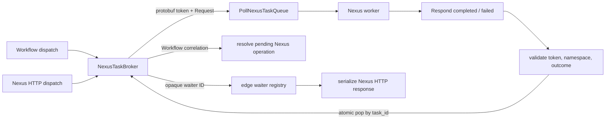

# Design Document: Edge Nexus Task Transport

## Overview

This design owns the worker-facing Nexus transport used by
`PollNexusTaskQueue`, `RespondNexusTaskCompleted`, and `RespondNexusTaskFailed`.
The original implementation delivered the three RPCs and worker-target routing,
but encoded private workflow correlation in JSON task tokens. Temporal v1.31.0
does not do that: the worker receives protobuf
`temporal.server.api.token.v1.NexusTask { namespace_id, task_queue, task_id }`,
while the server retains private result correlation by `task_id`
(`common/tasktoken/serializer.go` and
`service/matching/matching_engine.go:2449-2490,2530-2625 @ v1.31.0`).

The correction therefore separates three concerns:

1. the public opaque token identifies one broker dispatch;
2. the broker owns the private correlation and consumes it atomically;
3. the edge validates the complete worker response before consuming correlation.

The same broker supports workflow-originated dispatch and an opaque route to the
edge-owned synchronous HTTP waiter. Public Nexus protos and caller lifetimes do
not cross into runtime. The kernel remains unchanged.

## Dependencies and Non-Goals

- `api-conformance-nexus-admin` owns endpoint CRUD and the live endpoint store.
- `edge-nexus-http-dispatch` owns caller-facing HTTP parsing, the process-local
  waiter registry, public worker outcomes, and HTTP response serialization. It
  gives the broker only an opaque waiter ID.
- `kernel-nexus-operations`, `nexus-retry-policy`, and
  `nexus-async-completion` own workflow operation semantics after a worker result
  has been correlated.
- `authorization-foundation` owns gRPC admission and token-namespace ordering.
- This spec does not add durable broker state. Tokeira's broker is a disposable
  delivery mechanism; workflow authority remains the pending operation and
  history.

## Architecture



## Components and Interfaces

### Protobuf task-token codec

`tokeira-runtime::nexus` defines an internal prost message with the exact
v1.31.0 field numbers because the server-internal token proto is not part of the
vendored public API tree:

```rust
#[derive(Clone, PartialEq, prost::Message)]
pub struct NexusTaskToken {
    #[prost(string, tag = "1")]
    pub namespace_id: String,
    #[prost(string, tag = "2")]
    pub task_queue: String,
    #[prost(string, tag = "3")]
    pub task_id: String,
}
```

`encode`/`decode` use `prost::Message`. Decode failures map at the edge to
`INVALID_ARGUMENT` `Error deserializing task token.` Empty `task_queue` or
`task_id` maps to the v1.31.0 invalid-task-token error. Unknown protobuf fields
are ignored.

### Broker state and correlation

```rust
pub enum TaskCorrelation {
    Workflow {
        run_key: RunKey,
        operation_id: String,
        scheduled_event_id: i64,
    },
    Http {
        waiter_id: String,
    },
}

struct NexusBrokerState {
    ready: HashMap<(NamespaceId, TaskQueueName), VecDeque<NexusTask>>,
    outstanding: HashMap<String, TaskCorrelation>,
    wakes: HashMap<(NamespaceId, TaskQueueName), Arc<Notify>>,
}
```

Publishing is one broker operation: author a UUID `task_id`, insert correlation,
then make the task visible and notify that queue. This ordering prevents a fast
worker from responding before the result route exists. `consume(task_id)` removes
and returns exactly one correlation; unknown, expired, or repeated task IDs return
`NOT_FOUND` without changing any other entry.

Workflow publishing accepts the private `(run_key, operation_id,
scheduled_event_id)` as correlation input. The edge creates its own oneshot
waiter, registers it under an opaque UUID, and passes only that UUID to HTTP
publishing. The broker returns a delivery lease for timeout/cancellation cleanup.
Removing an edge waiter or runtime delivery lease never resolves or consumes
another task.

### Worker outcome model

The compatibility edge retains the public Nexus response proto for the brief
lifetime of the caller-facing waiter. Runtime never depends on that wire type.
The edge distinguishes:

- Start sync success;
- Start async success, including the operation token and links;
- unsuccessful operation error;
- cancel acknowledgement;
- deprecated `HandlerError` failure;
- modern Temporal `Failure` failure.

Workflow correlations continue through the existing Nexus-resolution path.
HTTP correlations resolve the edge waiter identified by the broker's opaque ID.
Validation errors leave correlation outstanding because v1.31.0 performs the
corresponding validation before consuming the server-private result route.

### Poll handler

`PollNexusTaskQueue` authorizes and resolves the polling namespace, then polls
the exact `(NamespaceId, TaskQueueName)` queue. A task response carries the
protobuf token and translated Nexus request. A timeout returns the empty response.
The token namespace is the canonical worker-target namespace ID, not a name.

### Respond handlers and precedence

Both Respond handlers follow v1.31.0 ordering
(`service/frontend/workflow_handler.go:6035-6130 @ v1.31.0`):

1. token-namespace admission follows `authorization-foundation`'s two-branch
   ordering;
2. for completion, validate the async operation token before task-token decode;
3. decode the protobuf token and validate non-empty token fields plus namespace;
4. validate operation-error JSON, or the failed response's deprecated/modern
   failure shape;
5. atomically consume correlation;
6. route the outcome according to the correlation variant.

An absent completion response or one with no variant is not a frontend
validation error in v1.31.0. It reaches the correlation owner as an empty worker
outcome; the worker RPC is acknowledged after successful delivery.

A token/request namespace mismatch returns `INVALID_ARGUMENT` with
`Operation requested with a token from a different namespace.` before broker
consumption. An unknown/already-consumed task ID returns `NOT_FOUND` with
`Nexus task not found or already expired`.

## Data Models

| Model | Durable? | Purpose |
|---|---:|---|
| `NexusTaskToken` | No | Worker-visible protobuf dispatch identity |
| `NexusTask` | No | Queue entry containing token + Nexus request |
| `TaskCorrelation::Workflow` | No | Routes a result to the authoritative pending operation |
| `TaskCorrelation::Http` | No | Carries only an opaque ID for one edge-owned synchronous HTTP waiter |
| `NexusHttpWorkerOutcome` | No | Edge-owned public-proto worker response; absent from runtime |

The private workflow identity never appears in the public token. The broker is
not authoritative: loss can lose an in-flight delivery/waiter, but cannot mutate
or falsely complete workflow history.

## Correctness Properties

### Property 1: Protobuf token round trip

*For any* valid `(namespace_id, task_queue, task_id)` tuple, protobuf encode then
decode returns the same three fields, and the bytes contain no private workflow
correlation.

**Validates: Requirements 2.1-2.6, 2.9**

### Property 2: Queue isolation and FIFO

*For any* set of queue keys and published tasks, polling one key returns only
tasks published to that key and preserves FIFO order.

**Validates: Requirements 1.1-1.6**

### Property 3: Correlation single consumption

*For any* set of outstanding task IDs, consuming one known ID returns its exact
correlation once; every later consume of that ID returns absent and all other
correlations remain unchanged.

**Validates: Requirements 1.7-1.9, 5.12-5.15, 6.9-6.12**

### Property 4: Request translation preservation

*For any* valid start or cancel task, translation to the public Nexus request
preserves every represented field and the selected variant.

**Validates: Requirements 4.1-4.4**

### Property 5: Validation-before-consumption

*For any* malformed response, namespace mismatch, oversized operation token, or
non-JSON failure details, the Respond handler returns the v1.31.0 error and leaves
the addressed correlation outstanding.

**Validates: Requirements 5.6-5.13, 6.3-6.10**

### Property 6: Correlation-route separation

*For any* valid worker outcome, a workflow correlation routes only to the named
pending operation and an HTTP correlation routes only to its waiter.

**Validates: Requirements 5.14-5.15, 6.11-6.12, 8.4**

## Error Handling

| Condition | Result |
|---|---|
| Malformed protobuf token | `INVALID_ARGUMENT`, `Error deserializing task token.` |
| Empty token `task_queue` or `task_id` | `INVALID_ARGUMENT`, invalid task token |
| Token/request namespace mismatch | `INVALID_ARGUMENT`, `Operation requested with a token from a different namespace.` |
| Async operation token over 4096 bytes | `INVALID_ARGUMENT`, `operation token length exceeds allowed limit (<actual>/4096)` |
| Non-JSON failure details | `INVALID_ARGUMENT`, `failure details must be JSON serializable` |
| Modern failure without `NexusHandlerFailureInfo` | `INVALID_ARGUMENT`, v1.31.0 literal |
| Unknown/expired/already-consumed `task_id` | `NOT_FOUND`, `Nexus task not found or already expired` |

## Testing Strategy

- Property tests cover Properties 1-6 with at least 100 cases.
- Exact-string unit tests cover every Error Handling row and prove invalid
  responses do not consume correlation.
- Integration tests cover workflow publish→poll→respond and HTTP
  publish→poll→respond, including timeout/cancellation cleanup.
- Tier 7.36 exercises external protobuf tokens, namespace mismatch, operation-token
  limits, and failure-details validation over the real gRPC wire.
