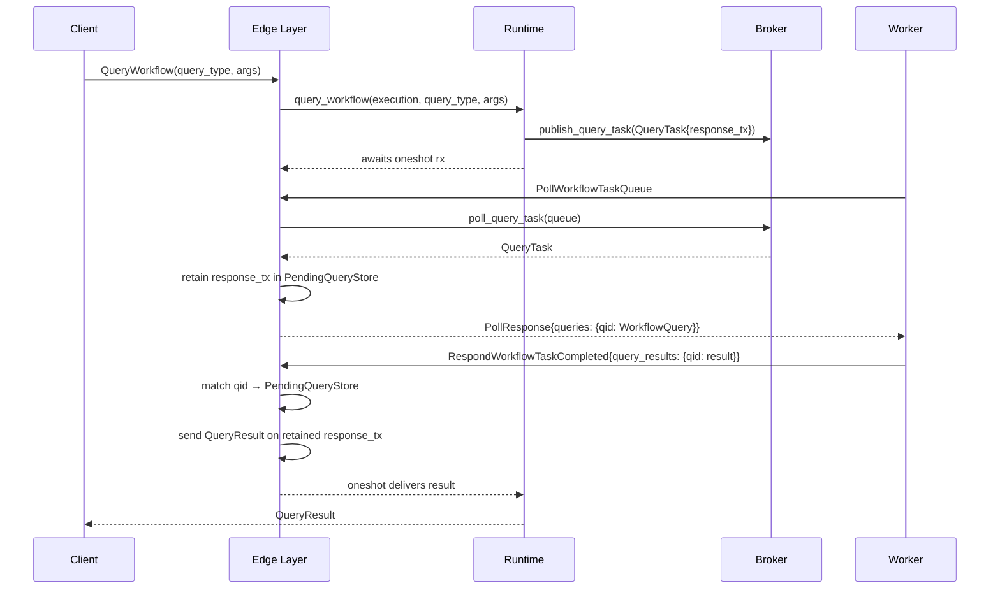
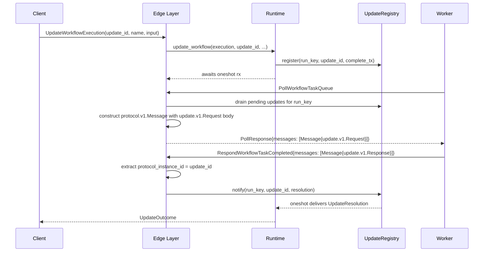

# Design Document: Edge Query & Update Transport

## Overview

This design wires the runtime's existing query dispatch (`QueryTask`, `QueryResult`) and update lifecycle (`UpdateRegistry`, `UpdateOutcome`) through the edge/gRPC layer so that queries and updates flow end-to-end between SDK clients and workers via the standard Temporal protocol.

Today, `QueryWorkflow` and `UpdateWorkflowExecution` calls reach the runtime, which creates `QueryTask`/`UpdateRegistry` entries and waits on oneshot channels. But the poll/completion path doesn't carry these to workers — the `PollWorkflowTaskQueueResponse` omits the `queries` map (field 14) and `messages` field (field 15), and `RespondWorkflowTaskCompletedRequest` ignores `query_results` (field 8) and `messages` (field 11).

The fix introduces a coordination layer between the WFT poll path and the query/update dispatch paths:

1. **`PendingQueryStore`** — when a `QueryTask` is published to the broker, the edge layer drains pending queries during poll response construction, attaches them to the `queries` map, and retains the oneshot senders for result routing.
2. **Update message construction** — pending updates from the `UpdateRegistry` are wrapped in `protocol.v1.Message` envelopes containing `update.v1.Request` bodies and attached to the `messages` field.
3. **Result routing** — on `RespondWorkflowTaskCompleted`, the edge layer extracts `query_results` and `messages`, matches them by ID to retained channels, and delivers results back to waiting callers.

The work spans `tokeira-edge` and `tokeira-runtime`:

- **Edge**: `PendingQueryStore`, proto translation for `queries`/`query_results`/`messages`, result routing, legacy `RespondQueryTaskCompleted`
- **Runtime**: `UpdateRegistryEntry` must be extended to retain `input`, `identity`, and `update_name` so the edge can construct `update.v1.Request` messages. The broker needs a combined poll that returns either a real WFT or a query-only task when queries are pending but no WFT exists.

## Architecture

### Query Flow



### Update Flow



### Design Decisions

1. **PendingQueryStore is edge-local, not in the runtime.** The runtime's broker already manages query task queues. The edge layer drains them during poll response construction and holds the oneshot senders. This avoids changing the runtime's internal architecture.

2. **Queries are delivered via two paths: piggybacked on real WFTs, or as synthetic query-only poll responses.** When a real WFT is available, queries are attached to it. When no real WFT exists (workflow is idle), the edge layer must create a synthetic query-only poll response. This requires a new poll path in the edge layer that checks the broker's query queue independently of the WFT poll. The synthetic response has `started_event_id = 0`, an empty history, and a synthetic task token that identifies the query batch. The worker evaluates queries without replaying history (the SDK handles this when `started_event_id == 0`). This is a **runtime change** — the broker needs a combined poll that returns either a real WFT or a query-only task.

3. **Update messages use `google.protobuf.Any` wrapping.** The `protocol.v1.Message.body` field is a `google.protobuf.Any`. The edge layer packs `update.v1.Request` into this envelope with the standard type URL `type.googleapis.com/temporal.api.update.v1.Request`, matching the SDK's expectations.

4. **Result routing is by ID, tolerant of missing channels.** When a `query_results` entry or update response message references an ID with no retained channel (caller timed out), the edge layer silently discards it. This matches Temporal server behavior.

5. **Query-only WFTs set `started_event_id` to zero.** When a poll response carries only queries (no history advancement), `started_event_id` is set to 0 to signal a query-only task. The SDK uses this to skip history replay when only queries need evaluation.

   **Synthetic query-only task token contract:** The synthetic task token reuses `WorkflowTaskToken` with these field values:
   - `run_key`: the target workflow's `RunKey` (needed for `PendingQueryStore` lookup)
   - `logical_seq`: `LogicalTaskSeq(0)` — sentinel value indicating a query-only task
   - `started_event_id`: `0` — no history event was created
   - `attempt`: `1`
   - `shard_epoch`: `ShardEpoch::ZERO`

   On the completion side, `respond_workflow_task_completed` must detect `logical_seq == 0` as a query-only completion. When detected:
   - Skip command processing entirely (no kernel call, no state transition)
   - Route `query_results` to the `PendingQueryStore` using the task token
   - Route `messages` (update responses) normally
   - Return an empty `RespondWorkflowTaskCompletedResponse`

   This avoids introducing a separate token type while keeping the query-only path distinguishable from real WFT completions.

6. **Legacy query support via `RespondQueryTaskCompleted`.** The `query` field (field 10) on the poll response carries a single legacy query. The `RespondQueryTaskCompleted` RPC does not carry a query ID — it uses the task token to identify the query. The `PendingQueryStore` stores at most one legacy query per task token under a well-known key (e.g. `"__legacy__"`). When a legacy query is delivered via field 10, the modern `queries` map (field 14) is left empty to avoid mixed legacy/modern ambiguity. Both legacy and modern paths coexist but are mutually exclusive per poll response.

## Components and Interfaces

### 1. PendingQueryStore

A per-poll-response store that retains query oneshot senders keyed by query ID.

```rust
/// Retained query channels keyed by task token, then by query ID.
pub struct PendingQueryStore {
    inner: Arc<Mutex<HashMap<Vec<u8>, HashMap<String, oneshot::Sender<QueryResult>>>>>,
}

impl PendingQueryStore {
    pub fn new() -> Self { ... }

    /// Store a query's response channel under a task token and query ID.
    pub fn insert(&self, token: &[u8], query_id: String, tx: oneshot::Sender<QueryResult>) { ... }

    /// Remove and return the sender for a query ID under a task token.
    pub fn take(&self, token: &[u8], query_id: &str) -> Option<oneshot::Sender<QueryResult>> { ... }

    /// Drain all remaining senders for a task token (for cleanup on timeout).
    pub fn drain(&self, token: &[u8]) -> Vec<(String, oneshot::Sender<QueryResult>)> { ... }
}
```

The store is held by the `WorkflowService`. The outer key is the serialized task token bytes so that both `RespondWorkflowTaskCompleted` (which carries the task token) and `RespondQueryTaskCompleted` (which also carries the task token) can look up the correct query channels. For legacy queries, the inner key is the well-known string `"__legacy__"`.

### 2. Edge DTO Extensions

#### PollWorkflowTaskQueueResponse

```rust
pub struct PollWorkflowTaskQueueResponse {
    pub task_token: Vec<u8>,
    pub started_event_id: i64,
    pub attempt: u32,
    pub payload: WorkflowTaskPayloadDto,
    // New fields:
    pub queries: HashMap<String, WorkflowQueryDto>,
    pub messages: Vec<ProtocolMessageDto>,
}

pub struct WorkflowQueryDto {
    pub query_type: String,
    pub query_args: Payloads,
}

/// Opaque wrapper around a serialized protocol.v1.Message.
/// The edge layer constructs these from update requests;
/// the gRPC translate layer converts them to proto.
pub struct ProtocolMessageDto {
    pub id: String,
    pub protocol_instance_id: String,
    pub body: Vec<u8>,  // serialized google.protobuf.Any
    pub sequencing_event_id: Option<i64>,
}
```

#### RespondWorkflowTaskCompletedRequest

```rust
pub struct RespondWorkflowTaskCompletedRequest {
    pub task_token: Vec<u8>,
    pub identity: String,
    pub commands: Vec<WorkflowCommand>,
    pub force_new_workflow_task: bool,
    // New fields:
    pub query_results: HashMap<String, QueryResultDto>,
    pub messages: Vec<ProtocolMessageDto>,
}

pub enum QueryResultDto {
    Answered { result: Payloads },
    Failed { error_message: String },
}
```

### 3. Proto Translation Extensions

#### poll_response_to_proto

Populates the `queries` map (field 14) and `messages` repeated field (field 15) from the edge DTO:

```rust
pub fn poll_response_to_proto(resp: PollWorkflowTaskQueueResponse) -> proto::PollWorkflowTaskQueueResponse {
    // ... existing fields ...
    queries: resp.queries.iter().map(|(id, q)| {
        (id.clone(), query::v1::WorkflowQuery {
            query_type: q.query_type.clone(),
            query_args: Some(payloads_from_domain(&q.query_args)),
            header: None,
        })
    }).collect(),
    messages: resp.messages.iter().map(|m| {
        protocol::v1::Message {
            id: m.id.clone(),
            protocol_instance_id: m.protocol_instance_id.clone(),
            body: Some(prost_types::Any::decode(&m.body[..]).unwrap_or_default()),
            sequencing_id: m.sequencing_event_id.map(|eid|
                protocol::v1::message::SequencingId::EventId(eid)
            ),
        }
    }).collect(),
}
```

#### respond_completed_request_to_edge

Extracts `query_results` (field 8) and `messages` (field 11) from the proto into the edge DTO:

```rust
pub fn respond_completed_request_to_edge(req: proto::RespondWorkflowTaskCompletedRequest) -> Result<RespondWorkflowTaskCompletedRequest> {
    // ... existing fields ...
    query_results: req.query_results.into_iter().map(|(id, qr)| {
        let result = match qr.result_type {
            QUERY_RESULT_TYPE_ANSWERED => QueryResultDto::Answered {
                result: payloads_to_domain(&qr.answer.unwrap_or_default()),
            },
            _ => QueryResultDto::Failed {
                error_message: qr.error_message,
            },
        };
        (id, result)
    }).collect(),
    messages: req.messages.into_iter().map(|m| {
        ProtocolMessageDto {
            id: m.id,
            protocol_instance_id: m.protocol_instance_id,
            body: m.body.map(|a| a.encode_to_vec()).unwrap_or_default(),
            sequencing_event_id: match m.sequencing_id {
                Some(protocol::v1::message::SequencingId::EventId(eid)) => Some(eid),
                _ => None,
            },
        }
    }).collect(),
}
```

### 4. WorkflowService Changes

#### poll_workflow_task_queue

After obtaining a `StartedWorkflowTask` from the runtime, the edge layer:

1. Drains pending query tasks from the broker for the same task queue (non-blocking, zero-timeout poll)
2. For each `QueryTask`, generates a UUID query ID, stores the `response_tx` in the `PendingQueryStore`, and adds the query to the DTO's `queries` map
3. Checks the `UpdateRegistry` for pending updates on the same `run_key` and constructs `protocol.v1.Message` entries
4. If the response carries only queries (no history events beyond what the worker already has), sets `started_event_id` to 0

#### respond_workflow_task_completed

After receiving the completion:

1. Extracts `query_results` from the DTO, looks up each query ID in the `PendingQueryStore`, and sends the `QueryResult` on the retained oneshot channel
2. Extracts `messages` from the DTO, unpacks each `protocol.v1.Message` body to determine the update response type (`Acceptance`, `Rejection`, `Response`), and notifies the `UpdateRegistry`
3. If the completion contains only `query_results` and no commands, skips command processing (query-only completion)

#### respond_query_task_completed (new)

Implements the legacy `RespondQueryTaskCompleted` RPC:

1. Extracts the query result from the request
2. Looks up the query ID in the `PendingQueryStore`
3. Sends the result on the retained oneshot channel

### 5. Update Message Construction

When constructing update request messages for the poll response:

```rust
fn build_update_request_message(
    update_id: &str,
    update_name: &str,
    input: &Payloads,
    identity: &str,
    sequencing_event_id: i64,
) -> ProtocolMessageDto {
    let request = update::v1::Request {
        meta: Some(update::v1::Meta {
            update_id: update_id.to_string(),
            identity: identity.to_string(),
        }),
        input: Some(update::v1::Input {
            name: update_name.to_string(),
            args: Some(payloads_from_domain(input)),
            header: None,
        }),
    };
    let any = pack_any(
        "type.googleapis.com/temporal.api.update.v1.Request",
        &request,
    );
    ProtocolMessageDto {
        id: format!("{update_id}/request"),
        protocol_instance_id: update_id.to_string(),
        body: any.encode_to_vec(),
        sequencing_event_id: Some(sequencing_event_id),
    }
}
```

### 6. Update Response Extraction

When processing update response messages from the completion:

```rust
fn extract_update_resolution(msg: &ProtocolMessageDto) -> Option<(String, UpdateResolution)> {
    let any = prost_types::Any::decode(&msg.body[..])?;
    let update_id = msg.protocol_instance_id.clone();

    match any.type_url.as_str() {
        url if url.ends_with("update.v1.Acceptance") => {
            // Acceptance is informational only — the runtime produces
            // UpdateOutcome::Accepted directly from the kernel commit
            // (runtime.rs line ~494), not from a worker message.
            // The UpdateRegistry only stores completion waiters with
            // Completed/Rejected/RunClosed resolutions.
            // Do NOT route acceptance to the registry.
            None
        }
        url if url.ends_with("update.v1.Rejection") => {
            let rejection = update::v1::Rejection::decode(&any.value[..])?;
            let failure = rejection.failure.map(|f| f.message).unwrap_or_default();
            Some((update_id, UpdateResolution::Rejected { failure }))
        }
        url if url.ends_with("update.v1.Response") => {
            let response = update::v1::Response::decode(&any.value[..])?;
            match response.outcome?.value? {
                outcome::Value::Success(payloads) => {
                    Some((update_id, UpdateResolution::Completed {
                        result: payloads_to_domain(&payloads),
                    }))
                }
                outcome::Value::Failure(failure) => {
                    Some((update_id, UpdateResolution::Rejected {
                        failure: failure.message,
                    }))
                }
            }
        }
        _ => None,
    }
}
```

## Data Models

No new persistent data models. All new structures are transient, in-memory coordination types:

| Type | Location | Purpose |
|---|---|---|
| `PendingQueryStore` | `tokeira-edge` | Retains query oneshot senders between poll and completion |
| `WorkflowQueryDto` | `tokeira-edge/translate` | Edge DTO for a query in the poll response |
| `QueryResultDto` | `tokeira-edge/translate` | Edge DTO for a query result in the completion |
| `ProtocolMessageDto` | `tokeira-edge/translate` | Edge DTO for a protocol message (update request/response) |

### Task Token Extension

The task token (serialized as JSON in `task_token`) already contains `run_key`. The `PendingQueryStore` is keyed by the serialized task token bytes so that `RespondWorkflowTaskCompleted` can locate the correct store entry.

## Correctness Properties

*A property is a characteristic or behavior that should hold true across all valid executions of a system — essentially, a formal statement about what the system should do. Properties serve as the bridge between human-readable specifications and machine-verifiable correctness guarantees.*

### Property 1: Query attachment preserves fields

*For any* set of `QueryTask` entries with arbitrary `query_type` strings and `query_args` payloads, when the edge layer drains them during poll response construction, the resulting `queries` map SHALL contain an entry for each query whose `WorkflowQuery` has the exact same `query_type` and `query_args`.

**Validates: Requirements 1.1, 1.3**

### Property 2: PendingQueryStore insert/take round-trip

*For any* set of query IDs and oneshot senders inserted into the `PendingQueryStore`, taking each query ID back SHALL return the original sender, and the sender SHALL still be usable to deliver a `QueryResult`.

**Validates: Requirements 1.4, 2.1**

### Property 3: Query result routing delivers correct results

*For any* set of `QueryResultDto` entries (mix of `Answered` with arbitrary payloads and `Failed` with arbitrary error messages), when routed through the `PendingQueryStore` by query ID, each retained oneshot channel SHALL receive the corresponding `QueryResult` with matching variant and content. Entries with no matching channel SHALL be silently discarded.

**Validates: Requirements 2.1, 2.2, 2.3, 2.5**

### Property 4: Update message construction preserves fields

*For any* update with arbitrary `update_id`, `update_name`, and `input` payloads, the constructed `protocol.v1.Message` SHALL have `protocol_instance_id` equal to the `update_id`, and the `body` SHALL unpack to an `update.v1.Request` whose `Meta.update_id` and `Input.name` and `Input.args` match the original values.

**Validates: Requirements 3.1, 3.2**

### Property 5: Update response routing delivers correct resolution

*For any* update response `protocol.v1.Message` (Acceptance, Rejection with arbitrary failure message, or Response with arbitrary success payloads or failure), when routed through the `UpdateRegistry` by `protocol_instance_id`, the waiting caller SHALL receive the correct `UpdateResolution` variant with matching content. Messages with no matching registry entry SHALL be silently discarded.

**Validates: Requirements 4.1, 4.2, 4.3, 4.4, 4.5**

### Property 6: Query proto round-trip

*For any* valid query ID, query type, and payloads, serializing a `WorkflowQueryDto` into the proto `queries` map and then deserializing a matching `WorkflowQueryResult` (with `QUERY_RESULT_TYPE_ANSWERED` and the same payloads) back into a `QueryResultDto` SHALL preserve the query ID, result type, and answer payloads.

**Validates: Requirements 7.1, 7.2, 7.3, 7.4**

### Property 7: Update message proto round-trip

*For any* valid update ID and protocol instance ID, serializing a `ProtocolMessageDto` into a proto `protocol.v1.Message` and deserializing it back SHALL preserve the `id`, `protocol_instance_id`, `body` bytes, and `sequencing_event_id`.

**Validates: Requirements 8.1, 8.2, 8.3, 8.4**


## Error Handling

| Scenario | Behavior |
|---|---|
| Query caller times out before worker responds | `PendingQueryStore` entry is dropped; worker's `query_results` entry is silently discarded |
| Update caller times out before worker responds | `UpdateRegistry` entry is removed by runtime timeout logic; worker's response message is silently discarded |
| Worker returns `query_results` for unknown query ID | Silently discarded, no error returned to worker |
| Worker returns update response for unknown update ID | Silently discarded, no error returned to worker |
| `query_results` entry has `QUERY_RESULT_TYPE_FAILED` | Translated to `QueryResult::Failed { message }` and sent to caller |
| Update response message has `outcome::Value::Failure` | Translated to `UpdateResolution::Rejected { failure }` and sent to caller |
| Proto deserialization failure on `protocol.v1.Message` body | Log warning, skip the message, continue processing remaining messages |
| `RespondQueryTaskCompleted` for timed-out query | Return success (empty response), no error |
| Completion with `query_results` but no commands | Treated as query-only completion; skip command processing, no state transitions |

No new `EdgeError` variants are needed. The query and update result routing is fire-and-forget on the oneshot channels — if the receiver is dropped (caller timed out), the send simply fails silently.

## Testing Strategy

### Property-based tests (proptest, 100 iterations each)

Each property test references its design document property and uses the tag format:
**Feature: edge-query-update-transport, Property {N}: {title}**

1. **Property 1** — Generate random `Vec<(String, String, Payloads)>` (query_id, query_type, query_args). Build `WorkflowQueryDto` entries, verify the queries map contains all entries with matching fields.

2. **Property 2** — Generate random query IDs (1..8). Insert oneshot senders into `PendingQueryStore`. Take each back, send a `QueryResult` on the returned sender, verify the receiver gets the correct result.

3. **Property 3** — Generate N random `QueryResultDto` entries (mix of Answered/Failed). Insert corresponding oneshot channels. Route results by ID. Verify each channel receives the correct variant and content. Include orphaned IDs (no channel) to verify silent discard.

4. **Property 4** — Generate random `(update_id, update_name, Payloads)`. Call `build_update_request_message`. Decode the body as `update.v1.Request`. Verify `protocol_instance_id == update_id`, `Meta.update_id == update_id`, `Input.name == update_name`, `Input.args == payloads`.

5. **Property 5** — Generate random update response messages (Acceptance, Rejection with random failure, Response with random success/failure). Register corresponding entries in `UpdateRegistry`. Route messages. Verify each caller receives the correct `UpdateResolution` variant. Include orphaned IDs to verify silent discard.

6. **Property 6** — Generate random `(query_id, query_type, Payloads)`. Serialize to proto `WorkflowQuery` in the queries map. Create a matching `WorkflowQueryResult` with `ANSWERED` and the same payloads. Deserialize to `QueryResultDto`. Verify all fields preserved.

7. **Property 7** — Generate random `ProtocolMessageDto` with arbitrary `id`, `protocol_instance_id`, `body` bytes, and optional `sequencing_event_id`. Serialize to proto `protocol.v1.Message`. Deserialize back. Verify all fields match.

### Unit tests (example-based)

- Query-only WFT sets `started_event_id` to 0 (Requirement 1.5)
- Query-only completion skips command processing (Requirement 2.4)
- Legacy query populates `query` field 10 (Requirement 6.1)
- `RespondQueryTaskCompleted` routes result to caller (Requirement 6.2)
- `RespondQueryTaskCompleted` for timed-out query returns success (Requirement 6.3)
- Empty `query_results` produces empty DTO (Requirement 7.4)
- Empty `messages` produces empty DTO (Requirement 8.4)

### Integration tests

- End-to-end query: `QueryWorkflow` → poll → worker answers → client receives result (Requirement 10.1-10.4)
- End-to-end update (completed): `UpdateWorkflowExecution` → poll → worker accepts+completes → client receives `Completed` (Requirement 11.1-11.2)
- End-to-end update (rejected): `UpdateWorkflowExecution` → poll → worker rejects → client receives `Rejected` (Requirement 11.3)
- End-to-end update (accepted wait policy): `UpdateWorkflowExecution` with `Accepted` wait → poll → worker accepts → client receives `Accepted` (Requirement 11.4)
- Query produces no state transitions (Requirement 10.4)

### Test library

Property-based tests use `proptest` with `ProptestConfig::with_cases(100)`, consistent with the existing test patterns in `query.rs` and `update.rs`.
