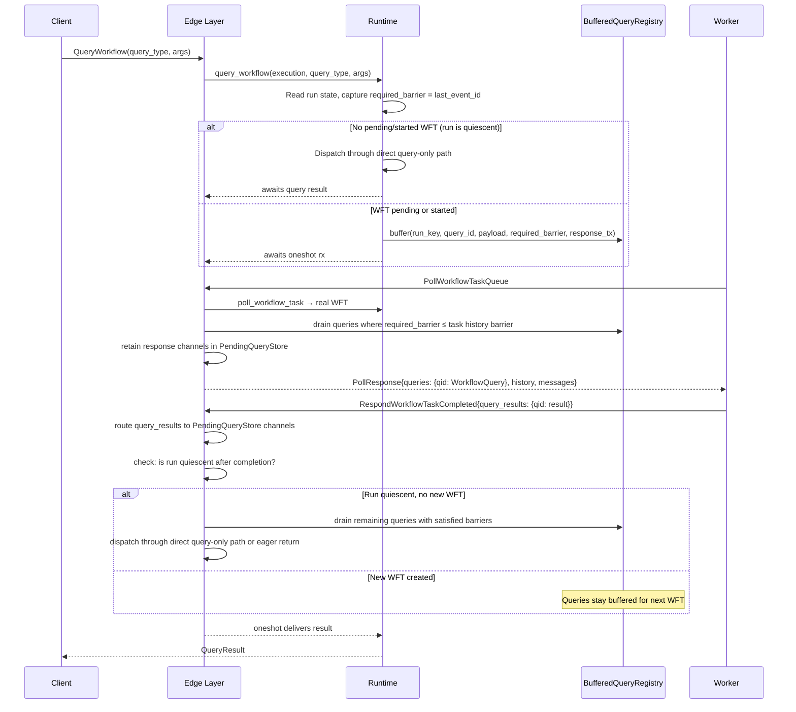
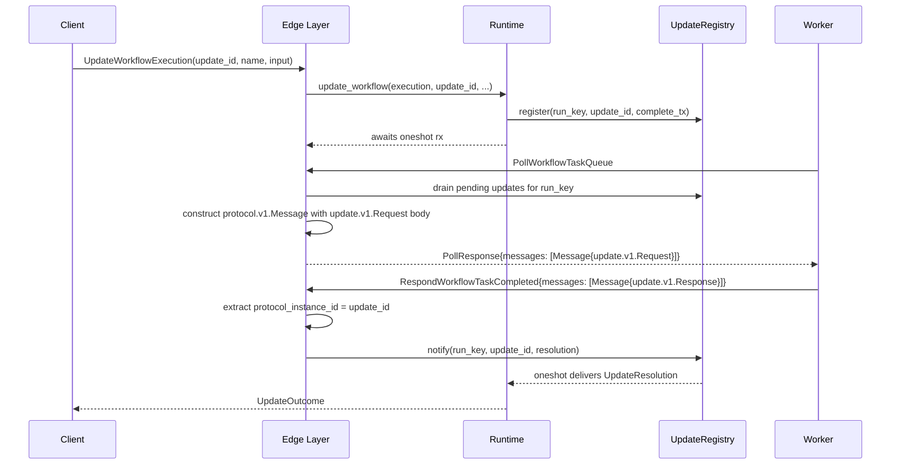

# Design Document: Edge Query & Update Transport

## Overview

This design wires the runtime's existing query dispatch and update lifecycle through the edge/gRPC layer so that queries and updates flow end-to-end between SDK clients and workers via the standard Temporal protocol.

The core correctness invariant: **once a state-mutating operation (signal, update, etc.) has been acknowledged to the client, a subsequent consistent query must not be evaluated against pre-mutation workflow state.** This is enforced by a run-local consistent-query registry with a read barrier, matching Temporal's `QueryRegistry` on mutable state.

### What Exists Today (Implemented)

The following transport plumbing is already implemented and working:

- `PendingQueryStore` — retains query oneshot senders between poll and completion, keyed by task token then query ID
- Edge DTO extensions — `queries`, `messages`, `query_results` fields on poll/completion DTOs
- Proto translation — `queries` map (field 14), `query_results` (field 8), `messages` (field 15/11) serialization and deserialization
- Query draining from broker during poll response construction
- Query result routing from `RespondWorkflowTaskCompleted`
- Legacy `RespondQueryTaskCompleted` support
- Update message construction and response routing
- `PollWorkflowExecutionUpdate` long-poll
- `RespondWorkflowTaskCompletedResponse.workflow_task` field for eager WFT return

### What Needs to Change

The current implementation buffers queries in the broker's query queue, where any poller can drain them independently. This is architecturally wrong — it allows queries to be evaluated against stale state when a WFT is in progress. The fix is to replace broker-based query buffering with a **run-local `BufferedQueryRegistry`** that enforces a read barrier on each query.

## Architecture

### Query Flow (Target)



### Update Flow (Unchanged)



### Design Decisions

1. **Consistent queries live with the run, not in the broker.** A broker is a good abstraction for workflow tasks, activity tasks, and delivery. It is a bad abstraction for consistent query waiters. Consistent queries need a run-local registry with a waiter/future, the query payload, a required state barrier, delivery status, and cancellation cleanup. This matches Temporal's `QueryRegistry` on mutable state.

2. **Each buffered query carries a `required_barrier`.** When a query is accepted, the runtime captures `required_barrier = current last_event_id`. A query may only be delivered on a task whose worker-visible state is guaranteed to include at least that barrier. This makes the consistency rule crisp: if the delivery task's history snapshot is too old, do not deliver the query; if it is new enough, piggybacking is safe; if no task is new enough yet, keep buffering.

3. **Piggybacking is only safe when the WFT hasn't been started.** Piggybacking a query onto a real WFT is safe only if that WFT has not already been handed to a worker. If a WFT has already been started and is executing on a worker, the server cannot retroactively add the query to that in-flight task payload. In that case, the query must remain buffered until the WFT completes.

4. **Eager return is gated by authoritative run state.** After WFT completion, if the run is quiescent (no pending/started WFT) and `return_new_workflow_task` is true, the edge may return an inline query-only WFT with empty history and `started_event_id=0`. If a new WFT was created by the completion (e.g., from a signal), queries stay buffered — they ride on the next real WFT. The decision is based on authoritative run state, not broker visibility.

5. **Direct query dispatch when quiescent.** When no WFT is pending/started and the run has completed at least one WFT, queries can be dispatched directly through the query-only path. The worker evaluates against cached state (sticky) or replays full history (non-sticky). This matches Temporal's "unblocked" query path.

6. **`ScheduleQueryTask` is a design smell.** Temporal's API surface suggests two query delivery modes: piggyback on an existing WFT (`queries`), or deliver a separate query-only task (`query` via `RespondQueryTaskCompleted`). Neither requires minting new WFT history events. The current `ScheduleQueryTask` kernel command creates unnecessary history churn and should be replaced incrementally. For now, the `BufferedQueryRegistry` + direct dispatch path avoids this for the common case.

7. **Update messages use `google.protobuf.Any` wrapping.** (Unchanged from current implementation.)

8. **Result routing is by ID, tolerant of missing channels.** (Unchanged from current implementation.)

9. **Legacy query support via `RespondQueryTaskCompleted`.** (Unchanged from current implementation.)

10. **Synthetic query-only task token contract.** (Unchanged from current implementation.) The synthetic task token reuses `WorkflowTaskToken` with `logical_seq = LogicalTaskSeq(0)` as a sentinel for query-only completions.

## Key Invariants

### Barrier-Release Condition (Single Sentence)

A buffered query with `required_barrier = B` may be delivered to a worker if and only if the delivery task's worker-visible history includes event `B`, AND no started-but-not-yet-completed workflow task exists whose completion could produce events that the query's caller would expect to observe.

In other words: the query is released when `observable_last_event_id ≥ required_barrier` AND `started_wft_count == 0` for the run at the moment of attachment. A pending-but-not-started WFT is fine — the query will be attached when that WFT is started (poll response built). A started WFT blocks release because its completion may produce new events the query should see.

### Lifecycle and Cleanup Rules for BufferedQueryRegistry Entries

| Event | Behavior |
|---|---|
| **Query caller timeout / cancellation** | The `query_workflow` future is cancelled or the deadline expires. The runtime removes the entry from the `BufferedQueryRegistry` via `remove(run_key, query_id)`. The oneshot `response_tx` is dropped, which causes the caller's `response_rx` to resolve with a channel-closed error (translated to a timeout error by the runtime). |
| **Run close (completed / failed / terminated / cancelled / continued-as-new / timed out)** | When the run transitions to a closed status, the runtime calls `drain_all(run_key)` on the `BufferedQueryRegistry`. Each drained query's `response_tx` is sent a `QueryResult::Failed { message: "workflow execution completed" }` (matching Temporal's behavior for queries on closed workflows). The entry is then dropped. |
| **Worker crash / WFT timeout** | The started WFT times out and the runtime schedules a new WFT (or the run becomes quiescent if no retry). Buffered queries are NOT affected — they remain in the registry. On the next successful poll or post-completion check, the normal barrier-release logic applies. No special cleanup is needed because queries are not tied to a specific WFT; they are tied to the run. |
| **Abandoned poll (poller disconnects before completion)** | If a poll response was built and queries were moved from the `BufferedQueryRegistry` to the `PendingQueryStore`, but the worker never completes the WFT (abandoned poll / network failure), the WFT will eventually time out. The `PendingQueryStore` entries for that task token become orphaned. They are cleaned up when the task token's WFT times out and the runtime schedules a replacement WFT. The query callers' oneshot channels will be dropped, causing timeout errors. This is acceptable — the callers retry. |
| **Server restart** | The `BufferedQueryRegistry` is in-memory and non-durable. On restart, all buffered queries are lost. Query callers experience timeouts and retry. This matches Temporal's behavior — the `QueryRegistry` is also in-memory on mutable state and lost on shard movement. |

### Fast-Path Preservation for Idle Runs

Phase 2 **preserves** the query-only fast path for fully idle runs. The decision tree at query acceptance time is:

1. Read authoritative run state.
2. If `pending_workflow_task.is_none()` AND `started_workflow_task.is_none()` AND the run has completed at least one WFT:
   → **Fast path**: dispatch the query directly through the broker's query-only delivery (legacy `query` field or direct matching). The query does NOT enter the `BufferedQueryRegistry`. This is the common case for queries on idle workflows.
3. Otherwise:
   → **Buffered path**: place the query in the `BufferedQueryRegistry` with `required_barrier = last_event_id`. The query waits for a WFT whose history satisfies the barrier.

The fast path is safe because: if no WFT is pending or started, no in-flight mutation can produce events the query should observe. The run's `last_event_id` at query acceptance time IS the latest committed state, and the worker (if sticky-cached) or the full history (if non-sticky) will reflect exactly that state.

The `BufferedQueryRegistry` is only used when there is an in-flight or pending WFT that could produce events between the query's acceptance and its evaluation. Once all queries go through the registry, they are subject to the barrier-release condition above.

## Components and Interfaces

### 1. BufferedQueryRegistry (New)

A run-local in-memory registry of consistent query waiters.

```rust
/// A buffered consistent query waiting for delivery.
pub struct BufferedQuery {
    pub query_id: String,
    pub query_type: String,
    pub query_args: Payloads,
    /// The minimum last_event_id the delivery task must observe.
    pub required_barrier: i64,
    /// One-shot response channel back to the QueryWorkflow caller.
    pub response_tx: oneshot::Sender<QueryResult>,
}

/// Run-local registry of buffered consistent queries.
pub struct BufferedQueryRegistry {
    inner: Arc<Mutex<HashMap<RunKey, VecDeque<BufferedQuery>>>>,
}

impl BufferedQueryRegistry {
    pub fn new() -> Self { ... }

    /// Buffer a query for a run. Returns Err if the per-run limit is exceeded.
    pub fn buffer(
        &self,
        run_key: RunKey,
        query: BufferedQuery,
    ) -> Result<(), BufferedQuery> { ... }

    /// Drain queries whose required_barrier is satisfied by the given barrier.
    /// Returns the drained queries; leaves unsatisfied queries in the registry.
    pub fn drain_satisfied(
        &self,
        run_key: RunKey,
        observable_barrier: i64,
    ) -> Vec<BufferedQuery> { ... }

    /// Drain ALL remaining queries for a run (e.g., for direct dispatch
    /// when the run is quiescent and the barrier is satisfied).
    pub fn drain_all(&self, run_key: RunKey) -> Vec<BufferedQuery> { ... }

    /// Remove a specific query (e.g., on timeout/cancellation).
    pub fn remove(&self, run_key: RunKey, query_id: &str) -> Option<BufferedQuery> { ... }

    /// Check if any queries are buffered for a run.
    pub fn has_buffered(&self, run_key: RunKey) -> bool { ... }
}
```

The registry is held by the runtime (or the `WorkflowService`). It replaces the broker's query queue for consistent query buffering.

### 2. PendingQueryStore (Existing, Unchanged)

Retains query oneshot senders between poll response construction and completion response routing. Keyed by task token bytes, then by query ID. This store is populated when queries are attached to a poll response (from the `BufferedQueryRegistry`) and consumed when `query_results` arrive in the completion.

```rust
pub struct PendingQueryStore {
    inner: Arc<Mutex<HashMap<Vec<u8>, HashMap<String, oneshot::Sender<QueryResult>>>>>,
}
```

### 3. Edge DTO Extensions (Existing, Extended)

#### RespondWorkflowTaskCompletedResponse

```rust
pub struct RespondWorkflowTaskCompletedResponse {
    pub transition_seq: u64,
    pub last_event_id: i64,
    pub execution_status: ExecutionStatus,
    pub new_run_id: Option<RunId>,
    pub was_duplicate: bool,
    /// Inline query-only WFT for eager return (empty history + queries).
    pub workflow_task: Option<PollWorkflowTaskQueueResponse>,
}
```

All other DTOs remain as currently implemented.

### 4. WorkflowService Changes

#### query_workflow (Runtime)

```
1. Resolve the run
2. Read authoritative run state
3. Capture required_barrier = current last_event_id
4. If no pending/started WFT and run has completed ≥1 WFT:
     → dispatch through direct query-only path
5. Else:
     → buffer in BufferedQueryRegistry
     → await oneshot response
```

#### poll_workflow_task_queue (Edge)

```
1. Poll runtime for a real WFT (no query-only tasks from broker)
2. Build poll response with history
3. Determine observable_barrier = last event ID in the response history
4. Drain BufferedQueryRegistry: queries where required_barrier ≤ observable_barrier
5. For each drained query:
   - Generate UUID query ID
   - Store response_tx in PendingQueryStore keyed by task token
   - Add to response queries map
6. Drain UpdateRegistry for pending updates → messages
7. Return response
```

#### respond_workflow_task_completed (Edge)

```
1. Route query_results to PendingQueryStore channels
2. Route update messages to UpdateRegistry
3. If query-only completion (logical_seq=0): skip command processing, return
4. Commit WFT completion via runtime
5. Read post-completion run state (authoritative)
6. If run is quiescent (no pending/started WFT):
   a. If return_new_workflow_task and BufferedQueryRegistry has queries:
      → build eager return (empty history, started_event_id=0, attach queries)
   b. Else if BufferedQueryRegistry has queries:
      → dispatch through direct query-only path
7. If new WFT was created: queries stay buffered
```

### 5. Update Message Construction (Existing, Unchanged)

(Same as current implementation — `build_update_request_message` and `extract_update_resolution`.)

## Data Models

| Type | Location | Purpose |
|---|---|---|
| `BufferedQueryRegistry` | `tokeira-runtime` | Run-local registry of consistent query waiters with barriers |
| `BufferedQuery` | `tokeira-runtime` | A single buffered query entry with payload and barrier |
| `PendingQueryStore` | `tokeira-edge` | Retains query oneshot senders between poll and completion |
| `WorkflowQueryDto` | `tokeira-edge/translate` | Edge DTO for a query in the poll response |
| `QueryResultDto` | `tokeira-edge/translate` | Edge DTO for a query result in the completion |
| `ProtocolMessageDto` | `tokeira-edge/translate` | Edge DTO for a protocol message (update request/response) |

## Correctness Properties

### Property 1: Query barrier consistency

*For any* query accepted with `required_barrier = B`, the query SHALL NOT be delivered on any task whose observable history barrier is less than `B`. *For any* task with observable barrier `≥ B`, the query MAY be delivered.

**Validates: Requirements 1.1, 2.1, 2.2, 2.3**

### Property 2: Query attachment preserves fields

*For any* set of `BufferedQuery` entries with arbitrary `query_type` strings and `query_args` payloads, when attached to a poll response, the resulting `queries` map SHALL contain an entry for each query whose `WorkflowQuery` has the exact same `query_type` and `query_args`.

**Validates: Requirements 2.5, 8.1**

### Property 3: PendingQueryStore insert/take round-trip

*For any* set of query IDs and oneshot senders inserted into the `PendingQueryStore`, taking each query ID back SHALL return the original sender, and the sender SHALL still be usable to deliver a `QueryResult`.

**Validates: Requirements 2.6, 3.1**

### Property 4: Query result routing delivers correct results

*For any* set of `QueryResultDto` entries (mix of `Answered` with arbitrary payloads and `Failed` with arbitrary error messages), when routed through the `PendingQueryStore` by query ID, each retained oneshot channel SHALL receive the corresponding `QueryResult` with matching variant and content. Entries with no matching channel SHALL be silently discarded.

**Validates: Requirements 3.1, 3.2, 3.3, 3.5**

### Property 5: Post-completion quiescence check

*For any* WFT completion that creates a new pending WFT, buffered queries SHALL NOT be dispatched eagerly or directly. *For any* WFT completion that leaves the run quiescent, buffered queries with satisfied barriers SHALL be dispatchable.

**Validates: Requirements 4.1, 4.2, 4.3, 5.4**

### Property 6: Update message construction preserves fields

*For any* update with arbitrary `update_id`, `update_name`, and `input` payloads, the constructed `protocol.v1.Message` SHALL have `protocol_instance_id` equal to the `update_id`, and the `body` SHALL unpack to an `update.v1.Request` whose `Meta.update_id` and `Input.name` and `Input.args` match the original values.

**Validates: Requirements 6.1, 6.2**

### Property 7: Update response routing delivers correct resolution

*For any* update response `protocol.v1.Message` (Acceptance, Rejection with arbitrary failure message, or Response with arbitrary success payloads or failure), when routed through the `UpdateRegistry` by `protocol_instance_id`, the waiting caller SHALL receive the correct `UpdateResolution` variant with matching content. Messages with no matching registry entry SHALL be silently discarded.

**Validates: Requirements 7.1, 7.2, 7.3, 7.4, 7.5**

### Property 8: Query proto round-trip

*For any* valid query ID, query type, and payloads, serializing a `WorkflowQueryDto` into the proto `queries` map and then deserializing a matching `WorkflowQueryResult` back into a `QueryResultDto` SHALL preserve the query ID, result type, and answer payloads.

**Validates: Requirements 10.1, 10.2, 10.3, 10.4**

### Property 9: Update message proto round-trip

*For any* valid update ID and protocol instance ID, serializing a `ProtocolMessageDto` into a proto `protocol.v1.Message` and deserializing it back SHALL preserve the `id`, `protocol_instance_id`, `body` bytes, and `sequencing_event_id`.

**Validates: Requirements 11.1, 11.2, 11.3, 11.4**

## Error Handling

| Scenario | Behavior |
|---|---|
| Query caller times out before worker responds | `BufferedQueryRegistry` entry removed; `PendingQueryStore` entry dropped; worker's `query_results` entry silently discarded |
| Buffered query count exceeds per-run limit | Query rejected with error |
| Update caller times out before worker responds | `UpdateRegistry` entry removed; worker's response message silently discarded |
| Worker returns `query_results` for unknown query ID | Silently discarded |
| Worker returns update response for unknown update ID | Silently discarded |
| `query_results` entry has `QUERY_RESULT_TYPE_FAILED` | Translated to `QueryResult::Failed { message }` |
| Update response message has `outcome::Value::Failure` | Translated to `UpdateResolution::Rejected { failure }` |
| Proto deserialization failure on `protocol.v1.Message` body | Log warning, skip the message |
| `RespondQueryTaskCompleted` for timed-out query | Return success (empty response) |
| Completion with `query_results` but no commands | Query-only completion; skip command processing |

## Testing Strategy

### Property-based tests (proptest, 100 iterations each)

1. **Property 1** — Generate random `(required_barrier, observable_barrier)` pairs. Verify `drain_satisfied` only returns queries where `required_barrier ≤ observable_barrier`.

2. **Property 2** — Generate random query payloads. Attach to poll response. Verify all fields preserved.

3. **Property 3** — Generate random query IDs. Insert/take round-trip through `PendingQueryStore`. Verify senders are usable.

4. **Property 4** — Generate random `QueryResultDto` entries. Route through `PendingQueryStore`. Verify correct delivery and silent discard of orphans.

5. **Property 5** — Generate random completion outcomes (with/without new WFT). Verify buffered queries are dispatched only when quiescent.

6-9. — (Same as current property tests for update message construction, update response routing, query proto round-trip, update message proto round-trip.)

### Integration tests

- Signal → Query ordering: signal(5) then query(get_counter) returns 5 (the core invariant)
- End-to-end query on idle workflow
- End-to-end update (completed, rejected, accepted wait policy)
- Query produces no state transitions
- Buffered query count limit enforcement
