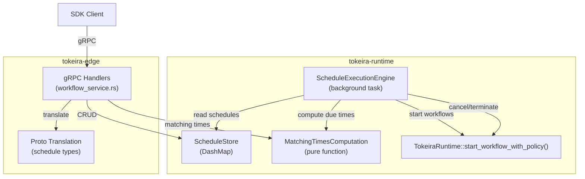

# Design Document: Edge Schedule Transport

## Overview

This design implements the Schedule Transport layer for Tokeira — 7 gRPC handlers for Temporal's Schedule feature, plus the backing `ScheduleStore` and `ScheduleExecutionEngine`. Schedules provide cron-like recurring workflow execution with rich calendar/interval specs, overlap policies, catchup windows, and operational controls.

The architecture follows the same principles as the versioning transport: the kernel stays pure, the schedule store lives in `tokeira-runtime` (using `DashMap` with conflict tokens), proto translation stays in `tokeira-edge`, and the execution engine is a background task in `tokeira-runtime` using the `CancellationToken` + `tokio::select!` loop pattern.

### Phased Delivery

| Phase | Scope | Handlers |
|-------|-------|----------|
| 1 | Schedule storage, CRUD | `create_schedule`, `describe_schedule`, `update_schedule`, `delete_schedule` |
| 2 | Execution engine, matching times | Background ticker, overlap policies, catchup window |
| 3 | Operational handlers | `patch_schedule`, `list_schedules`, `list_schedule_matching_times` |
| 4 | Integration | `cron_schedule` field threading, schedule-triggered starts via existing path |

## Architecture



### Key Design Decisions

1. **In-memory schedule store with `DashMap`** — `DashMap<(NamespaceId, ScheduleId), ScheduleEntry>` provides lock-free concurrent reads and fine-grained write locking. Same pattern as `VersioningRuleStore`. Durable persistence deferred to DSQL storage spec.

2. **Conflict token as monotonic counter** — Each schedule entry gets a `u64` counter encoded as big-endian bytes. Empty token on update means unconditional write (no OCC check). Matches the versioning store pattern.

3. **Matching times as a pure function** — `compute_matching_times(spec, range, schedule_id) -> Vec<OffsetDateTime>` is a pure function with no side effects. Both the execution engine and `list_schedule_matching_times` handler call it. Jitter uses `schedule_id + nominal_time` as seed for determinism.

4. **Execution engine as background ticker** — Uses `CancellationToken` + `tokio::select!` loop (same as `run_timer_scanner`). Ticks every 1 second, iterates all non-paused schedules, computes due actions, and triggers them. Simple polling approach for MVP.

5. **Overlap policy as a decision function** — `decide_overlap(policy, running_workflows, buffer) -> OverlapDecision` is a pure function that returns `Allow`, `Skip`, `Buffer`, `CancelOther`, or `TerminateOther`. The engine acts on the decision.

6. **Deterministic workflow ID suffix** — When `keep_original_workflow_id` is false, appends `-<nominal_time_unix_seconds>` to the workflow ID. Based on nominal schedule time (not wall clock), ensuring idempotent retries produce the same ID.

7. **`cron_schedule` field threading** — The kernel's `StartRequest` does not currently have a `cron_schedule` field. We add an optional `cron_schedule: Option<String>` field to `StartRequest`. The execution engine sets it to the schedule ID. The history serializer emits it on `WorkflowExecutionStartedEventAttributes`.

8. **Shared ownership** — `Arc<ScheduleStore>` shared between `WorkflowService` (CRUD handlers) and `ScheduleExecutionEngine` (background evaluation). The engine holds a reference to `TokeiraRuntime` for starting/cancelling/terminating workflows.

9. **Engine calls `TokeiraRuntime::start_workflow_with_policy()` directly (not edge handler)** — The execution engine lives in `tokeira-runtime` and cannot call through the edge gRPC handler (that would create a crate cycle). Instead, it calls `TokeiraRuntime::start_workflow_with_policy()` directly — the same runtime entry point the edge handler calls after translation. This ensures ID-conflict/reuse policy handling matches SDK-initiated starts. For versioning, the engine calls `VersioningRuleStore::evaluate_assignment()` before constructing the `StartRequest`, replicating the same logic the edge layer performs. This avoids the crate cycle while preserving versioning and conflict-policy behavior.

10. **Workflow completion observation via reconciliation** — The engine periodically reconciles `running_workflows` by querying `TokeiraRuntime` for workflow execution status. Completed/failed/terminated/cancelled/timed-out workflows are removed from `running_workflows`, buffered actions are drained, and `pause_on_failure` is evaluated. This is a polling approach (same tick interval) — event-driven completion callbacks are deferred to a future optimization.

## Components and Interfaces

### ScheduleStore

New file: `crates/tokeira-runtime/src/schedule.rs`

```rust
use dashmap::DashMap;
use time::OffsetDateTime;
use tokeira_types::{NamespaceId, Payloads, SearchAttributes, Memo};

/// Unique schedule identifier within a namespace.
#[derive(Clone, Debug, PartialEq, Eq, Hash)]
pub struct ScheduleId(pub String);

/// The full stored state of a schedule.
#[derive(Clone, Debug)]
pub struct ScheduleEntry {
    pub schedule_id: ScheduleId,
    pub namespace_id: NamespaceId,
    pub spec: ScheduleSpec,
    pub action: ScheduleAction,
    pub policies: SchedulePolicies,
    pub state: ScheduleState,
    pub info: ScheduleInfo,
    pub memo: Memo,
    pub search_attributes: SearchAttributes,
    pub conflict_token: Vec<u8>,
}

#[derive(Default)]
pub struct ScheduleStore {
    entries: DashMap<(NamespaceId, ScheduleId), ScheduleEntry>,
}
```

**Public API:**

| Method | Description |
|--------|-------------|
| `create(&self, entry: ScheduleEntry) -> Result<Vec<u8>, ScheduleError>` | Inserts new entry, returns conflict token. Errors if already exists. |
| `describe(&self, ns, id) -> Result<ScheduleEntry, ScheduleError>` | Returns full entry. Errors if not found. |
| `update(&self, ns, id, token, updater) -> Result<ScheduleEntry, ScheduleError>` | Validates token (empty = unconditional), applies updater closure, increments token. |
| `delete(&self, ns, id) -> Result<(), ScheduleError>` | Removes entry. Errors if not found. |
| `list(&self, ns, page_size, page_token) -> (Vec<ScheduleEntry>, Option<PageToken>)` | Paginated listing for a namespace. |
| `all_active_schedules(&self) -> Vec<ScheduleEntry>` | Returns all non-paused schedules (for engine tick). |

### Domain Types

```rust
/// Internal representation of ScheduleSpec.
#[derive(Clone, Debug, PartialEq)]
pub struct ScheduleSpec {
    pub structured_calendars: Vec<StructuredCalendarSpec>,
    pub intervals: Vec<IntervalSpec>,
    pub exclude_calendars: Vec<StructuredCalendarSpec>,
    pub start_time: Option<OffsetDateTime>,
    pub end_time: Option<OffsetDateTime>,
    pub jitter: Option<std::time::Duration>,
    pub timezone_name: String,
}

#[derive(Clone, Debug, PartialEq)]
pub struct StructuredCalendarSpec {
    pub second: Vec<Range>,
    pub minute: Vec<Range>,
    pub hour: Vec<Range>,
    pub day_of_month: Vec<Range>,
    pub month: Vec<Range>,
    pub year: Vec<Range>,
    pub day_of_week: Vec<Range>,
    pub comment: String,
}

#[derive(Clone, Debug, PartialEq)]
pub struct Range {
    pub start: i32,
    pub end: i32,
    pub step: i32,
}

#[derive(Clone, Debug, PartialEq)]
pub struct IntervalSpec {
    pub interval: std::time::Duration,
    pub phase: std::time::Duration,
}

#[derive(Clone, Debug, PartialEq)]
pub struct ScheduleAction {
    pub start_workflow: StartWorkflowAction,
}

#[derive(Clone, Debug, PartialEq)]
pub struct StartWorkflowAction {
    pub workflow_id: String,
    pub workflow_type: String,
    pub task_queue: String,
    pub input: Payloads,
    pub workflow_execution_timeout: Option<std::time::Duration>,
    pub workflow_run_timeout: Option<std::time::Duration>,
    pub workflow_task_timeout: Option<std::time::Duration>,
    pub retry_policy: Option<tokeira_types::RetryPolicy>,
    pub memo: Memo,
    pub search_attributes: SearchAttributes,
}

#[derive(Clone, Debug, PartialEq)]
pub struct SchedulePolicies {
    pub overlap_policy: OverlapPolicy,
    pub catchup_window: std::time::Duration,
    pub pause_on_failure: bool,
    pub keep_original_workflow_id: bool,
}

#[derive(Clone, Debug, PartialEq, Eq, Copy)]
pub enum OverlapPolicy {
    Skip,
    BufferOne,
    BufferAll,
    CancelOther,
    TerminateOther,
    AllowAll,
}

#[derive(Clone, Debug, PartialEq)]
pub struct ScheduleState {
    pub notes: String,
    pub paused: bool,
    pub limited_actions: bool,
    pub remaining_actions: i64,
}

#[derive(Clone, Debug, PartialEq)]
pub struct ScheduleInfo {
    pub action_count: i64,
    pub missed_catchup_window: i64,
    pub overlap_skipped: i64,
    pub buffer_dropped: i64,
    pub buffer_size: i64,
    pub buffered_actions: Vec<BufferedAction>,
    pub running_workflows: Vec<WorkflowExecution>,
    pub recent_actions: Vec<ScheduleActionResult>,
    pub future_action_times: Vec<OffsetDateTime>,
    pub create_time: OffsetDateTime,
    pub update_time: Option<OffsetDateTime>,
}

/// A buffered action waiting to be executed after running workflows complete.
#[derive(Clone, Debug, PartialEq)]
pub struct BufferedAction {
    pub nominal_time: OffsetDateTime,
    pub overlap_policy_override: Option<OverlapPolicy>,
}

#[derive(Clone, Debug, PartialEq)]
pub struct WorkflowExecution {
    pub workflow_id: String,
    pub run_id: String,
    pub run_key: RunKey,  // needed for reconciliation queries and cancel/terminate
}

#[derive(Clone, Debug, PartialEq)]
pub struct ScheduleActionResult {
    pub schedule_time: OffsetDateTime,
    pub actual_time: OffsetDateTime,
    pub start_workflow_result: Option<WorkflowExecution>,
    pub start_workflow_status: WorkflowExecutionStatus,
}

#[derive(Clone, Debug, PartialEq, Eq, Copy)]
pub enum WorkflowExecutionStatus {
    Running,
    Completed,
    Failed,
    Cancelled,
    Terminated,
    ContinuedAsNew,
    TimedOut,
    /// The start request itself failed (e.g., workflow ID conflict).
    StartFailed,
}
```

### MatchingTimesComputation

Pure function in `crates/tokeira-runtime/src/schedule.rs`:

```rust
/// Compute all action timestamps within [range_start, range_end] for the given spec.
/// Jitter is deterministic based on schedule_id + nominal_time.
pub fn compute_matching_times(
    spec: &ScheduleSpec,
    range_start: OffsetDateTime,
    range_end: OffsetDateTime,
    schedule_id: &ScheduleId,
) -> Vec<OffsetDateTime> { ... }

/// Compute the next N action times from `now` for a spec.
pub fn compute_next_times(
    spec: &ScheduleSpec,
    now: OffsetDateTime,
    count: usize,
    schedule_id: &ScheduleId,
) -> Vec<OffsetDateTime> { ... }
```

### Overlap Policy Decision

Pure function:

```rust
#[derive(Clone, Debug, PartialEq)]
pub enum OverlapDecision {
    Allow,
    Skip,
    Buffer,
    CancelOther(Vec<WorkflowExecution>),
    TerminateOther(Vec<WorkflowExecution>),
}

/// Decide what to do when a new action is due.
pub fn decide_overlap(
    policy: OverlapPolicy,
    running_workflows: &[WorkflowExecution],
    current_buffer_size: i64,
) -> OverlapDecision { ... }
```

### Workflow ID Generation

Pure function:

```rust
/// Generate the workflow ID for a schedule-triggered start.
pub fn schedule_workflow_id(
    base_workflow_id: &str,
    nominal_time: OffsetDateTime,
    keep_original: bool,
) -> String {
    if keep_original {
        base_workflow_id.to_string()
    } else {
        format!("{}-{}", base_workflow_id, nominal_time.unix_timestamp())
    }
}
```

### ScheduleExecutionEngine

Background task in `crates/tokeira-runtime/src/schedule.rs`:

```rust
pub struct ScheduleEngineConfig {
    pub tick_interval: tokio::time::Duration,
}

impl Default for ScheduleEngineConfig {
    fn default() -> Self {
        Self {
            tick_interval: tokio::time::Duration::from_secs(1),
        }
    }
}

/// Background loop that evaluates schedules and triggers actions.
/// Calls `TokeiraRuntime::start_workflow_with_policy()` directly (not the edge handler)
/// to avoid a crate cycle. Performs versioning rule evaluation inline.
pub async fn run_schedule_engine<R>(
    store: Arc<ScheduleStore>,
    runtime: Arc<TokeiraRuntime<R>>,
    config: ScheduleEngineConfig,
    cancel: CancellationToken,
) where
    R: RunRepository + 'static,
{
    let mut last_tick = OffsetDateTime::now_utc();
    loop {
        tokio::select! {
            _ = cancel.cancelled() => break,
            _ = tokio::time::sleep(config.tick_interval) => {}
        }
        let now = OffsetDateTime::now_utc();
        // 1. Reconcile running workflows — remove completed, drain buffers
        reconcile_running_workflows(&store, &runtime).await;
        // 2. Evaluate due actions for all active schedules
        evaluate_all_schedules(&store, &runtime, last_tick, now).await;
        last_tick = now;
    }
}

/// Reconcile running_workflows by querying runtime for terminal status.
/// Drains buffered_actions when running workflows complete.
/// Evaluates pause_on_failure when a workflow fails.
async fn reconcile_running_workflows<R>(
    store: &ScheduleStore,
    runtime: &TokeiraRuntime<R>,
) where R: RunRepository + 'static { ... }
```

### Proto Translation

New functions in `crates/tokeira-edge/src/translate/schedule.rs`:

| Function | Direction | Description |
|----------|-----------|-------------|
| `create_schedule_request_to_edge()` | proto → domain | Parse `CreateScheduleRequest` |
| `describe_schedule_response_to_proto()` | domain → proto | Build `DescribeScheduleResponse` |
| `update_schedule_request_to_edge()` | proto → domain | Parse `UpdateScheduleRequest` |
| `patch_schedule_request_to_edge()` | proto → domain | Parse `PatchScheduleRequest` |
| `list_schedules_response_to_proto()` | domain → proto | Build `ListSchedulesResponse` |
| `matching_times_response_to_proto()` | domain → proto | Build `ListScheduleMatchingTimesResponse` |
| `schedule_spec_to_domain()` | proto → domain | Convert `ScheduleSpec` proto to internal |
| `schedule_spec_to_proto()` | domain → proto | Convert internal spec to proto |
| `compile_calendar_spec()` | proto → domain | Compile `CalendarSpec`/`cron_string` to `StructuredCalendarSpec` |

**Intentionally lossy fields (documented in UNSUPPORTED_FIELDS.md):**
- `ScheduleSpec.timezone_data` — dropped on describe/list per proto documentation
- `CalendarSpec` / `cron_string` — compiled to `StructuredCalendarSpec` on ingest; originals not stored
- `NewWorkflowExecutionInfo.header` — not modeled internally
- `NewWorkflowExecutionInfo.user_metadata` — not modeled internally
- `NewWorkflowExecutionInfo.versioning_override` — not supported; schedules always use assignment rule evaluation (equivalent to `AutoUpgrade`). If a schedule action carries a pinned override, `create_schedule` / `update_schedule` SHALL reject with `INVALID_ARGUMENT`.

### Integration: cron_schedule Field

Add to `tokeira-kernel/src/command.rs`:

```rust
pub struct StartRequest {
    // ... existing fields ...
    /// Schedule ID that triggered this start, if any.
    /// Emitted as `cron_schedule` on WorkflowExecutionStartedEventAttributes.
    pub cron_schedule: Option<String>,
}
```

The execution engine sets `cron_schedule = Some(schedule_id.0.clone())` when constructing the `StartRequest`. The history serializer emits it on the started event attributes.

## Data Models

### ScheduleEntry (per namespace + schedule_id)

| Field | Type | Description |
|-------|------|-------------|
| `schedule_id` | `ScheduleId` | Unique identifier within namespace |
| `namespace_id` | `NamespaceId` | Owning namespace |
| `spec` | `ScheduleSpec` | When to fire (calendars, intervals, exclusions) |
| `action` | `ScheduleAction` | What to do (start_workflow) |
| `policies` | `SchedulePolicies` | Overlap, catchup, pause-on-failure, workflow ID |
| `state` | `ScheduleState` | Paused, notes, limited_actions, remaining_actions |
| `info` | `ScheduleInfo` | Counters, running workflows, recent actions |
| `memo` | `Memo` | Unindexed metadata |
| `search_attributes` | `SearchAttributes` | Indexed attributes |
| `conflict_token` | `Vec<u8>` | Big-endian u64, monotonically increasing |

### ScheduleSpec

| Field | Type | Description |
|-------|------|-------------|
| `structured_calendars` | `Vec<StructuredCalendarSpec>` | Calendar-based time specs |
| `intervals` | `Vec<IntervalSpec>` | Interval-based time specs |
| `exclude_calendars` | `Vec<StructuredCalendarSpec>` | Exclusion specs |
| `start_time` | `Option<OffsetDateTime>` | Earliest allowed action time |
| `end_time` | `Option<OffsetDateTime>` | Latest allowed action time |
| `jitter` | `Option<Duration>` | Random offset [0, jitter] per action |
| `timezone_name` | `String` | IANA timezone for calendar interpretation |

### SchedulePolicies

| Field | Type | Description |
|-------|------|-------------|
| `overlap_policy` | `OverlapPolicy` | SKIP, BUFFER_ONE, BUFFER_ALL, CANCEL_OTHER, TERMINATE_OTHER, ALLOW_ALL |
| `catchup_window` | `Duration` | Max age for missed actions (default 1 year, min 10s) |
| `pause_on_failure` | `bool` | Auto-pause on workflow failure |
| `keep_original_workflow_id` | `bool` | Skip timestamp suffix on workflow ID |

### Conflict Token Encoding

```
conflict_token = (counter as u64).to_be_bytes().to_vec()
```

Initial value on creation: `1_u64.to_be_bytes()`. Incremented by 1 on each mutation. Empty token (`[]`) means unconditional update.

## Correctness Properties

*A property is a characteristic or behavior that should hold true across all valid executions of a system — essentially, a formal statement about what the system should do. Properties serve as the bridge between human-readable specifications and machine-verifiable correctness guarantees.*

### Property 1: Schedule store CRUD correctness

*For any* sequence of create, update, and delete operations applied to a `ScheduleStore`, the resulting state SHALL match the expected state computed by applying the operations sequentially. Specifically: (a) creating a schedule and then describing it returns the same data; (b) creating a schedule with an existing ID returns `ALREADY_EXISTS`; (c) describing, updating, patching, or deleting a non-existent schedule returns `NOT_FOUND`; (d) deleting a schedule causes subsequent describe to return `NOT_FOUND`.

**Validates: Requirements 1.1, 1.7, 2.1, 2.2, 3.1, 3.2, 4.1, 4.4, 5.1, 5.2**

### Property 2: Conflict token monotonicity and optimistic concurrency

*For any* sequence of successful mutations applied to a schedule entry, the conflict token SHALL strictly increase after each mutation. *For any* update request carrying a non-empty conflict token that does not match the current stored token, the mutation SHALL be rejected. *For any* update request carrying an empty conflict token, the mutation SHALL succeed unconditionally.

**Validates: Requirements 1.2, 1.3, 1.4, 1.5, 4.2, 4.3**

### Property 3: Matching times range containment and monotonicity

*For any* valid `ScheduleSpec`, schedule ID, and time range `[start, end]`, all timestamps returned by `compute_matching_times` SHALL be within `[start, end]`. Furthermore, *for any* sub-range `[s2, e2]` where `s2 >= start` and `e2 <= end`, the matching times for the sub-range SHALL be a subset of the matching times for the full range.

**Validates: Requirements 6.1, 6.6, 6.7, 6.10**

### Property 4: Matching times union and exclusion correctness

*For any* `ScheduleSpec` containing both calendar and interval entries, the matching times SHALL equal the union of calendar-only matching times and interval-only matching times, minus any timestamps that match the exclusion specs.

**Validates: Requirements 6.2, 6.3, 6.4, 6.5**

### Property 5: Jitter determinism and bounds

*For any* `ScheduleSpec` with jitter set, *for any* schedule ID and nominal action time, the jittered time SHALL be deterministic (computing twice yields the same result) and the offset SHALL be in `[0, jitter]`.

**Validates: Requirements 6.8**

### Property 6: Overlap policy decision correctness

*For any* overlap policy, set of running workflows, and buffer state: (a) `SKIP` with non-empty running workflows returns `Skip`; (b) `BUFFER_ONE` with non-empty running workflows and buffer_size < 1 returns `Buffer`; (c) `BUFFER_ONE` with buffer_size >= 1 returns `Skip`; (d) `BUFFER_ALL` with non-empty running workflows returns `Buffer`; (e) `ALLOW_ALL` always returns `Allow`; (f) `CANCEL_OTHER` returns `CancelOther` with the running workflows; (g) `TERMINATE_OTHER` returns `TerminateOther` with the running workflows; (h) any policy with empty running workflows returns `Allow`.

**Validates: Requirements 7.4, 7.5, 7.6, 7.7, 7.8, 7.9**

### Property 7: Workflow ID generation determinism

*For any* base workflow ID and nominal schedule time, `schedule_workflow_id` SHALL produce the same result on repeated calls. When `keep_original_workflow_id` is false, the result SHALL differ from the base ID. When `keep_original_workflow_id` is true, the result SHALL equal the base ID.

**Validates: Requirements 8.1, 8.2, 8.3**

### Property 8: Pagination completeness

*For any* set of schedules in a namespace and *for any* page size, iterating through all pages using `next_page_token` SHALL return every schedule exactly once with no duplicates and no omissions.

**Validates: Requirements 11.1, 11.3, 11.4, 11.5**

### Property 9: Proto translation round-trip

*For any* valid internal `ScheduleSpec`, converting to proto and back SHALL produce an equivalent value (excluding intentionally lossy fields: `timezone_data`, original `cron_string`/`CalendarSpec` text). *For any* valid internal `ScheduleAction`, `SchedulePolicies`, `ScheduleState`, and `ScheduleInfo`, the round-trip SHALL preserve all modeled fields.

**Validates: Requirements 15.1, 15.2**

## Error Handling

### Schedule Store Errors

| Error | gRPC Status | Trigger |
|-------|-------------|---------|
| Schedule already exists | `ALREADY_EXISTS` | `create_schedule` with existing schedule_id |
| Schedule not found | `NOT_FOUND` | describe/update/patch/delete on non-existent schedule |
| Stale conflict token | `FAILED_PRECONDITION` | Update with non-empty token that doesn't match stored |

### Handler Validation Errors

| Handler | Error | gRPC Status |
|---------|-------|-------------|
| `create_schedule` | Empty schedule_id | `INVALID_ARGUMENT` |
| `create_schedule` | Missing spec or action | `INVALID_ARGUMENT` |
| `create_schedule` | Invalid spec (negative interval) | `INVALID_ARGUMENT` |
| `update_schedule` | Missing namespace | `INVALID_ARGUMENT` |
| `delete_schedule` | Missing namespace or schedule_id | `INVALID_ARGUMENT` |
| `list_schedule_matching_times` | Missing start_time or end_time | `INVALID_ARGUMENT` |
| `patch_schedule` | Missing namespace or schedule_id | `INVALID_ARGUMENT` |

### Proto Translation Errors

| Error | gRPC Status | Trigger |
|-------|-------------|---------|
| Negative interval duration | `INVALID_ARGUMENT` | Proto `IntervalSpec.interval` is negative |
| Invalid cron string | `INVALID_ARGUMENT` | Unparseable cron expression |
| Invalid calendar range | `INVALID_ARGUMENT` | Range values outside valid bounds (e.g., month > 12) |

### Execution Engine Errors

| Error | Behavior |
|-------|----------|
| Workflow start fails (ID conflict) | Record failure in `recent_actions`, continue evaluating |
| Workflow cancel/terminate fails | Log warning, continue evaluating |
| Matching times computation panics | Log error, skip schedule for this tick |

## Testing Strategy

### Property-Based Tests (proptest, minimum 100 iterations each)

| Test | Property | Description |
|------|----------|-------------|
| `property_schedule_store_crud_correctness` | Property 1 | Generate random create/update/delete sequences, verify state matches model |
| `property_conflict_token_monotonicity` | Property 2 | Generate random mutation sequences, verify token increases and stale tokens rejected |
| `property_matching_times_range_containment` | Property 3 | Generate random specs and ranges, verify all results within range and sub-range subset |
| `property_matching_times_union_exclusion` | Property 4 | Generate specs with both calendars and intervals, verify union minus exclusions |
| `property_jitter_determinism_and_bounds` | Property 5 | Generate random specs with jitter, verify determinism and offset bounds |
| `property_overlap_policy_decision` | Property 6 | Generate random policy/state combinations, verify correct decision |
| `property_workflow_id_generation` | Property 7 | Generate random IDs and times, verify determinism and suffix behavior |
| `property_pagination_completeness` | Property 8 | Generate random schedule sets and page sizes, verify complete coverage |
| `property_proto_translation_round_trip` | Property 9 | Generate random domain types, verify proto round-trip preserves data |

Each property test is tagged: `// Feature: edge-schedule-transport, Property N: <title>`

### Unit Tests (example-based)

| Test | Requirement | Description |
|------|-------------|-------------|
| `test_create_with_initial_patch` | 2.3 | Create with trigger_immediately patch, verify state |
| `test_create_initializes_info` | 2.5 | Create schedule, verify zero counters and create_time |
| `test_create_default_state` | 2.6 | Create without explicit state, verify defaults |
| `test_empty_schedule_id_rejected` | 2.7 | Empty schedule_id returns INVALID_ARGUMENT |
| `test_missing_spec_rejected` | 2.8 | Missing spec returns INVALID_ARGUMENT |
| `test_describe_includes_future_times` | 3.3 | Describe returns computed future_action_times |
| `test_update_sets_update_time` | 4.6 | Update sets ScheduleInfo.update_time |
| `test_delete_stops_engine_evaluation` | 5.3 | Delete schedule, verify engine skips it |
| `test_timezone_calendar_matching` | 6.9 | Calendar spec in America/New_York produces correct UTC times |
| `test_catchup_window_triggers_missed` | 7.2 | Past action within catchup window is triggered |
| `test_catchup_window_skips_old` | 7.3 | Past action outside catchup window is skipped |
| `test_limited_actions_stops_at_zero` | 7.10 | remaining_actions=0 stops triggering |
| `test_engine_uses_start_workflow_path` | 7.11 | Engine calls StartWorkflowExecution |
| `test_pause_on_failure` | 9.1 | Workflow failure pauses schedule |
| `test_backfill_computes_correct_times` | 10.2 | Backfill patch triggers correct number of actions |
| `test_manual_triggers_dont_decrement` | 10.7 | Trigger-immediately doesn't decrement remaining_actions |
| `test_list_empty_namespace` | 11.6 | Empty namespace returns empty list |
| `test_matching_times_empty_for_inverted_range` | 12.4 | start > end returns empty list |
| `test_cron_schedule_field_set` | 13.1 | Schedule-triggered start has cron_schedule set |
| `test_non_schedule_start_empty_cron` | 13.3 | Normal start has empty cron_schedule |
| `test_invalid_proto_returns_error` | 15.3 | Negative duration in proto returns descriptive error |
| `test_list_info_drops_timezone_data` | 15.5 | ScheduleListInfo omits timezone_data |

### Test Library

All property-based tests use `proptest` (already a project dependency). Configuration: `ProptestConfig { cases: 100, .. }` minimum.
