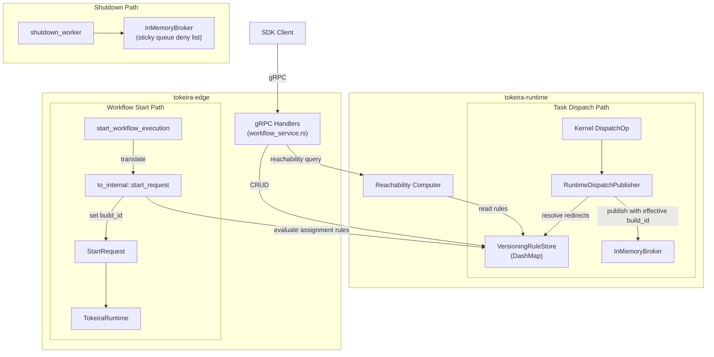

# Design Document: Edge Worker Versioning Transport

## Overview

This design implements the rule management layer for Temporal's Worker Versioning v2 feature. Core versioning types, the rule store, and evaluation functions live in `tokeira-runtime/src/versioning.rs` so that both `tokeira-edge` and `tokeira-runtime` can depend on them without circular crate dependencies. gRPC handlers and proto translation remain in `tokeira-edge`. The work adds assignment rules, redirect rules, reachability computation, and 11 gRPC handlers. It sits on top of the broker routing infrastructure delivered by `runtime-worker-versioning`, which already threads `deployment`/`build_id` through `QueueKey`, `WorkflowState`, and kernel dispatch ops.

The design follows a key architectural principle: **the kernel stays pure**. Rule evaluation is an edge/runtime-layer concern. Assignment rules are evaluated when constructing `StartRequest` (edge layer), and redirect rules are resolved when the `RuntimeDispatchPublisher` publishes tasks (runtime layer). The kernel stores whatever `build_id` it receives and propagates it through dispatch ops — it never consults versioning rules.

The rule store is in-memory for MVP, backed by `DashMap` with conflict tokens for optimistic concurrency. Durable persistence is deferred to the DSQL storage spec.

### Phased Delivery

| Phase | Scope | Handlers |
|-------|-------|----------|
| 1 | Rule storage, evaluation, CRUD | `update_worker_versioning_rules`, `get_worker_versioning_rules` |
| 2 | Reachability computation | `get_worker_task_reachability` |
| 3 | Legacy stubs, shutdown | `update/get_worker_build_id_compatibility`, `shutdown_worker`, deployment stubs |
| 4 | Integration wiring | Assignment into start path, redirects into dispatch |

## Architecture



### Key Design Decisions

1. **In-memory rule store with `DashMap`** — `DashMap<(NamespaceId, TaskQueueName), VersioningRules>` provides lock-free concurrent reads and fine-grained write locking per shard. No global mutex contention on the hot read path (assignment evaluation during workflow start).

2. **Conflict token as monotonic counter** — Each `(namespace, task_queue)` pair gets a `u64` counter encoded as big-endian bytes. Monotonic increment on every mutation. Simpler and cheaper than content hashing; sufficient for optimistic concurrency.

3. **Deterministic percentage ramp via workflow ID hash** — Assignment rules with percentage ramps use `hash(workflow_id) % 10000 < ramp * 100` to decide applicability. The same workflow ID always gets the same assignment, even across retries or signal-with-start.

4. **Redirect chain depth limit of 10** — Prevents runaway traversal. Cycles are detected by tracking visited build IDs in a `HashSet`.

5. **Reachability computed on-demand, rule-only for MVP** — No background scanner. The handler queries current assignment rules and redirect chains to classify build IDs. Open-workflow-based classification (requiring a `RunRepository` query) is deferred to the DSQL storage spec. Builds not referenced by any rule return an empty reachability list (unreachable per proto convention: "If reachability is empty, this worker is considered unreachable").

6. **Shutdown via broker deny list (sticky queue only)** — The `shutdown_worker` handler targets the sticky task queue (from the proto's `sticky_task_queue` field), not a generic task queue. The deny list key is `(NamespaceId, TaskQueueName, WorkerIdentity)` where `TaskQueueName` is the sticky queue name. Only the workflow task poll path checks the deny list — activity polls are not affected.

## Components and Interfaces

### Ownership and Construction

A single `Arc<VersioningRuleStore>` is created at application startup (in `tokeirad/src/main.rs` or wherever the application is assembled) and shared by reference:

- Passed to `WorkflowService::new()` so gRPC handlers can read and mutate rules.
- Passed to `TokeiraRuntime::new()` which threads it through lane construction to `RuntimeDispatchPublisher`, so redirect resolution during task dispatch sees the same rule state that CRUD handlers modify.

This shared-ownership pattern ensures that an operator updating rules via `update_worker_versioning_rules` immediately affects the dispatch redirect path without any synchronization beyond `DashMap`'s internal locking.

### VersioningRuleStore

New file: `crates/tokeira-runtime/src/versioning.rs`

> **NOTE:** The core versioning types (`VersioningRuleStore`, `AssignmentRule`, `RedirectRule`, `VersioningRules`, `VersioningMutation`, `VersioningError`) and evaluation functions (`evaluate_assignment`, `resolve_redirect`) live in `tokeira-runtime` so that both `tokeira-edge` (gRPC handlers, proto translation) and `tokeira-runtime` (`RuntimeDispatchPublisher`) can depend on them without a circular crate dependency. Proto translation stays in `tokeira-edge/src/grpc/translate.rs`.

```rust
// crates/tokeira-runtime/src/versioning.rs
use dashmap::DashMap;
use tokeira_types::{NamespaceId, TaskQueueName};

#[derive(Clone, Debug, PartialEq)]
pub struct AssignmentRule {
    pub target_build_id: String,
    pub percentage_ramp: Option<f32>,  // 0.0–100.0, None = unconditional
    pub create_time: time::OffsetDateTime,
}

#[derive(Clone, Debug, PartialEq)]
pub struct RedirectRule {
    pub source_build_id: String,
    pub target_build_id: String,
    pub create_time: time::OffsetDateTime,
}

#[derive(Clone, Debug)]
pub struct VersioningRules {
    pub assignment_rules: Vec<AssignmentRule>,
    pub redirect_rules: Vec<RedirectRule>,
    pub conflict_token: Vec<u8>,  // big-endian u64
}

pub struct VersioningRuleStore {
    rules: DashMap<(NamespaceId, TaskQueueName), VersioningRules>,
}
```

**Public API:**

| Method | Description |
|--------|-------------|
| `get_rules(&self, ns, tq) -> VersioningRules` | Returns current rules + conflict token (empty defaults if absent) |
| `apply_mutation(&self, ns, tq, token, op, now) -> Result<VersioningRules>` | Validates conflict token, applies operation using `now` for server-authored timestamps, increments token, returns updated rules |
| `evaluate_assignment(&self, ns, tq, workflow_id) -> Option<String>` | Evaluates assignment rules in index order, returns first applicable `target_build_id` |
| `resolve_redirect(&self, ns, tq, build_id) -> Result<String>` | Follows redirect chain to final target, errors on cycle or depth > 10 |
| `all_task_queues_with_rules(&self) -> Vec<(NamespaceId, TaskQueueName)>` | Lists all (ns, tq) pairs that have rules (for reachability across all queues) |

`VersioningRuleStore` is intentionally rule-state-only. It does not consult
`WorkerRegistry`, storage, or poller state. Handler-level preconditions, such as
`CommitBuildId.force == false` requiring a recent poller, are checked before
calling `apply_mutation`.

### Mutation Operations

```rust
pub enum VersioningMutation {
    InsertAssignmentRule { rule: AssignmentRule, index: usize },  // index clamped to end if out of bounds
    ReplaceAssignmentRule { rule: AssignmentRule, index: usize, force: bool },
    DeleteAssignmentRule { index: usize, force: bool },
    AddRedirectRule { rule: RedirectRule },
    ReplaceRedirectRule { source_build_id: String, rule: RedirectRule },
    DeleteRedirectRule { source_build_id: String },
    CommitBuildId { build_id: String },  // append unconditional rule at END, remove prior rules for same target, remove unconditional rules for other targets
}
```

### CommitBuildId Recent-Poller Validation

`CommitBuildId.force` is a transport-level precondition, not a rule-store
mutation concern:

1. `versioning_mutation_from_proto()` parses the proto operation into two pieces:
   - `VersioningMutation::CommitBuildId { build_id }`
   - `force: bool` metadata on the parsed operation wrapper
2. The `update_worker_versioning_rules` handler checks `force` before calling
   `VersioningRuleStore::apply_mutation`.
3. If `force == false`, the handler calls
   `WorkerRegistry::has_recent_poller_for_build_id(namespace_id, task_queue, build_id, now, RECENT_POLLER_WINDOW)`.
4. If no recent poller is found, the handler returns `FAILED_PRECONDITION` and
   does not mutate the rule store.
5. If `force == true`, the handler skips the registry check.

`RECENT_POLLER_WINDOW` is a runtime constant of five minutes for this MVP. It
can become configuration later if needed.

`WorkerRegistry` is extended from an exact-key lookup cache into an
observational poller registry:

```rust
pub struct WorkerVersionMetadata {
    pub deployment: Option<DeploymentId>,
    pub build_id: Option<BuildId>,
    pub last_seen_at: OffsetDateTime,
}

impl WorkerRegistry {
    pub fn register(&self, key: WorkerRegistrationKey, metadata: WorkerVersionMetadata);

    pub fn has_recent_poller_for_build_id(
        &self,
        namespace_id: NamespaceId,
        task_queue: &TaskQueueName,
        build_id: &BuildId,
        now: OffsetDateTime,
        recent_window: time::Duration,
    ) -> bool;
}
```

`register` updates `last_seen_at` on every poll. The recent-poller query scans
registered workers for the same namespace/task queue with matching
`build_id`, `deployment == None`, and `now - last_seen_at <= recent_window`.
Deployment-based pollers do not satisfy build-ID-only `CommitBuildId`
validation.

### Reachability Computer

Lives in `crates/tokeira-runtime/src/versioning.rs` alongside the rule store.

```rust
/// Maps to the proto's `TaskReachability` enum values.
/// An empty list means unreachable per proto convention.
pub enum TaskReachabilityType {
    /// Build ID is targeted by an assignment rule — can receive new workflow tasks.
    NewWorkflows,
    /// Build ID is reachable via redirect chain — existing workflows may be redirected here.
    ExistingWorkflows,
}

pub struct TaskQueueReachability {
    pub task_queue: TaskQueueName,
    pub reachability: Vec<TaskReachabilityType>,
}

pub struct BuildIdReachabilityResult {
    pub build_id: String,
    pub task_queue_reachability: Vec<TaskQueueReachability>,
}
```

The reachability computation (rule-only for MVP):
1. Collects all build IDs referenced by assignment rules → reachability includes `NewWorkflows`.
2. Follows redirect chains — if a redirect's source is reachable for `NewWorkflows` (targeted by an assignment rule), the redirect's effective target also gets `NewWorkflows` (since new workflows are effectively delivered there). Other redirect-reachable targets get `ExistingWorkflows`.
3. For build IDs not referenced by any rule → empty reachability list (unreachable per proto convention: "If reachability is empty, this worker is considered unreachable").

> **NOTE:** Open-workflow-based classification (distinguishing `OpenWorkflows` / `ClosedWorkflows`) requires a `RunRepository` query to count open workflows by `build_id`. This is deferred to the DSQL storage spec. For MVP, builds not referenced by any rule return an empty list (unreachable).

### Broker Deny List (shutdown_worker — sticky queue only)

Extension to `InMemoryBroker` in `crates/tokeira-runtime/src/broker.rs`:

```rust
// Added to BrokerState
pub denied_workers: HashSet<(NamespaceId, TaskQueueName, WorkerIdentity)>,
```

The `poll_workflow_task` method checks the deny list before delivering a task. Activity polls are not affected. The `TaskQueueName` in the deny list key is the sticky queue name from the proto's `sticky_task_queue` field. `shutdown_worker` inserts into the set. The deny list is in-memory and resets on restart (acceptable for MVP).

### Proto Translation

New functions in `crates/tokeira-edge/src/grpc/translate.rs`:

- `versioning_rules_request_to_edge()` — Parses `UpdateWorkerVersioningRulesRequest` into `VersioningMutation`
- `versioning_rules_to_proto()` — Converts `VersioningRules` to proto response
- `reachability_request_to_edge()` — Parses `GetWorkerTaskReachabilityRequest`
- `reachability_to_proto()` — Converts `BuildIdReachabilityResult` to proto response

### Integration Points

**Workflow start path** (`to_internal::start_request` and `to_internal::signal_with_start_request`):
- The `StartWorkflowExecutionRequest` edge DTO carries `versioning_override: Option<VersioningOverrideDto>`, extracted from the proto's `versioning_override` field in `start_request_to_edge()`.

```rust
/// Mirrors the proto VersioningOverride (behavior + optional deployment).
pub enum VersioningOverrideDto {
    /// Pin to a specific deployment + build ID; skip rule evaluation.
    Pinned { deployment_series: String, build_id: String },
    /// Auto-upgrade: evaluate assignment rules normally (use latest version).
    AutoUpgrade,
}
```

- Before constructing `StartRequest`, check if `versioning_override` is `Some(Pinned { deployment_series, build_id })`. If so, set both `deployment` and `build_id` on `StartRequest` and skip rule evaluation.
- If `versioning_override` is `Some(AutoUpgrade)` or `None`, call `VersioningRuleStore::evaluate_assignment(ns, tq, workflow_id)`.
- Set the result on `StartRequest.build_id`.

**Task dispatch path** (`RuntimeDispatchPublisher::publish`):
- In the `EnqueueWorkflowTask` and `EnqueueActivityTask` arms, if `queue.build_id.is_some()` AND `queue.deployment.is_none()`, call `VersioningRuleStore::resolve_redirect(ns, tq, build_id)`.
- Update `queue.build_id` to the effective target before publishing to the broker.
- If `queue.deployment.is_some()`, skip redirect resolution — deployment-pinned workflows are not subject to build-ID redirect rules.

> **NOTE:** Build-ID rule assignments set `build_id` only (`deployment` stays `None`). Workers using `UseBuildIDForVersioning=true` poll with `build_id` set and `deployment=None`. The broker matches on the full `QueueKey`, so both sides agree on `(deployment=None, build_id=Some(B))`. The `Pinned` versioning override sets both `deployment` and `build_id` for the newer deployment-based API. Workers using the deployment API poll with both fields set.

## Data Models

### VersioningRules (per namespace + task queue)

| Field | Type | Description |
|-------|------|-------------|
| `assignment_rules` | `Vec<AssignmentRule>` | Ordered list; index 0 is highest priority |
| `redirect_rules` | `Vec<RedirectRule>` | Unordered; keyed by `source_build_id` |
| `conflict_token` | `Vec<u8>` | Big-endian u64, monotonically increasing |

### AssignmentRule

| Field | Type | Description |
|-------|------|-------------|
| `target_build_id` | `String` | Build ID to assign |
| `percentage_ramp` | `Option<f32>` | `None` = unconditional, `Some(0.0..100.0)` = probabilistic |
| `create_time` | `OffsetDateTime` | When the rule was created |

### RedirectRule

| Field | Type | Description |
|-------|------|-------------|
| `source_build_id` | `String` | Build ID to redirect from |
| `target_build_id` | `String` | Build ID to redirect to |
| `create_time` | `OffsetDateTime` | When this redirect rule version was created |

Redirect rule timestamps are authoritative store state:

- `AddRedirectRule` sets `create_time` to the `now` argument passed to `VersioningRuleStore::apply_mutation`.
- `ReplaceRedirectRule` replaces the rule and sets `create_time` to the `now` argument passed to `VersioningRuleStore::apply_mutation`.
- `DeleteRedirectRule` removes the timestamp with the rule.
- `versioning_rules_to_proto()` emits the stored `create_time` into `TimestampedCompatibleBuildIdRedirectRule`.

### Conflict Token Encoding

```
conflict_token = (counter as u64).to_be_bytes().to_vec()
```

Initial value on first access: `1_u64.to_be_bytes()`. Incremented by 1 on each mutation.

### Broker Deny List Entry

```rust
(NamespaceId, TaskQueueName, WorkerIdentity)
```


## Correctness Properties

*A property is a characteristic or behavior that should hold true across all valid executions of a system — essentially, a formal statement about what the system should do. Properties serve as the bridge between human-readable specifications and machine-verifiable correctness guarantees.*

### Property 1: Assignment rule evaluation determinism

*For any* set of assignment rules and *for any* workflow ID, evaluating the assignment rules twice with the same workflow ID SHALL produce the same `target_build_id` result. Furthermore, the result SHALL be the `target_build_id` of the first rule in index order whose percentage ramp (if any) admits the workflow ID, or `None` if no rule applies.

**Validates: Requirements 2.1, 2.2, 2.3, 2.4, 2.5**

### Property 2: Redirect chain resolution

*For any* set of redirect rules without cycles and *for any* build ID, resolving the build ID SHALL follow the redirect chain to the final target. *For any* set of redirect rules containing a cycle, resolution SHALL return an error. *For any* build ID not present as a `source_build_id` in any redirect rule, resolution SHALL return the original build ID unchanged.

**Validates: Requirements 3.1, 3.2, 3.3, 3.5**

### Property 3: Conflict token monotonicity

*For any* sequence of successful mutations applied to a (namespace, task_queue) pair, the conflict token SHALL strictly increase after each mutation. *For any* mutation request carrying a conflict token that does not match the current stored token, the mutation SHALL be rejected.

**Validates: Requirements 1.3, 1.4, 4.14**

### Property 4: Rule CRUD correctness

*For any* sequence of insert, replace, delete, add-redirect, replace-redirect, delete-redirect, and commit-build-id operations applied to a (namespace, task_queue) pair, the resulting assignment rules and redirect rules SHALL match the expected state computed by applying the operations sequentially to an initially empty rule set. Reading the rules back via `get_rules` SHALL return the same state.

**Validates: Requirements 1.1, 4.1, 4.2, 4.3, 4.5, 4.6, 4.7, 4.8, 4.9, 4.15, 5.1, 5.3**

### Property 5: Reachability classification (rule-only)

*For any* build ID, set of assignment rules, and set of redirect rules, the reachability SHALL include `NewWorkflows` if the build ID is targeted by any assignment rule OR is the effective target of a redirect rule whose source is reachable for `NewWorkflows`; SHALL include `ExistingWorkflows` if the build ID is reachable via redirect chains from a rule-reachable source that is not itself reachable for `NewWorkflows`; and SHALL be an empty list if the build ID is not referenced by any rule.

**Validates: Requirements 6.1, 6.2, 6.3, 6.4**

## Error Handling

### Rule Store Errors

| Error | gRPC Status | Trigger |
|-------|-------------|---------|
| Stale conflict token | `FAILED_PRECONDITION` | Mutation with non-matching conflict token |
| No recent poller for CommitBuildId | `FAILED_PRECONDITION` | Handler receives `CommitBuildId` with `force == false` and `WorkerRegistry` has no recent build-ID-only poller for the target |
| Delete/replace last unconditional rule | `FAILED_PRECONDITION` | `DeleteAssignmentRule` or `ReplaceAssignmentRule` removes last unconditional rule without `force` |
| Out-of-bounds index | `INVALID_ARGUMENT` | Replace/delete at index ≥ rule count (insert clamps to end) |
| Empty target_build_id | `INVALID_ARGUMENT` | Any operation with empty `target_build_id` |
| Duplicate redirect source | `FAILED_PRECONDITION` | `AddRedirectRule` when a redirect with the same `source_build_id` already exists |
| Unknown redirect source | `INVALID_ARGUMENT` | `ReplaceRedirectRule` or `DeleteRedirectRule` when no redirect rule exists for the specified `source_build_id` |
| Redirect cycle detected | `FAILED_PRECONDITION` | `resolve_redirect` encounters a cycle |
| Redirect chain too deep | `FAILED_PRECONDITION` | Chain exceeds 10 hops |

### Handler Errors

| Handler | Error | gRPC Status |
|---------|-------|-------------|
| `update_worker_versioning_rules` | Missing namespace/task_queue | `INVALID_ARGUMENT` |
| `get_worker_versioning_rules` | Missing namespace/task_queue | `INVALID_ARGUMENT` |
| `get_worker_task_reachability` | Empty build_ids list | `INVALID_ARGUMENT` |
| `shutdown_worker` | Missing worker identity | `INVALID_ARGUMENT` |
| Legacy handlers | Always | `UNIMPLEMENTED` |
| Deployment handlers | Always | `UNIMPLEMENTED` |

### Integration Errors

| Path | Error | Behavior |
|------|-------|----------|
| Assignment evaluation during start | Rule store unreachable | Log warning, proceed with `build_id = None` |
| Redirect resolution during dispatch | Cycle detected | Log error, publish with original `build_id` (no silent drop) |
| Redirect resolution during dispatch | Chain too deep | Log error, publish with original `build_id` |

## Testing Strategy

### Property-Based Tests (proptest, minimum 100 iterations each)

| Test | Property | Description |
|------|----------|-------------|
| `property_assignment_evaluation_determinism` | Property 1 | Generate random assignment rules + workflow IDs, verify deterministic evaluation |
| `property_redirect_chain_resolution` | Property 2 | Generate random redirect rule sets (acyclic and cyclic), verify chain following and cycle detection |
| `property_conflict_token_monotonicity` | Property 3 | Generate random mutation sequences, verify token strictly increases and stale tokens rejected |
| `property_rule_crud_correctness` | Property 4 | Generate random CRUD operation sequences, verify resulting state matches sequential application |
| `property_reachability_classification` | Property 5 | Generate random rule sets, verify rule-only classification: `NewWorkflows` for assignment-targeted and redirect targets of `NewWorkflows`-reachable sources, `ExistingWorkflows` for other redirect-reachable, empty for non-referenced |

Each property test is tagged: `// Feature: edge-worker-versioning-transport, Property N: <title>`

### Unit Tests (example-based)

| Test | Requirement | Description |
|------|-------------|-------------|
| `test_empty_rule_set_returns_valid_token` | 1.6, 5.2 | Query non-existent (ns, tq), verify empty rules + valid token |
| `test_out_of_bounds_index_rejected` | 4.16 | Replace/delete at invalid index, verify `INVALID_ARGUMENT`; insert at out-of-bounds index, verify clamped to end |
| `test_empty_target_build_id_rejected` | 4.17 | Submit empty target, verify `INVALID_ARGUMENT` |
| `test_delete_last_unconditional_without_force` | 4.4 | Delete last unconditional rule without force, verify `FAILED_PRECONDITION` |
| `test_replace_last_unconditional_without_force` | 4.2 | Replace last unconditional rule with ramped rule without force, verify `FAILED_PRECONDITION` |
| `test_delete_last_unconditional_with_force` | 4.4 | Delete last unconditional rule with force, verify success |
| `test_redirect_chain_depth_limit` | 3.4 | Create chain of 11 redirects, verify error |
| `test_redirect_none_build_id_skipped` | 3.6 | Resolve with `None` build_id, verify `None` returned |
| `test_duplicate_redirect_source_rejected` | 4.6 | Add redirect rule, add another with same `source_build_id`, verify `FAILED_PRECONDITION` |
| `test_legacy_handlers_return_unimplemented` | 8.1, 8.2 | Call legacy endpoints, verify `UNIMPLEMENTED` with correct messages |
| `test_deployment_handlers_return_unimplemented` | 10.1–10.5 | Call deployment endpoints, verify `UNIMPLEMENTED` with correct messages |
| `test_shutdown_worker_idempotent` | 9.3 | Shutdown non-polling worker, verify success |
| `test_shutdown_worker_prevents_delivery` | 9.1, 9.4, 9.5 | Shutdown worker on sticky queue, verify broker skips workflow task delivery but activity polls unaffected |
| `test_assignment_integration_explicit_override` | 11.4 | Start with `Pinned` versioning override, verify rules skipped and both deployment + build_id set |
| `test_assignment_integration_rule_evaluation` | 11.1, 11.2, 11.3 | Start without build_id, verify rule evaluation sets build_id |
| `test_redirect_integration_dispatch` | 12.1–12.3 | Dispatch with redirect rules, verify effective build_id |
| `test_redirect_integration_none_skipped` | 12.4 | Dispatch with None build_id, verify no redirect |

### Test Library

All property-based tests use `proptest` (already a project dependency). Configuration: `ProptestConfig { cases: 100, .. }` minimum.
