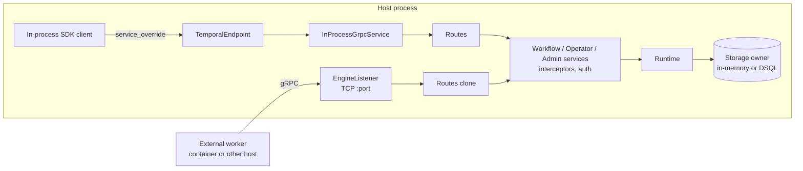

# Design Document: Embedded Engine Listener

## Overview

An embedded [`Engine`](../../../crates/tokeira-engine/src/lib.rs) gains one method,
`Engine::listen(addr)`, that binds a TCP socket and serves the engine's existing Temporal
gRPC services on it. The listener is built from a clone of the tonic `Routes` the
in-process endpoint already dispatches into, so both transports reach one service graph,
one runtime, and one storage owner by construction. The returned `EngineListener` reports
the bound address and owns stop and drain; `Engine::shutdown` stops any listener still
attached before its existing drain sequence.

Requirements: [requirements.md](./requirements.md). Behaviour of the served API is the
v1.31.0 contract already implemented by the edge; this design changes transport only.

## Dependencies and Non-Goals

### Owning relationships

- [managed-embedded-dsql](../managed-embedded-dsql/design.md) owns embedded startup, the
  ownership claim, the shutdown coordinator, and its ordering. This design inserts one
  step, listener stop, at the front of that ordering and changes nothing else.
- `tokeira-edge` owns the in-process service and the generated gRPC services. This design
  adds one accessor that exposes a clone of the assembled routes.
- The daemon path in `build_service_stack_with_storage` keeps its own server build. This
  design does not refactor it; the two servers share the generated services, not the
  server builder.

### Non-goals

- HTTP/JSON, gRPC-Web, and Nexus HTTP transports on the embedded listener.
- TLS, address advertising, Docker or ECS awareness, node-endpoint registration.
- A start-time listener option; attachment is always post-start.
- Changing `TokeiradHandle` or `run_from_cli`.

## Architecture

The embedded stack today ends at `InProcessGrpcService::new(workflow_grpc, operator_grpc,
admin_grpc)`, which assembles `Routes` from the three generated services and keeps it
behind an `Arc<Mutex<Routes>>` ([in_process.rs:93-106](../../../crates/tokeira-edge/src/in_process.rs)).
`Routes` is `Clone`, and tonic's `Server::add_routes` builds a `Router` from an existing
`Routes` (`tonic-0.11.0/src/transport/server/mod.rs:399-404`). A listener is therefore a
second consumer of the same routes value: bind, `Server::builder().add_routes(routes)`,
add reflection, and `serve_with_incoming_shutdown`.



Control plane: `Engine::listen` binds, spawns the server task on the engine-host runtime,
and records the listener in a registry the engine owns. Data plane: every RPC over the
listener runs the same handler future a daemon would run, on the same runtime the
in-process endpoint pins handlers to.

Shutdown: `Engine::shutdown` cancels every listener's child token and awaits its server
task before draining in-process handlers, so the existing coordinator sequence (drain,
task join, shard release, ownership release, storage close) starts only after no network
handler can still be admitted. Long polls end because the runtime's shutdown signal
already releases pollers on the daemon path; the listener relies on the same signal.

## Components and Interfaces

### 1. Routes accessor (`crates/tokeira-edge/src/in_process.rs`)

```rust
impl InProcessGrpcService {
    /// A clone of the assembled Workflow/Operator/Admin routes.
    ///
    /// The clone dispatches into the same service instances, interceptors,
    /// and handler runtime as `call`; it is the seam a listener-backed
    /// server uses to serve this engine without constructing a second
    /// service graph.
    pub fn routes(&self) -> Routes;
}
```

`Routes` is `tonic::transport::server::Routes`. The accessor is the only edge change.
`InProcessGrpcService` keeps its mutex-guarded `Routes` and admission counter unchanged;
listener calls do not pass through `InProcessAdmission` (that counter is the in-process
drain contract, and tonic's graceful shutdown is the network drain contract).

### 2. Listener API (`crates/tokeira-engine/src/lib.rs`)

```rust
impl Engine {
    /// Bind `addr` and serve this engine's Temporal gRPC services on it.
    ///
    /// Port `0` requests an ephemeral port. The listener serves a clone of the
    /// engine's own routes; no service, runtime, or storage object is built.
    pub async fn listen(&self, addr: SocketAddr) -> Result<EngineListener, EngineListenError>;
}

/// One attached listener. Dropping it signals stop without awaiting.
#[derive(Debug)]
pub struct EngineListener { /* bound_addr, slot: ListenerSlot */ }

impl EngineListener {
    pub fn bound_addr(&self) -> SocketAddr;
    /// Stop accepting, drain in-flight calls within the listener deadline,
    /// join the server task, and deregister from the engine.
    pub async fn shutdown(self) -> Result<(), EngineListenerShutdownError>;
}

#[derive(Debug, thiserror::Error)]
pub enum EngineListenError {
    #[error("failed to bind embedded engine listener on {addr}: {source}")]
    Bind { addr: SocketAddr, #[source] source: std::io::Error },
    #[error("embedded Tokeira engine is shutting down")]
    ShutDown,
}

#[derive(Debug, thiserror::Error)]
pub enum EngineListenerShutdownError {
    #[error("timed out draining embedded engine listener on {addr}")]
    DrainTimeout { addr: SocketAddr },
    #[error("embedded engine listener task on {addr} failed: {reason}")]
    Task { addr: SocketAddr, reason: String },
}
```

`listen` order of operations:

1. Refuse with `ShutDown` when `background_cancel.is_cancelled()`.
2. `TcpListener::bind(addr)`; on error return `Bind` and touch nothing else.
3. Resolve `local_addr` (the Bound Address).
4. Create a child token of `background_cancel`; build
   `Server::builder().add_routes(service.routes()).add_service(reflection)`; spawn
   `serve_with_incoming_shutdown(TcpListenerStream::new(listener), child.cancelled())` on
   the engine-host runtime handle the in-process service already captured.
5. Register a `ListenerSlot` in the engine's registry and return the handle.

Reflection uses `tokeira_proto::public::FILE_DESCRIPTOR_SET`, the same descriptor set the
daemon registers. The `WireCoverageLayer` is not mounted: it is a conformance-harness
layer for `tokeirad`.

### 3. Listener registry and shutdown ordering (`crates/tokeira-engine/src/lib.rs`)

```rust
#[derive(Clone)]
struct ListenerSlot {
    bound_addr: SocketAddr,
    stop: CancellationToken,                                     // child of background_cancel
    task: Arc<tokio::sync::Mutex<Option<JoinHandle<Result<()>>>>>, // taken by whoever drains first
}

struct ListenerRegistry { slots: Arc<std::sync::Mutex<Vec<ListenerSlot>>> }
```

- `Engine` gains a `listeners: ListenerRegistry` field.
- `EngineListener::shutdown`: cancel `stop`, take and await the task under the listener
  deadline (30 s), remove the slot, map join/serve errors to `Task` and the timeout to
  `DrainTimeout`.
- `Engine::shutdown`: before `coordinator.begin_shutdown()`, cancel every slot's `stop`,
  then await every slot's task within the engine deadline; a timeout or task error pushes
  `EmbeddedShutdownFailure::ListenerDrain` and shutdown continues. The existing sequence
  then runs unchanged.
- `Drop for Engine`: the existing `background_cancel.cancel()` cancels every child token,
  so listeners stop without awaiting, matching today's drop semantics.
- `Drop for EngineListener`: cancel `stop` only.

Because the child token is derived from `background_cancel`, no listener can outlive the
engine's cancellation even if the host forgets both `shutdown` calls.

### 4. Long-poll release on shutdown

The daemon drains by sending its listener oneshot and awaiting the server task
([lib.rs:2287-2290](../../../crates/tokeira-engine/src/lib.rs)); in-flight long polls end
through the runtime's shutdown signal and the broker's poller fencing. The embedded
listener uses the same mechanism: `Engine::shutdown` cancels listener tokens after
`coordinator.begin_shutdown()` has signalled the runtime, so pollers blocked in the broker
observe the same release the daemon relies on. Implementation verifies this ordering with
a test that holds an open long poll over the listener during `Engine::shutdown` and
asserts completion inside the deadline (Property 5).

### 5. Documentation

- `crates/tokeira-engine/README.md` gains a listen example between the connection and
  snapshot sections.
- `docs/crates/engine.md` "Two shapes" and "Contracts" describe the optional listener.
- `README.md` "Embedded Tokeira" gains one sentence and the example call.
- [managed-embedded-dsql](../managed-embedded-dsql/requirements.md) glossary entry
  "Embedded Engine", Requirement 1.7, and design Property 14 are narrowed to "binds no
  listener at startup; a host may attach one".

## Data Models

| Type | Field | Source |
|---|---|---|
| `EngineListener` | `bound_addr: SocketAddr` | `TcpListener::local_addr` after bind (Req 1.3) |
| `EngineListener` | `slot: ListenerSlot` | registry entry (Req 5.1, 5.9) |
| `ListenerSlot` | `stop: CancellationToken` | child of `Engine::background_cancel` (Req 5.3, 5.6) |
| `ListenerSlot` | `task` | server task join handle (Req 5.4, 5.5) |
| `EmbeddedShutdownFailure` | `ListenerDrain` (new variant) | Req 5.5 |

No durable state is added or changed.

## Correctness Properties

### Property 1: One engine behind two transports

*For any* sequence of Temporal RPCs partitioned arbitrarily between the in-process
endpoint and an attached listener, on any embedded storage mode, the observable outcome
(execution histories, describe results, query answers, update outcomes, task deliveries)
SHALL equal the outcome of issuing the same sequence entirely through the in-process
endpoint.

**Validates: Requirements 2.1, 2.2, 2.3, 2.4, 2.6**

### Property 2: Authorization parity across transports

*For any* configured authorization policy and any RPC with any metadata (valid identity,
missing identity, denied grant), the gRPC status returned over the listener SHALL equal
the status returned by the in-process endpoint for the same request.

**Validates: Requirements 2.5**

### Property 3: Bind failure is a no-op

*For any* running engine and any address that cannot be bound (occupied port, invalid
interface), `Engine::listen` SHALL return `EngineListenError::Bind`, and the engine's
observable state SHALL be byte-identical afterwards: same registry contents, same startup
report, same in-process endpoint behaviour, no spawned task.

**Validates: Requirements 4.1, 4.2, 3.2**

### Property 4: Listener lifecycle state machine

*For any* interleaving of `listen`, `EngineListener::shutdown`, `EngineListener` drop,
`Engine::shutdown`, and `Engine` drop over any number of listeners on distinct addresses,
the observable lifecycle SHALL follow the reference model: each bound address accepts
connections exactly between its successful `listen` and the first of its stop events;
after any stop event the socket is released and no task remains for it; the in-process
endpoint keeps serving until `Engine::shutdown` or drop; `listen` after engine shutdown
returns `ShutDown`.

**Validates: Requirements 1.5, 4.3, 5.1, 5.2, 5.6, 5.7, 5.9**

### Property 5: Engine shutdown drains listeners first and within the deadline

*For any* set of attached listeners with any number of in-flight calls, including open
long polls, `Engine::shutdown` SHALL stop every listener before draining in-process
handlers, SHALL complete within the engine deadline, and SHALL report
`EmbeddedShutdownFailure::ListenerDrain` exactly when a listener failed to drain in time.

**Validates: Requirements 5.3, 5.4, 5.5, 5.8**

### Property 6: Startup stays zero-listener

*For any* embedded configuration and storage mode, `Engine::start`,
`Engine::start_with_config`, and `Engine::start_with_embedded_config` SHALL bind no
socket; only an explicit `listen` call binds one.

**Validates: Requirements 1.7, 6.4**

### Property 7: Listener attachment is storage-inert

*For any* DSQL-backed engine, attaching and detaching listeners SHALL issue no schema
statement, open no additional pool, and leave the ownership claim's incarnation and
expiry evolution identical to a run without listeners.

**Validates: Requirements 3.1, 3.3, 7.2**

## Error Handling

| Condition | Internal error | External status/code |
|---|---|---|
| Bind fails | `EngineListenError::Bind { addr, source }` | n/a (host-facing `Result`) |
| `listen` after shutdown began | `EngineListenError::ShutDown` | n/a |
| Listener drain exceeds 30 s in `EngineListener::shutdown` | `EngineListenerShutdownError::DrainTimeout` | n/a |
| Server task failed or panicked | `EngineListenerShutdownError::Task` | n/a |
| Listener drain exceeds the engine deadline during `Engine::shutdown` | `EmbeddedShutdownFailure::ListenerDrain` inside `EmbeddedEngineShutdownError` | n/a |
| RPC after engine shutdown began, over the listener | connection refused or `UNAVAILABLE` from tonic graceful shutdown | `UNAVAILABLE` |
| RPC after engine shutdown began, in-process | existing `Status::unavailable` | `UNAVAILABLE` |

## Testing Strategy

- **Property tests (required):** Properties 3, 4, and 6 as `proptest` models in
  `crates/tokeira-engine/src/lib.rs` tests (Property 6 extends the existing embedded
  startup effect model at [lib.rs:4565-4742](../../../crates/tokeira-engine/src/lib.rs)).
  Properties 1, 2, 5, and 7 run as generated-sequence integration tests in
  `crates/tokeira-engine/tests/embedded_listener.rs` over the in-memory engine, with at
  least 100 iterations for the pure models and a bounded generated sequence set for the
  integration properties.
- **Unit tests (example-based):** occupied-port bind, ephemeral-port bind, reflection
  service present, `listen` after shutdown, listener drop without shutdown.
- **Integration tests:** `embedded_listener.rs` drives a raw-proto worker loop
  (`WorkflowServiceClient` poll and respond, as the edge tests do) against the listener
  while an in-process client starts, queries, updates, and describes; activity heartbeat
  and cancellation; long-poll cancellation; update-with-start. The live managed-DSQL test
  in `crates/tokeira-engine/tests/live_managed_dsql.rs` gains the listener leg of
  Requirement 7.1 and 7.2.
- **External evidence:** a pinned Rust SDK worker over TCP runs from the existing SDK
  spike crate under `spikes/` and from the Cloud Bollard suite (Requirement 7.3); neither
  is part of the default workspace test run.
- **Placement:** edge accessor unit test in `in_process.rs`; everything else in
  `tokeira-engine`.
