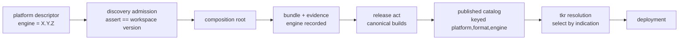

# Design Document: Engine Versioning

## Overview

One version axis, used three ways: the Engine_Version (the workspace package version) is the label
every record surfaces, the declaration a platform definition composes against, and — with this
design — one component of the publication key an installed `tkr` resolves bundles by. The design
covers four layers: the descriptor and its discovery-time assertion, the bound-provisioner
evidence, the published catalog and the release act that fills it, and resolution against the
indication. Wire shapes derive from the Contract Policy tables in `requirements.md`; behaviour of
the existing seams derives from `crates/tokeira-build/src/discovery.rs` and
`crates/tokeira-provisioner/src/{bundle,catalog,binding,version,upgrade}.rs`.

## Dependencies and Non-Goals

### Owning relationships

- `tokeira-build` (discovery + composition) owns descriptor admission and the assembly-time
  assertion; this design refines its refusal texts and adds nothing to its authority.
- `tokeira-provisioner` owns evidence, bundles, the published catalog, and the upgrade boundary;
  the catalog gains the engine key and the admission rule, everything else is consumed unchanged.
- `apps/tkr` owns catalog loading and provisioner resolution; it gains the published-mode
  selection rule.
- The binding gate (`source_tree_hash`), `EngineIdentity`, upgrade monotonicity
  (`version.rs`/`upgrade.rs`), and state-schema migrations are consumed as-is: this design changes
  declaration and publication layers only.

### Non-goals

- Version ranges, semver-compatibility policy, or any resolution beyond exact indication.
- Out-of-tree or third-party platform distribution.
- Per-kind or per-frontend version numbers (frontends version with the engine — they carry no
  version field at all).
- The CI system hosting a release pipeline: the release act is defined by its artifacts, not its
  runner.

## Architecture

Every layer either *keys* on content digests or *labels* with the Engine_Version — never both
roles in one field:

| Layer | Field | Role | Authority for |
|---|---|---|---|
| binding gate | `source_tree_hash` | key | source drift between builds |
| bundle identity | `EngineIdentity` (source + lock closures, toolchain, container, features, profile) | key | executable interchangeability |
| provenance / bundle label | `TOKEIRA_VERSION` → `provisioner_version` | label | human-meaningful ordering (upgrade monotonicity) |
| platform descriptor | `engine` | declaration | which engine surface the definition composes with |
| published catalog | `(platform, format, engine)` | key | which released bundle a resolution selects |
| state store | schema version | key | migration chain |



The workspace path (left of the catalog) is live today: discovery asserts the indication against
the workspace version before any composition root exists, and the admitted indication travels in
the evidence. The publication path (catalog key, release record, resolution selection) is what
this design adds.

## Components and Interfaces

### Descriptor admission (`crates/tokeira-build/src/discovery.rs`)

Current contract: `RawPlatformDescriptor { id, engine, default, default_format? }` decodes with
`deny_unknown_fields`; the indication must be an exact version (any of `^~><=*, ` rejects); the
indication must equal `package.version` (the workspace Engine_Version) or admission refuses with
both versions and the adoption instruction; frontend descriptors carry no version field.

Two refinements:

- **Named counter rejection (R3.1).** A `deny_unknown_fields` failure today rejects a removed
  counter with a generic serde message. Decode instead inspects the raw value first: presence of
  `binding-contract` (platform) or `frontend-contract` (frontend) produces a descriptor violation
  naming the replacement — "`binding-contract` was removed; the platform declares `engine`
  instead" — before generic unknown-field handling.
- **Stable-field refusals (R2.6).** Refusal paths read `id` and `engine` (`format` for frontends)
  from the raw metadata value before typed decode, so any admission failure whose stable fields
  parse names them:

```rust
/// Best-effort read of the Descriptor_Stable_Fields from raw metadata, for
/// refusals that must name the descriptor they reject.
fn stable_fields(value: &serde_json::Value) -> (Option<&str>, Option<&str>);
```

### Evidence and bound admission (`crates/tokeira-provisioner/src/bundle.rs`)

Current contract, consumed unchanged: `BoundProvisionerEvidence { platform, format, engine,
generated_root, source_closure, lock_closure }` records the admitted indication, and bound
admission compares it as an assembly fact exactly as the removed counters were compared.

### Published catalog (`crates/tokeira-provisioner/src/catalog.rs`)

The locator gains the engine key; descriptors are unchanged in shape:

```rust
pub struct PublishedProvisionerLocator {
    pub platform: PlatformId,
    pub format: DefinitionFormatId,
    /// Exact Engine_Version of the release that built this bundle — the third
    /// component of the catalog key.
    pub engine: String,
    pub engine_identity: EngineIdentity,
    pub definition_seed_ref: String,
    pub bundle_ref: String,
}
```

A catalog may hold locators for several engines. `PublishedPlatformDescriptor.engine` remains the
platform's indication in the newest admitted release — the inventory-display fact — while the
locator's `engine` is the resolution key; the two coincide for that release and diverge only for
older retained entries.

Admission enforces the key:

```rust
/// Admit one release's locators into a catalog. At most one locator may exist
/// per (platform, format, engine); a duplicate is a publication error naming
/// the triple, and the catalog is unchanged on refusal.
pub fn admit_release(
    catalog: &mut PublishedProvisionerCatalog,
    release: &EngineReleaseRecord,
) -> Result<(), CatalogAdmissionError>;
```

The existing authority rule is unchanged: a bundle without canonical `BuildAuthority` is
unpublishable, refused by the same admission path that enforces it today.

### The release record (`crates/tokeira-provisioner/src/catalog.rs`)

The in-repo artifact tying the act together. The version-bump commit and the release tag are git
facts; the canonical builds land through the existing bundle machinery per admitted platform ×
format pair; the record carries what publication admits:

```rust
/// One Engine_Release: the locators of its canonical builds and the digest of
/// its Engine_Surface_Delta document.
pub struct EngineReleaseRecord {
    /// The Engine_Version this release publishes — every locator must carry it.
    pub engine: String,
    pub locators: Vec<PublishedProvisionerLocator>,
    /// Digest of the release's surface-delta document.
    pub surface_delta: Sha256Digest,
}
```

The Engine_Surface_Delta itself is a document, `docs/releases/engine-<version>.md`: provider kinds
added, changed, or removed, and definition-frontend surface changes, written at release time and
digested into the record.

### Resolution (`apps/tkr/src/catalog.rs`)

Published-mode selection resolves by the indication:

```rust
/// Select the published locator for a platform and format: the entry whose
/// engine equals the platform's Engine_Indication. A missing triple refuses,
/// naming the triple and the engines published for that (platform, format).
pub fn published_locator(
    &self,
    platform: &PlatformDescriptor,
    format: &DefinitionFormatId,
) -> Result<&PublishedProvisionerLocator, CatalogError>;
```

The workspace path needs no counterpart: the Requirement 2 assertion (indication equals workspace
version, refused before composition otherwise) is the equivalent gate, already live.

### The versioning document (`docs/operations/engine-versioning.md`)

One document carries the whole story: the layer table above, the descriptor contract, and the
release act as a runbook — bump commit (the only change-site of the Engine_Version), tag,
canonical builds of the admitted matrix, `admit_release`, surface delta. The descriptor and
catalog rustdoc reference it by path.

## Data Models

| Type / field | Contract source |
|---|---|
| `RawPlatformDescriptor.engine` | Contract Policy, platform descriptor table |
| `PlatformPackageDescriptor.default_format` | seed selection (tkdp-frontend R9.7); orthogonal to versioning, listed for completeness of the descriptor |
| `BoundProvisionerEvidence.engine` | Contract Policy, evidence table |
| `PublishedProvisionerLocator.engine` | Contract Policy, catalog-entry key |
| `EngineReleaseRecord` | Requirement 4.1 artifacts (3)–(5) |
| `docs/releases/engine-<V>.md` | Requirement 4.5, Engine_Surface_Delta |

## Correctness Properties

*A property is a statement that holds across all valid executions — the bridge between a
human-readable spec and a machine-checkable guarantee.*

### Property 1: Descriptor admission is total over the indication

*For any* platform-descriptor metadata value: a removed counter field refuses naming the
replacement; range or constraint syntax in `engine` refuses as a descriptor violation; an
indication differing from the workspace version refuses naming both versions and the adoption
instruction; and a well-formed descriptor with a matching indication admits with its stable
fields intact.

**Validates: Requirements 2.1, 2.2, 2.3, 2.4, 3.1, 3.2**

### Property 2: Refusals name the stable fields

*For any* refused descriptor whose `id` and `engine` (or `format`) parse from the raw metadata,
the refusal message contains them.

**Validates: Requirements 2.6**

### Property 3: Evidence round-trips with the indication

*For any* `BoundProvisionerEvidence`, serialization round-trips losslessly including `engine`,
and bound admission accepts exactly when the assembly facts — platform, format, engine, digests —
match the bundle's record.

**Validates: Requirements 1.3, 3.3**

### Property 4: The catalog key is unique

*For any* sequence of release admissions, the catalog holds at most one locator per
`(platform, format, engine)`; an admission introducing a duplicate refuses naming the triple and
leaves the catalog unchanged; and every admitted locator's `engine` equals its release's.

**Validates: Requirements 4.3, 4.4**

### Property 5: Resolution selects exactly the indication

*For any* admitted catalog and any platform/format pair: when a locator exists whose engine
equals the platform's indication, resolution returns exactly it; otherwise resolution refuses
naming the requested triple and the engines published for that pair.

**Validates: Requirements 5.1, 5.2**

## Error Handling

| Condition | Internal | Operator-facing |
|---|---|---|
| removed counter present | `DiscoveryError::InvalidDescriptor` | violation naming the field and its replacement (`engine`) |
| range/constraint indication | `DiscoveryError::InvalidDescriptor` | "must be an exact version, not a range or constraint" |
| indication ≠ workspace version | `DiscoveryError::InvalidDescriptor` | both versions + "Adopt the X surface (see its engine surface delta), then update `engine`" |
| refused descriptor, stable fields parse | same as cause | message additionally names `id` and `engine` |
| duplicate `(platform, format, engine)` | `CatalogAdmissionError::Duplicate` | publication error naming the triple; catalog unchanged |
| no locator for indicated triple | `CatalogError` | refusal naming the triple and the engines published for the pair |
| non-canonical authority at publication | existing admission error | unchanged: bundle unpublishable |

## Testing Strategy

- **Property tests (required, `proptest`, ≥100 iterations each):** Properties 1–2 beside
  discovery in `crates/tokeira-build` (metadata values generated as raw JSON); Properties 3–5 in
  `crates/tokeira-provisioner` (generated evidence, release sequences, and catalogs). Tag each
  `// Feature: engine-versioning, Property N`.
- **Unit tests (example-based):** exact refusal texts (counter naming, adoption instruction,
  triple refusal) beside their modules; `stable_fields` extraction edges.
- **Integration tests:** `apps/tkr` workspace-catalog test extends to assert the assertion gate;
  a published-catalog fixture with two engines proves selection and the missing-triple refusal.
- **Placement:** no Docker, no live credentials; all under `cargo test --workspace`.
