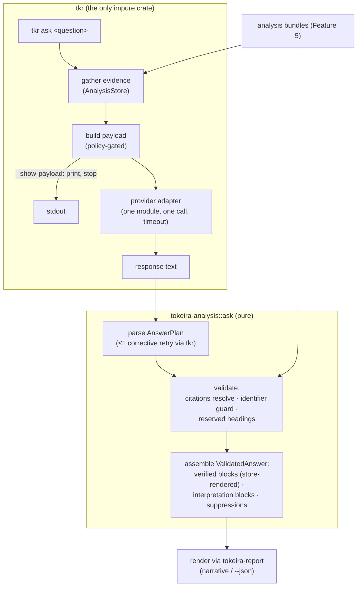

# Design Document: Explanation Agent Clients

## Overview

The design splits Feature 6 along its trust boundary. **Validation and presentation are
pure library code** in `tokeira-analysis::ask` — parsing an answer plan, resolving
citations against the store, running the identifier guard, assembling verified and
interpretation blocks — all testable without any model, network, or key. **The single
impure act** — one HTTP call to the operator's configured provider — lives in `tkr`
behind a one-module adapter seam. The provisioning path never links any of it.

The information flow is a loop with a narrow waist:

```text
question ─→ evidence (Feature 5 store) ─→ payload ─→ provider
                                                        │
rendered answer ←─ validate + assemble ←─ answer plan ──┘
```

The provider sees evidence and returns *selections and prose*. Tokeira renders the
selections itself, from its own store, with its own templates. The prose is quarantined
under a label. That asymmetry is the whole design.

Sources: Feature 5's store and byte-faithfulness properties, Feature 1's evidence
identity, the output contract and lexicon, and umbrella decisions D2 and D5.

## Dependencies and Non-Goals

**Depends on:** Feature 5 (the store is both the evidence source and the citation
oracle). Features 2–4 enrich what evidence exists; none gate this.

**Non-goals:** everything the requirements exclude — gateway, routing, conversation
state, streaming, MCP client, local model management. Also excluded by design: prompt
engineering as a correctness mechanism. The contract is enforced by validation after the
response, never by trusting instructions before it.

## Architecture



## Components and Interfaces

### C1. `tokeira-analysis::ask` — contract, validation, assembly

```rust
/// What the provider is asked to return. Deliberately small: selection and
/// prose, nothing else — the model has no field in which to assert a fact.
#[derive(Debug, Clone, Serialize, Deserialize)]
pub struct AnswerPlan {
    pub sections: Vec<PlanSection>,
}

#[derive(Debug, Clone, Serialize, Deserialize)]
pub struct PlanSection {
    pub title: String,
    pub citations: Vec<String>,        // EvidenceId strings
    pub commentary: Option<String>,
}

/// The validated, renderable result. Verified content is store-rendered;
/// commentary is quarantined; suppressions are first-class output.
#[derive(Debug, Clone, Serialize, Deserialize)]
pub struct ValidatedAnswer {
    pub sections: Vec<AnswerSection>,
    pub suppressions: Vec<Suppression>,
}

#[derive(Debug, Clone, Serialize, Deserialize)]
pub struct AnswerSection {
    pub title: String,
    pub verified: Vec<VerifiedFact>,   // evidence id + deterministic rendering
    pub interpretation: Option<String>,
}

#[derive(Debug, Clone, Serialize, Deserialize)]
pub struct Suppression {
    pub section_title: String,
    pub reason: SuppressionReason,
}

#[derive(Debug, Clone, Serialize, Deserialize)]
pub enum SuppressionReason {
    UnresolvableCitation { id: String },
    UncoveredIdentifier { token: String },
    ReservedHeading { heading: String },
}

pub fn validate_answer(store: &AnalysisStore, plan: &AnswerPlan) -> ValidatedAnswer;
```

Validation order per section: citations resolve (else suppress,
`UnresolvableCitation`) → reserved-heading check on the title (impacts / destructive /
uncertainties and their lexicon synonyms → suppress, `ReservedHeading`) → identifier
guard over commentary (else suppress, `UncoveredIdentifier`) → assemble. Suppression is
section-granular: one bad citation removes the section, not the answer — partial honesty
beats plausible completeness.

**The identifier guard** extracts identifier-shaped tokens from commentary — resource-id
forms (`module::id`, `compose/…`), evidence-id forms (`change:…`, `uncertainty:…`),
bare revision references (`revision N`) — and requires each to appear within the
section's *resolved* citations' facts. It is lexical coverage, stated as such in the
docs; its unit is the section, its output is suppression plus the uncovered token.

**Verified rendering** delegates to the same deterministic fact templates the reports
use: a cited change renders as its plan line + evidence lines; a cited uncertainty as
its reason/consequence line; a cited impact as its impact line. The provider's text
never enters this path (Requirement 2.2 is enforced by there being no parameter to pass
it through).

### C2. Payload construction — policy as code

```rust
pub struct PayloadPolicy {
    /// Definition content requires the per-invocation consent flag.
    pub include_definition: bool,
}

pub struct AskPayload {
    pub question: String,
    pub evidence: Vec<EvidenceEntry>,   // ids + values from the explanation only
    pub contract: &'static str,         // the answer-plan instructions
    // definition excerpts appear here only under include_definition
}

pub fn build_payload(store: &AnalysisStore, question: &str, policy: &PayloadPolicy)
    -> AskPayload;
```

`AskPayload` is the *inspectable unit*: `--show-payload` serializes exactly this value
and exits without a provider call (Requirement 5.4). The credential is not a field of
the payload type — it is applied by the adapter at transmission, which is what makes
"the key can never be printed by the inspection flag" a property of the type rather
than a discipline.

### C3. The adapter seam in `tkr`

```rust
/// One provider, one call, one timeout. The concrete adapter is confined to
/// this module; nothing else in tkr may know which provider is configured.
pub(crate) trait AskProvider {
    fn complete(&self, payload: &AskPayload) -> Result<String, AskError>;
}

pub(crate) struct ProviderConfig {   // from TOKEIRA_ASK_ENDPOINT / _MODEL / _KEY
    endpoint: Url,
    model: String,
    credential: Secret,              // Debug/Display-redacting wrapper
}
```

Configuration is environment-only (Requirement 6.1); a missing variable means
unconfigured, and `tkr ask` refuses in contract voice with the deterministic pointers.
The first concrete adapter targets one OpenAI-compatible-or-equivalent HTTP JSON
endpoint; **which** is the implementation-time dependency decision the requirements
flag, isolated here. The corrective-retry loop (Requirement 1.5) also lives here: parse
failure → one retry whose payload appends the parse/validation errors → then typed
failure pointing at the deterministic surface.

`Secret` is a newtype whose `Debug`, `Display`, and `Serialize` render `«redacted»` —
Requirement 6.4 by construction.

### C4. Rendering

Through `tokeira-report` like every other report. Narrative at summary depth: verified
blocks, labeled interpretation blocks, the suppression count line. `--detail` adds
per-fact evidence ids and per-suppression reasons. `--json` is the `ValidatedAnswer`
verbatim — which, per the collapse rule, is identical at any depth. The two labels are
lexicon constants: `verified`, `interpretation (agent)`.

### C5. External-agent documentation

`docs/platforms/analysis-agents.md`: registering `tkr analysis serve` as an MCP server
in Claude Code, Codex, and Kiro; what the protocol exposes (read-only,
evidence-addressed); the statement that external prose renders under external rules;
and the Feature 5 tool-description review checklist (each description names its
evidence shape and id form, so agents cite correctly by construction).

## Data Models

All new types above live in `tokeira-analysis::ask` except the adapter's
(`ProviderConfig`, `Secret`), which live in `tkr`. No changes to the explanation model,
the bundle, or the protocol: ask is a consumer.

## Correctness Properties

**Property 1 — Validation is exhaustive and section-granular.**
*For any* answer plan and store, every section appears exactly once in the validated
answer's sections or its suppressions; a section with any unresolvable citation is
suppressed with that id; no suppression occurs without its stated reason holding.
**Validates: Requirements 1.2, 1.4, 1.6**

**Property 2 — Verified content is store-rendered and provider-independent.**
*For any* two answer plans citing the same evidence — whatever their commentary — the
verified blocks are byte-identical, and equal to the deterministic template rendering of
that evidence from the store.
**Validates: Requirements 2.1, 2.2, 2.3**

**Property 3 — Separation is total.**
*For any* validated answer's narrative rendering, every line belongs to exactly one of:
a verified block, a labeled interpretation block, or the suppression report; and no
interpretation content precedes its section's verified block.
**Validates: Requirements 2.4, 2.5**

**Property 4 — The identifier guard covers or suppresses.**
*For any* commentary containing an identifier-shaped token, either the token is covered
by the section's resolved citations or the section is suppressed with that token
reported; constructed near-miss tokens (valid shapes citing absent ids) always suppress.
**Validates: Requirements 3.1**

**Property 5 — Reserved headings are impenetrable.**
*For any* answer plan, no section whose title matches a reserved heading (or its lexicon
synonyms) survives validation.
**Validates: Requirements 3.2, 3.3**

**Property 6 — The payload respects the policy.**
*For any* store and question, the serialized payload without consent contains no
definition bytes (asserted by content, not by field names: no substring of the retained
definition beyond values already present in the explanation artifact); with consent, the
inclusion is stated in the output; and no serialization of any payload or answer
contains the credential.
**Validates: Requirements 5.1, 5.2, 5.3, 6.4**

**Property 7 — Absence is invisible elsewhere.**
*For any* fixture deployment, the outputs of plan, apply, analysis query, and analysis
serve are byte-identical with and without provider configuration present in the
environment.
**Validates: Requirements 7.2, 7.4**

**Property 8 — Validation is deterministic and pure.**
*For any* (store, answer plan) pair, two validations yield identical results, and
validation performs no I/O beyond store reads.
**Validates: Requirements 1.2, 7.4**

## Error Handling

| Condition | Treatment |
|---|---|
| No provider configured | Contract-voice refusal naming what `ask` requires and the deterministic surface; exit non-zero; no payload built |
| No bundles for the deployment | Refusal naming the producing verbs, before any provider call |
| Provider unreachable / timeout / non-2xx | Typed `AskError` naming the endpoint; deterministic surface unaffected |
| Response unparseable as an answer plan | One corrective retry with errors appended; then typed failure with deterministic pointers — never rendered as prose |
| Every section suppressed | The answer renders as its suppression report plus a pointer to `tkr analysis query` — an honest empty answer |
| Credential present but empty | Treated as unconfigured (the refusal), not as a request with an empty key |

## Testing Strategy

**Property tests in `tokeira-analysis::ask`** (Properties 1–5, 8): generated answer
plans over generated stores — valid citations, invalid citations, near-miss identifier
tokens, reserved-heading titles and synonyms, commentary with and without identifiers —
validated and rendered; Property 2 constructs plan pairs sharing citations with
adversarially different commentary.

**Property 6 in `tkr`**: payload built against a fixture store whose definition contains
a sentinel string absent from the explanation; assert absence without consent, presence
with consent plus the output statement; serialize everything and assert credential
absence (the `Secret` newtype's redaction).

**Property 7 as an integration test**: the fixture deployment's command outputs diffed
with and without `TOKEIRA_ASK_*` set.

**Example-based tests**: the target-state transcript as a golden fixture (verified /
interpretation / suppression-count shape); the all-suppressed answer; the corrective
retry path with a mock provider returning malformed-then-valid; the no-provider refusal
wording against the lexicon.

**No test calls a real provider.** The adapter trait's test double is the only provider
the suite knows; the one concrete adapter is exercised against a local mock server for
request-shape and timeout behaviour only.
