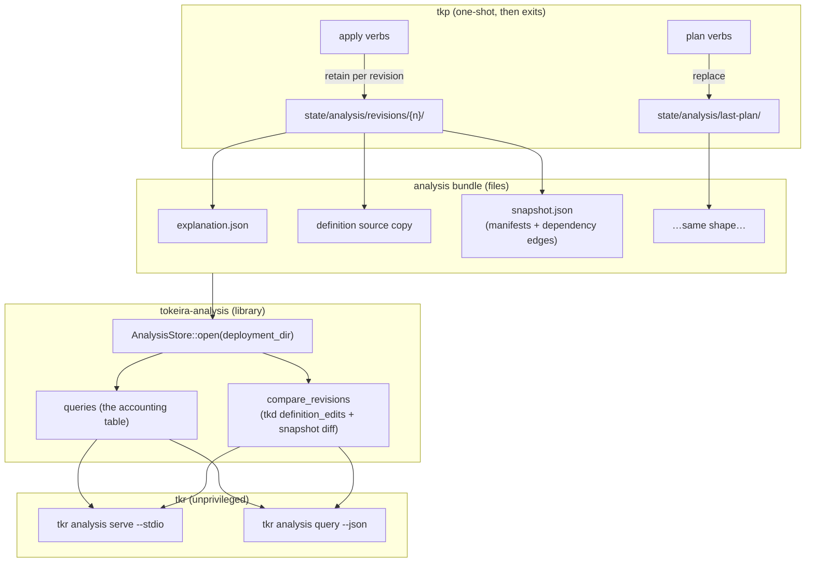

# Design Document: Explanation Analysis Protocol

## Overview

The protocol is **a file reader with a vocabulary**. Producing verbs retain analysis
bundles; a new `tokeira-analysis` library opens a deployment's bundle root and answers
the nine queries plus comparison; `tkr` exposes that library over two transports (MCP
stdio, one-shot CLI). The privileged binary's role ends when the bundle is written.

Design sources: the retention module this widens
(`crates/tokeira-provisioner-cli/src/config_history.rs`), the artifact and model
(Feature 1), snapshots and edges (Feature 3), the syntactic diff (Feature 4), and the
umbrella's D1.

## Dependencies and Non-Goals

**Depends on:** Features 1, 3, 4 shipped (artifact, snapshots, diff). Feature 2 enriches
what bundles carry but gates nothing here.

**Non-goals:** narration (Feature 6); remote transports; live-state queries;
cross-deployment aggregation; any mutating capability.

## Architecture



Two boundaries carry the trust story: **produce/read** (tkp writes bundles and exits;
nothing on the read side can reach back), and **library/transport** (both transports call
the same typed functions, so parity is structural).

## Components and Interfaces

### C1. Bundle layout and retention

```text
{deployment}/state/analysis/
├── last-plan/
│   ├── explanation.json      # Feature 1 artifact, verbatim
│   ├── definition            # the source planned against (platform basename)
│   └── snapshot.json         # BundleSnapshot
└── revisions/{n}/            # written by applying verbs beside config-revisions/{n}
    └── …same three files…
```

```rust
/// The desired world as realized at produce time, with the edges queries need.
#[derive(Debug, Clone, Serialize, Deserialize)]
pub struct BundleSnapshot {
    pub schema_version: u32,                       // shared with the artifact
    pub resources: BTreeMap<String, serde_json::Value>, // canonical manifests
    pub edges: BTreeMap<String, Vec<String>>,      // resource → its dependencies
}
```

Retention lives beside `config_history` in the shell and follows its conventions:
idempotent overwrite per revision, tolerant of a config-less deployment (retain what
exists, record absence), definition stored under the platform's basename so
cross-platform comparison refuses the same way revert does. Retention failure fails the
verb (Requirement 1.7) through the same error shape as the artifact write.

The edges come from the realized resources' `dependencies()` at produce time — the same
call the engine plans with, so the retained graph is the planned graph, not a
reconstruction.

### C2. `crates/tokeira-analysis` — the library

Dependencies: `tokeira-explain` (model), `tokeira-tkd` (comparison diff), `serde`,
`serde_json`, `thiserror`. Deliberately absent: every platform crate, `tokeira-iac`
beyond what `tokeira-explain` re-exports, any provider SDK, any process or network
facility.

```rust
pub struct AnalysisStore { /* bundle root, deployment identity, loaded bundles */ }

impl AnalysisStore {
    /// Open a deployment's bundle root. Enumerates what is retained; loads
    /// lazily; refuses newer-schema bundles with both versions named.
    pub fn open(deployment_dir: &Path) -> Result<Self, AnalysisError>;

    pub fn deployment_summary(&self) -> Result<DeploymentSummary, AnalysisError>;
    pub fn change_summary(&self) -> Result<Vec<ChangeSummaryRow>, AnalysisError>;
    pub fn change(&self, id: &str) -> Result<ExplainedChange, AnalysisError>;
    pub fn resource(&self, id: &str) -> Result<ResourceView, AnalysisError>;
    pub fn service(&self, name: &str) -> Result<ResourceView, AnalysisError>;
    pub fn dependency_path(&self, from: &str, to: &str) -> Result<DependencyPaths, AnalysisError>;
    pub fn source_excerpt(&self, loc: &SourceRef) -> Result<Excerpt, AnalysisError>;
    pub fn uncertainties(&self) -> Result<Vec<Uncertainty>, AnalysisError>;
    pub fn compare_revisions(&self, n: u64, m: u64) -> Result<RevisionComparison, AnalysisError>;
}
```

Every not-found is a typed `AnalysisError` variant carrying what the accounting table
promises (the valid id shape, the retained revision list, the echoed endpoints). Answers
are the bundle's values verbatim (Requirement 2.7): `change` returns the deserialized
`ExplainedChange` unmodified; only `compare_revisions` composes and only
`source_excerpt` slices.

Path confinement (Requirement 6.2) is centralized in one function every file access goes
through: resolve, canonicalize, verify ancestry under the bundle root; a `SourceRef`
escaping it returns `OutOfBundle`.

### C3. Comparison

```rust
pub struct RevisionComparison {
    pub from: u64,
    pub to: u64,
    pub definition_edits: Vec<DefinitionEdit>,      // Feature 4, spans + constructs
    pub resources: Vec<ResourceDelta>,              // introduced | removed | modified
    pub summary: ComparisonCounts,
}
```

`definition_edits` runs `tokeira-tkd::attribution::definition_edits` over the two
bundles' definition copies — parsing at query time is not realization and stays within
Requirement 2.3's prohibitions (no providers, no state, no processes; `tokeira-tkd` is a
pure-syntax dependency). Resource deltas diff the two `BundleSnapshot`s' canonical
manifests with the field-level treatment Feature 1's evidence uses. Symmetry
(Requirement 3.6) holds by construction: the diff is computed once in (from → to)
orientation and reversing swaps before/after.

### C4. `tkr analysis` — the transports

```rust
// cli.rs
Analysis {
    #[command(subcommand)]
    action: AnalysisAction,
},

enum AnalysisAction {
    /// Serve the deployment's analysis bundles as read-only MCP tools on stdio.
    Serve,
    /// Run one query and exit.
    Query { name: String, inputs: Vec<String> },
}
```

Both actions open the `AnalysisStore` for the selected deployment (the global
`--deployment` flag; the registry resolves the directory) and never touch the deployment
lock — analysis holds nothing a provisioning verb waits on (Requirement 4.5). Bundle
replacement mid-serve is handled by re-statting the bundle on each query and reloading on
change (Requirement 4.6): correctness over caching, at file sizes where it is free.

The MCP layer is a thin adapter: one tool per library method, names snake_cased from the
accounting table, descriptions from the lexicon, every tool marked read-only. **The MCP
implementation dependency is an implementation-time decision** with its own approval
(house dependency rules): the candidates are the official Rust MCP SDK versus a minimal
JSON-RPC-over-stdio loop; the design isolates the choice inside one `transport::mcp`
module either way, and nothing else in the crate may know which was chosen.

The one-shot transport renders `--json` as the typed answer verbatim, and narrative
through `tokeira-report` (summary states the answer; `--detail` adds the evidence fields;
the collapse rule holds).

## Data Models

`BundleSnapshot`, `RevisionComparison`, `ResourceDelta`, `DependencyPaths`, `Excerpt`,
and the typed `AnalysisError` — all serializable, all defined in `tokeira-analysis`. No
changes to the explanation model: this feature reads it.

## Correctness Properties

**Property 1 — The surface is closed.**
*For any* transport, the reachable operation set is exactly the accounting table: every
MCP tool and every one-shot query name maps to a table row, and no library entry point
mutates anything (enforced by the store holding no write capability and the crate
exposing no mutating function).
**Validates: Requirements 2.1, 4.2, 5.1, 6.1**

**Property 2 — Analysis reads only the bundle.**
*For any* query execution, every file opened is under the bundle root or the retained
config revisions, and no process, socket, provider call, or engine-state access occurs —
asserted by running the store against an instrumented filesystem sandbox.
**Validates: Requirements 2.2, 2.3, 6.2, 6.3, 6.5**

**Property 3 — Not-found is typed, everywhere.**
*For any* query and *any* unknown identifier, the result is the accounting table's typed
not-found carrying its promised payload, never an empty success and never a panic.
**Validates: Requirements 2.4, 3.4, 5.4**

**Property 4 — Answers are byte-faithful.**
*For any* bundle and *any* fact-returning query, the answer's serialization equals the
corresponding subtree of the bundle's serialization.
**Validates: Requirements 2.7**

**Property 5 — Transport parity.**
*For any* query over *any* bundle, the MCP tool result and the one-shot `--json` result
are identical values.
**Validates: Requirements 5.3**

**Property 6 — Comparison is grounded and symmetric.**
*For any* two retained bundles, every reported resource delta corresponds to an actual
difference between their snapshots (and every difference is reported); definition edits
equal `definition_edits` over the retained texts; and (N, M) versus (M, N) are equal
under before/after reversal.
**Validates: Requirements 3.1, 3.2, 3.3, 3.6**

**Property 7 — Dependency paths are exactly the retained graph's.**
*For any* bundle and *any* endpoint pair, returned paths exist edge-by-edge in the
retained graph, and absence of a returned path implies no path exists in the graph.
**Validates: the accounting table's `get_dependency_path` row**

**Property 8 — Excerpts are confined and faithful.**
*For any* source reference, a returned excerpt matches the retained definition's bytes at
the stated lines, and *any* reference resolving outside the bundle root returns
`OutOfBundle` — including traversal constructions.
**Validates: Requirements 6.2; accounting table `get_source_excerpt`**

**Property 9 — Schema gating is honest in both directions.**
*For any* bundle stamped with a newer schema version, every query refuses with both
versions named; *for any* readable older version, absent fields report as absent, never
as defaulted values.
**Validates: Requirements 2.5, 2.6**

**Property 10 — Retention round-trips.**
*For any* produced bundle, `AnalysisStore::open` loads it, its explanation satisfies
Feature 1's closure property, its snapshot resources parse as canonical manifests, and
its edges name only snapshot residents.
**Validates: Requirements 1.1, 1.3, 1.4**

## Error Handling

| Condition | Treatment |
|---|---|
| No bundles retained | Store opens; every query answers the typed "nothing produced yet", naming the producing verbs (Requirement 4.4) |
| Bundle schema newer | Typed refusal, both versions, remedy named (Property 9) |
| Revision not retained / cross-platform pair | Typed refusal with the retained list / the platform mismatch (Requirements 3.4, 3.5) |
| Source reference outside bundle | `OutOfBundle`, echoing the offending path shape (Property 8) |
| Bundle corrupt (unparseable JSON) | Typed `BundleCorrupt` naming the file; other bundles remain queryable |
| Bundle replaced mid-serve | Reload on next query (Requirement 4.6) |
| Retention write fails at produce time | The producing verb fails, Feature 1's artifact-write shape (Requirement 1.7) |

## Testing Strategy

**Property tests in `tokeira-analysis`** (Properties 1, 3–9): generated bundles (via
Feature 1's model generators plus generated snapshots/edges) exercised through the
library; Property 5 drives both transports in-process over the same store; Property 8
includes constructed traversal attacks (`../`, absolute paths, symlinked escapes).

**Property 2 uses the sandbox pattern**: the store runs under an instrumented I/O layer
recording every open; the assertion is set-inclusion under the bundle root. Process and
network absence is asserted by the crate's dependency graph (no such capability linked)
plus the sandbox.

**Property 10 lives with the shell**: produce a bundle through the real plan/apply paths
against the reference definition, then open and verify with the library — the
produce/read seam end to end.

**Example-based tests**: the no-bundles deployment; the corrupt-bundle file; the
newer-schema bundle; comparison of the session's own scenario (revision with grafana vs
revision without → one removed resource, the stanza edit located).

**Integration**: `tkr analysis query get-deployment-summary --json` and a scripted MCP
session over stdio against a live-shaped fixture deployment, asserting transport parity
on real pipes.
