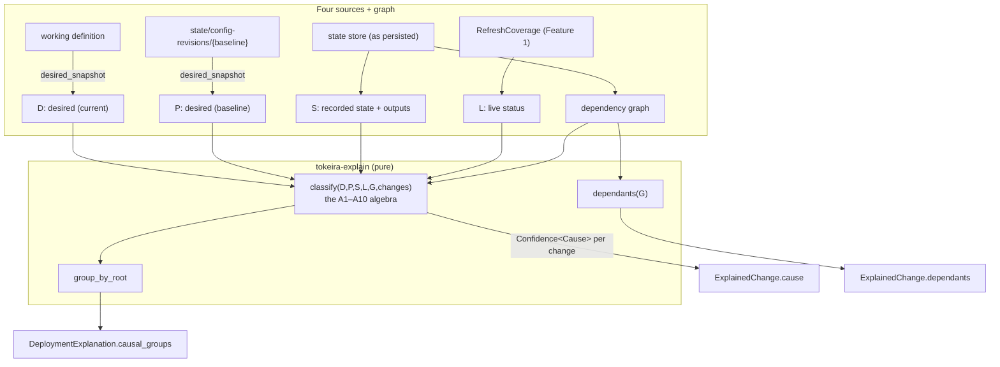

# Design Document: Explanation Causality

## Overview

Causality is implemented as a **pure classifier over four snapshots and a graph**. The
platform contributes one new read-only operation (realize a named definition source into
canonical manifests); the shell gathers the four sources; `tokeira-explain` classifies,
groups, and attributes. Nothing here touches a provider, and nothing here can alter what
the engine decided to change — causality annotates the plan, it never edits it.

Sources for the design: the retained-revision store
(`crates/tokeira-provisioner-cli/src/config_history.rs`), the in-memory interpretation
path (`platforms/compose/src/provisioner.rs`, `adapter.rs`), the state document
(`crates/tokeira-iac/src/document.rs`), refresh and dependency ordering
(`crates/tokeira-iac/src/engine.rs`), and the Feature 1 model.

## Dependencies and Non-Goals

**Depends on:** Feature 1 (model, uncertainty, `RefreshCoverage`); Feature 2's amendment
only for the shared `Confidence<T>` location (`tokeira-iac`). Causality itself requires
no declared semantics: the algebra runs with every semantics field `Unknown`.

**Amends Feature 1**, as recorded in this spec's requirements: the cause slot becomes
`Confidence<Cause>` and `Cause::Undetermined` is removed.

**Non-goals:** span-level attribution (Feature 4 populates
`DefinitionEdit.source`; this feature leaves it `None` and phrases attribution at
revision level); semantics composition rules beyond rendering adjacency (Feature 2);
historical multi-revision archaeology (Feature 5's comparison builds on the snapshot seam
introduced here).

## Architecture



The critical wiring subtlety, promoted from the requirements' notes to an architectural
rule: **S is loaded from the state store before the verb's refresh runs** (or from a
pre-refresh clone), never from the post-refresh planning context — refresh overwrites
in-context properties with live observations, and a contaminated S turns A7 into
live-vs-live, silently reclassifying all drift as clean.

## Components and Interfaces

### C1. Platform seam — the desired snapshot

```rust
/// Canonical per-resource desired manifests realized from one definition
/// source, in memory. The snapshot is a value: comparable, serializable,
/// provider-untouched.
pub type DesiredSnapshot = BTreeMap<ResourceId, serde_json::Value>;

pub trait ProvisionerPlatform {
    // …existing methods…

    /// Realize `definition` (a path to a definition source — the working
    /// definition or a retained revision) into canonical desired manifests.
    /// MUST NOT contact providers, read live state, or write state. A source
    /// that does not interpret returns the located verdict; a platform with
    /// no interpreted definition answers NotApplicable.
    async fn desired_snapshot(
        &self,
        deployment_dir: &Path,
        definition: &Path,
    ) -> Result<Realization<DesiredSnapshot>>;
}
```

The compose platform implements it as `load_tkd_config_from(deployment_dir, definition)` →
`TkdDeployment::realize` → `realize_module` per module → `to_manifest()` per resource →
**canonicalized** — the same interpretation path as `definition check` and the same
canonical form as the diff boundary, satisfying Requirement 1.6 (one code path) and 1.4
(canonical equality). The canonicalization helper moves from a private `tokeira-compose`
function to a shared location so the platform and the diff use literally one function,
not two agreeing ones.

### C2. Shell — gathering the sources

`explain::gather_causality_inputs` in `tokeira-provisioner-cli`:

```rust
pub(crate) struct CausalityInputs {
    /// D — working definition, realized. None: definition does not interpret
    /// (verb already failed) or platform NotApplicable.
    pub desired: Option<DesiredSnapshot>,
    /// P — baseline revision, realized. Err-shaped absence is typed:
    pub baseline: BaselineSnapshot,
    /// S — recorded state read from the store BEFORE refresh (Req 2.3).
    pub recorded: InfraState,
    /// L — Feature 1's refresh coverage, joined by resource id.
    pub refresh: RefreshCoverage,
}

pub(crate) enum BaselineSnapshot {
    Realized(DesiredSnapshot),
    NeverApplied,                      // config_revision == 0 → A10 creates rule
    Missing { revision: u64 },         // retained file absent → A10 unknown rule
    DoesNotInterpret { verdict: String }, // retained but broken → A10 unknown rule
}
```

The baseline path is `config_history`'s snapshot location for
`envelope.config_revision`; `Missing` and `DoesNotInterpret` become the A10 uncertainty
with the named revision.

### C3. `tokeira-explain` — the classifier

```rust
/// The algebra (A1–A10, with A3b in the existence family). Pure;
/// order-significant exactly as the requirements table specifies. `changes`
/// provides existence-in-plan and Replace kinds (for A6); `graph` provides
/// edges for A6 and for output tracing (A4).
pub fn classify_causes(
    inputs: &CausalityView<'_>,
    changes: &[ExplainedChange],
) -> BTreeMap<EvidenceId, Confidence<Cause>>;
```

Implementation notes fixed by this design:

- **A4 (output tracing)** fires per differing leaf `f` of `D(R) − P(R)` only when all of:
  (i) a recorded dependency edge R → dep exists in G — the trace rides the dependency's
  identity, never name or value coincidence; (ii) dep has a recorded output in S whose
  value equals `f`'s working-side value **and** differs from `f`'s baseline-side value —
  "changed" is established as a diff between states (P against S), not a one-ended match;
  (iii) every differing field of R traces this way to exactly one dependency
  (Requirements 3.2, 3.5). Otherwise fall through to A5. The residual risk — a
  coincidental scalar equality surviving all three gates — is why the confidence is
  `Inference` and the renderer marks it derived. *(Predicate tightened 2026-07-30,
  operator-directed.)*
- **A6 (cascade)** fires when R's dependency (direct, over G) has a `Replace` change in
  this plan, and `D(R) = P(R)`. The per-change cause names the nearest replaced
  dependency; the group's root is the ultimate root per C4 (Requirement 4.6's bounded
  walk) — precision lives on the change, the story lives on the group.
- **A9 before A7/A8**: L is consulted through `RefreshCoverage`; statuses `Unknown` or
  `examined == false` short-circuit to `Confidence::Unknown` plus the uncertainty.
- The classifier never inspects declared semantics: causality is independent of Feature 2
  by construction.

### C4. Grouping and dependants

```rust
pub struct CausalGroup {
    pub evidence_id: EvidenceId,            // "group:{root}"
    pub root: CausalRoot,
    pub members: Vec<EvidenceId>,           // dependency-path order from root
}

pub enum CausalRoot {
    RevisionComparison { baseline: u64 },   // definition edits
    Resource(EvidenceId),                   // cascades, output roots, drift
    ProvisionerAdvance,                     // engine-advance changes
}
```

Grouping partitions non-`NoChange` changes (Requirement 4.5): definition edits group
under the revision comparison; output-traced changes group under their named dependency;
cascades under the **ultimate** root — the walk follows `ReplacementCascade` causes until
the first non-cascade cause and roots there, so A(Replace) → B → C is one group under A
rather than a chain of linked groups; each drifted resource is its own root (drift has no
shared origin unless traced); engine-advance changes group under the provisioner advance.
The walk is bounded (Requirement 4.6): it terminates at `ProvisionerAdvance` and never
attributes across the baseline comparison — the per-change assessment still names the
nearest replaced dependency, so precision lives on the change while the story lives on
the group. Termination is guaranteed: dependency graphs are DAGs. Member order: BFS from
the root over G, ties broken by `EvidenceId`; unconnected members after connected ones,
same tiebreak (Requirement 4.2).

Dependants are the reverse edges of G over the union of desired and recorded resources
(Requirement 5.1), computed once and joined onto each explained change.

### C5. Rendering

Summary renders groups, not changes-with-causes:

```text
cause: the definition changed between revision 4 and the working definition — 1 change
  ~ compose/tokeirad
cause: provider drift — live state departed from what revision 4 applied — 1 change
  ~ compose/mimir
```

Detail adds per-change assessments (`cause: dependency output changed — derived from
dsql/cluster's endpoint`), dependant lines (`dependants: compose/alloy, compose/grafana —
unchanged`), and the full chain per group. Unknown causes render through their
uncertainty, never as a cause line. Revision-level phrasing is mandatory until Feature 4
supplies spans (Requirement 6.3).

## Data Models

`DeploymentExplanation` gains `causal_groups: Vec<CausalGroup>` — a Feature 1 slot-style
addition (empty vector until this feature lands, additive for consumers).
`ExplainedChange.cause` carries `Confidence<Cause>` per the amendment;
`ExplainedChange.dependants` is populated from this feature onward. New uncertainty
reasons: `CauseUndecidable { resource }` (A9/A10) and `BaselineUnavailable { revision }`
(A10) — both defined here, both emitted here.

## Correctness Properties

**Property 1 — Assessment is total and unique.**
*For any* plan, every non-`NoChange` change carries exactly one cause assessment, and no
`NoChange` change carries one.
**Validates: Requirements 2.1**

**Property 2 — The algebra is followed exactly.**
*For any* synthetic (D, P, S, L, G, changes) tuple, the classifier's output equals the
algebra evaluated by an independent oracle implementation of the full table (A1–A10 with
A3b), including precedence.
**Validates: Requirements 2.2**

**Property 3 — Classification is deterministic and pure.**
*For any* inputs, two classifications yield identical assessments, and classification
performs no I/O.
**Validates: Requirements 2.6**

**Property 4 — No drift claim without a confirmed live read.**
*For any* inputs where a resource's live status is unconfirmed or unexamined, its
assessment is never `ProviderDrift` and never `EngineAdvance`, and an uncertainty exists
for it.
**Validates: Requirements 2.4, 2.7**

**Property 5 — S-isolation: refresh contamination cannot reclassify.**
*For any* inputs, classifying with S read from the persisted store yields the same result
whether or not a refresh has since overwritten the planning context — constructed by
running the classifier before and after a simulated refresh overwrite.
**Validates: Requirements 2.3**

**Property 6 — Output tracing is unambiguous or absent, and rides identity and the state
diff.**
*For any* inputs, every `DependencyOutputChanged` assessment satisfies: the named
dependency is edge-reachable in G; each differing field matches exactly one changed
output of exactly one dependency, where "changed" means the recorded value departs from
the baseline-side value while matching the working side; and any constructed ambiguity
(two candidate dependencies, a partial match, a value match without the edge, or a value
match without the state departure) yields A5, not A4.
**Validates: Requirements 3.1, 3.2, 3.3, 3.5**

**Property 7 — Snapshot canonicality.**
*For any* definition realized twice, and *for any* semantics-preserving reordering of its
set-valued fields, the desired snapshots are equal.
**Validates: Requirements 1.4, 1.6**

**Property 8 — Groups partition, and roots are the bounded ultimate roots.**
*For any* explanation, the causal groups' members exactly partition the non-`NoChange`
changes: every change in exactly one group, no group empty, member order consistent with
BFS-from-root plus the deterministic tiebreak; and every cascade member's group root is
the first non-cascade cause on its chain, with no root crossing the engine-version or
baseline-revision boundary.
**Validates: Requirements 4.1, 4.2, 4.3, 4.5, 4.6**

**Property 9 — Dependants are the reverse graph, exactly.**
*For any* explanation, each change's dependant set equals the reverse edges of the
dependency graph over the union of desired and recorded resources — no more (no
heuristics) and no less.
**Validates: Requirements 5.1, 5.3**

**Property 10 — Unknown causes surface as uncertainty, one-to-one.**
*For any* explanation, the set of changes with `Unknown` cause corresponds one-to-one
with cause-related uncertainties.
**Validates: Requirements 2.7**

## Error Handling

| Condition | Treatment |
|---|---|
| Working definition does not interpret | The verb already fails with the located verdict before explanation; no partial causality |
| Baseline revision missing or does not interpret | Not an error: `BaselineSnapshot::Missing`/`DoesNotInterpret` → A10 → `Unknown` causes + `BaselineUnavailable` uncertainty naming the revision |
| Platform answers NotApplicable to snapshots | Causality classifies per A10; explanation remains complete with unknown causes |
| State store read fails | The verb fails as it does today; explanation is never built from a partial S |
| Output names collide across dependencies | Ambiguity by construction → A5 fallthrough (Property 6) |

## Testing Strategy

**Property tests in `tokeira-explain`** (Properties 1–6, 8–10): synthetic generators
produce (D, P, S, L, G, changes) tuples covering every algebra row, including the
adversarial rows — contaminated-S pairs for Property 5, ambiguous output traces for
Property 6, unconfirmed-L for Property 4. Property 2's oracle is a second, table-literal
implementation of A1–A10 kept test-side; divergence between implementation and oracle is
the failure.

**Property 7 lives with the compose platform**: realize the reference definition, permute
set-valued authored orders, assert snapshot equality; plus the two-paths test (working
vs retained copy of the same content → equal snapshots).

**Example-based tests**: the phantom-drift scenario (D = P, L ≠ S on five services →
five `ProviderDrift` assessments — the demon test, named for the hunt that motivated the
feature); the label-migration scenario (D = P, L = S, D ≠ S → `EngineAdvance` — from the
upgrade that recreated grafana and alloy with labels); grafana's removal (R ∈ S only →
A3); the interrupted apply (R ∈ D, D = P, R ∉ S → A3b, never `Unknown`); the
never-applied deployment (all creates, `DefinitionEdit`); the transitive cascade
(A Replace → B → C: one group rooted at A, per-change causes naming the nearest
dependency).

**Integration**: `platforms/compose/tests/exercise.rs` extends Feature 1's end-to-end
assertion — edit the definition copy, plan, assert the edited resource classifies
`DefinitionEdit` and the untouched resources classify clean, over the live seam chain.
