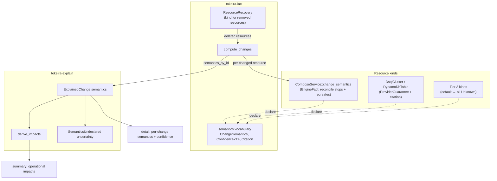

# Design Document: Explanation Change Semantics

## Overview

This design adds one method to `Resource`, one vocabulary to `tokeira-iac`, one collection
step to change computation, and one derivation to `tokeira-explain`. The result is that a
plan can state what a change *does* to a running system, in the words of the kind that
owns the provider, with the confidence and citation attached.

A worked example, established from the code during this design and not from memory:

> `ComposeService::reconcile_service` stops the container, removes it with `force: true`,
> and creates a new one (`crates/tokeira-compose/src/lib.rs`). A compose service *update*
> is therefore a **destroy-before-create replacement with the service unavailable for the
> duration** — while its data survives, because state rides bind-mounted volumes.

Today the operator sees `~ compose/grafana`, a glyph that reads as "modified in place".
The engine's `ChangeKind` is a statement about *state reconciliation*; the semantics are a
statement about *what the provider does*. They legitimately differ, and the second is the
one that costs the operator downtime. Surfacing that difference is this feature in one
sentence.

Sources: the `Resource` trait and change computation (`crates/tokeira-iac/src/engine.rs`),
the compose provider's reconcile path (`crates/tokeira-compose/src/lib.rs`), and the
Feature 1 model (`.kiro/specs/explanation-evidence-model/design.md`).

## Dependencies and Non-Goals

**Depends on:** Feature 1 (`explanation-evidence-model`) for the model, the plan-outcome
carrier, and the uncertainty machinery.

**Amends Feature 1** as recorded in this spec's requirements: the semantic vocabulary
moves to `tokeira-iac` (a trait method on `Resource` cannot depend on a crate that depends
on `tokeira-iac`), `tokeira-explain` re-exports it, and `PlanOutcome` gains
`semantics_by_id`.

**Non-goals:** cause (Feature 3), dependants (Feature 3), spans (Feature 4), declarations
for Tier 3 kinds, and any change to how the engine classifies destructiveness.

## Architecture



Collection happens exactly where changes are computed — the desired resources are already
in hand there, so no second composition pass and no extra provider call.

## Components and Interfaces

### C1. `crates/tokeira-iac/src/semantics.rs` — the vocabulary

```rust
/// How the provider effects the change. Distinct from `ChangeKind`, which
/// describes state reconciliation: a compose service `Update` is effected as a
/// `Replaced` because the provider path stops and recreates the container.
#[derive(Debug, Clone, Copy, PartialEq, Eq, Serialize, Deserialize)]
pub enum LifecycleOperation { Created, UpdatedInPlace, Replaced, Deleted }

#[derive(Debug, Clone, Copy, PartialEq, Eq, Serialize, Deserialize)]
pub enum ReplacementPolicy { NotRequired, CreateBeforeDestroy, DestroyBeforeCreate }

#[derive(Debug, Clone, Copy, PartialEq, Eq, Serialize, Deserialize)]
pub enum Disruption { None, Rolling, BriefInterruption, UnavailableDuringChange }

#[derive(Debug, Clone, Copy, PartialEq, Eq, Serialize, Deserialize)]
pub enum DataEffect { NoDataHeld, Preserved, Migrated, Destroyed }

#[derive(Debug, Clone, Copy, PartialEq, Eq, Serialize, Deserialize)]
pub enum Reversibility { Reversible, ReversibleWithDataLoss, Irreversible }
```

Confidence carries the citation *inside* the provider-guarantee variant, so the claim and
its evidence cannot be separated:

```rust
#[derive(Debug, Clone, Copy, PartialEq, Eq, Default, Serialize, Deserialize)]
pub enum Confidence<T> {
    /// The default: nobody has established this. Renders as uncertainty.
    #[default]
    Unknown,
    /// Tokeira derived it (graph shape, heuristic). Rendered as derived.
    Inference(T),
    /// Tokeira's own engine determines it, citing Tokeira's code.
    EngineFact { value: T, citation: Citation },
    /// The provider documents it, citing the provider's documentation.
    ProviderGuarantee { value: T, citation: Citation },
}

/// A documentation reference. Constructed `const`, so the non-empty check is a
/// compile-time failure at every declaration site — declarations are `const`
/// items by convention precisely so this holds.
#[derive(Debug, Clone, Copy, PartialEq, Eq, Serialize, Deserialize)]
pub struct Citation(&'static str);

impl Citation {
    pub const fn new(reference: &'static str) -> Self {
        assert!(!reference.is_empty(), "a citation must name its source");
        Self(reference)
    }
}
```

`EngineFact` carries a citation too — the compose finding above is exactly as
citation-worthy as an AWS guarantee, and pointing at `reconcile_service` is what lets the
next reader verify it.

```rust
#[derive(Debug, Clone, Copy, Default, PartialEq, Eq, Serialize, Deserialize)]
pub struct ChangeSemantics {
    pub operation: Confidence<LifecycleOperation>,
    pub replacement: Confidence<ReplacementPolicy>,
    pub disruption: Confidence<Disruption>,
    pub data_effect: Confidence<DataEffect>,
    pub reversibility: Confidence<Reversibility>,
}
```

#### C1 amendment (2026-07-29): structured citations

`Citation` evolves from an opaque string into the two reference forms the claims
actually make, keeping `const` construction and the non-empty guarantees:

```rust
pub enum Citation {
    /// The engine's own code, by module identity (`module_path!()`-based).
    Code(Cow<'static, str>),
    /// Product documentation: title + URL render as a link; the quote
    /// preserves the establishing sentence.
    Doc {
        title: Cow<'static, str>,
        url: Cow<'static, str>,
        quote: Option<Cow<'static, str>>,
    },
}
```

`Inference` gains a citation alongside `EngineFact` and `ProviderGuarantee` — an
uncited conclusion is as unrepresentable as an uncited fact. This is a durable-format
change to the artifact's citation serialization (see Data Models). The optional
kind-authored mechanism `statement` (Requirement 1 amendment) joins `ChangeSemantics`
as an `Option<Cow<'static, str>>`.

### C2. The declaration point

```rust
/// What the kind needs in order to decide. A context struct rather than loose
/// parameters so Features 3–4 can extend the inputs without breaking every
/// declaration site.
pub struct SemanticsContext<'a> {
    pub kind: ChangeKind,
    pub current: Option<&'a ResourceState>,
    pub field_diffs: &'a [FieldDiff],
}

pub trait Resource {
    // …existing methods…

    /// Declare what this change does to the running resource.
    ///
    /// MUST be pure and total: no I/O, no provider call, no panic, a value for
    /// every input. The default declares nothing, which is the honest posture
    /// for a kind whose provider behaviour nobody has established.
    fn change_semantics(&self, ctx: &SemanticsContext<'_>) -> ChangeSemantics {
        ChangeSemantics::default()
    }
}
```

The default keeps the method dyn-compatible and keeps 34 kinds correct without edits.

### C3. Collection during change computation

`compute_changes` gains one step per non-`NoChange` change:

```rust
let semantics = resource.change_semantics(&SemanticsContext {
    kind: change.kind,
    current: state.resources.get(&rid),
    field_diffs: &change.details,
});
semantics_by_id.insert(rid.clone(), semantics);
```

For deletions the desired set has no resource, so the kind is reached through the recovery
seam already registered by the platform (Feature 1's `ResourceRecovery`): recover from
recorded state, then declare. Where no recoverer claims the type, the id is simply absent
from the map, and `tokeira-explain` turns that absence into an uncertainty
(`KindUnavailableForRemovedResource`) rather than into silence.

`PlanOutcome` gains the map alongside the refresh coverage Feature 1 introduced:

```rust
pub struct PlanOutcome {
    pub changes: Vec<Change>,
    pub refresh: RefreshCoverage,
    pub semantics_by_id: BTreeMap<ResourceId, ChangeSemantics>,
}
```

### C4. `tokeira-explain` — impact derivation

```rust
#[derive(Debug, Clone, Copy, PartialEq, Eq, PartialOrd, Ord, Serialize, Deserialize)]
pub enum ImpactClass {
    DataDestroyed,        // most consequential
    Unavailability,
    Replacement,
    BriefInterruption,
    RollingReplacement,   // least
}

pub struct OperationalImpact {
    pub evidence_id: EvidenceId,
    pub class: ImpactClass,
    pub subjects: Vec<EvidenceId>,   // the changes that justify it
    pub statement: String,           // deterministic template, no free prose
}

/// Pure function of declared semantics. Two plans with identical declarations
/// produce identical impacts, in identical order.
pub fn derive_impacts(changes: &[ExplainedChange]) -> Vec<OperationalImpact>;
```

Derivation rules, applied in `ImpactClass` order so output ordering is severity-first.
Two trigger families: declared semantics (confidence above `Unknown`), and the engine's
own change classification — the floor that renders with no declaration at all:

| Trigger | Impact |
|---|---|
| declared `DataEffect::Destroyed` | `DataDestroyed`, naming the resources and the irreversibility |
| declared `Disruption::UnavailableDuringChange` | `Unavailability`, naming the resources and the window |
| **engine fact:** `ChangeKind::Replace` (the engine executes delete-then-create) | `Unavailability` while the change applies — lifted when the declared replacement policy establishes `CreateBeforeDestroy` above `Unknown` — and `Replacement` |
| **engine fact:** `ChangeKind::Delete` | `Unavailability` as no-longer-available |
| **engine fact:** the desired graph drops a recorded dependency on a deleted resource | `DependencyLoss` — the dependant would continue without it |
| declared `ReplacementPolicy` other than `NotRequired` | `Replacement`, naming the resources |
| declared `Disruption::BriefInterruption` | `BriefInterruption` |
| declared `Disruption::Rolling` | `RollingReplacement` |

Subjects within an impact are ordered by change `EvidenceId`. `Inference` confidence
contributes to impacts but is marked as derived when rendered; `Unknown` contributes
nothing and instead produces uncertainty.

### C5. Uncertainty activation

`SemanticsUndeclared { field }` — defined by Feature 1, deliberately never constructed
there — is emitted here under exactly the conditions in Requirement 6:

- a field is `Unknown` for this change **and** stated for at least one other change in the
  same plan → one uncertainty naming resource and field;
- the field is `Unknown` for every change in the plan → one plan-level uncertainty for that
  field, not one per change;
- the field does not apply to the change kind → nothing.

The middle rule is the noise control that makes the section readable: before any kind
declares, a plan carries at most five plan-level uncertainties rather than five per change.

*Amendment (2026-07-29):* these uncertainties are a **machine channel** — model and
artifact only, for agents and CI gates. Narrative never renders them (knowledge renders;
gaps enforce — amended Requirement 6.5); Requirement 7's tier coverage is what makes an
undeclared first-party field a build failure rather than an operator-visible shrug.

### C6. Tier 1 and Tier 2 declarations

The declarations this feature writes. **The design fixes the shape and the citation
obligation; it does not pre-fill provider answers** — asserting AWS behaviour here from
memory is precisely the failure this feature exists to prevent. Each implementer reads the
provider's documentation and records the reference in the `Citation`.

| Kind | Established from | Notes for the implementer |
|---|---|---|
| `ComposeService` | Tokeira's own `reconcile_service` — stop, force-remove, create | `EngineFact` throughout, citing `crates/tokeira-compose/src/lib.rs`. Operation `Replaced` even when `ChangeKind` is `Update`; replacement `DestroyBeforeCreate`; disruption `UnavailableDuringChange`; data effect `Preserved` (state rides bind-mounted volumes); reversibility `Reversible` |
| `ObservabilityConfigFilesResource` | Tokeira's own write path | `EngineFact`. Files are rewritten in place; consuming services are not restarted by this resource, so disruption is `None` at this resource and any restart belongs to the service's own change |
| `LocalStateDirResource` | Tokeira's own directory management | `EngineFact`. Deletion's data effect is the operator-visible question and MUST be established from the delete implementation, not assumed |
| `DsqlCluster` | AWS DSQL documentation | Researched 2026-07-29: managed-delete `reversibility = ProviderGuarantee(Irreversible)` — "AWS Backup creates a new cluster from your snapshots; the restored cluster won't overwrite the source cluster" (aws-backup devguide restore-auroradsql) and restore requires a pre-existing recovery point; `data_effect = Inference(Destroyed)` — derived from the documented recovery model (whole-cluster backups are the sole path; restore is new-cluster-only), cited per amended Req 2.8; managed-create `reversibility = Inference(ReversibleWithDataLoss)` |
| `DynamoDbTable` | AWS DynamoDB documentation | Researched 2026-07-29: delete `reversibility = ProviderGuarantee(Irreversible)` — the system backup exists only "when you delete a table that has point-in-time recovery enabled" (developerguide PointInTimeRecovery_Howitworks) and this engine's create leaves PITR at its documented DISABLED default; restore in any case "always restores to a new table". TTL-bearing updates declare `data_effect = ProviderGuarantee(Policy)` ("DynamoDB automatically deletes expired items within a few days of their expiration time", developerguide/TTL) with the statement carrying the specific meaning, and `reversibility = Inference(ReversibleWithDataLoss)`. The diff covers tags and TTL today; DynamoDB's wider update surface (billing mode, throughput, streams, table class, SSE, deletion protection) joins as the kind grows — settings changes declare in-place/`Preserved`, data-affecting policies declare `Policy` |

## Data Models

*Amendment (2026-07-29):* the structured `Citation` **is** a durable format change — the
artifact's citation serialization becomes the `Code`/`Doc` shape and `Inference` carries
one. The explanation schema is still pre-1.0-of-this-feature (no artifact consumers
beyond this workspace), so the shape changes in place; the field policy in the
evidence-model spec is amended in the same pass.

Otherwise: no durable format changes. `ChangeSemantics` is serialized inside the explanation artifact
(Feature 1's schema), so the artifact gains populated `semantics` objects where it
previously carried all-`Unknown` ones — an additive change to a field that already exists,
which is exactly what Feature 1's slot reservation was for.

## Correctness Properties

**Property 1 — The default declares nothing.**
*For any* kind that does not override `change_semantics`, and *any* context, every field of
the returned semantics is `Unknown`.
**Validates: Requirements 1.4, 2.4**

**Property 2 — Declaration is total.**
*For any* kind and *any* context — every `ChangeKind`, any field-difference set including
empty and observation-only, with and without recorded state — `change_semantics` returns a
value without panicking.
**Validates: Requirements 1.5, 1.6**

**Property 3 — Transport is verbatim.**
*For any* collected semantics, the explanation model's semantics for that resource equal
the declaration exactly, field for field and confidence for confidence.
**Validates: Requirements 3.5, 3.6**

**Property 4 — Declarations cannot move the destructive set.**
*For any* plan and *any* substitution of declared semantics, the explanation's destructive
set equals the engine's classification of the same changes.
**Validates: Requirements 4.1, 4.2**

**Property 5 — Impact derivation is a pure function of declarations and kinds.**
*For any* two explanations whose changes carry identical declarations and change kinds,
the derived impacts are equal, including order.
**Validates: Requirements 5.8, 5.9**

**Property 6 — Every impact is grounded.**
*For any* derived impact, each subject resolves to a change whose declared semantics
satisfy that impact class's trigger, and no change satisfying a trigger is absent from the
corresponding impact.
**Validates: Requirements 5.2, 5.3, 5.4**

**Property 7 — Unknown never becomes a claim.**
*For any* explanation, no narrative output asserts a field whose confidence is `Unknown`,
and no `Unknown` field contributes to any impact. *(2026-07-29: narrative additionally
renders no undeclared-semantics uncertainty — gaps are machine-channel only.)*
**Validates: Requirements 5.7, 6.5, 9.4**

**Property 8 — Uncertainty activation is exact.**
*For any* explanation, a `SemanticsUndeclared` uncertainty exists for (resource, field) if
and only if that field is `Unknown` for that change and stated for another change in the
plan; and when a field is `Unknown` across every change, exactly one plan-level
uncertainty exists for it.
**Validates: Requirements 6.1, 6.2, 6.4**

**Property 9 — Tier coverage holds.**
*For any* kind in Tier 1 or Tier 2, every applicable field is declared with confidence
above `Unknown`.
**Validates: Requirements 7.2, 7.5**

**Property 10 — Every claim cites.**
*For any* declaration in the workspace, a field carrying `ProviderGuarantee`,
`EngineFact`, or `Inference` carries a non-empty citation; a `Doc` citation carries a
non-empty title and URL. *(Amended 2026-07-29.)*
**Validates: Requirements 2.2, 2.3, 2.6, 2.7, 2.8**

## Error Handling

Semantics are pure functions; the feature introduces no fallible path. The conditions that
look like errors are modelled outcomes:

| Condition | Treatment |
|---|---|
| Kind declares nothing | `Unknown` fields → uncertainty per C5. Not an error |
| Deleted resource has no registered recoverer | Absent from `semantics_by_id` → `KindUnavailableForRemovedResource` uncertainty. Not an error; the delete itself is unaffected |
| Citation empty at a declaration site | Compile-time failure via `Citation::new`'s const assertion when declared as a `const` item |
| A kind's declaration panics | Prohibited by Requirement 1.6 and covered by Property 2; a panic here would abort a read-only verb, which is why totality is a property rather than a convention |

## Testing Strategy

**Property tests in `tokeira-iac`:** Properties 1 and 2, generated over all `ChangeKind`s,
arbitrary field-diff sets (including empty and observation-only), and present/absent
recorded state, run against both the default implementation and every declaring kind.

**Property tests in `tokeira-explain`:** Properties 3–8, generated over arbitrary
declaration sets — including all-`Unknown`, all-declared, and mixed — with Property 4
specifically fuzzing declarations against a fixed change set to prove the destructive set
never moves.

**Workspace tests:** Property 9 iterates a maintained registry of Tier 1 and Tier 2 kinds,
constructing each and asserting its declarations; Property 10 asserts citation
non-emptiness across the same registry. The registry is the executable half of the
requirements' kind inventory — adding a Tier 1 kind without declaring fails the suite.

**Golden tests per declaring kind** (Requirement 8): six scenarios each — creation,
in-place update, replacement, deletion, drift-driven update, and the unknown case —
asserting the classification and confidence, never the prose. They live beside the kind so
that changing a kind's behaviour and forgetting its declaration is a failing test in the
same file.

**Rendering tests in `tokeira-provisioner-cli`:** summary shows impacts and no per-change
semantics; detail shows semantics with confidence; `Inference` renders as derived;
`Unknown` renders as nothing.
