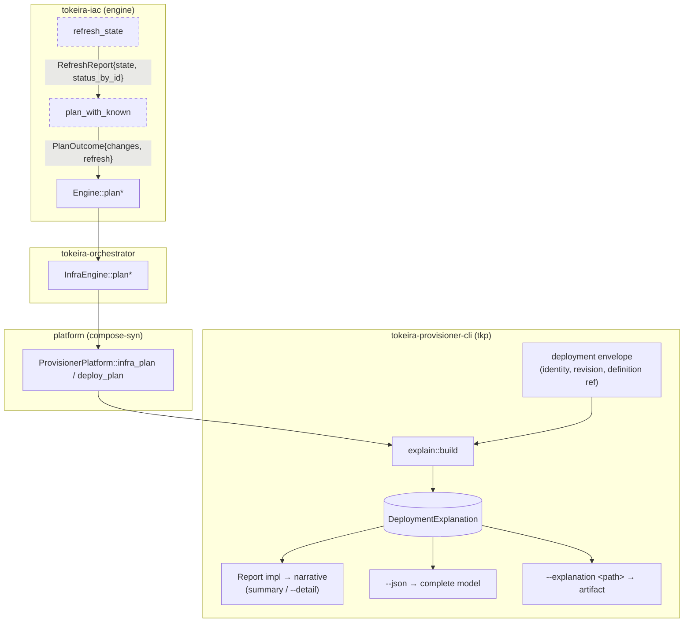

# Design Document: Explanation Evidence Model

## Overview

This design builds the explanation foundation: a `tokeira-explain` crate holding the
model, the widening of the engine's plan surface so per-resource refresh status survives
to the shell, construction of the model from engine outputs plus envelope facts, and
rendering through the existing output contract.

The design's shape is dictated by three constraints from the approved requirements:

1. **Nothing new is asked of providers.** The model is assembled from what the engine
   already computes during the verb (Requirement 1.4). The single reason uncertainty is
   currently invisible is that a struct field is dropped one line after it is populated.
2. **The model is the product, the renderer is a view.** Narrative and JSON are two
   renderings of one value; neither may contain a fact the other lacks (Requirement 6).
3. **Slots exist before their owners.** Features 2–4 populate `semantics`, `cause`,
   `dependants`, and `source`; this design defines them, defaults them, and renders them
   as nothing (Requirement 8).

Sources for the design: the engine's refresh and diff implementation
(`crates/tokeira-iac/src/engine.rs`), the audit change log's ids-only contract
(`crates/tokeira-provisioner/src/lib.rs`, Proposal 002), the output contract
(`docs/platforms/operator-output-contract.md`), and the lexicon
(`docs/platforms/operator-language.md`).

## Dependencies and Non-Goals

**Depends on:** nothing unbuilt. Every input exists in the tree today.

**Owned by sibling specs, deliberately absent here:**

| Concern | Owner |
|---|---|
| Populating `semantics` | `explanation-change-semantics` (Feature 2) |
| Populating `cause`, `dependants`, and causal grouping | `explanation-causality` (Feature 3) |
| Populating `source` with definition spans | `explanation-source-spans` (Feature 4) |
| Querying a produced model | `explanation-analysis-protocol` (Feature 5) |
| Any narration, agent, or model integration | `explanation-agent-clients` (Feature 6) |

**Non-goals:** changing which changes the engine computes; adding provider calls;
introducing impacts derived from anything other than declared semantics (they stay empty
until Feature 2); detecting provider-assigned values (needs kind declarations, Feature 2).

## Architecture

The explanation is assembled at the shell, from two streams that already exist and one
that is currently severed:



The dashed edge is the change: `refresh_state` computes `status_by_id`, and
`plan_with_known` currently discards it while keeping `.state`. Restoring that edge and
carrying it through three further signatures is the whole of Requirement 5.

Apply follows the same assembly with a thinner left-hand stream: committed entries (ids
and ops) instead of a plan, per Proposal 002.

## Components and Interfaces

### C1. `crates/tokeira-iac` — refresh status becomes public and survives planning

`RefreshStatus` is private today (`enum RefreshStatus` in `engine.rs`). It becomes public,
gains `Serialize`/`Deserialize`, and is joined by a carrier for the plan surface:

```rust
/// Per-resource confirmation status from the refresh pass, and whether a
/// refresh happened at all. `examined == false` means the verb performed no
/// live-state check — a materially different statement from "everything was
/// confirmed", and one the explanation must be able to make.
#[derive(Debug, Clone, Default, Serialize, Deserialize)]
pub struct RefreshCoverage {
    pub status_by_id: BTreeMap<ResourceId, RefreshStatus>,
    pub examined: bool,
}

/// What a plan produced: the changes, and what the engine could confirm while
/// producing them.
#[derive(Debug, Clone)]
pub struct PlanOutcome {
    pub changes: Vec<Change>,
    pub refresh: RefreshCoverage,
}
```

`BTreeMap` rather than `HashMap` is load-bearing: it makes serialization order a function
of the keys, which Property 2 (determinism) requires. `ResourceId` gains `Ord`
accordingly.

The five plan entry points return `PlanOutcome` instead of `Vec<Change>`:
`Engine::plan`, `plan_with_known`, `plan_for_modules`, `plan_destroy`,
`plan_destroy_for_modules`. `Engine::destroy` consumes `plan_destroy` internally and takes
`.changes`.

### C2. `crates/tokeira-orchestrator` — pass-through widening

`InfraEngine::plan` and `plan_destroy` return `PlanOutcome`. No logic changes; the module
filter continues to apply to `.changes` only, and coverage is carried unfiltered (a
resource filtered out of this plan's changes was still examined, and saying so is
correct).

### C3. `crates/tokeira-provisioner-cli` — platform seam and model construction

```rust
pub trait ProvisionerPlatform {
    async fn infra_plan(&self, deployment_dir: &Path) -> Result<PlanOutcome>;
    async fn deploy_plan(&self, deployment_dir: &Path) -> Result<Realization<PlanOutcome>>;
    // …unchanged elsewhere
}
```

Construction lives in a new `explain` module in the shell, because it needs both the
engine outcome and the envelope:

```rust
/// The deployment facts the model needs that the engine does not know.
pub(crate) fn deployment_context<P: ProvisionerPlatform>(
    platform: &P,
    deployment_dir: &Path,
    envelope: &DeploymentStateEnvelope,
    operation: &'static str,
) -> tokeira_explain::DeploymentContext;

/// Plan-side model.
pub(crate) fn explain_plan(
    context: DeploymentContext,
    outcome: &PlanOutcome,
) -> DeploymentExplanation;

/// Apply-side model. `preceding` is the destructive-gate plan when the verb
/// computed one; its field evidence is reused for matching ids (Req 2.3),
/// and its absence becomes an uncertainty (Req 2.4).
pub(crate) fn explain_applied(
    context: DeploymentContext,
    committed: &[ChangeLogEntry],
    preceding: Option<&PlanOutcome>,
) -> DeploymentExplanation;
```

`ChangeLogEntry` is mapped to the model's own `CommittedChange` at this boundary so the
model crate does not depend on `tokeira-provisioner` (Requirement 9.1).

### C4. `crates/tokeira-explain` — the model crate

Dependencies: `serde`, `serde_json`, `tokeira-iac`. Explicitly not `tokeira-report`, not
`tokeira-provisioner`, not `tokeira-provisioner-cli` (Requirement 9.1–9.3).

**Amendment (Feature 2, task 1.1 — applied at crate creation):** the semantic vocabulary
(`ChangeSemantics`, `Confidence<T>`, `Citation`, and the axis enums) lives in
`crates/tokeira-iac/src/semantics.rs`, beside the `Resource` trait that will declare it —
not in this crate. `tokeira-explain` re-exports it, so explanation consumers see one
surface.

```rust
pub mod evidence;   // EvidenceId, EvidenceIndex
pub mod model;      // DeploymentExplanation and members
pub mod build;      // construction from engine outputs
pub mod artifact;   // write/read the JSON artifact
```

### C5. Rendering — in the shell, beside its siblings

The `Report` implementation lives in `crates/tokeira-provisioner-cli/src/render.rs`
alongside `PlanReport`, per Requirement 9.4. This keeps `tokeira-explain` free of a
rendering dependency at the cost of one future move: if Feature 5 or 6 needs to render an
artifact from outside `tkp`, the `Report` impl moves into `tokeira-explain` and that crate
gains `tokeira-report` (a serde-only crate) as a dependency. The move is mechanical and is
noted here so it is a decision, not a surprise.

### C6. CLI surface

`--explanation <path>` is added to the plan and apply verbs of `tkp`, and forwarded by
`tkr`. It is orthogonal to `--json`: `--json` renders the model to stdout, `--explanation`
writes it to a file, and both may be requested.

## Data Models

### `DeploymentExplanation`

```rust
#[derive(Debug, Clone, Serialize, Deserialize)]
pub struct DeploymentExplanation {
    pub schema_version: u32,             // EXPLANATION_SCHEMA_VERSION
    pub deployment: String,              // envelope deployment_id
    pub platform: String,                // ProvisionerPlatform::label
    pub operation: String,               // "infra plan", "infra apply", …
    pub current_revision: u64,           // envelope config_revision
    pub proposed_revision: Option<u64>,  // mutating verbs only
    pub definition_ref: Option<String>,  // envelope effective_config_ref
    pub changes: Vec<ExplainedChange>,
    pub impacts: Vec<OperationalImpact>, // empty until Feature 2
    pub destructive: Vec<EvidenceId>,    // references into `changes`
    pub uncertainties: Vec<Uncertainty>,
    pub evidence: EvidenceIndex,
}
```

### `ExplainedChange`

```rust
#[derive(Debug, Clone, Serialize, Deserialize)]
pub struct ExplainedChange {
    pub evidence_id: EvidenceId,
    pub resource_id: String,
    pub module: String,
    pub resource_type: String,
    pub kind: ChangeKind,
    pub field_diffs: Vec<FieldDiff>,
    pub refresh_status: Option<RefreshStatus>, // None ⇔ not examined
    pub semantics: ChangeSemantics,            // slot — Feature 2
    pub cause: Cause,                          // slot — Feature 3
    pub dependants: Vec<String>,               // slot — Feature 3
    pub source: Option<SourceLocation>,        // slot — Feature 4
}
```

### Slots

Each slot's not-determined value is its `Default`, so a later feature populates without
reshaping:

```rust
#[derive(Debug, Clone, Default, Serialize, Deserialize)]
pub struct ChangeSemantics {
    pub operation: Confidence<LifecycleOperation>,
    pub replacement: Confidence<ReplacementPolicy>,
    pub disruption: Confidence<Disruption>,
    pub data_effect: Confidence<DataEffect>,
    pub reversibility: Confidence<Reversibility>,
}

/// A value and how firmly Tokeira holds it. `Unknown` is `Default` — the lazy
/// path is the honest path (umbrella decision D4).
#[derive(Debug, Clone, Default, Serialize, Deserialize)]
pub enum Confidence<T> {
    #[default]
    Unknown,
    Inference(T),
    EngineFact(T),
    ProviderGuarantee { value: T, citation: String },
}

#[derive(Debug, Clone, Default, Serialize, Deserialize)]
pub enum Cause {
    #[default]
    Undetermined,
    DefinitionEdit { source: Option<SourceLocation> },
    DependencyOutputChanged { dependency: String },
    ProviderDrift,
    ReplacementCascade { root: String },
    EngineAdvance,
}
```

### `Uncertainty`

```rust
#[derive(Debug, Clone, Serialize, Deserialize)]
pub struct Uncertainty {
    pub evidence_id: EvidenceId,
    pub subject: EvidenceId,
    pub reason: UncertaintyReason,
    pub consequence: String,
    pub resolvable_by: Option<String>,
}

#[derive(Debug, Clone, Serialize, Deserialize)]
pub enum UncertaintyReason {
    /// Refresh could not confirm live state (`RefreshStatus::Unknown`).
    LiveStateUnconfirmed,
    /// The verb performed no live-state check at all.
    LiveStateNotExamined,
    /// An apply with no preceding plan in the same invocation: the committed
    /// ids are known, the field-level evidence is not (Proposal 002).
    FieldEvidenceUnavailable,
    /// Reserved for Feature 2: a kind declares nothing for a field the report
    /// would otherwise state.
    SemanticsUndeclared { field: String },
    /// Reserved for Feature 2: the provider assigns this value during apply.
    ProviderAssignedAtApply { field: String },
}
```

`SemanticsUndeclared` and `ProviderAssignedAtApply` are defined here and **not emitted by
this feature**: with every slot not-determined, the renderer states no semantics
(Requirement 8.4), so no field is left unqualified. They activate in Feature 2 as its
requirements come into force. Emitting them now would attach an uncertainty to every
change in every plan — noise that would teach operators to skip the section this spec
exists to make meaningful.

### `EvidenceId`

Identity is derived from a fact's natural key, never from position:

| Fact | `EvidenceId` |
|---|---|
| Explained change | `change:{module}::{resource_id}` |
| Uncertainty | `uncertainty:{reason_tag}:{subject}` |
| Impact | `impact:{kind_tag}:{subject}` |
| Deployment | `deployment:{name}` |

Ordinal ids (`C12`, `R17`) are rejected: they are stable only while iteration order is,
and Property 2 requires stability across runs. Natural keys are longer and debuggable, and
they satisfy Requirement 3.5 (same resource, same deployment and revision → same id) by
construction rather than by bookkeeping.

`EvidenceIndex` is a `BTreeMap<EvidenceId, EvidenceKind>` built during construction;
`resolve` returns `Option`, and construction asserts closure (Property 3).

## Correctness Properties

**Property 1 — Change coverage is total.**
*For any* engine plan outcome, the constructed explanation contains exactly one explained
change per engine change, preserving kind, module, resource id, and resource type, and
introduces no change of its own.
**Validates: Requirements 1.1, 1.3**

**Property 2 — Construction is deterministic.**
*For any* pair of constructions from identical inputs, the serialized models are
byte-identical, including the order of every collection.
**Validates: Requirements 3.2, 3.4**

**Property 3 — Evidence closure holds.**
*For any* constructed explanation, every `EvidenceId` appearing in any field (destructive
actions, uncertainty subjects, impact subjects) resolves in the evidence index to exactly
one fact.
**Validates: Requirements 3.1, 3.3, 7.3**

**Property 4 — Uncertainty is exhaustive over unconfirmed state.**
*For any* refresh coverage, every resource whose status is `Unknown` and which appears in
the plan yields exactly one uncertainty with reason `LiveStateUnconfirmed` whose subject
is that resource's change; and if coverage was not examined, the explanation carries
exactly one `LiveStateNotExamined` uncertainty for the plan as a whole.
**Validates: Requirements 4.1, 4.2, 5.5**

**Property 5 — Detail is a superset of summary.**
*For any* explanation, every line the summary rendering produces also appears in the detail
rendering.
**Validates: Requirements 6.1, 6.2**

**Property 6 — Structured form is complete and depth-blind.**
*For any* explanation and *any* depth, the JSON rendering is identical and round-trips to
an equal model.
**Validates: Requirements 6.3, 7.2**

**Property 7 — Widening preserves planning.**
*For any* composition and starting state, the changes returned by the widened plan surface
equal, in order and content, those returned before the widening.
**Validates: Requirement 5.6**

**Property 8 — Not-determined slots are silent.**
*For any* explanation whose slots are all not-determined, the narrative rendering at either
depth contains no text derived from a slot.
**Validates: Requirements 6.6, 8.4**

**Property 9 — Apply-side explanation invents nothing.**
*For any* apply-side construction, every field diff present in the model appears in the
preceding plan for the same resource id; when no preceding plan exists, the model carries
no field diffs and exactly one `FieldEvidenceUnavailable` uncertainty per committed change.
**Validates: Requirements 2.2, 2.3, 2.4**

**Property 10 — The artifact is self-contained and bounded.**
*For any* written artifact, parsing it without access to the deployment directory yields a
model satisfying Property 3, whose serialized keys are a subset of those enumerated in the
requirements' field policy.
**Validates: Requirements 7.1, 7.3, 7.4**

**Property 11 — Rendering stays inside the lexicon.**
*For any* explanation, the narrative rendering at either depth contains no term on the
banned list in `operator-language.md`.
**Validates: Requirements 6.5, 10.3**

## Error Handling

| Condition | Internal | Operator-facing outcome |
|---|---|---|
| Artifact path unwritable | `ExplainError::ArtifactWrite { path, source }` | The verb fails, naming the path and the underlying reason; the verb is not reported as succeeded (Req 7.6) |
| Model fails to serialize | `ExplainError::Serialize(serde_json::Error)` | The verb fails; a model that cannot serialize is a defect, surfaced rather than swallowed |
| Evidence closure violated at construction | debug assertion + `ExplainError::DanglingEvidence { id }` | Construction fails loudly in tests; in release the dangling reference is dropped and an uncertainty records the omission, so a bug degrades the report rather than the verb |
| Refresh coverage empty for a verb that refreshed | not an error | `examined: true` with no statuses is a legitimate empty plan |
| Platform returns `Realization::NotApplicable` | existing behaviour | Unchanged: typed refusal, no explanation constructed |

## Testing Strategy

**Property-based (proptest), in `tokeira-explain`:** Properties 1–4, 6, 8–10 are driven
from generated `PlanOutcome`s — arbitrary change sets across all five `ChangeKind`s,
arbitrary refresh coverage including unexamined and all-unknown, and arbitrary field
diffs including `observation` forms. Property 2 is checked by constructing twice from one
input and comparing serializations; Property 6 by round-tripping.

**Property 7 lives in `tokeira-iac`** as a differential test: the pre-widening change
computation is retained as a test-only helper and compared against `PlanOutcome.changes`
over generated compositions.

**Properties 5 and 11 live in `tokeira-provisioner-cli`** with the renderer, since they
concern rendering. Property 11 is mechanically checkable: the banned list is extracted
from `operator-language.md` and asserted absent from rendered output — the lexicon becomes
executable rather than aspirational.

**Example-based unit tests:** the empty plan (renders "no changes" plus full-confirmation
statement); a plan where every resource is `Unknown` (uncertainty count equals change
count); an apply with and without a preceding plan; artifact write to an unwritable path.

**Integration:** `platforms/compose-syn/tests/exercise.rs` gains an assertion that a plan
against the reference definition produces a model whose changes match the plan's and whose
evidence closure holds, exercising the full engine → orchestrator → platform → shell path.
