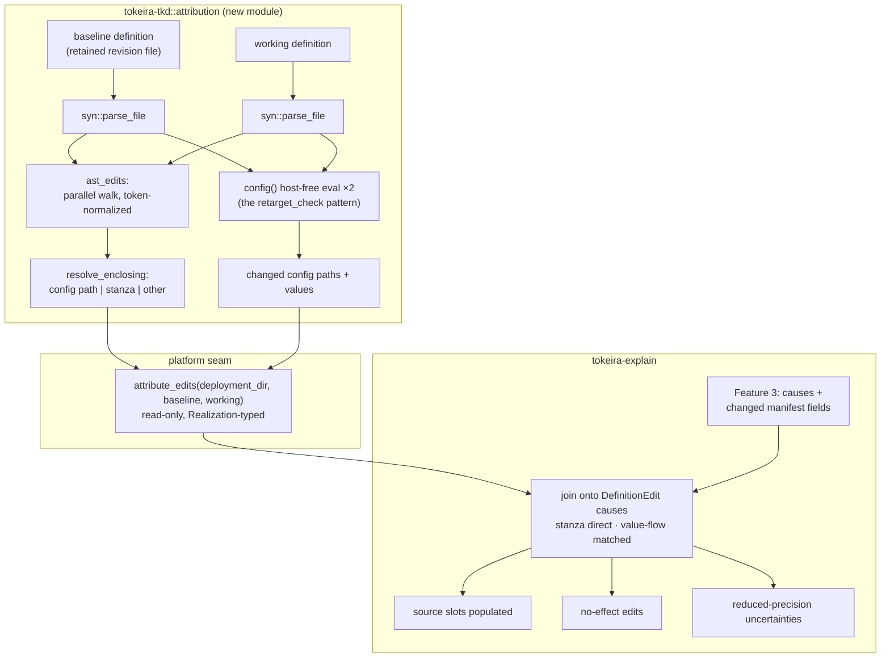

# Design Document: Explanation Source Spans

## Overview

Attribution is a **three-stage syntactic pass** owned by `tokeira-tkd` (which owns `syn`
parsing), exposed through one read-only platform operation, and joined onto Feature 3's
causes in `tokeira-explain`:

1. **Diff** — parse baseline and working definitions; walk the two ASTs in parallel;
   emit the smallest differing nodes as edits with working-file spans. Token-normalized
   comparison makes formatting invisible.
2. **Resolve** — for each edit, walk outward to the smallest named construct: a config
   value path, a `d.service`/`d.resource` stanza (whose own string-literal arguments name
   module and resource), a writeback, a type, or the function level.
3. **Attribute** — stanza edits bind directly to their resource's `DefinitionEdit` cause;
   config edits bind by evaluating both revisions' `config()` host-free and matching the
   changed value against changed manifest fields, exactly and unambiguously, or not at
   all.

Evaluation is never instrumented; `deployment()` is never evaluated by this pass;
realization cannot differ with attribution present. That is the design's central trade,
argued in the requirements' Introduction and treated as settled here.

Sources: the `tokeira-tkd` parse/eval architecture (`lib.rs`, `eval.rs`, `subset.rs`),
the definition's builder grammar (`platforms/compose-syn/definition.tkd`), Feature 3's
snapshots and `BaselineSnapshot`, and Feature 1's model.

## Dependencies and Non-Goals

**Depends on:** Feature 3 (the `DefinitionEdit` causes to decorate, the baseline
resolution, the changed-manifest-field sets). Feature 1's `SourceLocation` slot.

**Amends:** the umbrella (mechanism criteria → outcome criteria) and Feature 1
(`SourceLocation.basis`), both recorded in the requirements.

**Non-goals:** value taint; attribution of non-edit causes; edit *suggestions*; semantic
diffing of config *values* beyond what attribution needs (Feature 5's revision comparison
composes the same primitives for its own report).

## Architecture



## Components and Interfaces

### C1. `tokeira-tkd::attribution` — diff and resolve

```rust
/// A located AST-level difference, in working-file coordinates.
#[derive(Debug, Clone, PartialEq, Eq, Serialize, Deserialize)]
pub struct DefinitionEdit {
    pub line: u32,
    pub column: u32,
    pub enclosing: EnclosingConstruct,
    /// The differing region's token text, truncated — evidence for rendering,
    /// never re-parsed.
    pub excerpt: String,
}

#[derive(Debug, Clone, PartialEq, Eq, Serialize, Deserialize)]
pub enum EnclosingConstruct {
    ConfigValue { path: String },
    ServiceStanza { module: String, name: String },
    ResourceStanza { module: String, name: String },
    Writeback { key: String },
    TypeDefinition { name: String },
    Definition, // function/module level: additions, removals, reordering
}

/// Stage 1+2: parse both sources, walk in parallel, resolve enclosures.
/// Pure syntax; no evaluation, no I/O beyond the given sources.
pub fn definition_edits(baseline: &str, working: &str) -> Result<Vec<DefinitionEdit>, EvalError>;

/// Stage 3 input: the config paths whose values differ between revisions,
/// with both values rendered canonically — host-free evaluation of each
/// side's `config()`, then a parallel walk of the two config values.
pub fn changed_config_values(baseline: &str, working: &str)
    -> Result<Vec<ChangedConfigValue>, EvalError>;

#[derive(Debug, Clone, PartialEq, Eq, Serialize, Deserialize)]
pub struct ChangedConfigValue {
    pub path: String,          // "observability.grafana.image"
    pub before: Option<String>, // canonical scalar rendering; None = introduced
    pub after: Option<String>,  // None = removed
}
```

Diff mechanics fixed by this design:

- **Comparison is by normalized token stream per node** (`to_token_stream().to_string()`),
  which erases formatting and comments; `extra-traits` equality is not relied on because
  span fields would defeat it — the normalization *is* the equality.
- **The walk descends only into differing nodes**, emitting the smallest differing
  expression (Requirement 1.3); item-level additions/removals emit at item granularity.
  Descent pairs children positionally within a node; a length mismatch emits at the
  parent, which is the smallest honest span for an insertion into a sequence.
- **Spans come from the working side** where the node exists there; a pure removal takes
  the enclosing working-side node's span (the operator's cursor still lands where the
  content used to be).
- **Stanza resolution** reads the enclosing `d.service`/`d.resource` call's literal
  arguments; a stanza whose name argument is not a string literal resolves to
  `Definition` rather than guessing (the deployed grammar uses literals; the resolver
  refuses to speculate when it does not).
- **Config path resolution** follows field/variant structure from `fn config()`'s
  returned struct expression down to the edited node.

### C2. Platform seam

```rust
pub trait ProvisionerPlatform {
    // …existing methods…

    /// Stage the attribution inputs for two definition sources. Read-only;
    /// evaluates only host-free `config()`; a source that does not parse
    /// yields the located verdict. NotApplicable where the platform has no
    /// interpreted definition.
    async fn attribute_edits(
        &self,
        deployment_dir: &Path,
        baseline: &Path,
        working: &Path,
    ) -> Result<Realization<EditAttributionInputs>>;
}

pub struct EditAttributionInputs {
    pub edits: Vec<DefinitionEdit>,
    pub changed_config: Vec<ChangedConfigValue>,
}
```

compose-syn implements it by delegating to `tokeira-tkd::attribution` — the platform
contributes file access and the not-applicable posture, nothing else. The shell invokes it
only when the plan contains at least one `DefinitionEdit` cause (no edits worth locating
otherwise), reusing Feature 3's `BaselineSnapshot` resolution for the baseline path and
inheriting its `Missing`/`DoesNotInterpret` fallbacks.

### C3. `tokeira-explain` — the join

```rust
/// Decorate DefinitionEdit causes with located edits; never reclassify.
pub fn attribute_definition_edits(
    explanation: &mut DeploymentExplanation,
    inputs: &EditAttributionInputs,
) -> AttributionOutcome;

pub struct AttributionOutcome {
    pub no_effect_edits: Vec<DefinitionEdit>,
    pub unattributed_changes: Vec<EvidenceId>, // → reduced-precision uncertainty
}
```

Join order (Requirement 3.4's "stanza-based first" generalized):

1. **Stanza pass** — every edit with a `ServiceStanza`/`ResourceStanza` enclosure whose
   named resource carries a `DefinitionEdit` cause attaches with basis `Stanza`.
2. **Value-flow pass** — for each `ChangedConfigValue`, collect the still-unattributed
   `DefinitionEdit` changes whose changed manifest fields (Feature 3 already computed
   them) contain the `after` value exactly. Exactly one candidate → attach with basis
   `ValueFlow`, using the config edit's span. Zero or several → no attribution from this
   value (Requirement 3.3).
3. **Bookkeeping** — edits attached nowhere become no-effect edits; `DefinitionEdit`
   changes still bare become `AttributionUnavailable` uncertainties and keep
   revision-level phrasing.

`SourceLocation` (Feature 1, amended) carries `{ file: String, line: u32, column: u32,
basis: AttributionBasis }`; multiple attributions on one change are ordered stanza-first,
then by span.

### C4. Rendering

Summary, per group, replaces revision-level phrasing only where attribution exists:

```text
cause: `observability.grafana.image` changed at definition.tkd:75 — 1 change
cause: the definition changed between revision 4 and the working definition — 1 change
      (location could not be established)
```

Detail adds per-change attribution lines with basis (`derived from the config value flow`
for `ValueFlow`), column numbers, and the no-effect section:

```text
edits with no effect on this plan
  definition.tkd:78 — `observability.grafana.admin_password` changed
```

## Data Models

No new model surfaces beyond those above: `DefinitionEdit`, `ChangedConfigValue`, and
`EditAttributionInputs` are seam types; the explanation model's `source` slot (Feature 1)
is populated, and `DeploymentExplanation` gains `no_effect_edits: Vec<DefinitionEdit>` —
slot-pattern additive, empty until this feature. New uncertainty reason:
`AttributionUnavailable { change: EvidenceId, reason: String }`.

## Correctness Properties

**Property 1 — Formatting is invisible.**
*For any* definition and *any* formatting-only transformation of it (whitespace, comments,
token spacing), `definition_edits` yields the empty set.
**Validates: Requirements 1.2**

**Property 2 — Edits are exactly the semantic difference.**
*For any* pair of parseable definitions, the edit set is empty iff their token-normalized
ASTs are equal; and *for any* single-node mutation of a definition, exactly the mutated
region is reported at the smallest differing node.
**Validates: Requirements 1.1, 1.3**

**Property 3 — Detection is pure and deterministic.**
*For any* definition pair, `definition_edits` performs no evaluation and no I/O, and two
invocations yield identical edits in identical order.
**Validates: Requirements 1.4, 1.6**

**Property 4 — Every edit resolves, and stanza resolution is faithful.**
*For any* edit set, each edit carries exactly one enclosing construct; and *for any* edit
constructed inside a generated stanza, the resolved module and name equal the stanza's
literal arguments.
**Validates: Requirements 2.1, 2.2, 2.3, 2.5**

**Property 5 — Attribution decorates, never classifies.**
*For any* explanation and *any* attribution inputs, the multiset of causes before and
after `attribute_definition_edits` is identical — only `source` slots, no-effect edits,
and uncertainties change.
**Validates: Requirements 3.6**

**Property 6 — Value-flow fires only on unambiguous exact matches.**
*For any* constructed inputs, a `ValueFlow` attribution exists only where the changed
config value matches changed fields of exactly one unattributed change; constructed
ambiguities (two candidate changes) and partial matches yield none.
**Validates: Requirements 3.2, 3.3**

**Property 7 — The accounting is exact.**
*For any* join, {attributed edits} ∪ {no-effect edits} = {all edits}, disjointly; and
{`DefinitionEdit` changes with a populated source} ∪ {changes named by
`AttributionUnavailable` uncertainties} = {all `DefinitionEdit` changes}, disjointly.
**Validates: Requirements 3.5, 5.1, 5.2, 5.3**

**Property 8 — Non-interference holds observationally.**
*For any* definition pair, the desired snapshot of the working definition is identical
whether or not the attribution pass runs, and the attribution pass evaluates no
`deployment()`.
**Validates: Requirements 4.1, 4.2**

**Property 9 — Attribution failure cannot fail the verb.**
*For any* attribution-input failure (unparseable baseline, seam error), the explanation
completes with revision-level phrasing and an uncertainty, and the verb's outcome is
unchanged.
**Validates: Requirements 1.5, 4.4**

## Error Handling

| Condition | Treatment |
|---|---|
| Baseline missing / does not interpret | Inherited from Feature 3's `BaselineSnapshot`: no edits, revision-level phrasing, the existing uncertainty |
| Working definition does not parse | The verb already failed with the located verdict; attribution never runs |
| Baseline parses but `config()` evaluation fails on either side | Stanza pass still runs (pure syntax); value-flow pass skipped; affected changes fall to `AttributionUnavailable` |
| Stanza name argument is not a string literal | Resolves to `Definition`; no speculation (C1) |
| Attribution pass errors in any other way | Requirement 4.4: verb completes, revision-level phrasing, uncertainty |

## Testing Strategy

**Property tests in `tokeira-tkd`** (Properties 1–4): a generator produces definitions
from the subset grammar (stanzas, config structs, literals), applies formatting-only
transforms (Property 1) and single-node mutations (Property 2), and asserts spans by
re-slicing the source text at the reported line/column.

**Property tests in `tokeira-explain`** (Properties 5–7, 9): generated explanations with
`DefinitionEdit` causes joined against generated edit/config inputs, including the
adversarial ambiguity constructions for Property 6.

**Property 8 lives with compose-syn**: desired snapshots with and without the attribution
pass, byte-compared; plus an instrumented test platform asserting zero `deployment()`
evaluations from attribution.

**Example-based tests**: the umbrella's canonical transcript scenario (`storage` edited →
attributed at its config path and line); the grafana image bump (config value-flow); a
stanza-internal edit (`publish` list changed → stanza basis); the interpolation
limitation (`format!`-consumed value → documented fallback with uncertainty — the
limitation is a fixture, not a surprise); a no-effect edit (unused config value changed →
listed at detail).

**Integration**: extend `platforms/compose-syn/tests/exercise.rs` — edit the definition
copy's grafana image, plan, assert the cause line carries
`observability.grafana.image` and the correct line number, end to end.
