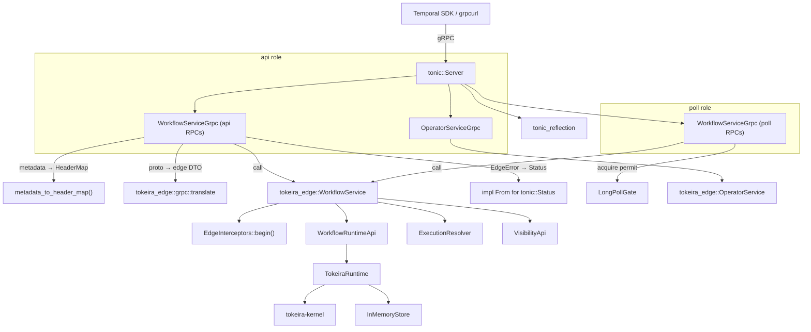
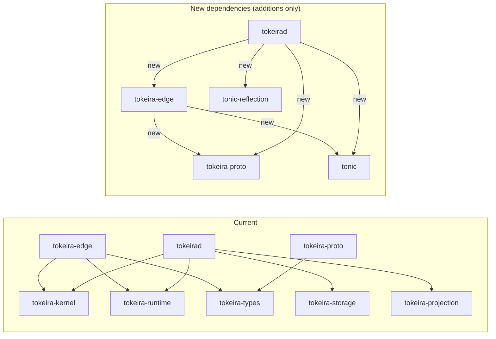

# Design Document: gRPC Edge Transport

## Overview

This design adds a Temporal-compatible gRPC transport layer to Tokeira by implementing tonic `Service` trait adapters that bridge the existing `tokeira-edge` service layer to the `tokeira-proto` generated gRPC bindings. The architecture follows a thin-adapter pattern: each tonic service trait implementation delegates entirely to the existing edge services after translating between proto wire types and edge DTOs.

The design introduces two new modules:

1. **`tokeira-edge::grpc`** — tonic service trait implementations (`WorkflowServiceGrpc`, `OperatorServiceGrpc`), proto↔edge DTO translation, metadata extraction, error mapping, and `RuntimeAdapter`.
2. **`tokeirad` server bootstrap** — constructs `InMemoryStore`, `TokeiraRuntime`, edge services, gRPC adapters, enables reflection, and binds to a configurable address. Process-level assembly lives here, not in the edge crate.

All proto↔edge conversion lives in `tokeira-edge::grpc::translate`, not in `tokeira-proto`. This avoids a dependency cycle: `tokeira-edge` depends on `tokeira-proto` (for generated types), and the conversion code imports both proto types and edge DTOs from within the same crate.

The key design decision is that the gRPC adapters contain zero business logic. They perform three operations per RPC: (1) extract gRPC metadata into `http::HeaderMap`, (2) translate proto request → edge DTO, (3) call the edge service method, (4) translate edge result → proto response or `tonic::Status`. This keeps the existing edge interceptor pipeline (request ID, auth, namespace resolution, authz, long-poll gating) fully in control.

## Edge Boundary Philosophy

### API vs Poll Traffic Classes

The public API surface served by `tokeira-edge` contains two fundamentally different traffic classes that shape deployment, resource management, and backpressure strategy:

**`api` traffic** — ordinary request/response operations: `StartWorkflowExecution`, `SignalWorkflowExecution`, `RespondWorkflowTaskCompleted`, `DescribeWorkflowExecution`, `ListWorkflowExecutions`, `CountWorkflowExecutions`, operator RPCs, and health checks. Pressure profile: CPU for translation/validation, short-lived runtime calls, bounded latency.

**`poll` traffic** — long-lived waiter registrations: `PollWorkflowTaskQueue` (and later `PollActivityTaskQueue`). Pressure profile: open sockets, memory-resident waiter objects, deadline timers, bursty fan-in from many workers, huge concurrency with comparatively low useful work per connection.

### Deployment Role Separation

`tokeira-edge` is one crate but supports two logical deployment roles:

- **`edge-api`** — serves `api` traffic only. Scales on CPU and request throughput.
- **`edge-poll`** — serves `poll` traffic only. Scales on open connections and memory.

The server bootstrap in `tokeirad` is structured so these roles can be constructed independently from the same building blocks. For the initial implementation, `tokeirad` runs both roles in a single process (**Shape A**), but the code makes it straightforward to split them into separate processes later (**Shape B**).

```
Shape A (initial): single tokeirad process
  ┌─────────────────────────────────────┐
  │  tokeirad                           │
  │  ├─ WorkflowServiceGrpc (api+poll)  │
  │  ├─ OperatorServiceGrpc (api)       │
  │  └─ tonic_reflection               │
  └─────────────────────────────────────┘

Shape B (future): split processes
  ┌──────────────────────┐  ┌──────────────────────┐
  │  tokeirad --role api │  │  tokeirad --role poll │
  │  ├─ api RPCs         │  │  └─ poll RPCs         │
  │  ├─ operator RPCs    │  └──────────────────────┘
  │  └─ reflection       │
  └──────────────────────┘
```

### What Edge Explicitly Does Not Own

The edge layer may reject, throttle, route, translate, authenticate, and observe. It may **not** decide workflow semantics. The design rule: if a proposed change affects workflow history or durable task meaning, it belongs below Edge.

Edge does **not** own:
- workflow ordering
- timer semantics
- signal semantics
- retry or dedupe correctness
- task durability
- sticky correctness
- archival
- visibility indexing
- request replay semantics
- DSQL connection management

#### Responsibility Boundary Table

| Concern | Edge? | Why |
|---------|-------|-----|
| Request IDs | Yes | request-scoped concern |
| Authn/Authz | Yes | public boundary concern |
| Namespace resolution | Yes | request admission concern |
| Poll gating | Yes | protects deeper layers |
| External-to-internal translation | Yes | API shell concern |
| Workflow history ordering | No | kernel/runtime concern |
| Durable task creation | No | runtime/storage concern |
| Request dedupe semantics | No | storage/kernel concern |
| Sticky correctness | No | runtime/broker concern |
| Visibility indexing | No | projection concern |
| DSQL session management | No | storage concern |

This boundary is already reflected in the existing codebase: `tokeira-edge/src/lib.rs` states *"if a change would alter workflow history ordering, retry semantics, timer behavior, or task durability, that change almost certainly belongs in tokeira-kernel, tokeira-runtime, or tokeira-storage instead."*

### Poll Invariants

The gRPC transport must preserve these invariants for poll traffic:

1. **No durable state allocation**: A waiting poll should not allocate durable state. The `LongPollGate` semaphore and the in-memory `InMemoryBroker` waiter are the only resources consumed.
2. **No DSQL session pinning**: A waiting poll should not pin a DSQL session. Poll waiters live entirely in the edge/broker memory layer.
3. **Client-disconnect cancellability**: A waiting poll should be cancellable by client disconnect. When tonic detects a dropped connection, the poll future is dropped, releasing the `LongPollPermit`.
4. **Visible backpressure**: Poll overload should be visible and backpressured at Edge. The `LongPollGate` exposes `available_permits()` for metrics, and exhaustion produces `EdgeError::TooManyLongPolls` → `RESOURCE_EXHAUSTED`.
5. **Blast-radius isolation**: A runtime/broker stall should not collapse the entire public API fleet. Because `api` and `poll` traffic have separate pressure profiles, the role separation (even within a single process) ensures that poll backpressure does not starve `api` request handling.

These invariants inform how `WorkflowServiceGrpc` handles `poll_workflow_task_queue` differently from other RPCs — it acquires a `LongPollPermit` before entering the broker wait, and the permit is released on drop (timeout, task delivery, or client disconnect).

## Architecture



### Request Flow

```
gRPC request
  → tonic extracts proto message + metadata
  → adapter converts metadata → http::HeaderMap
  → adapter converts proto request → edge DTO (via tokeira_edge::grpc::translate)
  → adapter calls edge service method (interceptors, routing, long-poll gate all fire)
  → edge returns EdgeResult<EdgeDTO>
  → adapter converts edge DTO → proto response (via tokeira_edge::grpc::translate)
  → OR adapter converts EdgeError → tonic::Status
  → tonic sends gRPC response
```

### Dependency Changes



Concrete Cargo.toml changes:
- `tokeira-edge/Cargo.toml`: add `tokeira-proto = { path = "../tokeira-proto" }` and `tonic = { version = "0.11", features = ["transport"] }`
- `tokeirad/Cargo.toml`: add `tokeira-edge`, `tokeira-proto`, `tonic`, `tonic-reflection`
- Workspace `Cargo.toml`: add `tonic` and `tonic-reflection` to `[workspace.dependencies]`

## Components and Interfaces

### 1. gRPC Metadata Extraction (`tokeira-edge::grpc::metadata`)

```rust
/// Convert tonic request metadata into http::HeaderMap.
///
/// tonic::MetadataMap is backed by http::HeaderMap internally, so this
/// is a zero-cost or near-zero-cost conversion. The function iterates
/// metadata entries and inserts them into a fresh HeaderMap.
pub fn metadata_to_header_map(metadata: &tonic::metadata::MetadataMap) -> http::HeaderMap;
```

This function preserves all metadata entries including `x-request-id`, `authorization`, and any custom headers. The existing `EdgeInterceptors::begin()` already reads from `http::HeaderMap`, so no changes are needed in the interceptor pipeline.

### 2. EdgeError → tonic::Status Mapping (`tokeira-edge::grpc::errors`)

```rust
impl From<EdgeError> for tonic::Status {
    fn from(err: EdgeError) -> Self {
        match &err {
            EdgeError::BadRequest(msg) => Status::invalid_argument(msg),
            EdgeError::Unauthorized(msg) => Status::unauthenticated(msg),
            EdgeError::Forbidden { .. } => Status::permission_denied(err.to_string()),
            EdgeError::NamespaceNotFound(_) => Status::not_found(err.to_string()),
            EdgeError::NamespaceDeleted(_) => Status::failed_precondition(err.to_string()),
            EdgeError::WorkflowNotFound { .. } => Status::not_found(err.to_string()),
            EdgeError::TooManyLongPolls => Status::resource_exhausted(err.to_string()),
            EdgeError::LongPollAdmissionTimeout => Status::deadline_exceeded(err.to_string()),
            EdgeError::RemoteRouteUnsupported { .. } => Status::unavailable(err.to_string()),
            EdgeError::Internal(msg) => Status::internal(msg),
        }
    }
}
```

### 3. WorkflowServiceGrpc Adapter (`tokeira-edge::grpc::workflow_service`)

```rust
pub struct WorkflowServiceGrpc {
    inner: WorkflowService,
}

#[tonic::async_trait]
impl workflowservice::workflow_service_server::WorkflowService for WorkflowServiceGrpc {
    async fn start_workflow_execution(
        &self,
        request: Request<StartWorkflowExecutionRequest>,
    ) -> Result<Response<StartWorkflowExecutionResponse>, Status>;

    async fn signal_workflow_execution(/* ... */) -> Result<Response<...>, Status>;
    async fn poll_workflow_task_queue(/* ... */) -> Result<Response<...>, Status>;
    async fn respond_workflow_task_completed(/* ... */) -> Result<Response<...>, Status>;
    async fn describe_workflow_execution(/* ... */) -> Result<Response<...>, Status>;
    async fn list_workflow_executions(/* ... */) -> Result<Response<...>, Status>;
    async fn count_workflow_executions(/* ... */) -> Result<Response<...>, Status>;
}
```

Each method follows the same pattern:
1. `let headers = metadata_to_header_map(request.metadata());`
2. `let edge_req = proto_to_edge_dto(request.into_inner())?;`
3. `let edge_resp = self.inner.method(&headers, edge_req).await?;` (the `?` uses `From<EdgeError> for Status`)
4. `Ok(Response::new(edge_to_proto_dto(edge_resp)))`

For `poll_workflow_task_queue`, the edge service returns `Option<PollWorkflowTaskQueueResponse>`. When `None` (timeout expired, no task), the adapter returns a default empty proto response.

### 4. OperatorServiceGrpc Adapter (`tokeira-edge::grpc::operator_service`)

```rust
pub struct OperatorServiceGrpc {
    inner: OperatorService,
}

#[tonic::async_trait]
impl operatorservice::operator_service_server::OperatorService for OperatorServiceGrpc {
    async fn get_cluster_info(/* ... */) -> Result<Response<GetClusterInfoResponse>, Status>;
    async fn add_search_attributes(/* ... */) -> Result<Response<AddSearchAttributesResponse>, Status>;
    async fn list_search_attributes(/* ... */) -> Result<Response<ListSearchAttributesResponse>, Status>;
}
```

### 5. Health via OperatorService

Health is served through `OperatorServiceGrpc::get_cluster_info`, which already calls `OperatorService::cluster_info` and can include serving status. There is no separate `HealthServiceGrpc` adapter or `grpc.health.v1.Health` proto in the initial implementation. The existing `HealthService` and `HealthReporter` remain available for future use (e.g., load balancer health checks via a dedicated endpoint), but the gRPC transport does not register a separate health service in this milestone.

### 6. Proto-to-Edge Translation (`tokeira-edge::grpc::translate`)

New module in `tokeira-edge` (not `tokeira-proto`, to avoid a dependency cycle) with bidirectional conversion functions. This module can import both proto types (via `tokeira-proto`) and edge DTOs (from `crate::translate`) without any circular dependency.

```rust
// Proto → Edge DTO
pub fn start_request_to_edge(req: workflowservice::StartWorkflowExecutionRequest)
    -> Result<translate::StartWorkflowExecutionRequest, ProtoConversionError>;

pub fn signal_request_to_edge(req: workflowservice::SignalWorkflowExecutionRequest)
    -> Result<translate::SignalWorkflowExecutionRequest, ProtoConversionError>;

pub fn poll_request_to_edge(req: workflowservice::PollWorkflowTaskQueueRequest)
    -> Result<translate::PollWorkflowTaskQueueRequest, ProtoConversionError>;

pub fn respond_completed_request_to_edge(req: workflowservice::RespondWorkflowTaskCompletedRequest)
    -> Result<translate::RespondWorkflowTaskCompletedRequest, ProtoConversionError>;

pub fn describe_request_to_edge(req: workflowservice::DescribeWorkflowExecutionRequest)
    -> Result<translate::DescribeWorkflowExecutionRequest, ProtoConversionError>;

pub fn list_request_to_edge(req: workflowservice::ListWorkflowExecutionsRequest)
    -> Result<translate::ListWorkflowExecutionsRequest, ProtoConversionError>;

pub fn count_request_to_edge(req: workflowservice::CountWorkflowExecutionsRequest)
    -> Result<translate::CountWorkflowExecutionsRequest, ProtoConversionError>;

// Edge DTO → Proto
pub fn start_response_to_proto(resp: translate::StartWorkflowExecutionResponse)
    -> workflowservice::StartWorkflowExecutionResponse;

pub fn poll_response_to_proto(resp: translate::PollWorkflowTaskQueueResponse)
    -> workflowservice::PollWorkflowTaskQueueResponse;

pub fn describe_response_to_proto(resp: translate::WorkflowExecutionDescription)
    -> workflowservice::DescribeWorkflowExecutionResponse;

pub fn list_response_to_proto(resp: translate::ListWorkflowExecutionsResponse)
    -> workflowservice::ListWorkflowExecutionsResponse;

pub fn count_response_to_proto(resp: translate::CountWorkflowExecutionsResponse)
    -> workflowservice::CountWorkflowExecutionsResponse;

// Command translation
pub fn proto_command_to_workflow_command(cmd: workflowservice::Command)
    -> Result<WorkflowCommand, ProtoConversionError>;

pub fn workflow_command_to_proto(cmd: &WorkflowCommand)
    -> Result<workflowservice::Command, ProtoConversionError>;
```

These functions own the proto/domain conversion helpers needed by the gRPC transport (payload, memo, search_attributes, task_queue conversions) instead of depending on a `tokeira-proto::conversions` surface. Because this module lives in `tokeira-edge`, it can freely import both `tokeira_proto::workflowservice` types and `crate::translate` DTOs without creating a crate cycle.

### 7. RuntimeAdapter (`tokeira-edge::grpc::runtime_adapter`)

Bridges `TokeiraRuntime<R>` to the `WorkflowRuntimeApi` trait:

```rust
pub struct RuntimeAdapter<R> {
    runtime: Arc<TokeiraRuntime<R>>,
}

#[async_trait]
impl<R: RunRepository + 'static> WorkflowRuntimeApi for RuntimeAdapter<R> {
    async fn start_workflow(&self, req: StartRequest) -> Result<WorkflowMutationOutcome> {
        let result = self.runtime.start_workflow(req).await?;
        commit_result_to_outcome(result)
    }
    // ... similar for signal, poll, complete
}

fn commit_result_to_outcome(result: CommitResult) -> Result<WorkflowMutationOutcome> {
    match result {
        CommitResult::Applied { new_state } => Ok(WorkflowMutationOutcome {
            transition_seq: new_state.transition_seq.0,
            last_event_id: new_state.last_event_id,
            was_duplicate: false,
        }),
        CommitResult::Duplicate => Ok(WorkflowMutationOutcome {
            transition_seq: 0,
            last_event_id: 0,
            was_duplicate: true,
        }),
        CommitResult::Conflict { reason } => Err(anyhow::anyhow!("conflict: {reason}")),
    }
}
```

**Scope note on poll response**: The current `StartedWorkflowTask` exposes `run_key`, `workflow_id`, `task_queue`, and `token` (which contains `started_event_id` and `attempt`). The poll response will populate task token bytes, workflow execution identity, started event ID, and attempt from these fields. History serialization in the poll response (Requirement 6.4) is deferred to a follow-up — the runtime does not yet expose a history-reading API through the poll path. The initial implementation returns an empty history in `PollWorkflowTaskQueueResponse`.
```

### 8. Storage-backed ExecutionResolver

The edge layer already treats execution lookup as a separate concern via the `ExecutionResolver` trait. For this transport, the resolver must be backed by storage/runtime state rather than by a second in-memory registry.

```rust
pub struct StoreExecutionResolver<S> {
    store: Arc<S>,
}

#[async_trait]
impl<S: RunRepository + VisibilityReader + Send + Sync + 'static> ExecutionResolver
    for StoreExecutionResolver<S>
{
    async fn current_run_key(
        &self,
        namespace: &NamespaceId,
        workflow_id: &WorkflowId,
    ) -> Result<Option<RunKey>, EdgeError>;

    async fn describe_execution(
        &self,
        execution: &ExecutionRef,
    ) -> Result<Option<WorkflowExecutionDescription>, EdgeError>;
}
```

`current_run_key` delegates to the store's authoritative current-run mapping, and `describe_execution` delegates to the store's execution summary/read-model APIs. This keeps `StartWorkflowExecution`, `DescribeWorkflowExecution`, and `SignalWorkflowExecution` on one source of truth and avoids bootstrap-only state that can drift from the committed runtime state.

### 9. Server Bootstrap (`tokeirad::main`)

Process-level assembly belongs in `tokeirad`, not in the edge crate. The edge crate provides gRPC adapter structs and the `RuntimeAdapter`; `tokeirad` constructs the store, runtime, edge services, and gRPC adapters, then hands them to `tonic::Server`. This preserves the edge boundary: `tokeira-edge` stays thin and does not own runtime/storage/projection construction.

```rust
// tokeirad/src/main.rs
#[tokio::main]
async fn main() -> Result<()> {
    tracing_subscriber::fmt()
        .with_env_filter(EnvFilter::from_default_env())
        .init();

    let addr: SocketAddr = "[::1]:7233".parse()?;

    // Process-level assembly: tokeirad owns this, not tokeira-edge.
    let store = Arc::new(InMemoryStore::default());
    let runtime = Arc::new(TokeiraRuntime::new(store.clone(), 4));

    let ns_cache = Arc::new(InMemoryNamespaceCache::new());
    let interceptors = Arc::new(EdgeInterceptors::permissive(ns_cache));
    let router = Arc::new(LocalOnlyRouter);
    let runtime_adapter = Arc::new(RuntimeAdapter::new(runtime));
    let resolver = Arc::new(StoreExecutionResolver::new(store.clone()));
    let visibility = Arc::new(EmptyVisibilityApi);
    let long_polls = LongPollGate::new(LongPollConfig::default());

    let wf_service = WorkflowService::new(
        runtime_adapter, resolver, visibility,
        interceptors.clone(), long_polls, router,
    );
    let op_service = OperatorService::new(
        Arc::new(InMemoryOperatorApi::new("tokeira-local")),
        interceptors.clone(),
    );

    // gRPC adapters
    let wf_grpc = WorkflowServiceGrpc::new(wf_service);
    let op_grpc = OperatorServiceGrpc::new(op_service);

    // Reflection
    let reflection = tonic_reflection::server::Builder::configure()
        .register_encoded_file_descriptor_set(
            tokeira_proto::public::FILE_DESCRIPTOR_SET,
        )
        .build()?;

    info!("tokeirad gRPC server listening on {addr}");

    Server::builder()
        .add_service(wf_grpc.into_service())
        .add_service(op_grpc.into_service())
        .add_service(reflection)
        .serve(addr)
        .await?;

    Ok(())
}
```

To split into Shape B later, `tokeirad` would accept a `--role` flag and construct two `Server` instances on different ports with different service subsets. The edge services, interceptors, runtime adapter, and storage-backed resolver are shared via `Arc`.


## Data Models

### Proto-to-Edge DTO Mapping

The translation layer maps between proto wire types and the existing edge DTOs defined in `tokeira_edge::translate`. The key mappings:

| Proto Type | Edge DTO | Key Conversions |
|---|---|---|
| `workflowservice::StartWorkflowExecutionRequest` | `translate::StartWorkflowExecutionRequest` | `task_queue.name` → string, `input` via `payloads_to_domain`, `memo` via `memo_to_domain`, `search_attributes` via `search_attributes_to_domain` |
| `workflowservice::StartWorkflowExecutionResponse` | `translate::StartWorkflowExecutionResponse` | `run_id` → `RunId.to_string()` |
| `workflowservice::SignalWorkflowExecutionRequest` | `translate::SignalWorkflowExecutionRequest` | `input` via `payloads_to_domain` |
| `workflowservice::PollWorkflowTaskQueueRequest` | `translate::PollWorkflowTaskQueueRequest` | `task_queue.name` → string, default timeout 60s, default sticky_ttl 30s |
| `workflowservice::PollWorkflowTaskQueueResponse` | `translate::PollWorkflowTaskQueueResponse` | `task_token` bytes pass-through, `workflow_execution` constructed from payload |
| `workflowservice::RespondWorkflowTaskCompletedRequest` | `translate::RespondWorkflowTaskCompletedRequest` | Each `Command` → `WorkflowCommand` variant |
| `workflowservice::Command` | `WorkflowCommand` | `schedule_activity` → `ScheduleActivity`, `start_timer` → `StartTimer`, `complete_workflow` → `CompleteWorkflow`, `fail_workflow` → `FailWorkflow`, `upsert_search_attributes` → `UpsertSearchAttributes`, `upsert_memo` → `UpsertMemo` |
| `workflowservice::DescribeWorkflowExecutionRequest` | `translate::DescribeWorkflowExecutionRequest` | Direct field mapping |
| `workflowservice::DescribeWorkflowExecutionResponse` | `translate::WorkflowExecutionDescription` | Wrapped in `WorkflowExecutionInfo` proto |
| `workflowservice::ListWorkflowExecutionsRequest` | `translate::ListWorkflowExecutionsRequest` | `page_size` i32 → usize, `next_page_token` bytes → Option<String> |
| `workflowservice::CountWorkflowExecutionsRequest` | `translate::CountWorkflowExecutionsRequest` | `group_by` repeated → `Option<String>` (first element) |
| `operatorservice::GetClusterInfoResponse` | `OperatorService::ClusterInfo` | Direct field mapping |
| `operatorservice::AddSearchAttributesRequest` | Multiple `upsert_search_attribute` calls | Iterate `custom_attributes` map, convert `IndexedValueType` → attr_type string |
| `operatorservice::ListSearchAttributesResponse` | `Vec<SearchAttributeDefinition>` | Split into system/custom maps |

### EdgeError → gRPC Status Code Mapping

| EdgeError Variant | gRPC Status Code | Rationale |
|---|---|---|
| `BadRequest` | `INVALID_ARGUMENT` | Client sent malformed request |
| `Unauthorized` | `UNAUTHENTICATED` | Missing or invalid credentials |
| `Forbidden` | `PERMISSION_DENIED` | Valid credentials, insufficient permissions |
| `NamespaceNotFound` | `NOT_FOUND` | Requested namespace does not exist |
| `WorkflowNotFound` | `NOT_FOUND` | Requested workflow does not exist |
| `NamespaceDeleted` | `FAILED_PRECONDITION` | Namespace exists but is soft-deleted |
| `TooManyLongPolls` | `RESOURCE_EXHAUSTED` | Semaphore full, SDK should back off |
| `LongPollAdmissionTimeout` | `DEADLINE_EXCEEDED` | Timed out waiting for admission |
| `RemoteRouteUnsupported` | `UNAVAILABLE` | Routing target not reachable |
| `Internal` | `INTERNAL` | Unexpected server error |

### Default Values for Poll Requests

The proto `PollWorkflowTaskQueueRequest` does not carry explicit timeout or sticky TTL fields. The adapter applies sensible defaults:

- `timeout`: 60 seconds (standard Temporal long-poll duration)
- `sticky_ttl`: 30 seconds
- `sticky_run`: `None` (sticky execution not yet wired)

### gRPC Reflection Configuration

The server registers `tokeira_proto::public::FILE_DESCRIPTOR_SET` with `tonic-reflection`. This enables `grpcurl` and similar tools to discover:
- `temporal.api.workflowservice.v1.WorkflowService` with all 7 RPCs
- `temporal.api.operatorservice.v1.OperatorService` with 3 RPCs
- All message types and enums


## Correctness Properties

*A property is a characteristic or behavior that should hold true across all valid executions of a system — essentially, a formal statement about what the system should do. Properties serve as the bridge between human-readable specifications and machine-verifiable correctness guarantees.*

### Property 1: Proto-to-edge DTO round-trip

*For any* valid edge DTO (StartWorkflowExecutionRequest, StartWorkflowExecutionResponse, SignalWorkflowExecutionRequest, PollWorkflowTaskQueueRequest, PollWorkflowTaskQueueResponse, RespondWorkflowTaskCompletedRequest, DescribeWorkflowExecutionRequest, WorkflowExecutionDescription, ListWorkflowExecutionsRequest, ListWorkflowExecutionsResponse, CountWorkflowExecutionsRequest, CountWorkflowExecutionsResponse), converting the edge DTO to its proto wire type and then converting back to the edge DTO should produce a value equivalent to the original.

**Validates: Requirements 1.1, 1.2, 1.3, 1.4, 1.5, 1.6, 1.7, 6.1, 6.2, 6.3, 6.4, 6.5, 6.8**

### Property 2: WorkflowCommand round-trip

*For any* valid `WorkflowCommand` variant (ScheduleActivity, StartTimer, CompleteWorkflow, FailWorkflow, UpsertSearchAttributes, UpsertMemo), converting to a proto `Command` message and back to a `WorkflowCommand` should produce an equivalent value.

**Validates: Requirements 6.5, 6.6**

### Property 3: EdgeError to gRPC status code mapping

*For any* `EdgeError` variant, converting to `tonic::Status` should produce the correct gRPC status code: BadRequest → INVALID_ARGUMENT, Unauthorized → UNAUTHENTICATED, Forbidden → PERMISSION_DENIED, NamespaceNotFound → NOT_FOUND, WorkflowNotFound → NOT_FOUND, NamespaceDeleted → FAILED_PRECONDITION, TooManyLongPolls → RESOURCE_EXHAUSTED, LongPollAdmissionTimeout → DEADLINE_EXCEEDED, Internal → INTERNAL. Additionally, the error message from the EdgeError should be preserved in the Status message.

**Validates: Requirements 3.1, 3.2, 3.3, 3.4, 3.5, 3.6, 3.7, 3.8**

### Property 4: gRPC metadata to HeaderMap preservation

*For any* set of ASCII metadata key-value pairs inserted into a `tonic::metadata::MetadataMap`, converting to `http::HeaderMap` via `metadata_to_header_map` should preserve every key-value pair such that looking up each key in the resulting HeaderMap returns the original value.

**Validates: Requirements 4.1, 4.2, 4.3**

## Error Handling

### gRPC Layer Errors

The gRPC adapter layer handles errors at two levels:

1. **Proto conversion errors** (`ProtoConversionError`): These occur during request translation (e.g., missing required fields, invalid UUIDs, unrecognized command variants). They are mapped to `tonic::Status::invalid_argument()` since they indicate a malformed client request.

2. **Edge service errors** (`EdgeError`): These occur during business logic execution. They are mapped to appropriate gRPC status codes via the `From<EdgeError> for tonic::Status` implementation described in the Components section.

### Error Propagation Chain

```
Proto conversion failure → Status::invalid_argument("missing field: ...")
EdgeError::BadRequest    → Status::invalid_argument(msg)
EdgeError::Unauthorized  → Status::unauthenticated(msg)
EdgeError::Forbidden     → Status::permission_denied(msg)
EdgeError::*NotFound     → Status::not_found(msg)
EdgeError::*Deleted      → Status::failed_precondition(msg)
EdgeError::TooManyLongPolls → Status::resource_exhausted(msg)
EdgeError::LongPollAdmissionTimeout → Status::deadline_exceeded(msg)
EdgeError::Internal      → Status::internal(msg)
anyhow::Error (unexpected) → Status::internal("internal error")
```

### Long-Poll Error Behavior

Long-poll handling is governed by the poll invariants defined in the Edge Boundary Philosophy section. The key design consequence: `poll_workflow_task_queue` is the only RPC that acquires a `LongPollPermit`, and the permit is released on drop — whether the poll completes with a task, times out, or the client disconnects. This ensures invariants 1–3 (no durable state, no DSQL session, client-disconnect cancellability) are structurally enforced.

When `PollWorkflowTaskQueue` times out without a task, this is NOT an error. The adapter returns a default empty `PollWorkflowTaskQueueResponse` (all fields at zero/empty values). This matches Temporal SDK expectations where an empty poll response triggers the SDK to re-poll.

When the `LongPollGate` semaphore is exhausted, the edge service returns `EdgeError::TooManyLongPolls`, which the adapter maps to `RESOURCE_EXHAUSTED`. SDKs should interpret this as a backoff signal. This implements invariant 4 (visible backpressure). The `LongPollGate::available_permits()` method should be exported as a metric so operators can observe poll pressure and trigger scaling decisions for the poll role.

Invariant 5 (blast-radius isolation) is addressed by the api/poll role separation. Even in Shape A (single process), the `LongPollGate` bounds poll concurrency independently of api request handling. In Shape B, poll overload on the poll fleet cannot affect the api fleet at all.

### Command Translation Errors

If a proto `Command` message has `attributes: None` (no oneof variant set), the translation returns `ProtoConversionError::MissingField("Command.attributes")`. The adapter maps this to `Status::invalid_argument`.

## Testing Strategy

### Property-Based Testing

Property-based tests use the `proptest` crate (Rust's standard PBT library) with a minimum of 100 iterations per property. Each test is tagged with a comment referencing the design property.

**Property tests to implement:**

1. **DTO round-trip** (Property 1): Generate arbitrary edge DTOs using proptest `Arbitrary` implementations, convert to proto and back, assert equality. This requires implementing `Arbitrary` for the edge translate DTOs or writing custom proptest strategies.
   - Tag: `// Feature: grpc-edge-transport, Property 1: Proto-to-edge DTO round-trip`

2. **WorkflowCommand round-trip** (Property 2): Generate arbitrary `WorkflowCommand` variants, convert to proto `Command` and back, assert equality.
   - Tag: `// Feature: grpc-edge-transport, Property 2: WorkflowCommand round-trip`

3. **Error mapping** (Property 3): Generate arbitrary `EdgeError` variants with random message strings, convert to `tonic::Status`, assert the status code matches the expected mapping and the message is preserved.
   - Tag: `// Feature: grpc-edge-transport, Property 3: EdgeError to gRPC status code mapping`

4. **Metadata preservation** (Property 4): Generate arbitrary sets of ASCII key-value pairs, insert into `MetadataMap`, convert to `HeaderMap`, assert all pairs are present.
   - Tag: `// Feature: grpc-edge-transport, Property 4: gRPC metadata to HeaderMap preservation`

### Unit Tests

Unit tests complement property tests by covering specific examples and edge cases:

- **Empty poll response**: Verify that when the edge service returns `None` for a poll, the adapter returns a default empty proto response.
- **Command with no attributes**: Verify that a proto `Command` with `attributes: None` returns `ProtoConversionError::MissingField`.
- **Server bind failure**: Verify that binding to an already-occupied port returns a descriptive error.
- **Specific metadata keys**: Verify `x-request-id` and `authorization` headers are preserved through the metadata extraction.
- **Default poll timeout**: Verify that the adapter applies 60s timeout and 30s sticky TTL defaults.
- **ClusterInfo response**: Verify the GetClusterInfo adapter correctly maps cluster_name and server_version fields.
- **AddSearchAttributes iteration**: Verify that a request with multiple attributes results in multiple `upsert_search_attribute` calls.

### Integration Tests

A small integration test in `tokeirad` or `tests/` that:
1. Boots the full server stack with `InMemoryStore`
2. Connects a tonic client
3. Calls `StartWorkflowExecution` and verifies a `run_id` is returned
4. Calls `DescribeWorkflowExecution` and verifies the workflow exists
5. Uses `grpcurl`-style reflection to list available services

### Test Configuration

```toml
[dev-dependencies]
proptest = "1"
tonic = { version = "0.11", features = ["transport"] }
tokio = { version = "1", features = ["macros", "rt-multi-thread"] }
```

Each property-based test runs with `proptest::test_runner::Config { cases: 100, .. }` minimum.
