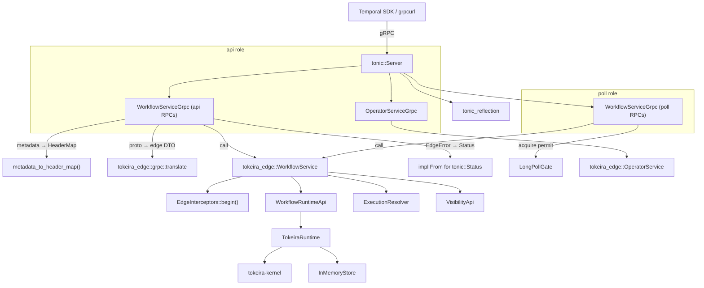
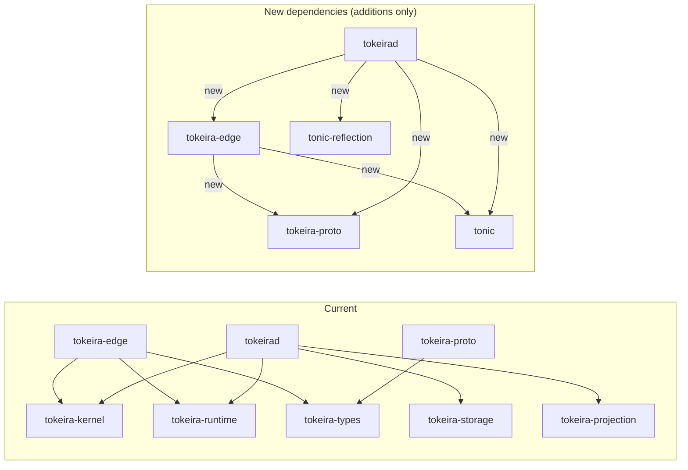

# Design Document: gRPC Edge Transport

## Overview

This design adds a Temporal-compatible gRPC transport layer to Tokeira by implementing tonic `Service` trait adapters that bridge the existing `tokeira-edge` service layer to the `tokeira-proto` generated gRPC bindings. The architecture follows a thin-adapter pattern: each tonic service trait implementation delegates entirely to the existing edge services after translating between proto wire types and edge DTOs.

The design introduces two new modules:

1. **`tokeira-edge::grpc`** — tonic service trait implementations (`WorkflowServiceGrpc`, `OperatorServiceGrpc`), proto↔edge DTO translation, metadata extraction, error mapping, and `RuntimeAdapter`.
2. **`tokeirad` server bootstrap** — constructs `InMemoryStore`, `TokeiraRuntime`, edge services, gRPC adapters, enables reflection, and binds to a configurable address. Process-level assembly lives here, not in the edge crate.

All proto↔edge conversion lives in `tokeira-edge::grpc::translate`, not in `tokeira-proto`. This avoids a dependency cycle: `tokeira-edge` depends on `tokeira-proto` (for generated types), and the conversion code imports both proto types and edge DTOs from within the same crate.

The key design decision is that the gRPC adapters contain zero business logic. They perform three operations per RPC: (1) extract gRPC metadata into `http::HeaderMap`, (2) translate proto request → edge DTO, (3) call the edge service method, (4) translate edge result → proto response or `tonic::Status`. This keeps the existing edge interceptor pipeline (request ID, auth, namespace resolution, authz, long-poll gating) fully in control.

## Edge Boundary Philosophy

### API vs Poll Traffic Classes

The public API surface served by `tokeira-edge` contains two fundamentally different traffic classes that shape deployment, resource management, and backpressure strategy:

**`api` traffic** — ordinary request/response operations: `StartWorkflowExecution`, `SignalWorkflowExecution`, `RespondWorkflowTaskCompleted`, `DescribeWorkflowExecution`, `ListWorkflowExecutions`, `CountWorkflowExecutions`, operator RPCs, and health checks. Pressure profile: CPU for translation/validation, short-lived runtime calls, bounded latency.

**`poll` traffic** — long-lived waiter registrations: `PollWorkflowTaskQueue` (and later `PollActivityTaskQueue`). Pressure profile: open sockets, memory-resident waiter objects, deadline timers, bursty fan-in from many workers, huge concurrency with comparatively low useful work per connection.

### Deployment Role Separation

`tokeira-edge` is one crate but supports two logical deployment roles:

- **`edge-api`** — serves `api` traffic only. Scales on CPU and request throughput.
- **`edge-poll`** — serves `poll` traffic only. Scales on open connections and memory.

The server bootstrap in `tokeirad` is structured so these roles can be constructed independently from the same building blocks. For the initial implementation, `tokeirad` runs both roles in a single process (**Shape A**), but the code makes it straightforward to split them into separate processes later (**Shape B**).

```
Shape A (initial): single tokeirad process
  ┌─────────────────────────────────────┐
  │  tokeirad                           │
  │  ├─ WorkflowServiceGrpc (api+poll)  │
  │  ├─ OperatorServiceGrpc (api)       │
  │  └─ tonic_reflection               │
  └─────────────────────────────────────┘

Shape B (future): split processes
  ┌──────────────────────┐  ┌──────────────────────┐
  │  tokeirad --role api │  │  tokeirad --role poll │
  │  ├─ api RPCs         │  │  └─ poll RPCs         │
  │  ├─ operator RPCs    │  └──────────────────────┘
  │  └─ reflection       │
  └──────────────────────┘
```

### What Edge Explicitly Does Not Own

The edge layer may reject, throttle, route, translate, authenticate, and observe. It may **not** decide workflow semantics. The design rule: if a proposed change affects workflow history or durable task meaning, it belongs below Edge.

Edge does **not** own:
- workflow ordering
- timer semantics
- signal semantics
- retry or dedupe correctness
- task durability
- sticky correctness
- archival
- visibility indexing
- request replay semantics
- DSQL connection management

#### Responsibility Boundary Table

| Concern | Edge? | Why |
|---------|-------|-----|
| Request IDs | Yes | request-scoped concern |
| Authn/Authz | Yes | public boundary concern |
| Namespace resolution | Yes | request admission concern |
| Poll gating | Yes | protects deeper layers |
| External-to-internal translation | Yes | API shell concern |
| Workflow history ordering | No | kernel/runtime concern |
| Durable task creation | No | runtime/storage concern |
| Request dedupe semantics | No | storage/kernel concern |
| Sticky correctness | No | runtime/broker concern |
| Visibility indexing | No | projection concern |
| DSQL session management | No | storage concern |

This boundary is already reflected in the existing codebase: `tokeira-edge/src/lib.rs` states *"if a change would alter workflow history ordering, retry semantics, timer behavior, or task durability, that change almost certainly belongs in tokeira-kernel, tokeira-runtime, or tokeira-storage instead."*

### Poll Invariants

The gRPC transport must preserve these invariants for poll traffic:

1. **No durable state allocation**: A waiting poll should not allocate durable state. The `LongPollGate` semaphore and the in-memory `InMemoryBroker` waiter are the only resources consumed.
2. **No DSQL session pinning**: A waiting poll should not pin a DSQL session. Poll waiters live entirely in the edge/broker memory layer.
3. **Client-disconnect cancellability**: A waiting poll should be cancellable by client disconnect. When tonic detects a dropped connection, the poll future is dropped, releasing the `LongPollPermit`.
4. **Visible backpressure**: Poll overload should be visible and backpressured at Edge. The `LongPollGate` exposes `available_permits()` for metrics, and exhaustion produces `EdgeError::TooManyLongPolls` → `RESOURCE_EXHAUSTED`.
5. **Blast-radius isolation**: A runtime/broker stall should not collapse the entire public API fleet. Because `api` and `poll` traffic have separate pressure profiles, the role separation (even within a single process) ensures that poll backpressure does not starve `api` request handling.

These invariants inform how `WorkflowServiceGrpc` handles `poll_workflow_task_queue` differently from other RPCs — it acquires a `LongPollPermit` before entering the broker wait, and the permit is released on drop (timeout, task delivery, or client disconnect).

## Architecture



### Request Flow

```
gRPC request
  → tonic extracts proto message + metadata
  → adapter converts metadata → http::HeaderMap
  → adapter converts proto request → edge DTO (via tokeira_edge::grpc::translate)
  → adapter calls edge service method (interceptors, routing, long-poll gate all fire)
  → edge returns EdgeResult<EdgeDTO>
  → adapter converts edge DTO → proto response (via tokeira_edge::grpc::translate)
  → OR adapter converts EdgeError → tonic::Status
  → tonic sends gRPC response
```

### Dependency Changes



Concrete Cargo.toml changes:
- `tokeira-edge/Cargo.toml`: add `tokeira-proto = { path = "../tokeira-proto" }` and `tonic = { version = "0.11", features = ["transport"] }`
- `tokeirad/Cargo.toml`: add `tokeira-edge`, `tokeira-proto`, `tonic`, `tonic-reflection`
- Workspace `Cargo.toml`: add `tonic` and `tonic-reflection` to `[workspace.dependencies]`

## Components and Interfaces

### 1. gRPC Metadata Extraction (`tokeira-edge::grpc::metadata`)

```rust
/// Convert tonic request metadata into http::HeaderMap.
///
/// tonic::MetadataMap is backed by http::HeaderMap internally, so this
/// is a zero-cost or near-zero-cost conversion. The function iterates
/// metadata entries and inserts them into a fresh HeaderMap.
pub fn metadata_to_header_map(metadata: &tonic::metadata::MetadataMap) -> http::HeaderMap;
```

This function preserves all metadata entries including `x-request-id`, `authorization`, and any custom headers. The existing `EdgeInterceptors::begin()` already reads from `http::HeaderMap`, so no changes are needed in the interceptor pipeline.

### 2. EdgeError → tonic::Status Mapping (`tokeira-edge::grpc::errors`)

```rust
impl From<EdgeError> for tonic::Status {
    fn from(err: EdgeError) -> Self {
        match &err {
            EdgeError::BadRequest(msg) => Status::invalid_argument(msg),
            EdgeError::Unauthorized(msg) => Status::unauthenticated(msg),
            EdgeError::Forbidden { .. } => Status::permission_denied(err.to_string()),
            EdgeError::NamespaceNotFound(_) => Status::not_found(err.to_string()),
            EdgeError::NamespaceDeleted(_) => Status::failed_precondition(err.to_string()),
            EdgeError::WorkflowNotFound { .. } => Status::not_found(err.to_string()),
            EdgeError::TooManyLongPolls => Status::resource_exhausted(err.to_string()),
            EdgeError::LongPollAdmissionTimeout => Status::deadline_exceeded(err.to_string()),
            EdgeError::RemoteRouteUnsupported { .. } => Status::unavailable(err.to_string()),
            EdgeError::Internal(msg) => Status::internal(msg),
        }
    }
}
```

### 3. WorkflowServiceGrpc Adapter (`tokeira-edge::grpc::workflow_service`)

```rust
pub struct WorkflowServiceGrpc {
    inner: WorkflowService,
}

#[tonic::async_trait]
impl workflowservice::workflow_service_server::WorkflowService for WorkflowServiceGrpc {
    async fn start_workflow_execution(
        &self,
        request: Request<StartWorkflowExecutionRequest>,
    ) -> Result<Response<StartWorkflowExecutionResponse>, Status>;

    async fn signal_workflow_execution(/* ... */) -> Result<Response<...>, Status>;
    async fn poll_workflow_task_queue(/* ... */) -> Result<Response<...>, Status>;
    async fn respond_workflow_task_completed(/* ... */) -> Result<Response<...>, Status>;
    async fn describe_workflow_execution(/* ... */) -> Result<Response<...>, Status>;
    async fn list_workflow_executions(/* ... */) -> Result<Response<...>, Status>;
    async fn count_workflow_executions(/* ... */) -> Result<Response<...>, Status>;
}
```

Each method follows the same pattern:
1. `let headers = metadata_to_header_map(request.metadata());`
2. `let edge_req = proto_to_edge_dto(request.into_inner())?;`
3. `let edge_resp = self.inner.method(&headers, edge_req).await?;` (the `?` uses `From<EdgeError> for Status`)
4. `Ok(Response::new(edge_to_proto_dto(edge_resp)))`

For `poll_workflow_task_queue`, the edge service returns `Option<PollWorkflowTaskQueueResponse>`. When `None` (timeout expired, no task), the adapter returns a default empty proto response.

### 4. OperatorServiceGrpc Adapter (`tokeira-edge::grpc::operator_service`)

```rust
pub struct OperatorServiceGrpc {
    inner: OperatorService,
}

#[tonic::async_trait]
impl operatorservice::operator_service_server::OperatorService for OperatorServiceGrpc {
    async fn get_cluster_info(/* ... */) -> Result<Response<GetClusterInfoResponse>, Status>;
    async fn add_search_attributes(/* ... */) -> Result<Response<AddSearchAttributesResponse>, Status>;
    async fn list_search_attributes(/* ... */) -> Result<Response<ListSearchAttributesResponse>, Status>;
}
```

### 5. Health via OperatorService

Health is served through `OperatorServiceGrpc::get_cluster_info`, which already calls `OperatorService::cluster_info` and can include serving status. There is no separate `HealthServiceGrpc` adapter or `grpc.health.v1.Health` proto in the initial implementation. The existing `HealthService` and `HealthReporter` remain available for future use (e.g., load balancer health checks via a dedicated endpoint), but the gRPC transport does not register a separate health service in this milestone.

### 6. Proto-to-Edge Translation (`tokeira-edge::grpc::translate`)

New module in `tokeira-edge` (not `tokeira-proto`, to avoid a dependency cycle) with bidirectional conversion functions. This module can import both proto types (via `tokeira-proto`) and edge DTOs (from `crate::translate`) without any circular dependency.

```rust
// Proto → Edge DTO
pub fn start_request_to_edge(req: workflowservice::StartWorkflowExecutionRequest)
    -> Result<translate::StartWorkflowExecutionRequest, ProtoConversionError>;

pub fn signal_request_to_edge(req: workflowservice::SignalWorkflowExecutionRequest)
    -> Result<translate::SignalWorkflowExecutionRequest, ProtoConversionError>;

pub fn poll_request_to_edge(req: workflowservice::PollWorkflowTaskQueueRequest)
    -> Result<translate::PollWorkflowTaskQueueRequest, ProtoConversionError>;

pub fn respond_completed_request_to_edge(req: workflowservice::RespondWorkflowTaskCompletedRequest)
    -> Result<translate::RespondWorkflowTaskCompletedRequest, ProtoConversionError>;

pub fn describe_request_to_edge(req: workflowservice::DescribeWorkflowExecutionRequest)
    -> Result<translate::DescribeWorkflowExecutionRequest, ProtoConversionError>;

pub fn list_request_to_edge(req: workflowservice::ListWorkflowExecutionsRequest)
    -> Result<translate::ListWorkflowExecutionsRequest, ProtoConversionError>;

pub fn count_request_to_edge(req: workflowservice::CountWorkflowExecutionsRequest)
    -> Result<translate::CountWorkflowExecutionsRequest, ProtoConversionError>;

// Edge DTO → Proto
pub fn start_response_to_proto(resp: translate::StartWorkflowExecutionResponse)
    -> workflowservice::StartWorkflowExecutionResponse;

pub fn poll_response_to_proto(resp: translate::PollWorkflowTaskQueueResponse)
    -> workflowservice::PollWorkflowTaskQueueResponse;

pub fn describe_response_to_proto(resp: translate::WorkflowExecutionDescription)
    -> workflowservice::DescribeWorkflowExecutionResponse;

pub fn list_response_to_proto(resp: translate::ListWorkflowExecutionsResponse)
    -> workflowservice::ListWorkflowExecutionsResponse;

pub fn count_response_to_proto(resp: translate::CountWorkflowExecutionsResponse)
    -> workflowservice::CountWorkflowExecutionsResponse;

// Command translation
pub fn proto_command_to_workflow_command(cmd: workflowservice::Command)
    -> Result<WorkflowCommand, ProtoConversionError>;

pub fn workflow_command_to_proto(cmd: &WorkflowCommand)
    -> Result<workflowservice::Command, ProtoConversionError>;
```

These functions own the proto/domain conversion helpers needed by the gRPC transport (payload, memo, search_attributes, task_queue conversions) instead of depending on a `tokeira-proto::conversions` surface. Because this module lives in `tokeira-edge`, it can freely import both `tokeira_proto::workflowservice` types and `crate::translate` DTOs without creating a crate cycle.

### 7. RuntimeAdapter (`tokeira-edge::grpc::runtime_adapter`)

Bridges `TokeiraRuntime<R>` to the `WorkflowRuntimeApi` trait:

```rust
pub struct RuntimeAdapter<R> {
    runtime: Arc<TokeiraRuntime<R>>,
}

#[async_trait]
impl<R: RunRepository + 'static> WorkflowRuntimeApi for RuntimeAdapter<R> {
    async fn start_workflow(&self, req: StartRequest) -> Result<WorkflowMutationOutcome> {
        let result = self.runtime.start_workflow(req).await?;
        commit_result_to_outcome(result)
    }
    // ... similar for signal, poll, complete
}

fn commit_result_to_outcome(result: CommitResult) -> Result<WorkflowMutationOutcome> {
    match result {
        CommitResult::Applied { new_state } => Ok(WorkflowMutationOutcome {
            transition_seq: new_state.transition_seq.0,
            last_event_id: new_state.last_event_id,
            was_duplicate: false,
        }),
        CommitResult::Duplicate => Ok(WorkflowMutationOutcome {
            transition_seq: 0,
            last_event_id: 0,
            was_duplicate: true,
        }),
        CommitResult::Conflict { reason } => Err(anyhow::anyhow!("conflict: {reason}")),
    }
}
```

**Scope note on poll response**: The current `StartedWorkflowTask` exposes `run_key`, `workflow_id`, `task_queue`, and `token` (which contains `started_event_id` and `attempt`). The poll response will populate task token bytes, workflow execution identity, started event ID, and attempt from these fields. History serialization in the poll response (Requirement 6.4) is deferred to a follow-up — the runtime does not yet expose a history-reading API through the poll path. The initial implementation returns an empty history in `PollWorkflowTaskQueueResponse`.
```

### 8. Storage-backed ExecutionResolver

The edge layer already treats execution lookup as a separate concern via the `ExecutionResolver` trait. For this transport, the resolver must be backed by storage/runtime state rather than by a second in-memory registry.

```rust
pub struct StoreExecutionResolver<S> {
    store: Arc<S>,
}

#[async_trait]
impl<S: RunRepository + VisibilityReader + Send + Sync + 'static> ExecutionResolver
    for StoreExecutionResolver<S>
{
    async fn current_run_key(
        &self,
        namespace: &NamespaceId,
        workflow_id: &WorkflowId,
    ) -> Result<Option<RunKey>, EdgeError>;

    async fn describe_execution(
        &self,
        execution: &ExecutionRef,
    ) -> Result<Option<WorkflowExecutionDescription>, EdgeError>;
}
```

`current_run_key` delegates to the store's authoritative current-run mapping, and `describe_execution` delegates to the store's execution summary/read-model APIs. This keeps `StartWorkflowExecution`, `DescribeWorkflowExecution`, and `SignalWorkflowExecution` on one source of truth and avoids bootstrap-only state that can drift from the committed runtime state.

### 9. Server Bootstrap (`tokeirad::main`)

Process-level assembly belongs in `tokeirad`, not in the edge crate. The edge crate provides gRPC adapter structs and the `RuntimeAdapter`; `tokeirad` constructs the store, runtime, edge services, and gRPC adapters, then hands them to `tonic::Server`. This preserves the edge boundary: `tokeira-edge` stays thin and does not own runtime/storage/projection construction.

```rust
// tokeirad/src/main.rs
#[tokio::main]
async fn main() -> Result<()> {
    tracing_subscriber::fmt()
        .with_env_filter(EnvFilter::from_default_env())
        .init();

    let addr: SocketAddr = "[::1]:7233".parse()?;

    // Process-level assembly: tokeirad owns this, not tokeira-edge.
    let store = Arc::new(InMemoryStore::default());
    let runtime = Arc::new(TokeiraRuntime::new(store.clone(), 4));

    let ns_cache = Arc::new(InMemoryNamespaceCache::new());
    let interceptors = Arc::new(EdgeInterceptors::permissive(ns_cache));
    let router = Arc::new(LocalOnlyRouter);
    let runtime_adapter = Arc::new(RuntimeAdapter::new(runtime));
    let resolver = Arc::new(StoreExecutionResolver::new(store.clone()));
    let visibility = Arc::new(EmptyVisibilityApi);
    let long_polls = LongPollGate::new(LongPollConfig::default());

    let wf_service = WorkflowService::new(
        runtime_adapter, resolver, visibility,
        interceptors.clone(), long_polls, router,
    );
    let op_service = OperatorService::new(
        Arc::new(InMemoryOperatorApi::new("tokeira-local")),
        interceptors.clone(),
    );

    // gRPC adapters
    let wf_grpc = WorkflowServiceGrpc::new(wf_service);
    let op_grpc = OperatorServiceGrpc::new(op_service);

    // Reflection
    let reflection = tonic_reflection::server::Builder::configure()
        .register_encoded_file_descriptor_set(
            tokeira_proto::public::FILE_DESCRIPTOR_SET,
        )
        .build()?;

    info!("tokeirad gRPC server listening on {addr}");

    Server::builder()
        .add_service(wf_grpc.into_service())
        .add_service(op_grpc.into_service())
        .add_service(reflection)
        .serve(addr)
        .await?;

    Ok(())
}
```

To split into Shape B later, `tokeirad` would accept a `--role` flag and construct two `Server` instances on different ports with different service subsets. The edge services, interceptors, runtime adapter, and storage-backed resolver are shared via `Arc`.


## Data Models

### Proto-to-Edge DTO Mapping

The translation layer maps between proto wire types and the existing edge DTOs defined in `tokeira_edge::translate`. The key mappings:

| Proto Type | Edge DTO | Key Conversions |
|---|---|---|
| `workflowservice::StartWorkflowExecutionRequest` | `translate::StartWorkflowExecutionRequest` | `task_queue.name` → string, `input` via `payloads_to_domain`, `memo` via `memo_to_domain`, `search_attributes` via `search_attributes_to_domain` |
| `workflowservice::StartWorkflowExecutionResponse` | `translate::StartWorkflowExecutionResponse` | `run_id` → `RunId.to_string()` |
| `workflowservice::SignalWorkflowExecutionRequest` | `translate::SignalWorkflowExecutionRequest` | `input` via `payloads_to_domain` |
| `workflowservice::PollWorkflowTaskQueueRequest` | `translate::PollWorkflowTaskQueueRequest` | `task_queue.name` → string, default timeout 60s, default sticky_ttl 30s |
| `workflowservice::PollWorkflowTaskQueueResponse` | `translate::PollWorkflowTaskQueueResponse` | `task_token` bytes pass-through, `workflow_execution` constructed from payload |
| `workflowservice::RespondWorkflowTaskCompletedRequest` | `translate::RespondWorkflowTaskCompletedRequest` | Each `Command` → `WorkflowCommand` variant |
| `workflowservice::Command` | `WorkflowCommand` | `schedule_activity` → `ScheduleActivity`, `start_timer` → `StartTimer`, `complete_workflow` → `CompleteWorkflow`, `fail_workflow` → `FailWorkflow`, `upsert_search_attributes` → `UpsertSearchAttributes`, `upsert_memo` → `UpsertMemo` |
| `workflowservice::DescribeWorkflowExecutionRequest` | `translate::DescribeWorkflowExecutionRequest` | Direct field mapping |
| `workflowservice::DescribeWorkflowExecutionResponse` | `translate::WorkflowExecutionDescription` | Wrapped in `WorkflowExecutionInfo` proto |
| `workflowservice::ListWorkflowExecutionsRequest` | `translate::ListWorkflowExecutionsRequest` | `page_size` i32 → usize, `next_page_token` bytes → Option<String> |
| `workflowservice::CountWorkflowExecutionsRequest` | `translate::CountWorkflowExecutionsRequest` | `group_by` repeated → `Option<String>` (first element) |
| `operatorservice::GetClusterInfoResponse` | `OperatorService::ClusterInfo` | Direct field mapping |
| `operatorservice::AddSearchAttributesRequest` | Multiple `upsert_search_attribute` calls | Iterate `custom_attributes` map, convert `IndexedValueType` → attr_type string |
| `operatorservice::ListSearchAttributesResponse` | `Vec<SearchAttributeDefinition>` | Split into system/custom maps |

### EdgeError → gRPC Status Code Mapping

| EdgeError Variant | gRPC Status Code | Rationale |
|---|---|---|
| `BadRequest` | `INVALID_ARGUMENT` | Client sent malformed request |
| `Unauthorized` | `UNAUTHENTICATED` | Missing or invalid credentials |
| `Forbidden` | `PERMISSION_DENIED` | Valid credentials, insufficient permissions |
| `NamespaceNotFound` | `NOT_FOUND` | Requested namespace does not exist |
| `WorkflowNotFound` | `NOT_FOUND` | Requested workflow does not exist |
| `NamespaceDeleted` | `FAILED_PRECONDITION` | Namespace exists but is soft-deleted |
| `TooManyLongPolls` | `RESOURCE_EXHAUSTED` | Semaphore full, SDK should back off |
| `LongPollAdmissionTimeout` | `DEADLINE_EXCEEDED` | Timed out waiting for admission |
| `RemoteRouteUnsupported` | `UNAVAILABLE` | Routing target not reachable |
| `Internal` | `INTERNAL` | Unexpected server error |

### Default Values for Poll Requests

The proto `PollWorkflowTaskQueueRequest` does not carry explicit timeout or sticky TTL fields. The adapter applies sensible defaults:

- `timeout`: 60 seconds (standard Temporal long-poll duration)
- `sticky_ttl`: 30 seconds
- `sticky_run`: `None` (sticky execution not yet wired)

### gRPC Reflection Configuration

The server registers `tokeira_proto::public::FILE_DESCRIPTOR_SET` with `tonic-reflection`. This enables `grpcurl` and similar tools to discover:
- `temporal.api.workflowservice.v1.WorkflowService` with all 7 RPCs
- `temporal.api.operatorservice.v1.OperatorService` with 3 RPCs
- All message types and enums


## Correctness Properties

*A property is a characteristic or behavior that should hold true across all valid executions of a system — essentially, a formal statement about what the system should do. Properties serve as the bridge between human-readable specifications and machine-verifiable correctness guarantees.*

### Property 1: Proto-to-edge DTO round-trip

*For any* valid edge DTO (StartWorkflowExecutionRequest, StartWorkflowExecutionResponse, SignalWorkflowExecutionRequest, PollWorkflowTaskQueueRequest, PollWorkflowTaskQueueResponse, RespondWorkflowTaskCompletedRequest, DescribeWorkflowExecutionRequest, WorkflowExecutionDescription, ListWorkflowExecutionsRequest, ListWorkflowExecutionsResponse, CountWorkflowExecutionsRequest, CountWorkflowExecutionsResponse), converting the edge DTO to its proto wire type and then converting back to the edge DTO should produce a value equivalent to the original.

**Validates: Requirements 1.1, 1.2, 1.3, 1.4, 1.5, 1.6, 1.7, 6.1, 6.2, 6.3, 6.4, 6.5, 6.8**

### Property 2: WorkflowCommand round-trip

*For any* valid `WorkflowCommand` variant (ScheduleActivity, StartTimer, CompleteWorkflow, FailWorkflow, UpsertSearchAttributes, UpsertMemo), converting to a proto `Command` message and back to a `WorkflowCommand` should produce an equivalent value.

**Validates: Requirements 6.5, 6.6**

### Property 3: EdgeError to gRPC status code mapping

*For any* `EdgeError` variant, converting to `tonic::Status` should produce the correct gRPC status code: BadRequest → INVALID_ARGUMENT, Unauthorized → UNAUTHENTICATED, Forbidden → PERMISSION_DENIED, NamespaceNotFound → NOT_FOUND, WorkflowNotFound → NOT_FOUND, NamespaceDeleted → FAILED_PRECONDITION, TooManyLongPolls → RESOURCE_EXHAUSTED, LongPollAdmissionTimeout → DEADLINE_EXCEEDED, Internal → INTERNAL. Additionally, the error message from the EdgeError should be preserved in the Status message.

**Validates: Requirements 3.1, 3.2, 3.3, 3.4, 3.5, 3.6, 3.7, 3.8**

### Property 4: gRPC metadata to HeaderMap preservation

*For any* set of ASCII metadata key-value pairs inserted into a `tonic::metadata::MetadataMap`, converting to `http::HeaderMap` via `metadata_to_header_map` should preserve every key-value pair such that looking up each key in the resulting HeaderMap returns the original value.

**Validates: Requirements 4.1, 4.2, 4.3**

## Error Handling

### gRPC Layer Errors

The gRPC adapter layer handles errors at two levels:

1. **Proto conversion errors** (`ProtoConversionError`): These occur during request translation (e.g., missing required fields, invalid UUIDs, unrecognized command variants). They are mapped to `tonic::Status::invalid_argument()` since they indicate a malformed client request.

2. **Edge service errors** (`EdgeError`): These occur during business logic execution. They are mapped to appropriate gRPC status codes via the `From<EdgeError> for tonic::Status` implementation described in the Components section.

### Error Propagation Chain

```
Proto conversion failure → Status::invalid_argument("missing field: ...")
EdgeError::BadRequest    → Status::invalid_argument(msg)
EdgeError::Unauthorized  → Status::unauthenticated(msg)
EdgeError::Forbidden     → Status::permission_denied(msg)
EdgeError::*NotFound     → Status::not_found(msg)
EdgeError::*Deleted      → Status::failed_precondition(msg)
EdgeError::TooManyLongPolls → Status::resource_exhausted(msg)
EdgeError::LongPollAdmissionTimeout → Status::deadline_exceeded(msg)
EdgeError::Internal      → Status::internal(msg)
anyhow::Error (unexpected) → Status::internal("internal error")
```

### Long-Poll Error Behavior

Long-poll handling is governed by the poll invariants defined in the Edge Boundary Philosophy section. The key design consequence: `poll_workflow_task_queue` is the only RPC that acquires a `LongPollPermit`, and the permit is released on drop — whether the poll completes with a task, times out, or the client disconnects. This ensures invariants 1–3 (no durable state, no DSQL session, client-disconnect cancellability) are structurally enforced.

When `PollWorkflowTaskQueue` times out without a task, this is NOT an error. The adapter returns a default empty `PollWorkflowTaskQueueResponse` (all fields at zero/empty values). This matches Temporal SDK expectations where an empty poll response triggers the SDK to re-poll.

When the `LongPollGate` semaphore is exhausted, the edge service returns `EdgeError::TooManyLongPolls`, which the adapter maps to `RESOURCE_EXHAUSTED`. SDKs should interpret this as a backoff signal. This implements invariant 4 (visible backpressure). The `LongPollGate::available_permits()` method should be exported as a metric so operators can observe poll pressure and trigger scaling decisions for the poll role.

Invariant 5 (blast-radius isolation) is addressed by the api/poll role separation. Even in Shape A (single process), the `LongPollGate` bounds poll concurrency independently of api request handling. In Shape B, poll overload on the poll fleet cannot affect the api fleet at all.

### Command Translation Errors

If a proto `Command` message has `attributes: None` (no oneof variant set), the translation returns `ProtoConversionError::MissingField("Command.attributes")`. The adapter maps this to `Status::invalid_argument`.

## Testing Strategy

### Property-Based Testing

Property-based tests use the `proptest` crate (Rust's standard PBT library) with a minimum of 100 iterations per property. Each test is tagged with a comment referencing the design property.

**Property tests to implement:**

1. **DTO round-trip** (Property 1): Generate arbitrary edge DTOs using proptest `Arbitrary` implementations, convert to proto and back, assert equality. This requires implementing `Arbitrary` for the edge translate DTOs or writing custom proptest strategies.
   - Tag: `// Feature: grpc-edge-transport, Property 1: Proto-to-edge DTO round-trip`

2. **WorkflowCommand round-trip** (Property 2): Generate arbitrary `WorkflowCommand` variants, convert to proto `Command` and back, assert equality.
   - Tag: `// Feature: grpc-edge-transport, Property 2: WorkflowCommand round-trip`

3. **Error mapping** (Property 3): Generate arbitrary `EdgeError` variants with random message strings, convert to `tonic::Status`, assert the status code matches the expected mapping and the message is preserved.
   - Tag: `// Feature: grpc-edge-transport, Property 3: EdgeError to gRPC status code mapping`

4. **Metadata preservation** (Property 4): Generate arbitrary sets of ASCII key-value pairs, insert into `MetadataMap`, convert to `HeaderMap`, assert all pairs are present.
   - Tag: `// Feature: grpc-edge-transport, Property 4: gRPC metadata to HeaderMap preservation`

### Unit Tests

Unit tests complement property tests by covering specific examples and edge cases:

- **Empty poll response**: Verify that when the edge service returns `None` for a poll, the adapter returns a default empty proto response.
- **Command with no attributes**: Verify that a proto `Command` with `attributes: None` returns `ProtoConversionError::MissingField`.
- **Server bind failure**: Verify that binding to an already-occupied port returns a descriptive error.
- **Specific metadata keys**: Verify `x-request-id` and `authorization` headers are preserved through the metadata extraction.
- **Default poll timeout**: Verify that the adapter applies 60s timeout and 30s sticky TTL defaults.
- **ClusterInfo response**: Verify the GetClusterInfo adapter correctly maps cluster_name and server_version fields.
- **AddSearchAttributes iteration**: Verify that a request with multiple attributes results in multiple `upsert_search_attribute` calls.

### Integration Tests

A small integration test in `tokeirad` or `tests/` that:
1. Boots the full server stack with `InMemoryStore`
2. Connects a tonic client
3. Calls `StartWorkflowExecution` and verifies a `run_id` is returned
4. Calls `DescribeWorkflowExecution` and verifies the workflow exists
5. Uses `grpcurl`-style reflection to list available services

### Test Configuration

```toml
[dev-dependencies]
proptest = "1"
tonic = { version = "0.11", features = ["transport"] }
tokio = { version = "1", features = ["macros", "rt-multi-thread"] }
```

Each property-based test runs with `proptest::test_runner::Config { cases: 100, .. }` minimum.

---

# Design Addendum: Requirements 9–12 (Activity Endpoints & Advanced Workflow Endpoints)

## Overview

This addendum extends the gRPC edge transport to cover activity task lifecycle endpoints (poll, complete, fail, heartbeat) and advanced workflow lifecycle endpoints (terminate, cancel, query, update). The design follows the same thin-adapter pattern established in Requirements 1–8: each new gRPC method extracts metadata, translates proto→edge DTO, calls the edge service, and translates the result back to proto.

The key additions are:

1. **Activity endpoints** — `PollActivityTaskQueue`, `RespondActivityTaskCompleted`, `RespondActivityTaskFailed`, `RecordActivityTaskHeartbeat`. These introduce `ActivityTaskToken` serialization/deserialization as a new concern in the translation layer.
2. **Advanced workflow endpoints** — `TerminateWorkflowExecution`, `RequestCancelWorkflowExecution`, `QueryWorkflow`, `UpdateWorkflowExecution`. These introduce execution resolution (workflow ID → run key) at the edge layer for terminate/cancel, and long-poll-like behavior for query/update.
3. **Extended `WorkflowRuntimeApi` trait** — eight new methods covering all activity and advanced workflow operations.
4. **Extended `RuntimeAdapter`** — delegates each new trait method to the corresponding `TokeiraRuntime` method.
5. **New edge DTOs and translation functions** — bidirectional proto↔edge conversion for all new endpoint types.

### Traffic Classification

The new endpoints fall into the existing api/poll traffic classes:

| Endpoint | Traffic Class | Rationale |
|---|---|---|
| `PollActivityTaskQueue` | **poll** | Long-lived waiter, same pressure profile as `PollWorkflowTaskQueue` |
| `RespondActivityTaskCompleted` | **api** | Short-lived request/response |
| `RespondActivityTaskFailed` | **api** | Short-lived request/response |
| `RecordActivityTaskHeartbeat` | **api** | Short-lived request/response, high frequency |
| `TerminateWorkflowExecution` | **api** | Short-lived mutation |
| `RequestCancelWorkflowExecution` | **api** | Short-lived mutation |
| `QueryWorkflow` | **api** | Dispatched to worker, bounded timeout |
| `UpdateWorkflowExecution` | **api** | May wait for completion, bounded timeout |

`PollActivityTaskQueue` shares the `LongPollGate` with `PollWorkflowTaskQueue`. Both poll types compete for the same semaphore, which is the correct behavior: the gate limits total open poll connections regardless of task kind, preserving the blast-radius isolation invariant.

## Architecture (Extended)

The architecture diagram from the existing design extends naturally. The new endpoints follow the same request flow:

```
gRPC request (new endpoint)
  → tonic extracts proto message + metadata
  → WorkflowServiceGrpc adapter converts metadata → http::HeaderMap
  → adapter converts proto request → edge DTO (via tokeira_edge::grpc::translate)
  → adapter calls WorkflowService edge method
    → interceptors fire (request ID, auth, namespace resolution, authz)
    → for poll: LongPollGate acquire
    → for terminate/cancel: ExecutionResolver resolves workflow_id → run_key
    → for query/update: edge delegates to runtime which resolves internally
    → runtime method executes
  → edge returns EdgeResult<EdgeDTO>
  → adapter converts edge DTO → proto response
  → OR adapter converts EdgeError → tonic::Status
  → tonic sends gRPC response
```

### Activity Task Token Flow

Activity endpoints introduce a token-based correlation pattern:

```
PollActivityTaskQueue
  → runtime returns StartedActivityTask with ActivityTaskToken
  → edge serializes token to bytes (serde JSON)
  → proto response carries task_token as opaque bytes

RespondActivityTaskCompleted / RespondActivityTaskFailed / RecordActivityTaskHeartbeat
  → proto request carries task_token as opaque bytes
  → edge deserializes bytes → ActivityTaskToken (serde JSON)
  → edge passes token to runtime method
```

The `ActivityTaskToken` contains `run_key`, `activity_id`, `schedule_event_id`, `attempt`, and `shard_epoch`. Serialization uses `serde_json` (matching the existing `WorkflowTaskToken` pattern). Invalid token bytes produce `ProtoConversionError::InvalidTaskToken`.


## Components and Interfaces (Extended)

### 10. Extended WorkflowRuntimeApi Trait

The `WorkflowRuntimeApi` trait in `tokeira_edge::workflow_service` gains eight new methods:

```rust
#[async_trait]
pub trait WorkflowRuntimeApi: Send + Sync + 'static {
    // --- existing methods (unchanged) ---
    async fn start_workflow(&self, req: StartRequest) -> Result<WorkflowMutationOutcome>;
    async fn signal_workflow(&self, run_key: RunKey, req: SignalRequest) -> Result<WorkflowMutationOutcome>;
    async fn poll_workflow_task(&self, queue: QueueKey, worker_identity: WorkerIdentity, timeout: Duration) -> Result<Option<StartedWorkflowTask>>;
    async fn complete_workflow_task(&self, req: WorkflowTaskCompletedRequest) -> Result<WorkflowMutationOutcome>;

    // --- new activity methods ---
    async fn poll_activity_task(
        &self,
        queue: QueueKey,
        worker_identity: WorkerIdentity,
        timeout: Duration,
    ) -> Result<Option<StartedActivityTask>>;

    async fn complete_activity_task(
        &self,
        token: ActivityTaskToken,
        result: Payloads,
    ) -> Result<WorkflowMutationOutcome>;

    async fn fail_activity_task(
        &self,
        token: ActivityTaskToken,
        failure_message: String,
        failure_error_type: Option<String>,
    ) -> Result<()>;

    async fn record_activity_heartbeat(
        &self,
        token: ActivityTaskToken,
    ) -> Result<bool>;

    // --- new advanced workflow methods ---
    async fn terminate_workflow(
        &self,
        execution: ExecutionRef,
        req: TerminateRequest,
    ) -> Result<WorkflowMutationOutcome>;

    async fn cancel_workflow(
        &self,
        execution: ExecutionRef,
        req: CancelRequest,
    ) -> Result<WorkflowMutationOutcome>;

    async fn query_workflow(
        &self,
        execution: ExecutionRef,
        query_type: String,
        query_args: Payloads,
        timeout: Duration,
    ) -> Result<QueryResult>;

    async fn update_workflow(
        &self,
        execution: ExecutionRef,
        update_id: String,
        update_name: String,
        input: Payloads,
        request: RequestContext,
        timeout: Duration,
        wait_policy: UpdateWaitPolicy,
    ) -> Result<UpdateOutcome>;
}
```

**Design decisions:**

- `terminate_workflow` and `cancel_workflow` accept `ExecutionRef` rather than `RunKey`. The runtime resolves the execution internally (via `repo.resolve_execution`), matching the existing `terminate_workflow` and `signal_workflow` patterns on `TokeiraRuntime`. This keeps the edge layer from needing to resolve run keys for these operations.
- `fail_activity_task` returns `Result<()>` rather than `Result<WorkflowMutationOutcome>` because the runtime may retry the activity internally (re-dispatching at the next attempt) rather than resolving it as failed. The caller doesn't need to know the outcome — only that the failure was accepted.
- `record_activity_heartbeat` returns `Result<bool>` where `true` means cancellation has been requested. This matches the Temporal protocol where heartbeat responses carry a cancellation signal.
- `query_workflow` and `update_workflow` accept `ExecutionRef` because the runtime resolves the execution internally and routes to the correct worker.

### 11. Extended RuntimeAdapter

The `RuntimeAdapter<R>` in `tokeira-edge::grpc::runtime_adapter` implements each new method:

```rust
#[async_trait]
impl<R: RunRepository + 'static> WorkflowRuntimeApi for RuntimeAdapter<R> {
    // ... existing methods unchanged ...

    async fn poll_activity_task(
        &self,
        queue: QueueKey,
        worker_identity: WorkerIdentity,
        timeout: Duration,
    ) -> Result<Option<StartedActivityTask>> {
        self.runtime.poll_activity_task(queue, worker_identity, timeout).await
    }

    async fn complete_activity_task(
        &self,
        token: ActivityTaskToken,
        result: Payloads,
    ) -> Result<WorkflowMutationOutcome> {
        let commit = self.runtime.complete_activity_task(token, result).await?;
        commit_result_to_outcome(commit)
    }

    async fn fail_activity_task(
        &self,
        token: ActivityTaskToken,
        failure_message: String,
        failure_error_type: Option<String>,
    ) -> Result<()> {
        self.runtime.fail_activity_task(token, failure_message, failure_error_type).await
    }

    async fn record_activity_heartbeat(
        &self,
        token: ActivityTaskToken,
    ) -> Result<bool> {
        self.runtime.record_activity_heartbeat(token).await
    }

    async fn terminate_workflow(
        &self,
        execution: ExecutionRef,
        req: TerminateRequest,
    ) -> Result<WorkflowMutationOutcome> {
        let commit = self.runtime.terminate_workflow(execution, req).await?;
        commit_result_to_outcome(commit)
    }

    async fn cancel_workflow(
        &self,
        execution: ExecutionRef,
        req: CancelRequest,
    ) -> Result<WorkflowMutationOutcome> {
        let commit = self.runtime.cancel_workflow(execution, req).await?;
        commit_result_to_outcome(commit)
    }

    async fn query_workflow(
        &self,
        execution: ExecutionRef,
        query_type: String,
        query_args: Payloads,
        timeout: Duration,
    ) -> Result<QueryResult> {
        self.runtime.query_workflow(execution, query_type, query_args, timeout).await
    }

    async fn update_workflow(
        &self,
        execution: ExecutionRef,
        update_id: String,
        update_name: String,
        input: Payloads,
        request: RequestContext,
        timeout: Duration,
        wait_policy: UpdateWaitPolicy,
    ) -> Result<UpdateOutcome> {
        self.runtime.update_workflow(
            execution, update_id, update_name, input,
            request, timeout, wait_policy,
        ).await
    }
}
```

**Note on `cancel_workflow`:** The `TokeiraRuntime` does not currently expose a `cancel_workflow` method. The kernel supports `Command::Cancel(CancelRequest)`, so the runtime method follows the same pattern as `terminate_workflow`:

```rust
// TokeiraRuntime (new method to add)
pub async fn cancel_workflow(
    &self,
    execution: ExecutionRef,
    request: CancelRequest,
) -> Result<CommitResult> {
    let run_key = self.repo.resolve_execution(&execution).await?
        .ok_or_else(|| anyhow!("execution not found"))?;
    self.submit(run_key, Command::Cancel(request)).await
}
```


### 12. New Edge Service Methods on WorkflowService

The `WorkflowService` in `tokeira_edge::workflow_service` gains methods for each new endpoint. Each follows the established pattern: interceptors → routing → runtime delegation.

```rust
impl WorkflowService {
    // --- Activity endpoints ---

    pub async fn poll_activity_task_queue(
        &self,
        headers: &HeaderMap,
        req: PollActivityTaskQueueRequest,
    ) -> EdgeResult<Option<PollActivityTaskQueueResponse>> {
        let _ctx = self.interceptors.begin(
            headers, Some(&req.namespace),
            Action::PollActivityTaskQueue, true,
        ).await?;
        ensure_local(self.router.route_task_queue(&req.namespace, &req.task_queue).await?)?;
        let _permit = self.long_polls.acquire().await?;
        let internal = to_internal::poll_activity_request(req);
        let started = self.runtime
            .poll_activity_task(internal.queue, internal.worker_identity, internal.timeout)
            .await.map_err(EdgeError::from)?;
        match started {
            Some(task) => Ok(Some(from_internal::poll_activity_response(task)?)),
            None => Ok(None),
        }
    }

    pub async fn respond_activity_task_completed(
        &self,
        headers: &HeaderMap,
        req: RespondActivityTaskCompletedRequest,
    ) -> EdgeResult<RespondActivityTaskCompletedResponse> {
        let _ctx = self.interceptors.begin(
            headers, None,
            Action::RespondActivityTaskCompleted, false,
        ).await?;
        let outcome = self.runtime
            .complete_activity_task(req.token, req.result)
            .await.map_err(EdgeError::from)?;
        Ok(RespondActivityTaskCompletedResponse { outcome })
    }

    pub async fn respond_activity_task_failed(
        &self,
        headers: &HeaderMap,
        req: RespondActivityTaskFailedRequest,
    ) -> EdgeResult<RespondActivityTaskFailedResponse> {
        let _ctx = self.interceptors.begin(
            headers, None,
            Action::RespondActivityTaskFailed, false,
        ).await?;
        self.runtime
            .fail_activity_task(req.token, req.failure_message, req.failure_error_type)
            .await.map_err(EdgeError::from)?;
        Ok(RespondActivityTaskFailedResponse {})
    }

    pub async fn record_activity_task_heartbeat(
        &self,
        headers: &HeaderMap,
        req: RecordActivityTaskHeartbeatRequest,
    ) -> EdgeResult<RecordActivityTaskHeartbeatResponse> {
        let _ctx = self.interceptors.begin(
            headers, None,
            Action::RecordActivityTaskHeartbeat, false,
        ).await?;
        let cancel_requested = self.runtime
            .record_activity_heartbeat(req.token)
            .await.map_err(EdgeError::from)?;
        Ok(RecordActivityTaskHeartbeatResponse { cancel_requested })
    }

    // --- Advanced workflow endpoints ---

    pub async fn terminate_workflow_execution(
        &self,
        headers: &HeaderMap,
        req: TerminateWorkflowExecutionRequest,
    ) -> EdgeResult<TerminateWorkflowExecutionResponse> {
        let ctx = self.interceptors.begin(
            headers, Some(&req.namespace),
            Action::TerminateWorkflowExecution, false,
        ).await?;
        ensure_local(self.router.route_workflow(&req.namespace, &req.workflow_id).await?)?;
        let execution = self.resolve_execution(&req.namespace, &req.workflow_id).await?;
        let internal = to_internal::terminate_request(req, &ctx.request_id);
        let outcome = self.runtime
            .terminate_workflow(execution, internal)
            .await.map_err(EdgeError::from)?;
        Ok(from_internal::terminate_response(outcome))
    }

    pub async fn request_cancel_workflow_execution(
        &self,
        headers: &HeaderMap,
        req: RequestCancelWorkflowExecutionRequest,
    ) -> EdgeResult<RequestCancelWorkflowExecutionResponse> {
        let ctx = self.interceptors.begin(
            headers, Some(&req.namespace),
            Action::RequestCancelWorkflowExecution, false,
        ).await?;
        ensure_local(self.router.route_workflow(&req.namespace, &req.workflow_id).await?)?;
        let execution = self.resolve_execution(&req.namespace, &req.workflow_id).await?;
        let internal = to_internal::cancel_request(req, &ctx.request_id);
        let outcome = self.runtime
            .cancel_workflow(execution, internal)
            .await.map_err(EdgeError::from)?;
        Ok(from_internal::cancel_response(outcome))
    }

    pub async fn query_workflow(
        &self,
        headers: &HeaderMap,
        req: QueryWorkflowRequest,
    ) -> EdgeResult<QueryWorkflowResponse> {
        let _ctx = self.interceptors.begin(
            headers, Some(&req.namespace),
            Action::QueryWorkflow, false,
        ).await?;
        ensure_local(self.router.route_workflow(&req.namespace, &req.workflow_id).await?)?;
        let execution = self.resolve_execution(&req.namespace, &req.workflow_id).await?;
        let result = self.runtime
            .query_workflow(execution, req.query_type, req.query_args, req.timeout)
            .await.map_err(EdgeError::from)?;
        Ok(from_internal::query_response(result))
    }

    pub async fn update_workflow_execution(
        &self,
        headers: &HeaderMap,
        req: UpdateWorkflowExecutionRequest,
    ) -> EdgeResult<UpdateWorkflowExecutionResponse> {
        let ctx = self.interceptors.begin(
            headers, Some(&req.namespace),
            Action::UpdateWorkflowExecution, false,
        ).await?;
        ensure_local(self.router.route_workflow(&req.namespace, &req.workflow_id).await?)?;
        let execution = self.resolve_execution(&req.namespace, &req.workflow_id).await?;
        let request_context = RequestContext {
            request_id: ctx.request_id.clone(),
            caller_identity: Some(ctx.principal.subject.clone()),
            received_at: ctx.received_at,
        };
        let outcome = self.runtime
            .update_workflow(
                execution, req.update_id, req.update_name, req.input,
                request_context, req.timeout, req.wait_policy,
            )
            .await.map_err(EdgeError::from)?;
        Ok(from_internal::update_response(outcome))
    }

    // --- helper ---

    async fn resolve_execution(
        &self,
        namespace: &str,
        workflow_id: &str,
    ) -> EdgeResult<ExecutionRef> {
        let run_key = self.resolver
            .current_run_key(namespace, workflow_id)
            .await.map_err(EdgeError::from)?;
        match run_key {
            Some(_) => Ok(ExecutionRef {
                namespace_id: /* resolved from namespace cache */,
                workflow_id: WorkflowId(workflow_id.to_string()),
                run_id: None,
            }),
            None => Err(EdgeError::WorkflowNotFound {
                namespace: namespace.to_string(),
                workflow_id: workflow_id.to_string(),
            }),
        }
    }
}
```

**New `Action` variants** required in `interceptors.rs`:

```rust
pub enum Action {
    // ... existing variants ...
    PollActivityTaskQueue,
    RespondActivityTaskCompleted,
    RespondActivityTaskFailed,
    RecordActivityTaskHeartbeat,
    TerminateWorkflowExecution,
    RequestCancelWorkflowExecution,
    QueryWorkflow,
    UpdateWorkflowExecution,
}
```

### 13. New gRPC Adapter Methods on WorkflowServiceGrpc

Each new endpoint follows the same thin-adapter pattern. The adapter extracts metadata, translates proto→edge, calls the edge service, and translates the result back.

```rust
#[tonic::async_trait]
impl WorkflowServiceGrpcApi for WorkflowServiceGrpc {
    // ... existing methods unchanged ...

    async fn poll_activity_task_queue(
        &self,
        request: Request<workflowservice::PollActivityTaskQueueRequest>,
    ) -> Result<Response<workflowservice::PollActivityTaskQueueResponse>, Status> {
        let headers = metadata_to_header_map(request.metadata());
        let edge_req = translate::poll_activity_request_to_edge(request.into_inner())
            .map_err(proto_conversion_status)?;
        let edge_resp = self.inner.poll_activity_task_queue(&headers, edge_req).await?;
        Ok(Response::new(match edge_resp {
            Some(resp) => translate::poll_activity_response_to_proto(resp),
            None => workflowservice::PollActivityTaskQueueResponse::default(),
        }))
    }

    async fn respond_activity_task_completed(
        &self,
        request: Request<workflowservice::RespondActivityTaskCompletedRequest>,
    ) -> Result<Response<workflowservice::RespondActivityTaskCompletedResponse>, Status> {
        let headers = metadata_to_header_map(request.metadata());
        let edge_req = translate::respond_activity_completed_to_edge(request.into_inner())
            .map_err(proto_conversion_status)?;
        let edge_resp = self.inner.respond_activity_task_completed(&headers, edge_req).await?;
        Ok(Response::new(translate::respond_activity_completed_to_proto(edge_resp)))
    }

    async fn respond_activity_task_failed(
        &self,
        request: Request<workflowservice::RespondActivityTaskFailedRequest>,
    ) -> Result<Response<workflowservice::RespondActivityTaskFailedResponse>, Status> {
        let headers = metadata_to_header_map(request.metadata());
        let edge_req = translate::respond_activity_failed_to_edge(request.into_inner())
            .map_err(proto_conversion_status)?;
        let edge_resp = self.inner.respond_activity_task_failed(&headers, edge_req).await?;
        Ok(Response::new(translate::respond_activity_failed_to_proto(edge_resp)))
    }

    async fn record_activity_task_heartbeat(
        &self,
        request: Request<workflowservice::RecordActivityTaskHeartbeatRequest>,
    ) -> Result<Response<workflowservice::RecordActivityTaskHeartbeatResponse>, Status> {
        let headers = metadata_to_header_map(request.metadata());
        let edge_req = translate::record_heartbeat_to_edge(request.into_inner())
            .map_err(proto_conversion_status)?;
        let edge_resp = self.inner.record_activity_task_heartbeat(&headers, edge_req).await?;
        Ok(Response::new(translate::record_heartbeat_to_proto(edge_resp)))
    }

    async fn terminate_workflow_execution(
        &self,
        request: Request<workflowservice::TerminateWorkflowExecutionRequest>,
    ) -> Result<Response<workflowservice::TerminateWorkflowExecutionResponse>, Status> {
        let headers = metadata_to_header_map(request.metadata());
        let edge_req = translate::terminate_request_to_edge(request.into_inner())
            .map_err(proto_conversion_status)?;
        let edge_resp = self.inner.terminate_workflow_execution(&headers, edge_req).await?;
        Ok(Response::new(translate::terminate_response_to_proto(edge_resp)))
    }

    async fn request_cancel_workflow_execution(
        &self,
        request: Request<workflowservice::RequestCancelWorkflowExecutionRequest>,
    ) -> Result<Response<workflowservice::RequestCancelWorkflowExecutionResponse>, Status> {
        let headers = metadata_to_header_map(request.metadata());
        let edge_req = translate::cancel_request_to_edge(request.into_inner())
            .map_err(proto_conversion_status)?;
        let edge_resp = self.inner.request_cancel_workflow_execution(&headers, edge_req).await?;
        Ok(Response::new(translate::cancel_response_to_proto(edge_resp)))
    }

    async fn query_workflow(
        &self,
        request: Request<workflowservice::QueryWorkflowRequest>,
    ) -> Result<Response<workflowservice::QueryWorkflowResponse>, Status> {
        let headers = metadata_to_header_map(request.metadata());
        let edge_req = translate::query_request_to_edge(request.into_inner())
            .map_err(proto_conversion_status)?;
        let edge_resp = self.inner.query_workflow(&headers, edge_req).await?;
        Ok(Response::new(translate::query_response_to_proto(edge_resp)))
    }

    async fn update_workflow_execution(
        &self,
        request: Request<workflowservice::UpdateWorkflowExecutionRequest>,
    ) -> Result<Response<workflowservice::UpdateWorkflowExecutionResponse>, Status> {
        let headers = metadata_to_header_map(request.metadata());
        let edge_req = translate::update_request_to_edge(request.into_inner())
            .map_err(proto_conversion_status)?;
        let edge_resp = self.inner.update_workflow_execution(&headers, edge_req).await?;
        Ok(Response::new(translate::update_response_to_proto(edge_resp)))
    }
}
```


### 14. Proto-to-Edge Translation for New Endpoints (`tokeira-edge::grpc::translate`)

New translation functions follow the same patterns as the existing ones. The key new concern is `ActivityTaskToken` serialization/deserialization.

```rust
// --- Activity poll ---

pub fn poll_activity_request_to_edge(
    req: workflowservice::PollActivityTaskQueueRequest,
) -> Result<PollActivityTaskQueueRequest, ProtoConversionError> {
    let task_queue = req.task_queue.as_ref()
        .ok_or(ProtoConversionError::MissingField("PollActivityTaskQueueRequest.task_queue"))?;
    Ok(PollActivityTaskQueueRequest {
        namespace: req.namespace,
        task_queue: task_queue_to_domain(task_queue).0,
        worker_identity: req.identity,
        timeout: DEFAULT_POLL_TIMEOUT,
    })
}

pub fn poll_activity_response_to_proto(
    resp: PollActivityTaskQueueResponse,
) -> workflowservice::PollActivityTaskQueueResponse {
    workflowservice::PollActivityTaskQueueResponse {
        task_token: resp.task_token,
        activity_id: resp.activity_id,
        activity_type: resp.activity_type,
        input: Some(payloads_from_domain(&resp.input)),
        attempt: resp.attempt as i32,
        schedule_to_close_timeout: resp.schedule_to_close_timeout.map(duration_to_proto),
        start_to_close_timeout: resp.start_to_close_timeout.map(duration_to_proto),
        heartbeat_timeout: resp.heartbeat_timeout.map(duration_to_proto),
        workflow_execution: Some(workflow_execution_from_ids(
            &WorkflowId(resp.workflow_id),
            RunId(resp.run_key.0),
        )),
    }
}

// --- Activity completion ---

pub fn respond_activity_completed_to_edge(
    req: workflowservice::RespondActivityTaskCompletedRequest,
) -> Result<RespondActivityTaskCompletedRequest, ProtoConversionError> {
    let token = deserialize_activity_token(&req.task_token)?;
    Ok(RespondActivityTaskCompletedRequest {
        token,
        result: req.result.as_ref().map(payloads_to_domain).unwrap_or_default(),
        identity: non_empty(req.identity),
    })
}

pub fn respond_activity_completed_to_proto(
    _resp: RespondActivityTaskCompletedResponse,
) -> workflowservice::RespondActivityTaskCompletedResponse {
    workflowservice::RespondActivityTaskCompletedResponse {}
}

// --- Activity failure ---

pub fn respond_activity_failed_to_edge(
    req: workflowservice::RespondActivityTaskFailedRequest,
) -> Result<RespondActivityTaskFailedRequest, ProtoConversionError> {
    let token = deserialize_activity_token(&req.task_token)?;
    Ok(RespondActivityTaskFailedRequest {
        token,
        failure_message: req.failure_message,
        failure_error_type: non_empty(req.failure_error_type),
        identity: non_empty(req.identity),
    })
}

pub fn respond_activity_failed_to_proto(
    _resp: RespondActivityTaskFailedResponse,
) -> workflowservice::RespondActivityTaskFailedResponse {
    workflowservice::RespondActivityTaskFailedResponse {}
}

// --- Activity heartbeat ---

pub fn record_heartbeat_to_edge(
    req: workflowservice::RecordActivityTaskHeartbeatRequest,
) -> Result<RecordActivityTaskHeartbeatRequest, ProtoConversionError> {
    let token = deserialize_activity_token(&req.task_token)?;
    Ok(RecordActivityTaskHeartbeatRequest {
        token,
        identity: non_empty(req.identity),
    })
}

pub fn record_heartbeat_to_proto(
    resp: RecordActivityTaskHeartbeatResponse,
) -> workflowservice::RecordActivityTaskHeartbeatResponse {
    workflowservice::RecordActivityTaskHeartbeatResponse {
        cancel_requested: resp.cancel_requested,
    }
}

// --- Terminate ---

pub fn terminate_request_to_edge(
    req: workflowservice::TerminateWorkflowExecutionRequest,
) -> Result<TerminateWorkflowExecutionRequest, ProtoConversionError> {
    Ok(TerminateWorkflowExecutionRequest {
        namespace: req.namespace,
        workflow_id: req.workflow_id,
        reason: req.reason,
        details: req.details.as_ref().map(payloads_to_domain),
        identity: non_empty(req.identity),
    })
}

pub fn terminate_response_to_proto(
    _resp: TerminateWorkflowExecutionResponse,
) -> workflowservice::TerminateWorkflowExecutionResponse {
    workflowservice::TerminateWorkflowExecutionResponse {}
}

// --- Cancel ---

pub fn cancel_request_to_edge(
    req: workflowservice::RequestCancelWorkflowExecutionRequest,
) -> Result<RequestCancelWorkflowExecutionRequest, ProtoConversionError> {
    Ok(RequestCancelWorkflowExecutionRequest {
        namespace: req.namespace,
        workflow_id: req.workflow_id,
        reason: non_empty(req.reason).unwrap_or_default(),
        identity: non_empty(req.identity),
    })
}

pub fn cancel_response_to_proto(
    _resp: RequestCancelWorkflowExecutionResponse,
) -> workflowservice::RequestCancelWorkflowExecutionResponse {
    workflowservice::RequestCancelWorkflowExecutionResponse {}
}

// --- Query ---

pub fn query_request_to_edge(
    req: workflowservice::QueryWorkflowRequest,
) -> Result<QueryWorkflowRequest, ProtoConversionError> {
    Ok(QueryWorkflowRequest {
        namespace: req.namespace,
        workflow_id: req.workflow_id,
        query_type: req.query_type,
        query_args: req.query_args.as_ref().map(payloads_to_domain).unwrap_or_default(),
        timeout: DEFAULT_QUERY_TIMEOUT,
    })
}

pub fn query_response_to_proto(
    resp: QueryWorkflowResponse,
) -> workflowservice::QueryWorkflowResponse {
    workflowservice::QueryWorkflowResponse {
        query_result: resp.result.map(|r| payloads_from_domain(&r)),
        query_rejected: resp.failure.map(|msg| workflowservice::QueryRejected {
            message: msg,
        }),
    }
}

// --- Update ---

pub fn update_request_to_edge(
    req: workflowservice::UpdateWorkflowExecutionRequest,
) -> Result<UpdateWorkflowExecutionRequest, ProtoConversionError> {
    let wait_policy = match req.wait_policy {
        0 => UpdateWaitPolicy::Accepted,
        1 => UpdateWaitPolicy::Completed,
        _ => UpdateWaitPolicy::Accepted,
    };
    Ok(UpdateWorkflowExecutionRequest {
        namespace: req.namespace,
        workflow_id: req.workflow_id,
        update_id: req.update_id,
        update_name: req.update_name,
        input: req.input.as_ref().map(payloads_to_domain).unwrap_or_default(),
        wait_policy,
        timeout: DEFAULT_UPDATE_TIMEOUT,
    })
}

pub fn update_response_to_proto(
    resp: UpdateWorkflowExecutionResponse,
) -> workflowservice::UpdateWorkflowExecutionResponse {
    match resp.outcome {
        UpdateOutcomeDto::Accepted { accepted_event_id } => {
            workflowservice::UpdateWorkflowExecutionResponse {
                accepted_event_id,
                result: None,
                failure: None,
            }
        }
        UpdateOutcomeDto::Completed { accepted_event_id, result } => {
            workflowservice::UpdateWorkflowExecutionResponse {
                accepted_event_id,
                result: Some(payloads_from_domain(&result)),
                failure: None,
            }
        }
        UpdateOutcomeDto::Rejected { accepted_event_id, failure } => {
            workflowservice::UpdateWorkflowExecutionResponse {
                accepted_event_id,
                result: None,
                failure: Some(failure),
            }
        }
    }
}

// --- Token helpers ---

fn serialize_activity_token(token: &ActivityTaskToken) -> Vec<u8> {
    serde_json::to_vec(token).expect("ActivityTaskToken serialization should not fail")
}

fn deserialize_activity_token(bytes: &[u8]) -> Result<ActivityTaskToken, ProtoConversionError> {
    serde_json::from_slice(bytes)
        .map_err(|e| ProtoConversionError::InvalidTaskToken(e.to_string()))
}

// --- Constants ---

const DEFAULT_POLL_TIMEOUT: Duration = Duration::from_secs(60);
const DEFAULT_QUERY_TIMEOUT: Duration = Duration::from_secs(10);
const DEFAULT_UPDATE_TIMEOUT: Duration = Duration::from_secs(30);
```

**New `ProtoConversionError` variant:**

```rust
pub enum ProtoConversionError {
    MissingField(&'static str),
    InvalidTaskToken(String),  // NEW
}
```


## Data Models (Extended)

### New Edge DTOs

New DTOs in `tokeira_edge::translate::mod.rs`:

```rust
// --- Activity poll ---

#[derive(Clone, Debug, PartialEq)]
pub struct PollActivityTaskQueueRequest {
    pub namespace: String,
    pub task_queue: String,
    pub worker_identity: String,
    pub timeout: Duration,
}

#[derive(Clone, Debug, PartialEq)]
pub struct PollActivityTaskQueueResponse {
    pub task_token: Vec<u8>,
    pub activity_id: String,
    pub activity_type: String,
    pub workflow_id: String,
    pub run_key: RunKey,
    pub input: Payloads,
    pub attempt: u32,
    pub schedule_to_close_timeout: Option<Duration>,
    pub start_to_close_timeout: Option<Duration>,
    pub heartbeat_timeout: Option<Duration>,
}

// --- Activity completion ---

#[derive(Clone, Debug, PartialEq)]
pub struct RespondActivityTaskCompletedRequest {
    pub token: ActivityTaskToken,
    pub result: Payloads,
    pub identity: Option<String>,
}

#[derive(Clone, Debug, PartialEq)]
pub struct RespondActivityTaskCompletedResponse {
    pub outcome: WorkflowMutationOutcome,
}

// --- Activity failure ---

#[derive(Clone, Debug, PartialEq)]
pub struct RespondActivityTaskFailedRequest {
    pub token: ActivityTaskToken,
    pub failure_message: String,
    pub failure_error_type: Option<String>,
    pub identity: Option<String>,
}

#[derive(Clone, Debug, PartialEq)]
pub struct RespondActivityTaskFailedResponse {}

// --- Activity heartbeat ---

#[derive(Clone, Debug, PartialEq)]
pub struct RecordActivityTaskHeartbeatRequest {
    pub token: ActivityTaskToken,
    pub identity: Option<String>,
}

#[derive(Clone, Debug, PartialEq)]
pub struct RecordActivityTaskHeartbeatResponse {
    pub cancel_requested: bool,
}

// --- Terminate ---

#[derive(Clone, Debug, PartialEq)]
pub struct TerminateWorkflowExecutionRequest {
    pub namespace: String,
    pub workflow_id: String,
    pub reason: String,
    pub details: Option<Payloads>,
    pub identity: Option<String>,
}

#[derive(Clone, Debug, PartialEq)]
pub struct TerminateWorkflowExecutionResponse {}

// --- Cancel ---

#[derive(Clone, Debug, PartialEq)]
pub struct RequestCancelWorkflowExecutionRequest {
    pub namespace: String,
    pub workflow_id: String,
    pub reason: String,
    pub identity: Option<String>,
}

#[derive(Clone, Debug, PartialEq)]
pub struct RequestCancelWorkflowExecutionResponse {}

// --- Query ---

#[derive(Clone, Debug, PartialEq)]
pub struct QueryWorkflowRequest {
    pub namespace: String,
    pub workflow_id: String,
    pub query_type: String,
    pub query_args: Payloads,
    pub timeout: Duration,
}

#[derive(Clone, Debug, PartialEq)]
pub struct QueryWorkflowResponse {
    pub result: Option<Payloads>,
    pub failure: Option<String>,
}

// --- Update ---

#[derive(Clone, Debug, PartialEq)]
pub struct UpdateWorkflowExecutionRequest {
    pub namespace: String,
    pub workflow_id: String,
    pub update_id: String,
    pub update_name: String,
    pub input: Payloads,
    pub wait_policy: UpdateWaitPolicy,
    pub timeout: Duration,
}

#[derive(Clone, Debug, PartialEq)]
pub enum UpdateOutcomeDto {
    Accepted { accepted_event_id: i64 },
    Completed { accepted_event_id: i64, result: Payloads },
    Rejected { accepted_event_id: i64, failure: String },
}

#[derive(Clone, Debug, PartialEq)]
pub struct UpdateWorkflowExecutionResponse {
    pub outcome: UpdateOutcomeDto,
}
```

### New Proto-to-Edge DTO Mapping Table

| Proto Type | Edge DTO | Key Conversions |
|---|---|---|
| `PollActivityTaskQueueRequest` | `PollActivityTaskQueueRequest` | `task_queue.name` → string, default timeout 60s |
| `PollActivityTaskQueueResponse` | `PollActivityTaskQueueResponse` | `task_token` = serialized `ActivityTaskToken`, `activity_id`, `input` via `payloads_from_domain`, timeouts via `duration_to_proto` |
| `RespondActivityTaskCompletedRequest` | `RespondActivityTaskCompletedRequest` | `task_token` bytes → `ActivityTaskToken` via serde JSON, `result` via `payloads_to_domain` |
| `RespondActivityTaskCompletedResponse` | `RespondActivityTaskCompletedResponse` | Empty response |
| `RespondActivityTaskFailedRequest` | `RespondActivityTaskFailedRequest` | `task_token` bytes → `ActivityTaskToken`, `failure_message`, `failure_error_type` |
| `RespondActivityTaskFailedResponse` | `RespondActivityTaskFailedResponse` | Empty response |
| `RecordActivityTaskHeartbeatRequest` | `RecordActivityTaskHeartbeatRequest` | `task_token` bytes → `ActivityTaskToken` |
| `RecordActivityTaskHeartbeatResponse` | `RecordActivityTaskHeartbeatResponse` | `cancel_requested` boolean |
| `TerminateWorkflowExecutionRequest` | `TerminateWorkflowExecutionRequest` | `namespace`, `workflow_id`, `reason`, `details` via `payloads_to_domain`, `identity` |
| `TerminateWorkflowExecutionResponse` | `TerminateWorkflowExecutionResponse` | Empty response |
| `RequestCancelWorkflowExecutionRequest` | `RequestCancelWorkflowExecutionRequest` | `namespace`, `workflow_id`, `reason` |
| `RequestCancelWorkflowExecutionResponse` | `RequestCancelWorkflowExecutionResponse` | Empty response |
| `QueryWorkflowRequest` | `QueryWorkflowRequest` | `namespace`, `workflow_id`, `query_type`, `query_args` via `payloads_to_domain`, default timeout 10s |
| `QueryWorkflowResponse` | `QueryWorkflowResponse` | `query_result` via `payloads_from_domain`, `query_rejected.message` |
| `UpdateWorkflowExecutionRequest` | `UpdateWorkflowExecutionRequest` | `namespace`, `workflow_id`, `update_id`, `update_name`, `input` via `payloads_to_domain`, `wait_policy` enum mapping, default timeout 30s |
| `UpdateWorkflowExecutionResponse` | `UpdateWorkflowExecutionResponse` | `accepted_event_id`, `result` via `payloads_from_domain`, `failure` string |

### Proto Service Extension

The `service.proto` file gains eight new RPCs:

```protobuf
service WorkflowService {
  // ... existing RPCs ...

  // Activity endpoints
  rpc PollActivityTaskQueue(PollActivityTaskQueueRequest) returns (PollActivityTaskQueueResponse);
  rpc RespondActivityTaskCompleted(RespondActivityTaskCompletedRequest) returns (RespondActivityTaskCompletedResponse);
  rpc RespondActivityTaskFailed(RespondActivityTaskFailedRequest) returns (RespondActivityTaskFailedResponse);
  rpc RecordActivityTaskHeartbeat(RecordActivityTaskHeartbeatRequest) returns (RecordActivityTaskHeartbeatResponse);

  // Advanced workflow endpoints
  rpc TerminateWorkflowExecution(TerminateWorkflowExecutionRequest) returns (TerminateWorkflowExecutionResponse);
  rpc RequestCancelWorkflowExecution(RequestCancelWorkflowExecutionRequest) returns (RequestCancelWorkflowExecutionResponse);
  rpc QueryWorkflow(QueryWorkflowRequest) returns (QueryWorkflowResponse);
  rpc UpdateWorkflowExecution(UpdateWorkflowExecutionRequest) returns (UpdateWorkflowExecutionResponse);
}

// --- Activity messages ---

message PollActivityTaskQueueRequest {
  string namespace = 1;
  temporal.api.common.v1.TaskQueue task_queue = 2;
  string identity = 3;
}

message PollActivityTaskQueueResponse {
  bytes task_token = 1;
  string activity_id = 2;
  string activity_type = 3;
  temporal.api.common.v1.Payloads input = 4;
  int32 attempt = 5;
  optional int64 schedule_to_close_timeout_ms = 6;
  optional int64 start_to_close_timeout_ms = 7;
  optional int64 heartbeat_timeout_ms = 8;
  temporal.api.common.v1.WorkflowExecution workflow_execution = 9;
}

message RespondActivityTaskCompletedRequest {
  bytes task_token = 1;
  temporal.api.common.v1.Payloads result = 2;
  string identity = 3;
}

message RespondActivityTaskCompletedResponse {}

message RespondActivityTaskFailedRequest {
  bytes task_token = 1;
  string failure_message = 2;
  string failure_error_type = 3;
  string identity = 4;
}

message RespondActivityTaskFailedResponse {}

message RecordActivityTaskHeartbeatRequest {
  bytes task_token = 1;
  string identity = 2;
}

message RecordActivityTaskHeartbeatResponse {
  bool cancel_requested = 1;
}

// --- Advanced workflow messages ---

message TerminateWorkflowExecutionRequest {
  string namespace = 1;
  string workflow_id = 2;
  string run_id = 3;
  string reason = 4;
  temporal.api.common.v1.Payloads details = 5;
  string identity = 6;
}

message TerminateWorkflowExecutionResponse {}

message RequestCancelWorkflowExecutionRequest {
  string namespace = 1;
  string workflow_id = 2;
  string run_id = 3;
  string reason = 4;
  string identity = 5;
}

message RequestCancelWorkflowExecutionResponse {}

message QueryWorkflowRequest {
  string namespace = 1;
  string workflow_id = 2;
  string run_id = 3;
  string query_type = 4;
  temporal.api.common.v1.Payloads query_args = 5;
}

message QueryWorkflowResponse {
  temporal.api.common.v1.Payloads query_result = 1;
  QueryRejected query_rejected = 2;
}

message QueryRejected {
  string message = 1;
}

message UpdateWorkflowExecutionRequest {
  string namespace = 1;
  string workflow_id = 2;
  string run_id = 3;
  string update_id = 4;
  string update_name = 5;
  temporal.api.common.v1.Payloads input = 6;
  int32 wait_policy = 7;  // 0 = Accepted, 1 = Completed
}

message UpdateWorkflowExecutionResponse {
  int64 accepted_event_id = 1;
  temporal.api.common.v1.Payloads result = 2;
  string failure = 3;
}
```

### ActivityTaskToken Serialization

The `ActivityTaskToken` is serialized to/from bytes using `serde_json`. This matches the existing pattern for `WorkflowTaskToken` in the codebase. The token contains:

| Field | Type | Purpose |
|---|---|---|
| `run_key` | `RunKey` | Identifies the parent workflow run |
| `activity_id` | `String` | Activity identifier within the run |
| `schedule_event_id` | `i64` | History event ID of the schedule event |
| `attempt` | `u32` | Current attempt number (1-based) |
| `shard_epoch` | `ShardEpoch` | Shard epoch for fencing stale completions |

The token is opaque to the SDK — it receives bytes from `PollActivityTaskQueueResponse.task_token` and echoes them back in completion/failure/heartbeat requests. The edge layer deserializes the bytes to extract the `ActivityTaskToken` struct, which the runtime uses for validation and routing.


## Correctness Properties (Extended)

The existing design defines Properties 1–4. The new endpoints add two additional properties.

### Property 5: Proto-to-edge DTO round-trip for new endpoints

*For any* valid edge DTO for the new endpoints (PollActivityTaskQueueRequest, PollActivityTaskQueueResponse, RespondActivityTaskCompletedRequest, RespondActivityTaskFailedRequest, RecordActivityTaskHeartbeatRequest, RecordActivityTaskHeartbeatResponse, TerminateWorkflowExecutionRequest, RequestCancelWorkflowExecutionRequest, QueryWorkflowRequest, QueryWorkflowResponse, UpdateWorkflowExecutionRequest, UpdateWorkflowExecutionResponse), converting the edge DTO to its proto wire type and then converting back to the edge DTO should produce a value equivalent to the original. Fields explicitly deferred (such as activity heartbeat details payloads) are excluded from this round-trip requirement.

**Validates: Requirements 12.1, 12.2, 12.3, 12.4, 12.5, 12.6, 12.7, 12.8, 12.9, 12.10, 12.11, 12.12, 12.15**

### Property 6: ActivityTaskToken serialization round-trip

*For any* valid `ActivityTaskToken` (with arbitrary `run_key`, `activity_id`, `schedule_event_id`, `attempt`, and `shard_epoch`), serializing the token to bytes via `serde_json::to_vec` and then deserializing back via `serde_json::from_slice` should produce a token equal to the original. Additionally, embedding the serialized bytes in a proto `RespondActivityTaskCompletedRequest`, `RespondActivityTaskFailedRequest`, or `RecordActivityTaskHeartbeatRequest` and translating to the edge DTO should recover the original token.

**Validates: Requirements 12.3, 12.4, 12.5, 12.13**

## Error Handling (Extended)

### Activity Token Errors

When a `RespondActivityTaskCompleted`, `RespondActivityTaskFailed`, or `RecordActivityTaskHeartbeat` request contains invalid task token bytes (not valid JSON, wrong structure, missing fields), the translation layer returns `ProtoConversionError::InvalidTaskToken(message)`. The gRPC adapter maps this to `Status::invalid_argument("invalid task token: {message}")`.

This is the same error path as `ProtoConversionError::MissingField` — both are proto conversion errors that indicate a malformed client request.

### Query and Update Timeout Errors

`QueryWorkflow` and `UpdateWorkflowExecution` can time out waiting for a worker response. The runtime returns `anyhow::Error` with a "timed out" message. The edge layer maps this to `EdgeError::Internal`, which becomes `Status::internal`. This is acceptable for the initial implementation; a future milestone may introduce a dedicated `EdgeError::QueryTimeout` / `EdgeError::UpdateTimeout` variant mapped to `DEADLINE_EXCEEDED`.

### Execution Not Found

`TerminateWorkflowExecution`, `RequestCancelWorkflowExecution`, `QueryWorkflow`, and `UpdateWorkflowExecution` all require resolving a workflow ID to an execution. If the workflow is not found, the edge returns `EdgeError::WorkflowNotFound`, which maps to `Status::not_found`. This uses the existing `ExecutionResolver::current_run_key` path.

### Activity Poll Timeout

`PollActivityTaskQueue` follows the same timeout behavior as `PollWorkflowTaskQueue`: when the poll timeout expires without a task, the adapter returns a default empty `PollActivityTaskQueueResponse` (all fields at zero/empty values). This is NOT an error — it signals the SDK to re-poll.

### Long-Poll Gate Exhaustion

`PollActivityTaskQueue` shares the `LongPollGate` with `PollWorkflowTaskQueue`. When the gate is exhausted, the edge returns `EdgeError::TooManyLongPolls` → `Status::resource_exhausted`. Both poll types compete for the same semaphore, which correctly bounds total open poll connections.


## Testing Strategy (Extended)

### Property-Based Testing (New Properties)

Property-based tests use the `proptest` crate with a minimum of 100 iterations per property.

**5. New endpoint DTO round-trip** (Property 5): Generate arbitrary edge DTOs for each new endpoint type using proptest strategies, convert to proto and back, assert equality. This extends the existing Property 1 test with new DTO types.
   - Tag: `// Feature: grpc-edge-transport, Property 5: Proto-to-edge DTO round-trip for new endpoints`
   - Requires `Arbitrary`-like proptest strategies for:
     - `PollActivityTaskQueueRequest` / `PollActivityTaskQueueResponse`
     - `RespondActivityTaskCompletedRequest` / `RespondActivityTaskFailedRequest`
     - `RecordActivityTaskHeartbeatRequest` / `RecordActivityTaskHeartbeatResponse`
     - `TerminateWorkflowExecutionRequest` / `RequestCancelWorkflowExecutionRequest`
     - `QueryWorkflowRequest` / `QueryWorkflowResponse`
     - `UpdateWorkflowExecutionRequest` / `UpdateWorkflowExecutionResponse`

**6. ActivityTaskToken serialization round-trip** (Property 6): Generate arbitrary `ActivityTaskToken` values, serialize to bytes, deserialize back, assert equality. Also test the full path: serialize token → embed in proto request → translate to edge DTO → verify token matches.
   - Tag: `// Feature: grpc-edge-transport, Property 6: ActivityTaskToken serialization round-trip`
   - Requires proptest strategy for `ActivityTaskToken` (arbitrary `RunKey`, `String` activity_id, `i64` schedule_event_id, `u32` attempt, `ShardEpoch`)

### Unit Tests (New Endpoints)

Unit tests complement property tests by covering specific examples and edge cases:

- **Empty activity poll response**: Verify that when the edge service returns `None` for an activity poll, the adapter returns a default empty `PollActivityTaskQueueResponse`.
- **Invalid task token bytes**: Verify that corrupt/invalid bytes in `RespondActivityTaskCompleted.task_token` produce `ProtoConversionError::InvalidTaskToken`.
- **Empty task token bytes**: Verify that empty bytes produce `ProtoConversionError::InvalidTaskToken`.
- **Heartbeat cancel_requested propagation**: Verify that when the runtime returns `true` from `record_activity_heartbeat`, the proto response has `cancel_requested = true`.
- **Terminate with details**: Verify that a terminate request with details payloads correctly translates the payloads through the proto→edge→kernel path.
- **Cancel with empty reason**: Verify that a cancel request with an empty reason string is handled correctly (defaults to empty string).
- **Query timeout**: Verify that when the runtime returns a timeout error for `query_workflow`, the adapter maps it to an appropriate gRPC status.
- **Update wait policy mapping**: Verify that proto `wait_policy` values 0 and 1 map to `UpdateWaitPolicy::Accepted` and `UpdateWaitPolicy::Completed` respectively.
- **Default poll timeout for activity**: Verify that the adapter applies 60s timeout default for activity polls.
- **Default query timeout**: Verify that the adapter applies 10s timeout default for queries.
- **Default update timeout**: Verify that the adapter applies 30s timeout default for updates.
- **Activity poll shares LongPollGate**: Verify that activity polls and workflow polls compete for the same semaphore by exhausting the gate with workflow polls and verifying activity polls are rejected with `RESOURCE_EXHAUSTED`.

### Integration Tests (Extended)

Extend the existing integration test to cover the new endpoints:

1. Start a workflow with a `ScheduleActivity` command
2. Poll for an activity task via `PollActivityTaskQueue` and verify the response contains the correct activity ID, input, and task token
3. Complete the activity via `RespondActivityTaskCompleted` with a result payload
4. Verify the workflow progresses (via `DescribeWorkflowExecution`)
5. Start another workflow, schedule an activity, poll it, and fail it via `RespondActivityTaskFailed`
6. Terminate a workflow via `TerminateWorkflowExecution` and verify it's terminated via `DescribeWorkflowExecution`
7. Cancel a workflow via `RequestCancelWorkflowExecution` and verify the cancellation is recorded

### Test Configuration (Unchanged)

```toml
[dev-dependencies]
proptest = "1"
tonic = { version = "0.11", features = ["transport"] }
tokio = { version = "1", features = ["macros", "rt-multi-thread"] }
```

Each property-based test runs with `proptest::test_runner::Config { cases: 100, .. }` minimum.
