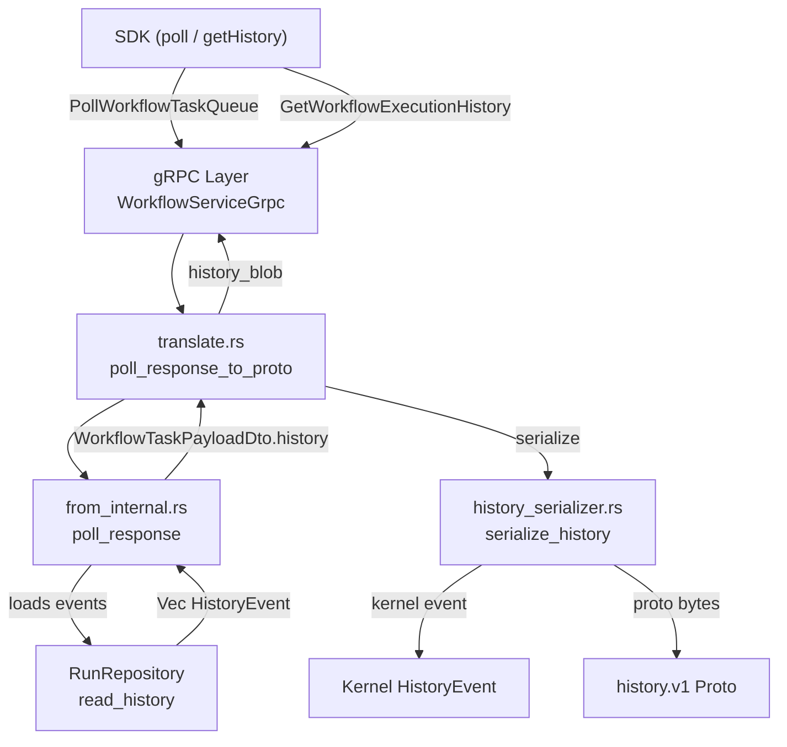

# Design Document: History Delivery

## Overview

This feature closes the gap between Tokeira's kernel history and what Temporal SDKs need for replay. Today, `PollWorkflowTaskQueue` returns an empty `history_blob`, `GetWorkflowExecutionHistory` does not exist, visibility queries return empty results, and `RespondWorkflowTaskCompleted` always reports `workflow_completed: false`.

The design adds:

1. Proto message definitions under `temporal.api.history.v1` for all `HistoryEventKind` variants.
2. A history serializer module in `tokeira-edge` that converts kernel `HistoryEvent` values to proto-encoded bytes.
3. History loading in the poll response path via `RunRepository::read_history`.
4. A `GetWorkflowExecutionHistory` RPC endpoint.
5. Wiring `VisibilityQueryService` into `tokeirad` to replace `EmptyVisibilityApi`.
6. Completion status propagation in `RespondWorkflowTaskCompleted`.

## Architecture



The data flow for `PollWorkflowTaskQueue`:

1. `from_internal::poll_response` receives a `StartedWorkflowTask` **and** a `&dyn RunRepository`.
2. It calls `repo.read_history(run_key, 0, usize::MAX)` to load the full history.
3. It populates `WorkflowTaskPayloadDto.history` with the loaded events.
4. `translate::poll_response_to_proto` calls `history_serializer::serialize_history(&events)` to produce proto-encoded bytes.
5. The bytes are set as `history_blob` on the gRPC response.

For `GetWorkflowExecutionHistory`, the `WorkflowService` resolves the execution to a run key, reads history from the repository, serializes it, and returns it directly.

For completion status, `WorkflowMutationOutcome` gains an `execution_status: ExecutionStatus` field and an optional `new_run_id: Option<RunId>`. The translator maps terminal statuses to `workflow_completed: true`.

## Components and Interfaces

### 1. History Proto Definitions

New file: `tokeira-proto/proto/upstream/temporal/api/history/v1/message.proto`

New file: `tokeira-proto/proto/upstream/temporal/api/enums/v1/event_type.proto`

The `EventType` enum will have one variant per `HistoryEventKind` discriminant:

```protobuf
enum EventType {
  EVENT_TYPE_UNSPECIFIED = 0;
  EVENT_TYPE_WORKFLOW_EXECUTION_STARTED = 1;
  EVENT_TYPE_WORKFLOW_EXECUTION_COMPLETED = 2;
  EVENT_TYPE_WORKFLOW_EXECUTION_FAILED = 3;
  EVENT_TYPE_WORKFLOW_EXECUTION_TIMED_OUT = 4;
  EVENT_TYPE_WORKFLOW_EXECUTION_CANCEL_REQUESTED = 5;
  EVENT_TYPE_WORKFLOW_EXECUTION_CANCELED = 6;
  EVENT_TYPE_WORKFLOW_EXECUTION_TERMINATED = 7;
  EVENT_TYPE_WORKFLOW_EXECUTION_CONTINUED_AS_NEW = 8;
  EVENT_TYPE_WORKFLOW_EXECUTION_SIGNALED = 9;
  EVENT_TYPE_WORKFLOW_EXECUTION_PAUSED = 10;
  EVENT_TYPE_WORKFLOW_EXECUTION_UNPAUSED = 11;
  EVENT_TYPE_WORKFLOW_TASK_SCHEDULED = 12;
  EVENT_TYPE_WORKFLOW_TASK_STARTED = 13;
  EVENT_TYPE_WORKFLOW_TASK_COMPLETED = 14;
  EVENT_TYPE_WORKFLOW_TASK_FAILED = 15;
  EVENT_TYPE_WORKFLOW_TASK_TIMED_OUT = 16;
  EVENT_TYPE_ACTIVITY_TASK_SCHEDULED = 17;
  EVENT_TYPE_ACTIVITY_TASK_COMPLETED = 18;
  EVENT_TYPE_ACTIVITY_TASK_FAILED = 19;
  EVENT_TYPE_ACTIVITY_TASK_TIMED_OUT = 20;
  EVENT_TYPE_ACTIVITY_TASK_CANCELED = 21;
  EVENT_TYPE_ACTIVITY_TASK_CANCEL_REQUESTED = 22;
  EVENT_TYPE_TIMER_STARTED = 23;
  EVENT_TYPE_TIMER_FIRED = 24;
  EVENT_TYPE_TIMER_CANCELED = 25;
  EVENT_TYPE_MARKER_RECORDED = 26;
  EVENT_TYPE_START_CHILD_WORKFLOW_EXECUTION_INITIATED = 27;
  EVENT_TYPE_CHILD_WORKFLOW_EXECUTION_STARTED = 28;
  EVENT_TYPE_START_CHILD_WORKFLOW_EXECUTION_FAILED = 29;
  EVENT_TYPE_CHILD_WORKFLOW_EXECUTION_COMPLETED = 30;
  EVENT_TYPE_CHILD_WORKFLOW_EXECUTION_FAILED = 31;
  EVENT_TYPE_CHILD_WORKFLOW_EXECUTION_CANCELED = 32;
  EVENT_TYPE_CHILD_WORKFLOW_EXECUTION_TERMINATED = 33;
  EVENT_TYPE_CHILD_WORKFLOW_EXECUTION_TIMED_OUT = 34;
  EVENT_TYPE_SIGNAL_EXTERNAL_WORKFLOW_EXECUTION_INITIATED = 35;
  EVENT_TYPE_EXTERNAL_WORKFLOW_EXECUTION_SIGNALED = 36;
  EVENT_TYPE_SIGNAL_EXTERNAL_WORKFLOW_EXECUTION_FAILED = 37;
  EVENT_TYPE_REQUEST_CANCEL_EXTERNAL_WORKFLOW_EXECUTION_INITIATED = 38;
  EVENT_TYPE_EXTERNAL_WORKFLOW_EXECUTION_CANCEL_REQUESTED = 39;
  EVENT_TYPE_REQUEST_CANCEL_EXTERNAL_WORKFLOW_EXECUTION_FAILED = 40;
  EVENT_TYPE_NEXUS_OPERATION_SCHEDULED = 41;
  EVENT_TYPE_NEXUS_OPERATION_STARTED = 42;
  EVENT_TYPE_NEXUS_OPERATION_COMPLETED = 43;
  EVENT_TYPE_NEXUS_OPERATION_FAILED = 44;
  EVENT_TYPE_NEXUS_OPERATION_CANCELED = 45;
  EVENT_TYPE_NEXUS_OPERATION_TIMED_OUT = 46;
  EVENT_TYPE_NEXUS_OPERATION_CANCEL_REQUESTED = 47;
  EVENT_TYPE_WORKFLOW_EXECUTION_UPDATE_ACCEPTED = 48;
  EVENT_TYPE_WORKFLOW_EXECUTION_UPDATE_COMPLETED = 49;
  EVENT_TYPE_WORKFLOW_EXECUTION_UPDATE_REJECTED = 50;
  EVENT_TYPE_WORKFLOW_EXECUTION_OPTIONS_UPDATED = 51;
}
```

The `HistoryEvent` message and per-variant attributes messages:

```protobuf
message HistoryEvent {
  int64 event_id = 1;
  int64 event_time = 2;  // unix nanos
  temporal.api.enums.v1.EventType event_type = 3;
  oneof attributes {
    WorkflowExecutionStartedEventAttributes workflow_execution_started = 4;
    WorkflowExecutionCompletedEventAttributes workflow_execution_completed = 5;
    WorkflowExecutionFailedEventAttributes workflow_execution_failed = 6;
    // ... one field per event kind
  }
}

message History {
  repeated HistoryEvent events = 1;
}
```

Each attributes message mirrors the fields of the corresponding `HistoryEventKind` variant. For example:

```protobuf
message WorkflowExecutionStartedEventAttributes {
  string workflow_type = 1;
  temporal.api.common.v1.TaskQueue task_queue = 2;
  temporal.api.common.v1.Payloads input = 3;
  temporal.api.common.v1.Memo memo = 4;
  temporal.api.common.v1.SearchAttributes search_attributes = 5;
  string request_id = 6;
  string continued_execution_run_id = 7;
  string first_execution_run_id = 8;
  RetryPolicy retry_policy = 9;
  uint32 attempt = 10;
  int64 workflow_execution_timeout_millis = 11;
  int64 workflow_run_timeout_millis = 12;
  int64 workflow_task_timeout_millis = 13;
}

message ActivityTaskScheduledEventAttributes {
  string activity_id = 1;
  temporal.api.common.v1.TaskQueue task_queue = 2;
  temporal.api.common.v1.Payloads input = 3;
  int64 schedule_to_close_timeout_millis = 4;
  int64 schedule_to_start_timeout_millis = 5;
  int64 start_to_close_timeout_millis = 6;
  int64 heartbeat_timeout_millis = 7;
}
```

### 2. Build Configuration

`tokeira-proto/build.rs` gains the new proto files in the public compilation set:

```rust
// Add to the public compile list:
"proto/upstream/temporal/api/history/v1/message.proto",
"proto/upstream/temporal/api/enums/v1/event_type.proto",
```

`tokeira-proto/src/public.rs` gains a new module:

```rust
pub mod history {
    pub mod v1 {
        tonic::include_proto!("temporal.api.history.v1");
    }
}
```

Re-exported as `pub use temporal::api::history::v1 as history;` in `lib.rs`.

### 3. History Serializer Module

New file: `tokeira-edge/src/translate/history_serializer.rs`

```rust
use tokeira_kernel::event::{HistoryEvent, HistoryEventKind};
use tokeira_proto::history;
use prost::Message;

/// Convert a slice of kernel history events into proto-encoded bytes
/// representing a `temporal.api.history.v1.History` message.
pub fn serialize_history(events: &[HistoryEvent]) -> Vec<u8> {
    let proto_history = history::History {
        events: events.iter().map(history_event_to_proto).collect(),
    };
    proto_history.encode_to_vec()
}

/// Convert a single kernel HistoryEvent to its proto representation.
pub fn history_event_to_proto(event: &HistoryEvent) -> history::HistoryEvent {
    history::HistoryEvent {
        event_id: event.event_id,
        event_time: to_unix_nanos(event.happened_at),
        event_type: event_type_for_kind(&event.kind) as i32,
        attributes: Some(attributes_for_kind(&event.kind)),
    }
}

/// Map a HistoryEventKind to the corresponding EventType enum value.
fn event_type_for_kind(kind: &HistoryEventKind) -> history::EventType { .. }

/// Convert the variant-specific fields to the corresponding proto attributes.
fn attributes_for_kind(kind: &HistoryEventKind)
    -> history::history_event::Attributes { .. }
```

The `attributes_for_kind` function is a large `match` over all `HistoryEventKind` variants. Each arm constructs the corresponding proto attributes message using the existing conversion helpers from `tokeira_proto::conversions::common` (`payloads_from_domain`, `memo_from_domain`, `search_attributes_from_domain`, `task_queue_from_domain`).

Encoding conventions:
- `time::Duration` → milliseconds as `i64` (`.whole_milliseconds()`)
- `time::OffsetDateTime` → unix nanoseconds as `i64`
- `Option<T>` → empty string / zero / absent field when `None`
- `Payloads`, `Memo`, `SearchAttributes` → corresponding `temporal.api.common.v1` messages

### 4. Changes to Poll Response Path

#### `from_internal::poll_response`

The function signature changes to accept a repository reference:

```rust
pub async fn poll_response(
    started: StartedWorkflowTask,
    repo: &dyn RunRepository,
) -> Result<PollWorkflowTaskQueueResponse> {
    let history = repo.read_history(started.run_key, 0, usize::MAX).await?;
    Ok(PollWorkflowTaskQueueResponse {
        task_token: serde_json::to_vec(&started.token)?,
        started_event_id: started.token.started_event_id,
        attempt: started.token.attempt,
        payload: WorkflowTaskPayloadDto {
            workflow_id: started.workflow_id.0,
            run_key: started.run_key,
            task_queue: started.task_queue.0,
            history,
        },
    })
}
```

#### `translate::poll_response_to_proto`

The `history_blob` function is replaced with a real call to the serializer:

```rust
pub fn poll_response_to_proto(
    resp: PollWorkflowTaskQueueResponse,
) -> workflowservice::PollWorkflowTaskQueueResponse {
    // ... existing workflow_execution construction ...
    workflowservice::PollWorkflowTaskQueueResponse {
        task_token: resp.task_token,
        workflow_execution,
        started_event_id: resp.started_event_id,
        history_blob: history_serializer::serialize_history(&resp.payload.history),
        sticky: false,
    }
}
```

#### `WorkflowService::poll_workflow_task_queue`

The method needs access to the `RunRepository` to pass to `from_internal::poll_response`. The `WorkflowService` constructor gains a `repo: Arc<dyn RunRepository>` field, or the `WorkflowRuntimeApi` trait is extended with a `read_history` method. The simpler approach is to add the repository to `WorkflowService`:

```rust
pub struct WorkflowService {
    runtime: Arc<dyn WorkflowRuntimeApi>,
    resolver: Arc<dyn ExecutionResolver>,
    visibility: Arc<dyn VisibilityApi>,
    repo: Arc<dyn RunRepository>,  // NEW
    interceptors: Arc<EdgeInterceptors>,
    long_polls: LongPollGate,
    router: Arc<dyn EdgeRouter>,
}
```

### 5. GetWorkflowExecutionHistory RPC

#### Proto Changes

Add to `workflowservice/v1/service.proto`:

```protobuf
import "temporal/api/history/v1/message.proto";

service WorkflowService {
  // ... existing RPCs ...
  rpc GetWorkflowExecutionHistory(GetWorkflowExecutionHistoryRequest)
      returns (GetWorkflowExecutionHistoryResponse);
}

message GetWorkflowExecutionHistoryRequest {
  string namespace = 1;
  temporal.api.common.v1.WorkflowExecution execution = 2;
  int32 maximum_page_size = 3;
}

message GetWorkflowExecutionHistoryResponse {
  temporal.api.history.v1.History history = 1;
}
```

#### Edge Layer

New translate functions:

```rust
// translate.rs
pub fn get_history_request_to_edge(
    req: workflowservice::GetWorkflowExecutionHistoryRequest,
) -> Result<GetWorkflowExecutionHistoryRequest, ProtoConversionError> { .. }

pub fn get_history_response_to_proto(
    resp: GetWorkflowExecutionHistoryResponse,
) -> workflowservice::GetWorkflowExecutionHistoryResponse { .. }
```

New DTO types in `translate/mod.rs`:

```rust
pub struct GetWorkflowExecutionHistoryRequest {
    pub namespace: String,
    pub workflow_id: String,
    pub run_id: Option<String>,
    pub maximum_page_size: usize,
}

pub struct GetWorkflowExecutionHistoryResponse {
    pub history: Vec<HistoryEvent>,
}
```

New method on `WorkflowService`:

```rust
pub async fn get_workflow_execution_history(
    &self,
    headers: &HeaderMap,
    req: GetWorkflowExecutionHistoryRequest,
) -> EdgeResult<GetWorkflowExecutionHistoryResponse> {
    let run_key = self.resolve_run_key(&req.namespace, &req.workflow_id).await?;
    let limit = if req.maximum_page_size > 0 {
        req.maximum_page_size
    } else {
        usize::MAX
    };
    let history = self.repo.read_history(run_key, 0, limit).await?;
    Ok(GetWorkflowExecutionHistoryResponse { history })
}
```

New gRPC handler in `WorkflowServiceGrpc`:

```rust
async fn get_workflow_execution_history(
    &self,
    request: Request<workflowservice::GetWorkflowExecutionHistoryRequest>,
) -> Result<Response<workflowservice::GetWorkflowExecutionHistoryResponse>, Status> {
    let headers = metadata_to_header_map(request.metadata());
    let edge_req = translate::get_history_request_to_edge(request.into_inner())
        .map_err(proto_conversion_status)?;
    let edge_resp = self.inner.get_workflow_execution_history(&headers, edge_req).await?;
    Ok(Response::new(translate::get_history_response_to_proto(edge_resp)))
}
```

### 6. Wire VisibilityQueryService into tokeirad

In `apps/tokeirad/src/main.rs`:

```rust
// Before (current):
let visibility = Arc::new(EmptyVisibilityApi);

// After:
use tokeira_projection::{InMemoryVisibilityStore, VisibilityQueryService};

let visibility_store = InMemoryVisibilityStore::default();
let visibility = Arc::new(VisibilityQueryService::new(visibility_store));
```

The projection store also needs to be fed by the projection log. The runtime's `ProjectionLog` writes must flow into the same `InMemoryVisibilityStore` instance. This means the store is shared between the runtime (as a `ProjectionLog` sink) and the query service (as a read source).

### 7. Completion Status Changes

#### `WorkflowMutationOutcome`

```rust
pub struct WorkflowMutationOutcome {
    pub transition_seq: u64,
    pub last_event_id: i64,
    pub was_duplicate: bool,
    pub execution_status: ExecutionStatus,   // NEW
    pub new_run_id: Option<RunId>,           // NEW (set on ContinuedAsNew)
}
```

#### `RespondWorkflowTaskCompletedResponse` DTO

```rust
pub struct RespondWorkflowTaskCompletedResponse {
    pub transition_seq: u64,
    pub last_event_id: i64,
    pub execution_status: ExecutionStatus,   // NEW
    pub new_run_id: Option<RunId>,           // NEW
    pub was_duplicate: bool,                 // NEW
}
```

#### `from_internal::completed_response`

```rust
pub fn completed_response(
    outcome: WorkflowMutationOutcome,
) -> RespondWorkflowTaskCompletedResponse {
    RespondWorkflowTaskCompletedResponse {
        transition_seq: outcome.transition_seq,
        last_event_id: outcome.last_event_id,
        execution_status: outcome.execution_status,
        new_run_id: outcome.new_run_id,
        was_duplicate: outcome.was_duplicate,
    }
}
```

#### `translate::completed_response_to_proto`

```rust
pub fn completed_response_to_proto(
    resp: RespondWorkflowTaskCompletedResponse,
) -> workflowservice::RespondWorkflowTaskCompletedResponse {
    let workflow_completed = !resp.was_duplicate
        && !resp.execution_status.is_open();
    workflowservice::RespondWorkflowTaskCompletedResponse {
        workflow_completed,
        new_run_id: resp.new_run_id
            .map(|id| id.0.to_string())
            .unwrap_or_default(),
    }
}
```

## Data Models

### Proto Messages (new)

| Message | Package | Purpose |
|---------|---------|---------|
| `EventType` enum | `temporal.api.enums.v1` | Discriminant for history event types |
| `HistoryEvent` | `temporal.api.history.v1` | Single history event with oneof attributes |
| `History` | `temporal.api.history.v1` | Repeated list of history events |
| `*EventAttributes` (51 messages) | `temporal.api.history.v1` | Per-variant attribute payloads |
| `RetryPolicy` | `temporal.api.history.v1` | Retry policy embedded in started attributes |
| `GetWorkflowExecutionHistoryRequest` | `workflowservice.v1` | RPC request |
| `GetWorkflowExecutionHistoryResponse` | `workflowservice.v1` | RPC response |

### Modified Structs

| Struct | Change |
|--------|--------|
| `WorkflowMutationOutcome` | Add `execution_status: ExecutionStatus`, `new_run_id: Option<RunId>` |
| `RespondWorkflowTaskCompletedResponse` (DTO) | Add `execution_status`, `new_run_id`, `was_duplicate` |
| `WorkflowService` | Add `repo: Arc<dyn RunRepository>` |

### Encoding Conventions

| Kernel Type | Proto Encoding |
|-------------|---------------|
| `time::OffsetDateTime` | `int64` unix nanoseconds |
| `time::Duration` | `int64` milliseconds |
| `Payloads` | `temporal.api.common.v1.Payloads` |
| `Memo` | `temporal.api.common.v1.Memo` |
| `SearchAttributes` | `temporal.api.common.v1.SearchAttributes` |
| `TaskQueueName` | `temporal.api.common.v1.TaskQueue` |
| `Option<T>` | Default/empty value when `None` |

## Correctness Properties

*A property is a characteristic or behavior that should hold true across all valid executions of a system — essentially, a formal statement about what the system should do. Properties serve as the bridge between human-readable specifications and machine-verifiable correctness guarantees.*

### Property 1: History serialization round-trip

*For any* valid `HistoryEvent` value (covering all `HistoryEventKind` variants), serializing it to a `temporal.api.history.v1.HistoryEvent` proto message, encoding to bytes, decoding back from bytes, and comparing the resulting proto message SHALL produce an equivalent message. Specifically, `event_id`, `event_time`, `event_type`, and all variant-specific attribute fields must be preserved.

**Validates: Requirements 2.1, 2.2, 2.3, 2.4, 2.5, 2.6**

### Property 2: History loader preserves event list

*For any* list of `HistoryEvent` values returned by `RunRepository::read_history`, the `WorkflowTaskPayloadDto.history` field produced by `from_internal::poll_response` SHALL contain exactly the same events in the same order.

**Validates: Requirements 3.1, 3.2**

### Property 3: Completion status mapping

*For any* `ExecutionStatus` value and `was_duplicate` flag, the `completed_response_to_proto` function SHALL set `workflow_completed` to `true` if and only if `was_duplicate` is `false` AND the status is not open (i.e., `!status.is_open()`).

**Validates: Requirements 6.2, 6.3, 6.5**

## Error Handling

| Scenario | Handling |
|----------|----------|
| `read_history` returns an error | `from_internal::poll_response` propagates the error via `?`; the gRPC layer maps it to `INTERNAL` status |
| `GetWorkflowExecutionHistory` for non-existent execution | `resolve_run_key` returns `None` → `NOT_FOUND` gRPC status |
| Proto serialization produces invalid bytes | Should not happen with `prost::Message::encode_to_vec`; if it does, the SDK will fail to decode and retry the poll |
| `VisibilityQueryService` store error | Propagated as `INTERNAL` gRPC status (existing error handling path) |
| Extremely large history | `read_history` returns all events; future work can add pagination via `maximum_page_size` on `GetWorkflowExecutionHistory` |

## Testing Strategy

### Property-Based Tests

Property-based testing is appropriate for this feature because the history serializer is a pure function with clear input/output behavior, the input space is large (51 event variants × arbitrary field values), and universal properties (round-trip, preservation) hold across all inputs.

Library: `proptest` (already used in the codebase, e.g., `tokeira-runtime/src/broker.rs`).

Each property test runs a minimum of 100 iterations.

- **Property 1 test**: Generate arbitrary `HistoryEvent` values using a proptest strategy that covers all `HistoryEventKind` variants. For each event, call `history_event_to_proto`, encode to bytes with `prost::Message::encode_to_vec`, decode with `prost::Message::decode`, and assert the decoded proto equals the original proto.
  - Tag: `Feature: history-delivery, Property 1: History serialization round-trip`

- **Property 2 test**: Generate arbitrary `Vec<HistoryEvent>` lists. Create a mock `RunRepository` that returns the list. Call `poll_response` and assert `payload.history == original_list`.
  - Tag: `Feature: history-delivery, Property 2: History loader preserves event list`

- **Property 3 test**: Generate arbitrary `(ExecutionStatus, bool)` pairs. Construct a `RespondWorkflowTaskCompletedResponse` DTO and call `completed_response_to_proto`. Assert `workflow_completed == (!was_duplicate && !status.is_open())`.
  - Tag: `Feature: history-delivery, Property 3: Completion status mapping`

### Unit Tests (Example-Based)

- Empty history produces a valid (decodable) `History` proto message with zero events (Req 3.5)
- `GetWorkflowExecutionHistory` for non-existent workflow returns `NOT_FOUND` (Req 4.5)
- `ContinuedAsNew` status sets `new_run_id` in the completed response (Req 6.4)
- `was_duplicate: true` sets `workflow_completed: false` regardless of status (Req 6.5)
- Each `HistoryEventKind` variant has at least one golden-file example test for the serializer

### Integration Tests

- Start a workflow via `tokeirad`, poll a workflow task, and verify the `history_blob` decodes to a `History` message containing `WorkflowExecutionStarted` and `WorkflowTaskScheduled` events (Req 3.3, 3.4)
- Start and complete a workflow, call `GetWorkflowExecutionHistory`, verify the full event sequence (Req 4.4)
- After wiring `VisibilityQueryService`, start a workflow and verify `ListWorkflowExecutions` returns it (Req 5.3, 5.4)
