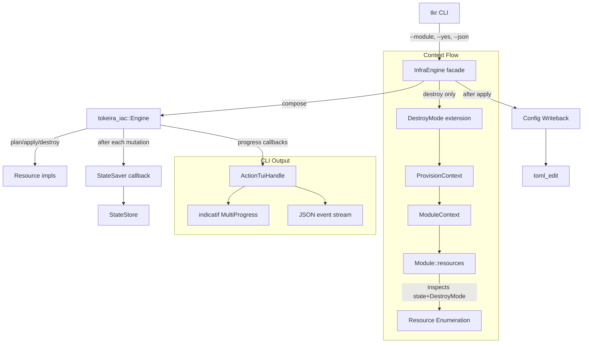

# Design Document: IaC Resource Lifecycle

## Overview

This design extends `tokeira-iac` with six capabilities that close lifecycle management gaps leading to orphaned resources, stale state, and poor operator visibility. It also documents the `effective_managed` convention for resources that need multiple lifecycle modes.

Guiding principle: the engine stays generic. Mode-awareness lives in each resource that needs it. The engine never enumerates mode variants, never decides whether to delete based on mode — it just calls `Resource::diff()`, `Resource::delete()`, and records state. Resources that have multiple lifecycle modes define their own enums, persist mode in `ResourceState.properties["mode"]`, and implement mode-aware lifecycle methods following a shared convention.

The six engine-level capabilities are:

1. **DestroyMode context propagation** — a marker extension that tells modules to enumerate resources from state in addition to current config during destroy.
2. **Incremental StateSaver contract** — crash-safe state persistence after every mutation (already partially implemented; this formalises and tests the contract).
3. **Module-scoped delete suppression** — already implemented; this formalises and tests the filtering invariant.
4. **Config writeback** — already implemented; this formalises and tests the TOML writeback invariant.
5. **CLI progress reporting** — new `ActionTuiHandle` using `indicatif` and `console` for spinners, progress, and JSON event output.
6. **Describe-before-delete** — already implemented; this formalises and tests the safety invariant.

The `effective_managed` convention (Requirement 7) is documented as a reference pattern, not a trait method. Resources that do not need lifecycle variation simply ignore it.

## Architecture



### Crate Boundaries

| Change | Crate | Rationale |
|---|---|---|
| `DestroyMode` marker struct | `tokeira-iac` | Engine-level primitive that modules detect via `ModuleContext` |
| `StateSaver` contract documentation + tests | `tokeira-iac` | Existing behavior, formalised |
| Module-scoped delete filtering + tests | `tokeira-iac` | Existing behavior, formalised |
| Describe-before-delete + tests | `tokeira-iac` | Existing behavior, formalised |
| `ActionTuiHandle`, `OutputFormat`, `ProgressEvent` | `apps/tkr` | CLI-only presentation |
| `console`, `indicatif` dependencies | `apps/tkr/Cargo.toml` | Binary crate only — no library impact |
| Config writeback + tests | `apps/tkr` | Existing behavior, formalised |

Notably **not** changed:
- No `ResourceMode` enum on the engine
- No `Resource::mode()` trait method
- No `ResourceState.mode` field
- No mode-aware logic in `compute_changes`

These belong to individual resource implementations, which are free to define their own mode enums (as `DsqlCluster` does with `DsqlClusterMode`) and follow the `effective_managed` convention.

## Components and Interfaces

### DestroyMode Marker

```rust
// crates/tokeira-iac/src/lib.rs

/// Marker extension registered in `ProvisionContext` during destroy operations.
///
/// Modules inspect this via `ModuleContext::extension::<DestroyMode>()` to
/// decide whether to enumerate resources from persisted state in addition
/// to current config. This is how a module includes a resource that was
/// originally managed but has been removed from current config in the
/// destroy set.
#[derive(Debug, Clone, Copy)]
pub struct DestroyMode;
```

The marker is registered by the orchestrator facade (`tokeira-orchestrator::InfraEngine`) before calling `engine.destroy_modules` or `engine.plan_destroy_modules`. The generic engine does not register it.

### Orchestrator Destroy Wiring

The `InfraEngine` facade in `tokeira-orchestrator` handles the wiring:

```rust
// crates/tokeira-orchestrator/src/lib.rs (added to InfraEngine)

impl<D: Deployment> InfraEngine<D> {
    pub async fn destroy(&mut self, composition: &InfraComposition)
        -> Result<Vec<Change>>
    {
        self.ctx.set_extension(DestroyMode);
        let active: Vec<&str> = composition.active_modules.iter()
            .map(|s| s.as_str()).collect();
        self.engine
            .destroy_modules(&composition.known_modules, &active, &mut self.ctx)
            .await
    }

    pub async fn plan_destroy(&mut self, composition: &InfraComposition)
        -> Result<Vec<Change>>
    {
        self.ctx.set_extension(DestroyMode);
        let active: Vec<&str> = composition.active_modules.iter()
            .map(|s| s.as_str()).collect();
        self.engine
            .plan_destroy_modules(&composition.known_modules, &active, &mut self.ctx)
            .await
    }
}
```

Apply and plan (non-destroy) do **not** register the marker.

### InfraComposition Semantics

The existing `InfraComposition` struct carries three module lists:

```rust
pub struct InfraComposition {
    pub desired_modules: Vec<Box<dyn Module>>,
    pub known_modules: Vec<Box<dyn Module>>,
    pub active_modules: Vec<String>,
}
```

The **composition is built by the orchestrator/deployment crate**, not the generic engine. The deployment-specific code decides:

- **For plan/apply**: `desired_modules = known_modules = modules from current config`. `active_modules` is the subset the operator selected (empty = all).
- **For destroy**: `desired_modules = []` (nothing should exist after destroy). `known_modules = all modules the deployment could have ever created` (read from deployment code, expanded via `DestroyMode` enumeration). `active_modules` is the subset the operator selected.

This is why the `DestroyMode` marker matters: during destroy, modules use it to expand their resource enumeration to include everything they could have managed, not just what current config declares.

### StateSaver Contract (Formalisation)

The `StateSaver` type already exists:

```rust
pub type StateSaver = Box<
    dyn Fn(&InfraState)
        -> Pin<Box<dyn Future<Output = Result<(), IacError>> + Send + '_>>
        + Send
        + Sync,
>;
```

**Contract:**
1. Called exactly once after each successful create, update, or delete operation.
2. Called after pruning a stale resource from state during refresh.
3. If it returns `Err`, the engine aborts immediately and propagates the error.
4. The engine MUST NOT batch multiple mutations before calling the saver.
5. The saver sees the full current `InfraState` snapshot, not a delta.

This contract is already implemented in `apply_changes` and `destroy_changes`. The spec adds explicit tests to catch regression.

### ActionTuiHandle (New — CLI Only)

```rust
// apps/tkr/src/tui.rs

use std::sync::Arc;
use std::sync::atomic::{AtomicUsize, Ordering};
use std::time::Instant;

use console::{Term, style};
use indicatif::{MultiProgress, ProgressBar, ProgressStyle};
use serde::Serialize;

/// Output format for CLI operations.
#[derive(Debug, Clone, Copy, PartialEq, Eq)]
pub enum OutputFormat {
    Human,
    Json,
}

/// Shared counters updated from progress closures.
///
/// Uses atomics because progress callbacks are `Fn` (not `FnMut`) and
/// multiple reporter closures share the same counters.
#[derive(Debug, Default)]
struct ActionCounters {
    completed: AtomicUsize,
    failed: AtomicUsize,
    skipped: AtomicUsize,
}

/// Progress reporting handle for infrastructure operations.
#[derive(Debug, Clone)]
pub struct ActionTuiHandle {
    format: OutputFormat,
    multi: MultiProgress,
    start: Instant,
    counters: Arc<ActionCounters>,
    is_terminal: bool,
}

impl ActionTuiHandle {
    pub fn new(format: OutputFormat) -> Self {
        let is_terminal = Term::stdout().is_term();
        Self {
            format,
            multi: MultiProgress::new(),
            start: Instant::now(),
            counters: Arc::new(ActionCounters::default()),
            is_terminal,
        }
    }

    /// Install progress reporters on the provision context.
    pub fn install(&self, ctx: &mut tokeira_iac::ProvisionContext) {
        let format = self.format;
        let multi = self.multi.clone();
        let counters = Arc::clone(&self.counters);
        let is_terminal = self.is_terminal;

        ctx.set_apply_progress(move |action, rid, rtype, current, total| {
            match format {
                OutputFormat::Human if is_terminal => {
                    let pb = multi.add(ProgressBar::new_spinner());
                    pb.set_style(
                        ProgressStyle::with_template("  {spinner} {msg}")
                            .unwrap()
                            .tick_strings(&["-", "\\", "|", "/", "✓"]),
                    );
                    pb.set_message(format!(
                        "[{current}/{total}] {action} {} ({})",
                        rid.0, rtype.0
                    ));
                    pb.enable_steady_tick(std::time::Duration::from_millis(100));
                    // Caller is responsible for finishing; we detach here.
                    pb.finish_and_clear();
                }
                OutputFormat::Human => {
                    eprintln!(
                        "  [{current}/{total}] {action} {} ({})",
                        rid.0, rtype.0
                    );
                }
                OutputFormat::Json => {
                    let event = ProgressEvent::OperationStart {
                        action: action.into(),
                        resource_id: rid.0.clone(),
                        resource_type: rtype.0.clone(),
                        index: current,
                        total,
                    };
                    println!("{}", serde_json::to_string(&event).unwrap());
                }
            }
            counters.completed.fetch_add(1, Ordering::Relaxed);
        });

        // Similar wiring for set_wait_progress and set_note_progress.
        // Elided here for brevity; full wiring in tasks.
    }

    pub fn print_summary(&self) {
        let completed = self.counters.completed.load(Ordering::Relaxed);
        let failed = self.counters.failed.load(Ordering::Relaxed);
        let skipped = self.counters.skipped.load(Ordering::Relaxed);
        let elapsed = self.start.elapsed();

        match self.format {
            OutputFormat::Human => {
                println!(
                    "\n{} {completed} completed, {failed} failed, {skipped} skipped in {:.1}s",
                    style("Done:").bold(),
                    elapsed.as_secs_f64()
                );
            }
            OutputFormat::Json => {
                let event = ProgressEvent::Summary {
                    completed,
                    failed,
                    skipped,
                    elapsed_ms: elapsed.as_millis() as u64,
                };
                println!("{}", serde_json::to_string(&event).unwrap());
            }
        }
    }
}

/// A single JSON progress event emitted when `--json` is active.
#[derive(Debug, Serialize)]
#[serde(tag = "event", rename_all = "snake_case")]
pub enum ProgressEvent {
    OperationStart {
        action: String,
        resource_id: String,
        resource_type: String,
        index: usize,
        total: usize,
    },
    WaitProgress {
        resource_id: String,
        resource_type: String,
        phase: String,
        elapsed_ms: u64,
        timeout_ms: u64,
    },
    Note {
        resource_id: String,
        resource_type: String,
        message: String,
    },
    Summary {
        completed: usize,
        failed: usize,
        skipped: usize,
        elapsed_ms: u64,
    },
}
```

The counters are kept in an `Arc<ActionCounters>` with atomic fields so that the three separate reporter closures (apply, wait, note) can share state without a lock.

When stdout is not a terminal, the `Human` path falls back to plain `eprintln!` lines instead of spinners. This preserves readability when output is piped to a log file.

### Config Writeback (Existing — Formalised)

The existing `write_tokeirad_writeback` in `apps/tkr/src/commands/infra.rs` uses `toml_edit::DocumentMut` which preserves comments and formatting. It:

- Creates intermediate tables when paths don't exist
- Overwrites existing values at dotted key paths
- Preserves TOML comments and formatting (inherent to `toml_edit::DocumentMut`)
- Returns an error if the file cannot be written

No code changes needed. The spec adds property tests.

## The `effective_managed` Convention for Mode-Aware Resources

This is a **resource-level convention**, not an engine feature. Resources that need lifecycle variation (e.g., DSQL clusters, shared S3 buckets) follow this pattern. Other resources ignore it.

### Pattern

```rust
// Example: DsqlClusterMode in a resource crate

#[derive(Debug, Clone, Copy, PartialEq, Eq)]
pub enum DsqlClusterMode {
    /// Engine creates and owns the cluster lifecycle.
    Managed,
    /// Engine adopts a preexisting cluster; never deletes it.
    Preexisting,
}

pub struct DsqlClusterConfig {
    pub mode: DsqlClusterMode,
    pub preexisting_endpoint: Option<String>,
    pub preexisting_arn: Option<String>,
    // ...
}

impl Resource for DsqlCluster {
    async fn create(&self, ctx: &ProvisionContext) -> Result<ResourceState, IacError> {
        match self.config.mode {
            DsqlClusterMode::Managed => {
                // Call provider create API
                let id = create_via_api(ctx).await?;
                Ok(ResourceState {
                    // ...
                    properties: serde_json::json!({
                        "mode": "managed",
                        "cluster_id": id,
                    }),
                    // ...
                })
            }
            DsqlClusterMode::Preexisting => {
                // Adopt — record endpoint/arn, no provider API call
                Ok(ResourceState {
                    // ...
                    properties: serde_json::json!({
                        "mode": "preexisting",
                        "cluster_endpoint": self.config.preexisting_endpoint,
                    }),
                    // ...
                })
            }
        }
    }

    async fn delete(&self, current: &ResourceState, ctx: &ProvisionContext)
        -> Result<(), IacError>
    {
        let state_mode = current.properties.get("mode")
            .and_then(|v| v.as_str())
            .unwrap_or_default();

        // effective_managed ensures a resource originally created as Managed
        // is still deleted even if current config now declares Preexisting.
        let effective_managed = self.config.mode == DsqlClusterMode::Managed
            || state_mode == "managed";

        if !effective_managed {
            // Preexisting in both config and state — do not delete.
            return Ok(());
        }

        // Actually delete via provider API
        delete_via_api(ctx, current).await
    }

    fn diff(&self, current: &ResourceState, _ctx: &ProvisionContext) -> Change {
        match self.config.mode {
            DsqlClusterMode::Managed => {
                // Full comparison — whatever the resource tracks
                Change::NoChange { resource_id: self.resource_id() }
            }
            DsqlClusterMode::Preexisting => {
                // Compare only engine-controlled fields (endpoint/arn)
                // ...
            }
        }
    }
}
```

### Key properties of the convention

1. **No trait pollution.** Resources without lifecycle variation don't implement or inherit any mode concept.
2. **State persists mode as a string.** Stored under `properties["mode"]`, serialised as JSON. This is an opaque detail to the engine.
3. **`effective_managed` reconciles config drift.** If config mode is `Managed` OR persisted state mode is `"managed"`, the resource treats itself as managed for destroy purposes. This prevents orphaning when config changes from `Managed` to `Preexisting` after a resource was originally created.
4. **Resources define their own mode variants.** `DsqlCluster` has `Managed`/`Preexisting`. A hypothetical `RemoteStateBucket` might have `Managed`/`Shared` where `Shared` has distinct snapshot-protection semantics. Each resource names its modes for what it actually needs.

This convention is documented in the spec as guidance. Implementations in `tokeira-aws` (DSQL cluster) already demonstrate the pattern.

## Data Models

### DestroyMode Propagation Flow

```
CLI (tkr infra destroy --yes)
  → InfraEngine::destroy(composition)
    → ctx.set_extension(DestroyMode)              // register marker
    → engine.destroy_modules(&composition.known_modules, &active, &mut ctx)
      → collect_resources_from(known_modules, ctx)
        → ModuleContext::new(state, ctx.extensions())
        → module.resources(module_ctx)
          → let destroy_mode = module_ctx.extension::<DestroyMode>().is_some();
          → if destroy_mode: enumerate from config AND state
          → if !destroy_mode: enumerate from config only
```

### Apply Changes Algorithm (Existing — Unchanged)

```
apply_changes(known, ctx, changes, saver):
  1. Build resource_map: ResourceId → &dyn Resource
  2. Topologically sort known resources
  3. Count total_operations (non-NoChange changes)
  4. Forward pass (topological order) — creates and updates:
     for each resource_id in sorted order:
       if change is Create:
         emit_apply_progress("create", ...)
         state = resource.create(ctx).await?        // resource handles its own mode
         ctx.state.insert(resource_id, state)
         saver(&ctx.state).await?                   // INCREMENTAL SAVE
       if change is Update:
         emit_apply_progress("update", ...)
         state = resource.update(current, ctx).await?
         ctx.state.insert(resource_id, state)
         saver(&ctx.state).await?                   // INCREMENTAL SAVE
  5. Reverse pass (reverse topological order) — deletes:
     collect delete_ids from changes
     topological_sort_from_state(delete_ids)
     reverse the order
     for each resource_id in reversed order:
       emit_apply_progress("delete", ...)
       resource.delete(current, ctx).await?         // resource decides if mode skips
       ctx.state.remove(resource_id)
       saver(&ctx.state).await?                     // INCREMENTAL SAVE
  6. Return changes
```

Note: the engine does **not** inspect mode. `resource.delete()` is called unconditionally. The resource's own `delete()` implementation may skip the provider call based on `effective_managed`, returning `Ok(())` without side effects.

### Destroy Changes Algorithm (Existing — Formalised)

```
destroy_changes(known, ctx, changes, saver):
  1. Build resource_map: ResourceId → &dyn Resource
  2. Collect delete_ids from changes
  3. Topological sort from state, then reverse
  4. For each resource_id in reversed order:
     describe(ctx) → live_state?
       None → prune from state (already absent)
              ctx.state.remove(resource_id)
              saver(&ctx.state).await?
       Some(live) → resource.delete(live, ctx).await?    // use LIVE state
                    ctx.state.remove(resource_id)
                    saver(&ctx.state).await?
       Err(e) → propagate error, abort
  5. Return changes
```

Again: the engine does not inspect mode. `resource.delete()` is called unconditionally with live state. Mode-aware resources check `effective_managed` internally.

### Module-Scoped Delete Filtering (Existing — Formalised)

```rust
fn filter_changes_by_modules(
    changes: &[Change],
    state: &InfraState,
    active_modules: &[&str],
) -> Vec<Change> {
    let active: HashSet<&str> = active_modules.iter().copied().collect();
    changes
        .iter()
        .filter(|change| match change.kind {
            ChangeKind::Delete => state
                .resources
                .get(&ResourceId(change.resource.clone()))
                .map(|rs| active.contains(rs.module.as_str()))
                .unwrap_or(false),
            _ => true,  // Create, Update, NoChange always pass through
        })
        .cloned()
        .collect()
}
```

No code changes needed. The spec adds property tests.

## Correctness Properties

### Property 1: DestroyMode Visibility

*For any* `ProvisionContext` where `DestroyMode` has been set via `set_extension`, `ModuleContext::extension::<DestroyMode>()` SHALL return `Some`.

*For any* `ProvisionContext` where `DestroyMode` has not been set, `ModuleContext::extension::<DestroyMode>()` SHALL return `None`.

**Validates: Requirements 1.3, 1.4**

### Property 2: StateSaver Invocation Count

*For any* sequence of N successful mutating operations (creates + updates + deletes), the `StateSaver` callback SHALL be invoked exactly N times.

**Validates: Requirements 2.1, 2.2, 2.3, 2.6**

### Property 3: StateSaver Error Aborts Engine

*For any* sequence of operations where the `StateSaver` returns an error at invocation K, the engine SHALL complete at most K mutating operations and return an error.

**Validates: Requirements 2.4**

### Property 4: Module-Scoped Delete Filtering

*For any* set of changes and any active module set, the filtered change set SHALL contain Delete changes only for resources whose persisted module is in the active set, and SHALL preserve all Create, Update, and NoChange entries unchanged.

**Validates: Requirements 3.1, 3.2, 3.3, 3.4, 3.5, 3.6**

### Property 5: TOML Writeback Round-Trip

*For any* set of N dotted-key/value pairs where keys are valid TOML paths and values are non-empty strings, writing them to a TOML document and reading back the values at those paths SHALL produce the original values.

**Validates: Requirements 4.2, 4.3, 4.4, 4.7**

### Property 6: TOML Writeback Preserves Comments

*For any* existing TOML document with comments, after a writeback operation that modifies values, the resulting document SHALL still contain all original comments.

**Validates: Requirements 4.5**

### Property 7: Describe-Before-Delete Count

*For any* destroy operation on N resources in state where K resources are absent (describe returns None), the engine SHALL call `resource.delete()` at most N-K times.

**Validates: Requirements 6.1, 6.2, 6.5**

### Property 8: Describe-Before-Delete Uses Live State

*For any* resource where `describe()` returns `Some(live_state)` during destroy, the engine SHALL pass `live_state` (not the persisted state) to `resource.delete()`.

**Validates: Requirements 6.3**

### Property 9: JSON Progress Event Well-Formedness

*For any* progress event emitted when `OutputFormat::Json` is active, the output line SHALL be valid JSON and SHALL parse back into the expected `ProgressEvent` variant.

**Validates: Requirements 5.7**

### Property 10: Progress Counter Accuracy

*For any* sequence of N apply operations in a CLI session, the summary counters SHALL sum to exactly N (completed + failed + skipped == N).

**Validates: Requirements 5.8**

## Resource Mode Convention — Correctness Guidance

The `effective_managed` convention (Requirement 7) is documented guidance, not a property the engine enforces. Resources that follow the convention gain a specific correctness guarantee:

**Convention Property:** *For any* resource with current config mode `Preexisting` whose persisted state mode is `"managed"`, invoking `resource.delete()` during destroy SHALL call the provider delete API. This prevents orphaning resources that were originally created by the engine but whose config later changed to `Preexisting`.

This property must be tested in each resource that implements the convention. The spec lists it as guidance; enforcement is a per-resource test.

## Error Handling

| Error Condition | Behavior | Recovery |
|---|---|---|
| `StateSaver` returns error | Engine aborts immediately, returns error | Operator re-runs; state reflects last successful save |
| `describe()` fails during refresh | Engine returns error, no state mutation | Operator fixes provider access, re-runs |
| `describe()` fails during destroy | Engine propagates error, aborts destroy for that resource | Operator fixes access or manually removes |
| `delete()` fails | Engine propagates error, resource remains in state | Operator re-runs destroy (idempotent) |
| TOML writeback fails | CLI returns error after successful apply | State is saved; operator manually updates config |
| Module dependency cycle | `IacError::DependencyResolution` before any mutations | Operator fixes module dependencies |
| Resource dependency cycle | `IacError::DependencyResolution` before any mutations | Operator fixes resource dependencies |

**Error propagation principle:** Errors during mutations are always propagated immediately. The StateSaver ensures that any successfully completed operations are persisted before the error reaches the caller. Re-running after a failure is always safe — the engine will see already-created resources via `describe()` and either skip or update them.

## Testing Strategy

### Property-Based Tests (proptest)

Each correctness property maps to a `proptest` test with minimum 100 iterations:

| Property | Test Location | Generator Strategy |
|---|---|---|
| 1: DestroyMode visibility | `tokeira-iac/src/module.rs` | `ProvisionContext` with/without DestroyMode, assert ModuleContext visibility |
| 2: StateSaver count | `tokeira-iac/src/engine.rs` | Random N operations, atomic counter in saver, assert counter == N |
| 3: StateSaver error aborts | `tokeira-iac/src/engine.rs` | Random K ∈ [1, N] where saver fails, assert completed ≤ K |
| 4: Module filter | `tokeira-iac/src/engine.rs` | Random changes + random active set, assert deletes ⊆ active |
| 5: TOML round-trip | `tkr/src/commands/infra.rs` | Random dotted keys + non-empty values, read back, assert equal |
| 6: TOML comments preserved | `tkr/src/commands/infra.rs` | Random TOML with comments + writeback, assert comments remain |
| 7: Delete count | `tokeira-iac/src/engine.rs` | Random N resources, K absent, assert delete calls ≤ N-K |
| 8: Live state | `tokeira-iac/src/engine.rs` | Divergent describe vs persisted, assert delete receives live |
| 9: JSON well-formedness | `tkr/src/tui.rs` | Random ProgressEvent variants, serialize, parse, assert equal |
| 10: Counter accuracy | `tkr/src/tui.rs` | Random N operations with mixed outcomes, assert sum == N |

**Test configuration:**
- Library: `proptest` (already in workspace)
- Minimum iterations: 100 per property

### Unit Tests

- `DestroyMode` extension propagation through `ProvisionContext` → `ModuleContext`
- `ActionTuiHandle` terminal vs non-terminal fallback behavior
- `ActionTuiHandle` summary output format for both `Human` and `Json`
- `write_tokeirad_writeback` creates intermediate tables when paths don't exist
- `write_tokeirad_writeback` overwrites existing values

### Integration Tests

- **Destroy with mode-aware resource:** A resource originally created in `Managed` mode, config changed to `Preexisting`, destroy invoked. The resource's `effective_managed` logic ensures deletion happens. (Lives with the resource's own tests.)
- **Module-scoped apply safety:** `tkr infra apply --module networking` does not touch resources in other modules.
- **Crash recovery:** Simulated mid-apply failure; re-run produces consistent state.
- **Config writeback preserves comments:** Apply writes back values; original comments remain in the file.

### New Dependencies

| Dependency | Crate | Purpose |
|---|---|---|
| `console` | `apps/tkr` | ANSI styles, TTY detection |
| `indicatif` | `apps/tkr` | Multi-progress bars, spinners |

Both added only to the binary crate (`apps/tkr`). No library crate gains a terminal UI dependency.
