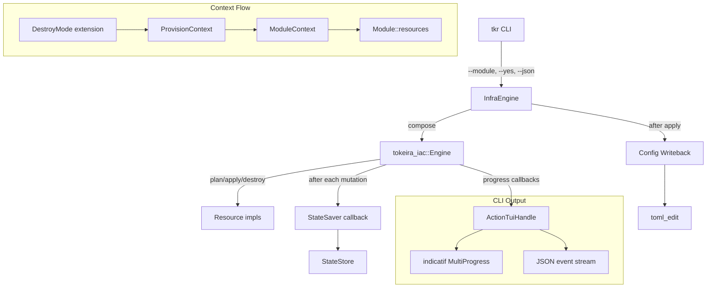
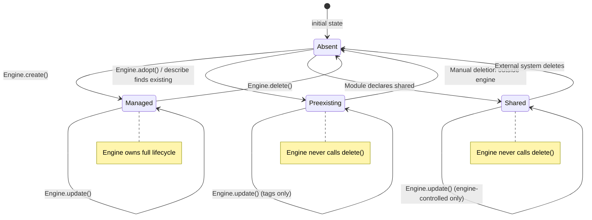

# Design Document: IaC Resource Lifecycle

## Overview

This design extends `tokeira-iac` with seven capabilities that close lifecycle management gaps leading to orphaned resources, stale state, and poor operator visibility:

1. **ResourceMode** — a persisted lifecycle classification (`Managed`, `Preexisting`, `Shared`) that controls destroy and diff behavior.
2. **DestroyMode context propagation** — a marker extension that tells modules to enumerate all managed resources from state, not just current config.
3. **Incremental StateSaver** — crash-safe state persistence after every mutation (already partially implemented; this formalizes the contract).
4. **Module-scoped delete suppression** — prevents `--module X` from deleting resources owned by module Y.
5. **Config writeback** — writes infrastructure outputs back to `tokeirad.toml` preserving TOML formatting.
6. **CLI progress reporting** — `ActionTuiHandle` using `indicatif` for spinners, progress, and JSON output.
7. **Describe-before-delete** — verifies resource existence before deletion during destroy (already implemented; this adds mode-awareness).

All changes are additive to the existing `Resource` trait. The `mode()` method is a required trait method — all existing `Resource` implementations must be updated to declare their lifecycle mode explicitly. This ensures no resource silently defaults to a mode the author didn't intend.

## Architecture



### Crate Boundaries

| Change | Crate | Rationale |
|--------|-------|-----------|
| `ResourceMode` enum, `Resource::mode()` default method | `tokeira-iac` | Core trait extension |
| `DestroyMode` marker struct | `tokeira-iac` | Engine-internal context |
| Mode-aware diff/destroy logic | `tokeira-iac` | Engine algorithm |
| `ActionTuiHandle`, `OutputFormat` | `apps/tkr` | CLI-only presentation |
| `console`, `indicatif` dependencies | `apps/tkr/Cargo.toml` | Binary crate only |
| Config writeback (already exists) | `apps/tkr` | No change needed |

## Components and Interfaces

### ResourceMode Enum

```rust
// crates/tokeira-iac/src/lib.rs

/// Lifecycle classification for a managed resource.
///
/// Controls how the engine handles the resource during destroy and diff:
/// - Managed: engine created it, engine can delete it
/// - Preexisting: engine adopted it, engine must not delete it
/// - Shared: engine uses it, another system owns deletion
#[derive(Debug, Clone, Copy, PartialEq, Eq, Hash, Serialize, Deserialize, Default)]
#[serde(rename_all = "snake_case")]
pub enum ResourceMode {
    /// Engine created this resource and owns its full lifecycle.
    #[default]
    Managed,
    /// Engine adopted this resource from a preexisting provider object.
    /// The engine may update tags/associations but will never delete it.
    Preexisting,
    /// Engine references this resource but another system owns deletion.
    /// The engine will not delete it and uses minimal diff comparison.
    Shared,
}
```

### Resource Trait Extension

```rust
// crates/tokeira-iac/src/lib.rs — added to the Resource trait

#[async_trait::async_trait]
pub trait Resource: Send + Sync {
    // ... existing methods unchanged ...

    /// Lifecycle mode for this resource.
    ///
    /// Every resource must explicitly declare its mode:
    /// - `Managed`: engine created it and owns its full lifecycle (create + delete)
    /// - `Preexisting`: engine adopted it; may update tags but will never delete
    /// - `Shared`: engine references it; another system owns deletion
    fn mode(&self) -> ResourceMode;
}
```

This is a required method — all existing `Resource` implementations in `platforms/compose/`, `platforms/local/`, and `tokeira-aws` must be updated to return `ResourceMode::Managed` (or the appropriate mode). This is intentional: every resource must explicitly declare its lifecycle contract rather than silently inheriting a default.

### DestroyMode Marker

```rust
// crates/tokeira-iac/src/lib.rs

/// Marker extension registered in `ProvisionContext` during destroy operations.
///
/// Modules inspect this via `ModuleContext::extension::<DestroyMode>()` to
/// decide whether to include state-only resources in the known set.
#[derive(Debug, Clone, Copy)]
pub struct DestroyMode;
```

### ResourceState Mode Persistence

The `mode` field is stored as a top-level field on `ResourceState` (not inside `properties`):

```rust
// crates/tokeira-iac/src/lib.rs

#[derive(Debug, Clone, Serialize, Deserialize)]
pub struct ResourceState {
    pub resource_type: ResourceType,
    pub physical_id: String,
    pub properties: serde_json::Value,
    pub dependencies: Vec<ResourceId>,
    pub created_at: String,
    pub updated_at: String,
    pub module: String,
    /// Lifecycle mode. Defaults to Managed for backward compatibility
    /// with state files that predate this field.
    #[serde(default)]
    pub mode: ResourceMode,
}
```

Using `#[serde(default)]` ensures that state files without the `mode` field deserialize with `ResourceMode::Managed` (the `Default` impl).

### InfraComposition (Unchanged)

The existing `InfraComposition` struct already carries the three module lists needed:

```rust
pub struct InfraComposition {
    pub desired_modules: Vec<Box<dyn Module>>,
    pub known_modules: Vec<Box<dyn Module>>,
    pub active_modules: Vec<String>,
}
```

No structural changes needed. The semantic change is that during destroy, `known_modules` is populated from persisted state (via DestroyMode-aware module enumeration) rather than solely from current config.

### StateSaver Callback (Existing — Formalized)

The `StateSaver` type already exists:

```rust
pub type StateSaver = Box<
    dyn Fn(
            &crate::document::InfraState,
        ) -> Pin<Box<dyn Future<Output = Result<(), IacError>> + Send + '_>>
        + Send
        + Sync,
>;
```

**Contract formalization:**
- Called exactly once after each successful create, update, or delete operation.
- Called after pruning stale resources during refresh (when `has_managed_missing` is true).
- If it returns `Err`, the engine aborts immediately and propagates the error.
- The engine MUST NOT batch multiple mutations before calling the saver.

### ActionTuiHandle (New — CLI Only)

```rust
// apps/tkr/src/tui.rs

use std::time::{Duration, Instant};

use console::style;
use indicatif::{MultiProgress, ProgressBar, ProgressStyle};
use tokeira_iac::{ResourceId, ResourceType};

/// Output format for CLI operations.
#[derive(Debug, Clone, Copy, PartialEq, Eq)]
pub enum OutputFormat {
    /// Human-readable terminal UI with spinners and colors.
    Human,
    /// Structured JSON events, one per line.
    Json,
}

/// Progress reporting handle for infrastructure operations.
///
/// Wraps `indicatif::MultiProgress` for human output or emits JSON events
/// for machine consumption. Installed as progress reporters on
/// `ProvisionContext` before calling the engine.
#[derive(Debug)]
pub struct ActionTuiHandle {
    format: OutputFormat,
    multi: MultiProgress,
    start: Instant,
    completed: usize,
    failed: usize,
    skipped: usize,
}

/// A single JSON progress event emitted when `--json` is active.
#[derive(Debug, serde::Serialize)]
#[serde(tag = "event", rename_all = "snake_case")]
pub enum ProgressEvent {
    OperationStart {
        action: String,
        resource_id: String,
        resource_type: String,
        index: usize,
        total: usize,
    },
    OperationComplete {
        action: String,
        resource_id: String,
        resource_type: String,
        elapsed_ms: u64,
    },
    WaitProgress {
        resource_id: String,
        resource_type: String,
        phase: String,
        elapsed_ms: u64,
        timeout_ms: u64,
    },
    Note {
        resource_id: String,
        resource_type: String,
        message: String,
    },
    Summary {
        completed: usize,
        failed: usize,
        skipped: usize,
        elapsed_ms: u64,
    },
}

impl ActionTuiHandle {
    pub fn new(format: OutputFormat) -> Self {
        Self {
            format,
            multi: MultiProgress::new(),
            start: Instant::now(),
            completed: 0,
            failed: 0,
            skipped: 0,
        }
    }

    /// Install progress reporters on the provision context.
    pub fn install(&self, ctx: &mut tokeira_iac::ProvisionContext) {
        // Closures capture format and multi-progress handle,
        // wire into ctx.set_apply_progress / set_wait_progress / set_note_progress
    }

    /// Print the final summary line.
    pub fn print_summary(&self) {
        match self.format {
            OutputFormat::Human => {
                println!(
                    "\n{} {} completed, {} failed, {} skipped in {:.1}s",
                    style("Done:").bold(),
                    self.completed,
                    self.failed,
                    self.skipped,
                    self.start.elapsed().as_secs_f64()
                );
            }
            OutputFormat::Json => {
                let event = ProgressEvent::Summary {
                    completed: self.completed,
                    failed: self.failed,
                    skipped: self.skipped,
                    elapsed_ms: self.start.elapsed().as_millis() as u64,
                };
                println!("{}", serde_json::to_string(&event).unwrap());
            }
        }
    }
}
```

### Config Writeback (Existing — No Changes)

The `write_tokeirad_writeback` function in `apps/tkr/src/commands/infra.rs` already implements dotted-key TOML insertion using `toml_edit`. It:
- Creates intermediate tables when paths don't exist
- Overwrites existing values
- Preserves TOML formatting and comments (via `toml_edit::DocumentMut`)

No changes needed. The design formalizes the existing behavior as a requirement.

## Data Models

### State Machine: Resource Lifecycle



### Valid State Transitions

| Current Mode | Operation | Result | Condition |
|---|---|---|---|
| (absent) | create | Managed | Resource.mode() == Managed |
| (absent) | adopt | Preexisting | Resource.mode() == Preexisting |
| (absent) | reference | Shared | Resource.mode() == Shared |
| Managed | update | Managed | — |
| Managed | delete | (absent) | destroy or removed from desired |
| Preexisting | update | Preexisting | tags/associations only |
| Preexisting | delete | **FORBIDDEN** | invariant violation |
| Shared | update | Shared | engine-controlled fields only |
| Shared | delete | **FORBIDDEN** | invariant violation |

### Refresh State Algorithm (Four-Status Model)

The existing `refresh_state` function uses four statuses. The mode-aware extension adds filtering:

```rust
enum RefreshStatus {
    DesiredLive,      // Resource wanted and exists → keep in state
    DesiredMissing,   // Resource wanted but absent → will be created
    ManagedLive,      // Not desired, exists → candidate for deletion
    ManagedMissing,   // Not desired, absent → prune from state
}
```

**Algorithm (unchanged from current, formalized):**

1. Compute `desired_ids` from the desired resource set.
2. Topologically sort the known resource set.
3. For each resource in sorted order:
   a. Call `describe(ctx)` to get live provider state.
   b. If `Some(live_state)`: insert into refreshed state, classify as `DesiredLive` or `ManagedLive`.
   c. If `None`: remove from refreshed state, classify as `DesiredMissing` or `ManagedMissing`.
4. If any `ManagedMissing` found, set `has_managed_missing = true`.
5. Return `RefreshReport { state, status_by_id, has_managed_missing }`.

**Mode-aware addition:** After refresh, before computing changes, filter out resources where `mode != Managed` from the delete candidate set.

### Apply Changes Algorithm

```
apply_changes(known, ctx, changes, saver):
  1. Build resource_map: ResourceId → &dyn Resource
  2. Topologically sort known resources
  3. Count total_operations (non-NoChange changes)
  4. Forward pass (topological order) — creates and updates:
     for each resource_id in sorted order:
       if change is Create:
         emit_apply_progress("create", ...)
         state = resource.create(ctx)
         ctx.state.insert(resource_id, state)  // mode comes from ResourceState
         saver(&ctx.state)?                    // incremental save
       if change is Update:
         emit_apply_progress("update", ...)
         state = resource.update(current, ctx)
         ctx.state.insert(resource_id, state)
         saver(&ctx.state)?
  5. Reverse pass (reverse topological order) — deletes:
     collect delete_ids from changes
     topological_sort_from_state(delete_ids)
     reverse the order
     for each resource_id in reversed order:
       SKIP if resource.mode() != Managed     // MODE-AWARE ADDITION
       emit_apply_progress("delete", ...)
       resource.delete(current, ctx)
       ctx.state.remove(resource_id)
       saver(&ctx.state)?
  6. Return changes
```

### Destroy Changes Algorithm

```
destroy_changes(known, ctx, changes, saver):
  1. Build resource_map: ResourceId → &dyn Resource
  2. Collect delete_ids from changes
  3. Topological sort from state, then reverse
  4. For each resource_id in reversed order:
     if resource.mode() != Managed:           // MODE-AWARE: skip non-managed
       ctx.state.remove(resource_id)          // remove from state but don't delete
       saver(&ctx.state)?
       continue
     describe(ctx) → live_state?
       None → prune from state (already absent)
              ctx.state.remove(resource_id)
              saver(&ctx.state)?
       Some(live) → delete(live, ctx)         // use LIVE state, not stale
                    ctx.state.remove(resource_id)
                    saver(&ctx.state)?
       Err(e) → propagate error, abort
  5. Return changes
```

### DestroyMode Propagation Flow

```
CLI (tkr infra destroy --yes)
  → InfraEngine::destroy(composition)
    → ctx.set_extension(DestroyMode)          // register marker
    → engine.destroy(composition, ctx, saver)
      → collect_resources_from(known_modules, ctx)
        → ModuleContext::new(state, extensions)  // extensions include DestroyMode
        → module.resources(module_ctx)
          → module_ctx.extension::<DestroyMode>()  // module checks this
          → if Some(_): enumerate from state (all managed resources)
          → if None: enumerate from config only
```

### Module-Scoped Delete Filtering

The existing `filter_changes_by_modules` function already implements this correctly:

```rust
fn filter_changes_by_modules(
    changes: &[Change],
    state: &InfraState,
    active_modules: &[&str],
) -> Vec<Change> {
    let active: HashSet<&str> = active_modules.iter().copied().collect();
    changes
        .iter()
        .filter(|change| match change.kind {
            ChangeKind::Delete => state
                .resources
                .get(&ResourceId(change.resource.clone()))
                .map(|rs| active.contains(rs.module.as_str()))
                .unwrap_or(false),
            _ => true,  // Create, Update, NoChange always pass through
        })
        .cloned()
        .collect()
}
```

No changes needed to this function. The design formalizes its behavior as a requirement.

### Config Writeback Algorithm

```
write_tokeirad_writeback(deployment_path, values):
  if values.is_empty(): return Ok(())
  path = deployment_path / "tokeirad.toml"
  document = parse path as toml_edit::DocumentMut
  for (dotted_key, value) in values:
    parts = dotted_key.split('.')
    navigate/create intermediate tables
    set leaf value
  write document back to path (preserves comments, formatting)
```

This is already implemented in `apps/tkr/src/commands/infra.rs`.

## Correctness Properties

*A property is a characteristic or behavior that should hold true across all valid executions of a system — essentially, a formal statement about what the system should do. Properties serve as the bridge between human-readable specifications and machine-verifiable correctness guarantees.*

### Property 1: ResourceMode Serialization Round-Trip

*For any* valid `ResourceMode` value, serializing to JSON and deserializing back SHALL produce an equivalent value.

**Validates: Requirements 1.6**

### Property 2: ResourceMode Backward Compatibility Default

*For any* valid `ResourceState` JSON that does not contain a `mode` field, deserializing SHALL produce a `ResourceState` with `mode == ResourceMode::Managed`.

**Validates: Requirements 1.5**

### Property 3: Engine Persists Correct Mode After Mutation

*For any* resource with a declared `ResourceMode`, after the engine performs a create or update operation, the resulting `ResourceState` in `ctx.state` SHALL have `mode` equal to the resource's `mode()` return value.

**Validates: Requirements 1.1, 1.2, 1.3, 1.4**

### Property 4: Destroy Excludes Non-Managed Resources

*For any* destroy or plan/apply operation on a set of resources containing resources with mode `Preexisting` or `Shared`, the engine SHALL never call `delete()` on those resources, and the resulting change set SHALL never contain a `Delete` change for those resources.

**Validates: Requirements 2.4, 8.5**

### Property 5: StateSaver Invocation Count Equals Mutation Count

*For any* sequence of N successful mutating operations (creates + updates + deletes), the `StateSaver` callback SHALL be invoked exactly N times.

**Validates: Requirements 3.1, 3.2, 3.3, 3.6**

### Property 6: StateSaver Error Aborts Engine

*For any* sequence of operations where the `StateSaver` returns an error at invocation K, the engine SHALL complete at most K mutating operations and return an error.

**Validates: Requirements 3.4**

### Property 7: Module-Scoped Delete Filtering

*For any* set of changes and any active module set, the filtered change set SHALL contain Delete changes only for resources whose persisted module is in the active set, and SHALL preserve all Create, Update, and NoChange entries unchanged.

**Validates: Requirements 4.1, 4.2, 4.3, 4.4, 4.5**

### Property 8: TOML Writeback Round-Trip

*For any* set of N dotted-key/value pairs where keys are valid TOML paths and values are non-empty strings, writing them to a TOML document and reading back the values at those paths SHALL produce the original values.

**Validates: Requirements 5.2, 5.3, 5.4, 5.6**

### Property 9: Describe-Before-Delete Count

*For any* destroy operation on N resources in state where K resources are absent (describe returns None), the engine SHALL call `delete()` exactly N-K times (on the resources that are present).

**Validates: Requirements 7.1, 7.2, 7.5**

### Property 10: Describe-Before-Delete Uses Live State

*For any* resource where `describe()` returns `Some(live_state)` during destroy, the engine SHALL pass `live_state` (not the persisted state) to `delete()`.

**Validates: Requirements 7.3**

## Error Handling

| Error Condition | Behavior | Recovery |
|---|---|---|
| `StateSaver` returns error | Engine aborts immediately, returns error | Operator re-runs; state reflects last successful save |
| `describe()` fails during refresh | Engine returns error, no state mutation | Operator fixes provider access, re-runs |
| `describe()` fails during destroy | Engine aborts destroy for that resource | Operator fixes access or manually deletes |
| `delete()` fails | Engine returns error, resource remains in state | Operator re-runs destroy (idempotent) |
| TOML writeback fails | CLI returns error after successful apply | State is saved; operator manually updates config |
| Module dependency cycle | `IacError::DependencyResolution` before any mutations | Operator fixes module dependencies |
| Resource dependency cycle | `IacError::DependencyResolution` before any mutations | Operator fixes resource dependencies |

**Error propagation principle:** Errors during mutations are always propagated immediately. The StateSaver ensures that any successfully completed operations are persisted before the error reaches the caller. This means re-running after a failure is always safe — the engine will see the already-created resources via `describe()` and skip or update them.

## Testing Strategy

### Property-Based Tests (proptest)

Each correctness property maps to a `proptest` test with minimum 100 iterations:

| Property | Generator Strategy | Assertion |
|---|---|---|
| 1: Mode round-trip | `prop_oneof![Managed, Preexisting, Shared]` | `deserialize(serialize(mode)) == mode` |
| 2: Backward compat | Random `ResourceState` JSON without `mode` | `parsed.mode == Managed` |
| 3: Mode persistence | Random resources with random modes | `ctx.state[rid].mode == resource.mode()` |
| 4: No delete non-managed | Random resource sets with mixed modes | `deletes.all(\|d\| d.mode == Managed)` |
| 5: Saver count | Random N operations | `saver_call_count == N` |
| 6: Saver error aborts | Random K ∈ [1, N] | `completed_ops <= K` |
| 7: Module filter | Random changes + random active set | `deletes ⊆ active_module_resources` |
| 8: TOML round-trip | Random dotted keys + values | `read_back(key) == value` |
| 9: Delete count | Random N resources, K absent | `delete_calls == N - K` |
| 10: Live state | Random resources with divergent describe | `delete_arg == describe_result` |

**Test configuration:**
- Library: `proptest` (already in workspace)
- Minimum iterations: 100 per property
- Tag format: `// Feature: iac-resource-lifecycle, Property N: <title>`

### Unit Tests (Example-Based)

- DestroyMode extension propagation through ProvisionContext → ModuleContext
- CLI `ActionTuiHandle` emits correct JSON events
- `OutputFormat::Json` produces valid JSON for all event types
- Summary counts match actual operation outcomes
- Backward compatibility: existing state files without `mode` field load correctly

### Integration Tests

- Full plan → apply → destroy cycle with mixed-mode resources
- Module-scoped apply does not touch other modules' resources
- Crash recovery: kill mid-apply, verify state is consistent on re-run
- Config writeback preserves existing TOML comments

### New Dependencies

| Dependency | Crate | Purpose |
|---|---|---|
| `console` | `apps/tkr` | Colored terminal output, style helpers |
| `indicatif` | `apps/tkr` | Multi-progress bars, spinners |

Both are added only to the binary crate (`apps/tkr`), not to library crates.
