# Design Document: Image Lifecycle

## Overview

This design turns `requirements.md` into a concrete Rust implementation by strengthening the IaC abstractions that already exist in `tokeira-deploy-engine` and distributing responsibility across three clearly-bounded crates.

The design follows a clean separation between **image resolution** (what ref does a service deploy against) and **image production** (how do we build, push, or mirror a specific image):

1. **`tokeira-deploy-engine::image`** — owns the `Image` trait, `ImageSourceType`, `DesiredImageRef`, `ImageContext`, and the new `WritebackTarget`. This is the deployment-resolution abstraction. Knows nothing about Dagger, Docker, or any build pipeline.
2. **`platforms/compose/src/images/`** and **`platforms/ecs/src/images/`** — each platform owns its own concrete `Image` trait implementations. `TokeiradImage` reads that platform's config type directly; `observability` images likewise. There is no cross-platform import, no shared image-config DTO, and no adapter pattern — duplication across platforms is deliberate and bounded.
3. **`tokeira-build`** — a library crate containing Dagger-backed free-function pipelines (`build_tokeirad_image`, `publish_image`, `mirror_image`). Each pipeline hardcodes its image recipe. The crate is not aware of the `Image` trait, does not walk any image registry, and has no dependency on any platform crate.

Around those three, this spec also delivers:

4. **`crates/dagger-client/`** — an in-repo minimal GraphQL wrapper over a Dagger session, consumed by `tokeira-build` via a `DaggerClient` trait so unit tests can substitute a mock.
5. **`EcrRepository` IaC resource** in `tokeira-aws` with the canonical "keep last 10 untagged" lifecycle policy, an `EcrClient` trait, an `EcrClientHandle` `ProvisionContext` extension, and ad-hoc `ensure_ecr_repository` / `ensure_ecr_repositories` helpers for pre-apply image flows.
6. **`ImagesModule`** IaC module in `platforms/ecs/src/modules/images.rs` that enumerates `platforms::ecs::images::all(ctx)` and registers one `EcrRepository` per image, so `tkr infra plan` / `tkr infra destroy` see every project-owned repository.
7. **`tkr image list|build|push|mirror`** in `apps/tkr`. Handlers iterate the active platform's image set rather than carrying hardcoded image knowledge. `build` is the one exception: it is deployment-free and has static knowledge that `tokeirad` is the only buildable image today.
8. **`tokeira_iac::write_config_values`** — public writeback helper extracted from the existing private implementation in `apps/tkr/src/commands/infra.rs`. Consumed by both `tkr infra` and `tkr image`.
9. **Platform lifecycle gates** — ECS `validate_mirrors` / `validate_builds` (pure predicates over a platform's image list + config). Compose `validate_local_build` plus a `DockerImageInspector` trait so the gate is mockable without a live Docker daemon.

### Guiding principles

1. **The trait is the deployment-resolution abstraction.** `Image` tells the deployment layer what ref a service needs. It does not describe how to produce that ref. Pipelines are not methods on the trait; they are free functions in a separate crate.
2. **Each platform owns its own images.** The `TokeiradImage` in the compose platform reads `ComposeConfig`. The `TokeiradImage` in the ECS platform reads `EcsConfig`. There is no sharing. A small `mirror_image!` macro inside each platform keeps the six observability impls compact.
3. **Build is deployment-free.** `tkr image build` has hardcoded knowledge of buildable images (today, just `tokeirad`). It does not consult any platform, does not construct an `ImageContext`, and does not require `--deployment`.
4. **List, push, and mirror dispatch on the active platform.** Only these subcommands need `ImageContext`; they construct it by registering the active platform's config on the context.
5. **Writeback is an image property.** Each image declares which `deployment.toml` dotted keys its remote ref populates. The CLI iterates the list — it does not enumerate fields itself.
6. **`DaggerClient` is a first-class public trait.** Pipeline functions take `&dyn DaggerClient`; tests substitute a mock; production callers obtain the default via `dagger_client::Client::from_env()`.
7. **Missing context extensions are operator-facing errors, not panics.** Concrete `Image` impls and `EcrRepository` lifecycle methods use fallible `ctx.extension::<T>().ok_or_else(...)` lookups that surface as `RuntimeError::Image(_)` or `IacError::Other(anyhow!(...))`.
8. **One wiring path for image context.** `DeployEngine::new` and every `tkr image` handler that needs an `ImageContext` populates it through the same `Deployment::register_image_extensions` hook. `tkr image build` is the only subcommand that skips this — it is deployment-free by design.
9. **Structured refs are persisted via the existing state shape.** Widening `desired_ref` to return `DesiredImageRef` is additive at the wire. The deploy engine formats `repository:tag` into `ImageState.resolved_ref` and maps `ImageSourceType` onto the existing `ImageSource` variants. No state-format migration.

## Architecture

```mermaid
graph TD
    Build["tkr image build"] --> BuildHandler["apps/tkr build handler"]
    List["tkr image list"] --> ListHandler["apps/tkr list handler"]
    Push["tkr image push"] --> PushHandler["apps/tkr push handler"]
    Mirror["tkr image mirror"] --> MirrorHandler["apps/tkr mirror handler"]

    BuildHandler -->|"free function, hardcoded"| BuildFn["tokeira_build::build_tokeirad_image"]
    BuildHandler -->|optional| PublishFn["tokeira_build::publish_image"]

    ListHandler -->|"platform dispatch"| ComposeImages["platforms::compose::images::all(ctx)"]
    ListHandler -->|"platform dispatch"| EcsImages["platforms::ecs::images::all(ctx)"]

    PushHandler -->|ECS only| EcsImages
    PushHandler --> PublishFn
    PushHandler --> EnsureRepos["ensure_ecr_repositories"]

    MirrorHandler -->|ECS only| EcsImages
    MirrorHandler --> MirrorFn["tokeira_build::mirror_image"]
    MirrorHandler --> EnsureRepos

    ComposeImages --> CTI["TokeiradImage reads ComposeConfig"]
    ComposeImages --> COBS["observability images read ComposeConfig"]
    EcsImages --> ETI["TokeiradImage reads EcsConfig"]
    EcsImages --> EOBS["observability images read EcsConfig"]

    CTI -.->|implements| ImageTrait["tokeira_deploy_engine::Image trait"]
    COBS -.->|implements| ImageTrait
    ETI -.->|implements| ImageTrait
    EOBS -.->|implements| ImageTrait

    BuildFn --> DaggerTrait["DaggerClient trait"]
    PublishFn --> DaggerTrait
    MirrorFn --> DaggerTrait
    DaggerTrait -.->|default| DaggerClient["dagger_client::Client"]
    DaggerTrait -.->|test| MockDagger[MockDaggerClient]

    PushHandler -->|"image.writeback_targets(ctx)"| Writeback["tokeira_iac::write_config_values"]
    MirrorHandler -->|"image.writeback_targets(ctx)"| Writeback
    Writeback --> DeploymentToml["deployment.toml"]

    EnsureRepos --> EcrResource["EcrRepository Resource"]
    EcrResource --> EcrTrait["EcrClient trait"]
    EcrTrait -.->|default| AwsSdkEcr["aws-sdk-ecr"]
    EcrTrait -.->|test| MockEcr[MockEcrClient]

    subgraph "IaC Plane"
      InfraApply["tkr infra apply (ECS)"] --> ImagesModule["platforms::ecs::modules::ImagesModule"]
      ImagesModule -->|"one EcrRepository per image"| EcrResource
      InfraApply -->|"validate_mirrors(cfg, reg, images)"| MirrorGate["ECS mirror gate"]
    end

    subgraph "Deploy Plane"
      DeployApplyEcs["tkr deploy apply (ECS)"] -->|"validate_builds(cfg, reg, images)"| BuildGate["ECS build gate"]
      DeployApplyCompose["tkr deploy apply (compose)"] -->|"DockerImageInspector"| ComposeGate["compose local-build gate"]
    end
```



### Crate ownership

| Change | Crate | Rationale |
|---|---|---|
| Widen `Image::desired_ref` return to `Result<DesiredImageRef, RuntimeError>`; add `writeback_targets` default method; add `WritebackTarget`; add `validate_registry` helper | `tokeira-deploy-engine` | The deployment-resolution abstraction already lives here. This spec completes the contract. |
| Update `record_images` to format `DesiredImageRef` into `resolved_ref` and map `ImageSourceType` onto `ImageSource` | `tokeira-deploy-engine` | Consumer of the widened trait. Preserves the existing `ImageState` shape. |
| Add `Deployment::register_image_extensions` hook with a default empty implementation; call it from `DeployEngine::new` after `register_deploy_extensions` | `tokeira-orchestrator` | Single wiring path for populating `ImageContext` — used by `deploy apply` and by `tkr image` handlers. |
| `DaggerClient` trait + default over `dagger_client::Client` + `build_tokeirad_image` / `publish_image` / `mirror_image` free functions | New `crates/tokeira-build/` | Pipeline orchestration. Not part of the trait surface. No platform dependencies. |
| Minimal Dagger session GraphQL wrapper | New `crates/dagger-client/` | Replaces the heavyweight Dagger SDK. Reference implementation in `.kiro/specs/image-lifecycle/reference/`. |
| `TokeiradImage` + six `observability` impls + `all()` aggregator reading `ComposeConfig`; `register_image_extensions` impl on `ComposeDeployment` | New modules under `platforms/compose/src/images/` + `platforms/compose/src/lib.rs` | Each platform owns its own image set and its own `ImageContext` wiring. |
| `TokeiradImage` + six `observability` impls + `all()` aggregator reading `EcsConfig`; `register_image_extensions` impl on `EcsDeployment` | New modules under `platforms/ecs/src/images/` + `platforms/ecs/src/lib.rs` | Mirrors the compose split. |
| `EcrRepository` resource + `EcrClient` trait + default over `aws-sdk-ecr` + `EcrClientHandle` extension + `ensure_ecr_repository{,ies}` | `tokeira-aws` | Resource lives alongside VPC, DSQL, IAM; helpers and extension wrapper co-located. |
| `ImagesModule` IaC module registering `EcrRepository` resources from the ECS image set | New `platforms/ecs/src/modules/images.rs` | ECS-specific; local and compose platforms don't register it. |
| `tkr image` command group (4 subcommands) | `apps/tkr/src/commands/image.rs` | Follows the existing `commands/{group}.rs` pattern. |
| `aws_cli_image` and `busybox_image` fields on each platform's `ObservabilityConfig` | `platforms/compose` and `platforms/ecs` | Two new mirror targets; each platform's default values are identical but each platform owns its own declaration. |
| `tokeira_iac::write_config_values(path, values)` + `WritebackError` (extracted from private helper, signature made file-agnostic) | `tokeira-iac` | Shared public writeback API consumed by `tkr infra` (writes to `tokeirad.toml`) and by `tkr image push`/`mirror` (writes to `deployment.toml`). |
| Compose `validate_for_deploy_apply` hook + `gates::validate_local_build` + `DockerImageInspector` trait | `platforms/compose/src/{lib,gates}.rs` | The Docker-image-existence check lives where the bollard client lives; the trait makes the predicate mockable. |

Notably **not** changed:
- No new Dockerfile templater or manifest templating engine.
- No new CLI-level progress reporting — reuses the [`iac-resource-lifecycle`](../iac-resource-lifecycle/requirements.md) callbacks.
- No cross-platform image-config DTO or adapter layer. Each platform reads its own config type directly.
- No central image registry in `tokeira-build`. The build crate does not know the set of images that exist.
- No new error variants on `RuntimeError` or `IacError`. Existing `RuntimeError::Image(String)` and `IacError::Other(anyhow!(...))` cover the missing-extension case.

## Components and Interfaces

### 1. `Image` trait and associated types (in `tokeira-deploy-engine`)

The trait already exists. This spec widens `desired_ref` and adds `writeback_targets`:

```rust
// crates/tokeira-deploy-engine/src/image.rs

use std::{
    any::{Any, TypeId},
    collections::HashMap,
    fmt::Debug,
};

use serde::{Deserialize, Serialize};

use crate::RuntimeError;

/// How an image is produced.
#[derive(Debug, Clone, Copy, PartialEq, Eq, Serialize, Deserialize)]
pub enum ImageSourceType {
    /// Built from source via a build pipeline.
    Build,
    /// Mirrored from an upstream registry.
    Mirror,
    /// Pulled from a registry as-is.
    Registry,
}

/// Resolved desired image reference.
#[derive(Debug, Clone, PartialEq, Eq, Serialize, Deserialize)]
pub struct DesiredImageRef {
    /// Target repository name, without registry host prefix
    /// (e.g. "tokeira-dev/tokeirad").
    pub repository: String,
    /// Tag or digest. Never contains `/`, `@`, or `:`.
    pub tag: String,
    /// Upstream source reference for Mirror images. `None` for Build images.
    pub upstream_ref: Option<String>,
}

/// Context passed to `Image::desired_ref` and `Image::writeback_targets`.
///
/// Extensions provide access to platform config without coupling this crate
/// to any specific config type.
///
/// **`Box<dyn Any>` note.** This struct uses the sanctioned typed-extension-bag
/// pattern per the `AGENTS.md` Rust Standards — same idiom as `ProvisionContext`,
/// `ModuleContext`, and `ServiceContext`. The bag exists because
/// `tokeira-deploy-engine` is a platform-agnostic library crate: it cannot
/// depend on `tokeira-compose`, `platforms/compose`, or `platforms/ecs`, yet
/// concrete `Image` implementations in those downstream crates need access to
/// platform config at `desired_ref` time. The `HashMap<TypeId, Box<dyn Any +
/// Send + Sync>>` keyed by `TypeId::of::<T>()` is the one well-contained
/// violation per context type. This spec MUST NOT introduce any additional
/// `Box<dyn Any>` usage outside the four sanctioned context types.
pub struct ImageContext {
    pub state: tokeira_iac::RuntimeState,
    extensions: HashMap<TypeId, Box<dyn Any + Send + Sync>>,
}

impl ImageContext {
    pub fn new(state: tokeira_iac::RuntimeState) -> Self { /* ... */ }
    pub fn extension<T: 'static + Send + Sync>(&self) -> Option<&T> { /* ... */ }
    pub fn set_extension<T: 'static + Send + Sync>(&mut self, value: T) { /* ... */ }
}

/// A single writeback target declared by an image.
#[derive(Debug, Clone, PartialEq, Eq)]
pub struct WritebackTarget {
    /// Dotted TOML key, e.g. "observability.mimir_image" or
    /// "services.runtime.image".
    pub field: &'static str,
}

pub trait Image: Debug + Send + Sync {
    fn name(&self) -> &str;
    fn source_type(&self) -> ImageSourceType;

    /// Compute the desired image reference given the current context.
    fn desired_ref(&self, ctx: &ImageContext) -> Result<DesiredImageRef, RuntimeError>;

    /// Declare which `deployment.toml` dotted keys this image's remote
    /// ref populates after push (Build) or mirror (Mirror).
    ///
    /// Default: no writeback.
    fn writeback_targets(&self, _ctx: &ImageContext) -> Vec<WritebackTarget> {
        Vec::new()
    }
}

/// Validate that a list of images has no duplicate names and no duplicate
/// repositories after resolving `desired_ref`.
///
/// Each platform's `images::all(ctx)` calls this before returning. Note that
/// duplicate detection is keyed by `repository` alone — a Build image and a
/// Mirror image that resolve to the same `repository` would both be
/// materialised as the same `EcrRepository` by `ImagesModule` and must be
/// rejected here.
pub fn validate_registry(
    images: &[Box<dyn Image>],
    ctx: &ImageContext,
) -> Result<(), RuntimeError> {
    use std::collections::HashSet;
    let mut names = HashSet::new();
    let mut repos = HashSet::new();
    for img in images {
        if !names.insert(img.name().to_string()) {
            return Err(RuntimeError::Image(format!(
                "image registry validation failed: duplicate name = {}",
                img.name()
            )));
        }
        let desired = img.desired_ref(ctx)?;
        if !repos.insert(desired.repository.clone()) {
            return Err(RuntimeError::Image(format!(
                "image registry validation failed: duplicate repository = {}",
                desired.repository
            )));
        }
    }
    Ok(())
}
```

**Notes:**

- The widened return type replaces `Result<String, RuntimeError>` at the call site. No compatibility shim is needed; the trait has no external implementors yet.
- `writeback_targets` is a default-empty method so images whose refs are consumed only by operator tooling (not config) inherit sensible behavior.
- `validate_registry` lives on the trait's crate so both platforms call the same implementation without a cross-platform dependency.

### 1a. `Deployment::register_image_extensions` and `ImageContext` wiring

The `Deployment` trait gains one new method, mirroring the shape of the existing `register_deploy_extensions`:

```rust
// crates/tokeira-orchestrator/src/lib.rs

#[async_trait]
pub trait Deployment: Send + Sync {
    type Config: Send + Sync + Clone + 'static;
    // ... existing methods unchanged ...

    /// Register provider-specific handles on the image context.
    ///
    /// Concrete `Image` implementations retrieve these values through
    /// `ctx.extension::<T>()` when resolving `desired_ref` or
    /// `writeback_targets`. Default implementation is empty — platforms
    /// that publish no images (e.g. `local`) rely on the default.
    async fn register_image_extensions(
        &self,
        _config: &Self::Config,
        _ctx: &mut deploy_engine::ImageContext,
    ) -> Result<()> {
        Ok(())
    }
}
```

`DeployEngine::new` is updated to call the hook:

```rust
// crates/tokeira-orchestrator/src/lib.rs (updated)

pub async fn new(deployment: D, config: &D::Config, deployment_dir: &Path) -> Result<Self> {
    let mut service_ctx = deploy_engine::ServiceContext::default();
    let mut image_ctx = deploy_engine::ImageContext::default();

    deployment
        .register_deploy_extensions(config, &mut service_ctx)
        .await?;
    // NEW: populate the image context before any Image trait method runs.
    deployment
        .register_image_extensions(config, &mut image_ctx)
        .await?;

    // ... rest unchanged ...
}
```

Each platform implements the hook once:

```rust
// platforms/compose/src/lib.rs (excerpt)

#[async_trait]
impl Deployment for ComposeDeployment {
    type Config = ComposeConfig;
    // ... existing methods ...

    async fn register_image_extensions(
        &self,
        config: &Self::Config,
        ctx: &mut deploy_engine::ImageContext,
    ) -> Result<()> {
        ctx.set_extension(config.clone());
        Ok(())
    }
}
```

The ECS platform registers `EcsConfig` the same way. The local platform leaves the default empty implementation — it declares no images.

**CLI handlers use the same hook.** `tkr image list|push|mirror` construct their `ImageContext` through the same call:

```rust
// apps/tkr/src/commands/image.rs (excerpt)

async fn build_image_context<D: Deployment>(
    deployment: &D,
    config: &D::Config,
) -> Result<deploy_engine::ImageContext> {
    let mut ctx = deploy_engine::ImageContext::default();
    deployment.register_image_extensions(config, &mut ctx).await?;
    Ok(ctx)
}
```

`tkr image build` never calls this — the build handler is deployment-free and constructs no `ImageContext` at all.

### 1b. Structured desired refs mapped to `ImageState`

`ServiceEngine::record_images` already writes to `tokeira_iac::ImageState`. Widening `Image::desired_ref` changes what the method receives, not what it writes. The existing `ImageState` shape (`resolved_ref: String`, `source: ImageSource` with `Built` / `Mirrored { upstream_ref }` / `PullThrough { upstream_ref }` variants) absorbs the structured result without a state-format migration:

```rust
// crates/tokeira-deploy-engine/src/engine.rs (updated)

pub async fn record_images(
    &self,
    images: &[Box<dyn Image>],
    ctx: &ImageContext,
    state: &mut tokeira_iac::RuntimeState,
) -> Result<(), RuntimeError> {
    for image in images {
        let desired = image.desired_ref(ctx)?;  // now Result<DesiredImageRef, _>

        let resolved_ref = format!("{}:{}", desired.repository, desired.tag);

        let source = match image.source_type() {
            ImageSourceType::Build => tokeira_iac::ImageSource::Built,
            ImageSourceType::Mirror => {
                let upstream = desired.upstream_ref.clone().ok_or_else(|| {
                    RuntimeError::Image(format!(
                        "image '{}' is Mirror but desired_ref.upstream_ref is None",
                        image.name()
                    ))
                })?;
                tokeira_iac::ImageSource::Mirrored { upstream_ref: upstream }
            }
            ImageSourceType::Registry => tokeira_iac::ImageSource::PullThrough {
                // Registry is the only variant where a missing upstream_ref
                // is acceptable — the field is informational only per Req 1.6.
                upstream_ref: desired.upstream_ref.clone().unwrap_or_default(),
            },
        };

        state.images.insert(
            image.name().to_string(),
            tokeira_iac::ImageState {
                name: image.name().to_string(),
                resolved_ref,
                digest: None,
                published_at: chrono::Utc::now().to_rfc3339(),
                source,
            },
        );
    }
    Ok(())
}
```

**Design notes:**

- `resolved_ref` is project-scoped (`"tokeira-dev/tokeirad:latest"`), not registry-qualified. Registry qualification happens in the push/mirror handlers because those are the consumers that care about which registry host they are targeting.
- The Mirror branch panics `desired.upstream_ref.is_none()` into a `RuntimeError::Image` — Property 2 prevents this in practice, but the check is cheap and the error message is operator-facing.
- The Registry branch tolerates `None` by falling back to the empty string (the state is informational for Registry images; no writeback or push flow reads this field). See Req 1.6 for the Registry contract.
- Nothing is removed from `ImageState` or `ImageSource`. Future additions are strictly additive per the workspace rule that the state format is append-only.

### 1c. `Registry` source-type semantics

`ImageSourceType::Registry` exists today but is not used by any image declared in this spec. Req 1.6 pins down a contract so that a future `RegistryImage` implementation has unambiguous semantics:

- `DesiredImageRef.repository` carries the full registry-qualified reference (`public.ecr.aws/.../...`), not a project-scoped suffix. The project-prefix validation in Req 1.1.4 exempts Registry.
- `DesiredImageRef.upstream_ref` may be `None` or `Some(_)`. When `Some`, it mirrors `repository:tag` for informational purposes.
- `writeback_targets` defaults to empty. Registry images are authored by operators in config; they are not discovered by `tkr image` machinery.
- The per-platform property tests (Properties 1, 2, 7) skip Registry images or assert only the Registry-specific invariants.

No Registry images ship in this spec. A future `RegistryImage` struct (for example, an operator-supplied sidecar that does not need mirroring) would live alongside `TokeiradImage` and the observability structs in the platform's `images/` module.

### 2. Compose platform image modules

The compose platform splits image construction from image validation. `construct()` is synchronous and context-free — `ComposeDeployment::images(&self, config)` calls it directly. `all(ctx)` additionally runs `validate_registry` and is used by CLI handlers that already have an `ImageContext`.

```rust
// platforms/compose/src/images/mod.rs

mod tokeirad;
mod observability;

use tokeira_deploy_engine::image::{Image, ImageContext, RuntimeError, validate_registry};

/// Return the full image list without context or validation.
///
/// Called by `ComposeDeployment::images(&self, config)`, which receives no
/// context. The deploy engine runs `register_image_extensions` before
/// `record_images`, so `desired_ref` calls see the registered
/// `ComposeConfig` at invocation time.
pub fn construct() -> Vec<Box<dyn Image>> {
    let mut out: Vec<Box<dyn Image>> = Vec::new();
    out.extend(tokeirad::all());
    out.extend(observability::all());
    out
}

/// Context-aware variant: constructs, then validates.
pub fn all(ctx: &ImageContext) -> Result<Vec<Box<dyn Image>>, RuntimeError> {
    let out = construct();
    validate_registry(&out, ctx)?;
    Ok(out)
}
```

```rust
// platforms/compose/src/images/tokeirad.rs

use tokeira_deploy_engine::image::*;
use crate::config::ComposeConfig;

#[derive(Debug)]
pub struct TokeiradImage;

impl Image for TokeiradImage {
    fn name(&self) -> &str { "tokeirad" }
    fn source_type(&self) -> ImageSourceType { ImageSourceType::Build }

    fn desired_ref(&self, ctx: &ImageContext) -> Result<DesiredImageRef, RuntimeError> {
        let cfg = ctx.extension::<ComposeConfig>().ok_or_else(|| {
            RuntimeError::Image(format!(
                "image context missing extension: {}",
                std::any::type_name::<ComposeConfig>()
            ))
        })?;
        Ok(DesiredImageRef {
            repository: format!("{}/tokeirad", cfg.project_name),
            tag: "latest".into(),
            upstream_ref: None,
        })
    }

    fn writeback_targets(&self, _ctx: &ImageContext) -> Vec<WritebackTarget> {
        vec![WritebackTarget { field: "tokeirad.image" }]
    }
}

pub fn all() -> Vec<Box<dyn Image>> {
    vec![Box::new(TokeiradImage)]
}
```

```rust
// platforms/compose/src/images/observability/mod.rs

use tokeira_deploy_engine::image::*;
use crate::config::ComposeConfig;

/// Declare a Mirror image with upstream ref sourced from a
/// `ComposeConfig.observability.*_image` field.
///
/// The macro lives inside this module — it is not shared with the ECS
/// platform. Each platform defines its own macro over its own config type.
macro_rules! mirror_image {
    (
        $struct_name:ident,
        name = $name:literal,
        repo_suffix = $suffix:literal,
        upstream_field = $field_ident:ident,
        writeback = $writeback_field:literal
    ) => {
        #[derive(Debug)]
        pub struct $struct_name;

        impl Image for $struct_name {
            fn name(&self) -> &str { $name }
            fn source_type(&self) -> ImageSourceType { ImageSourceType::Mirror }

            fn desired_ref(&self, ctx: &ImageContext) -> Result<DesiredImageRef, RuntimeError> {
                let cfg = ctx.extension::<ComposeConfig>().ok_or_else(|| {
                    RuntimeError::Image(format!(
                        "image context missing extension: {}",
                        std::any::type_name::<ComposeConfig>()
                    ))
                })?;
                let upstream = cfg.observability.$field_ident.clone();
                if upstream.is_empty() {
                    return Err(RuntimeError::Image(format!(
                        "image '{}' has empty upstream_ref in config",
                        $name
                    )));
                }
                let tag = image_tag(&upstream).unwrap_or("latest").to_string();
                Ok(DesiredImageRef {
                    repository: format!("{}/{}", cfg.project_name, $suffix),
                    tag,
                    upstream_ref: Some(upstream),
                })
            }

            fn writeback_targets(&self, _ctx: &ImageContext) -> Vec<WritebackTarget> {
                vec![WritebackTarget { field: $writeback_field }]
            }
        }
    };
}

mirror_image!(MimirImage,   name = "grafana-mimir",  repo_suffix = "grafana-mimir",  upstream_field = mimir_image,   writeback = "observability.mimir_image");
mirror_image!(LokiImage,    name = "grafana-loki",   repo_suffix = "grafana-loki",   upstream_field = loki_image,    writeback = "observability.loki_image");
mirror_image!(GrafanaImage, name = "grafana-oss",    repo_suffix = "grafana-oss",    upstream_field = grafana_image, writeback = "observability.grafana_image");
mirror_image!(AlloyImage,   name = "grafana-alloy",  repo_suffix = "grafana-alloy",  upstream_field = alloy_image,   writeback = "observability.alloy_image");
mirror_image!(AwsCliImage,  name = "aws-cli",        repo_suffix = "aws-cli",        upstream_field = aws_cli_image, writeback = "observability.aws_cli_image");
mirror_image!(BusyBoxImage, name = "busybox",        repo_suffix = "busybox",        upstream_field = busybox_image, writeback = "observability.busybox_image");

pub fn all() -> Vec<Box<dyn Image>> {
    vec![
        Box::new(MimirImage),
        Box::new(LokiImage),
        Box::new(GrafanaImage),
        Box::new(AlloyImage),
        Box::new(AwsCliImage),
        Box::new(BusyBoxImage),
    ]
}

/// Extract the tag from an image reference. Handles digest refs and
/// `host:port/repo:tag` disambiguation.
fn image_tag(image: &str) -> Option<&str> {
    let without_digest = image.split('@').next()?;
    let last_slash = without_digest.rfind('/');
    let last_colon = without_digest.rfind(':')?;
    if last_slash.is_some_and(|s| last_colon < s) { return None; }
    without_digest.get(last_colon + 1..)
}
```

### 3. ECS platform image modules

Structurally identical to the compose modules, but reading `EcsConfig` instead of `ComposeConfig`, and with `TokeiradImage::writeback_targets` enumerating the seven ECS services instead of compose's single field.

```rust
// platforms/ecs/src/images/tokeirad.rs

use tokeira_deploy_engine::image::*;
use crate::config::EcsConfig;

#[derive(Debug)]
pub struct TokeiradImage;

impl Image for TokeiradImage {
    fn name(&self) -> &str { "tokeirad" }
    fn source_type(&self) -> ImageSourceType { ImageSourceType::Build }

    fn desired_ref(&self, ctx: &ImageContext) -> Result<DesiredImageRef, RuntimeError> {
        let cfg = ctx.extension::<EcsConfig>().ok_or_else(|| {
            RuntimeError::Image(format!(
                "image context missing extension: {}",
                std::any::type_name::<EcsConfig>()
            ))
        })?;
        Ok(DesiredImageRef {
            repository: format!("{}/tokeirad", cfg.project_name),
            tag: "latest".into(),
            upstream_ref: None,
        })
    }

    fn writeback_targets(&self, _ctx: &ImageContext) -> Vec<WritebackTarget> {
        vec![
            WritebackTarget { field: "services.edge_api.image" },
            WritebackTarget { field: "services.edge_poll.image" },
            WritebackTarget { field: "services.runtime.image" },
            WritebackTarget { field: "services.projection.image" },
            WritebackTarget { field: "services.controller.image" },
            WritebackTarget { field: "services.autoscaler.image" },
            WritebackTarget { field: "services.admin.image" },
        ]
    }
}

pub fn all() -> Vec<Box<dyn Image>> {
    vec![Box::new(TokeiradImage)]
}
```

The ECS observability module carries its own copy of the `mirror_image!` macro reading `EcsConfig`. Duplication with the compose copy is deliberate: neither platform imports from the other.

### 4. `tokeira-build` library crate

```rust
// crates/tokeira-build/src/lib.rs

pub mod dagger;
mod error;
mod arch;
mod pipelines;
mod toolchain;

pub use arch::Arch;
pub use error::BuildError;
pub use dagger::{DaggerClient, ContainerRef, DirectoryRef, FileRef, SecretRef};
pub use pipelines::build::{TokeiradBuildRequest, TokeiradBuildResult, build_tokeirad_image};
pub use pipelines::mirror::{MirrorRequest, MirroredReference, mirror_image};
pub use pipelines::publish::{PublishRequest, PublishResult, PublishedReference, publish_image};
```

#### 4.1 `BuildError`

```rust
// crates/tokeira-build/src/error.rs

#[derive(Debug, thiserror::Error)]
pub enum BuildError {
    #[error("rust-toolchain.toml not found or unreadable at {path}")]
    ToolchainFile { path: std::path::PathBuf, #[source] source: std::io::Error },

    #[error("rust-toolchain.toml could not be parsed: {0}")]
    ToolchainParse(String),

    #[error("unsupported architecture '{supplied}'; expected 'arm64' or 'amd64'")]
    UnsupportedArch { supplied: String },

    #[error("Dagger session not available and 'dagger' CLI is not on PATH")]
    DaggerMissing,

    #[error("publish failed for {remote_ref}: {source}")]
    Publish { remote_ref: String, #[source] source: eyre::Report },

    #[error("mirror failed for {source_ref} -> {remote_ref}: {source}")]
    Mirror { source_ref: String, remote_ref: String, #[source] source: eyre::Report },

    #[error("upstream source authentication failed")]
    UpstreamAuth,

    #[error("request validation failed: {reason}")]
    Validation { reason: String },
}
```

The crate intentionally has no `MissingContextExtension` or `RegistryValidation` variant — those concerns are owned by `tokeira-deploy-engine::RuntimeError` (Req 1.3, Req 2.3).

#### 4.2 `DaggerClient` trait

```rust
// crates/tokeira-build/src/dagger.rs

pub trait DaggerClient: Send + Sync {
    fn host_directory(&self, path: &Path) -> Result<Box<dyn DirectoryRef>, BuildError>;
    fn container_from(&self, image: &str) -> Result<Box<dyn ContainerRef>, BuildError>;
    fn set_secret(&self, name: &str, value: &str) -> Result<Box<dyn SecretRef>, BuildError>;
}

pub trait ContainerRef: Send + Sync {
    fn with_exec(self: Box<Self>, args: &[&str]) -> Result<Box<dyn ContainerRef>, BuildError>;
    fn with_env(self: Box<Self>, k: &str, v: &str) -> Result<Box<dyn ContainerRef>, BuildError>;
    fn with_workdir(self: Box<Self>, dir: &str) -> Result<Box<dyn ContainerRef>, BuildError>;
    fn with_directory(self: Box<Self>, path: &str, dir: &dyn DirectoryRef) -> Result<Box<dyn ContainerRef>, BuildError>;
    fn with_file(self: Box<Self>, path: &str, file: &dyn FileRef) -> Result<Box<dyn ContainerRef>, BuildError>;
    fn with_entrypoint(self: Box<Self>, args: &[&str]) -> Result<Box<dyn ContainerRef>, BuildError>;
    fn with_user(self: Box<Self>, user: &str) -> Result<Box<dyn ContainerRef>, BuildError>;
    fn with_registry_auth(self: Box<Self>, registry: &str, user: &str, secret: &dyn SecretRef)
        -> Result<Box<dyn ContainerRef>, BuildError>;
    fn file(&self, path: &str) -> Result<Box<dyn FileRef>, BuildError>;
    fn export_image(&self, tag: &str) -> Result<(), BuildError>;
    fn publish(&self, remote_ref: &str) -> Result<String, BuildError>;
}

pub trait DirectoryRef: Send + Sync { fn file(&self, name: &str) -> Result<Box<dyn FileRef>, BuildError>; }
pub trait FileRef: Send + Sync {}
pub trait SecretRef: Send + Sync {}
```

The default implementation (`DefaultDaggerClient`) wraps `dagger_client::Client`. Tests use `MockDaggerClient` from a `#[cfg(test)]` `testing` module that records call sequences.

#### 4.3 `build_tokeirad_image`

```rust
// crates/tokeira-build/src/pipelines/build.rs

#[derive(Debug, Clone)]
pub struct TokeiradBuildRequest {
    pub arch: Arch,
    /// Optional additional tag to export alongside `:latest`.
    /// When `None` or `Some("latest")`, only `tokeirad:latest` is exported.
    pub tag: Option<String>,
    pub workspace_root: PathBuf,
}

#[derive(Debug, Clone)]
pub struct TokeiradBuildResult {
    pub image_name: String,      // always "tokeirad"
    pub tags: Vec<String>,       // ["tokeirad:latest"] or ["tokeirad:latest", "tokeirad:v1.2.3"]
    pub arch: Arch,
    pub toolchain_version: String,
}

pub fn build_tokeirad_image(
    request: &TokeiradBuildRequest,
    dagger: &dyn DaggerClient,
) -> Result<TokeiradBuildResult, BuildError> {
    let toolchain = crate::toolchain::rust_toolchain_version(&request.workspace_root)?;
    let workspace = dagger.host_directory(&request.workspace_root)?;

    // Stage 1: Chef base. Debian slim with Rust + build deps + cargo-chef.
    // Glibc, not musl — see Req 3.2.3 for the allocator-performance rationale.
    let chef_base_image = format!("rust:{toolchain}-slim-bookworm");
    let mut chef = dagger.container_from(&chef_base_image)?;
    chef = chef.with_exec(&[
        "sh", "-c",
        "apt-get update && apt-get install -y --no-install-recommends \
         pkg-config libssl-dev protobuf-compiler ca-certificates \
         && rm -rf /var/lib/apt/lists/*",
    ])?;
    chef = chef.with_exec(&["cargo", "install", "cargo-chef", "--locked"])?;
    chef = chef.with_workdir("/app")?;
    chef = chef.with_env("CARGO_TERM_COLOR", "never")?;
    chef = chef.with_env("RUSTUP_TOOLCHAIN", &toolchain)?;
    chef = chef.with_exec(&["rustup", "target", "add", request.arch.rust_target()])?;

    // Stage 2: Planner. Produces recipe.json for dependency caching.
    let mut planner = chef.clone();
    planner = planner.with_directory("/app", &*workspace)?;
    planner = planner.with_exec(&["cargo", "chef", "prepare", "--recipe-path", "recipe.json"])?;
    let recipe = planner.file("/app/recipe.json")?;

    // Stage 3: Cacher. Compiles only dependencies — cache layer. Unless
    // Cargo.lock changes, this layer is reused across warm-cache builds.
    let mut cacher = chef.clone();
    cacher = cacher.with_file("/app/recipe.json", &*recipe)?;
    cacher = cacher.with_exec(&[
        "cargo", "chef", "cook",
        "--release",
        "--target", request.arch.rust_target(),
        "--bin", "tokeirad",
        "--recipe-path", "recipe.json",
    ])?;

    // Stage 4: Builder. Inherits the warm cache from the cacher, copies the
    // full source tree, compiles tokeirad, then strips and extracts the
    // binary. The release profile in Cargo.toml should specify
    // lto="fat", codegen-units=1, strip="symbols", panic="abort"
    // (Req 3.2.5); the `strip` command here is defence-in-depth.
    let mut builder = cacher;
    builder = builder.with_directory("/app", &*workspace)?;
    builder = builder.with_exec(&[
        "cargo", "build", "--release",
        "--target", request.arch.rust_target(),
        "--bin", "tokeirad",
        "-p", "tokeirad",
    ])?;
    builder = builder.with_exec(&[
        "strip",
        &format!("/app/target/{}/release/tokeirad", request.arch.rust_target()),
    ])?;
    let binary = builder.file(&format!(
        "/app/target/{}/release/tokeirad",
        request.arch.rust_target()
    ))?;

    // Stage 5: Runtime. Chainguard glibc-dynamic is a distroless base with
    // no shell, no package manager, and a pre-configured nonroot user at
    // UID 65532. CA certs and tzdata are provided by the base image.
    // See Req 3.2.7 and Req 3.2.9.
    let mut runtime = dagger.container_from("cgr.dev/chainguard/glibc-dynamic:latest")?;
    runtime = runtime.with_file("/usr/local/bin/tokeirad", &*binary)?;
    runtime = runtime.with_user("nonroot")?;
    runtime = runtime.with_entrypoint(&["/usr/local/bin/tokeirad"])?;

    // Stage 6: Export. Always `:latest`; optionally an additional tag.
    let latest_tag = "tokeirad:latest".to_string();
    runtime.export_image(&latest_tag)?;

    let mut tags = vec![latest_tag.clone()];
    if let Some(extra) = &request.tag
        && extra != "latest"
    {
        let extra_tag = format!("tokeirad:{extra}");
        runtime.export_image(&extra_tag)?;
        tags.push(extra_tag);
    }

    Ok(TokeiradBuildResult {
        image_name: "tokeirad".into(),
        tags,
        arch: request.arch,
        toolchain_version: toolchain,
    })
}
```

**Recipe summary.** Debian slim build base (glibc) → cargo-chef dependency layer → full build → strip → Chainguard glibc-dynamic runtime → export. This is the 2026 Rust-server pattern: glibc dynamic linking for allocator performance, distroless for attack surface, cargo-chef for build cache. If a future Build image has a different recipe, we add a sibling free function `build_<name>_image` with its own hardcoded steps.

**What the release profile contributes.** `Cargo.toml`'s release profile (specified by Req 3.2.5) layers `lto = "fat"`, `codegen-units = 1`, `strip = "symbols"`, `panic = "abort"` on top of the Dagger pipeline's compile step. Those are build-time instructions to the Rust compiler; the pipeline's explicit `strip` command after `cargo build` is defence-in-depth for binaries compiled elsewhere or with an unusual profile.

**Why not scratch or distroless/static?** Both require a fully static (musl) binary, which reintroduces the musl allocator penalty we just paid to eliminate. The ~10 MB image-size delta between chainguard/glibc-dynamic and scratch is irrelevant for a long-running service; the per-request latency delta from the allocator change is measurable. For tokeirad, glibc dynamic is correct.

**mimalloc.** The `tokeirad` binary registers `mimalloc` as its global allocator (see Req 3.3a). That is a binary-level concern — `apps/tokeirad/Cargo.toml` depends on `mimalloc`; `apps/tokeirad/src/main.rs` has `#[global_allocator] static ALLOC: mimalloc::MiMalloc = mimalloc::MiMalloc;`. The build pipeline here does not set the allocator — it just compiles the binary that does.

#### 4.4 `publish_image`

```rust
// crates/tokeira-build/src/pipelines/publish.rs

/// Registry password. Wrapped in a newtype so `Debug` redacts the secret —
/// critical because `PublishRequest` and `MirrorRequest` flow through
/// `tracing` spans that would otherwise leak credentials into logs.
#[derive(Clone)]
pub struct RegistryPassword(String);

impl RegistryPassword {
    pub fn new(password: impl Into<String>) -> Self { Self(password.into()) }
    pub fn expose(&self) -> &str { &self.0 }
}

impl std::fmt::Debug for RegistryPassword {
    fn fmt(&self, f: &mut std::fmt::Formatter<'_>) -> std::fmt::Result {
        // Never print the actual value — even at debug level. The only
        // legitimate caller that needs the raw string is `DaggerClient::set_secret`,
        // which goes through `expose()` explicitly.
        f.write_str("RegistryPassword(***)")
    }
}

#[derive(Debug, Clone)]
pub struct PublishRequest {
    pub local_image: String,           // e.g. "tokeirad:latest"
    pub remote_refs: Vec<String>,      // ["{reg}/{repo}:latest", "{reg}/{repo}:v1.2.3"]
    pub registry_host: String,
    pub username: String,
    pub password: RegistryPassword,    // redacted in Debug — see RegistryPassword below
}

#[derive(Debug, Clone)]
pub struct PublishResult {
    pub published: Vec<PublishedReference>,
}

#[derive(Debug, Clone)]
pub struct PublishedReference {
    pub remote_ref: String,
    pub published_ref: String,  // digest-pinned
}

pub fn publish_image(
    request: &PublishRequest,
    dagger: &dyn DaggerClient,
) -> Result<PublishResult, BuildError> {
    if request.remote_refs.is_empty() {
        return Err(BuildError::Validation { reason: "remote_refs cannot be empty".into() });
    }
    let secret = dagger.set_secret("registry_password", &request.password)?;
    let mut container = dagger.container_from(&request.local_image)?;
    container = container.with_registry_auth(&request.registry_host, &request.username, &*secret)?;

    let mut published = Vec::with_capacity(request.remote_refs.len());
    for remote in &request.remote_refs {
        let published_ref = container.publish(remote)
            .map_err(|e| BuildError::Publish { remote_ref: remote.clone(), source: eyre::eyre!("{e}") })?;
        published.push(PublishedReference { remote_ref: remote.clone(), published_ref });
    }
    Ok(PublishResult { published })
}
```

#### 4.5 `mirror_image`

```rust
// crates/tokeira-build/src/pipelines/mirror.rs

#[derive(Debug, Clone)]
pub struct MirrorRequest {
    pub source_ref: String,            // upstream ref
    pub remote_ref: String,            // destination ECR ref
    pub registry_host: String,
    pub username: String,
    pub password: RegistryPassword,    // redacted in Debug — see RegistryPassword below
}

#[derive(Debug, Clone)]
pub struct MirroredReference {
    pub source_ref: String,
    pub remote_ref: String,
    pub published_ref: String,  // digest-pinned
}

pub fn mirror_image(
    request: &MirrorRequest,
    dagger: &dyn DaggerClient,
) -> Result<MirroredReference, BuildError> {
    let secret = dagger.set_secret("registry_password", &request.password)?;
    let container = dagger.container_from(&request.source_ref)?
        .with_registry_auth(&request.registry_host, &request.username, &*secret)?;
    let published_ref = container.publish(&request.remote_ref)
        .map_err(|e| BuildError::Mirror {
            source_ref: request.source_ref.clone(),
            remote_ref: request.remote_ref.clone(),
            source: eyre::eyre!("{e}"),
        })?;
    Ok(MirroredReference {
        source_ref: request.source_ref.clone(),
        remote_ref: request.remote_ref.clone(),
        published_ref,
    })
}
```

The CLI (not the pipeline) performs the skip-self check by comparing the image's `upstream_ref` to the computed destination ref before calling `mirror_image`. The pipeline itself is a pure pull/push transfer.

### 5. `dagger-client` crate

A thin Rust client over a Dagger session's GraphQL endpoint. The reference implementation at `.kiro/specs/image-lifecycle/reference/` is ported verbatim with two adjustments:

- Doc-comment examples are updated to reference `tokeira-build` instead of the legacy crate name used in the reference.
- Cargo dependencies switch from fixed versions to `workspace = true` entries (adding workspace pins where absent).

Everything else — the `quote` helper, the `container_op!` macro, the `export_image` docker-load flow, the 600s timeout — is preserved as documented in `reference/README.md`.

`Client::from_env()` reads `DAGGER_SESSION_PORT` and `DAGGER_SESSION_TOKEN` from the environment and returns an error if either is absent, instructing the caller to re-exec under `dagger run`. The re-exec logic itself lives in `apps/tkr/src/commands/image.rs` and is invoked before constructing the client for `build`, `push`, and `mirror`.

### 6. `EcrRepository` resource

```rust
// crates/tokeira-aws/src/resources/ecr_repository.rs

#[derive(Debug, Clone, Serialize, Deserialize)]
pub struct EcrRepository {
    pub name: String,              // e.g. "tokeira-dev/tokeirad"
    pub module: String,
    // No `tags` field. Tags are computed per-resource at lifecycle time
    // via `ctx.resource_tags(&self.name)` — matching the existing
    // ProvisionContext helper and every other AWS resource.
}

/// `ProvisionContext` extension wrapper registered by the orchestrator.
/// `ProvisionContext` extension wrapper registered by the orchestrator.
///
/// Manual `Debug` impl because the inner `Arc<dyn EcrClient>` cannot derive
/// `Debug` through the trait object. Outputs an opaque handle identifier
/// rather than attempting to introspect the client.
#[derive(Clone)]
pub struct EcrClientHandle(pub Arc<dyn EcrClient>);

impl std::fmt::Debug for EcrClientHandle {
    fn fmt(&self, f: &mut std::fmt::Formatter<'_>) -> std::fmt::Result {
        f.debug_tuple("EcrClientHandle").field(&"<dyn EcrClient>").finish()
    }
}

impl EcrRepository {
    pub fn new(name: String, module: String) -> Result<Self, EcrError> {
        validate_ecr_name(&name)?;
        Ok(Self { name, module })
    }
}

#[async_trait::async_trait]
impl Resource for EcrRepository {
    fn resource_type(&self) -> ResourceType { ResourceType::new("EcrRepository") }
    fn resource_id(&self) -> ResourceId { ResourceId(format!("ecr-{}", self.name)) }
    fn module(&self) -> &str { &self.module }
    fn dependencies(&self) -> Vec<ResourceId> { vec![] }

    async fn create(&self, ctx: &ProvisionContext) -> Result<ResourceState, IacError> {
        let ecr = ecr_client(ctx)?;
        // Per-resource tag computation. resource_tags(name) merges the
        // operator-defined tags with `Name = name`, `Project`, `ManagedBy`.
        let tags = ctx.resource_tags(&self.name);
        let desc = ecr.create_repository(&self.name, ImageTagMutability::Mutable, &tags).await
            .map_err(|e| IacError::Other(anyhow::anyhow!(e)))?;
        ecr.put_lifecycle_policy(&self.name, ECR_LIFECYCLE_POLICY).await
            .map_err(|e| IacError::Other(anyhow::anyhow!(e)))?;
        // Read live state back so the persisted `ResourceState` reflects
        // what ECR actually holds — including any tag merging the service
        // applied.
        let live_tags = ecr.list_tags_for_resource(&desc.arn).await
            .map_err(|e| IacError::Other(anyhow::anyhow!(e)))?;
        let live_policy = ecr.get_lifecycle_policy(&self.name).await
            .map(|p| p.unwrap_or_default())
            .map_err(|e| IacError::Other(anyhow::anyhow!(e)))?;
        Ok(state_from_live(&self.name, desc, live_tags, live_policy, self.module.clone()))
    }

    async fn update(&self, _current: &ResourceState, ctx: &ProvisionContext)
        -> Result<ResourceState, IacError>
    {
        let ecr = ecr_client(ctx)?;
        let tags = ctx.resource_tags(&self.name);
        let arn = state_arn(_current);
        ecr.put_lifecycle_policy(&self.name, ECR_LIFECYCLE_POLICY).await
            .map_err(|e| IacError::Other(anyhow::anyhow!(e)))?;
        ecr.tag_resource(&arn, &tags).await
            .map_err(|e| IacError::Other(anyhow::anyhow!(e)))?;
        // Read live state back.
        let desc = ecr.describe_repository(&self.name).await
            .map_err(|e| IacError::Other(anyhow::anyhow!(e)))?;
        let live_tags = ecr.list_tags_for_resource(&desc.arn).await
            .map_err(|e| IacError::Other(anyhow::anyhow!(e)))?;
        let live_policy = ecr.get_lifecycle_policy(&self.name).await
            .map(|p| p.unwrap_or_default())
            .map_err(|e| IacError::Other(anyhow::anyhow!(e)))?;
        Ok(state_from_live(&self.name, desc, live_tags, live_policy, self.module.clone()))
    }

    async fn delete(&self, _current: &ResourceState, ctx: &ProvisionContext)
        -> Result<(), IacError>
    {
        let ecr = ecr_client(ctx)?;
        ecr.delete_repository(&self.name, /* force */ true).await
            .map_err(|e| IacError::Other(anyhow::anyhow!(e)))?;
        Ok(())
    }

    async fn describe(&self, ctx: &ProvisionContext)
        -> Result<Option<ResourceState>, IacError>
    {
        let ecr = ecr_client(ctx)?;
        // Live read: fetch the repository, its live tags, and its live
        // lifecycle policy. Drift detection in diff() compares these live
        // values against ctx.resource_tags() and ECR_LIFECYCLE_POLICY.
        match ecr.describe_repository(&self.name).await {
            Ok(desc) => {
                let live_tags = ecr.list_tags_for_resource(&desc.arn).await
                    .map_err(|e| IacError::Other(anyhow::anyhow!(e)))?;
                let live_policy = ecr.get_lifecycle_policy(&self.name).await
                    .map(|p| p.unwrap_or_default())
                    .map_err(|e| IacError::Other(anyhow::anyhow!(e)))?;
                Ok(Some(state_from_live(&self.name, desc, live_tags, live_policy, self.module.clone())))
            }
            Err(EcrError::NotFound(_)) => Ok(None),
            Err(e) => Err(IacError::Other(anyhow::anyhow!(e))),
        }
    }

    fn diff(&self, current: &ResourceState, ctx: &ProvisionContext) -> InternalChange {
        // Compare live state (persisted into `current` by `describe`) against
        // the desired values. Desired tags come from the per-resource helper;
        // desired policy is the canonical constant.
        let desired_tags = ctx.resource_tags(&self.name);
        let live_tags: HashMap<String, String> = current
            .properties
            .get("tags")
            .and_then(|v| serde_json::from_value(v.clone()).ok())
            .unwrap_or_default();
        let live_policy = current
            .properties
            .get("lifecycle_policy")
            .and_then(|v| v.as_str())
            .unwrap_or("");
        // JSON-normalised policy comparison (handles key ordering, rule
        // ordering, whitespace). See `normalize_lifecycle_policy` helper.
        if live_tags != desired_tags {
            InternalChange::Update { details: "tags changed".into() }
        } else if normalize_lifecycle_policy(live_policy)
            != normalize_lifecycle_policy(ECR_LIFECYCLE_POLICY)
        {
            InternalChange::Update { details: "lifecycle policy changed".into() }
        } else {
            InternalChange::NoChange
        }
    }
}

/// Build a ResourceState from LIVE values returned by the ECR SDK, not from
/// what we asked for. This is what lets `diff()` detect external drift.
fn state_from_live(
    name: &str,
    desc: RepositoryDescription,
    live_tags: HashMap<String, String>,
    live_lifecycle_policy: String,
    module: String,
) -> ResourceState {
    let now = chrono::Utc::now().to_rfc3339();
    ResourceState {
        resource_type: ResourceType::new("EcrRepository"),
        physical_id: desc.arn,
        properties: serde_json::json!({
            "repository_name": name,
            "repository_uri": desc.uri,
            "lifecycle_policy": live_lifecycle_policy,
            "tags": live_tags,
        }),
        dependencies: vec![],
        created_at: now.clone(),
        updated_at: now,
        module,
    }
}

/// Fetch the ECR client from the context; surface a missing-extension
/// error as `IacError::Other` rather than panicking.
fn ecr_client(ctx: &ProvisionContext) -> Result<Arc<dyn EcrClient>, IacError> {
    ctx.extension::<EcrClientHandle>()
        .map(|h| h.0.clone())
        .ok_or_else(|| IacError::Other(anyhow::anyhow!(
            "ProvisionContext missing extension: EcrClientHandle"
        )))
}
```

**Canonical lifecycle policy:**

```rust
pub const ECR_LIFECYCLE_POLICY: &str = r#"{
  "rules": [
    {
      "rulePriority": 1,
      "description": "Keep last 10 untagged images",
      "selection": {
        "tagStatus": "untagged",
        "countType": "imageCountMoreThan",
        "countNumber": 10
      },
      "action": { "type": "expire" }
    }
  ]
}"#;
```

**Tag ownership.** The per-resource `Name` tag (for example `Name = "tokeira-dev/tokeirad"`) is critical: EKS already carries this convention and the ECS tagging contract inherits it. Computing tags inside `create`/`update`/`describe`/`diff` — rather than passing them through the constructor — means the resource's `Name` tag is always its own repository name, and `ImagesModule` does not need to know how tags are built.

### 7. `ImagesModule` in `platforms/ecs`

The `ImagesModule` captures only `EcsConfig` at construction time — never tags. Tags are computed per-repository at lifecycle time by each `EcrRepository` via `ctx.resource_tags(&self.name)`. `ModuleContext` in this workspace exposes only `state` and typed extensions; it does NOT expose `default_tags()` or `runtime_state()`.

```rust
// platforms/ecs/src/modules/images.rs

use tokeira_iac::{Module, ModuleContext, Resource, IacError};
use tokeira_deploy_engine::image::ImageContext;
use tokeira_aws::resources::ecr_repository::EcrRepository;

use crate::config::EcsConfig;

#[derive(Debug)]
pub struct ImagesModule {
    config: EcsConfig,
    // No `tags` field — per-resource tags are computed at lifecycle time.
}

impl ImagesModule {
    pub fn new(config: EcsConfig) -> Self {
        Self { config }
    }
}

impl Module for ImagesModule {
    fn name(&self) -> &str { "images" }
    fn dependencies(&self) -> &[&str] { &[] }

    fn resources(
        &self,
        _ctx: &ModuleContext<'_>,
    ) -> Result<Vec<Box<dyn Resource>>, IacError> {
        let mut image_ctx = ImageContext::default();
        image_ctx.set_extension(self.config.clone());

        let images = crate::images::all(&image_ctx)
            .map_err(|e| IacError::Other(anyhow::anyhow!(e)))?;

        images
            .iter()
            .map(|img| -> Result<Box<dyn Resource>, IacError> {
                let desired = img.desired_ref(&image_ctx)
                    .map_err(|e| IacError::Other(anyhow::anyhow!(e)))?;
                let repo = EcrRepository::new(desired.repository, "images".into())
                    .map_err(|e| IacError::Other(anyhow::anyhow!(e)))?;
                Ok(Box::new(repo))
            })
            .collect()
    }
}
```

**Construction site.** The ECS platform's `infra_modules` helper builds `ImagesModule::new(config.clone())` and hands it to the module composition alongside `foundation`, `networking`, `dsql`, `cluster`, `observability`, and `services`. No tag map passes through this layer — `ProvisionContext::tags` (populated by ecs-deployment's `register_infra_extensions`) is the single source of truth.

### 8. Ad-hoc ECR-ensure helpers

The `tokeira-aws` crate exposes two low-level helpers:

```rust
// crates/tokeira-aws/src/clients/ecr.rs

pub async fn ensure_ecr_repository(
    ecr: &dyn EcrClient,
    name: &str,
    tags: &HashMap<String, String>,
) -> Result<(), EcrError> {
    let arn = match ecr.describe_repository(name).await {
        Ok(desc) => desc.arn,
        Err(EcrError::NotFound(_)) => {
            let desc = ecr.create_repository(name, ImageTagMutability::Mutable, tags).await?;
            desc.arn
        }
        Err(e) => return Err(e),
    };
    // Unconditional reconciliation: apply policy and tags regardless of
    // whether we just created the repo or found it existing. This is what
    // lets a later `tkr infra apply` see `NoChange` on an ad-hoc-created
    // repo, and also what heals a repo whose tags have drifted since an
    // earlier ensure call.
    ecr.put_lifecycle_policy(name, ECR_LIFECYCLE_POLICY).await?;
    ecr.tag_resource(&arn, tags).await?;
    Ok(())
}

pub async fn ensure_ecr_repositories(
    ecr: &dyn EcrClient,
    repos: &[(String, HashMap<String, String>)],
) -> Result<(), EcrError> {
    for (name, tags) in repos {
        ensure_ecr_repository(ecr, name, tags).await?;
    }
    Ok(())
}
```

**The caller must compute tags correctly.** The tag map supplied to these helpers must equal what `EcrRepository::create`/`update` would apply for the same repository — which means it must include the per-resource `Name = <repository>` tag. The only correct way to produce this at the CLI call site is to build a `ProvisionContext` via the ECS platform's `register_infra_extensions` hook (same code path `tkr infra apply` uses) and then call `ctx.resource_tags(&name)` once per repository. Passing the raw operator-defined tag map or the project-level `ProvisionContext::tags` would omit `Name` and cause every subsequent `infra apply` to report a spurious `Update`.

### 8a. `ensure_ecr_repositories_from_images` — CLI-facing glue

To make the correct call path the obvious one, `platforms/ecs` exposes a single helper that both `tkr image push` and `tkr image mirror` call:

```rust
// platforms/ecs/src/images/ensure.rs

use std::collections::HashMap;
use tokeira_deploy_engine::image::{Image, ImageContext};
use tokeira_iac::{IacError, ProvisionContext};
use tokeira_aws::clients::ecr::{EcrClient, ensure_ecr_repositories};

/// Build `(repository, tags)` pairs for every image in `images` using the
/// same tag computation that `EcrRepository::create` uses
/// (`ctx.resource_tags(&name)`), then invoke the ad-hoc ensure helper.
///
/// This is the canonical call path for CLI handlers. It guarantees that
/// an ad-hoc-created repository can be adopted by a later `tkr infra apply`
/// with `NoChange`.
pub async fn ensure_ecr_repositories_from_images(
    ecr: &dyn EcrClient,
    ctx: &ProvisionContext,
    images: &[Box<dyn Image>],
    image_ctx: &ImageContext,
) -> Result<(), IacError> {
    let mut repos: Vec<(String, HashMap<String, String>)> = Vec::with_capacity(images.len());
    for img in images {
        let desired = img.desired_ref(image_ctx)
            .map_err(|e| IacError::Other(anyhow::anyhow!(e)))?;
        let tags = ctx.resource_tags(&desired.repository);
        repos.push((desired.repository, tags));
    }
    ensure_ecr_repositories(ecr, &repos).await
        .map_err(|e| IacError::Other(anyhow::anyhow!(e)))
}
```

**Consistency contract.** The CLI handlers call this helper exclusively — they do not construct `(repository, tags)` pairs themselves. A property test asserts that for every image in `platforms::ecs::images::all(ctx)`, the tags produced here for that image match `EcrRepository` state produced by the IaC path, so adoption is clean.

A second unit test covers stale-tag reconciliation: seed the mock with a repository carrying stale tags, call `ensure_ecr_repositories_from_images`, and assert `tag_resource` was invoked with `ctx.resource_tags(&name)` and that `EcrRepository::diff` subsequently reports `NoChange`.

### 9. `EcrClient` trait

Thin trait over `aws-sdk-ecr` with methods that cover both the mutation path and the live-read path needed for drift detection:

- `get_authorization_token` — for push/mirror credential retrieval
- `describe_repository(name) -> Result<RepositoryDescription, EcrError>` — returns `arn`, `uri`
- `create_repository(name, mutability, tags) -> Result<RepositoryDescription, EcrError>` — returns the created repository's description so the caller has the ARN without a second round-trip
- `delete_repository(name, force) -> Result<(), EcrError>`
- `put_lifecycle_policy(name, policy_json) -> Result<(), EcrError>`
- `get_lifecycle_policy(name) -> Result<Option<String>, EcrError>` — used by `describe()` to read the live policy; returns `Ok(None)` when the repository has no policy yet (ECR raises `LifecyclePolicyNotFoundException` which the helper maps to `Ok(None)`)
- `list_tags_for_resource(arn) -> Result<HashMap<String, String>, EcrError>` — used by `describe()` to read live tags rather than echoing desired tags back
- `tag_resource(arn, tags) -> Result<(), EcrError>`

The default implementation wraps the AWS SDK; tests substitute a mock. The `decode_authorization_data` helper parses ECR's base64 `user:password` token and trims the proxy-endpoint scheme — its four failure modes (invalid base64, invalid UTF-8, missing `:` separator, success) are unit-tested.

**Why live-read matters.** Refreshing state by calling `ctx.resource_tags()` would echo the desired tag set back into `ResourceState` and make `diff()` unable to see external drift (an operator manually retagging a repo in the AWS console, for example). By reading live tags via `list_tags_for_resource` and live policy via `get_lifecycle_policy`, the persisted state always reflects what AWS holds. `diff()` compares that live state against the freshly-computed desired state.

### 10. `tkr image` command group

```rust
// apps/tkr/src/commands/image.rs

#[derive(Subcommand)]
pub enum ImageCommand {
    /// List every image the active deployment's platform knows about.
    List {
        #[arg(long)]
        source_type: Option<String>,  // "build" or "mirror"
    },
    /// Build the tokeirad image. Deployment-free.
    Build {
        #[arg(long, default_value = "arm64")]
        arch: String,
        #[arg(long)]
        tag: Option<String>,
    },
    /// Push built images to ECR. ECS platform only.
    Push {
        #[arg(long, default_value = "latest")]
        tag: String,
        #[arg(long)]
        image: Option<String>,
        #[arg(long)]
        yes: bool,
    },
    /// Mirror upstream images into ECR. ECS platform only.
    Mirror {
        #[arg(long)]
        image: Option<String>,
        #[arg(long)]
        yes: bool,
    },
}

pub async fn run(
    cmd: ImageCommand,
    deployment: Option<&Deployment>,
    format: OutputFormat,
) -> Result<()> {
    match cmd {
        ImageCommand::Build { .. } => {
            // Deployment-free; re-exec under dagger run if needed.
            if should_reexec_with_dagger_session() {
                return reexec_under_dagger(&cmd, deployment).await;
            }
            run_build(cmd, format).await
        }
        ImageCommand::List { .. } => {
            let deployment = deployment.ok_or_else(|| anyhow!("--deployment required"))?;
            run_list(deployment, cmd, format).await
        }
        ImageCommand::Push { yes, .. } => {
            confirm_or_bail(yes, format)?;
            let deployment = deployment.ok_or_else(|| anyhow!("--deployment required"))?;
            if should_reexec_with_dagger_session() {
                return reexec_under_dagger(&cmd, Some(deployment)).await;
            }
            run_push(deployment, cmd, format).await
        }
        ImageCommand::Mirror { yes, .. } => {
            confirm_or_bail(yes, format)?;
            let deployment = deployment.ok_or_else(|| anyhow!("--deployment required"))?;
            if should_reexec_with_dagger_session() {
                return reexec_under_dagger(&cmd, Some(deployment)).await;
            }
            run_mirror(deployment, cmd, format).await
        }
    }
}
```

#### 10.1 `run_build`

Deployment-free. Parses `--arch`, resolves the workspace root, re-execs under `dagger run` if needed, then calls `tokeira_build::build_tokeirad_image(&request, &dagger)` directly. No platform dispatch, no image-set iteration, no `ImageContext`.

```rust
async fn run_build(cmd: ImageCommand, format: OutputFormat) -> Result<()> {
    let ImageCommand::Build { arch, tag } = cmd else { unreachable!() };
    let arch = tokeira_build::Arch::from_str(&arch)?;
    let workspace_root = workspace_root_from_cargo()?;
    let dagger = tokeira_build::dagger::DefaultDaggerClient::from_env()?;
    let request = tokeira_build::TokeiradBuildRequest { arch, tag, workspace_root };
    let result = tokeira_build::build_tokeirad_image(&request, &dagger)?;
    emit_build_summary(format, &result);
    Ok(())
}
```

#### 10.2 `run_list`

Dispatches on `deployment.platform_kind()`. Like every other image-context consumer, `run_list` populates the `ImageContext` through `Deployment::register_image_extensions` — the single canonical wiring path per Req 1.4.6:

```rust
async fn run_list<D: Deployment>(
    deployment: &D,
    config: &D::Config,
    cmd: ImageCommand,
    format: OutputFormat,
) -> Result<()> {
    let ImageCommand::List { source_type } = cmd else { unreachable!() };

    let mut ctx = deploy_engine::ImageContext::default();
    deployment.register_image_extensions(config, &mut ctx).await?;

    let images = match deployment.platform_kind() {
        PlatformKind::Compose => platforms_compose::images::all(&ctx)?,
        PlatformKind::Ecs     => platforms_ecs::images::all(&ctx)?,
        PlatformKind::Local   => return Err(anyhow!("local platform has no image set")),
    };

    // Filter by source_type, render table or JSON.
    // ...
}
```

No handler-local `build_*_image_context` helpers exist. Every path that needs an `ImageContext` calls `register_image_extensions` directly. This keeps `deploy apply` and `tkr image <subcommand>` on identical wiring (Req 1.4.6).

#### 10.3 `run_push`

ECS-only. Preflight-first ordering: verify local images exist before doing any AWS or Dagger work, so an operator who forgot to build pays only a `docker image inspect` round-trip to find out.

1. Resolve the deployment's `EcsConfig`, build `ImageContext` via `register_image_extensions`, and call `platforms_ecs::images::all(ctx)` filtered to Build images (and to `--image` if set).
2. **Preflight — local image store.** For every selected image, verify its local ref (today: `tokeirad:latest`) exists via `inspector.image_exists(&ref).await?` where `inspector: &dyn LocalImageInspector` (see §12.2a). The production implementation wraps `docker image inspect`; tests substitute a mock. On absence, fail with the "run `tkr image build` first" message. Do NOT start Dagger, do NOT call `get_authorization_token`, do NOT call `ensure_ecr_repositories_from_images`. All AWS work is gated behind the preflight passing for every selected image.
3. Re-exec under `dagger run` if needed; construct `DefaultDaggerClient::from_env()` and `DefaultEcrClient`.
4. Call ECR `GetAuthorizationToken` once; decode the token.
5. Build a `ProvisionContext` via the ECS platform's `register_infra_extensions` hook so `ctx.tags` is populated, then call `ensure_ecr_repositories_from_images(ecr, &provision_ctx, &selected_images, &image_ctx)` — the canonical helper that uses `ctx.resource_tags(&desired.repository)` per repo. Do NOT call `ensure_ecr_repositories` directly with a handwritten tag map; that would omit the per-resource `Name` tag and break adoption.
6. For each selected image, compute the deduped publish-ref list:
   ```rust
   let latest_ref = format!("{reg}/{repo}:latest");
   let mut remote_refs = vec![latest_ref.clone()];
   if tag != "latest" {
       remote_refs.push(format!("{reg}/{repo}:{tag}"));
   }
   ```
   When `--tag latest` is in effect (the default), only one ref is published — the same dedup rule the build pipeline uses in Req 3.2.8.
7. Call `tokeira_build::publish_image` with the deduped `remote_refs` list.
8. Iterate `image.writeback_targets(&image_ctx)` and call `tokeira_iac::write_config_values` with the effective ref (version-tagged when `tag != "latest"`, otherwise the single `:latest` ref).

#### 10.4 `run_mirror`

ECS-only. Iterates `platforms_ecs::images::all(ctx)` filtered to Mirror images, filtered optionally by `--image`. For each selected image: resolves `desired_ref`, ensures the ECR repo via `ensure_ecr_repositories_from_images` (same canonical helper as push), performs the skip-self check by comparing `desired.upstream_ref` to the computed destination ref, and calls `tokeira_build::mirror_image` only when the source is not already the destination. Then iterates `image.writeback_targets(&ctx)` and calls `tokeira_iac::write_config_values` with the destination ref.

### 11. Writeback extraction

The public helper lands in `tokeira-iac` as `pub fn write_config_values(path: &Path, values: &[(&str, &str)]) -> Result<(), WritebackError>`. The signature is file-agnostic: callers pass the absolute path to the TOML file they want to mutate. `tokeira-iac` is the natural home because writeback is already conceptually part of the IaC lifecycle and both `apps/tkr` and the image CLI can depend on it.

```rust
// crates/tokeira-iac/src/writeback.rs

#[derive(Debug, thiserror::Error)]
pub enum WritebackError {
    #[error("failed to read {path}: {source}")]
    Io { path: PathBuf, #[source] source: std::io::Error },
    #[error("failed to parse TOML at {path}: {source}")]
    Parse { path: PathBuf, #[source] source: toml_edit::TomlError },
    #[error("invalid dotted key '{key}': {reason}")]
    InvalidKey { key: String, reason: String },
    #[error("failed to write {path}: {source}")]
    Write { path: PathBuf, #[source] source: std::io::Error },
}

pub fn write_config_values(
    path: &Path,
    values: &[(&str, &str)],
) -> Result<(), WritebackError> {
    // Body lifted from the current apps/tkr/src/commands/infra.rs
    // `write_tokeirad_writeback` plus its private dotted-key toml_edit
    // helper. The only behavioural change: the caller supplies the full
    // file path, rather than a deployment directory that the helper
    // joins with a hardcoded filename.
}
```

**Two distinct callers, two distinct target files:**

- `tkr infra` writes IaC outputs into `tokeirad.toml`:
  ```rust
  tokeira_iac::write_config_values(&deployment_path.join("tokeirad.toml"), &borrowed)?;
  ```
- `tkr image push` and `tkr image mirror` write image refs into `deployment.toml` (the platform config file that declares `services.*.image` and `observability.*_image`):
  ```rust
  tokeira_iac::write_config_values(&deployment_path.join("deployment.toml"), &borrowed)?;
  ```

The helper does not know about either filename. The existing private implementation hardcoded `tokeirad.toml` because that was its only caller; the extraction removes that hardcode so both callers can reuse one code path against their own target files.

`tkr infra` migrates its call site to the public helper and deletes its private dotted-key writer. The existing property tests (`toml_writeback_round_trips`, `toml_writeback_preserves_comments`) move into `tokeira-iac::writeback` with their inputs adjusted to supply the full file path.

### 12. Platform lifecycle gates

#### 12.1 ECS gates — pure predicates over `(cfg, registry, images)`

```rust
// platforms/ecs/src/gates.rs

use tokeira_deploy_engine::image::{Image, ImageContext, ImageSourceType};

pub fn validate_mirrors(
    cfg: &EcsConfig,
    registry: &str,
    images: &[Box<dyn Image>],
    ctx: &ImageContext,
) -> Result<(), EcsError> {
    let mut unmirrored: Vec<&'static str> = Vec::new();
    for image in images.iter().filter(|i| i.source_type() == ImageSourceType::Mirror) {
        for target in image.writeback_targets(ctx) {
            let value = read_dotted_key(cfg, target.field);
            if value.is_empty() || !value.starts_with(&format!("{registry}/")) {
                unmirrored.push(target.field);
            }
        }
    }
    if !unmirrored.is_empty() {
        return Err(EcsError::UnmirroredImages {
            fields: unmirrored,
            remediation: "run `tkr image mirror`".into(),
        });
    }
    Ok(())
}

pub fn validate_builds(
    cfg: &EcsConfig,
    registry: &str,
    images: &[Box<dyn Image>],
    ctx: &ImageContext,
) -> Result<(), EcsError> {
    // Symmetric, filtering by ImageSourceType::Build.
}
```

Called from `EcsPlatform::validate_for_apply` (before `tkr infra apply`) and `EcsPlatform::validate_for_deploy_apply` (before `tkr deploy apply`) respectively.

#### 12.2 Compose gate — mockable via `DockerImageInspector`

```rust
// platforms/compose/src/gates.rs

#[async_trait::async_trait]
pub trait DockerImageInspector: Send + Sync {
    async fn image_exists(&self, image: &str) -> Result<bool, ComposeError>;
}

pub async fn validate_local_build<I: DockerImageInspector + ?Sized>(
    cfg: &ComposeConfig,
    inspector: &I,
) -> Result<(), ComposeError> {
    if cfg.tokeirad.image != "tokeirad:latest" { return Ok(()); }
    if inspector.image_exists("tokeirad:latest").await? {
        Ok(())
    } else {
        Err(ComposeError::LocalBuildMissing {
            image: "tokeirad:latest".into(),
            remediation: "run `tkr image build`".into(),
        })
    }
}
```

The default production implementation wraps `bollard::Docker`:

```rust
pub struct BollardInspector(pub bollard::Docker);

#[async_trait::async_trait]
impl DockerImageInspector for BollardInspector {
    async fn image_exists(&self, image: &str) -> Result<bool, ComposeError> {
        match self.0.inspect_image(image).await {
            Ok(_) => Ok(true),
            Err(bollard::errors::Error::NotFound) => Ok(false),
            Err(e) => Err(ComposeError::DockerIo(e)),
        }
    }
}
```

Unit tests substitute a `MockDockerImageInspector` that returns canned responses. No live Docker daemon required.

#### 12.2a CLI-side local-image seam for `tkr image push`

The push preflight (Req 6.4.3) needs the same "does image X exist locally?" capability the compose gate has, but from the CLI crate. To avoid coupling `apps/tkr` to `platforms/compose`, define a parallel trait in the CLI:

```rust
// apps/tkr/src/commands/image/local_inspector.rs

#[async_trait::async_trait]
pub trait LocalImageInspector: Send + Sync {
    /// Return true if `image_ref` exists in the local Docker image store.
    ///
    /// Implementations SHALL return `Ok(false)` for a not-found condition
    /// rather than an error, so the push handler can produce the
    /// operator-facing "run `tkr image build` first" message instead of
    /// an I/O error chain.
    async fn image_exists(&self, image_ref: &str) -> anyhow::Result<bool>;
}

/// Production impl: shells out to `docker image inspect <ref>`. Exit code 0
/// means present; non-zero with `No such image` means absent; other
/// non-zero exits surface as errors.
#[derive(Debug)]
pub struct DockerCliInspector;

#[async_trait::async_trait]
impl LocalImageInspector for DockerCliInspector {
    async fn image_exists(&self, image_ref: &str) -> anyhow::Result<bool> {
        // tokio::process::Command::new("docker")
        //     .args(["image", "inspect", image_ref])
        //     .output().await
        // — exit 0 ⇒ Ok(true); exit 1 with stderr containing "No such image" ⇒ Ok(false);
        //   anything else ⇒ Err with the stderr content attached.
        todo!()
    }
}
```

**Why not reuse `DockerImageInspector`?** The compose trait lives in `platforms/compose/src/gates.rs`, returns `ComposeError`, and the production impl wraps `bollard::Docker`. `apps/tkr` does not depend on `platforms/compose` or bollard today, and adding those dependencies for a two-line trait would be gratuitous coupling. Keeping `LocalImageInspector` CLI-local mirrors the existing pattern where each crate owns its testing seams (`DaggerClient`, `EcrClient`, `DockerImageInspector`).

Unit tests substitute a `MockLocalImageInspector` that records calls and returns canned `Ok(bool)` / `Err(...)` responses. The critical test: with a mock returning `Ok(false)` for `tokeirad:latest`, `run_push` MUST return the "run `tkr image build` first" error WITHOUT constructing `DefaultDaggerClient`, calling `DefaultEcrClient::get_authorization_token`, or calling `ensure_ecr_repositories_from_images`. The mock's call log proves the gate short-circuits before any AWS or Dagger work begins.

#### 12.3 Compose platform wiring

The compose platform gains a `validate_for_deploy_apply` hook on `ComposePlatform`:

```rust
// platforms/compose/src/lib.rs

impl ComposePlatform {
    pub async fn validate_for_deploy_apply(
        &self,
        config: &ComposeConfig,
    ) -> Result<(), ComposeError> {
        gates::validate_local_build(config, &BollardInspector(self.docker.clone())).await
    }
}
```

Mirrors the shape of the ECS platform's existing `validate_for_*` methods. The `tkr deploy apply` handler calls this hook before constructing the deploy-engine service list. The check does NOT live in `platforms/compose/src/services.rs` — that module only builds service descriptors and has no Docker access.

## Data Models

### Compose config additions (this spec)

```rust
// platforms/compose/src/config.rs — existing ObservabilityConfig, extended.
#[derive(Debug, Clone, Serialize, Deserialize)]
pub struct ObservabilityConfig {
    pub mimir_image: String,
    pub loki_image: String,
    pub grafana_image: String,
    pub alloy_image: String,
    /// Per-field default function — NOT bare `#[serde(default)]`, which
    /// would yield `String::default()` (the empty string) for missing fields.
    #[serde(default = "default_aws_cli_image")]
    pub aws_cli_image: String,
    #[serde(default = "default_busybox_image")]
    pub busybox_image: String,
    // ... other fields unchanged ...
}

fn default_aws_cli_image() -> String {
    "public.ecr.aws/aws-cli/aws-cli:latest".into()
}

fn default_busybox_image() -> String {
    "public.ecr.aws/docker/library/busybox:latest".into()
}

impl Default for ComposeConfig {
    fn default() -> Self {
        Self {
            project_name: "tokeira".into(),
            tokeirad: TokeiradServiceConfig {
                image: "tokeirad:latest".into(),  // FLIPPED from "tokeirad:local"
                /* ... */
            },
            observability: ObservabilityConfig {
                mimir_image: "grafana/mimir:3.0.6".into(),
                loki_image: "grafana/loki:3.7.1".into(),
                grafana_image: "grafana/grafana-oss:12.4.3".into(),
                alloy_image: "grafana/alloy:v1.16.0".into(),
                aws_cli_image: default_aws_cli_image(),
                busybox_image: default_busybox_image(),
                // ... other fields unchanged ...
            },
        }
    }
}
```

The flip of `tokeirad.image` from `"tokeirad:local"` to `"tokeirad:latest"` aligns the default with the output of `tkr image build`. Existing `deployment.toml` files that explicitly set `"tokeirad:local"` continue to work (compose pulls whatever ref is present in the local store).

**Empty-string guard.** Each observability Mirror image checks its resolved upstream for emptiness in `desired_ref` and returns `RuntimeError::Image(format!("image '{name}' has empty upstream_ref in config"))` when the field parses to `""`. This protects operators who explicitly set one of these fields to the empty string — the Mirror pipeline sees an operator-facing error rather than attempting to pull a zero-length reference. Two deserialization tests cover the contract: one omits the fields and asserts the upstream defaults are populated (not empty); the other sets one field to `""` and asserts `desired_ref` returns the documented error.

### ECS config additions (this spec)

```rust
// platforms/ecs/src/config.rs — same two fields, same defaults, same per-field
// default functions. The platform has its own copies; no cross-platform import.
#[derive(Debug, Clone, Serialize, Deserialize)]
pub struct ObservabilityConfig {
    // ... existing fields ...
    #[serde(default = "default_aws_cli_image")]
    pub aws_cli_image: String,
    #[serde(default = "default_busybox_image")]
    pub busybox_image: String,
}

fn default_aws_cli_image() -> String {
    "public.ecr.aws/aws-cli/aws-cli:latest".into()
}

fn default_busybox_image() -> String {
    "public.ecr.aws/docker/library/busybox:latest".into()
}

impl Default for ObservabilityConfig {
    fn default() -> Self {
        Self {
            mimir_image: "grafana/mimir:3.0.6".into(),
            loki_image: "grafana/loki:3.7.1".into(),
            grafana_image: "grafana/grafana-oss:12.4.3".into(),
            alloy_image: "grafana/alloy:v1.16.0".into(),
            aws_cli_image: default_aws_cli_image(),
            busybox_image: default_busybox_image(),
            // ... other fields unchanged ...
        }
    }
}
```

The defaults are identical across platforms because both mirror the same upstream artifacts. Each platform owns its own declaration and its own default functions; there is no cross-platform import.

### ECR authorization decoder

Decodes ECR's base64 `user:password` token, validates UTF-8 and the `:` separator, and trims the proxy-endpoint scheme (`http(s)://`) and trailing `/`. Four failure modes: invalid base64, invalid UTF-8, missing `:` separator, success. Each has a dedicated unit test.

## Correctness Properties

### Property 1 — Per-platform registry validation (Req 9.1)

Each platform has its own property test. Generate random image lists (with duplicates injected) via `proptest`; assert `validate_registry` returns `Err(RuntimeError::Image(_))` iff duplicates exist.

### Property 2 — Source-type / upstream invariant (Req 9.2)

For each platform, iterate `images::all(ctx)` across generated config values and assert:
- `image.source_type() == Build` ⇒ `image.desired_ref(ctx)?.upstream_ref.is_none()`
- `image.source_type() == Mirror` ⇒ `image.desired_ref(ctx)?.upstream_ref.is_some()`

### Property 3 — Mirror idempotence (Req 9.3)

With mocked `DaggerClient` and `EcrClient` wired into the ECS `run_mirror` handler, run the handler twice. Assert repo set, mirrored digests, and `deployment.toml` contents match between the two runs.

### Property 4 — Repository creation idempotence (Req 9.4)

Generate `Vec<String>` of ECR-grammar names with no duplicates. Call `ensure_ecr_repositories` twice. Assert mock ECR state is identical after the second call.

### Property 5 — Lifecycle policy round-trip (Req 9.5)

`serde_json::from_str::<Value>(ECR_LIFECYCLE_POLICY)` then `to_string` then `from_str` — assert equal.

### Property 6 — Per-platform mirror stability (Req 9.7)

Two tests, one per platform, each living in the platform it tests:
- Compose: `platforms/compose/src/images/observability/mod.rs` asserts each `desired_ref(ctx).upstream_ref.unwrap()` with `ComposeConfig::default()` registered matches the matching field in `ComposeConfig::default().observability`.
- ECS: `platforms/ecs/src/images/observability/mod.rs` asserts the same for `EcsConfig::default()`.

No cross-platform imports.

### Property 7 — Per-platform ECR name grammar (Req 9.8)

Each platform's property test iterates its own `images::all(ctx)` across generated configs and asserts `desired_ref(ctx)?.repository` matches the ECR grammar (2–256 chars, `[a-z0-9._/-]+`, not starting/ending with `/` or `.`).

### Property 8 — Lifecycle gate predicates (Req 9.9)

Generate `EcsConfig` with writeback-target fields chosen from: empty, upstream source, project-scoped ECR ref. Assert `validate_mirrors` and `validate_builds` return `Err` iff any targeted field is empty or not `{registry}/`-prefixed.

### Property 9 — Writeback round-trip (Req 9.6)

Owned by [`iac-resource-lifecycle`](../iac-resource-lifecycle/requirements.md) and migrated to `tokeira-iac`. For all generated `(dotted_key, value)` pairs, writing via `write_config_values` then reading at the key produces the original value.

### Property 10 — Publish reference count (Req 3.3.3)

For `publish_image` with N remote refs (N > 0), assert `published.len() == N` and each `published[i].remote_ref == request.remote_refs[i]`.

## Error Handling

Every image-plane error follows the three-line remediation pattern: what happened, why, what to do next.

| Condition | Error shape | Exit code |
|---|---|---|
| `dagger` CLI missing | `dagger CLI not found on PATH; install >= 0.20 from https://docs.dagger.io/install/` | 1 |
| `rust-toolchain.toml` missing | `rust-toolchain.toml not found at {path}` | 1 |
| `rust-toolchain.toml` parse fail | `failed to parse rust-toolchain.toml at {path}: {source}` | 1 |
| `Arch::from_str` rejection | `unsupported architecture '{supplied}'; expected 'arm64' or 'amd64'` | 2 (clap) |
| Registry validation (duplicates) | `image registry validation failed: duplicate {kind} = {value}` (surfaced as `RuntimeError::Image`) | 1 |
| Missing image-context extension | `image context missing extension: {type_name}` (surfaced as `RuntimeError::Image`) | 1 |
| Missing `EcrClientHandle` extension | `ProvisionContext missing extension: EcrClientHandle` (surfaced as `IacError::Other`) | 1 |
| ECR `GetAuthorizationToken` failure | `failed to authenticate with ECR in {region}; verify AWS credentials and ecr:GetAuthorizationToken permission` | 1 |
| ECR publish 401/403 | `ECR rejected authentication for {registry}; verify IAM has ecr:PutImage, ecr:UploadLayerPart, etc.` | 1 |
| Local image absent on push | `local image tokeirad:latest not found; run \`tkr image build\` first` | 1 |
| Writeback I/O error | `failed to write image references to {deployment_toml}: {source}` | 1 |
| Mirror gate fail | `ECS deployment cannot apply — mirrored images missing: {fields}; remediation: run \`tkr image mirror\`` | 1 |
| Build gate fail | `ECS deployment cannot apply — built images not pushed: {fields}; remediation: run \`tkr image push --tag <version>\`` | 1 |
| Compose build gate fail | `compose deployment cannot apply — tokeirad:latest is not in the local Docker image store; run \`tkr image build\`` | 1 |

All errors are structured via `thiserror` in library crates and `anyhow::Context` in CLI handlers. The CLI surfaces the full causal chain in non-JSON output and a flat `{ "error": ..., "context": [...] }` in JSON.

## Testing Strategy

### Property-based tests (proptest)

Properties 1–10 above. Each mocked at the appropriate trait boundary:
- Image traits and per-platform registries: no I/O needed — pure Rust.
- Pipelines: mock `DaggerClient`.
- Repository ensure, gates: mock `EcrClient`.
- Compose local-build gate: mock `DockerImageInspector`.

### Unit tests

- `EcrRepository::create|update|delete|describe|diff` with `MockEcrClient`.
- `decode_authorization_data` with its four failure modes.
- `image_tag` helper: empty, digest, `host:port/repo:tag`, no-tag ref.
- `Arch::from_str` round-trip.
- `ImageContext` extension set/get round-trip.
- Each platform's `TokeiradImage::desired_ref` / `writeback_targets` with a canonical config.
- Each platform's six observability images' `desired_ref` / `writeback_targets` with a canonical config.
- CLI parse tests for all four `tkr image` subcommands.
- Consistency: ad-hoc `ensure_ecr_repository` vs `EcrRepository::create` end-state equality.

### Integration tests

Gated behind an `integration-test` feature flag:
- End-to-end `tkr image build`: produces `tokeirad:latest` and `docker image inspect` confirms.
- End-to-end `tkr image mirror` against LocalStack ECR: six repos exist, each with canonical lifecycle policy, re-run leaves state unchanged.

### No network or Docker by default

The default `cargo test` in `tokeira-build`, `tokeira-aws`, `platforms/compose`, and `platforms/ecs` does NOT require Docker, the Dagger daemon, or AWS credentials. Every test path goes through a trait (`Image`, `DaggerClient`, `EcrClient`, `DockerImageInspector`) substituted with a mock.

### New dependencies

`tokeira-deploy-engine`: no new deps (trait changes are purely additive).

`tokeira-build`:
- `thiserror`, `tracing`, `toml`, `serde`, `serde_json` (workspace deps)
- `dagger-client` (new in-repo crate)
- `eyre` (for boxing opaque Dagger-origin errors in `BuildError::Publish` and `BuildError::Mirror`)

`tokeira-aws`:
- `aws-sdk-ecr` (new), `base64` (for ECR token decode)

`platforms/compose`: no new deps (bollard already present).

`platforms/ecs`: no new deps.

`apps/tkr`: no new deps.

`crates/dagger-client/`: `reqwest`, `serde`, `serde_json`, `tokio`, `eyre`.

## Migration and Rollout

This spec introduces new functionality only — no breaking changes to existing CLI commands, config files, or state formats.

1. Widen `tokeira_deploy_engine::Image::desired_ref` return type to `Result<DesiredImageRef, RuntimeError>`; add `writeback_targets` default method; add `WritebackTarget`; add `validate_registry` helper (keyed by `repository` alone). Update `ServiceEngine::record_images` to format `DesiredImageRef` into `ImageState.resolved_ref` and map `ImageSourceType` onto `ImageSource`.
2. Add `Deployment::register_image_extensions` hook with a default empty implementation; call it from `DeployEngine::new` after `register_deploy_extensions`. Implement the hook on `ComposeDeployment` and later on `EcsDeployment`.
3. Bootstrap `crates/dagger-client/` from the reference implementation.
4. Scaffold `crates/tokeira-build/` with `BuildError`, `Arch`, `DaggerClient` trait + default impl, and the three pipeline free functions.
5. Extend `ComposeConfig::observability` with `aws_cli_image` and `busybox_image` using per-field `#[serde(default = "…")]` functions. Flip `ComposeConfig::default().tokeirad.image` from `"tokeirad:local"` to `"tokeirad:latest"`. Update prototypical-config generation.
6. Scaffold `platforms/ecs/` (a new workspace member, package name `tokeira-ecs-deployment`). Add `EcsConfig` with observability including `aws_cli_image` and `busybox_image` using the same per-field default functions. Update prototypical-config generation.
7. Add `platforms/compose/src/images/{mod, tokeirad, observability/mod}.rs` with the `TokeiradImage`, six observability structs, the compose-local `mirror_image!` macro (including the empty-upstream guard), `construct()`, and `all(ctx)`.
8. Replace `ComposeDeployment::images(&self, config)` to return `platforms::compose::images::construct()`. Remove the legacy `ComposeImage` struct and its adapter path from `platforms/compose/src/services.rs`.
9. Add `platforms/ecs/src/images/{mod, tokeirad, observability/mod}.rs` with the ECS counterparts. Wire `EcsDeployment::images` to `platforms::ecs::images::construct()`.
10. Add `EcrRepository` resource, `EcrClient` trait and default impl, `EcrClientHandle` extension, and `ensure_ecr_repository{,ies}` helpers in `tokeira-aws`. The ensure helpers unconditionally re-apply lifecycle policy AND tags on every invocation.
11. Add `ImagesModule` in `platforms/ecs/src/modules/images.rs` and register it in the ECS platform's module composition. Register `EcrClientHandle` on the ECS orchestrator's `ProvisionContext`.
12. Extract `tokeira_iac::write_config_values(path, values)` + `WritebackError` from the private helper in `apps/tkr/src/commands/infra.rs`. Migrate `tkr infra` to pass `deployment_path.join("tokeirad.toml")`.
13. Add `tkr image list|build|push|mirror` handlers in `apps/tkr/src/commands/image.rs`. Wire into `apps/tkr/src/main.rs`. `push` and `mirror` call `tokeira_iac::write_config_values` with `deployment_path.join("deployment.toml")`.
14. Add ECS `validate_mirrors` / `validate_builds` gates and call them from `validate_for_apply` / `validate_for_deploy_apply`.
15. Add compose `gates::validate_local_build` + `DockerImageInspector` trait + `BollardInspector` default + `ComposePlatform::validate_for_deploy_apply` hook. Wire into `tkr deploy apply`.
16. Documentation updates in `README.md` and `AGENTS.md`.

No deprecations. No state migrations. Existing compose deployments continue to work — once the operator runs `tkr image build`, the `tokeirad:latest` reference resolves against the local Docker store.

## Future Evolution

Adding a new image is a small, bounded change:

1. Declare a struct implementing `Image` in the owning platform's `images/` module.
2. Add it to that module's `all()` function.
3. If the image's remote ref is referenced by config, override `writeback_targets` accordingly.
4. If the image needs a new build recipe, add a free function to `tokeira-build` with its own hardcoded steps.

Anticipated near-term additions (not in scope for this spec):

- `TokeiraToolImage` (schema migration utility, Build) — adds a new struct to `platforms/ecs/src/images/tokeirad.rs` or a sibling module, plus a `build_tokeira_tool_image` function in `tokeira-build`.
- `TemporalUiImage` (upstream Temporal UI, Mirror) — adds a new struct to each platform's observability module if Tokeira adopts the Temporal Web UI as an operator-facing tool.
- A CI-specific `conformance-features` Build or Mirror image — handled by [`pipeline-foundation`](../pipeline-foundation/requirements.md) and [`temporal-compatibility`](../temporal-compatibility/requirements.md) specs.
