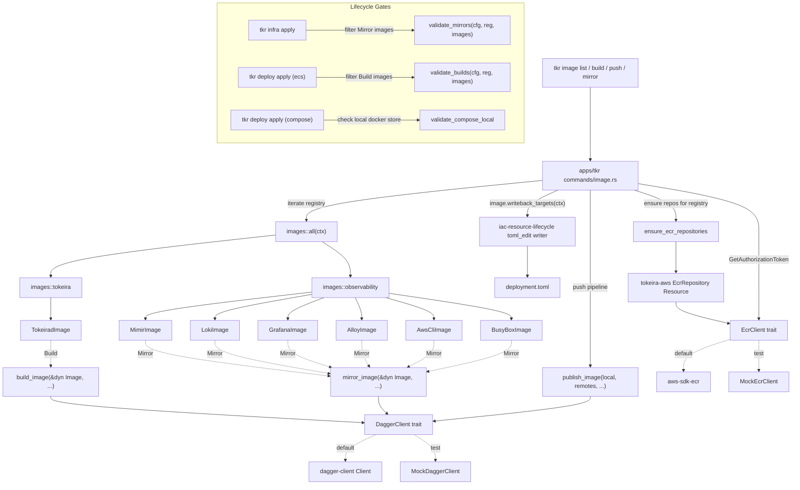

# Design Document: Image Lifecycle

## Overview

This design turns `requirements.md` into a concrete Rust implementation. The deliverables are:

1. A `tokeira-build` library crate at `crates/tokeira-build/` containing:
   - The core abstraction: `Image` trait, `ImageSourceType` enum, `DesiredImageRef` struct, `ImageContext` with typed extensions.
   - Two per-domain image modules: `images::tokeira` (one struct today: `TokeiradImage`) and `images::observability` (six structs: `MimirImage`, `LokiImage`, `GrafanaImage`, `AlloyImage`, `AwsCliImage`, `BusyBoxImage`).
   - A registry-level `images::all(ctx)` composing them and validating for duplicates.
   - Two Dagger-backed pipelines: `build_image` (for Build images) and `mirror_image` (for Mirror images), both keyed off `source_type` so adding a new image requires no pipeline changes.
   - A `DaggerClient` trait wrapping the in-repo `dagger-client` crate, so unit tests can substitute a mock.
2. An in-repo `dagger-client` crate at `crates/dagger-client/` providing a minimal GraphQL wrapper over a Dagger session.
3. An `EcrRepository` IaC resource in `tokeira-aws` with the canonical "keep last 10 untagged" lifecycle policy and an `EcrClient` trait.
4. A `tkr image list|build|push|mirror` command group in `apps/tkr` whose handlers iterate the image registry rather than carrying their own knowledge of specific images.
5. Writeback driven by `image.writeback_targets(ctx)` rather than CLI-side hardcoded field lists.
6. Platform lifecycle gates in `platforms/ecs` and `platforms/compose` that are pure predicates over the image registry.

Guiding principles:

1. **The trait is the abstraction boundary.** `tokeira-build` owns the `Image` trait; nothing above it (CLI, platform gates, writeback machinery) special-cases per image. Adding a new image is a struct declaration plus one line in `all()`.
2. **Shape stability is part of the design.** The `Image` trait surface, `DesiredImageRef`, `ImageContext`, and `ImageSourceType` are the stable contract that downstream consumers depend on. Adding fields is additive; renaming or removing them is a spec-level concern (Req 10.4).
3. **Source-type dispatches pipelines.** `build_image` refuses to run on Mirror images; `mirror_image` refuses to run on Build images. The CLI iterates the registry, partitions by `source_type`, and dispatches accordingly.
4. **Writeback is an image property.** Each image declares which `deployment.toml` dotted keys its remote ref populates. The CLI iterates — it doesn't enumerate.
5. **Dagger stays internal.** The `DaggerClient` trait is the boundary between the pipelines and Dagger's GraphQL transport. Unit tests substitute a mock; production wires the in-repo `dagger-client`.
6. **IaC integration follows the existing pattern.** `EcrRepository` is a `Resource` trait implementation that describes-before-deleting, consistent with every other AWS resource in the workspace.

## Architecture



### Crate Boundaries

| Change | Crate | Rationale |
|---|---|---|
| `Image` trait, `ImageSourceType`, `DesiredImageRef`, `ImageContext` | New `crates/tokeira-build/` | Core abstraction for the image plane. |
| `images::tokeira` + `images::observability` modules | `crates/tokeira-build/src/images/` | Per-domain image declarations; one struct per image. |
| `build_image`, `mirror_image`, `publish_image` pipelines | `crates/tokeira-build/` | Pipelines take `&dyn Image` so adding an image never touches them. |
| `DaggerClient` trait + default implementation | `crates/tokeira-build/` | Boundary over the in-repo `dagger-client`. |
| `EcrRepository` resource | `tokeira-aws` | Same crate that owns VPC, DSQL, IAM resources. |
| `EcrClient` trait + default implementation | `tokeira-aws` | Mock-based unit tests, consistent with AWS SDK testing pattern. |
| `tkr image` command group (4 subcommands) | `apps/tkr/src/commands/image.rs` | Follows existing `commands/{group}.rs` pattern. |
| `aws_cli_image` and `busybox_image` fields on `EcsConfig.observability` | `platforms/ecs` (owned by ecs-deployment spec) | Two new mirror targets; defaults added by this spec. |
| Writeback call sites | `apps/tkr` | Iterates `image.writeback_targets(ctx)`; delegates to `iac-resource-lifecycle` writer. |

Notably **not** changed:
- No new Dockerfile templater or manifest templating engine.
- No new CLI-level progress reporting — reuses the [`iac-resource-lifecycle`](../iac-resource-lifecycle/requirements.md) callbacks.
- No duplicate TOML edit code — reuses the [`iac-resource-lifecycle`](../iac-resource-lifecycle/requirements.md) writer.

## Components and Interfaces

### 1. `Image` trait and associated types

```rust
// crates/tokeira-build/src/image.rs

use serde::{Deserialize, Serialize};
use std::any::{Any, TypeId};
use std::collections::HashMap;

/// How an image is produced.
#[derive(Debug, Clone, Copy, PartialEq, Eq, Serialize, Deserialize)]
pub enum ImageSourceType {
    /// Built from source via a build pipeline.
    Build,
    /// Mirrored from an upstream registry.
    Mirror,
}

/// Resolved desired image reference.
#[derive(Debug, Clone, PartialEq, Eq, Serialize, Deserialize)]
pub struct DesiredImageRef {
    /// Target repository name, without registry host prefix (e.g. "tokeira-dev/tokeirad").
    pub repository: String,
    /// Tag (e.g. "latest", "v1.2.3", "3.0.6"). Never contains `/`, `@`, or `:`.
    pub tag: String,
    /// Upstream source reference for Mirror images. `None` for Build images.
    pub upstream_ref: Option<String>,
}

/// Context passed to `Image::desired_ref` and `Image::writeback_targets`.
///
/// Extensions provide access to deployment config and platform handles
/// without coupling the `tokeira-build` crate to specific config types.
pub struct ImageContext {
    extensions: HashMap<TypeId, Box<dyn Any + Send + Sync>>,
}

impl ImageContext {
    pub fn new() -> Self {
        Self { extensions: HashMap::new() }
    }

    /// Register a typed extension.
    pub fn set_extension<T: 'static + Send + Sync>(&mut self, value: T) {
        self.extensions.insert(TypeId::of::<T>(), Box::new(value));
    }

    /// Retrieve a typed extension by type.
    pub fn extension<T: 'static + Send + Sync>(&self) -> Option<&T> {
        self.extensions
            .get(&TypeId::of::<T>())
            .and_then(|boxed| boxed.downcast_ref::<T>())
    }
}

/// A named deployable artifact.
///
/// Every deployable artifact (built or mirrored) implements this trait.
/// The CLI, pipelines, and platform gates iterate `&dyn Image` — they do
/// not special-case.
pub trait Image: std::fmt::Debug + Send + Sync {
    /// Stable human-readable identifier (e.g. "tokeirad", "grafana-mimir").
    fn name(&self) -> &str;

    /// How this image is produced.
    fn source_type(&self) -> ImageSourceType;

    /// Compute the desired image reference given the current context.
    fn desired_ref(&self, ctx: &ImageContext) -> Result<DesiredImageRef, BuildError>;

    /// Declare which `deployment.toml` dotted keys this image's remote
    /// ref populates after push (Build) or mirror (Mirror).
    ///
    /// Default: no writeback.
    fn writeback_targets(&self, _ctx: &ImageContext) -> Vec<WritebackTarget> {
        Vec::new()
    }
}

/// A single writeback target declared by an image.
#[derive(Debug, Clone, PartialEq, Eq)]
pub struct WritebackTarget {
    /// Dotted TOML key (e.g. "observability.mimir_image", "services.runtime.image").
    pub field: &'static str,
}
```

**Notes on the trait shape:**

- `writeback_targets` is a default-empty method on the trait so any image whose remote ref is referenced by config can declare its own writeback target in one place. Images whose refs are consumed only by operator-facing tooling leave it at the default.
- `ImageContext` stores state via typed extensions so the trait stays decoupled from any specific config type. The production code registers the deployment's platform config (for example `EcsConfig`) on the context before resolving images.

### 2. Registry composition

```rust
// crates/tokeira-build/src/images/mod.rs

pub mod tokeira;
pub mod observability;

use super::{Image, ImageContext, BuildError};

/// Assemble every image the deployment knows about.
///
/// Validates the concatenated registry for duplicates before returning.
pub fn all(ctx: &ImageContext) -> Result<Vec<Box<dyn Image>>, BuildError> {
    let mut registry: Vec<Box<dyn Image>> = Vec::new();
    registry.extend(tokeira::all());
    registry.extend(observability::all());
    validate_registry(&registry, ctx)?;
    Ok(registry)
}

fn validate_registry(
    images: &[Box<dyn Image>],
    ctx: &ImageContext,
) -> Result<(), BuildError> {
    use std::collections::HashSet;
    let mut names = HashSet::new();
    let mut repos = HashSet::new();
    for img in images {
        if !names.insert(img.name().to_string()) {
            return Err(BuildError::RegistryValidation {
                kind: "duplicate name",
                value: img.name().to_string(),
            });
        }
        let desired = img.desired_ref(ctx)?;
        let key = (img.source_type(), desired.repository.clone());
        if !repos.insert(key) {
            return Err(BuildError::RegistryValidation {
                kind: "duplicate repository",
                value: desired.repository,
            });
        }
    }
    Ok(())
}
```

**Why validate at construction:** A duplicate image is a programming error, not a runtime condition. Failing `all()` surfaces the error at CLI startup, not mid-publish.

### 3. `images::tokeira` module

```rust
// crates/tokeira-build/src/images/tokeira.rs

use super::super::{Image, ImageContext, ImageSourceType, DesiredImageRef, BuildError, WritebackTarget};

/// Tokeira server image (built from source).
#[derive(Debug)]
pub struct TokeiradImage;

impl Image for TokeiradImage {
    fn name(&self) -> &str { "tokeirad" }
    fn source_type(&self) -> ImageSourceType { ImageSourceType::Build }

    fn desired_ref(&self, ctx: &ImageContext) -> Result<DesiredImageRef, BuildError> {
        let cfg = ctx.extension::<EcsConfig>()
            .ok_or(BuildError::MissingContextExtension("EcsConfig"))?;
        Ok(DesiredImageRef {
            repository: format!("{}/tokeirad", cfg.project_name),
            tag: "latest".into(),  // the tag supplied on push overrides this
            upstream_ref: None,
        })
    }

    fn writeback_targets(&self, _ctx: &ImageContext) -> Vec<WritebackTarget> {
        vec![
            WritebackTarget { field: "services.edge_api.image" },
            WritebackTarget { field: "services.edge_poll.image" },
            WritebackTarget { field: "services.runtime.image" },
            WritebackTarget { field: "services.projection.image" },
            WritebackTarget { field: "services.controller.image" },
            WritebackTarget { field: "services.autoscaler.image" },
            WritebackTarget { field: "services.admin.image" },
        ]
    }
}

pub fn all() -> Vec<Box<dyn Image>> {
    vec![Box::new(TokeiradImage)]
}
```

### 4. `images::observability` module

```rust
// crates/tokeira-build/src/images/observability.rs

use super::super::{Image, ImageContext, ImageSourceType, DesiredImageRef, BuildError, WritebackTarget};

/// Declare a Mirror image with upstream ref sourced from an
/// `EcsConfig.observability` field.
macro_rules! mirror_image {
    (
        $struct_name:ident,
        name = $name:literal,
        repo_suffix = $suffix:literal,
        upstream_field = $field_ident:ident,
        writeback = $writeback_field:literal
    ) => {
        #[derive(Debug)]
        pub struct $struct_name;

        impl Image for $struct_name {
            fn name(&self) -> &str { $name }
            fn source_type(&self) -> ImageSourceType { ImageSourceType::Mirror }

            fn desired_ref(&self, ctx: &ImageContext) -> Result<DesiredImageRef, BuildError> {
                let cfg = ctx.extension::<EcsConfig>()
                    .ok_or(BuildError::MissingContextExtension("EcsConfig"))?;
                let upstream = cfg.observability.$field_ident.clone();
                let tag = image_tag(&upstream).unwrap_or("latest").to_string();
                Ok(DesiredImageRef {
                    repository: format!("{}/{}", cfg.project_name, $suffix),
                    tag,
                    upstream_ref: Some(upstream),
                })
            }

            fn writeback_targets(&self, _ctx: &ImageContext) -> Vec<WritebackTarget> {
                vec![WritebackTarget { field: $writeback_field }]
            }
        }
    };
}

mirror_image!(MimirImage,   name = "grafana-mimir",  repo_suffix = "grafana-mimir",  upstream_field = mimir_image,   writeback = "observability.mimir_image");
mirror_image!(LokiImage,    name = "grafana-loki",   repo_suffix = "grafana-loki",   upstream_field = loki_image,    writeback = "observability.loki_image");
mirror_image!(GrafanaImage, name = "grafana-oss",    repo_suffix = "grafana-oss",    upstream_field = grafana_image, writeback = "observability.grafana_image");
mirror_image!(AlloyImage,   name = "grafana-alloy",  repo_suffix = "grafana-alloy",  upstream_field = alloy_image,   writeback = "observability.alloy_image");
mirror_image!(AwsCliImage,  name = "aws-cli",        repo_suffix = "aws-cli",        upstream_field = aws_cli_image, writeback = "observability.aws_cli_image");
mirror_image!(BusyBoxImage, name = "busybox",        repo_suffix = "busybox",        upstream_field = busybox_image, writeback = "observability.busybox_image");

pub fn all() -> Vec<Box<dyn Image>> {
    vec![
        Box::new(MimirImage),
        Box::new(LokiImage),
        Box::new(GrafanaImage),
        Box::new(AlloyImage),
        Box::new(AwsCliImage),
        Box::new(BusyBoxImage),
    ]
}

/// Extract the tag from an image reference. Handles digest refs and
/// `host:port/repo:tag` disambiguation.
fn image_tag(image: &str) -> Option<&str> {
    let without_digest = image.split('@').next()?;
    let last_slash = without_digest.rfind('/');
    let last_colon = without_digest.rfind(':')?;
    if last_slash.is_some_and(|s| last_colon < s) { return None; }
    without_digest.get(last_colon + 1..)
}
```

**Why a declarative macro:** Every Mirror image is the same shape — name, repo suffix, upstream-field accessor, writeback target. The macro makes adding a new Mirror image a one-line change.

**Observability repo-suffix names:** `grafana-mimir`, `grafana-loki`, `grafana-oss`, `grafana-alloy`, `aws-cli`, and `busybox` each reflect the upstream image that gets mirrored, avoiding ambiguity in `deployment.toml` and in operator logs.

### 5. `BuildError`

```rust
// crates/tokeira-build/src/error.rs

#[derive(Debug, thiserror::Error)]
pub enum BuildError {
    #[error("rust-toolchain.toml not found or unreadable at {path}")]
    ToolchainFile { path: std::path::PathBuf, #[source] source: std::io::Error },

    #[error("rust-toolchain.toml could not be parsed: {0}")]
    ToolchainParse(String),

    #[error("unsupported architecture '{supplied}'; expected 'arm64' or 'amd64'")]
    UnsupportedArch { supplied: String },

    #[error("Dagger session not available and 'dagger' CLI is not on PATH")]
    DaggerMissing,

    #[error("publish failed for {remote_ref}: {source}")]
    Publish { remote_ref: String, #[source] source: eyre::Report },

    #[error("mirror failed for {source_ref} -> {remote_ref}: {source}")]
    Mirror { source_ref: String, remote_ref: String, #[source] source: eyre::Report },

    #[error("upstream source authentication failed")]
    UpstreamAuth,

    #[error("request validation failed: {reason}")]
    Validation { reason: String },

    #[error("image context missing required extension: {0}")]
    MissingContextExtension(&'static str),

    #[error("image registry validation failed: {kind} = {value}")]
    RegistryValidation { kind: &'static str, value: String },

    #[error("source-type mismatch: expected {expected:?}, found {found:?} for image {image_name}")]
    SourceTypeMismatch {
        expected: super::ImageSourceType,
        found: super::ImageSourceType,
        image_name: String,
    },
}
```

### 6. `DaggerClient` trait

```rust
// crates/tokeira-build/src/dagger.rs

/// Thin wrapper over the in-repo dagger-client crate. Kept narrow so
/// tests can substitute a complete mock without re-implementing Dagger.
pub trait DaggerClient: Send + Sync {
    fn host_directory(&self, path: &Path) -> Result<Box<dyn DirectoryRef>, BuildError>;
    fn container_from(&self, image: &str) -> Result<Box<dyn ContainerRef>, BuildError>;
    fn set_secret(&self, name: &str, value: &str) -> Result<Box<dyn SecretRef>, BuildError>;
}

pub trait ContainerRef: Send + Sync {
    fn with_exec(self: Box<Self>, args: &[&str]) -> Result<Box<dyn ContainerRef>, BuildError>;
    fn with_env(self: Box<Self>, k: &str, v: &str) -> Result<Box<dyn ContainerRef>, BuildError>;
    fn with_workdir(self: Box<Self>, dir: &str) -> Result<Box<dyn ContainerRef>, BuildError>;
    fn with_directory(self: Box<Self>, path: &str, dir: &dyn DirectoryRef) -> Result<Box<dyn ContainerRef>, BuildError>;
    fn with_file(self: Box<Self>, path: &str, file: &dyn FileRef) -> Result<Box<dyn ContainerRef>, BuildError>;
    fn with_entrypoint(self: Box<Self>, args: &[&str]) -> Result<Box<dyn ContainerRef>, BuildError>;
    fn with_user(self: Box<Self>, user: &str) -> Result<Box<dyn ContainerRef>, BuildError>;
    fn with_registry_auth(self: Box<Self>, registry: &str, user: &str, secret: &dyn SecretRef)
        -> Result<Box<dyn ContainerRef>, BuildError>;
    fn file(&self, path: &str) -> Result<Box<dyn FileRef>, BuildError>;
    fn export_image(&self, tag: &str) -> Result<(), BuildError>;
    fn publish(&self, remote_ref: &str) -> Result<String, BuildError>;
}

pub trait DirectoryRef: Send + Sync { fn file(&self, name: &str) -> Result<Box<dyn FileRef>, BuildError>; }
pub trait FileRef: Send + Sync {}
pub trait SecretRef: Send + Sync {}
```

The default implementation wraps `dagger_client::Client` from the in-repo crate. The `Box<Self>` builder pattern matches how the underlying `dagger-client` consumes `Container<'_>` by value.

### 7. Build pipeline

```rust
// crates/tokeira-build/src/pipelines/build.rs

pub struct BuildRequest {
    pub arch: Arch,
    pub tag: String,
    pub workspace_root: PathBuf,
}

pub struct BuildResult {
    pub image_name: String,
    pub local_tag: String,   // "tokeirad:local" or "tokeirad:v1.2.3"
    pub arch: Arch,
    pub toolchain_version: String,
}

pub fn build_image(
    image: &dyn Image,
    request: &BuildRequest,
    dagger: &dyn DaggerClient,
) -> Result<BuildResult, BuildError> {
    if image.source_type() != ImageSourceType::Build {
        return Err(BuildError::SourceTypeMismatch {
            expected: ImageSourceType::Build,
            found: image.source_type(),
            image_name: image.name().to_string(),
        });
    }

    let toolchain = rust_toolchain_version(&request.workspace_root)?;
    let workspace = dagger.host_directory(&request.workspace_root)?;

    // Stage 1: compile the binary
    let rust_image = format!("rust:{toolchain}-alpine");
    let mut builder = dagger.container_from(&rust_image)?;
    builder = builder.with_exec(&["apk", "add", "--no-cache", "musl-dev", "openssl-dev", "pkgconfig", "protobuf-dev", "protoc"])?;
    builder = builder.with_directory("/src", &*workspace)?;
    builder = builder.with_workdir("/src")?;
    builder = builder.with_env("CARGO_TERM_COLOR", "never")?;
    builder = builder.with_env("RUSTUP_TOOLCHAIN", &toolchain)?;
    builder = builder.with_exec(&["rustup", "target", "add", request.arch.rust_target()])?;
    builder = builder.with_exec(&[
        "cargo", "build", "--release",
        "--target", request.arch.rust_target(),
        "--bin", image.name(),
        "-p", image.name(),
    ])?;
    let binary = builder.file(&format!("/src/target/{}/release/{}", request.arch.rust_target(), image.name()))?;

    // Stage 2: assemble the runtime image
    let mut runtime = dagger.container_from("alpine:3.23")?;
    runtime = runtime.with_exec(&[
        "sh", "-c",
        &format!(
            "apk add --no-cache ca-certificates tzdata \
             && addgroup -g 1000 {name} \
             && adduser -u 1000 -G {name} -D {name}",
            name = image.name()
        ),
    ])?;
    runtime = runtime.with_file(&format!("/usr/local/bin/{}", image.name()), &*binary)?;
    runtime = runtime.with_user(image.name())?;
    runtime = runtime.with_entrypoint(&[&format!("/usr/local/bin/{}", image.name())])?;

    // Stage 3: export
    let local_tag = format!("{}:{}", image.name(), request.tag);
    runtime.export_image(&local_tag)?;

    Ok(BuildResult {
        image_name: image.name().to_string(),
        local_tag,
        arch: request.arch,
        toolchain_version: toolchain,
    })
}
```

**Note on `image.name()` -> binary name:** All current Tokeira Build images produce binaries of the same name (`tokeirad` → binary `tokeirad`). If a future Build image has a different binary name, we add a `fn binary_name(&self) -> &str { self.name() }` default method on the `Image` trait and override it where needed.

### 8. Mirror pipeline

```rust
// crates/tokeira-build/src/pipelines/mirror.rs

pub struct MirroredReference {
    pub image_name: String,
    pub destination_ref: String,
    pub published_ref: String,  // digest-pinned
}

pub fn mirror_image(
    image: &dyn Image,
    ctx: &ImageContext,
    creds: &RegistryCredentials,
    dagger: &dyn DaggerClient,
) -> Result<MirroredReference, BuildError> {
    if image.source_type() != ImageSourceType::Mirror {
        return Err(BuildError::SourceTypeMismatch {
            expected: ImageSourceType::Mirror,
            found: image.source_type(),
            image_name: image.name().to_string(),
        });
    }

    let desired = image.desired_ref(ctx)?;
    let source_ref = desired.upstream_ref
        .as_ref()
        .ok_or(BuildError::Validation { reason: "Mirror image has no upstream_ref".into() })?;

    let destination_ref = format!("{}/{}:{}", creds.registry_host, desired.repository, desired.tag);

    // Skip-self check: if the config already points at the destination,
    // this is a re-run over already-mirrored data.
    if source_ref == &destination_ref
       || source_ref.starts_with(&format!("{}/{}:", creds.registry_host, desired.repository))
       || source_ref.starts_with(&format!("{}/{}@", creds.registry_host, desired.repository)) {
        return Ok(MirroredReference {
            image_name: image.name().to_string(),
            destination_ref: source_ref.clone(),
            published_ref: source_ref.clone(),
        });
    }

    let secret = dagger.set_secret("registry_password", &creds.password)?;
    let container = dagger.container_from(source_ref)?
        .with_registry_auth(&creds.registry_host, &creds.username, &*secret)?;
    let published = container.publish(&destination_ref)
        .map_err(|e| BuildError::Mirror {
            source_ref: source_ref.clone(),
            remote_ref: destination_ref.clone(),
            source: eyre::eyre!("{e}"),
        })?;

    Ok(MirroredReference {
        image_name: image.name().to_string(),
        destination_ref,
        published_ref: published,
    })
}
```

### 9. Publish pipeline (used by push)

```rust
// crates/tokeira-build/src/pipelines/publish.rs

pub struct PublishResult {
    pub published: Vec<PublishedReference>,
}

pub struct PublishedReference {
    pub remote_ref: String,
    pub published_ref: String,
}

pub fn publish_image(
    local_image: &str,
    remote_refs: &[String],
    creds: &RegistryCredentials,
    dagger: &dyn DaggerClient,
) -> Result<PublishResult, BuildError> {
    if remote_refs.is_empty() {
        return Err(BuildError::Validation { reason: "remote_refs cannot be empty".into() });
    }
    let secret = dagger.set_secret("registry_password", &creds.password)?;
    let container = dagger.container_from(local_image)?
        .with_registry_auth(&creds.registry_host, &creds.username, &*secret)?;

    let mut published = Vec::with_capacity(remote_refs.len());
    for remote in remote_refs {
        let published_ref = container.publish(remote)
            .map_err(|e| BuildError::Publish {
                remote_ref: remote.clone(),
                source: eyre::eyre!("{e}"),
            })?;
        published.push(PublishedReference { remote_ref: remote.clone(), published_ref });
    }
    Ok(PublishResult { published })
}
```

### 10. `EcrRepository` resource

`EcrRepository { name, tags }` implements the `Resource` trait from `tokeira-iac`. Canonical `ECR_LIFECYCLE_POLICY` constant. `describe()` returns `None` on not-found for idempotent destroy. `diff()` reports policy drift and tag drift as updates.

Consumed by the image CLI via two helpers:

```rust
pub async fn ensure_ecr_repository(
    ecr: &dyn EcrClient,
    name: &str,
    tags: &BTreeMap<String, String>,
) -> Result<(), EcrError>;

pub async fn ensure_ecr_repositories(
    ecr: &dyn EcrClient,
    repos: &[(String, BTreeMap<String, String>)],
) -> Result<(), EcrError>;
```

The CLI builds the `repos` list by iterating `images::all(ctx)` and collecting `desired_ref(ctx)?.repository` values — see §12.

### 11. `EcrClient` trait

A thin trait over `aws-sdk-ecr` exposing `get_authorization_token`, `describe_repository`, `create_repository`, `delete_repository`, `put_lifecycle_policy`, `get_lifecycle_policy`, `tag_resource`. The default implementation wraps the AWS SDK; tests substitute a mock. The `decode_authorization_data` helper parses ECR's base64 `user:password` token and trims the proxy-endpoint scheme — its four failure modes (invalid base64, invalid UTF-8, missing `:` separator, success) are unit-tested.

### 12. Image CLI

```rust
// apps/tkr/src/commands/image.rs

#[derive(Subcommand)]
pub enum ImageCommand {
    /// List every image the deployment knows about.
    List {
        #[arg(long)]
        source_type: Option<String>,  // "build" or "mirror"
    },
    /// Build every registered Build image.
    Build {
        #[arg(long, default_value = "arm64")]
        arch: String,
        #[arg(long, default_value = "local")]
        tag: String,
        #[arg(long)]
        image: Option<String>,  // default: all Build images
    },
    /// Push registered Build images to ECR.
    Push {
        #[arg(long, default_value = "latest")]
        tag: String,
        #[arg(long)]
        image: Option<String>,
        #[arg(long)]
        yes: bool,
    },
    /// Mirror registered Mirror images to ECR.
    Mirror {
        #[arg(long)]
        image: Option<String>,
        #[arg(long)]
        yes: bool,
    },
}

pub async fn run(
    cmd: ImageCommand,
    deployment: &Deployment,
    format: OutputFormat,
) -> Result<()> {
    // All subcommands except `list` need a Dagger session. `list` is read-only.
    match cmd {
        ImageCommand::List { .. } => run_list(deployment, cmd, format).await,
        ImageCommand::Build { .. } => {
            if should_reexec_with_dagger_session() {
                return reexec_under_dagger(&cmd, deployment).await;
            }
            run_build(deployment, cmd, format).await
        }
        ImageCommand::Push { yes, .. } => {
            confirm_or_bail(yes, format)?;
            if should_reexec_with_dagger_session() { return reexec_under_dagger(&cmd, deployment).await; }
            run_push(deployment, cmd, format).await
        }
        ImageCommand::Mirror { yes, .. } => {
            confirm_or_bail(yes, format)?;
            if should_reexec_with_dagger_session() { return reexec_under_dagger(&cmd, deployment).await; }
            run_mirror(deployment, cmd, format).await
        }
    }
}

async fn run_list(
    deployment: &Deployment,
    cmd: ImageCommand,
    format: OutputFormat,
) -> Result<()> {
    let ctx = build_image_context(deployment)?;
    let images = images::all(&ctx)?;
    // Filter by source type, render table or JSON.
    // ...
    Ok(())
}

async fn run_build(
    deployment: &Deployment,
    cmd: ImageCommand,
    format: OutputFormat,
) -> Result<()> {
    let ImageCommand::Build { arch, tag, image: filter } = cmd else { unreachable!() };
    let ctx = build_image_context(deployment)?;
    let images = images::all(&ctx)?;

    let selected: Vec<&dyn Image> = images.iter()
        .filter(|i| i.source_type() == ImageSourceType::Build)
        .filter(|i| filter.as_deref().map_or(true, |f| i.name() == f))
        .map(|b| b.as_ref())
        .collect();

    if selected.is_empty() {
        anyhow::bail!("no Build images matched the filter");
    }

    let dagger = dagger_client::Client::from_env()?;
    let workspace_root = deployment.workspace_root().to_path_buf();

    for image in &selected {
        let request = BuildRequest {
            arch: Arch::from_str(&arch)?,
            tag: tag.clone(),
            workspace_root: workspace_root.clone(),
        };
        let result = tokeira_build::build_image(*image, &request, &dagger)?;
        emit_progress(format, &result);
    }
    Ok(())
}

async fn run_push(
    deployment: &Deployment,
    cmd: ImageCommand,
    format: OutputFormat,
) -> Result<()> {
    let ImageCommand::Push { tag, image: filter, .. } = cmd else { unreachable!() };
    let ctx = build_image_context(deployment)?;
    let images = images::all(&ctx)?;
    let selected: Vec<&dyn Image> = images.iter()
        .filter(|i| i.source_type() == ImageSourceType::Build)
        .filter(|i| filter.as_deref().map_or(true, |f| i.name() == f))
        .map(|b| b.as_ref())
        .collect();

    let ecr = ecr_client::default_client().await?;
    let creds = auth_from_ecr(&ecr).await?;

    // Ensure each image's repository exists.
    let repos: Vec<(String, BTreeMap<String, String>)> = selected.iter()
        .map(|i| {
            let desired = i.desired_ref(&ctx)?;
            Ok::<_, BuildError>((desired.repository, deployment_tags(deployment)))
        })
        .collect::<Result<_, _>>()?;
    ensure_ecr_repositories(&ecr, &repos).await?;

    // Verify local images exist, then publish.
    let dagger = dagger_client::Client::from_env()?;
    let mut writeback: Vec<(&'static str, String)> = Vec::new();

    for image in &selected {
        let desired = image.desired_ref(&ctx)?;
        let local_image = format!("{}:latest", image.name());
        require_local_image(&local_image)?;
        let remote_refs = vec![
            format!("{}/{}:latest", creds.registry_host, desired.repository),
            format!("{}/{}:{}", creds.registry_host, desired.repository, tag),
        ];
        let _result = tokeira_build::publish_image(&local_image, &remote_refs, &creds, &dagger)?;
        let version_ref = remote_refs.last().cloned().unwrap();
        for target in image.writeback_targets(&ctx) {
            writeback.push((target.field, version_ref.clone()));
        }
    }

    write_image_writeback(deployment.path(), &writeback, format)?;
    emit_push_summary(format, &selected, &writeback);
    Ok(())
}

async fn run_mirror(
    deployment: &Deployment,
    cmd: ImageCommand,
    format: OutputFormat,
) -> Result<()> {
    let ImageCommand::Mirror { image: filter, .. } = cmd else { unreachable!() };
    let ctx = build_image_context(deployment)?;
    let images = images::all(&ctx)?;
    let selected: Vec<&dyn Image> = images.iter()
        .filter(|i| i.source_type() == ImageSourceType::Mirror)
        .filter(|i| filter.as_deref().map_or(true, |f| i.name() == f))
        .map(|b| b.as_ref())
        .collect();

    let ecr = ecr_client::default_client().await?;
    let creds = auth_from_ecr(&ecr).await?;
    let repos: Vec<(String, BTreeMap<String, String>)> = selected.iter()
        .map(|i| Ok::<_, BuildError>((i.desired_ref(&ctx)?.repository, deployment_tags(deployment))))
        .collect::<Result<_, _>>()?;
    ensure_ecr_repositories(&ecr, &repos).await?;

    let dagger = dagger_client::Client::from_env()?;
    let mut writeback: Vec<(&'static str, String)> = Vec::new();

    for image in &selected {
        let mirrored = tokeira_build::mirror_image(*image, &ctx, &creds, &dagger)?;
        for target in image.writeback_targets(&ctx) {
            writeback.push((target.field, mirrored.destination_ref.clone()));
        }
    }

    write_image_writeback(deployment.path(), &writeback, format)?;
    emit_mirror_summary(format, &selected, &writeback);
    Ok(())
}
```

**Key observation:** `run_build`, `run_push`, and `run_mirror` each iterate the image registry. There is no hardcoded enumeration of images or writeback fields. Adding a seventh observability image, or a second Build image, is a struct declaration.

### 13. Writeback

Writeback uses the existing [`iac-resource-lifecycle`](../iac-resource-lifecycle/requirements.md) `write_config_values(deployment_dir, &[(dotted_key, value), ...])` helper:

```rust
fn write_image_writeback(
    deployment_dir: &Path,
    values: &[(&'static str, String)],
    format: OutputFormat,
) -> Result<()> {
    if values.is_empty() { return Ok(()); }
    let borrowed: Vec<(&str, &str)> = values.iter().map(|(k, v)| (*k, v.as_str())).collect();
    iac_lifecycle::write_config_values(deployment_dir, &borrowed)
        .context("failed to write image references to deployment.toml")?;
    output::print_progress(format, &format!("Wrote {} image reference(s)", borrowed.len()));
    Ok(())
}
```

### 14. Platform lifecycle gates

Driven by the image registry, not by hardcoded field lists:

```rust
// platforms/ecs/src/gates.rs

pub fn validate_mirrors(
    cfg: &EcsConfig,
    registry: &str,
    images: &[Box<dyn Image>],
    ctx: &ImageContext,
) -> Result<(), EcsError> {
    let mut unmirrored: Vec<&'static str> = Vec::new();
    for image in images.iter().filter(|i| i.source_type() == ImageSourceType::Mirror) {
        for target in image.writeback_targets(ctx) {
            let value = read_dotted_key(cfg, target.field);
            if value.is_empty() || !value.starts_with(&format!("{registry}/")) {
                unmirrored.push(target.field);
            }
        }
    }
    if !unmirrored.is_empty() {
        return Err(EcsError::UnmirroredImages { fields: unmirrored, remediation: "run `tkr image mirror`".into() });
    }
    Ok(())
}

pub fn validate_builds(
    cfg: &EcsConfig,
    registry: &str,
    images: &[Box<dyn Image>],
    ctx: &ImageContext,
) -> Result<(), EcsError> {
    // Symmetric, filtering by ImageSourceType::Build.
    // ...
}
```

**Compose gate** is a separate concern because it checks local Docker state, not config:

```rust
// platforms/compose/src/gates.rs

pub async fn validate_local_build(
    cfg: &ComposeConfig,
    docker: &bollard::Docker,
) -> Result<(), ComposeError> {
    if cfg.tokeirad.image != "tokeirad:local" { return Ok(()); }
    match docker.inspect_image("tokeirad:local").await {
        Ok(_) => Ok(()),
        Err(bollard::errors::Error::NotFound) => Err(ComposeError::LocalBuildMissing {
            image: "tokeirad:local".into(),
            remediation: "run `tkr image build`".into(),
        }),
        Err(e) => Err(ComposeError::DockerIo(e)),
    }
}
```

## Data Models

### `EcsConfig` additions

This spec extends the ECS platform's `observability` config section with two new fields to give the image registry a uniform source of truth:

```rust
// platforms/ecs/src/config.rs (extended)
#[derive(Debug, Clone, Serialize, Deserialize)]
pub struct ObservabilityConfig {
    // ... existing fields ...
    pub mimir_image: String,
    pub loki_image: String,
    pub grafana_image: String,
    pub alloy_image: String,
    /// New: used by init containers for AWS CLI bootstrap (e.g., secret fetch).
    #[serde(default)]
    pub aws_cli_image: String,
    /// New: used by `wait-for-<dep>` init containers.
    #[serde(default)]
    pub busybox_image: String,
}
```

### `ComposeConfig` additions

Parallel fields on the compose platform keep the mirror stability property meaningful:

```rust
impl Default for ComposeConfig {
    fn default() -> Self {
        Self {
            project_name: "tokeira".into(),
            tokeirad: TokeiradServiceConfig { image: "tokeirad:local".into(), /* ... */ },
            observability: ObservabilityConfig {
                mimir_image: "grafana/mimir:3.0.6".into(),
                loki_image: "grafana/loki:3.7.1".into(),
                grafana_image: "grafana/grafana-oss:12.4.3".into(),
                alloy_image: "grafana/alloy:v1.16.0".into(),
                aws_cli_image: "public.ecr.aws/aws-cli/aws-cli:latest".into(),
                busybox_image: "public.ecr.aws/docker/library/busybox:latest".into(),
                // ... other fields unchanged ...
            },
        }
    }
}
```

### ECR authorization decoder

Decodes ECR's base64 `user:password` token, validates UTF-8 and the `:` separator, and trims the proxy-endpoint scheme (`http(s)://`) and trailing `/`. See §11.

## Correctness Properties

### Property 1: Registry validation (Req 9.1)

Generate arbitrary combinations of images (some duplicated names or repositories) via `proptest`. Assert `validate_registry` returns `Err(RegistryValidation { .. })` iff duplicates exist.

### Property 2: Source-type / upstream invariant (Req 9.2)

For every image in `images::all(ctx)` across realistic `ctx` values, assert:
- `image.source_type() == Build` ⇒ `image.desired_ref(ctx)?.upstream_ref.is_none()`.
- `image.source_type() == Mirror` ⇒ `image.desired_ref(ctx)?.upstream_ref.is_some()`.

### Property 3: Mirror idempotence (Req 9.3)

With mocked `DaggerClient` and `EcrClient`, run `run_mirror` twice. Assert repo set, mirrored digests, and `deployment.toml` contents match between the two runs.

### Property 4: ECR repository creation idempotence (Req 9.4)

Generate `Vec<String>` of ECR-grammar names with no duplicates. Call `ensure_ecr_repositories` twice. Assert mock ECR state is identical after the second call.

### Property 5: Lifecycle policy round-trip (Req 9.5)

`serde_json::from_str::<Value>(ECR_LIFECYCLE_POLICY)` then `to_string` then `from_str` — assert equal.

### Property 6: Mirror mapping stability (Req 9.7)

For each Mirror image in `observability::all()`, assert `desired_ref(ctx)?.upstream_ref.unwrap()` with a default `EcsConfig::observability` equals the corresponding `ComposeConfig::default().observability` field.

### Property 7: ECR name grammar (Req 9.8)

For every image in `images::all(ctx)` across realistic ctx values, assert `desired_ref(ctx)?.repository` matches the ECR name grammar.

### Property 8: Lifecycle gate predicates (Req 9.9)

Generate `EcsConfig` with writeback-target fields chosen from: empty, upstream source, project-scoped ECR ref. Assert `validate_mirrors` and `validate_builds` return `Err` iff any targeted field is empty or not `{registry}/`-prefixed.

### Property 9: Writeback round-trip (Req 9.6)

Owned by [`iac-resource-lifecycle`](../iac-resource-lifecycle/requirements.md); inherited.

### Property 10: Publish reference count

For `publish_image` with N remote refs (N > 0), assert the returned `PublishResult.published.len() == N` and each `published[i].remote_ref == remote_refs[i]`.

## Error Handling

Every image-plane error follows the three-line remediation pattern: what happened, why, what to do next.

| Condition | Error shape | Exit code |
|---|---|---|
| `dagger` CLI missing | `dagger CLI not found on PATH; install >= 0.20 from https://docs.dagger.io/install/` | 1 |
| `rust-toolchain.toml` missing | `rust-toolchain.toml not found at {path}` | 1 |
| `rust-toolchain.toml` parse fail | `failed to parse rust-toolchain.toml at {path}: {source}` | 1 |
| `Arch::from_str` rejection | `unsupported architecture '{supplied}'; expected 'arm64' or 'amd64'` | 2 (clap) |
| Source-type mismatch | `source-type mismatch: expected {expected:?}, found {found:?} for image {name}` | 1 |
| Registry validation (duplicates) | `image registry validation failed: {kind} = {value}` | 1 |
| Missing context extension | `image context missing required extension: {name}` | 1 |
| ECR `GetAuthorizationToken` failure | `failed to authenticate with ECR in {region}; verify AWS credentials and ecr:GetAuthorizationToken permission` | 1 |
| ECR publish 401/403 | `ECR rejected authentication for {registry}; verify IAM has ecr:PutImage, ecr:UploadLayerPart, etc.` | 1 |
| Local image absent on push | `local image {image}:latest not found; run \`tkr image build\` first` | 1 |
| Writeback I/O error | `failed to write image references to {deployment_toml}: {source}` | 1 |
| Mirror gate fail | `ECS deployment cannot apply — mirrored images missing: {fields}; remediation: run \`tkr image mirror\`` | 1 |
| Build gate fail | `ECS deployment cannot apply — built images not pushed: {fields}; remediation: run \`tkr image push --tag <version>\`` | 1 |
| Compose build gate fail | `compose deployment cannot apply — tokeirad:local is not in the local Docker image store; run \`tkr image build\`` | 1 |

All errors are structured via `thiserror` in library crates and `anyhow::Context` in CLI handlers. CLI surfaces the full causal chain in non-JSON output and a flat `{ "error": ..., "context": [...] }` in JSON.

## Testing Strategy

### Property-Based Tests (proptest)

Properties 1–8 above. Each mocked at the appropriate trait boundary:
- Image traits and registry: no I/O needed — pure Rust.
- Pipelines: mock `DaggerClient`.
- Repository ensure + gates: mock `EcrClient`.

### Unit Tests

- `EcrRepository::create/update/delete/describe/diff` with `MockEcrClient`.
- `decode_authorization_data` with its four failure modes (invalid base64, invalid UTF-8, missing `:` separator, success).
- `image_tag` helper: empty, digest, registry-port-in-reference.
- `Arch::from_str` round-trip.
- `ImageContext` extension set/get round-trip.
- `TokeiradImage` / `MimirImage` / ... desired-ref resolution with a canonical `EcsConfig`.
- `TokeiradImage::writeback_targets` lists the seven services; each observability image lists one target.
- CLI parse tests for all four `tkr image` subcommands.

### Integration Tests

Gated behind `integration-test` feature flag:
- End-to-end `tkr image build`: produces `tokeirad:local` and `docker image inspect` confirms.
- End-to-end `tkr image mirror` against LocalStack: six repos exist, each with canonical lifecycle policy, re-run leaves state unchanged.

### No Network or Docker by Default

The default `cargo test` in `tokeira-build` and `tokeira-aws` does NOT require Docker, the Dagger daemon, or AWS credentials. Every test path goes through a trait (`Image`, `DaggerClient`, `EcrClient`) substituted with a mock.

### New Dependencies

`tokeira-build`:
- `thiserror`, `tracing`, `toml`, `serde`, `serde_json` (all workspace deps)
- `dagger-client` (new in-repo crate)
- `eyre` (for boxing the opaque Dagger-origin error in `BuildError::Publish.source` and `BuildError::Mirror.source`)

`tokeira-aws`:
- `aws-sdk-ecr` (new), `base64` (for ECR token decode)

`apps/tkr`: no new deps.

`crates/dagger-client/`: `reqwest`, `serde`, `serde_json`, `tokio`, `eyre`.

## Migration and Rollout

This spec introduces new functionality only — no breaking changes to existing CLI commands, config files, or state formats.

1. `crates/dagger-client/` bootstrap (headless GraphQL client).
2. `crates/tokeira-build/` with `Image` trait, `ImageContext`, `ImageSourceType`, `DesiredImageRef` — the core abstraction first.
3. `ComposeConfig` and `EcsConfig` field additions (`aws_cli_image`, `busybox_image`).
4. `images::tokeira` module with `TokeiradImage`.
5. `images::observability` module with the six Mirror images.
6. `images::all` with registry validation; property tests for registry / source-type / grammar invariants.
7. Build pipeline (`build_image`); mirror pipeline (`mirror_image`); publish pipeline (`publish_image`).
8. `EcrRepository` resource and `EcrClient` trait in `tokeira-aws`.
9. `tkr image list|build|push|mirror` handlers.
10. Platform lifecycle gates (`validate_mirrors`, `validate_builds`, `validate_local_build`) driven by the image registry.
11. Documentation updates in `README.md` and `AGENTS.md`.

No deprecations. No state migrations. Existing compose deployments continue to work — once the operator runs `tkr image build`, the previously-broken `tokeirad:local` reference resolves.

## Future Evolution

Adding a new image is a three-line change:

1. Write a struct implementing `Image`.
2. Add it to the appropriate module's `all()` (or create a new module and add it to the top-level `images::all`).
3. Declare `writeback_targets` if the image's remote ref is referenced by config.

The Dagger pipelines, the CLI, the platform gates, and the writeback machinery all iterate the registry — no other changes needed.

Anticipated near-term additions (not in scope for this spec):
- `TokeiraToolImage` (schema migration utility, Build) — adds to `images::tokeira`.
- `TemporalUiImage` (upstream Temporal UI, Mirror) — adds a new `images::temporal` module if Tokeira adopts the Temporal Web UI as an operator-facing tool.
- A CI-specific `conformance-features` Mirror or Build image — handled by [`pipeline-foundation`](../pipeline-foundation/requirements.md) and [`temporal-compatibility`](../temporal-compatibility/requirements.md) specs.
