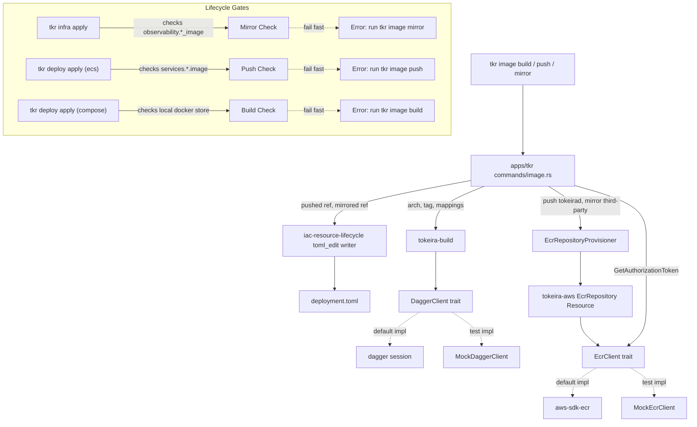

# Design Document: Image Lifecycle

## Overview

This design introduces a new image-plane surface in Tokeira: a `tokeira-build` library crate that drives reproducible `tokeirad` image builds through a Dagger pipeline, an `EcrRepository` resource in `tokeira-aws`, and a `tkr image` command group in `apps/tkr` that wraps both. The design is a deliberate port of the EKS reference — `temporal-dsql-deploy-eks/crates/build/src/lib.rs` and `temporal-dsql-deploy-eks/crates/cli/src/commands/build.rs` — adapted from Go-binary-plus-Loom to a single Rust-binary `tokeirad` image, with the same Dagger orchestration pattern, the same ECR lifecycle policy, and the same mirror-and-writeback flow.

Guiding principles:

1. **Build orchestration is library code.** The CLI layer only handles argument parsing, progress reporting, and writeback. All pipeline logic lives in `tokeira-build` so future consumers (e.g., a CI/CD spec, a `tkr dev build-image` alias, or an ECS `BuildAndPushAction` resource) can reuse it without depending on the CLI.
2. **Dagger stays internal.** The Dagger client type is an implementation detail of the Build_Crate. The CLI depends on `tokeira-build` trait surfaces, not on Dagger directly. Tests substitute a mock client at the trait boundary.
3. **The mirror table is single-sourced.** `tokeira-build::mirror_mappings(config)` is the only place the canonical third-party image list lives. Compose and ECS both read from it. A proptest enforces that the mappings match `ComposeConfig::default()` — if someone bumps `grafana/mimir:3.0.6`, CI catches unmirrored drift.
4. **Writeback is delegated.** TOML writeback uses the [`iac-resource-lifecycle`](../iac-resource-lifecycle/requirements.md) `toml_edit` helper. This spec neither reimplements dotted-key insertion nor introduces a second TOML-editing code path.
5. **ECR repositories are IaC resources, not ad-hoc mutations.** `EcrRepository` implements the `Resource` trait, is owned by the same state store as VPCs and DSQL clusters, and participates in the describe-before-delete safety rule from [`iac-resource-lifecycle`](../iac-resource-lifecycle/requirements.md). The `tkr image push` and `tkr image mirror` commands use the same `ensure_ecr_repository` helper the IaC engine does — they do not create resources "outside" state.

## Architecture



### Crate Boundaries

| Change | Crate | Rationale |
|---|---|---|
| `tokeira-build` library crate with Dagger orchestration | New `crates/tokeira-build/` | Mirrors EKS `dsqld_build`; keeps pipeline logic out of the CLI |
| `DaggerClient` trait + default implementation | `tokeira-build` | Allows unit tests to substitute a mock without running a Dagger session |
| `EcrRepository` resource | `tokeira-aws` | Same crate that owns VPC, DSQL, IAM resources |
| `EcrClient` trait + default implementation | `tokeira-aws` | Enables mock-based unit tests, consistent with AWS SDK testing pattern |
| `tkr image` command group | `apps/tkr/src/commands/image.rs` | Follows existing `commands/{group}.rs` pattern |
| `aws_cli_image` and `busybox_image` fields on `EcsConfig.observability` | `platforms/ecs` (owned by ecs-deployment spec) | New mirror targets; the ecs-deployment spec's config model extends to include them |
| Config writeback call sites for push and mirror | `apps/tkr` | Uses the `iac-resource-lifecycle` writer; no new writeback code |

Notably **not** changed:
- No new Dockerfile templater or manifest templating engine.
- No new CLI-level progress reporting — reuses the [`iac-resource-lifecycle`](../iac-resource-lifecycle/requirements.md) callbacks.
- No duplicate TOML edit code — reuses the [`iac-resource-lifecycle`](../iac-resource-lifecycle/requirements.md) writer.
- No `ImageModule` IaC module enumerating ECR repos. Repositories are ensured on-demand by `tkr image push` and `tkr image mirror` — not part of an `infra apply` plan. Operators who want ECR repos plan-visible can opt into a future `ImagesModule` in a follow-up spec; this spec does not block on it.

## Components and Interfaces

### Build_Crate Public API

```rust
// crates/tokeira-build/src/lib.rs

/// Request to build the tokeirad container image.
#[derive(Debug, Clone)]
pub struct TokeiradBuildRequest {
    /// Workspace root containing apps/tokeirad/ and rust-toolchain.toml.
    pub workspace_root: PathBuf,
    /// Target architecture.
    pub arch: Arch,
    /// Local tag to export the image under (e.g., "local", "v1.2.3").
    pub tag: String,
}

/// Target architecture for the build.
#[derive(Debug, Clone, Copy, PartialEq, Eq)]
pub enum Arch {
    Arm64,
    Amd64,
}

impl Arch {
    /// Rust target triple. Musl variants keep the image statically linked.
    pub fn rust_target(self) -> &'static str {
        match self {
            Arch::Arm64 => "aarch64-unknown-linux-musl",
            Arch::Amd64 => "x86_64-unknown-linux-musl",
        }
    }

    /// OCI platform string ("linux/arm64" or "linux/amd64").
    pub fn platform(self) -> &'static str {
        match self {
            Arch::Arm64 => "linux/arm64",
            Arch::Amd64 => "linux/amd64",
        }
    }
}

impl FromStr for Arch {
    type Err = BuildError;
    fn from_str(s: &str) -> Result<Self, Self::Err> {
        match s {
            "arm64" => Ok(Arch::Arm64),
            "amd64" => Ok(Arch::Amd64),
            other => Err(BuildError::UnsupportedArch { supplied: other.to_string() }),
        }
    }
}

/// Result of a successful build.
#[derive(Debug, Clone, PartialEq, Eq)]
pub struct TokeiradBuildResult {
    /// The local tag (e.g., "tokeirad:local").
    pub local_tag: String,
    /// The Arch the image was produced for.
    pub arch: Arch,
    /// Rust toolchain version resolved from rust-toolchain.toml.
    pub toolchain_version: String,
}

/// Request to publish a locally-built image to one or more remote refs.
#[derive(Debug, Clone)]
pub struct PublishRequest {
    pub local_image: String,
    pub remote_refs: Vec<String>,
    pub registry: String,
    pub username: String,
    pub password: String,
}

#[derive(Debug, Clone, PartialEq, Eq)]
pub struct PublishResult {
    pub published: Vec<PublishedReference>,
}

#[derive(Debug, Clone, PartialEq, Eq)]
pub struct PublishedReference {
    pub remote_ref: String,
    /// The digest-pinned reference Dagger returns after a successful publish.
    pub published_ref: String,
}

/// Request to mirror a single upstream image to a destination remote ref.
#[derive(Debug, Clone)]
pub struct MirrorRequest {
    pub source_ref: String,
    pub remote_ref: String,
    pub registry: String,
    pub username: String,
    pub password: String,
}

/// Errors exposed by the build crate.
#[derive(Debug, thiserror::Error)]
pub enum BuildError {
    #[error("rust-toolchain.toml not found or unreadable at {path}")]
    ToolchainFile { path: PathBuf, #[source] source: std::io::Error },
    #[error("rust-toolchain.toml could not be parsed: {0}")]
    ToolchainParse(String),
    #[error("unsupported architecture '{supplied}'; expected 'arm64' or 'amd64'")]
    UnsupportedArch { supplied: String },
    #[error("Dagger session not available and 'dagger' CLI is not on PATH")]
    DaggerMissing,
    #[error("publish failed for {remote_ref}: {source}")]
    Publish { remote_ref: String, #[source] source: eyre::Error },
    #[error("mirror failed for {source_ref} -> {remote_ref}: {source}")]
    Mirror { source_ref: String, remote_ref: String, #[source] source: eyre::Error },
    #[error("request validation failed: {0}")]
    Validation(String),
}

pub fn build_tokeirad_image(
    req: &TokeiradBuildRequest,
    dagger: &dyn DaggerClient,
) -> Result<TokeiradBuildResult, BuildError>;

pub fn publish_image(
    req: &PublishRequest,
    dagger: &dyn DaggerClient,
) -> Result<PublishResult, BuildError>;

pub fn mirror_image(
    req: &MirrorRequest,
    dagger: &dyn DaggerClient,
) -> Result<PublishedReference, BuildError>;
```

The three convenience functions accept an injected `DaggerClient` so tests can substitute a mock. Production callers obtain one via `DaggerClient::from_env()`.

### DaggerClient Trait

```rust
// crates/tokeira-build/src/dagger.rs

/// Thin wrapper over Dagger's GraphQL primitives. The surface is kept narrow
/// so tests can provide a complete mock without reproducing Dagger semantics.
pub trait DaggerClient: Send + Sync {
    fn host_directory(&self, path: &Path) -> Result<DirectoryRef, BuildError>;
    fn container_from(&self, image: &str) -> Result<ContainerRef, BuildError>;
    fn set_secret(&self, name: &str, value: &str) -> Result<SecretRef, BuildError>;
}

pub trait ContainerRef: Send + Sync {
    fn with_exec(&self, args: &[&str]) -> Result<Box<dyn ContainerRef>, BuildError>;
    fn with_env(&self, k: &str, v: &str) -> Result<Box<dyn ContainerRef>, BuildError>;
    fn with_workdir(&self, dir: &str) -> Result<Box<dyn ContainerRef>, BuildError>;
    fn with_directory(&self, path: &str, dir: &dyn DirectoryRef) -> Result<Box<dyn ContainerRef>, BuildError>;
    fn with_file(&self, path: &str, file: &dyn FileRef) -> Result<Box<dyn ContainerRef>, BuildError>;
    fn with_entrypoint(&self, args: &[&str]) -> Result<Box<dyn ContainerRef>, BuildError>;
    fn with_user(&self, user: &str) -> Result<Box<dyn ContainerRef>, BuildError>;
    fn with_registry_auth(&self, registry: &str, user: &str, secret: &dyn SecretRef)
        -> Result<Box<dyn ContainerRef>, BuildError>;
    fn file(&self, path: &str) -> Result<Box<dyn FileRef>, BuildError>;
    fn export_image(&self, tag: &str) -> Result<(), BuildError>;
    fn publish(&self, remote_ref: &str) -> Result<String, BuildError>;
}

pub trait DirectoryRef: Send + Sync {
    fn file(&self, name: &str) -> Result<Box<dyn FileRef>, BuildError>;
}
pub trait FileRef: Send + Sync { /* opaque */ }
pub trait SecretRef: Send + Sync { /* opaque */ }
```

The default implementation wraps a GraphQL session. Two options for the client source:

**Option A (chosen)**: Introduce a new `crates/dagger-client/` matching the EKS reference. Pros: full control over the wire protocol, small dependency footprint, identical to the EKS workflow. Cons: in-repo client to maintain.

**Option B (rejected)**: Depend on the upstream `dagger-sdk` crate. Pros: maintenance-free. Cons: as of writing, the upstream crate pulls a large transitive surface and lags Dagger releases; the EKS reference explicitly rejected it.

The rationale aligns with the EKS spec: the GraphQL surface the Build_Crate actually needs is tiny (host directory, container, exec, file, export, publish, registry auth, secrets) and a ~400-line hand-rolled client keeps the dependency graph under control.

### Dagger Pipeline for `tokeirad`

The pipeline has three stages. Stage 1 compiles the binary in a Rust toolchain container; Stage 2 assembles the minimal runtime image; Stage 3 exports it.

```rust
// crates/tokeira-build/src/tokeirad.rs (sketch)

fn build_tokeirad_stage1(
    dagger: &dyn DaggerClient,
    workspace_root: &Path,
    arch: Arch,
    toolchain_version: &str,
) -> Result<Box<dyn FileRef>, BuildError> {
    let workspace = dagger.host_directory(workspace_root)?;
    let rust_image = format!("rust:{toolchain_version}-alpine");

    let builder = dagger
        .container_from(&rust_image)?
        .with_exec(&["apk", "add", "--no-cache", "musl-dev", "openssl-dev", "pkgconfig", "protobuf-dev", "protoc"])?
        .with_directory("/src", &*workspace)?
        .with_workdir("/src")?
        .with_env("CARGO_TERM_COLOR", "never")?
        .with_env("RUSTUP_TOOLCHAIN", toolchain_version)?
        .with_exec(&["rustup", "target", "add", arch.rust_target()])?
        .with_exec(&[
            "cargo", "build", "--release",
            "--target", arch.rust_target(),
            "--bin", "tokeirad",
            "-p", "tokeirad",
        ])?;

    builder.file(&format!("/src/target/{}/release/tokeirad", arch.rust_target()))
}

fn build_tokeirad_stage2(
    dagger: &dyn DaggerClient,
    binary: &dyn FileRef,
    tag: &str,
) -> Result<(), BuildError> {
    let runtime = dagger
        .container_from("alpine:3.23")?
        .with_exec(&[
            "sh", "-c",
            "apk add --no-cache ca-certificates tzdata \
             && addgroup -g 1000 tokeirad \
             && adduser -u 1000 -G tokeirad -D tokeirad",
        ])?
        .with_file("/usr/local/bin/tokeirad", binary)?
        .with_user("tokeirad")?
        .with_entrypoint(&["/usr/local/bin/tokeirad"])?;

    runtime.export_image(&format!("tokeirad:{tag}"))?;
    Ok(())
}
```

**Reproducibility notes:**

- Rust toolchain version is read from `rust-toolchain.toml` at build request construction time, not from a pinned constant in the Build_Crate. Bumping the workspace toolchain automatically updates the build container.
- `CARGO_TERM_COLOR=never` avoids colour codes in logs that would change with terminal capabilities.
- `alpine:3.23` is pinned by tag. A future hardening pass can pin by digest; that is not in scope here.
- Musl static linking produces a self-contained binary without `libc` drift between build and runtime containers.
- No build timestamps are embedded in the binary layer. `cargo build --release` is deterministic for a given toolchain + source tree.

**Tradeoff:** Reproducibility is limited to the application-binary layer. The base-image layer may drift if `alpine:3.23` is re-published. Operators who need full bit-identical images across hosts can pin the base image by digest; this spec does not require it because `alpine:3.23` is only a runtime shim (CA certs, tzdata, user creation) and a drift in that layer does not change application behaviour.

### DaggerClient Re-Exec

```rust
// apps/tkr/src/commands/image.rs

fn should_reexec_with_dagger_session() -> bool {
    std::env::var("DAGGER_SESSION_PORT").is_err()
        || std::env::var("DAGGER_SESSION_TOKEN").is_err()
}

async fn reexec_under_dagger(cmd: &ImageCommand, args: ...) -> Result<()> {
    let current_exe = std::env::current_exe()?;
    let status = tokio::task::spawn_blocking(move || {
        Command::new("dagger")
            .arg("run")
            .arg("--")
            .arg(current_exe)
            .args(reexec_args(cmd, ...))
            .stdin(Stdio::inherit()).stdout(Stdio::inherit()).stderr(Stdio::inherit())
            .status()
    }).await??;
    if !status.success() { anyhow::bail!("`dagger run` exited with status {status}"); }
    Ok(())
}
```

The flow is identical to the EKS reference (`temporal-dsql-deploy-eks/crates/cli/src/commands/build.rs`): if `DAGGER_SESSION_PORT` or `DAGGER_SESSION_TOKEN` is missing, spawn `dagger run -- <self> <args>` and let the inner invocation proceed under an active session. This keeps operator UX to a single `tkr image build` command without requiring operators to manage Dagger session lifetime.

### EcrRepository Resource

```rust
// crates/tokeira-aws/src/resources/ecr_repository.rs

#[derive(Debug, Clone, Serialize, Deserialize)]
pub struct EcrRepository {
    /// Scoped name: "{project_name}/{suffix}" — e.g., "tokeira-dev/tokeirad".
    pub name: String,
    /// Tags applied on create and update.
    pub tags: BTreeMap<String, String>,
}

/// Canonical lifecycle policy. Exactly one rule: keep last 10 untagged.
pub const ECR_LIFECYCLE_POLICY: &str = r#"{
  "rules": [
    {
      "rulePriority": 1,
      "description": "Keep last 10 untagged images",
      "selection": {
        "tagStatus": "untagged",
        "countType": "imageCountMoreThan",
        "countNumber": 10
      },
      "action": { "type": "expire" }
    }
  ]
}"#;

impl Resource for EcrRepository {
    async fn create(&self, ctx: &ProvisionContext, ecr: &dyn EcrClient) -> Result<ResourceState> {
        ecr.create_repository(&self.name, ImageTagMutability::Mutable, &self.tags).await?;
        ecr.put_lifecycle_policy(&self.name, ECR_LIFECYCLE_POLICY).await?;
        let desc = ecr.describe_repository(&self.name).await?;
        Ok(ResourceState {
            resource_id: desc.repository_arn,
            resource_type: ResourceType::EcrRepository,
            properties: toml::map::Map::from([
                ("repository_uri", desc.repository_uri.into()),
                ("image_tag_mutability", "MUTABLE".into()),
            ]),
            dependencies: vec![],
        })
    }

    async fn update(&self, _ctx: &ProvisionContext, ecr: &dyn EcrClient, _prior: &ResourceState)
        -> Result<ResourceState>
    {
        ecr.put_lifecycle_policy(&self.name, ECR_LIFECYCLE_POLICY).await?;
        ecr.tag_resource(/* ... */).await?;
        let desc = ecr.describe_repository(&self.name).await?;
        Ok(/* updated state */)
    }

    async fn delete(&self, _ctx: &ProvisionContext, ecr: &dyn EcrClient, _prior: &ResourceState) -> Result<()> {
        // Force=true to remove repos that still contain images, matching IaC destroy semantics.
        ecr.delete_repository(&self.name, /* force = */ true).await?;
        Ok(())
    }

    async fn describe(&self, _ctx: &ProvisionContext, ecr: &dyn EcrClient)
        -> Result<Option<ResourceState>>
    {
        match ecr.describe_repository(&self.name).await {
            Ok(desc) => Ok(Some(state_from_description(desc))),
            Err(EcrError::NotFound) => Ok(None),
            Err(e) => Err(e.into()),
        }
    }

    fn diff(&self, prior: Option<&ResourceState>, live: Option<&ResourceState>) -> DiffOutcome {
        // If live is absent, create. If live's lifecycle policy JSON differs
        // from ECR_LIFECYCLE_POLICY, update. Tags differences are also updates.
        ...
    }

    fn dependencies(&self) -> Vec<String> { vec![] }
}
```

`EcrRepository` participates in the standard IaC lifecycle: create, update, delete, describe, diff. During `tkr infra destroy`, the describe-before-delete rule from [`iac-resource-lifecycle`](../iac-resource-lifecycle/requirements.md) applies — if the repo no longer exists, the engine prunes from state without calling `delete_repository`. This matches how `tkr image push` and `tkr image mirror` behave: they tolerate pre-existing repos, and if state says a repo exists but the live AWS state says it doesn't, state is pruned.

The `EcrRepository` resource is **not** currently wired into any IaC module. That is deliberate: `tkr image push` and `tkr image mirror` ensure repos on-demand without an `infra apply` step, which matches the EKS reference and operator expectations. A future spec can add an `images` module that enumerates project-owned ECR repos for plan visibility; that is orthogonal to the mirror workflow.

### EcrClient Trait

```rust
// crates/tokeira-aws/src/clients/ecr.rs

#[async_trait]
pub trait EcrClient: Send + Sync {
    async fn get_authorization_token(&self) -> Result<EcrAuthorization, EcrError>;
    async fn describe_repository(&self, name: &str) -> Result<RepositoryDescription, EcrError>;
    async fn create_repository(
        &self,
        name: &str,
        mutability: ImageTagMutability,
        tags: &BTreeMap<String, String>,
    ) -> Result<(), EcrError>;
    async fn delete_repository(&self, name: &str, force: bool) -> Result<(), EcrError>;
    async fn put_lifecycle_policy(&self, name: &str, policy_json: &str) -> Result<(), EcrError>;
    async fn get_lifecycle_policy(&self, name: &str) -> Result<Option<String>, EcrError>;
    async fn tag_resource(&self, arn: &str, tags: &BTreeMap<String, String>) -> Result<(), EcrError>;
}

#[derive(Debug, Clone)]
pub struct EcrAuthorization {
    pub registry_host: String,
    pub username: String,
    pub password: String,
    pub expires_at: OffsetDateTime,
}

#[derive(Debug, thiserror::Error)]
pub enum EcrError {
    #[error("repository not found: {0}")]
    NotFound(String),
    #[error("ECR SDK error: {0}")]
    Sdk(String),
    // ...
}
```

The default implementation wraps `aws-sdk-ecr`. Tests inject a `MockEcrClient` that records calls and returns canned responses.

### Canonical Mirror Mapping

```rust
// crates/tokeira-build/src/mirror.rs

#[derive(Debug, Clone, PartialEq, Eq)]
pub struct MirrorMapping {
    /// Dotted config key path (e.g., "observability.mimir_image").
    pub field: &'static str,
    /// Upstream source ref (e.g., "grafana/mimir:3.0.6").
    pub source_ref: String,
    /// Destination repository suffix (e.g., "grafana-mimir").
    pub repo_suffix: &'static str,
    /// Full destination ref (e.g., "<registry>/<project>/grafana-mimir:3.0.6").
    pub destination_ref: String,
}

/// Produce mirror mappings for the given deployment config + ECR registry.
pub fn mirror_mappings(config: &EcsConfig, registry: &str) -> Vec<MirrorMapping> {
    let project = &config.project_name;
    let sources: &[(&'static str, &str, &'static str)] = &[
        ("observability.mimir_image",    &config.observability.mimir_image,    "grafana-mimir"),
        ("observability.loki_image",     &config.observability.loki_image,     "grafana-loki"),
        ("observability.grafana_image",  &config.observability.grafana_image,  "grafana-oss"),
        ("observability.alloy_image",    &config.observability.alloy_image,    "grafana-alloy"),
        ("observability.aws_cli_image",  &config.observability.aws_cli_image,  "aws-cli"),
        ("observability.busybox_image",  &config.observability.busybox_image,  "busybox"),
    ];

    sources.iter().filter_map(|(field, source_ref, suffix)| {
        if source_ref.is_empty() { return None; }
        let repo_name = format!("{project}/{suffix}");
        let prefix = format!("{registry}/{repo_name}");
        if source_ref.starts_with(&format!("{prefix}:"))
            || source_ref.starts_with(&format!("{prefix}@"))
        {
            // Already mirrored — skip to preserve idempotence.
            return None;
        }
        let tag = image_tag(source_ref).unwrap_or("latest");
        Some(MirrorMapping {
            field,
            source_ref: source_ref.to_string(),
            repo_suffix: suffix,
            destination_ref: format!("{registry}/{repo_name}:{tag}"),
        })
    }).collect()
}

/// Extract the tag from an image reference, returning None if none is present.
/// Handles digest refs (`@sha256:...`) and registry-in-reference cases
/// (`host:port/repo:tag`) by disambiguating the last colon against the last slash.
fn image_tag(image: &str) -> Option<&str> {
    let without_digest = image.split('@').next()?;
    let last_slash = without_digest.rfind('/');
    let last_colon = without_digest.rfind(':')?;
    if last_slash.is_some_and(|s| last_colon < s) { return None; }
    without_digest.get(last_colon + 1..)
}
```

The mapping is intentionally compact: six entries in a `&'static` slice of tuples. Adding a mirrored image is a three-line change (field, config accessor, repo suffix) plus a pin bump in `ComposeConfig::default()`.

The `image_tag` function is the same helper as in the EKS reference, kept identical so the port is line-for-line traceable.

### Image_CLI Command Layout

```rust
// apps/tkr/src/commands/image.rs

#[derive(Subcommand)]
pub enum ImageCommand {
    /// Build the tokeirad container image.
    Build {
        #[arg(long, default_value = "arm64")]
        arch: String,
        #[arg(long, default_value = "local")]
        tag: String,
    },
    /// Push tokeirad to ECR with latest + version tag.
    Push {
        #[arg(long, default_value = "latest")]
        tag: String,
        #[arg(long)]
        yes: bool,
    },
    /// Mirror pinned third-party images into project-owned ECR repositories.
    Mirror {
        #[arg(long)]
        yes: bool,
    },
}

pub async fn run(
    cmd: ImageCommand,
    deployment: &Deployment,
    format: OutputFormat,
) -> Result<()> {
    match cmd {
        ImageCommand::Build { arch, tag } => {
            // No deployment needed — workspace-local operation.
            if should_reexec_with_dagger_session() { return reexec_under_dagger(...); }
            run_build(deployment.workspace_root(), &arch, &tag, format).await
        }
        ImageCommand::Push { tag, yes } => {
            confirm_or_bail(yes, format)?;
            if should_reexec_with_dagger_session() { return reexec_under_dagger(...); }
            run_push(deployment, &tag, format).await
        }
        ImageCommand::Mirror { yes } => {
            confirm_or_bail(yes, format)?;
            if should_reexec_with_dagger_session() { return reexec_under_dagger(...); }
            run_mirror(deployment, format).await
        }
    }
}
```

Each subcommand handler:

1. **build**: Reads `rust-toolchain.toml`, constructs a `TokeiradBuildRequest`, delegates to `tokeira-build::build_tokeirad_image`, reports progress via the [`iac-resource-lifecycle`](../iac-resource-lifecycle/requirements.md) callback surface.
2. **push**: Obtains `EcrClient` from AWS SDK, calls `get_authorization_token`, ensures the `{project}/tokeirad` repository, calls `publish_image` with two remote refs (`:latest` and `:<tag>`), writes back the version-tagged ref into seven `services.*.image` fields.
3. **mirror**: Obtains `EcrClient`, calls `get_authorization_token`, computes `mirror_mappings(config, registry)`, ensures each repo, calls `mirror_image` per mapping, writes back each destination ref into its mapped field.

### Deployment Context and Writeback

The push and mirror subcommands both need to know the deployment's `project_name`, AWS region, and account. They read these from the deployment's `deployment.toml` (loaded by the orchestrator), not from AWS STS or environment variables. The registry host is derived from `{account_id}.dkr.ecr.{region}.amazonaws.com` using the account resolved by the AWS SDK's default credentials chain.

Writeback uses the existing [`iac-resource-lifecycle`](../iac-resource-lifecycle/requirements.md) `write_config_values(deployment_dir, &[(dotted_key, value), ...])` helper. The call site mirrors the EKS reference:

```rust
fn write_image_writeback(
    deployment_dir: &Path,
    values: &[(&'static str, String)],
    format: OutputFormat,
) -> Result<()> {
    if values.is_empty() { return Ok(()); }
    let borrowed: Vec<(&str, &str)> = values.iter().map(|(k, v)| (*k, v.as_str())).collect();
    iac_lifecycle::write_config_values(deployment_dir, &borrowed)
        .context("failed to write image references to deployment.toml")?;
    output::print_progress(format, &format!("Wrote {} image reference(s)", borrowed.len()));
    Ok(())
}
```

### Lifecycle Gates

Three gates live in platform code, not in the `image` command group:

**Gate 1 — ECS mirror gate (Requirement 7.1)**: Implemented in `platforms/ecs/src/lib.rs` inside the `EcsDeployment::validate_for_apply` hook called before `tkr infra apply`. Walks `config.observability.{mimir_image, loki_image, grafana_image, alloy_image, aws_cli_image, busybox_image}` and refuses when any field is empty or points to a non-project-ECR host.

**Gate 2 — ECS push gate (Requirement 7.2)**: Implemented in `platforms/ecs/src/lib.rs` inside `EcsDeployment::validate_for_deploy_apply`. Walks `config.services.{edge_api, edge_poll, runtime, projection, controller, autoscaler, admin}.image` and refuses when any field is empty or upstream.

**Gate 3 — Compose build gate (Requirement 7.3)**: Implemented in `platforms/compose/src/services.rs` when building the Docker Compose service list. When `config.tokeirad.image == "tokeirad:local"`, queries the bollard client for image existence and refuses `tkr deploy apply` with a remediation message if absent.

Each gate produces an error that includes the exact remediation command. For example:

```
error: ECS deployment cannot apply — observability images have not been mirrored
   fields: observability.mimir_image, observability.loki_image, observability.alloy_image
   remediation: run `tkr image mirror` before `tkr infra apply`
```

## Data Models

### EcsConfig Additions

This spec extends the ECS platform's `observability` config section with two fields. The extension is owned by the [`ecs-deployment`](../ecs-deployment/requirements.md) spec's config model, but the fields are introduced here because the mirror flow populates them.

```rust
// platforms/ecs/src/config.rs (extended)
#[derive(Debug, Clone, Serialize, Deserialize)]
pub struct ObservabilityConfig {
    // ... existing fields ...
    pub mimir_image: String,
    pub loki_image: String,
    pub grafana_image: String,
    pub alloy_image: String,
    /// New: used by init containers for AWS CLI bootstrap (e.g., secret fetch).
    #[serde(default)]
    pub aws_cli_image: String,
    /// New: used by `wait-for-<dep>` init containers (Req 4.9 in ecs-deployment).
    #[serde(default)]
    pub busybox_image: String,
}
```

Defaults are empty strings. The prototypical ECS config generated by `tkr deployment create --platform ecs` populates them with upstream sources so `tkr image mirror` has something to mirror on first run.

### ComposeConfig Additions

To keep the mirror mapping stability property (Requirement 5.2) meaningful, the compose default image pins must align with what the ECS mirror flow expects:

```rust
// platforms/compose/src/config.rs (extended)
impl Default for ComposeConfig {
    fn default() -> Self {
        Self {
            project_name: "tokeira".into(),
            tokeirad: TokeiradServiceConfig {
                image: "tokeirad:local".into(),
                // ... other fields unchanged ...
            },
            observability: ObservabilityConfig {
                mimir_image: "grafana/mimir:3.0.6".into(),
                loki_image: "grafana/loki:3.7.1".into(),
                grafana_image: "grafana/grafana-oss:12.4.3".into(),
                alloy_image: "grafana/alloy:v1.16.0".into(),
                aws_cli_image: "public.ecr.aws/aws-cli/aws-cli:latest".into(),
                busybox_image: "public.ecr.aws/docker/library/busybox:latest".into(),
                // ... other fields unchanged ...
            },
        }
    }
}
```

`aws_cli_image` and `busybox_image` are new fields on `ComposeConfig::observability`. Compose today does not reference AWS CLI or busybox images — these defaults exist to give the mirror-table stability property a single source of truth. Compose-platform init containers are added in a follow-up (they are not required for compose to function); the fields are populated here to avoid split-brain between compose and ECS defaults.

### ECR Authorization Decoding

```rust
// crates/tokeira-aws/src/clients/ecr.rs

fn decode_authorization_data(token_b64: &str, proxy_endpoint: &str) -> Result<EcrAuthorization, EcrError> {
    let decoded = STANDARD.decode(token_b64).map_err(|_| EcrError::InvalidToken)?;
    let decoded = String::from_utf8(decoded).map_err(|_| EcrError::InvalidToken)?;
    let (user, pass) = decoded.split_once(':').ok_or(EcrError::InvalidToken)?;
    let registry_host = proxy_endpoint
        .trim_start_matches("https://").trim_start_matches("http://")
        .trim_end_matches('/').to_string();
    Ok(EcrAuthorization {
        registry_host,
        username: user.into(),
        password: pass.into(),
        expires_at: /* from SDK response */,
    })
}
```

Identical to the EKS reference (`decode_ecr_authorization_data`). Unit-tested with the four failure modes the EKS reference covers.

## Correctness Properties

Informed by the prework analysis.

### Property 1: Mirror Idempotence (Requirement 8.1, 4.4.5)

For all generated `EcsConfig` values `cfg` (with mocked ECR and mocked Dagger), running `run_mirror(cfg)` twice in sequence produces identical end state:

- The set of ensured repositories is identical between calls.
- The set of mirrored destination refs is identical between calls.
- The `deployment.toml` contents after the second invocation equal the contents after the first invocation.

The second invocation's mappings list is empty when all config fields already point at project-scoped destinations (via the skip-already-mirrored rule in `mirror_mappings`), so the second run performs zero pulls/pushes.

### Property 2: ECR Repository Creation Idempotence (Requirement 8.2, 3.4)

For all generated `Vec<String>` of distinct repo names matching the ECR name grammar, calling `ensure_ecr_repositories(names)` twice with the same input leaves the mock ECR state identical to calling it once. Specifically:

- Same set of repositories exist.
- Same lifecycle policy applied to each.
- Same `MUTABLE` image tag mutability.

### Property 3: Publish Reference Count

For all `PublishRequest` values with `n` remote_refs where `n > 0`, a successful `publish_image` call returns `PublishResult { published }` with `published.len() == n`. Each `published[i].remote_ref` equals the corresponding `request.remote_refs[i]`.

### Property 4: Lifecycle Policy JSON Round-Trip (Requirement 8.3)

`serde_json::from_str::<Value>(ECR_LIFECYCLE_POLICY)` followed by `serde_json::to_string(&value)` followed by `serde_json::from_str` produces an equivalent JSON value. The canonical policy string is a constant, so this is a single example test; the property form uses `proptest` to generate arbitrary policy JSON values that round-trip.

### Property 5: Arch Parsing Rejects Unknown Values (Requirement 1.3)

For all strings `s` not in `{"arm64", "amd64"}`, `Arch::from_str(&s)` returns `Err(BuildError::UnsupportedArch { supplied })` where `supplied == s`. For the two known values, parsing succeeds and round-trips back to the same string via an `as_str()` accessor.

### Property 6: Mirror Mapping Stability (Requirement 8.5, 5.2)

For each `MirrorMapping` returned by `mirror_mappings(&ComposeConfig::default().to_ecs_config(), "<any-registry>")`:

- The `source_ref` equals the corresponding field in `ComposeConfig::default().observability`.
- The destination ref is `{registry}/{project}/{suffix}:{tag}` where `tag` is the tag parsed from the source ref via `image_tag`.

When the compose defaults change (e.g., bumping `grafana/mimir` to a newer version), this property fails unless the mapping table is updated in the same change set.

### Property 7: Mirror Mapping Skip-Already-Mirrored (Requirement 4.4.7, 5.1.5)

For all `EcsConfig` values where every `observability.*_image` field equals `{registry}/{project}/{suffix}:{tag}` for some tag, `mirror_mappings(config, registry).is_empty() == true`. No self-mirroring.

### Property 8: Writeback Round-Trip (Requirement 8.4, 6.2)

Owned by [`iac-resource-lifecycle`](../iac-resource-lifecycle/requirements.md). For all `(dotted_key, value)` pairs where `dotted_key` is a valid TOML dotted key, writing the pair to `deployment.toml` and then reading back at `dotted_key` produces the original `value`.

### Property 9: ECR Name Grammar Validation (Requirement 3.1.2)

For all strings `s`, `EcrRepository::new(s)` succeeds iff `s` matches the ECR repository name grammar: 2–256 characters, lowercase alphanumerics, `/`, `-`, `_`, `.`. Generated with `proptest` covering boundary cases (length 1, length 256, length 257, each illegal character class, starting/ending slashes).

### Property 10: ECS Observability Gate Predicate (Requirement 7.1)

For all generated `EcsConfig` values with generated observability fields, `validate_observability_mirrored(config, registry)` returns `Err` iff at least one observability field is either empty or does not start with `{registry}/`. The predicate is pure and composable, enabling unit tests without real AWS.

### Property 11: ECS Services Gate Predicate (Requirement 7.2)

For all generated `EcsConfig` values with generated `services.*.image` fields, `validate_services_pushed(config, registry)` returns `Err` iff at least one service image field is either empty or does not start with `{registry}/`. Symmetric to Property 10.

## Error Handling

Every image-plane error follows the three-line remediation pattern (what happened, why, what to do next). The EKS reference demonstrates this; this spec inherits it.

| Condition | Error message shape | Exit code |
|---|---|---|
| `dagger` CLI missing | `dagger CLI not found on PATH; install >= 0.20 from https://docs.dagger.io/install/` | 1 |
| `rust-toolchain.toml` missing | `rust-toolchain.toml not found at {workspace_root}; is this a Tokeira workspace?` | 1 |
| `rust-toolchain.toml` parse failure | `failed to parse rust-toolchain.toml at {path}: {source}` | 1 |
| `Arch::from_str` rejection | `unsupported architecture '{supplied}'; expected 'arm64' or 'amd64'` | 2 (clap convention) |
| ECR `GetAuthorizationToken` failure | `failed to authenticate with ECR in {region}; verify AWS credentials and ecr:GetAuthorizationToken permission` | 1 |
| ECR publish 401/403 | `ECR rejected authentication for {registry}; verify IAM principal has ecr:BatchCheckLayerAvailability, ecr:InitiateLayerUpload, ecr:UploadLayerPart, ecr:CompleteLayerUpload, ecr:PutImage` | 1 |
| Local `tokeirad:latest` absent during push | `local image tokeirad:latest not found; run \`tkr image build\` first` | 1 |
| Writeback I/O error | `failed to write image references to {deployment_toml}: {source}` | 1 |
| Observability gate fail | `ECS deployment cannot apply — observability images have not been mirrored; fields: {list}; remediation: run \`tkr image mirror\`` | 1 |
| Service gate fail | `ECS deployment cannot apply — service images have not been pushed; fields: {list}; remediation: run \`tkr image push --tag <version>\`` | 1 |
| Compose build gate fail | `compose deployment cannot apply — tokeirad:local is not in the local Docker image store; remediation: run \`tkr image build\`` | 1 |

All errors are structured via `thiserror` in the library crates and `anyhow::Context` in the CLI handlers. The CLI surfaces the full causal chain in non-JSON output and a flat `{ "error": "<message>", "context": [...] }` in JSON output.

## Testing Strategy

### Property-Based Tests (proptest)

- **`mirror_idempotence`**: Generate `EcsConfig` values; assert `run_mirror; run_mirror` leaves state and `deployment.toml` identical. Uses mocked `DaggerClient` and `EcrClient`.
- **`ensure_ecr_idempotence`**: Generate `Vec<String>` of ECR-grammar names; assert `ensure_ecr_repositories; ensure_ecr_repositories` equals one call.
- **`publish_preserves_ref_count`**: Generate non-empty `Vec<String>` of remote refs; assert `publish_image` returns that many `PublishedReference`s.
- **`lifecycle_policy_round_trip`**: Parse `ECR_LIFECYCLE_POLICY` and any generated valid JSON policy; assert parse/serialize round-trips.
- **`arch_parse_rejects_unknown`**: Generate any string; assert parsing succeeds iff string is `arm64` or `amd64`.
- **`mirror_mapping_stability`**: No generation — direct assertion that `mirror_mappings(ComposeConfig::default().to_ecs_config(), "<test-registry>")` has the six expected entries and each source ref equals the compose default.
- **`mirror_skip_self`**: Generate `EcsConfig` where every observability field is already project-scoped; assert mappings list is empty.
- **`ecr_name_grammar`**: Generate arbitrary strings; assert `EcrRepository::new(s)` succeeds iff `s` is a valid ECR name.
- **`observability_gate_predicate`**: Generate `EcsConfig` and a target registry; assert gate returns `Err` iff any observability field is empty or doesn't start with the registry host.
- **`services_gate_predicate`**: Symmetric to observability gate.

### Unit Tests

- `EcrRepository::create/update/delete/describe/diff` with `MockEcrClient`.
- `decode_authorization_data` with the four EKS-reference failure modes.
- `image_tag` helper: empty string, digest ref, registry-port-in-reference, tag-with-colons-in-host.
- `Arch::from_str` round-trip.
- CLI parse tests for `tkr image build`, `tkr image push`, `tkr image mirror` with default and custom flags.
- JSON event schema smoke test: `--json` output contains `action`, `image` / `registry`, `writeback` keys.

### Integration Tests

Gated behind `integration-test` feature flag (matches AGENTS.md convention). Not run by default.

- **`build_tokeirad_produces_image`**: Runs the full Dagger pipeline against the local workspace, asserts `docker images tokeirad:local` returns a record. Requires `dagger` CLI and Docker.
- **`push_and_pull_round_trip`**: With LocalStack or a real AWS account, push and re-pull, assert digest equality. Requires AWS credentials.
- **`mirror_six_canonical_images`**: With LocalStack or a real AWS account, mirror all six canonical images, assert all six repositories exist with the canonical lifecycle policy. Requires AWS credentials and outbound network access to upstream registries.

### No Network or Docker by Default

The default `cargo test` invocation in `tokeira-build` and `tokeira-aws` SHALL NOT require Docker, the Dagger daemon, or AWS credentials. Every test path goes through the `DaggerClient` or `EcrClient` trait, substituted with a mock implementation in tests.

### New Dependencies

Added to `tokeira-build`:
- `thiserror` (already a workspace dependency)
- `tracing` (already a workspace dependency)
- `toml` (for parsing `rust-toolchain.toml`)
- `serde`, `serde_json` (already workspace dependencies)
- `dagger-client` (new in-repo crate, Option A from Requirement 2.2)

Added to `tokeira-aws`:
- `aws-sdk-ecr` (new, pinned to the same major version as other `aws-sdk-*` dependencies in the crate)
- `base64` (for decoding ECR authorization tokens)

Added to `apps/tkr`:
- No new dependencies. `clap`, `anyhow`, `tokio`, `serde_json` are all already present.

Added to `crates/dagger-client/`:
- `reqwest` (GraphQL transport)
- `serde`, `serde_json`
- `tokio`
- `eyre` (mirrors EKS; may migrate to `thiserror` in a follow-up)

All new dependencies are pinned to existing major versions declared in `[workspace.dependencies]`. No bumps are introduced by this spec.

## Migration and Rollout

This spec introduces new functionality only — no breaking changes to existing CLI commands, config files, or state formats.

**Order of implementation (matches tasks.md):**

1. `crates/dagger-client/` bootstrap (headless GraphQL client).
2. `crates/tokeira-build/` with `DaggerClient` trait and default implementation.
3. `ComposeConfig` and `EcsConfig` field additions (`aws_cli_image`, `busybox_image`).
4. `mirror_mappings` function and associated tests.
5. `EcrRepository` resource and `EcrClient` trait in `tokeira-aws`.
6. `tkr image build|push|mirror` command handlers.
7. Lifecycle gates in `platforms/ecs` and `platforms/compose`.
8. Documentation updates in `README.md` and `AGENTS.md`.

No deprecations. No state migrations. Existing compose deployments continue to work — once the operator runs `tkr image build`, the previously-broken `tokeirad:local` reference resolves.
