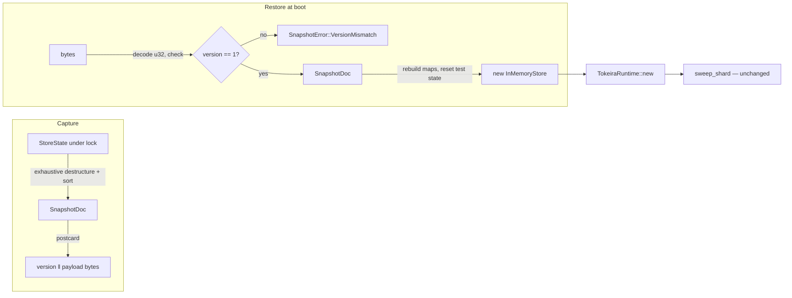

# Design Document: InMemoryStore Snapshots

## Overview

Add two API surfaces to `InMemoryStore` (`crates/tokeira-storage/src/memory.rs`):

- `snapshot(&self) -> Result<Vec<u8>, SnapshotError>` — one consistent, versioned,
  byte-deterministic encoding of the store's durable-equivalent state.
- `from_snapshot(bytes: &[u8]) -> Result<InMemoryStore, SnapshotError>` — a boot-only
  constructor that refuses version mismatches and malformed input.

The encoding is postcard over an explicit mirror document (`SnapshotDoc`) whose map
fields are sorted `Vec<(K, V)>` pairs, so identical states always produce identical
bytes. Behaviour derivations: the store's own state shape (`StoreState`,
`memory.rs:76-151`), the runtime recovery contract (`recovery.rs:1-31`), and the
crate's existing postcard persistence precedent (`dsql/codec.rs:48-62`,
`worker_compute.rs:26`).

## Dependencies and Non-Goals

### Owning relationships

- **`tokeira-engine`** consumes this mechanism and owns all scheduling policy —
  when to snapshot, where bytes go, shutdown hooks — identically for both of its
  serving modes: the embedded facade (`Engine`) and the listener-backed in-memory
  daemon (`tokeirad` / `TokeiradHandle`).
- **`tokeira-runtime` recovery** (`sweep_shard`, `recovery.rs:87`) is unchanged; it is
  the proof surface — a restored store must be a drop-in repository for it.
- **`tokeira-kernel`** and **`tokeira-types`** receive derive-only additions
  (`Serialize`/`Deserialize` on three transition-op enums; `PartialOrd`/`Ord` on ID
  newtypes). No logic changes; kernel purity (§2) is untouched — derives add no I/O.

### Non-goals

- Snapshot scheduling, file I/O, shutdown integration (`tokeira-engine`).
- Cross-version snapshot migration; the version stamp refuses, never migrates.
- Hot restore into a live store.
- Any change to DSQL backend behaviour or a Temporal-facing surface.

## Architecture

Everything lives on the existing single-lock store. `snapshot` is a read: lock, build
`SnapshotDoc` from `&StoreState`, encode, unlock. `from_snapshot` is a constructor:
decode version, refuse mismatch, decode payload, rebuild `StoreState` maps, wrap in a
fresh `Arc<Mutex<_>>`. The runtime path is untouched — a restored store enters service
exactly like any other store: handed to `TokeiraRuntime::new`, swept by `sweep_shard`
on shard takeover.



## Components and Interfaces

### Snapshot API (`crates/tokeira-storage/src/memory.rs`)

```rust
/// Current snapshot format version. Bumped on any change to `SnapshotDoc` or its
/// reachable types; old snapshots are refused, never migrated.
const SNAPSHOT_FORMAT_VERSION: u32 = 1;

/// Errors from the snapshot persist/restore surface.
#[derive(Debug, thiserror::Error)]
pub enum SnapshotError {
    #[error("snapshot format version {found} is not supported (supported: {supported}); \
             the in-memory snapshot format is unstable and old snapshots cannot be loaded")]
    VersionMismatch { found: u32, supported: u32 },
    #[error("failed to decode snapshot: {0}")]
    Decode(postcard::Error),
    #[error("failed to encode snapshot: {0}")]
    Encode(postcard::Error),
}

impl InMemoryStore {
    /// Serialize the store's durable-equivalent state as one consistent cut.
    pub async fn snapshot(&self) -> Result<Vec<u8>, SnapshotError>;

    /// Construct a NEW store from snapshot bytes. Boot-only by design: restoring
    /// into a live store would violate lease/fencing assumptions, so no such API
    /// exists. Test-only state (conflict injections, injected conflict policy) is
    /// reset, never restored.
    pub fn from_snapshot(bytes: &[u8]) -> Result<Self, SnapshotError>;
}
```

Encoding layout: `postcard(u32 version)` immediately followed by
`postcard(SnapshotDoc)`. Decode uses `postcard::take_from_bytes::<u32>` first so the
version check needs no payload decoding (Requirement 2.1), then
`postcard::take_from_bytes::<SnapshotDoc>` on the remainder, rejecting non-empty
trailing bytes as `Decode` (Requirement 2.3).

`SnapshotError` is exported from the crate root via the existing
`pub use memory::*` (`lib.rs:37`).

### `SnapshotDoc` — the canonical mirror (`memory.rs`, private)

A private struct mirroring `StoreState` field-for-field, except:

- every `HashMap<K, V>` field becomes `Vec<(K, V)>` **sorted by `K`** (and
  `workflow_rules`'s inner `BTreeMap` becomes sorted `Vec` pairs likewise);
- `dispatch_backlog: VecDeque<BacklogEntry>` becomes `Vec<BacklogEntry>` in queue
  order (order is meaningful, not sorted);
- the two test-only fields (`conflict_injections`, `conflict_policy`) do not exist on
  the doc at all.

Conversion is two explicit functions. `StoreState → SnapshotDoc` opens with a **full
destructuring `let` with no `..` rest pattern** — the compiler then forces every
future `StoreState` field to be explicitly classified (persisted into the doc, or
discarded like the test-only fields) before the crate builds again. This is the
mechanism that keeps the State Policy table in `requirements.md` honest over time.
`SnapshotDoc → StoreState` rebuilds each `HashMap`/`BTreeMap`/`VecDeque` by insertion
and fills the two test-only fields with their defaults.

Sorted-pair encoding is what makes snapshot bytes deterministic (Requirement 1.3):
`HashMap` iteration order is randomized per map instance (the crate's standing
determinism hazard, `crates/tokeira-storage/AGENTS.md`), so serializing maps directly
would make byte output nondeterministic and Property 1's byte-identity check
impossible.

### Derive additions (mechanical, no logic)

Missing `Serialize`/`Deserialize` (all field types are already serde-capable;
verified against source 2026-08-20):

| Type | Location |
|---|---|
| `WorkerTaskProvenance` | `api.rs:53` |
| `RequestRecord` | `api.rs:669` |
| `TransitionAuditRecord` | `api.rs:690` |
| `ProjectionRecord` | `api.rs:1962` |
| `BacklogEntry` | `api.rs:1331` |
| `DispatchableActivityTask` | `api.rs:1221` |
| `DispatchableWorkflowTask` | `api.rs:1127` |
| `ActivityDispatchEntry` (private) | `memory.rs:214` |
| `ActivityOp` | `tokeira-kernel/src/transition.rs:84` |
| `TimerOp` | `tokeira-kernel/src/transition.rs:93` |
| `DispatchOp` | `tokeira-kernel/src/transition.rs:107` |

The kernel additions align those three op enums with §1's standing rule
("Serializable types derive `Serialize, Deserialize`") that `ProjectionOp`
(`transition.rs:346`) already follows.

Missing `PartialOrd`/`Ord`, needed for sorted-pair keys (all wrap types that already
impl `Ord`; the same files already carry the precedent — `GenerationCounter`,
`WorkflowId`, `DeploymentName`, `WorkerDeploymentVersionKey`):

| Type | Location |
|---|---|
| `NamespaceId`, `RunId`, `RunKey`, `ShardId` | `tokeira-types/src/ids.rs` |
| `TaskQueueName` | `tokeira-types` |
| `DeploymentKey` | `api.rs:205` |
| `StoredTaskQueueConfigKey` | `api.rs:263` |

Note: `DispatchableActivityTask`/`DispatchableWorkflowTask` carry a **manual
`PartialEq` that deliberately ignores `order`** (`api.rs:1252`, `api.rs:1153`). The
serde derive still round-trips `order` faithfully — Property 1's byte-identity check
covers it where `PartialEq` would not. Tests must not rely on `PartialEq` to prove
`order` survived.

`time::OffsetDateTime`/`time::Duration` fields serialize with the workspace `time`
crate's plain `serde` feature (compact non-human-readable encoding — correct for
postcard), matching the bare-field house pattern in `worker_compute.rs`.

### Cargo change (`crates/tokeira-storage/Cargo.toml`)

`postcard` moves out of the `dsql` optional gate and becomes an unconditional
dependency of this crate (drop `optional = true`, drop `"dep:postcard"` from the
`dsql` feature list). No version change; optional dependencies are already present in
`Cargo.lock`, so the lockfile is untouched (Requirement 5.1, 5.2).

## Data Models

`SnapshotDoc` fields trace 1:1 to the State Policy table in `requirements.md`
(24 persisted fields of `StoreState`, `memory.rs:76-151`; the 2 test-only fields
excluded). No new domain types; the doc is a serialization shape, not a model. The
wire layout is `version: u32` then the doc, both postcard-encoded; the format is
explicitly unstable (dev/embedded tier) and documented as such on the API.

## Correctness Properties

### Property 1: Snapshot round-trip identity

*For any* store state reachable through the public repository surface (generated
sequences of workflow-state commits, deployment/task-queue-config/workflow-rule/
provenance/lease writes, backlog pushes), `snapshot(from_snapshot(snapshot(s)))` SHALL
equal `snapshot(s)` byte-for-byte, and repeated `snapshot(s)` calls with no
intervening writes SHALL be byte-identical. (Because `SnapshotDoc` is canonical —
sorted pairs, no test-only state — byte identity is state identity for every
persisted field.)

**Validates: Requirements 1.1, 1.3, 1.5, 3.2**

### Property 2: Malformed and mismatched input is refused, never applied

*For any* byte string that is (a) a valid snapshot re-stamped with a format version
other than the current one, (b) a valid snapshot truncated to any proper prefix, (c) a
valid snapshot with arbitrary trailing bytes appended, or (d) arbitrary bytes,
`from_snapshot` SHALL return `VersionMismatch` for (a) — naming found and supported
versions — and `Decode` (or a valid store, for (d) inputs that happen to parse) for
the rest, and SHALL never panic.

**Validates: Requirements 2.1, 2.2, 2.3**

### Property 3: Test-only state never survives restore

*For any* store carrying injected OCC conflicts and a non-default conflict policy, the
restored store SHALL commit without synthetic conflicts and apply the default
`CurrentExecutionConflictPolicy`; the snapshot bytes of a store with and without such
injections SHALL be identical.

**Validates: Requirements 1.4, 3.3**

### Property 4: Restore-then-recovery equals restart-then-recovery

*For any* small generated workload driven through a real `TokeiraRuntime` (workflow
starts, signals, timers including already-due fire times, activity schedules), a fresh
runtime constructed over `from_snapshot(snapshot(store))` SHALL expose the same
observable recovered state as a fresh runtime constructed over the same live store
(the existing restart pattern, `runtime_lane.rs:407`): identical pollable workflow and
activity tasks, identical due-timer behaviour (past-due timers fire immediately),
and identical repository read results.

**Validates: Requirements 3.1, 3.4, 4.1, 4.2, 4.3**

## Error Handling

No wire surface — these errors reach embedded callers only, as `SnapshotError`.

| Condition | Internal error | External status/code |
|---|---|---|
| Snapshot bytes carry a different format version | `SnapshotError::VersionMismatch { found, supported }` | n/a (library API; message names both versions) |
| Truncated / corrupt / trailing-garbage input | `SnapshotError::Decode` | n/a |
| Payload fails to encode | `SnapshotError::Encode` | n/a |

All are `thiserror` variants (§1); no `anyhow` in the library surface, no panics on
any input.

## Testing Strategy

- **Property tests (required, proptest — the workspace standard):**
  - Properties 1–3 in `crates/tokeira-storage/src/memory.rs`'s existing
    `#[cfg(test)]` test module (they need crate-private access to seed state and
    observe resets), ≥100 iterations, state built via generated public-API operation
    sequences reusing the fixture style of `preservation_property_tests.rs`.
  - Property 4 in a new integration test `crates/tokeira-runtime/tests/runtime_snapshot.rs`,
    proptest over small generated workloads with a reduced iteration count (≥32 — each
    case builds two full runtimes; kept above the level where shrinking still works),
    plus deterministic example cases for the past-due-timer and restart-equivalence
    scenarios. Synchronization via polling APIs and channels — no sleeps (§1).
- **Unit tests (example-based):** version-mismatch and truncation fixed cases; empty
  store round-trip; `snapshot` on a store mid-use returns a consistent cut (concurrent
  writer task, decoded snapshot always internally consistent — e.g. `history` and
  `history_principals` lengths agree).
- **Placement:** storage tests as above; no new test infrastructure; nextest is the
  contract runner (§10.4).
