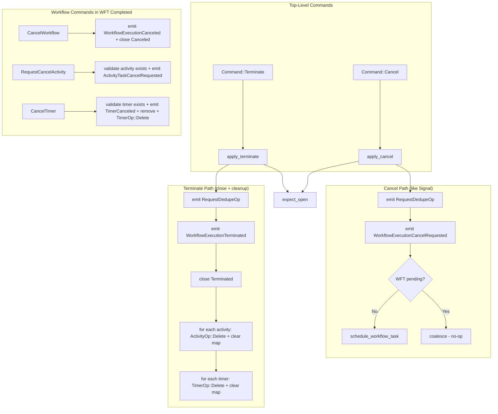

# Design Document: Cancel and Terminate (Feature 3)

## Overview

This feature adds two top-level kernel commands (Cancel, Terminate) and three workflow commands (CancelWorkflow, RequestCancelActivity, CancelTimer) to `tokeira-kernel`. These implement Temporal's two cancellation paradigms:

- **Cancel** is cooperative: record the request, schedule a WFT, let the workflow decide. Follows the same pattern as Signal (expect_open → emit dedupe → emit event → coalesce WFT).
- **Terminate** is unconditional: close the run immediately with `Terminated`, clean up all open entities. Follows the close pattern (like CompleteWorkflow/FailWorkflow) but adds an entity cleanup loop.

The three workflow commands are issued by workflow code within `WorkflowTaskCompleted`:
- **CancelWorkflow**: terminal command, emits `WorkflowExecutionCanceled`, calls `close(Canceled)`.
- **RequestCancelActivity**: validates activity exists, emits event, does NOT remove the activity.
- **CancelTimer**: validates timer exists, emits event, removes timer, pushes `TimerOp::Delete`.

No new `Reject` variants are needed. All rejection paths reuse existing variants (`MissingRun`, `RunClosed`, `UnknownActivity`, `UnknownTimer`, `CommandsAfterClose`).

Note: `WorkflowCommand` is matched exhaustively in downstream crates (`tokeira-edge` `translate.rs`, `grpc_properties.rs`). Adding new variants will require updating those match arms. The feature is considered complete only after `cargo check --workspace` passes.

## Architecture

All changes are additive to the existing kernel state machine. No existing code paths change.



### Cancel (`apply_cancel`)

Follows the exact same pattern as `apply_signal`:
1. `expect_open`
2. Construct `TransitionBuilder`
3. Push `RequestDedupeOp`
4. Emit `WorkflowExecutionCancelRequested` event
5. If no WFT pending, `schedule_workflow_task()`
6. `finish()`

The run stays open. No `ProjectionOp`, no `ActivityOp`, no `TimerOp`.

### Terminate (`apply_terminate`)

1. `expect_open`
2. Construct `TransitionBuilder`
3. Push `RequestDedupeOp`
4. Emit `WorkflowExecutionTerminated` event
5. Call `close(ExecutionStatus::Terminated)` — sets terminal status, clears pending WFT, clears sticky, emits `ProjectionOp::CloseExecution`
6. Entity cleanup loop:
   - For each entry in `state.activities`: push `ActivityOp::Delete`, then `state.activities.clear()`
   - For each entry in `state.timers`: push `TimerOp::Delete`, then `state.timers.clear()`
   - Note: Parent Close Policy for open child workflows is deferred to Feature 5. When child workflow tracking is added, this cleanup loop must be extended.
7. `finish()`

No `DispatchOp` is emitted. The worker is never consulted.

### Workflow Commands

In `apply_workflow_command`, three new match arms:

- `CancelWorkflow`: emit `WorkflowExecutionCanceled`, call `builder.close(ExecutionStatus::Cancelled)`, return `true` (run closed).
- `RequestCancelActivity { activity_id }`: validate `builder.state.activities.contains_key(&activity_id)` or reject with `UnknownActivity`. Emit `ActivityTaskCancelRequested`. Do NOT remove the activity. Return `false`.
- `CancelTimer { timer_id }`: validate `builder.state.timers.contains_key(&timer_id)` or reject with `UnknownTimer`. Emit `TimerCanceled`. Remove timer from `builder.state.timers`. Push `TimerOp::Delete`. Return `false`.

## Components and Interfaces

### New Type: ExternalWorkflowExecution

```rust
// command.rs
#[derive(Clone, Debug, PartialEq)]
pub struct ExternalWorkflowExecution {
    pub namespace_id: NamespaceId,
    pub workflow_id: WorkflowId,
    pub run_id: RunId,
}
```

Identifies the external workflow that initiated a cancellation (parent-driven cancellation).

### New Request Structs

```rust
// command.rs
#[derive(Clone, Debug, PartialEq)]
pub struct CancelRequest {
    pub reason: String,
    pub external_initiator: Option<ExternalWorkflowExecution>,
    pub request: RequestContext,
    pub now: OffsetDateTime,
}

#[derive(Clone, Debug, PartialEq)]
pub struct TerminateRequest {
    pub reason: String,
    pub details: Option<Payloads>,
    pub identity: String,
    pub request: RequestContext,
    pub now: OffsetDateTime,
}
```

### New Command Variants

```rust
// command.rs — add to existing Command enum
pub enum Command {
    // ... existing variants ...
    Cancel(CancelRequest),
    Terminate(TerminateRequest),
}
```

### New WorkflowCommand Variants

```rust
// command.rs — add to existing WorkflowCommand enum
pub enum WorkflowCommand {
    // ... existing variants ...
    CancelWorkflow,
    RequestCancelActivity { activity_id: String },
    CancelTimer { timer_id: String },
}
```

### New HistoryEventKind Variants

```rust
// event.rs — add to existing HistoryEventKind enum
WorkflowExecutionCancelRequested {
    reason: String,
    external_workflow_execution: Option<ExternalWorkflowExecution>,
    request_id: String,
},
WorkflowExecutionTerminated {
    reason: String,
    details: Option<Payloads>,
    identity: String,
},
WorkflowExecutionCanceled,
ActivityTaskCancelRequested {
    activity_id: String,
},
TimerCanceled {
    timer_id: String,
},
```

### New Kernel Methods

```rust
// kernel.rs — add to BasicKernel impl
fn apply_cancel(&self, loaded: LoadedRun, req: CancelRequest) -> Result<Transition, Reject>;
fn apply_terminate(&self, loaded: LoadedRun, req: TerminateRequest) -> Result<Transition, Reject>;
```

### Routing in `BasicKernel::apply`

Two new match arms:

```rust
Command::Cancel(req) => self.apply_cancel(loaded, req),
Command::Terminate(req) => self.apply_terminate(loaded, req),
```

### Rejection Paths

All rejection paths reuse existing `Reject` variants:

| Condition | Reject Variant | Applies To |
|---|---|---|
| `LoadedRun::Absent` | `MissingRun` | Cancel, Terminate |
| Run is closed | `RunClosed(status)` | Cancel, Terminate |
| Unknown activity_id | `UnknownActivity(id)` | RequestCancelActivity |
| Unknown timer_id | `UnknownTimer(id)` | CancelTimer |
| Command after close | `CommandsAfterClose { index }` | CancelWorkflow followed by more commands |

## Data Models

No new data model types beyond `ExternalWorkflowExecution`, `CancelRequest`, and `TerminateRequest`. `WorkflowState`, `PendingWorkflowTask`, `Transition`, and all other state types remain unchanged.

### State Mutations Summary

| Field | Cancel | Terminate | CancelWorkflow | RequestCancelActivity | CancelTimer |
|---|---|---|---|---|---|
| `status` | Running (unchanged) | Terminated | Cancelled | Unchanged | Unchanged |
| `closed_at` | None (unchanged) | Some(now) | Some(now) | Unchanged | Unchanged |
| `pending_workflow_task` | Unchanged or new WFT | None (cleared) | None (cleared) | Unchanged | Unchanged |
| `sticky` | Unchanged | None (cleared) | None (cleared) | Unchanged | Unchanged |
| `activities` | Unchanged | Cleared (empty) | Unchanged | Unchanged (activity preserved) | Unchanged |
| `timers` | Unchanged | Cleared (empty) | Unchanged | Unchanged | Timer removed |
| `last_event_id` | +1 or +2 | +1 | +1 (within WFT completed) | +1 (within WFT completed) | +1 (within WFT completed) |
| `transition_seq` | +1 | +1 | +1 (part of WFT completed) | +1 (part of WFT completed) | +1 (part of WFT completed) |

### Transition Side Effects Summary

| Side Effect | Cancel (no WFT) | Cancel (WFT pending) | Terminate | CancelWorkflow | RequestCancelActivity | CancelTimer |
|---|---|---|---|---|---|---|
| `history_events` | 2 (CancelRequested + WFTScheduled) | 1 (CancelRequested) | 1 (Terminated) | 1 (Canceled) | 1 (CancelRequested) | 1 (TimerCanceled) |
| `dispatch_ops` | 1 (EnqueueWFT) | 0 | 0 | 0 | 0 | 0 |
| `request_dedupe_ops` | 1 | 1 | 1 | 0 | 0 | 0 |
| `activity_ops` | 0 | 0 | N (Delete per activity) | 0 | 0 | 0 |
| `timer_ops` | 0 | 0 | M (Delete per timer) | 0 | 0 | 1 (Delete) |
| `projection_ops` | 0 | 0 | 1 (CloseExecution) | 1 (CloseExecution) | 0 | 0 |


## Correctness Properties

*A property is a characteristic or behavior that should hold true across all valid executions of a system — essentially, a formal statement about what the system should do. Properties serve as the bridge between human-readable specifications and machine-verifiable correctness guarantees.*

### Property 1: Cancel event field pass-through

*For any* valid open WorkflowState and *for any* valid CancelRequest, when Cancel is applied, the emitted `WorkflowExecutionCancelRequested` event SHALL carry: the request's `reason`, the request's `external_initiator` as `external_workflow_execution`, and the request's `request.request_id` as `request_id`.

**Validates: Requirements 2.1.2**

### Property 2: Cancel does not close and has minimal side effects

*For any* valid open WorkflowState (with or without pending WFT, with or without open activities/timers) and *for any* valid CancelRequest, when Cancel is applied: `next_state.status` SHALL be `ExecutionStatus::Running`, `next_state.closed_at` SHALL be `None`, `projection_ops` SHALL be empty, `activity_ops` SHALL be empty, and `timer_ops` SHALL be empty.

**Validates: Requirements 2.1.5, 2.1.6, 2.1.7, 2.1.8, 10.1.1**

### Property 3: Cancel WFT coalescing

*For any* valid open WorkflowState with no pending WFT and *for any* valid CancelRequest, when Cancel is applied: `next_state.pending_workflow_task` SHALL be `Some` and `dispatch_ops` SHALL contain exactly one `EnqueueWorkflowTask`. Conversely, *for any* valid open WorkflowState with a pending WFT and *for any* valid CancelRequest, when Cancel is applied: `dispatch_ops` SHALL be empty and the existing pending WFT's `logical_seq` SHALL be preserved.

**Validates: Requirements 2.1.3, 2.1.4, 9.3.1, 9.3.2, 9.3.3, 10.2.1, 10.2.2**

### Property 4: Terminate event field pass-through

*For any* valid open WorkflowState and *for any* valid TerminateRequest, when Terminate is applied, the emitted `WorkflowExecutionTerminated` event SHALL carry: the request's `reason`, the request's `details`, and the request's `identity`.

**Validates: Requirements 3.1.2**

### Property 5: Terminate closes with full terminal state invariants

*For any* valid open WorkflowState and *for any* valid TerminateRequest, when Terminate is applied: `next_state.status` SHALL be `ExecutionStatus::Terminated`, `next_state.closed_at` SHALL be `Some`, `next_state.pending_workflow_task` SHALL be `None`, `next_state.sticky` SHALL be `None`, `next_state.activities` SHALL be empty, `next_state.timers` SHALL be empty, and `dispatch_ops` SHALL be empty.

**Validates: Requirements 3.1.3, 3.1.4, 3.1.5, 9.4.1, 9.4.2, 9.4.3, 9.4.4, 9.4.5, 9.4.6, 9.4.7, 10.4.1, 10.6.1**

### Property 6: Terminate entity cleanup count and consistency

*For any* valid open WorkflowState with N open activities and M open timers and *for any* valid TerminateRequest, when Terminate is applied: `activity_ops` SHALL contain exactly N `ActivityOp::Delete` ops, `timer_ops` SHALL contain exactly M `TimerOp::Delete` ops, every `ActivityOp::Delete` SHALL reference an `activity_id` that existed in the input state's activities map, and every `TimerOp::Delete` SHALL reference a `timer_id` that existed in the input state's timers map.

**Validates: Requirements 3.2.1, 3.2.2, 3.2.3, 3.2.4, 9.5.1, 9.5.2, 9.5.3, 9.5.4, 10.5.1**

### Property 7: RequestCancelActivity preserves activity in state

*For any* valid WorkflowTaskCompleted transition containing a RequestCancelActivity command for a valid activity, the activity SHALL remain in `next_state.activities` with the same `ActivityState` as before, and `activity_ops` SHALL NOT contain an `ActivityOp::Delete` for that activity.

**Validates: Requirements 5.1.1, 5.1.2, 5.1.3, 5.1.4, 9.7.1, 9.7.2, 10.9.1**

### Property 8: CancelTimer removes timer and emits delete op

*For any* valid WorkflowTaskCompleted transition containing a CancelTimer command for a valid timer, the timer SHALL NOT be in `next_state.timers`, and `timer_ops` SHALL contain a `TimerOp::Delete` for that `timer_id`.

**Validates: Requirements 6.1.1, 6.1.2, 6.1.3, 6.1.4, 9.8.1, 9.8.2, 10.10.1**

### Property 9: Structural invariants hold for new commands (via arb_valid_pair extension)

*For any* valid Cancel or Terminate transition (generated by extending `arb_valid_pair()`), the existing structural invariant properties SHALL hold: event IDs are contiguous from `last_event_id + 1` (Property 4), `transition_seq` increments exactly once (Property 5), closed workflows have no pending WFT or dispatch (Property 7), `last_event_id` equals the last emitted event's ID (Property 8), activity/timer ops are consistent with state (Property 9), and request dedup ops match the command type (Property 10). Additionally, *for any* valid WorkflowTaskCompleted transition containing CancelWorkflow, RequestCancelActivity, or CancelTimer commands, the same structural invariants SHALL hold.

**Validates: Requirements 2.1.1, 3.1.1, 9.1.1, 9.1.2, 9.1.3, 9.2.1, 9.2.2, 9.6.1, 9.6.2, 9.6.3, 10.3.1, 10.7.1, 10.8.1, 10.11.1, 10.11.2, 10.11.3, 10.11.4, 10.11.5**

## Error Handling

All rejection paths reuse existing `Reject` variants. No new variants are needed.

| Condition | Reject Variant | Applies To |
|---|---|---|
| `LoadedRun::Absent` | `MissingRun` | Cancel, Terminate |
| Run is closed | `RunClosed(status)` | Cancel, Terminate |
| Unknown activity_id | `UnknownActivity(id)` | RequestCancelActivity |
| Unknown timer_id | `UnknownTimer(id)` | CancelTimer |
| Command after CancelWorkflow | `CommandsAfterClose { index }` | CancelWorkflow followed by more commands |

Rejection checks happen in order: `expect_open` first (handles MissingRun and RunClosed), then entity existence validation. This matches the existing pattern used by all other kernel methods.

## Testing Strategy

### Property-Based Tests (proptest)

The project uses `proptest` in `tests/property_tests.rs`. All new property tests use the `proptest! { }` block style with minimum 100 iterations (proptest default is 256).

**Generator extension — `arb_valid_pair()`:** Add the following arms:

1. **Cancel (no pending WFT):** Generate a random `CancelRequest` against an open state with no pending WFT (with optional activities/timers to verify they're untouched).
2. **Cancel (with pending WFT):** Generate a random `CancelRequest` against an open state with a pending WFT.
3. **Terminate (with entities):** Generate a random `TerminateRequest` against an open state with 0–3 random activities and 0–3 random timers (with optional pending WFT).
4. **WorkflowTaskCompleted with CancelWorkflow:** Add `WorkflowCommand::CancelWorkflow` to the existing WFT completed arm's `prop_oneof!`.
5. **WorkflowTaskCompleted with RequestCancelActivity:** Generate a state with a started WFT and an open activity, issue `RequestCancelActivity` for that activity.
6. **WorkflowTaskCompleted with CancelTimer:** Generate a state with a started WFT and an open timer, issue `CancelTimer` for that timer.

This automatically extends existing properties 4, 5, 7, 8, 9, 10 to cover all new commands (Property 9).

**New generators needed:**

- `arb_cancel_request(now)` — generates random reason, optional `ExternalWorkflowExecution`, and `RequestContext`
- `arb_terminate_request(now)` — generates random reason, optional details, identity, and `RequestContext`
- `arb_external_workflow_execution()` — generates random `NamespaceId`, `WorkflowId`, `RunId`

**New property tests (8 tests):**

- `property_17_cancel_event_field_pass_through` — Feature: kernel-cancel-terminate, Property 1: Cancel event field pass-through
- `property_18_cancel_does_not_close` — Feature: kernel-cancel-terminate, Property 2: Cancel does not close and has minimal side effects
- `property_19_cancel_wft_coalescing` — Feature: kernel-cancel-terminate, Property 3: Cancel WFT coalescing
- `property_20_terminate_event_field_pass_through` — Feature: kernel-cancel-terminate, Property 4: Terminate event field pass-through
- `property_21_terminate_closes_with_terminal_invariants` — Feature: kernel-cancel-terminate, Property 5: Terminate closes with full terminal state invariants
- `property_22_terminate_entity_cleanup` — Feature: kernel-cancel-terminate, Property 6: Terminate entity cleanup count and consistency
- `property_23_request_cancel_activity_preserves_activity` — Feature: kernel-cancel-terminate, Property 7: RequestCancelActivity preserves activity in state
- `property_24_cancel_timer_removes_timer` — Feature: kernel-cancel-terminate, Property 8: CancelTimer removes timer and emits delete op

Each property test runs a minimum of 100 iterations. Each test is tagged with a comment referencing the design property:
- Tag format: `// Feature: kernel-cancel-terminate, Property {N}: {title}`

### Golden Tests

Individual `#[test]` functions in `tests/golden_tests.rs`. Each test constructs a specific input state, applies the command, and asserts the exact transition output.

**Cancel happy path tests (3 tests):**
- `cancel_with_no_pending_wft` — Cancel on open run, no WFT → schedules WFT (Req 11.1)
- `cancel_with_pending_wft` — Cancel on open run, WFT pending → coalesces (Req 11.2)
- `cancel_with_external_initiator` — Cancel with `ExternalWorkflowExecution` set (Req 11.3)

**Cancel rejection tests (2 tests):**
- `reject_cancel_absent_run` — MissingRun (Req 11.4.1)
- `reject_cancel_closed_run` — RunClosed (Req 11.4.2)

**Terminate happy path tests (3 tests):**
- `terminate_no_open_entities` — Terminate on open run, no activities/timers (Req 11.5)
- `terminate_with_activities_and_timers` — Terminate with 2 activities + 1 timer (Req 11.6)
- `terminate_with_pending_wft` — Terminate clears pending WFT (Req 11.7)

**Terminate rejection tests (2 tests):**
- `reject_terminate_absent_run` — MissingRun (Req 11.8.1)
- `reject_terminate_closed_run` — RunClosed (Req 11.8.2)

**Workflow command golden tests (7 tests):**
- `cancel_workflow_command` — CancelWorkflow closes with Canceled (Req 11.9)
- `cancel_workflow_then_another_command` — CommandsAfterClose rejection (Req 11.10)
- `request_cancel_activity` — Activity preserved in state (Req 11.11)
- `request_cancel_activity_unknown` — UnknownActivity rejection (Req 11.12)
- `cancel_timer` — Timer removed, TimerOp::Delete emitted (Req 11.13)
- `cancel_timer_unknown` — UnknownTimer rejection (Req 11.14)
- `request_cancel_activity_then_resolved_canceled` — Full lifecycle: RequestCancelActivity → ActivityResolved(Canceled) (Req 11.15)

**End-to-end golden test (1 test):**
- `cancel_then_cancel_workflow_e2e` — Cancel → WFTStarted → WFTCompleted(CancelWorkflow) → Canceled (Req 11.16)

### Test File Organization

All tests extend existing files:
- Property tests → `tokeira/crates/tokeira-kernel/tests/property_tests.rs`
- Golden tests → `tokeira/crates/tokeira-kernel/tests/golden_tests.rs`

No new test files are created.
