# Design Document: Child Workflows (Feature 5)

## Overview

This feature adds child workflow lifecycle support to `tokeira-kernel`. It depends on Features 1 (foundation), 3 (cancel/terminate), and 4 (continue-as-new/timeout) — all complete. It introduces:

- **StartChildWorkflow** workflow command (within `WorkflowTaskCompleted`): emit initiated event, create `ChildWorkflowState` entry, push `DispatchOp::StartChildWorkflow`.
- **ChildStartConfirmed** top-level command (from runtime): success → emit started event, update child entry; failure → emit failed event, remove child. Fenced by `initiated_event_id`.
- **ChildResolved** top-level command (from runtime): emit terminal event per resolution variant, remove child, schedule WFT.
- **Parent Close Policy** shared helper on `TransitionBuilder`: iterates children, emits `DispatchOp::TerminateChild` or `CancelChild` for started non-Abandon children, clears children map. Called from ALL close paths.

Neither `ChildStartConfirmed` nor `ChildResolved` carry `RequestContext` or emit `RequestDedupeOp`. They are internal runtime machinery.

This feature is both additive (new types, commands, methods) and invasive: it modifies the behavior of all 6 existing close paths (Terminate, WorkflowExecutionTimedOut, CompleteWorkflow, FailWorkflow, CancelWorkflow, ContinueAsNew) to apply Parent Close Policy, and it adds a new field (`children`) to durable `WorkflowState`.

## Architecture

```mermaid
graph TD
    subgraph "Workflow Commands in WFT Completed"
        SCW[StartChildWorkflow] --> V1{child_id unique?}
        V1 -->|Yes| E1[emit Initiated event]
        E1 --> CS1[create ChildWorkflowState]
        CS1 --> D1[push DispatchOp::StartChildWorkflow]
        V1 -->|No| R1[Reject::DuplicateChildWorkflowId]
    end

    subgraph "Top-Level: ChildStartConfirmed"
        CSC[ChildStartConfirmed] --> EO1[expect_open]
        EO1 --> V2{child known? event_id matches?}
        V2 -->|Unknown| R2[Reject::UnknownChild]
        V2 -->|Stale| R3[Reject::StaleChildConfirmation]
        V2 -->|Started| E2[emit ChildWorkflowExecutionStarted]
        E2 --> U1[update child: run_id + started_event_id]
        V2 -->|Failed| E3[emit StartChildWorkflowExecutionFailed]
        E3 --> RM1[remove child from map]
        U1 --> WFT1{WFT pending?}
        RM1 --> WFT1
        WFT1 -->|No| S1[schedule_workflow_task]
        WFT1 -->|Yes| NOOP1[coalesce]
    end

    subgraph "Top-Level: ChildResolved"
        CR[ChildResolved] --> EO2[expect_open]
        EO2 --> V3{child known?}
        V3 -->|No| R4[Reject::UnknownChild]
        V3 -->|Yes| E4[emit terminal event per variant]
        E4 --> RM2[remove child from map]
        RM2 --> WFT2{WFT pending?}
        WFT2 -->|No| S2[schedule_workflow_task]
        WFT2 -->|Yes| NOOP2[coalesce]
    end

    subgraph "Parent Close Policy Helper"
        PCP[apply_parent_close_policy] --> ITER[iterate children]
        ITER --> CHK{child_run_id Some?}
        CHK -->|Yes + Terminate| DT[push DispatchOp::TerminateChild]
        CHK -->|Yes + RequestCancel| DC[push DispatchOp::CancelChild]
        CHK -->|Yes + Abandon| SKIP[skip]
        CHK -->|None| SKIP
        ITER --> CLR[clear children map]
    end

```



### Close Path Integration

The `close()` method on `TransitionBuilder` already handles clearing pending WFT, sticky, and emitting `ProjectionOp::CloseExecution`. The Parent Close Policy helper is called AFTER `close()` but BEFORE `finish()` on every close path:

- **Terminate**: emit event → `close(Terminated)` → `std::mem::take` activities/timers → `apply_parent_close_policy()` → `finish()`
- **WorkflowExecutionTimedOut**: emit event → `close(TimedOut)` → `std::mem::take` activities/timers → `apply_parent_close_policy()` → `finish()`
- **CompleteWorkflow**: emit event → `close(Completed)` → `apply_parent_close_policy()` → return true
- **FailWorkflow**: emit event → `close(Failed)` → `apply_parent_close_policy()` → return true
- **CancelWorkflow**: emit event → `close(Cancelled)` → `apply_parent_close_policy()` → return true
- **ContinueAsNew**: emit event → `close(ContinuedAsNew)` → `apply_parent_close_policy()` → return true

For Terminate and WorkflowExecutionTimedOut, the existing `std::mem::take` pattern for activities/timers is preserved. Children cleanup follows the same pattern.

## Components and Interfaces

### New Types in `state.rs`

```rust
#[derive(Clone, Debug, PartialEq)]
pub struct ChildWorkflowState {
    pub child_workflow_id: WorkflowId,
    pub child_run_id: Option<RunId>,
    pub initiated_event_id: i64,
    pub started_event_id: Option<i64>,
    pub parent_close_policy: ParentClosePolicy,
}

#[derive(Clone, Copy, Debug, PartialEq, Eq)]
pub enum ParentClosePolicy {
    Terminate,
    RequestCancel,
    Abandon,
}
```

### WorkflowState Extension

```rust
// Add to WorkflowState struct:
pub children: BTreeMap<WorkflowId, ChildWorkflowState>,
```

Initialized to `BTreeMap::new()` in `apply_start`.

### New Types in `command.rs`

```rust
#[derive(Clone, Debug, PartialEq)]
pub struct ChildStartConfirmedRequest {
    pub child_workflow_id: WorkflowId,
    pub initiated_event_id: i64,
    pub result: ChildStartResult,
    pub now: OffsetDateTime,
}

#[derive(Clone, Debug, PartialEq)]
pub enum ChildStartResult {
    Started { child_run_id: RunId, workflow_type: WorkflowType },
    Failed { cause: String },
}

#[derive(Clone, Debug, PartialEq)]
pub struct ChildResolvedRequest {
    pub child_workflow_id: WorkflowId,
    pub resolution: ChildResolution,
    pub now: OffsetDateTime,
}

#[derive(Clone, Debug, PartialEq)]
pub enum ChildResolution {
    Completed { result: Payloads },
    Failed { failure: String },
    Canceled,
    Terminated,
    TimedOut,
}
```

### New Command Variants

```rust
// Add to Command enum:
ChildStartConfirmed(ChildStartConfirmedRequest),
ChildResolved(ChildResolvedRequest),
```

### New WorkflowCommand Variant

```rust
// Add to WorkflowCommand enum:
StartChildWorkflow {
    child_workflow_id: WorkflowId,
    namespace_id: NamespaceId,
    workflow_type: WorkflowType,
    task_queue: TaskQueueName,
    input: Payloads,
    parent_close_policy: ParentClosePolicy,
},
```

### New HistoryEventKind Variants

```rust
StartChildWorkflowExecutionInitiated {
    child_workflow_id: WorkflowId,
    workflow_type: WorkflowType,
    task_queue: TaskQueueName,
    input: Payloads,
    namespace_id: NamespaceId,
    parent_close_policy: ParentClosePolicy,
},
ChildWorkflowExecutionStarted {
    child_workflow_id: WorkflowId,
    child_run_id: RunId,
    workflow_type: WorkflowType,
},
StartChildWorkflowExecutionFailed {
    child_workflow_id: WorkflowId,
    cause: String,
},
ChildWorkflowExecutionCompleted {
    child_workflow_id: WorkflowId,
    result: Payloads,
},
ChildWorkflowExecutionFailed {
    child_workflow_id: WorkflowId,
    failure: String,
},
ChildWorkflowExecutionCanceled {
    child_workflow_id: WorkflowId,
},
ChildWorkflowExecutionTerminated {
    child_workflow_id: WorkflowId,
},
ChildWorkflowExecutionTimedOut {
    child_workflow_id: WorkflowId,
},
```

### New DispatchOp Variants

```rust
StartChildWorkflow {
    child_workflow_id: WorkflowId,
    namespace_id: NamespaceId,
    workflow_type: WorkflowType,
    task_queue: TaskQueueName,
    input: Payloads,
},
TerminateChild {
    child_workflow_id: WorkflowId,
    child_run_id: RunId,
    reason: String,
},
CancelChild {
    child_workflow_id: WorkflowId,
    child_run_id: RunId,
    reason: String,
},
```

### New Reject Variants

```rust
#[error("duplicate child workflow id: {0}")]
DuplicateChildWorkflowId(WorkflowId),
#[error("unknown child: {0}")]
UnknownChild(WorkflowId),
#[error("stale child confirmation for {child_workflow_id}: expected initiated_event_id {expected_initiated_event_id}")]
StaleChildConfirmation {
    child_workflow_id: WorkflowId,
    expected_initiated_event_id: i64,
},
```

### New Kernel Methods

```rust
fn apply_child_start_confirmed(&self, loaded: LoadedRun, req: ChildStartConfirmedRequest) -> Result<Transition, Reject>;
fn apply_child_resolved(&self, loaded: LoadedRun, req: ChildResolvedRequest) -> Result<Transition, Reject>;
```

### Parent Close Policy Helper on TransitionBuilder

```rust
impl TransitionBuilder {
    fn apply_parent_close_policy(&mut self) {
        let children = std::mem::take(&mut self.state.children);
        for (_, child) in children {
            if let Some(child_run_id) = child.child_run_id {
                match child.parent_close_policy {
                    ParentClosePolicy::Terminate => {
                        self.dispatch_ops.push(DispatchOp::TerminateChild {
                            child_workflow_id: child.child_workflow_id,
                            child_run_id,
                            reason: "parent closed".into(),
                        });
                    }
                    ParentClosePolicy::RequestCancel => {
                        self.dispatch_ops.push(DispatchOp::CancelChild {
                            child_workflow_id: child.child_workflow_id,
                            child_run_id,
                            reason: "parent closed".into(),
                        });
                    }
                    ParentClosePolicy::Abandon => {}
                }
            }
            // Children with child_run_id None: no dispatch op, just removed
        }
        // children map is already empty from std::mem::take
    }
}
```

### Rejection Paths

| Condition | Reject Variant | Applies To |
|---|---|---|
| Duplicate child_workflow_id | `DuplicateChildWorkflowId(id)` | StartChildWorkflow |
| Unknown child_workflow_id | `UnknownChild(id)` | ChildStartConfirmed, ChildResolved |
| Stale initiated_event_id | `StaleChildConfirmation { .. }` | ChildStartConfirmed |
| `LoadedRun::Absent` | `MissingRun` | ChildStartConfirmed, ChildResolved |
| Run is closed | `RunClosed(status)` | ChildStartConfirmed, ChildResolved |

## Data Models

No new standalone data model types beyond those listed in Components. `WorkflowState` gains the `children` field. `Transition` struct is unchanged.

### State Mutations Summary

| Field | StartChildWorkflow | ChildStartConfirmed(Started) | ChildStartConfirmed(Failed) | ChildResolved |
|---|---|---|---|---|
| `status` | Unchanged | Unchanged | Unchanged | Unchanged |
| `children` | +1 entry | Entry updated (run_id, started_event_id) | Entry removed | Entry removed |
| `pending_workflow_task` | Unchanged | Unchanged or new WFT | Unchanged or new WFT | Unchanged or new WFT |
| `last_event_id` | +1 (within WFT) | +1 or +2 | +1 or +2 | +1 or +2 |
| `transition_seq` | +1 (part of WFT) | +1 | +1 | +1 |

### Downstream Breakage

Adding new variants to these enums will break exhaustive matches in downstream crates:
- `WorkflowCommand` — `tokeira-edge` `translate.rs`, `grpc_properties.rs`
- `Command` — `BasicKernel::apply` match
- `Reject` — any match on Reject
- `DispatchOp` — runtime dispatch handling
- `HistoryEventKind` — event serialization/display

`WorkflowState` gains `children` field — all construction sites must be updated. Feature is complete only after `cargo check --workspace` passes.

## Correctness Properties

*A property is a characteristic or behavior that should hold true across all valid executions of a system — essentially, a formal statement about what the system should do. Properties serve as the bridge between human-readable specifications and machine-verifiable correctness guarantees.*

### Property 1: StartChildWorkflow creates child entry, emits event, and emits dispatch op

*For any* valid open WorkflowState and *for any* valid StartChildWorkflow command with a unique child_workflow_id, when applied within WorkflowTaskCompleted: (a) `next_state.children` SHALL contain an entry for the child_workflow_id with `child_run_id: None`, `started_event_id: None`, the correct `initiated_event_id`, and the specified `parent_close_policy`; (b) `history_events` SHALL contain a `StartChildWorkflowExecutionInitiated` event with matching fields; (c) `dispatch_ops` SHALL contain a `DispatchOp::StartChildWorkflow` with matching child_workflow_id, namespace_id, workflow_type, task_queue, and input.

**Validates: Requirements 2.1, 7.4.1, 8.1, 8.2**

### Property 2: StartChildWorkflow rejects duplicate child_workflow_id

*For any* valid open WorkflowState with a child_workflow_id already in the children map, when a StartChildWorkflow command with the same child_workflow_id is applied, the Kernel SHALL reject with `DuplicateChildWorkflowId`.

**Validates: Requirements 2.2, 8.11**

### Property 3: ChildStartConfirmed(Started) emits started event and updates child entry

*For any* valid open WorkflowState with a known child whose `initiated_event_id` matches, when `ChildStartConfirmed(Started)` is applied: (a) `history_events` SHALL contain a `ChildWorkflowExecutionStarted` event with the child_workflow_id, child_run_id, and workflow_type; (b) `next_state.children` SHALL contain the child entry with `started_event_id: Some` and `child_run_id: Some`.

**Validates: Requirements 3.1, 7.4.2, 8.3**

### Property 4: ChildStartConfirmed(Failed) emits failed event and removes child

*For any* valid open WorkflowState with a known child whose `initiated_event_id` matches, when `ChildStartConfirmed(Failed)` is applied: (a) `history_events` SHALL contain a `StartChildWorkflowExecutionFailed` event with the child_workflow_id and cause; (b) `next_state.children` SHALL NOT contain the child_workflow_id.

**Validates: Requirements 3.2, 7.4.3, 8.4**

### Property 5: ChildStartConfirmed WFT coalescing

*For any* valid open WorkflowState with a known child and no pending WFT, when ChildStartConfirmed is applied, `next_state` SHALL have a pending WFT and `dispatch_ops` SHALL contain one `EnqueueWorkflowTask`. Conversely, *for any* valid open WorkflowState with a known child and a pending WFT, when ChildStartConfirmed is applied, `dispatch_ops` SHALL NOT contain an `EnqueueWorkflowTask`.

**Validates: Requirements 3.1.3, 3.1.4, 3.2.3, 7.3.1, 8.3**

### Property 6: ChildStartConfirmed fencing rejects stale initiated_event_id

*For any* valid open WorkflowState with a known child, when ChildStartConfirmed is applied with an `initiated_event_id` that does not match the child entry's `initiated_event_id`, the Kernel SHALL reject with `StaleChildConfirmation` carrying the child_workflow_id and the expected initiated_event_id.

**Validates: Requirements 3.3.2, 8.9**

### Property 7: ChildResolved event matches resolution variant

*For any* valid open WorkflowState with a known child and *for any* `ChildResolution` variant, when ChildResolved is applied, the emitted event SHALL match the resolution: Completed → `ChildWorkflowExecutionCompleted`, Failed → `ChildWorkflowExecutionFailed`, Canceled → `ChildWorkflowExecutionCanceled`, Terminated → `ChildWorkflowExecutionTerminated`, TimedOut → `ChildWorkflowExecutionTimedOut`.

**Validates: Requirements 4.1.1–4.1.5**

### Property 8: ChildResolved removes child

*For any* valid open WorkflowState with a known child and *for any* `ChildResolution` variant, when ChildResolved is applied, `next_state.children` SHALL NOT contain the child_workflow_id.

**Validates: Requirements 4.1.6, 7.4.4, 8.5**

### Property 9: ChildResolved WFT coalescing

*For any* valid open WorkflowState with a known child and no pending WFT, when ChildResolved is applied, `next_state` SHALL have a pending WFT. Conversely, *for any* valid open WorkflowState with a known child and a pending WFT, when ChildResolved is applied, `dispatch_ops` SHALL NOT contain an `EnqueueWorkflowTask`.

**Validates: Requirements 4.1.7, 4.1.8, 7.3.2, 8.6**

### Property 10: Parent Close Policy on all close paths

*For any* valid close transition (Terminate, WorkflowExecutionTimedOut, CompleteWorkflow, FailWorkflow, CancelWorkflow, ContinueAsNew) with N open children: (a) `next_state.children` SHALL be empty; (b) the number of `DispatchOp::TerminateChild` ops SHALL equal the number of children with `ParentClosePolicy::Terminate` and `child_run_id: Some` in the input state; (c) the number of `DispatchOp::CancelChild` ops SHALL equal the number of children with `ParentClosePolicy::RequestCancel` and `child_run_id: Some`; (d) no `TerminateChild` or `CancelChild` SHALL be emitted for children with `Abandon` policy or `child_run_id: None`.

**Validates: Requirements 5.1–5.7, 7.5, 7.6, 8.7, 8.8**

### Property 11: No RequestDedupeOp for child commands

*For any* valid ChildStartConfirmed or ChildResolved transition, `request_dedupe_ops` SHALL be empty.

**Validates: Requirements 3.1.5, 4.1.9, 7.7, 8.10**

### Property 12: Structural invariants hold for child transitions (via arb_valid_pair extension)

*For any* valid child workflow transition (generated by extending `arb_valid_pair()`), the existing structural invariant properties SHALL hold: event IDs are contiguous (Property 4), `transition_seq` increments exactly once (Property 5), closed workflows have no pending WFT or dispatch (Property 7), `last_event_id` equals the last emitted event's ID (Property 8), activity/timer ops are consistent with state (Property 9), and request dedup ops match the command type (Property 10).

**Validates: Requirements 7.1, 7.2, 7.3**

### Property 13: Start initializes children to empty

*For any* valid Start transition, `next_state.children` SHALL be empty.

**Validates: Requirements 1.3, 6.4**

## Error Handling

| Condition | Reject Variant | Applies To |
|---|---|---|
| `LoadedRun::Absent` | `MissingRun` | ChildStartConfirmed, ChildResolved |
| Run is closed | `RunClosed(status)` | ChildStartConfirmed, ChildResolved |
| Duplicate child_workflow_id in children map | `DuplicateChildWorkflowId(id)` | StartChildWorkflow |
| child_workflow_id not in children map | `UnknownChild(id)` | ChildStartConfirmed, ChildResolved |
| initiated_event_id mismatch | `StaleChildConfirmation { child_workflow_id, expected_initiated_event_id }` | ChildStartConfirmed |
| Command after close | `CommandsAfterClose { index }` | StartChildWorkflow after a close command |

Rejection checks follow the existing pattern: `expect_open` first (handles MissingRun and RunClosed), then entity-specific validation.

## Testing Strategy

### Property-Based Tests (proptest)

All property tests use `proptest! { }` block style in `tests/property_tests.rs`. Minimum 100 iterations (proptest default is 256). Each test is tagged with a comment: `// Feature: kernel-child-workflows, Property {N}: {title}`.

**Generator extension — `arb_valid_pair()`:** Add the following arms:

1. **ChildStartConfirmed(Started), no pending WFT:** Generate open state with a child entry (initiated but not started), apply `ChildStartConfirmed(Started)` with matching `initiated_event_id`.
2. **ChildStartConfirmed(Started), with pending WFT:** Same but state has a pending WFT.
3. **ChildStartConfirmed(Failed):** Generate open state with a child entry, apply `ChildStartConfirmed(Failed)`.
4. **ChildResolved (all variants):** Generate open state with a started child entry, apply `ChildResolved` with random `ChildResolution`.
5. **WorkflowTaskCompleted with StartChildWorkflow:** Add `StartChildWorkflow` to the existing WFT completed arm's `prop_oneof!`.
6. **Terminate with children:** Extend existing Terminate arm to include 0–3 random children with random policies and random `child_run_id` (Some or None).
7. **WorkflowExecutionTimedOut with children:** Extend existing TimedOut arm similarly.
8. **Close workflow commands with children:** Extend CompleteWorkflow, FailWorkflow, CancelWorkflow, ContinueAsNew arms to include random children.

This automatically extends existing properties 4, 5, 7, 8, 9, 10 to cover all new commands (Property 12).

**New generators needed:**

- `arb_parent_close_policy()` — generates random `ParentClosePolicy` variant
- `arb_child_workflow_state(initiated_event_id)` — generates a `ChildWorkflowState` with random policy, optional `child_run_id`/`started_event_id`
- `arb_child_start_result()` — generates random `ChildStartResult` (Started or Failed)
- `arb_child_resolution()` — generates random `ChildResolution` variant
- `arb_start_child_workflow_command()` — generates random `StartChildWorkflow` workflow command
- `arb_children(n, initiated_event_id_base)` — generates 0–n random children in a `BTreeMap`
- `with_child(state, child_workflow_id, initiated_event_id, policy, started)` — helper to add a child to state

**New property tests (11 tests):**

- `property_33_start_child_workflow_happy_path` — Feature: kernel-child-workflows, Property 1: StartChildWorkflow creates child entry, emits event, and emits dispatch op
- `property_34_start_child_workflow_rejects_duplicate` — Feature: kernel-child-workflows, Property 2: StartChildWorkflow rejects duplicate child_workflow_id
- `property_35_child_start_confirmed_started` — Feature: kernel-child-workflows, Property 3: ChildStartConfirmed(Started) emits started event and updates child entry
- `property_36_child_start_confirmed_failed` — Feature: kernel-child-workflows, Property 4: ChildStartConfirmed(Failed) emits failed event and removes child
- `property_37_child_start_confirmed_wft_coalescing` — Feature: kernel-child-workflows, Property 5: ChildStartConfirmed WFT coalescing
- `property_38_child_start_confirmed_fencing` — Feature: kernel-child-workflows, Property 6: ChildStartConfirmed fencing rejects stale initiated_event_id
- `property_39_child_resolved_event_matches_variant` — Feature: kernel-child-workflows, Property 7: ChildResolved event matches resolution variant
- `property_40_child_resolved_removes_child` — Feature: kernel-child-workflows, Property 8: ChildResolved removes child
- `property_41_child_resolved_wft_coalescing` — Feature: kernel-child-workflows, Property 9: ChildResolved WFT coalescing
- `property_42_parent_close_policy_all_paths` — Feature: kernel-child-workflows, Property 10: Parent Close Policy on all close paths
- `property_43_start_initializes_children_empty` — Feature: kernel-child-workflows, Property 13: Start initializes children to empty

Properties 11 and 12 are covered by extending `arb_valid_pair()` and the existing property tests (property_10 for dedup, properties 4/5/7/8/9 for structural invariants).

### Golden Tests

Individual `#[test]` functions in `tests/golden_tests.rs`:

**StartChildWorkflow (3 tests):**
- `start_child_workflow_happy_path` — Unique child_workflow_id → initiated event + child entry + dispatch op
- `start_child_workflow_duplicate_rejected` — Duplicate child_workflow_id → `DuplicateChildWorkflowId`
- `start_child_workflow_does_not_close` — Run remains open after StartChildWorkflow

**ChildStartConfirmed (5 tests):**
- `child_start_confirmed_started_no_wft` — Started result, no pending WFT → started event + WFT scheduled
- `child_start_confirmed_started_with_wft` — Started result, WFT pending → started event, no second WFT
- `child_start_confirmed_failed` — Failed result → failed event + child removed + WFT scheduled
- `child_start_confirmed_unknown_child` — Unknown child_workflow_id → `UnknownChild`
- `child_start_confirmed_stale_fencing` — Mismatched initiated_event_id → `StaleChildConfirmation`

**ChildResolved (4 tests):**
- `child_resolved_completed` — Completed resolution → completed event + child removed + WFT
- `child_resolved_failed` — Failed resolution → failed event + child removed
- `child_resolved_all_terminal_variants` — Canceled/Terminated/TimedOut each emit correct event
- `child_resolved_unknown_child` — Unknown child_workflow_id → `UnknownChild`

**Parent Close Policy (4 tests):**
- `terminate_with_children_policy_terminate` — Terminate with Terminate-policy started children → TerminateChild ops
- `terminate_with_children_policy_cancel` — Terminate with RequestCancel-policy started children → CancelChild ops
- `terminate_with_children_policy_abandon` — Terminate with Abandon-policy children → no child dispatch ops
- `terminate_with_unstarted_children` — Children with child_run_id None → no dispatch ops, children still cleared

**Close path coverage (3 tests):**
- `complete_workflow_with_children` — CompleteWorkflow clears children + emits policy ops
- `continue_as_new_with_children` — ContinueAsNew clears children + emits policy ops
- `workflow_execution_timed_out_with_children` — TimedOut clears children + emits policy ops

**End-to-end (1 test):**
- `child_workflow_full_lifecycle_e2e` — StartChildWorkflow → ChildStartConfirmed(Started) → ChildResolved(Completed) → child removed, WFT scheduled

### Test File Organization

All tests extend existing files:
- Property tests → `tokeira/crates/tokeira-kernel/tests/property_tests.rs`
- Golden tests → `tokeira/crates/tokeira-kernel/tests/golden_tests.rs`

No new test files are created.