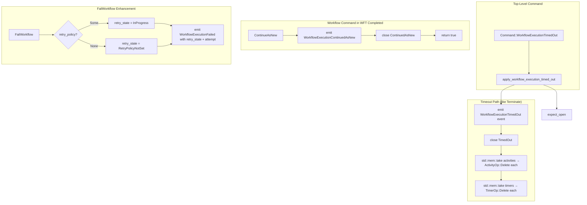

# Design Document: ContinueAsNew and Workflow-Level Timeout (Feature 4)

## Overview

This feature adds the `ContinueAsNew` workflow command, the `WorkflowExecutionTimedOut` top-level command, and retry metadata emission to `tokeira-kernel`. It also extends `ExecutionStatus` with two new terminal variants.

- **ContinueAsNew** is a workflow command within `WorkflowTaskCompleted`. It emits `WorkflowExecutionContinuedAsNew`, calls `close(ContinuedAsNew)`, and returns `true`. The kernel does NOT create the successor run; the runtime reads the event and issues a `Start`.
- **WorkflowExecutionTimedOut** is a top-level command following the same pattern as `apply_terminate`: `expect_open` → emit event → `close(TimedOut)` → entity cleanup via `std::mem::take`. No request dedup, no WFT dispatch.
- **Retry metadata** is added to `WorkflowExecutionFailed`: the event gains `retry_state` and `attempt` fields. The kernel sets `retry_state` based on retry policy presence but does NOT evaluate retry logic.

Downstream breakage: `WorkflowCommand`, `Command`, `ExecutionStatus`, and `HistoryEventKind` all gain variants. `WorkflowExecutionFailed` gains fields. All exhaustive matches across the workspace must be updated.

## Architecture

All changes are additive to the existing kernel state machine. No existing code paths change semantically (only `FailWorkflow` gains two new fields in its event emission).



### WorkflowExecutionTimedOut (`apply_workflow_execution_timed_out`)

Follows the exact same pattern as `apply_terminate`:
1. `expect_open`
2. Construct `TransitionBuilder`
3. Emit `WorkflowExecutionTimedOut` event (timeout_type, retry_state from request)
4. Call `close(ExecutionStatus::TimedOut)`
5. Entity cleanup: `std::mem::take(&mut builder.state.activities)` → `ActivityOp::Delete` each; `std::mem::take(&mut builder.state.timers)` → `TimerOp::Delete` each
6. `finish()`

No `RequestDedupeOp`. No `DispatchOp`. The worker is never consulted.

### ContinueAsNew (workflow command)

In `apply_workflow_command`, new match arm:
1. Emit `WorkflowExecutionContinuedAsNew` event carrying all fields from the command
2. Call `builder.close(ExecutionStatus::ContinuedAsNew)`
3. Return `Ok(true)` — run is closed, subsequent commands rejected with `CommandsAfterClose`

No `DispatchOp`. No entity cleanup (the `close` method handles clearing pending WFT and sticky; activities/timers remain in state but the run is terminal).

### FailWorkflow Enhancement

The existing `FailWorkflow` match arm is updated to:
1. Compute `retry_state`: if `builder.state.retry_policy.is_some()` → `RetryState::InProgress`, else → `RetryState::RetryPolicyNotSet`
2. Read `attempt` from `builder.state.attempt`
3. Emit `WorkflowExecutionFailed { message, details, retry_state, attempt }`
4. Call `close(ExecutionStatus::Failed)` (unchanged)

## Components and Interfaces

### New Domain Enums

```rust
// command.rs

/// Distinguishes execution-level vs run-level workflow timeouts.
#[derive(Clone, Debug, PartialEq)]
pub enum WorkflowTimeoutType {
    ExecutionTimeout,
    RunTimeout,
}

/// Retry disposition of a closed run, provided by the runtime.
#[derive(Clone, Debug, PartialEq)]
pub enum RetryState {
    InProgress,
    NonRetryableFailure,
    Timeout,
    MaximumAttemptsReached,
    RetryPolicyNotSet,
    InternalServerError,
    CancelRequested,
}
```

### New Request Struct

```rust
// command.rs

#[derive(Clone, Debug, PartialEq)]
pub struct WorkflowExecutionTimedOutRequest {
    pub timeout_type: WorkflowTimeoutType,
    pub retry_state: RetryState,
    pub now: OffsetDateTime,
}
```

No `RequestContext` field — this is internal runtime machinery.

### New Command Variant

```rust
// command.rs — add to existing Command enum
pub enum Command {
    // ... existing variants ...
    WorkflowExecutionTimedOut(WorkflowExecutionTimedOutRequest),
}
```

### New WorkflowCommand Variant

```rust
// command.rs — add to existing WorkflowCommand enum
pub enum WorkflowCommand {
    // ... existing variants ...
    ContinueAsNew {
        new_run_id: RunId,
        workflow_type: WorkflowType,
        task_queue: TaskQueueName,
        input: Payloads,
        memo: Memo,
        search_attributes: SearchAttributes,
        workflow_execution_timeout: Option<Duration>,
        workflow_run_timeout: Option<Duration>,
        workflow_task_timeout: Duration,
    },
}
```

### ExecutionStatus New Variants

```rust
// tokeira-types/src/execution.rs — add to existing ExecutionStatus enum
pub enum ExecutionStatus {
    // ... existing variants ...
    ContinuedAsNew,
    TimedOut,
}
```

`is_open` returns `false` for both.

### New HistoryEventKind Variants

```rust
// event.rs — add to existing HistoryEventKind enum
WorkflowExecutionContinuedAsNew {
    new_run_id: RunId,
    workflow_type: WorkflowType,
    task_queue: TaskQueueName,
    input: Payloads,
    memo: Memo,
    search_attributes: SearchAttributes,
    workflow_execution_timeout: Option<Duration>,
    workflow_run_timeout: Option<Duration>,
    workflow_task_timeout: Duration,
},
WorkflowExecutionTimedOut {
    timeout_type: WorkflowTimeoutType,
    retry_state: RetryState,
},
```

### Modified HistoryEventKind Variant

```rust
// event.rs — WorkflowExecutionFailed gains two fields
WorkflowExecutionFailed {
    message: String,
    details: Option<Payload>,
    retry_state: RetryState,  // NEW
    attempt: u32,              // NEW
},
```

### New Kernel Method

```rust
// kernel.rs — add to BasicKernel impl
fn apply_workflow_execution_timed_out(
    &self, loaded: LoadedRun, req: WorkflowExecutionTimedOutRequest
) -> Result<Transition, Reject>;
```

### Routing in `BasicKernel::apply`

One new match arm:

```rust
Command::WorkflowExecutionTimedOut(req) => self.apply_workflow_execution_timed_out(loaded, req),
```

### Rejection Paths

No new `Reject` variants needed. All rejection paths reuse existing variants:

| Condition | Reject Variant | Applies To |
|---|---|---|
| `LoadedRun::Absent` | `MissingRun` | WorkflowExecutionTimedOut |
| Run is closed | `RunClosed(status)` | WorkflowExecutionTimedOut |
| Command after ContinueAsNew | `CommandsAfterClose { index }` | ContinueAsNew followed by more commands |

### Downstream Exhaustive Match Updates

| File | Match Target | Change |
|---|---|---|
| `kernel.rs` `BasicKernel::apply` | `Command` | Add `WorkflowExecutionTimedOut` arm |
| `kernel.rs` `apply_workflow_command` | `WorkflowCommand` | Add `ContinueAsNew` arm |
| `translate.rs` `workflow_command_to_proto` | `WorkflowCommand` (domain→proto) | Add `ContinueAsNew` to non-proto arm |
| `translate.rs` `execution_status_to_proto` | `ExecutionStatus` | Add `ContinuedAsNew`, `TimedOut` arms |
| `grpc_properties.rs` `execution_status_to_proto` | `ExecutionStatus` | Add `ContinuedAsNew`, `TimedOut` arms |
| `grpc_properties.rs` `arb_execution_status` | `ExecutionStatus` | Add `ContinuedAsNew`, `TimedOut` to `prop_oneof!` |
| `golden_tests.rs` | `WorkflowExecutionFailed` construction | Add `retry_state`, `attempt` fields |
| `property_tests.rs` | `WorkflowExecutionFailed` match | Add `retry_state`, `attempt` fields |

## Data Models

No new data model types beyond `WorkflowExecutionTimedOutRequest`, `WorkflowTimeoutType`, and `RetryState`. `WorkflowState`, `PendingWorkflowTask`, `Transition`, and all other state types remain unchanged.

### State Mutations Summary

| Field | ContinueAsNew | WorkflowExecutionTimedOut | FailWorkflow (updated) |
|---|---|---|---|
| `status` | ContinuedAsNew | TimedOut | Failed (unchanged) |
| `closed_at` | Some(now) | Some(now) | Some(now) (unchanged) |
| `pending_workflow_task` | None (cleared by close) | None (cleared by close) | None (unchanged) |
| `sticky` | None (cleared by close) | None (cleared by close) | None (unchanged) |
| `activities` | Unchanged | Cleared (empty) | Unchanged |
| `timers` | Unchanged | Cleared (empty) | Unchanged |
| `last_event_id` | +N (within WFT completed) | +1 | +N (within WFT completed, unchanged) |
| `transition_seq` | +1 (part of WFT completed) | +1 | +1 (unchanged) |

### Transition Side Effects Summary

| Side Effect | ContinueAsNew | WorkflowExecutionTimedOut | FailWorkflow (updated) |
|---|---|---|---|
| `history_events` | 1 (ContinuedAsNew, within WFT completed batch) | 1 (TimedOut) | 1 (Failed, unchanged count) |
| `dispatch_ops` | 0 | 0 | 0 (unchanged) |
| `request_dedupe_ops` | 0 | 0 | 0 (unchanged) |
| `activity_ops` | 0 | N (Delete per activity) | 0 (unchanged) |
| `timer_ops` | 0 | M (Delete per timer) | 0 (unchanged) |
| `projection_ops` | 1 (CloseExecution via close) | 1 (CloseExecution via close) | 1 (unchanged) |


## Correctness Properties

*A property is a characteristic or behavior that should hold true across all valid executions of a system — essentially, a formal statement about what the system should do. Properties serve as the bridge between human-readable specifications and machine-verifiable correctness guarantees.*

### Property 1: ContinueAsNew closes with full terminal state invariants

*For any* valid open WorkflowState with a started pending WFT and *for any* valid ContinueAsNew workflow command, when applied within a WorkflowTaskCompleted: `next_state.status` SHALL be `ExecutionStatus::ContinuedAsNew`, `next_state.closed_at` SHALL be `Some`, `next_state.pending_workflow_task` SHALL be `None`, `next_state.sticky` SHALL be `None`, and `dispatch_ops` SHALL be empty.

**Validates: Requirements 2.1.2, 2.1.5, 7.3.1, 7.3.2, 7.3.3, 7.3.4, 8.1.1, 8.3.1**

### Property 2: ContinueAsNew field pass-through

*For any* valid ContinueAsNew workflow command with arbitrary field values, when applied within a WorkflowTaskCompleted, the emitted `WorkflowExecutionContinuedAsNew` event SHALL carry identical values for `new_run_id`, `workflow_type`, `task_queue`, `input`, `memo`, `search_attributes`, `workflow_execution_timeout`, `workflow_run_timeout`, and `workflow_task_timeout`.

**Validates: Requirements 2.1.1, 7.7.1, 7.7.2, 7.7.3, 7.7.4, 7.7.5, 7.7.6, 7.7.7, 7.7.8, 7.7.9, 8.2.1**

### Property 3: ContinueAsNew is terminal (CommandsAfterClose)

*For any* valid WorkflowTaskCompleted request containing a ContinueAsNew command followed by any additional workflow command, the Kernel SHALL reject with `CommandsAfterClose`.

**Validates: Requirements 2.1.3, 8.9.1**

### Property 4: WorkflowExecutionTimedOut closes with full terminal state invariants

*For any* valid open WorkflowState (with or without pending WFT, activities, timers, sticky) and *for any* valid WorkflowExecutionTimedOutRequest, when WorkflowExecutionTimedOut is applied: `next_state.status` SHALL be `ExecutionStatus::TimedOut`, `next_state.closed_at` SHALL be `Some`, `next_state.pending_workflow_task` SHALL be `None`, `next_state.sticky` SHALL be `None`, `next_state.activities` SHALL be empty, `next_state.timers` SHALL be empty, and `dispatch_ops` SHALL be empty.

**Validates: Requirements 3.1.2, 3.1.3, 3.1.4, 7.4.1, 7.4.2, 7.4.3, 7.4.4, 7.4.5, 7.4.6, 7.4.7, 8.4.1, 8.6.1**

### Property 5: WorkflowExecutionTimedOut entity cleanup count and consistency

*For any* valid open WorkflowState with N open activities and M open timers and *for any* valid WorkflowExecutionTimedOutRequest, when WorkflowExecutionTimedOut is applied: `activity_ops` SHALL contain exactly N `ActivityOp::Delete` ops, `timer_ops` SHALL contain exactly M `TimerOp::Delete` ops, every `ActivityOp::Delete` SHALL reference an `activity_id` that existed in the input state's activities map, and every `TimerOp::Delete` SHALL reference a `timer_id` that existed in the input state's timers map.

**Validates: Requirements 3.2.1, 3.2.2, 3.2.3, 3.2.4, 7.5.1, 7.5.2, 7.5.3, 7.5.4, 8.5.1**

### Property 6: WorkflowExecutionTimedOut event field pass-through

*For any* valid open WorkflowState and *for any* valid WorkflowExecutionTimedOutRequest, when WorkflowExecutionTimedOut is applied, the emitted `WorkflowExecutionTimedOut` event's `timeout_type` SHALL equal the request's `timeout_type`, and the event's `retry_state` SHALL equal the request's `retry_state`.

**Validates: Requirements 3.1.1, 4.2.1, 8.10.1**

### Property 7: WorkflowExecutionTimedOut emits no request dedupe

*For any* valid WorkflowExecutionTimedOut transition, `request_dedupe_ops` SHALL be empty.

**Validates: Requirements 3.1.5, 7.6.1, 8.7.1**

### Property 8: FailWorkflow retry metadata consistency

*For any* valid WorkflowTaskCompleted transition containing a FailWorkflow command: if the workflow has a `retry_policy`, the `WorkflowExecutionFailed` event's `retry_state` SHALL be `RetryState::InProgress` and `attempt` SHALL equal the workflow's `attempt` count from `WorkflowState`. If the workflow has no `retry_policy`, the event's `retry_state` SHALL be `RetryState::RetryPolicyNotSet` and `attempt` SHALL equal the workflow's `attempt` count.

**Validates: Requirements 4.1.1, 4.1.2, 4.1.3, 4.1.4, 7.8.1, 7.8.2, 7.8.3, 8.8.1, 8.8.2**

### Property 9: Structural invariants hold for new commands (via arb_valid_pair extension)

*For any* valid ContinueAsNew or WorkflowExecutionTimedOut transition (generated by extending `arb_valid_pair()`), the existing structural invariant properties SHALL hold: event IDs are contiguous from `last_event_id + 1` (Property 4), `transition_seq` increments exactly once (Property 5), closed workflows have no pending WFT or dispatch (Property 7), `last_event_id` equals the last emitted event's ID (Property 8), activity/timer ops are consistent with state (Property 9), and request dedup ops match the command type (Property 10).

**Validates: Requirements 7.1.1, 7.1.2, 7.1.3, 7.2.1, 7.2.2**

## Error Handling

All rejection paths reuse existing `Reject` variants. No new variants are needed.

| Condition | Reject Variant | Applies To |
|---|---|---|
| `LoadedRun::Absent` | `MissingRun` | WorkflowExecutionTimedOut |
| Run is closed | `RunClosed(status)` | WorkflowExecutionTimedOut |
| Command after ContinueAsNew | `CommandsAfterClose { index }` | ContinueAsNew followed by more commands |

Rejection checks happen in order: `expect_open` first (handles MissingRun and RunClosed). This matches the existing pattern used by all other kernel methods.

## Testing Strategy

### Property-Based Tests (proptest)

The project uses `proptest` in `tests/property_tests.rs`. All new property tests use the `proptest! { }` block style with minimum 100 iterations (proptest default is 256).

**Generator extension — `arb_valid_pair()`:** Add the following arms:

1. **WorkflowExecutionTimedOut (with entities):** Generate a random `WorkflowExecutionTimedOutRequest` against an open state with 0–3 random activities and 0–3 random timers (with optional pending WFT and sticky). Uses `arb_workflow_timeout_type()` and `arb_retry_state()` generators.
2. **WorkflowTaskCompleted with ContinueAsNew:** Add `WorkflowCommand::ContinueAsNew { .. }` to the existing WFT completed arm's `prop_oneof!` via a new `arb_continue_as_new_command()` generator.

This automatically extends existing properties 4, 5, 7, 8, 9, 10 to cover all new commands (Property 9).

**New generators needed:**

- `arb_workflow_timeout_type()` — generates `WorkflowTimeoutType::ExecutionTimeout` or `RunTimeout`
- `arb_retry_state()` — generates one of the seven `RetryState` variants
- `arb_continue_as_new_command()` — generates random `ContinueAsNew` workflow command with all fields
- `arb_workflow_execution_timed_out_request(now)` — generates random `WorkflowExecutionTimedOutRequest`

**New property tests (8 tests, continuing from property_24):**

- `property_25_continue_as_new_closes_with_terminal_invariants` — Feature: kernel-continue-as-new-timeout, Property 1: ContinueAsNew closes with full terminal state invariants
- `property_26_continue_as_new_field_pass_through` — Feature: kernel-continue-as-new-timeout, Property 2: ContinueAsNew field pass-through
- `property_27_continue_as_new_is_terminal` — Feature: kernel-continue-as-new-timeout, Property 3: ContinueAsNew is terminal (CommandsAfterClose)
- `property_28_timeout_closes_with_terminal_invariants` — Feature: kernel-continue-as-new-timeout, Property 4: WorkflowExecutionTimedOut closes with full terminal state invariants
- `property_29_timeout_entity_cleanup` — Feature: kernel-continue-as-new-timeout, Property 5: WorkflowExecutionTimedOut entity cleanup count and consistency
- `property_30_timeout_event_field_pass_through` — Feature: kernel-continue-as-new-timeout, Property 6: WorkflowExecutionTimedOut event field pass-through
- `property_31_timeout_no_request_dedupe` — Feature: kernel-continue-as-new-timeout, Property 7: WorkflowExecutionTimedOut emits no request dedupe
- `property_32_fail_workflow_retry_metadata` — Feature: kernel-continue-as-new-timeout, Property 8: FailWorkflow retry metadata consistency

Each property test runs a minimum of 100 iterations. Each test is tagged with a comment referencing the design property:
- Tag format: `// Feature: kernel-continue-as-new-timeout, Property {N}: {title}`

### Golden Tests

Individual `#[test]` functions in `tests/golden_tests.rs`. Each test constructs a specific input state, applies the command, and asserts the exact transition output.

**ContinueAsNew happy path tests (2 tests):**
- `continue_as_new_closes_run` — ContinueAsNew within WFT completed, verify status ContinuedAsNew, event fields, no dispatch
- `continue_as_new_then_another_command` — ContinueAsNew followed by RequestNewWorkflowTask → CommandsAfterClose

**WorkflowExecutionTimedOut happy path tests (3 tests):**
- `workflow_execution_timed_out_no_entities` — Timeout on open run, no activities/timers
- `workflow_execution_timed_out_with_entities` — Timeout with 2 activities + 1 timer, verify cleanup ops
- `workflow_execution_timed_out_with_pending_wft` — Timeout clears pending WFT and sticky

**WorkflowExecutionTimedOut rejection tests (2 tests):**
- `reject_timeout_absent_run` — MissingRun
- `reject_timeout_closed_run` — RunClosed

**FailWorkflow retry metadata tests (2 tests):**
- `fail_workflow_with_retry_policy` — retry_state=InProgress, attempt from state
- `fail_workflow_without_retry_policy` — retry_state=RetryPolicyNotSet, attempt from state

### Test File Organization

All tests extend existing files:
- Property tests → `tokeira/crates/tokeira-kernel/tests/property_tests.rs`
- Golden tests → `tokeira/crates/tokeira-kernel/tests/golden_tests.rs`

No new test files are created.
