# Design Document: External Signals and Cancel Requests (Feature 6)

## Overview

This feature adds external signal and cancel request lifecycle support to `tokeira-kernel`. It depends on Features 1 (foundation) and 3 (cancel/terminate) — both complete. It introduces:

- **SignalExternalWorkflowExecution** workflow command (within `WorkflowTaskCompleted`): emit initiated event, create `PendingExternalSignal` entry, push `DispatchOp::SignalExternalWorkflow`.
- **RequestCancelExternalWorkflowExecution** workflow command (within `WorkflowTaskCompleted`): emit initiated event, create `PendingExternalCancel` entry, push `DispatchOp::RequestCancelExternalWorkflow`.
- **ExternalSignalResolved** top-level command (from runtime): success → emit signaled event, remove pending entry; failure → emit failed event, remove pending entry. Fenced by `initiated_event_id`.
- **ExternalCancelResolved** top-level command (from runtime): success → emit cancel-requested event, remove pending entry; failure → emit failed event, remove pending entry. Fenced by `initiated_event_id`.

Structurally simpler than child workflows:
- **No start confirmation step.** Signals and cancels are fire-and-forget from the kernel's perspective.
- **No parent close policy.** When the parent closes, the kernel discards all pending external signal and cancel entries by clearing the maps. No dispatch ops are emitted for discarded entries. Any late runtime resolution arriving after the close will be rejected with `RunClosed` (the `expect_open` check fires before the pending map lookup).
- **Pending maps keyed by `initiated_event_id` (i64)**, not by workflow ID.

Neither resolution command carries `RequestContext` or emits `RequestDedupeOp`. Both follow the same WFT coalescing pattern as `ActivityResolved`, `ChildStartConfirmed`, and `ChildResolved`.

## Architecture

```mermaid
graph TD
    subgraph "Workflow Commands in WFT Completed"
        SEW[SignalExternalWorkflowExecution] --> E1[emit Initiated event]
        E1 --> PS1[create PendingExternalSignal]
        PS1 --> D1[push DispatchOp::SignalExternalWorkflow]

        RCEW[RequestCancelExternalWorkflowExecution] --> E2[emit Initiated event]
        E2 --> PC1[create PendingExternalCancel]
        PC1 --> D2[push DispatchOp::RequestCancelExternalWorkflow]
    end

    subgraph "Top-Level: ExternalSignalResolved"
        ESR[ExternalSignalResolved] --> EO1[expect_open]
        EO1 --> V1{pending signal by initiated_event_id?}
        V1 -->|No| R1[Reject::UnknownExternalSignal]
        V1 -->|Yes + Signaled| E3[emit ExternalWorkflowExecutionSignaled]
        V1 -->|Yes + Failed| E4[emit SignalExternalWorkflowExecutionFailed]
        E3 --> RM1[remove from pending_external_signals]
        E4 --> RM1
        RM1 --> WFT1{WFT pending?}
        WFT1 -->|No| S1[schedule_workflow_task]
        WFT1 -->|Yes| NOOP1[coalesce]
    end

    subgraph "Top-Level: ExternalCancelResolved"
        ECR[ExternalCancelResolved] --> EO2[expect_open]
        EO2 --> V2{pending cancel by initiated_event_id?}
        V2 -->|No| R2[Reject::UnknownExternalCancel]
        V2 -->|Yes + CancelRequested| E5[emit ExternalWorkflowExecutionCancelRequested]
        V2 -->|Yes + Failed| E6[emit RequestCancelExternalWorkflowExecutionFailed]
        E5 --> RM2[remove from pending_external_cancels]
        E6 --> RM2
        RM2 --> WFT2{WFT pending?}
        WFT2 -->|No| S2[schedule_workflow_task]
        WFT2 -->|Yes| NOOP2[coalesce]
    end
```



### Close Path Integration

The `close()` method on `TransitionBuilder` is extended to clear `pending_external_signals` and `pending_external_cancels` maps. No dispatch ops are emitted for cleared entries (unlike children, there is no parent close policy). This means ALL close paths automatically clear these maps:

- **Terminate**: emit event → `close(Terminated)` → take activities/timers → `apply_parent_close_policy()` → `finish()`
- **WorkflowExecutionTimedOut**: same pattern
- **CompleteWorkflow / FailWorkflow / CancelWorkflow / ContinueAsNew**: emit event → `close(status)` → `apply_parent_close_policy()` → return true

Since `close()` clears the maps, no per-close-path code is needed for external signals/cancels.

## Components and Interfaces

### New Types in `state.rs`

```rust
#[derive(Clone, Debug, PartialEq)]
pub struct PendingExternalSignal {
    pub initiated_event_id: i64,
    pub target_workflow_id: WorkflowId,
    pub target_run_id: Option<RunId>,
    pub signal_name: String,
}

#[derive(Clone, Debug, PartialEq)]
pub struct PendingExternalCancel {
    pub initiated_event_id: i64,
    pub target_workflow_id: WorkflowId,
    pub target_run_id: Option<RunId>,
}
```

### WorkflowState Extension

```rust
// Add to WorkflowState struct:
pub pending_external_signals: BTreeMap<i64, PendingExternalSignal>,
pub pending_external_cancels: BTreeMap<i64, PendingExternalCancel>,
```

Initialized to `BTreeMap::new()` in `apply_start`.

### New Types in `command.rs`

```rust
#[derive(Clone, Debug, PartialEq)]
pub struct ExternalSignalResolvedRequest {
    pub initiated_event_id: i64,
    pub result: ExternalSignalResult,
    pub now: OffsetDateTime,
}

#[derive(Clone, Debug, PartialEq)]
pub enum ExternalSignalResult {
    Signaled,
    Failed { cause: String },
}

#[derive(Clone, Debug, PartialEq)]
pub struct ExternalCancelResolvedRequest {
    pub initiated_event_id: i64,
    pub result: ExternalCancelResult,
    pub now: OffsetDateTime,
}

#[derive(Clone, Debug, PartialEq)]
pub enum ExternalCancelResult {
    CancelRequested,
    Failed { cause: String },
}
```

### New Command Variants

```rust
// Add to Command enum:
ExternalSignalResolved(ExternalSignalResolvedRequest),
ExternalCancelResolved(ExternalCancelResolvedRequest),
```

### New WorkflowCommand Variants

```rust
// Add to WorkflowCommand enum:
SignalExternalWorkflowExecution {
    target_workflow_id: WorkflowId,
    target_run_id: Option<RunId>,
    signal_name: String,
    input: Payloads,
},
RequestCancelExternalWorkflowExecution {
    target_workflow_id: WorkflowId,
    target_run_id: Option<RunId>,
},
```

### New HistoryEventKind Variants

```rust
SignalExternalWorkflowExecutionInitiated {
    target_workflow_id: WorkflowId,
    target_run_id: Option<RunId>,
    signal_name: String,
    input: Payloads,
},
ExternalWorkflowExecutionSignaled {
    initiated_event_id: i64,
    target_workflow_id: WorkflowId,
},
SignalExternalWorkflowExecutionFailed {
    initiated_event_id: i64,
    target_workflow_id: WorkflowId,
    cause: String,
},
RequestCancelExternalWorkflowExecutionInitiated {
    target_workflow_id: WorkflowId,
    target_run_id: Option<RunId>,
},
ExternalWorkflowExecutionCancelRequested {
    initiated_event_id: i64,
    target_workflow_id: WorkflowId,
},
RequestCancelExternalWorkflowExecutionFailed {
    initiated_event_id: i64,
    target_workflow_id: WorkflowId,
    cause: String,
},
```

### New DispatchOp Variants

```rust
SignalExternalWorkflow {
    target_workflow_id: WorkflowId,
    target_run_id: Option<RunId>,
    signal_name: String,
    input: Payloads,
},
RequestCancelExternalWorkflow {
    target_workflow_id: WorkflowId,
    target_run_id: Option<RunId>,
},
```

### New Reject Variants

```rust
#[error("unknown external signal: initiated_event_id={0}")]
UnknownExternalSignal(i64),
#[error("unknown external cancel: initiated_event_id={0}")]
UnknownExternalCancel(i64),
```

### New Kernel Methods

```rust
fn apply_external_signal_resolved(&self, loaded: LoadedRun, req: ExternalSignalResolvedRequest) -> Result<Transition, Reject>;
fn apply_external_cancel_resolved(&self, loaded: LoadedRun, req: ExternalCancelResolvedRequest) -> Result<Transition, Reject>;
```

Both follow the same pattern: `expect_open` → look up by `initiated_event_id` → emit event → remove from pending → conditionally schedule WFT → `finish()`.

### TransitionBuilder::close() Extension

```rust
fn close(&mut self, status: ExecutionStatus) {
    self.state.status = status;
    self.state.closed_at = Some(self.now);
    self.state.pending_workflow_task = None;
    self.state.sticky = None;
    // NEW: clear pending external maps (no dispatch ops)
    self.state.pending_external_signals.clear();
    self.state.pending_external_cancels.clear();
    self.projection_ops.push(ProjectionOp::CloseExecution {
        status,
        closed_at: self.now,
    });
}
```

### Rejection Paths

| Condition | Reject Variant | Applies To |
|---|---|---|
| `LoadedRun::Absent` | `MissingRun` | ExternalSignalResolved, ExternalCancelResolved |
| Run is closed | `RunClosed(status)` | ExternalSignalResolved, ExternalCancelResolved |
| initiated_event_id not in pending map | `UnknownExternalSignal(id)` | ExternalSignalResolved |
| initiated_event_id not in pending map | `UnknownExternalCancel(id)` | ExternalCancelResolved |

## Data Models

No new standalone data model types beyond those listed in Components. `WorkflowState` gains two fields (`pending_external_signals`, `pending_external_cancels`). `Transition` struct is unchanged.

### State Mutations Summary

| Field | SignalExternalWF | ReqCancelExternalWF | ExternalSignalResolved | ExternalCancelResolved |
|---|---|---|---|---|
| `status` | Unchanged | Unchanged | Unchanged | Unchanged |
| `pending_external_signals` | +1 entry | Unchanged | -1 entry | Unchanged |
| `pending_external_cancels` | Unchanged | +1 entry | Unchanged | -1 entry |
| `pending_workflow_task` | Unchanged | Unchanged | Unchanged or new WFT | Unchanged or new WFT |
| `last_event_id` | +1 (within WFT) | +1 (within WFT) | +1 or +2 | +1 or +2 |
| `transition_seq` | +1 (part of WFT) | +1 (part of WFT) | +1 | +1 |

### Downstream Breakage

Adding new variants to these enums will break exhaustive matches in downstream crates:
- `WorkflowCommand` — `tokeira-edge` `translate.rs`, `grpc_properties.rs`
- `Command` — `BasicKernel::apply` match
- `Reject` — any match on Reject
- `DispatchOp` — runtime dispatch handling
- `HistoryEventKind` — event serialization/display

`WorkflowState` gains 2 new fields — all construction sites must be updated. Feature is complete only after `cargo check --workspace` passes.


## Correctness Properties

*A property is a characteristic or behavior that should hold true across all valid executions of a system — essentially, a formal statement about what the system should do. Properties serve as the bridge between human-readable specifications and machine-verifiable correctness guarantees.*

### Property 1: SignalExternalWorkflowExecution creates pending entry, emits event, and emits dispatch op

*For any* valid open WorkflowState and *for any* valid SignalExternalWorkflowExecution command, when applied within WorkflowTaskCompleted: (a) `next_state.pending_external_signals` SHALL contain an entry keyed by the initiated_event_id with the correct `target_workflow_id`, `target_run_id`, and `signal_name`; (b) `history_events` SHALL contain a `SignalExternalWorkflowExecutionInitiated` event with matching fields; (c) `dispatch_ops` SHALL contain a `DispatchOp::SignalExternalWorkflow` with matching fields; (d) the run SHALL remain open.

**Validates: Requirements 2.1.1, 2.1.2, 2.1.3, 2.1.4, 8.4.1**

### Property 2: RequestCancelExternalWorkflowExecution creates pending entry, emits event, and emits dispatch op

*For any* valid open WorkflowState and *for any* valid RequestCancelExternalWorkflowExecution command, when applied within WorkflowTaskCompleted: (a) `next_state.pending_external_cancels` SHALL contain an entry keyed by the initiated_event_id with the correct `target_workflow_id` and `target_run_id`; (b) `history_events` SHALL contain a `RequestCancelExternalWorkflowExecutionInitiated` event with matching fields; (c) `dispatch_ops` SHALL contain a `DispatchOp::RequestCancelExternalWorkflow` with matching fields; (d) the run SHALL remain open.

**Validates: Requirements 4.1.1, 4.1.2, 4.1.3, 4.1.4, 8.4.3**

### Property 3: ExternalSignalResolved emits correct event per result variant and removes pending entry

*For any* valid open WorkflowState with a known pending external signal and *for any* `ExternalSignalResult` variant, when ExternalSignalResolved is applied with matching `initiated_event_id`: if Signaled, the emitted event SHALL be `ExternalWorkflowExecutionSignaled`; if Failed, the emitted event SHALL be `SignalExternalWorkflowExecutionFailed` with the cause. In both cases, `next_state.pending_external_signals` SHALL NOT contain the resolved entry.

**Validates: Requirements 3.1.1, 3.1.2, 3.2.1, 3.2.2, 8.4.2**

### Property 4: ExternalCancelResolved emits correct event per result variant and removes pending entry

*For any* valid open WorkflowState with a known pending external cancel and *for any* `ExternalCancelResult` variant, when ExternalCancelResolved is applied with matching `initiated_event_id`: if CancelRequested, the emitted event SHALL be `ExternalWorkflowExecutionCancelRequested`; if Failed, the emitted event SHALL be `RequestCancelExternalWorkflowExecutionFailed` with the cause. In both cases, `next_state.pending_external_cancels` SHALL NOT contain the resolved entry.

**Validates: Requirements 5.1.1, 5.1.2, 5.2.1, 5.2.2, 8.4.4**

### Property 5: Resolution commands coalesce WFT correctly

*For any* valid open WorkflowState with a known pending external signal or cancel and no pending WFT, when the corresponding resolution command is applied, `next_state` SHALL have a pending WFT and `dispatch_ops` SHALL contain one `EnqueueWorkflowTask`. Conversely, *for any* valid open WorkflowState with a pending WFT, when the resolution command is applied, `dispatch_ops` SHALL NOT contain an `EnqueueWorkflowTask`.

**Validates: Requirements 3.1.3, 3.1.4, 3.2.3, 5.1.3, 5.1.4, 5.2.3, 8.3.1, 8.3.2**

### Property 6: Resolution commands reject unknown initiated_event_id

*For any* valid open WorkflowState, when ExternalSignalResolved is applied with an `initiated_event_id` not in `pending_external_signals`, the Kernel SHALL reject with `UnknownExternalSignal`. When ExternalCancelResolved is applied with an `initiated_event_id` not in `pending_external_cancels`, the Kernel SHALL reject with `UnknownExternalCancel`.

**Validates: Requirements 3.3.1, 5.3.1, 1.9.1, 1.9.2**

### Property 7: No RequestDedupeOp for resolution commands

*For any* valid ExternalSignalResolved or ExternalCancelResolved transition, `request_dedupe_ops` SHALL be empty.

**Validates: Requirements 3.1.5, 5.1.5, 8.6.1, 8.6.2**

### Property 8: Close paths clear pending external maps with no dispatch ops

*For any* valid close transition (Terminate, WorkflowExecutionTimedOut, CompleteWorkflow, FailWorkflow, CancelWorkflow, ContinueAsNew) with N pending external signals and M pending external cancels in the input state: (a) `next_state.pending_external_signals` SHALL be empty; (b) `next_state.pending_external_cancels` SHALL be empty; (c) `dispatch_ops` SHALL NOT contain any `SignalExternalWorkflow` or `RequestCancelExternalWorkflow` ops.

**Validates: Requirements 7.1.1–7.1.7, 8.5.1, 8.5.2**

### Property 9: Start initializes pending external maps to empty

*For any* valid Start transition, `next_state.pending_external_signals` SHALL be empty and `next_state.pending_external_cancels` SHALL be empty.

**Validates: Requirements 1.3.3, 1.3.4, 9.1.2**

### Property 10: Structural invariants hold for external signal/cancel transitions (via arb_valid_pair extension)

*For any* valid external signal or cancel transition (generated by extending `arb_valid_pair()`), the existing structural invariant properties SHALL hold: event IDs are contiguous, `transition_seq` increments exactly once, closed workflows have no pending WFT or dispatch, `last_event_id` equals the last emitted event's ID, activity/timer ops are consistent with state, and request dedup ops match the command type.

**Validates: Requirements 8.1.1–8.1.4, 8.2.1, 8.2.2**

## Error Handling

| Condition | Reject Variant | Applies To |
|---|---|---|
| `LoadedRun::Absent` | `MissingRun` | ExternalSignalResolved, ExternalCancelResolved |
| Run is closed | `RunClosed(status)` | ExternalSignalResolved, ExternalCancelResolved |
| initiated_event_id not in pending_external_signals | `UnknownExternalSignal(id)` | ExternalSignalResolved |
| initiated_event_id not in pending_external_cancels | `UnknownExternalCancel(id)` | ExternalCancelResolved |
| Command after close | `CommandsAfterClose { index }` | SignalExternalWorkflowExecution / RequestCancelExternalWorkflowExecution after a close command |

Rejection checks follow the existing pattern: `expect_open` first (handles MissingRun and RunClosed), then entity-specific validation.

## Testing Strategy

### Property-Based Tests (proptest)

All property tests use `proptest! { }` block style in `tests/property_tests.rs`. Minimum 100 iterations (proptest default is 256). Each test is tagged with a comment: `// Feature: kernel-external-signals-cancels, Property {N}: {title}`.

**Generator extension — `arb_valid_pair()`:** Add the following arms:

1. **ExternalSignalResolved (Signaled), no pending WFT:** Generate open state with a `PendingExternalSignal` entry, apply `ExternalSignalResolved(Signaled)` with matching `initiated_event_id`.
2. **ExternalSignalResolved (Signaled), with pending WFT:** Same but state has a pending WFT.
3. **ExternalSignalResolved (Failed):** Generate open state with a `PendingExternalSignal` entry, apply `ExternalSignalResolved(Failed)`.
4. **ExternalCancelResolved (CancelRequested), no pending WFT:** Generate open state with a `PendingExternalCancel` entry, apply `ExternalCancelResolved(CancelRequested)`.
5. **ExternalCancelResolved (CancelRequested), with pending WFT:** Same but state has a pending WFT.
6. **ExternalCancelResolved (Failed):** Generate open state with a `PendingExternalCancel` entry, apply `ExternalCancelResolved(Failed)`.
7. **WorkflowTaskCompleted with SignalExternalWorkflowExecution:** Add `SignalExternalWorkflowExecution` to the existing WFT completed arm's `prop_oneof!`.
8. **WorkflowTaskCompleted with RequestCancelExternalWorkflowExecution:** Add `RequestCancelExternalWorkflowExecution` to the existing WFT completed arm's `prop_oneof!`.
9. **Terminate with pending externals:** Extend existing Terminate arm to include 0–2 random pending external signals and 0–2 random pending external cancels.
10. **WorkflowExecutionTimedOut with pending externals:** Extend similarly.
11. **Close workflow commands with pending externals:** Extend CompleteWorkflow, FailWorkflow, CancelWorkflow, ContinueAsNew arms to include random pending externals.

This automatically extends existing structural invariant properties (event ID contiguity, transition_seq, at-most-one-WFT, etc.) to cover all new commands (Property 10).

**New generators needed:**

- `arb_external_signal_result()` — generates random `ExternalSignalResult` variant
- `arb_external_cancel_result()` — generates random `ExternalCancelResult` variant
- `arb_pending_external_signal(initiated_event_id)` — generates a `PendingExternalSignal` with random target fields
- `arb_pending_external_cancel(initiated_event_id)` — generates a `PendingExternalCancel` with random target fields
- `arb_signal_external_workflow_command()` — generates random `SignalExternalWorkflowExecution` workflow command
- `arb_request_cancel_external_workflow_command()` — generates random `RequestCancelExternalWorkflowExecution` workflow command
- `with_pending_external_signal(state, initiated_event_id)` — helper to add a pending external signal to state
- `with_pending_external_cancel(state, initiated_event_id)` — helper to add a pending external cancel to state
- `with_random_pending_externals(state, n_signals, n_cancels, event_id_base)` — helper to add random pending externals

**New property tests (9 tests):**

- `property_44_signal_external_workflow_happy_path` — Feature: kernel-external-signals-cancels, Property 1: SignalExternalWorkflowExecution creates pending entry, emits event, and emits dispatch op
- `property_45_request_cancel_external_workflow_happy_path` — Feature: kernel-external-signals-cancels, Property 2: RequestCancelExternalWorkflowExecution creates pending entry, emits event, and emits dispatch op
- `property_46_external_signal_resolved_event_and_removal` — Feature: kernel-external-signals-cancels, Property 3: ExternalSignalResolved emits correct event per result variant and removes pending entry
- `property_47_external_cancel_resolved_event_and_removal` — Feature: kernel-external-signals-cancels, Property 4: ExternalCancelResolved emits correct event per result variant and removes pending entry
- `property_48_resolution_wft_coalescing` — Feature: kernel-external-signals-cancels, Property 5: Resolution commands coalesce WFT correctly
- `property_49_resolution_rejects_unknown` — Feature: kernel-external-signals-cancels, Property 6: Resolution commands reject unknown initiated_event_id
- `property_50_no_dedup_for_resolution` — Feature: kernel-external-signals-cancels, Property 7: No RequestDedupeOp for resolution commands
- `property_51_close_clears_pending_externals` — Feature: kernel-external-signals-cancels, Property 8: Close paths clear pending external maps with no dispatch ops
- `property_52_start_initializes_pending_externals_empty` — Feature: kernel-external-signals-cancels, Property 9: Start initializes pending external maps to empty

Property 10 is covered by extending `arb_valid_pair()` and the existing structural invariant property tests.

### Golden Tests

Individual `#[test]` functions in `tests/golden_tests.rs`:

**SignalExternalWorkflowExecution (2 tests):**
- `signal_external_workflow_happy_path` — Emit initiated event + pending entry + dispatch op, run stays open
- `signal_external_workflow_does_not_close` — Run remains open after SignalExternalWorkflowExecution

**RequestCancelExternalWorkflowExecution (2 tests):**
- `request_cancel_external_workflow_happy_path` — Emit initiated event + pending entry + dispatch op, run stays open
- `request_cancel_external_workflow_does_not_close` — Run remains open

**ExternalSignalResolved (4 tests):**
- `external_signal_resolved_signaled_no_wft` — Signaled result, no pending WFT → signaled event + entry removed + WFT scheduled
- `external_signal_resolved_signaled_with_wft` — Signaled result, WFT pending → signaled event, no second WFT
- `external_signal_resolved_failed` — Failed result → failed event + entry removed + WFT scheduled
- `external_signal_resolved_unknown` — Unknown initiated_event_id → `UnknownExternalSignal`

**ExternalCancelResolved (4 tests):**
- `external_cancel_resolved_success_no_wft` — CancelRequested result, no pending WFT → cancel-requested event + entry removed + WFT scheduled
- `external_cancel_resolved_success_with_wft` — CancelRequested result, WFT pending → event, no second WFT
- `external_cancel_resolved_failed` — Failed result → failed event + entry removed + WFT scheduled
- `external_cancel_resolved_unknown` — Unknown initiated_event_id → `UnknownExternalCancel`

**Close path coverage (3 tests):**
- `terminate_clears_pending_externals` — Terminate with pending signals and cancels → maps cleared, no external dispatch ops
- `complete_workflow_clears_pending_externals` — CompleteWorkflow with pending externals → maps cleared
- `continue_as_new_clears_pending_externals` — ContinueAsNew with pending externals → maps cleared

**End-to-end (1 test):**
- `external_signal_full_lifecycle_e2e` — SignalExternalWorkflowExecution → ExternalSignalResolved(Signaled) → entry removed, WFT scheduled

### Test File Organization

All tests extend existing files:
- Property tests → `tokeira/crates/tokeira-kernel/tests/property_tests.rs`
- Golden tests → `tokeira/crates/tokeira-kernel/tests/golden_tests.rs`

No new test files are created.
