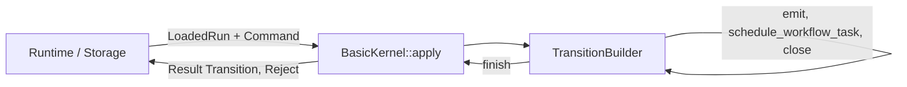

# Design Document: Kernel Foundation + WFT Lifecycle

## Overview

This design fills five gaps in the existing `tokeira-kernel` implementation to bring it in line with the architecture spec ([020-kernel.md](../../../docs/architecture/020-kernel.md)), and establishes a comprehensive test suite (property tests + golden transition tests) that pins the kernel's behavior.

The existing kernel already implements the `Kernel` trait, `BasicKernel`, `TransitionBuilder`, all six top-level commands, seven workflow commands, request dedup, sticky affinity, and the 13-variant `Reject` enum. The changes are additive field additions and two new enum variants. Some new fields are non-optional (`workflow_task_timeout: Duration`, `attempt: u32`), which means existing call sites that construct `StartRequest`, `WorkflowState`, `WorkflowCommand::ScheduleActivity`, `ActivityState`, `HistoryEventKind::WorkflowExecutionStarted`, `HistoryEventKind::ActivityTaskScheduled`, and `DispatchOp::EnqueueActivityTask` will require updates to compile. No existing public API method signatures change.

### Scope

| Gap | Summary | Breaking? |
|-----|---------|-----------|
| 1 | Timeout fields on `WorkflowState` and `StartRequest` | Yes — `workflow_task_timeout: Duration` is non-optional; call sites must provide it |
| 2 | Retry policy + attempt on `WorkflowState` and `StartRequest` | Yes — `attempt: u32` is non-optional; call sites must provide it |
| 3 | Chain metadata + timeout + retry fields on `WorkflowExecutionStarted` event | Yes — new non-optional fields on existing variant |
| 4 | `TimedOut` and `Canceled` variants on `ActivityResolution` + matching event kinds | No — new enum variants; existing match arms unaffected |
| 5 | Timeout fields on `ScheduleActivity`, `ActivityTaskScheduled`, `ActivityState`, `EnqueueActivityTask` | No — new `Option` fields only |

Downstream crates that construct kernel types directly (e.g., `tokeira-edge` in `to_internal.rs`, test helpers in `grpc_properties.rs`) will need their struct literals updated. This is a compile-time break that is straightforward to fix by adding the new fields.

## Architecture

The kernel remains a pure, deterministic state machine. The data flow is unchanged:



All new fields flow through the same path:
1. Caller populates fields on `StartRequest` / `ActivityResolvedRequest` / `WorkflowCommand::ScheduleActivity`.
2. `BasicKernel` copies them to `WorkflowState`, history events, and dispatch ops via `TransitionBuilder`.
3. The kernel never interprets timeout values or retry policies — it is a pass-through recorder.

### Design Decisions

1. **`RetryPolicy` lives in `tokeira-types`** — it is a shared domain type referenced by kernel, runtime, and eventually edge/proto crates.
2. **`workflow_task_timeout` is non-optional `Duration`** — the architecture spec mandates a default (typically 10s), so the kernel always has a value. The runtime provides the default if the caller omits it.
3. **New `ActivityResolution` variants mirror Temporal's terminal states** — `TimedOut { timeout_type }` and `Canceled { details }` complete the activity lifecycle without changing the resolution dispatch pattern in `apply_activity_resolved`.
4. **Activity timeout fields are `Option<Duration>`** — not all timeouts are set for every activity. The kernel passes them through without validation.

## Components and Interfaces

### New Type: `RetryPolicy` (in `tokeira-types`)

```rust
// tokeira-types/src/retry.rs
use serde::{Deserialize, Serialize};
use time::Duration;

#[derive(Clone, Debug, PartialEq, Serialize, Deserialize)]
pub struct RetryPolicy {
    pub initial_interval: Duration,
    pub backoff_coefficient: f64,
    pub maximum_interval: Option<Duration>,
    pub maximum_attempts: u32,
    pub non_retryable_error_types: Vec<String>,
}
```

Exposed via `pub mod retry;` and `pub use retry::*;` in `tokeira-types/src/lib.rs`.

### Modified Structs and Enums

#### `StartRequest` (command.rs)

New fields added:

```rust
pub struct StartRequest {
    // ... existing fields unchanged ...
    pub workflow_execution_timeout: Option<Duration>,
    pub workflow_run_timeout: Option<Duration>,
    pub workflow_task_timeout: Duration,
    pub retry_policy: Option<RetryPolicy>,
    pub attempt: u32,
    pub continued_execution_run_id: Option<RunId>,
    pub first_execution_run_id: Option<RunId>,
}
```

#### `WorkflowState` (state.rs)

New fields added after `search_attributes`:

```rust
pub struct WorkflowState {
    // ... existing fields unchanged ...
    pub workflow_execution_timeout: Option<Duration>,
    pub workflow_run_timeout: Option<Duration>,
    pub workflow_task_timeout: Duration,
    pub retry_policy: Option<RetryPolicy>,
    pub attempt: u32,
}
```

#### `ActivityResolution` (event.rs)

Two new variants:

```rust
pub enum ActivityResolution {
    Completed { result: Payloads },
    Failed { message: String },
    TimedOut { timeout_type: String },
    Canceled { details: Option<Payloads> },
}
```

#### `HistoryEventKind` (event.rs)

New fields on `WorkflowExecutionStarted`:

```rust
WorkflowExecutionStarted {
    workflow_type: WorkflowType,
    task_queue: TaskQueueName,
    input: Payloads,
    memo: Memo,
    search_attributes: SearchAttributes,
    request_id: String,
    // new fields
    continued_execution_run_id: Option<RunId>,
    first_execution_run_id: Option<RunId>,
    retry_policy: Option<RetryPolicy>,
    attempt: u32,
    workflow_execution_timeout: Option<Duration>,
    workflow_run_timeout: Option<Duration>,
    workflow_task_timeout: Duration,
}
```

Two new variants:

```rust
ActivityTaskTimedOut {
    activity_id: String,
    timeout_type: String,
},
ActivityTaskCanceled {
    activity_id: String,
    details: Option<Payloads>,
},
```

New fields on `ActivityTaskScheduled`:

```rust
ActivityTaskScheduled {
    activity_id: String,
    task_queue: TaskQueueName,
    input: Payloads,
    // new fields
    schedule_to_close_timeout: Option<Duration>,
    schedule_to_start_timeout: Option<Duration>,
    start_to_close_timeout: Option<Duration>,
    heartbeat_timeout: Option<Duration>,
}
```

#### `WorkflowCommand::ScheduleActivity` (command.rs)

New fields:

```rust
ScheduleActivity {
    activity_id: String,
    task_queue: TaskQueueName,
    input: Payloads,
    // new fields
    schedule_to_close_timeout: Option<Duration>,
    schedule_to_start_timeout: Option<Duration>,
    start_to_close_timeout: Option<Duration>,
    heartbeat_timeout: Option<Duration>,
}
```

#### `ActivityState` (state.rs)

New fields:

```rust
pub struct ActivityState {
    pub activity_id: String,
    pub schedule_event_id: i64,
    pub task_queue: TaskQueueName,
    pub attempt: u32,
    // new fields
    pub schedule_to_close_timeout: Option<Duration>,
    pub schedule_to_start_timeout: Option<Duration>,
    pub start_to_close_timeout: Option<Duration>,
    pub heartbeat_timeout: Option<Duration>,
}
```

#### `DispatchOp::EnqueueActivityTask` (transition.rs)

New fields:

```rust
EnqueueActivityTask {
    queue: QueueKey,
    activity_id: String,
    schedule_event_id: i64,
    attempt: u32,
    // new fields
    schedule_to_close_timeout: Option<Duration>,
    schedule_to_start_timeout: Option<Duration>,
    start_to_close_timeout: Option<Duration>,
    heartbeat_timeout: Option<Duration>,
}
```

### Kernel Logic Changes

#### `apply_start` (kernel.rs)

The `WorkflowState` initializer gains the new timeout, retry, and attempt fields copied from `StartRequest`. The `WorkflowExecutionStarted` event emission gains chain metadata, timeout, retry, and attempt fields copied from `StartRequest`.

#### `apply_activity_resolved` (kernel.rs)

The match on `ActivityResolution` gains two new arms:

```rust
ActivityResolution::TimedOut { timeout_type } => {
    builder.emit(HistoryEventKind::ActivityTaskTimedOut {
        activity_id: activity.activity_id.clone(),
        timeout_type,
    });
}
ActivityResolution::Canceled { details } => {
    builder.emit(HistoryEventKind::ActivityTaskCanceled {
        activity_id: activity.activity_id.clone(),
        details,
    });
}
```

The existing post-match logic (remove from activities map, push `ActivityOp::Delete`, schedule WFT if none pending) applies identically to all four resolution variants.

#### `apply_workflow_command` for `ScheduleActivity` (kernel.rs)

The `ActivityTaskScheduled` event, `ActivityState`, and `DispatchOp::EnqueueActivityTask` all gain the four timeout fields, copied from the `WorkflowCommand::ScheduleActivity` variant.


## Data Models

### RetryPolicy

```rust
#[derive(Clone, Debug, PartialEq, Serialize, Deserialize)]
pub struct RetryPolicy {
    pub initial_interval: Duration,
    pub backoff_coefficient: f64,
    pub maximum_interval: Option<Duration>,
    pub maximum_attempts: u32,
    pub non_retryable_error_types: Vec<String>,
}
```

This mirrors Temporal's retry policy shape. The kernel stores it but never evaluates it — retry decisions are a runtime concern.

### Complete WorkflowState After Changes

```rust
pub struct WorkflowState {
    // Identity
    pub run_key: RunKey,
    pub namespace_id: NamespaceId,
    pub workflow_id: WorkflowId,
    pub run_id: RunId,
    pub workflow_type: WorkflowType,
    pub task_queue: TaskQueueName,

    // Lifecycle
    pub status: ExecutionStatus,
    pub transition_seq: TransitionSeq,
    pub last_event_id: i64,
    pub next_workflow_task_seq: LogicalTaskSeq,
    pub pending_workflow_task: Option<PendingWorkflowTask>,
    pub sticky: Option<StickyAffinity>,

    // User-mutable metadata
    pub memo: Memo,
    pub search_attributes: SearchAttributes,

    // Open entities
    pub activities: BTreeMap<String, ActivityState>,
    pub timers: BTreeMap<String, TimerState>,

    // Timestamps
    pub started_at: OffsetDateTime,
    pub closed_at: Option<OffsetDateTime>,

    // Timeouts (Gap 1) — set at start, enforced by runtime
    pub workflow_execution_timeout: Option<Duration>,
    pub workflow_run_timeout: Option<Duration>,
    pub workflow_task_timeout: Duration,

    // Retry (Gap 2) — recorded at start, evaluated by runtime
    pub retry_policy: Option<RetryPolicy>,
    pub attempt: u32,
}
```


## Correctness Properties

*A property is a characteristic or behavior that should hold true across all valid executions of a system — essentially, a formal statement about what the system should do. Properties serve as the bridge between human-readable specifications and machine-verifiable correctness guarantees.*

### Property 1: Start field pass-through

*For any* valid `StartRequest` applied to `LoadedRun::Absent`, the resulting `Transition`'s `next_state` shall have `workflow_execution_timeout`, `workflow_run_timeout`, `workflow_task_timeout`, `retry_policy`, and `attempt` equal to the corresponding `StartRequest` fields, AND the first history event (`WorkflowExecutionStarted`) shall carry `continued_execution_run_id`, `first_execution_run_id`, `retry_policy`, `attempt`, `workflow_execution_timeout`, `workflow_run_timeout`, and `workflow_task_timeout` equal to the corresponding `StartRequest` fields.

**Validates: Requirements 1.1.4, 1.2.4, 2.1.3, 2.2.3, 3.1.8, 3.2.3**

### Property 2: Activity resolution event matches resolution variant

*For any* open run with at least one activity and *for any* `ActivityResolution` variant (Completed, Failed, TimedOut, Canceled), when `ActivityResolved` is applied, the transition shall contain exactly one activity-terminal event whose kind matches the resolution variant and whose fields (activity_id, result/message/timeout_type/details) match the resolution payload.

**Validates: Requirements 4.1.3, 4.1.4**

### Property 3: ScheduleActivity timeout pass-through

*For any* `ScheduleActivity` workflow command with arbitrary timeout values (`schedule_to_close_timeout`, `schedule_to_start_timeout`, `start_to_close_timeout`, `heartbeat_timeout`), when processed during `WorkflowTaskCompleted`, the emitted `ActivityTaskScheduled` event, the `ActivityState` entry in `next_state.activities`, and the `DispatchOp::EnqueueActivityTask` shall all carry timeout fields identical to the workflow command's values.

**Validates: Requirements 5.1.5, 5.1.6, 5.2.2, 5.3.2, 5.4.2**

### Property 4: Event ID contiguity

*For any* valid `(LoadedRun, Command)` pair that produces a `Transition`, the `history_events` shall have event IDs forming a contiguous sequence starting from the input state's `last_event_id + 1` (or from 1 if `LoadedRun::Absent`).

**Validates: Requirements 6.1.1**

### Property 5: Transition sequence increment

*For any* valid `(LoadedRun, Command)` pair that produces a `Transition`, the `Transition`'s `expected_seq` shall equal the input `WorkflowState`'s `transition_seq` (or `TransitionSeq::ZERO` for `Absent`), and `next_state.transition_seq` shall equal `expected_seq + 1`.

**Validates: Requirements 6.2.1, 6.2.2, 8.1.4, 8.1.5**

### Property 6: Pending WFT identity preservation

*For any* valid `(LoadedRun, Command)` pair where the input `WorkflowState` already has a `pending_workflow_task` with `logical_seq = S`, and the command is one that would normally trigger a WFT (Signal, ActivityResolved, TimerDue), the resulting `Transition`'s `next_state.pending_workflow_task` shall have the same `logical_seq = S`, AND the `dispatch_ops` shall not contain any `EnqueueWorkflowTask` op. Additionally, for any transition, `next_state` shall contain at most one `PendingWorkflowTask`.

**Validates: Requirements 6.3.1, 8.3.1, 8.3.2**

### Property 7: Closed workflow no-schedule

*For any* `Transition` where `next_state.status` is not `Running`: (a) `dispatch_ops` shall not contain `EnqueueWorkflowTask` or `EnqueueActivityTask`, (b) `next_state.pending_workflow_task` shall be `None`, and (c) `next_state.closed_at` shall be `Some`.

**Validates: Requirements 6.4.1, 6.4.2, 6.4.3**

### Property 8: Last event ID consistency

*For any* valid `(LoadedRun, Command)` pair that produces a `Transition`: if the transition contains at least one history event, `next_state.last_event_id` shall equal the last event's `event_id`; if the transition contains no history events, `next_state.last_event_id` shall equal the input state's `last_event_id`.

**Validates: Requirements 6.5.1, 6.5.2**

### Property 9: ActivityOp and TimerOp consistency

*For any* `Transition`: (a) every `ActivityOp::Upsert` shall have a corresponding entry in `next_state.activities`, (b) every `ActivityOp::Delete` shall have no corresponding entry in `next_state.activities`, (c) every `TimerOp::Upsert` shall have a corresponding entry in `next_state.timers`, (d) every `TimerOp::Delete` shall have no corresponding entry in `next_state.timers`.

**Validates: Requirements 6.6.1, 6.6.2, 6.7.1, 6.7.2**

### Property 10: Request dedup correctness

*For any* `Start` or `Signal` command that produces a `Transition`, the `request_dedupe_ops` shall contain exactly one entry with the command's `request_id`. *For any* `WorkflowTaskStarted`, `WorkflowTaskCompleted`, `ActivityResolved`, or `TimerDue` command that produces a `Transition`, the `request_dedupe_ops` shall be empty.

**Validates: Requirements 8.2.1, 8.2.2**


## Error Handling

The kernel's error model is unchanged. All errors are expressed through the `Reject` enum, which is already comprehensive for Feature 1's command set.

### Existing Reject Variants (unchanged)

| Variant | Trigger |
|---------|---------|
| `RunAlreadyExists` | `Start` on `Existing` |
| `MissingRun` | Non-Start command on `Absent` |
| `RunClosed(status)` | Command on closed run |
| `NoPendingWorkflowTask` | WFT start/complete with no pending WFT |
| `WorkflowTaskSeqMismatch` | Logical seq mismatch |
| `WorkflowTaskAlreadyStarted` | WFT start when already started |
| `WorkflowTaskTokenMismatch` | Token attempt/started_event_id mismatch |
| `WorkflowTaskNotStarted` | WFT complete when not started |
| `DuplicateActivityId` | ScheduleActivity with existing activity_id |
| `DuplicateTimerId` | StartTimer with existing timer_id |
| `UnknownActivity` | ActivityResolved for unknown activity |
| `UnknownTimer` | TimerDue for unknown timer |
| `CommandsAfterClose` | Workflow command after close in same WFT |

No new `Reject` variants are needed for this feature. The new `ActivityResolution::TimedOut` and `Canceled` variants follow the same code path as `Completed` and `Failed` — the activity must exist (or `UnknownActivity`), and the post-resolution logic is identical.

### Error Propagation

The kernel returns `Result<Transition, Reject>`. The runtime layer is responsible for:
- Translating `Reject` into appropriate gRPC status codes at the edge.
- Logging rejection details for observability.
- Deciding whether to retry (e.g., on `WorkflowTaskSeqMismatch` after a reload).


## Testing Strategy

### Dual Testing Approach

This feature uses both property-based tests and golden transition tests. They are complementary:

- **Property tests** verify universal invariants across randomly generated inputs — they catch classes of bugs that specific examples miss.
- **Golden tests** pin exact transition output for specific command paths — they catch regressions in event ordering, field values, and dispatch op shape.

### Property-Based Testing

**Library:** `proptest` (Rust's most mature property-based testing crate). Add to `[dev-dependencies]` in `tokeira-kernel/Cargo.toml`:

```toml
[dev-dependencies]
proptest = "1.4"
```

**Arbitrary Implementations:**

The test harness needs `Arbitrary` implementations (via `proptest::arbitrary`) for:

- `WorkflowState` — generate valid states with random identity fields, status `Running`, random `last_event_id`, random `transition_seq`, optional `pending_workflow_task`, random activity/timer maps, and the new timeout/retry fields.
- `Command` — generate commands that are valid for the given `WorkflowState`. This requires a strategy that conditions the command variant on the state (e.g., `Start` only for `Absent`, `Signal` only for open runs, `WorkflowTaskStarted` only when a pending WFT exists without `started_event_id`, etc.).
- `RetryPolicy` — straightforward random generation of all fields.
- `ActivityResolution` — random selection among all four variants with random payloads.

**Strategy Pattern:**

```rust
fn arb_valid_pair() -> impl Strategy<Value = (LoadedRun, Command)> {
    // Generate a LoadedRun, then generate a Command valid for that state
    prop_oneof![
        arb_absent_with_start(),
        arb_open_with_signal(),
        arb_open_with_wft_started(),
        arb_open_with_wft_completed(),
        arb_open_with_activity_resolved(),
        arb_open_with_timer_due(),
    ]
}
```

Each sub-strategy generates a `WorkflowState` in the right shape for the command variant, then generates a matching command.

**Configuration:** Each property test runs a minimum of 100 iterations (proptest default is 256, which exceeds this).

**Tag Format:** Each test includes a comment:
```rust
// Feature: kernel-foundation-wft-lifecycle, Property N: <property_text>
```

**Test File:** `tokeira/crates/tokeira-kernel/tests/property_tests.rs`

**Properties to implement (10 total):**

| # | Property | Pattern |
|---|----------|---------|
| 1 | Start field pass-through | Round-trip / invariant |
| 2 | Activity resolution event matches variant | Invariant |
| 3 | ScheduleActivity timeout pass-through | Round-trip / invariant |
| 4 | Event ID contiguity | Invariant |
| 5 | Transition sequence increment | Invariant |
| 6 | At-most-one pending WFT | Invariant |
| 7 | Closed workflow no-schedule | Invariant |
| 8 | Last event ID consistency | Invariant |
| 9 | ActivityOp and TimerOp consistency | Invariant |
| 10 | Request dedup correctness | Invariant |

Properties 4–10 use the general `arb_valid_pair()` strategy. Properties 1–3 use targeted strategies for their specific command paths.

### Golden Transition Tests

**Test File:** `tokeira/crates/tokeira-kernel/tests/golden_tests.rs`

**Test Helper Pattern:**

A `TestHarness` module provides builder functions for constructing `WorkflowState` and `Command` values with sensible defaults:

```rust
mod helpers {
    pub fn make_start_request() -> StartRequest { /* defaults */ }
    pub fn make_open_state() -> WorkflowState { /* Running, seq=1, last_event_id=2 */ }
    pub fn make_open_state_with_pending_wft() -> WorkflowState { /* + scheduled WFT */ }
    pub fn make_open_state_with_started_wft() -> WorkflowState { /* + started WFT */ }
    pub fn make_open_state_with_activity(id: &str) -> WorkflowState { /* + one activity */ }
    pub fn make_open_state_with_timer(id: &str) -> WorkflowState { /* + one timer */ }
    pub fn make_closed_state() -> WorkflowState { /* Completed */ }
}
```

**Golden Test Groups (10 success paths + 15 rejection paths):**

Success paths:
1. Start from Absent — full transition assertion including new timeout/retry fields
2. Signal with no pending WFT — WFT scheduled
3. Signal with pending WFT — no second WFT
4. WorkflowTaskStarted — sticky affinity recorded
5. WorkflowTaskCompleted with ScheduleActivity + StartTimer — including timeout fields
6. WorkflowTaskCompleted with CompleteWorkflow — terminal close
7. WorkflowTaskCompleted with FailWorkflow — terminal close
8. ActivityResolved (Completed) — WFT scheduled
9. ActivityResolved (TimedOut) — new variant, WFT scheduled
10. ActivityResolved (Canceled) — new variant, WFT scheduled
11. TimerDue — WFT scheduled

Rejection paths (15 tests):
1. Start on Existing → `RunAlreadyExists`
2. Signal on Absent → `MissingRun`
3. Signal on closed → `RunClosed`
4. WFT Started with no pending → `NoPendingWorkflowTask`
5. WFT Started with seq mismatch → `WorkflowTaskSeqMismatch`
6. WFT Started already started → `WorkflowTaskAlreadyStarted`
7. WFT Completed with no pending → `NoPendingWorkflowTask`
8. WFT Completed not started → `WorkflowTaskNotStarted`
9. WFT Completed seq mismatch → `WorkflowTaskSeqMismatch`
10. WFT Completed token mismatch → `WorkflowTaskTokenMismatch`
11. ScheduleActivity duplicate → `DuplicateActivityId`
12. StartTimer duplicate → `DuplicateTimerId`
13. ActivityResolved unknown → `UnknownActivity`
14. TimerDue unknown → `UnknownTimer`
15. Commands after close → `CommandsAfterClose`

### Downstream Call-Site Updates

Adding non-optional fields to `StartRequest` (`workflow_task_timeout: Duration`, `attempt: u32`) and to `WorkflowState` (`workflow_task_timeout: Duration`, `attempt: u32`) means every existing struct literal for these types will fail to compile until updated. Similarly, `HistoryEventKind::WorkflowExecutionStarted` gains non-optional fields (`attempt: u32`, `workflow_task_timeout: Duration`).

Known call sites that will need updates:
- `tokeira-edge` `to_internal.rs` — constructs `StartRequest` from gRPC proto
- `tokeira-edge` `grpc_properties.rs` — test helpers that construct kernel types
- Any existing kernel tests that construct `StartRequest`, `WorkflowState`, or `WorkflowExecutionStarted` directly

The fix for each is mechanical: add the new fields with appropriate values (e.g., `attempt: 1`, `workflow_task_timeout: Duration::seconds(10)`, `Option` fields as `None`).

New `Option<T>` fields on `ScheduleActivity`, `ActivityState`, `ActivityTaskScheduled`, and `EnqueueActivityTask` also require struct literal updates, but can be set to `None` at existing call sites.

New enum variants on `ActivityResolution` and `HistoryEventKind` do not affect existing match arms (they are additive), but any exhaustive matches will need wildcard or explicit arms added.

