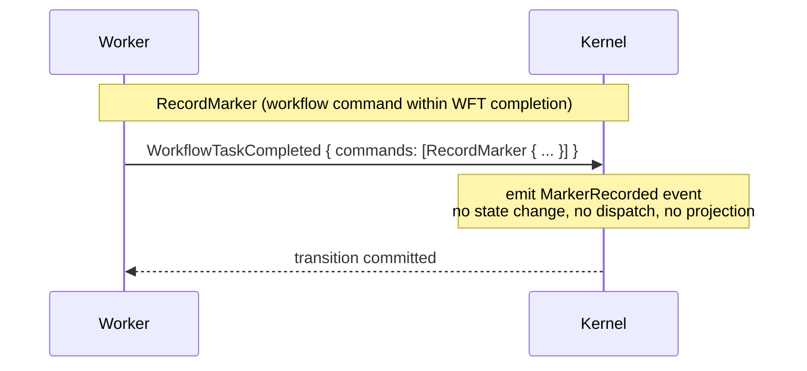
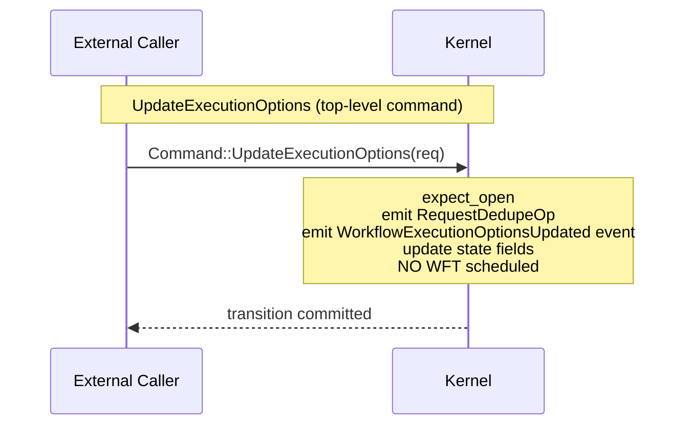

# Design: Kernel Markers and Execution Options (Feature 8)

## Overview

This design adds two simple capabilities to `tokeira-kernel`:

1. **RecordMarker** — a workflow command (within `WorkflowTaskCompleted`) that emits a `MarkerRecorded` event. The kernel treats markers as pure pass-through: emit event, no state change, no dispatch, no projection. SDKs use markers for side effects, local activity results, mutable side effects, and version markers during replay.

2. **UpdateExecutionOptions** — a top-level command that updates versioning overrides and completion callbacks on a running workflow. Follows the same pattern as `Signal`/`Update` for the top-level path: `expect_open` → emit dedup → emit event → update state → `finish`. Does NOT schedule a WFT.

Both commands are straightforward. `VersioningOverride` and `CompletionCallback` are placeholder types (empty structs) until their respective designs are finalized. `WorkflowState` gains two new fields (`versioning_override`, `completion_callbacks`) initialized to `None`/empty on `Start` and NOT cleared on `close()` (they are metadata, not pending operations).

## Architecture

No new architectural patterns. Both commands follow existing kernel conventions.





## Components and Interfaces

### New Types

**`state.rs` — placeholder types:**
```rust
#[derive(Clone, Debug, PartialEq)]
pub struct VersioningOverride;

#[derive(Clone, Debug, PartialEq)]
pub struct CompletionCallback;
```

**`command.rs` — `FieldChange<T>` and `UpdateExecutionOptionsRequest`:**
```rust
#[derive(Clone, Debug, PartialEq)]
pub enum FieldChange<T> {
    Unchanged,
    Set(T),
    Clear,
}

#[derive(Clone, Debug, PartialEq)]
pub struct UpdateExecutionOptionsRequest {
    pub versioning_override: FieldChange<VersioningOverride>,
    pub completion_callbacks: FieldChange<Vec<CompletionCallback>>,
    pub attached_request_id: Option<String>,
    pub request: RequestContext,
    pub now: OffsetDateTime,
}
```

### Enum Variant Additions

**`Command`** gains:
```rust
UpdateExecutionOptions(UpdateExecutionOptionsRequest),
```

**`WorkflowCommand`** gains:
```rust
RecordMarker {
    marker_name: String,
    details: BTreeMap<String, Payloads>,
    failure: Option<Payload>,
    header: Option<BTreeMap<String, Payload>>,
},
```

**`HistoryEventKind`** gains:
```rust
MarkerRecorded {
    marker_name: String,
    details: BTreeMap<String, Payloads>,
    failure: Option<Payload>,
    header: Option<BTreeMap<String, Payload>>,
},
WorkflowExecutionOptionsUpdated {
    versioning_override: FieldChange<VersioningOverride>,
    completion_callbacks: FieldChange<Vec<CompletionCallback>>,
    attached_request_id: Option<String>,
},
```

### `WorkflowState` Changes

Add two fields:
```rust
pub versioning_override: Option<VersioningOverride>,
pub completion_callbacks: Vec<CompletionCallback>,
```

### Kernel Logic

**`BasicKernel::apply`** — new match arm:
```rust
Command::UpdateExecutionOptions(req) => self.apply_update_execution_options(loaded, req),
```

**`apply_update_execution_options`** — follows Signal/Update pattern but does NOT schedule a WFT:
```rust
fn apply_update_execution_options(
    &self,
    loaded: LoadedRun,
    req: UpdateExecutionOptionsRequest,
) -> Result<Transition, Reject> {
    let state = expect_open(loaded)?;
    let mut builder = TransitionBuilder::new(state, req.now);
    builder.request_dedupe_ops.push(RequestDedupeOp {
        request_id: req.request.request_id.clone(),
    });
    builder.emit(HistoryEventKind::WorkflowExecutionOptionsUpdated {
        versioning_override: req.versioning_override.clone(),
        completion_callbacks: req.completion_callbacks.clone(),
        attached_request_id: req.attached_request_id,
    });
    match req.versioning_override {
        FieldChange::Set(vo) => builder.state.versioning_override = Some(vo),
        FieldChange::Clear => builder.state.versioning_override = None,
        FieldChange::Unchanged => {}
    }
    match req.completion_callbacks {
        FieldChange::Set(cbs) => builder.state.completion_callbacks = cbs,
        FieldChange::Clear => builder.state.completion_callbacks = Vec::new(),
        FieldChange::Unchanged => {}
    }
    // No WFT scheduled — this is a server-side mutation
    Ok(builder.finish())
}
```

**`apply_workflow_command`** — new match arm for RecordMarker:
```rust
WorkflowCommand::RecordMarker { marker_name, details, failure, header } => {
    builder.emit(HistoryEventKind::MarkerRecorded {
        marker_name, details, failure, header,
    });
    Ok(false)
}
```

**`apply_start`** — `WorkflowState` initializer gains:
```rust
versioning_override: None,
completion_callbacks: Vec::new(),
```

**`TransitionBuilder::close()`** — does NOT clear `versioning_override` or `completion_callbacks`. These are metadata fields, not pending operations.

### Downstream Breakage

All exhaustive `match` arms on `Command`, `WorkflowCommand`, and `HistoryEventKind` must add the new variants. `WorkflowState` construction sites must include `versioning_override` and `completion_callbacks`.

## Data Models

No new storage tables. `VersioningOverride` and `CompletionCallback` are part of `WorkflowState` which is persisted as a full-state replacement per transition.

New fields on `WorkflowState`:
- `versioning_override: Option<VersioningOverride>` — set by `UpdateExecutionOptions`, initialized to `None`
- `completion_callbacks: Vec<CompletionCallback>` — set by `UpdateExecutionOptions`, initialized to empty

Lifecycle:
- **Initialized**: `None`/empty on `Start`
- **Updated**: by `UpdateExecutionOptions` command
- **NOT cleared on close**: these are metadata, not pending operations


## Correctness Properties

*A property is a characteristic or behavior that should hold true across all valid executions of a system — essentially, a formal statement about what the system should do. Properties serve as the bridge between human-readable specifications and machine-verifiable correctness guarantees.*

### Property 1: RecordMarker event field pass-through

*For any* `RecordMarker` workflow command with arbitrary `marker_name`, `details`, `failure`, and `header`, the emitted `MarkerRecorded` event shall carry the exact same `marker_name`, `details`, `failure`, and `header` values without interpretation or transformation.

**Validates: Requirements 8.1.1, 8.2.3**

### Property 2: RecordMarker is a pure event emission

*For any* `RecordMarker` workflow command within a valid `WorkflowTaskCompleted`, the command shall: (a) not modify `WorkflowState` beyond `last_event_id` and `transition_seq` (the standard `TransitionBuilder` changes), (b) not emit any `DispatchOp` beyond those from the WFT completion itself, (c) not emit any `ProjectionOp`, (d) not close the run (return `false`), and (e) not emit any `RequestDedupeOp` beyond those from the WFT completion itself.

**Validates: Requirements 8.1.2, 8.1.3, 8.1.4, 8.1.5, 8.1.6**

### Property 3: UpdateExecutionOptions produces correct event and dedup op

*For any* valid `UpdateExecutionOptionsRequest` against an open run, the transition shall: (a) contain exactly one `RequestDedupeOp` matching the request ID, and (b) contain a `WorkflowExecutionOptionsUpdated` event with the correct `versioning_override`, `completion_callbacks`, and `attached_request_id`.

**Validates: Requirements 8.4.1, 8.4.2**

### Property 4: UpdateExecutionOptions state mutation

*For any* valid `UpdateExecutionOptionsRequest` against an open run: (a) if `versioning_override` is `Set(vo)`, then `next_state.versioning_override` shall be `Some(vo)`; (b) if `versioning_override` is `Clear`, then `next_state.versioning_override` shall be `None`; (c) if `versioning_override` is `Unchanged`, then `next_state.versioning_override` shall equal the input state's value; (d) if `completion_callbacks` is `Set(cbs)`, then `next_state.completion_callbacks` shall equal `cbs`; (e) if `completion_callbacks` is `Clear`, then `next_state.completion_callbacks` shall be empty; (f) if `completion_callbacks` is `Unchanged`, then `next_state.completion_callbacks` shall equal the input state's value.

**Validates: Requirements 8.4.3, 8.4.4, 8.4.5**

### Property 5: UpdateExecutionOptions does not schedule WFT and does not close

*For any* valid `UpdateExecutionOptionsRequest` against an open run, the transition shall: (a) not contain any `DispatchOp::EnqueueWorkflowTask`, (b) leave `pending_workflow_task` unchanged, and (c) leave the run open (`status == Running`).

**Validates: Requirements 8.4.6, 8.4.7**

### Property 6: Start initializes execution option fields

*For any* valid `StartRequest`, the resulting `next_state.versioning_override` shall be `None` and `next_state.completion_callbacks` shall be empty.

**Validates: Requirements 8.7.3**

### Property 7: Close preserves execution option metadata

*For any* transition that closes a run (Terminate, WorkflowExecutionTimedOut, CompleteWorkflow, FailWorkflow, CancelWorkflow, ContinueAsNew), `next_state.versioning_override` and `next_state.completion_callbacks` shall retain their pre-close values.

**Validates: Requirements 8.7.4**

### Property 8: Existing structural invariants hold for new command types

*For any* successful transition involving RecordMarker or UpdateExecutionOptions, the existing structural invariants shall hold: (a) event IDs are contiguous starting from `last_event_id + 1`, (b) `next_state.transition_seq == expected_seq + 1`, (c) at most one `PendingWorkflowTask` in `next_state`.

**Validates: Requirements 8.2.2, 8.5.2**

## Error Handling

| Scenario | Reject variant | Notes |
|---|---|---|
| UpdateExecutionOptions against `LoadedRun::Absent` | `MissingRun` | Same as Signal/Cancel/Update |
| UpdateExecutionOptions against closed run | `RunClosed(status)` | Same as Signal/Cancel/Update |
| RecordMarker after a close command in same WFT | `CommandsAfterClose { index }` | Existing — standard sequential processing |

No new `Reject` variants needed. All rejection paths use existing `expect_open` or the standard `CommandsAfterClose` mechanism.

## Testing Strategy

Tests extend the existing `golden_tests.rs` and `property_tests.rs` files. No new test files.

### Golden Tests (in `golden_tests.rs`)

Individual `#[test]` functions covering:

1. `record_marker_happy_path` — WFT completion with a single `RecordMarker`. Assert: `MarkerRecorded` event with correct fields, run still open, no extra dispatch/projection ops.
2. `record_marker_after_close_rejected` — WFT completion with `CompleteWorkflow` followed by `RecordMarker`. Assert: `Reject::CommandsAfterClose`.
3. `update_execution_options_happy_path` — `UpdateExecutionOptions` against open state. Assert: `WorkflowExecutionOptionsUpdated` event, dedup op, state fields updated, no WFT scheduled.
4. `update_execution_options_clear_versioning` — `UpdateExecutionOptions` with `versioning_override: FieldChange::Clear` against state with existing versioning override. Assert: `versioning_override` is `None`.
5. `update_execution_options_missing_run` — `UpdateExecutionOptions` against `LoadedRun::Absent`. Assert: `Reject::MissingRun`.
6. `update_execution_options_closed_run` — `UpdateExecutionOptions` against closed state. Assert: `Reject::RunClosed`.
7. `close_preserves_execution_options` — Terminate with `versioning_override` and `completion_callbacks` set. Assert: fields preserved in `next_state`.

### Property Tests (in `property_tests.rs`)

Uses `proptest` crate with `proptest! { }` block style. Minimum 100 iterations per property (proptest default is 256).

Each property test is tagged with a comment: `// Feature: kernel-markers-execution-options, Property N: <title>`

New arbitrary strategies needed:
- `arb_record_marker_command()` — generates random `RecordMarker` workflow command
- `arb_update_execution_options_request(now)` — generates random `UpdateExecutionOptionsRequest`

The existing `arb_valid_pair` strategy must be extended to include:
- `WorkflowTaskCompleted` containing `RecordMarker` commands
- `Command::UpdateExecutionOptions` against open state

This ensures the existing structural property tests (event ID contiguity, transition_seq increment, at-most-one-WFT, dedup boundary) automatically cover the new command types.

Property tests to implement (one `proptest!` test per property):
1. Property 1 — new test: generate random `RecordMarker`, apply in WFT completion, assert event fields match.
2. Property 2 — new test: generate random `RecordMarker`, compare state before/after (only `last_event_id` and `transition_seq` change), assert no extra dispatch/projection ops.
3. Property 3 — new test: generate random `UpdateExecutionOptionsRequest`, apply, assert event + dedup.
4. Property 4 — new test: generate random `UpdateExecutionOptionsRequest`, apply, assert state fields.
5. Property 5 — new test: generate random `UpdateExecutionOptionsRequest`, apply, assert no WFT dispatch, run open.
6. Property 6 — extend existing `property_1_start_field_pass_through` to assert `versioning_override` and `completion_callbacks`.
7. Property 7 — new test: set execution option fields on state, close via various paths, assert fields preserved.
8. Property 8 — covered by extending `arb_valid_pair` with RecordMarker and UpdateExecutionOptions variants.

**Property-based testing library:** `proptest` (already in use).
**Minimum iterations:** 100 (proptest default is 256).
**Tag format:** `// Feature: kernel-markers-execution-options, Property N: <title>`
