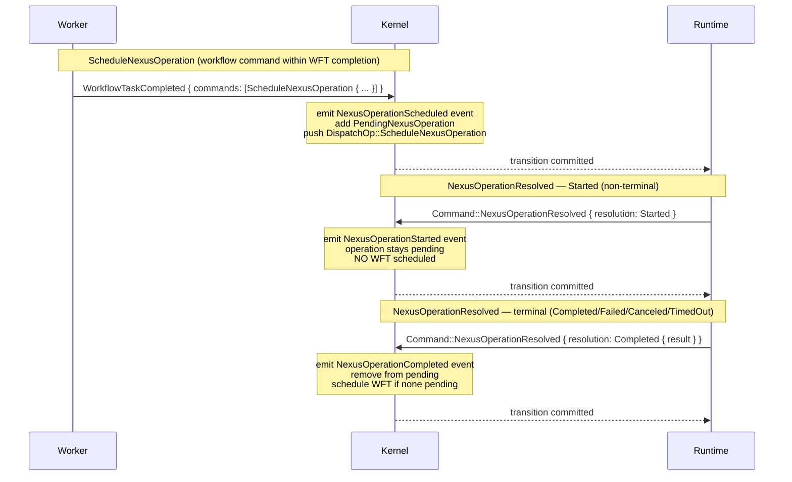
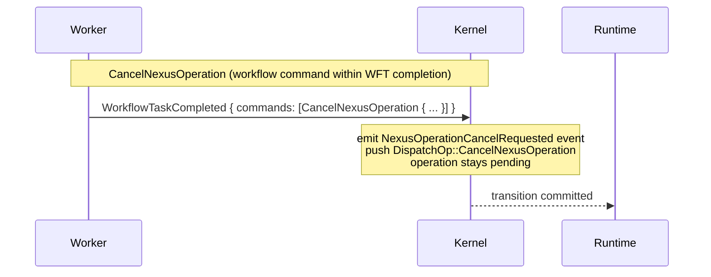

# Design: Kernel Nexus Operations (Feature 9)

## Overview

This design adds Nexus operation support to `tokeira-kernel`. Nexus is Temporal's mechanism for cross-namespace workflow invocation through typed service contracts. The feature introduces:

1. **ScheduleNexusOperation** — workflow command (within `WorkflowTaskCompleted`) that initiates a Nexus operation. Follows the same pattern as `StartChildWorkflow`: emit event, create pending entry, push dispatch op, reject duplicates.
2. **CancelNexusOperation** — workflow command that requests cancellation of a pending Nexus operation. Emits event, pushes dispatch op. The operation remains pending until resolved.
3. **NexusOperationResolved** — top-level command from the runtime when the Nexus operation reaches a result. Five resolution variants: Started (non-terminal), Completed, Failed, Canceled, TimedOut.

The key structural difference from other entity resolution patterns: **Started does NOT remove from pending and does NOT schedule a WFT.** Only terminal resolutions (Completed, Failed, Canceled, TimedOut) remove the operation and schedule a WFT. (Non-terminal runtime callbacks exist elsewhere — WFT failure/timeout also leave the entity live — but Started is the first non-terminal *entity resolution* where the pending entry is retained.) There is no parent close policy for Nexus operations — `close()` simply clears the map.

## Architecture





## Components and Interfaces

### New Types

**`state.rs` — `PendingNexusOperation`:**
```rust
#[derive(Clone, Debug, PartialEq)]
pub struct PendingNexusOperation {
    pub operation_id: String,
    pub scheduled_event_id: i64,
    pub endpoint: String,
    pub service: String,
    pub operation: String,
    pub started: bool,
}
```

**`command.rs` — `NexusResolution` and `NexusOperationResolvedRequest`:**
```rust
#[derive(Clone, Debug, PartialEq)]
pub enum NexusResolution {
    Started,
    Completed { result: Payloads },
    Failed { failure: String },
    Canceled,
    TimedOut,
}

#[derive(Clone, Debug, PartialEq)]
pub struct NexusOperationResolvedRequest {
    pub operation_id: String,
    pub scheduled_event_id: i64,
    pub resolution: NexusResolution,
    pub now: OffsetDateTime,
}
```

### Enum Variant Additions

**`Command`** gains:
```rust
NexusOperationResolved(NexusOperationResolvedRequest),
```

**`WorkflowCommand`** gains:
```rust
ScheduleNexusOperation {
    operation_id: String,
    endpoint: String,
    service: String,
    operation: String,
    input: Payloads,
    schedule_to_close_timeout: Option<Duration>,
},
CancelNexusOperation {
    scheduled_event_id: i64,
},
```

**`HistoryEventKind`** gains:
```rust
NexusOperationScheduled {
    operation_id: String,
    endpoint: String,
    service: String,
    operation: String,
    input: Payloads,
    schedule_to_close_timeout: Option<Duration>,
},
NexusOperationStarted {
    operation_id: String,
    scheduled_event_id: i64,
},
NexusOperationCompleted {
    operation_id: String,
    scheduled_event_id: i64,
    result: Payloads,
},
NexusOperationFailed {
    operation_id: String,
    scheduled_event_id: i64,
    failure: String,
},
NexusOperationCanceled {
    operation_id: String,
    scheduled_event_id: i64,
},
NexusOperationTimedOut {
    operation_id: String,
    scheduled_event_id: i64,
},
NexusOperationCancelRequested {
    scheduled_event_id: i64,
},
```

**`DispatchOp`** gains:
```rust
ScheduleNexusOperation {
    operation_id: String,
    endpoint: String,
    service: String,
    operation: String,
    input: Payloads,
    schedule_to_close_timeout: Option<Duration>,
},
CancelNexusOperation {
    scheduled_event_id: i64,
},
```

**`Reject`** gains:
```rust
#[error("duplicate nexus operation id: {0}")]
DuplicateNexusOperationId(String),
#[error("unknown nexus operation: {0}")]
UnknownNexusOperation(String),
#[error("stale nexus resolution for {operation_id}: expected scheduled_event_id {expected_scheduled_event_id}")]
StaleNexusResolution {
    operation_id: String,
    expected_scheduled_event_id: i64,
},
#[error("nexus operation already started: {0}")]
NexusOperationAlreadyStarted(String),
```

### `WorkflowState` Changes

Add field:
```rust
pub pending_nexus_operations: BTreeMap<String, PendingNexusOperation>,
```

### Kernel Logic

**`BasicKernel::apply`** — new match arm:
```rust
Command::NexusOperationResolved(req) => self.apply_nexus_operation_resolved(loaded, req),
```

**`apply_nexus_operation_resolved`** — follows ExternalSignalResolved/ChildResolved pattern with key difference for Started:
```rust
fn apply_nexus_operation_resolved(
    &self,
    loaded: LoadedRun,
    req: NexusOperationResolvedRequest,
) -> Result<Transition, Reject> {
    let state = expect_open(loaded)?;
    let pending = state
        .pending_nexus_operations
        .get(&req.operation_id)
        .cloned()
        .ok_or_else(|| Reject::UnknownNexusOperation(req.operation_id.clone()))?;

    if pending.scheduled_event_id != req.scheduled_event_id {
        return Err(Reject::StaleNexusResolution {
            operation_id: req.operation_id,
            expected_scheduled_event_id: pending.scheduled_event_id,
        });
    }

    let mut builder = TransitionBuilder::new(state, req.now);
    let is_terminal = !matches!(req.resolution, NexusResolution::Started);

    match req.resolution {
        NexusResolution::Started => {
            if pending.started {
                return Err(Reject::NexusOperationAlreadyStarted(pending.operation_id));
            }
            builder.emit(HistoryEventKind::NexusOperationStarted {
                operation_id: pending.operation_id.clone(),
                scheduled_event_id: pending.scheduled_event_id,
            });
            if let Some(entry) = builder.state.pending_nexus_operations.get_mut(&pending.operation_id) {
                entry.started = true;
            }
            // Started is non-terminal: do NOT remove from pending, do NOT schedule WFT
        }
        NexusResolution::Completed { result } => {
            builder.emit(HistoryEventKind::NexusOperationCompleted {
                operation_id: pending.operation_id.clone(),
                scheduled_event_id: pending.scheduled_event_id,
                result,
            });
        }
        NexusResolution::Failed { failure } => {
            builder.emit(HistoryEventKind::NexusOperationFailed {
                operation_id: pending.operation_id.clone(),
                scheduled_event_id: pending.scheduled_event_id,
                failure,
            });
        }
        NexusResolution::Canceled => {
            builder.emit(HistoryEventKind::NexusOperationCanceled {
                operation_id: pending.operation_id.clone(),
                scheduled_event_id: pending.scheduled_event_id,
            });
        }
        NexusResolution::TimedOut => {
            builder.emit(HistoryEventKind::NexusOperationTimedOut {
                operation_id: pending.operation_id.clone(),
                scheduled_event_id: pending.scheduled_event_id,
            });
        }
    }

    if is_terminal {
        builder.state.pending_nexus_operations.remove(&pending.operation_id);
        if builder.state.pending_workflow_task.is_none() {
            builder.schedule_workflow_task();
        }
    }

    Ok(builder.finish())
}
```

**`apply_workflow_command`** — new match arms:
```rust
WorkflowCommand::ScheduleNexusOperation {
    operation_id, endpoint, service, operation, input, schedule_to_close_timeout,
} => {
    if builder.state.pending_nexus_operations.contains_key(&operation_id) {
        return Err(Reject::DuplicateNexusOperationId(operation_id));
    }
    let scheduled_event_id = builder.emit(HistoryEventKind::NexusOperationScheduled {
        operation_id: operation_id.clone(),
        endpoint: endpoint.clone(),
        service: service.clone(),
        operation: operation.clone(),
        input: input.clone(),
        schedule_to_close_timeout,
    });
    builder.state.pending_nexus_operations.insert(
        operation_id.clone(),
        PendingNexusOperation {
            operation_id: operation_id.clone(),
            scheduled_event_id,
            endpoint: endpoint.clone(),
            service: service.clone(),
            operation: operation.clone(),
            started: false,
        },
    );
    builder.dispatch_ops.push(DispatchOp::ScheduleNexusOperation {
        operation_id, endpoint, service, operation, input, schedule_to_close_timeout,
    });
    Ok(false)
}
WorkflowCommand::CancelNexusOperation { scheduled_event_id } => {
    // Validate that the scheduled_event_id references a pending Nexus operation
    let found = builder.state.pending_nexus_operations.values()
        .any(|op| op.scheduled_event_id == scheduled_event_id);
    if !found {
        return Err(Reject::UnknownNexusOperation(format!("scheduled_event_id={scheduled_event_id}")));
    }
    builder.emit(HistoryEventKind::NexusOperationCancelRequested { scheduled_event_id });
    builder.dispatch_ops.push(DispatchOp::CancelNexusOperation { scheduled_event_id });
    Ok(false)
}
```

**`apply_start`** — `WorkflowState` initializer gains:
```rust
pending_nexus_operations: BTreeMap::new(),
```

**`TransitionBuilder::close()`** — add:
```rust
self.state.pending_nexus_operations.clear();
```
No dispatch ops emitted for cleared entries (unlike children, there is no parent close policy for Nexus operations).

### Downstream Breakage

All exhaustive `match` arms on `Command`, `WorkflowCommand`, `HistoryEventKind`, `DispatchOp`, and `Reject` must add the new variants. `WorkflowState` construction sites (including test helpers `make_open_state`) must include `pending_nexus_operations`.

## Data Models

No new storage tables. `PendingNexusOperation` is part of `WorkflowState` which is persisted as a full-state replacement per transition.

New field on `WorkflowState`:
- `pending_nexus_operations: BTreeMap<String, PendingNexusOperation>` — keyed by operation_id

Lifecycle:
- **Initialized**: empty on `Start`
- **Populated**: by `ScheduleNexusOperation` workflow command
- **Retained on Started**: `NexusOperationResolved::Started` does not remove the entry
- **Removed on terminal**: `NexusOperationResolved::{Completed,Failed,Canceled,TimedOut}` removes the entry
- **Cleared on close**: `close()` clears the entire map with no dispatch ops


## Correctness Properties

*A property is a characteristic or behavior that should hold true across all valid executions of a system — essentially, a formal statement about what the system should do. Properties serve as the bridge between human-readable specifications and machine-verifiable correctness guarantees.*

### Property 1: Start initializes pending_nexus_operations to empty

*For any* valid `StartRequest`, the resulting `next_state.pending_nexus_operations` shall be an empty map.

**Validates: Requirements 1.3.2, 8.1.2**

### Property 2: ScheduleNexusOperation event and state pass-through

*For any* `ScheduleNexusOperation` workflow command with a unique `operation_id`, `endpoint`, `service`, `operation`, `input`, and `schedule_to_close_timeout` applied within a valid `WorkflowTaskCompleted`: (a) the transition shall contain a `NexusOperationScheduled` event with the exact same field values, (b) `next_state.pending_nexus_operations` shall contain an entry keyed by `operation_id` with the correct `scheduled_event_id`, `endpoint`, `service`, and `operation`, (c) the transition shall contain a `DispatchOp::ScheduleNexusOperation` with the same field values, and (d) the run shall remain open.

**Validates: Requirements 2.1.1, 2.1.2, 2.1.3, 2.1.4, 7.4.1**

### Property 3: ScheduleNexusOperation duplicate rejection

*For any* open `WorkflowState` with a pending Nexus operation keyed by `operation_id`, scheduling another Nexus operation with the same `operation_id` shall be rejected with `DuplicateNexusOperationId`.

**Validates: Requirements 2.2.1**

### Property 4: CancelNexusOperation event and dispatch

*For any* `CancelNexusOperation` workflow command with a `scheduled_event_id` applied within a valid `WorkflowTaskCompleted`: (a) the transition shall contain a `NexusOperationCancelRequested` event carrying the `scheduled_event_id`, (b) the transition shall contain a `DispatchOp::CancelNexusOperation` with the same `scheduled_event_id`, (c) the pending Nexus operations map shall be unchanged (the operation remains pending), and (d) the run shall remain open.

**Validates: Requirements 3.1.1, 3.1.2, 3.1.3, 3.1.4**

### Property 5: Started resolution is non-terminal

*For any* `NexusOperationResolved` command with a `Started` variant against a known pending Nexus operation with matching `scheduled_event_id`: (a) the transition shall contain a `NexusOperationStarted` event with the correct `operation_id` and `scheduled_event_id`, (b) `next_state.pending_nexus_operations` shall still contain the operation entry, (c) the transition shall NOT contain a `DispatchOp::EnqueueWorkflowTask`, (d) `next_state.pending_workflow_task` shall be `None` if it was `None` before, and (e) the transition shall contain zero `RequestDedupeOps`.

**Validates: Requirements 4.1.1, 4.1.2, 4.1.3, 4.1.4, 7.6.1, 7.7.1, 7.7.2**

### Property 6: Terminal resolution removes from pending and schedules WFT

*For any* `NexusOperationResolved` command with a terminal variant (Completed, Failed, Canceled, TimedOut) against a known pending Nexus operation with matching `scheduled_event_id`: (a) the transition shall contain the appropriate event (`NexusOperationCompleted`, `NexusOperationFailed`, `NexusOperationCanceled`, or `NexusOperationTimedOut`) with correct fields, (b) `next_state.pending_nexus_operations` shall NOT contain the resolved operation, (c) if no WFT was pending before, a WFT shall be scheduled (pending_workflow_task is Some and DispatchOp::EnqueueWorkflowTask is present), (d) if a WFT was already pending, no second WFT shall be scheduled, and (e) the transition shall contain zero `RequestDedupeOps`.

**Validates: Requirements 4.2.1–4.5.4, 7.4.3, 7.6.1**

### Property 7: NexusOperationResolved rejection paths

*For any* `NexusOperationResolved` command: (a) if the `operation_id` is not in the pending Nexus operations map, the kernel shall reject with `UnknownNexusOperation`, and (b) if the `operation_id` is in the map but the `scheduled_event_id` does not match, the kernel shall reject with `StaleNexusResolution` carrying the expected `scheduled_event_id`.

**Validates: Requirements 4.6.1, 4.6.2**

### Property 8: Close clears pending Nexus operations without dispatch ops

*For any* transition that closes a run (Terminate, WorkflowExecutionTimedOut, CompleteWorkflow, FailWorkflow, CancelWorkflow, ContinueAsNew) where the pre-close state had pending Nexus operations, `next_state.pending_nexus_operations` shall be empty and the transition shall NOT contain any `DispatchOp::ScheduleNexusOperation` or `DispatchOp::CancelNexusOperation` that were not already present from workflow commands in the same transition.

**Validates: Requirements 6.1.1–6.1.7, 7.5.1**

### Property 9: Structural invariants hold for Nexus commands

*For any* successful transition involving ScheduleNexusOperation, CancelNexusOperation, or NexusOperationResolved: (a) event IDs are contiguous starting from `last_event_id + 1`, (b) `next_state.transition_seq == expected_seq + 1`, and (c) at most one `PendingWorkflowTask` in `next_state`.

**Validates: Requirements 7.1.1, 7.1.2, 7.1.3, 7.2.1, 7.3.1**

## Error Handling

| Scenario | Reject variant | Notes |
|---|---|---|
| ScheduleNexusOperation with duplicate operation_id | `DuplicateNexusOperationId(operation_id)` | Same pattern as `DuplicateActivityId` |
| CancelNexusOperation with unknown scheduled_event_id | `UnknownNexusOperation(...)` | Validates referenced operation exists |
| NexusOperationResolved with unknown operation_id | `UnknownNexusOperation(operation_id)` | Same pattern as `UnknownExternalSignal` |
| NexusOperationResolved with stale scheduled_event_id | `StaleNexusResolution { operation_id, expected_scheduled_event_id }` | Same pattern as `StaleChildConfirmation` |
| NexusOperationResolved Started for already-started operation | `NexusOperationAlreadyStarted(operation_id)` | Prevents duplicate Started events |
| NexusOperationResolved against `LoadedRun::Absent` | `MissingRun` | Standard `expect_open` |
| NexusOperationResolved against closed run | `RunClosed(status)` | Standard `expect_open` |
| ScheduleNexusOperation after close command in same WFT | `CommandsAfterClose { index }` | Existing sequential processing |

## Testing Strategy

Tests extend the existing `golden_tests.rs` and `property_tests.rs` files. No new test files.

### Golden Tests (in `golden_tests.rs`)

Individual `#[test]` functions covering:

1. `schedule_nexus_operation_happy_path` — WFT completion with a single `ScheduleNexusOperation`. Assert: `NexusOperationScheduled` event with correct fields, pending entry created, `DispatchOp::ScheduleNexusOperation` present, run still open.
2. `schedule_nexus_operation_duplicate_rejected` — WFT completion with `ScheduleNexusOperation` where operation_id already in pending map. Assert: `Reject::DuplicateNexusOperationId`.
3. `cancel_nexus_operation_happy_path` — WFT completion with `CancelNexusOperation`. Assert: `NexusOperationCancelRequested` event, `DispatchOp::CancelNexusOperation`, operation still in pending map.
4. `nexus_operation_resolved_started` — `NexusOperationResolved` with Started variant. Assert: `NexusOperationStarted` event, operation still pending, no WFT scheduled, no dedup ops.
5. `nexus_operation_resolved_completed` — `NexusOperationResolved` with Completed variant, no WFT pending. Assert: `NexusOperationCompleted` event, operation removed from pending, WFT scheduled.
6. `nexus_operation_resolved_completed_with_pending_wft` — Same but with WFT already pending. Assert: no second WFT.
7. `nexus_operation_resolved_failed` — `NexusOperationResolved` with Failed variant. Assert: `NexusOperationFailed` event, operation removed, WFT scheduled.
8. `nexus_operation_resolved_canceled` — `NexusOperationResolved` with Canceled variant. Assert: `NexusOperationCanceled` event, operation removed, WFT scheduled.
9. `nexus_operation_resolved_timed_out` — `NexusOperationResolved` with TimedOut variant. Assert: `NexusOperationTimedOut` event, operation removed, WFT scheduled.
10. `nexus_operation_resolved_unknown_operation` — `NexusOperationResolved` with unknown operation_id. Assert: `Reject::UnknownNexusOperation`.
11. `nexus_operation_resolved_stale` — `NexusOperationResolved` with wrong scheduled_event_id. Assert: `Reject::StaleNexusResolution`.
12. `nexus_operation_resolved_absent_run` — `NexusOperationResolved` against `LoadedRun::Absent`. Assert: `Reject::MissingRun`.
13. `nexus_operation_resolved_closed_run` — `NexusOperationResolved` against closed run. Assert: `Reject::RunClosed`.
14. `terminate_clears_pending_nexus_operations` — Terminate with pending Nexus operations. Assert: `pending_nexus_operations` empty, no nexus dispatch ops from close.
15. `close_via_complete_clears_pending_nexus_operations` — CompleteWorkflow with pending Nexus operations. Assert: same.

### Property Tests (in `property_tests.rs`)

Uses `proptest` crate with `proptest! { }` block style. Minimum 100 iterations per property (proptest default is 256).

Each property test is tagged with a comment: `// Feature: kernel-nexus-operations, Property N: <title>`

New arbitrary strategies needed:
- `arb_nexus_resolution()` — generates random `NexusResolution` variant
- `arb_schedule_nexus_operation_command()` — generates random `ScheduleNexusOperation` workflow command
- `arb_cancel_nexus_operation_command(scheduled_event_id)` — generates `CancelNexusOperation` workflow command
- `with_pending_nexus_operation(state, operation_id)` — helper to add a pending Nexus operation to state

The existing `arb_valid_pair` strategy must be extended to include:
- `WorkflowTaskCompleted` containing `ScheduleNexusOperation` commands
- `WorkflowTaskCompleted` containing `CancelNexusOperation` commands (with a pending nexus operation in state)
- `Command::NexusOperationResolved` with Started variant against state with pending nexus operation
- `Command::NexusOperationResolved` with terminal variants against state with pending nexus operation

This ensures the existing structural property tests (event ID contiguity, transition_seq increment, at-most-one-WFT, dedup boundary) automatically cover the new command types.

Property tests to implement (one `proptest!` test per property):
1. Property 1 — extend existing `property_1_start_field_pass_through` to assert `pending_nexus_operations` is empty.
2. Property 2 — new test: generate random `ScheduleNexusOperation`, apply in WFT completion, assert event fields match, pending entry correct, dispatch op present.
3. Property 3 — new test: generate state with pending nexus operation, schedule duplicate, assert `DuplicateNexusOperationId`.
4. Property 4 — new test: generate random `CancelNexusOperation`, apply in WFT completion with pending nexus operation, assert event + dispatch op + operation still pending.
5. Property 5 — new test: generate random pending nexus operation, resolve with Started, assert event + stays pending + no WFT + no dedup.
6. Property 6 — new test: generate random pending nexus operation and terminal resolution variant, assert event + removed from pending + conditional WFT + no dedup.
7. Property 7 — new test: generate random NexusOperationResolved against state without matching operation, assert correct rejection.
8. Property 8 — new test: generate state with pending nexus operations, close via various paths, assert map empty and no nexus dispatch ops from close.
9. Property 9 — covered by extending `arb_valid_pair` with Nexus command variants.

**Property-based testing library:** `proptest` (already in use).
**Minimum iterations:** 100 (proptest default is 256).
**Tag format:** `// Feature: kernel-nexus-operations, Property N: <title>`
