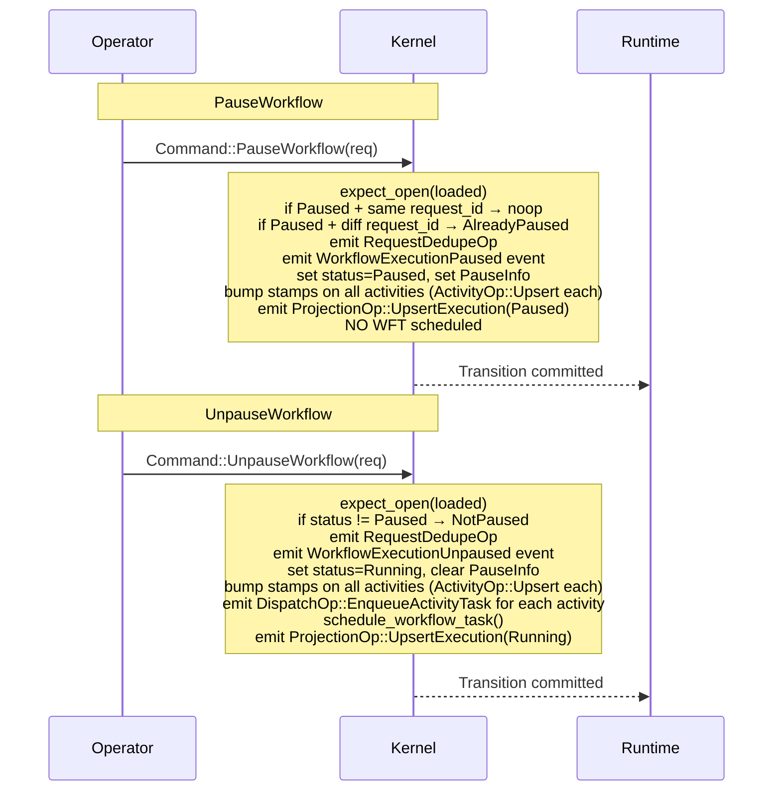
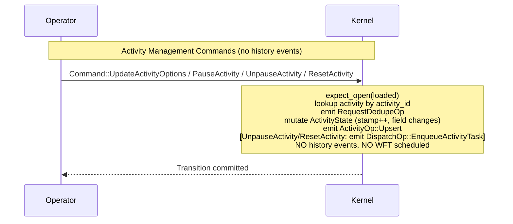
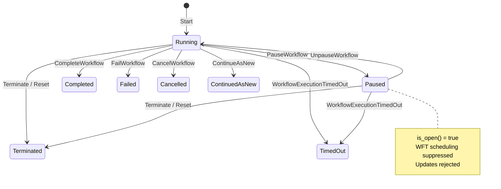

# Design: Kernel Pause/Unpause and Activity Management (Feature 11)

## Overview

This design adds six new top-level kernel commands in two groups:

**Group A — Workflow Pause/Unpause:**
1. `PauseWorkflow` — transitions a Running workflow to Paused status, emits a `WorkflowExecutionPaused` event, bumps stamps on all pending activities, and emits a `ProjectionOp::UpsertExecution(Paused)`.
2. `UnpauseWorkflow` — transitions a Paused workflow back to Running, emits a `WorkflowExecutionUnpaused` event, bumps stamps on all pending activities, re-dispatches all activity tasks, schedules a WFT, and emits a `ProjectionOp::UpsertExecution(Running)`.

**Group B — Activity Management:**
3. `UpdateActivityOptions` — mutates timeout/task_queue fields on a pending activity, bumps stamp, emits `ActivityOp::Upsert`.
4. `PauseActivity` — sets `ActivityPauseInfo` on a pending activity, bumps stamp, emits `ActivityOp::Upsert`.
5. `UnpauseActivity` — clears `ActivityPauseInfo`, bumps stamp, emits `ActivityOp::Upsert` + `DispatchOp::EnqueueActivityTask`.
6. `ResetActivity` — resets attempt to 1, bumps stamp, emits `ActivityOp::Upsert` + `DispatchOp::EnqueueActivityTask`.

Key design decisions:
- **Paused is non-terminal and open.** `is_open()` returns true. `expect_open` treats Paused as open.
- **WFT scheduling suppression, not rejection.** `schedule_workflow_task` on `TransitionBuilder` checks `status == Paused` and becomes a no-op. Commands still emit events and mutate state normally.
- **WFT lifecycle commands are NOT rejected.** WorkflowTaskStarted/Completed/Failed/TimedOut proceed normally. Stale WFT prevention is a delivery-layer concern via `wft_stamp` on WorkflowState (bumped on pause, included in task tokens, validated by runtime on WFT start).
- **WFT re-dispatch suppression.** `WorkflowTaskFailed` and `WorkflowTaskTimedOut` suppress the `DispatchOp::EnqueueWorkflowTask` when paused.
- **Updates ARE rejected** with `WorkflowPaused` because they require an active WFT.
- **Activity management commands emit NO history events.** Pure state mutations with stamp bumps and `ActivityOp::Upsert`.
- **Activity dispatch suppression when paused.** `UnpauseActivity` and `ResetActivity` suppress `DispatchOp::EnqueueActivityTask` when the workflow is paused. The state mutation still occurs; dispatch is deferred until `UnpauseWorkflow` re-dispatches all activities.
- **PauseWorkflow is idempotent** with matching `request_id`. Different `request_id` → `AlreadyPaused`.
- **Stamp invalidation on pause/unpause.** All pending activities get stamps bumped via `ActivityOp::Upsert`. `wft_stamp` on WorkflowState is bumped on pause.
- **UnpauseWorkflow WFT scheduling is conditional.** If a WFT was already pending when the workflow was paused, UnpauseWorkflow does not schedule a second one (at-most-one-WFT invariant). It calls `schedule_workflow_task()` which has the existing `pending_workflow_task.is_some()` guard.
- **ResetActivity heartbeat clearing is a no-op.** `reset_heartbeat` is accepted on the request for API compatibility but ActivityState does not yet carry heartbeat_details. The flag becomes effective when that field is added in a future feature.

## Architecture







### WFT Scheduling Suppression Mechanism

The `schedule_workflow_task` method on `TransitionBuilder` gains a guard:

```rust
fn schedule_workflow_task(&mut self) {
    if self.state.status == ExecutionStatus::Paused {
        return; // Suppress WFT scheduling while paused
    }
    // ... existing logic unchanged
}
```

This single check point covers all commands that call `schedule_workflow_task`:
- `Start` (never paused at start, so no effect)
- `Signal`, `Cancel`, `ActivityResolved`, `TimerDue`, `ChildStartConfirmed`, `ChildResolved`, `ExternalSignalResolved`, `ExternalCancelResolved`, `NexusOperationResolved` — all suppressed when paused
- `UnpauseWorkflow` — sets status to Running BEFORE calling `schedule_workflow_task`, so the guard passes
- `WorkflowTaskCompleted` with `force_new_workflow_task` — suppressed when paused

For `WorkflowTaskFailed` and `WorkflowTaskTimedOut`, which push `DispatchOp::EnqueueWorkflowTask` directly (not via `schedule_workflow_task`), the handler checks `status == Paused` before pushing the dispatch op.

## Components and Interfaces

### New Types

**`state.rs` — `PauseInfo` and `ActivityPauseInfo`:**
```rust
#[derive(Clone, Debug, PartialEq)]
pub struct PauseInfo {
    pub pause_time: OffsetDateTime,
    pub identity: String,
    pub reason: String,
    pub request_id: String,
}

#[derive(Clone, Debug, PartialEq)]
pub struct ActivityPauseInfo {
    pub pause_time: OffsetDateTime,
    pub identity: String,
    pub reason: String,
}
```

**`command.rs` — six new request structs:**
```rust
#[derive(Clone, Debug, PartialEq)]
pub struct PauseWorkflowRequest {
    pub identity: String,
    pub reason: String,
    pub request: RequestContext,
    pub now: OffsetDateTime,
}

#[derive(Clone, Debug, PartialEq)]
pub struct UnpauseWorkflowRequest {
    pub identity: String,
    pub reason: String,
    pub request: RequestContext,
    pub now: OffsetDateTime,
}

#[derive(Clone, Debug, PartialEq)]
pub struct UpdateActivityOptionsRequest {
    pub activity_id: String,
    pub task_queue: FieldChange<TaskQueueName>,
    pub schedule_to_close_timeout: FieldChange<Option<Duration>>,
    pub schedule_to_start_timeout: FieldChange<Option<Duration>>,
    pub start_to_close_timeout: FieldChange<Option<Duration>>,
    pub heartbeat_timeout: FieldChange<Option<Duration>>,
    pub request: RequestContext,
    pub now: OffsetDateTime,
}

#[derive(Clone, Debug, PartialEq)]
pub struct PauseActivityRequest {
    pub activity_id: String,
    pub identity: String,
    pub reason: String,
    pub request: RequestContext,
    pub now: OffsetDateTime,
}

#[derive(Clone, Debug, PartialEq)]
pub struct UnpauseActivityRequest {
    pub activity_id: String,
    pub request: RequestContext,
    pub now: OffsetDateTime,
}

#[derive(Clone, Debug, PartialEq)]
pub struct ResetActivityRequest {
    pub activity_id: String,
    pub reset_heartbeat: bool,
    pub request: RequestContext,
    pub now: OffsetDateTime,
}
```

### Enum Variant Additions

**`ExecutionStatus`** (in `tokeira-types`) gains:
```rust
Paused,
```

**`ExecutionStatus::is_open()`** changes to:
```rust
pub fn is_open(self) -> bool {
    matches!(self, Self::Running | Self::Paused)
}
```

**`Command`** gains:
```rust
PauseWorkflow(PauseWorkflowRequest),
UnpauseWorkflow(UnpauseWorkflowRequest),
UpdateActivityOptions(UpdateActivityOptionsRequest),
PauseActivity(PauseActivityRequest),
UnpauseActivity(UnpauseActivityRequest),
ResetActivity(ResetActivityRequest),
```

**`Reject`** gains:
```rust
#[error("workflow is paused")]
WorkflowPaused,
#[error("workflow is already paused")]
AlreadyPaused,
#[error("workflow is not paused")]
NotPaused,
#[error("activity is not paused: {0}")]
ActivityNotPaused(String),
```

**`HistoryEventKind`** gains:
```rust
WorkflowExecutionPaused {
    identity: String,
    reason: String,
    request_id: String,
},
WorkflowExecutionUnpaused {
    identity: String,
    reason: String,
    request_id: String,
},
```

### Existing Type Modifications

**`WorkflowState`** gains:
```rust
pub pause_info: Option<PauseInfo>,
pub wft_stamp: u64,
```
`pause_info` initialized to `None` on `Start`. Set to `Some` on `PauseWorkflow`. Cleared to `None` on `UnpauseWorkflow`. Cleared to `None` on `close()` — a terminated or timed-out workflow does not retain pause metadata in terminal state. The `WorkflowExecutionPaused` history event is the authoritative record of the pause. This is consistent with how `close()` already clears `pending_workflow_task`, `sticky`, and pending entity maps.

`wft_stamp` initialized to `0` on `Start`. Incremented on `PauseWorkflow`. The runtime includes this stamp in WFT task tokens and validates it on `WorkflowTaskStarted` to detect stale deliveries. This is the WFT equivalent of the activity-level `stamp` field.

**`ActivityState`** gains:
```rust
pub pause_info: Option<ActivityPauseInfo>,
pub stamp: u64,
```
Initialized to `pause_info: None, stamp: 0` on `ScheduleActivity`. The `stamp` is incremented by every activity management command and by workflow-level pause/unpause.

### Kernel Logic

**`BasicKernel::apply`** — six new match arms:
```rust
Command::PauseWorkflow(req) => self.apply_pause_workflow(loaded, req),
Command::UnpauseWorkflow(req) => self.apply_unpause_workflow(loaded, req),
Command::UpdateActivityOptions(req) => self.apply_update_activity_options(loaded, req),
Command::PauseActivity(req) => self.apply_pause_activity(loaded, req),
Command::UnpauseActivity(req) => self.apply_unpause_activity(loaded, req),
Command::ResetActivity(req) => self.apply_reset_activity(loaded, req),
```

**`apply_update` — reject paused workflows:**
```rust
fn apply_update(&self, loaded: LoadedRun, req: UpdateRequest) -> Result<Transition, Reject> {
    let state = expect_open(loaded)?;
    if state.status == ExecutionStatus::Paused {
        return Err(Reject::WorkflowPaused);
    }
    // ... rest unchanged
}
```

**`apply_pause_workflow`:**
```rust
fn apply_pause_workflow(
    &self,
    loaded: LoadedRun,
    req: PauseWorkflowRequest,
) -> Result<Transition, Reject> {
    let state = expect_open(loaded)?;

    // Idempotency: same request_id on already-paused = noop
    if state.status == ExecutionStatus::Paused {
        if let Some(ref info) = state.pause_info {
            if info.request_id == req.request.request_id.0 {
                // Noop: return transition with no ops, just seq bump
                let builder = TransitionBuilder::new(state, req.now);
                return Ok(builder.finish());
            }
        }
        return Err(Reject::AlreadyPaused);
    }

    let mut builder = TransitionBuilder::new(state, req.now);
    builder.request_dedupe_ops.push(RequestDedupeOp {
        request_id: req.request.request_id.clone(),
    });
    builder.emit(HistoryEventKind::WorkflowExecutionPaused {
        identity: req.identity.clone(),
        reason: req.reason.clone(),
        request_id: req.request.request_id.0.clone(),
    });
    builder.state.status = ExecutionStatus::Paused;
    builder.state.pause_info = Some(PauseInfo {
        pause_time: req.now,
        identity: req.identity,
        reason: req.reason,
        request_id: req.request.request_id.0.clone(),
    });
    builder.state.wft_stamp += 1; // Invalidate in-flight WFT deliveries

    // Bump stamps on all pending activities
    let activity_ids: Vec<String> = builder.state.activities.keys().cloned().collect();
    for activity_id in activity_ids {
        if let Some(activity) = builder.state.activities.get_mut(&activity_id) {
            activity.stamp += 1;
            builder.activity_ops.push(ActivityOp::Upsert(activity.clone()));
        }
    }

    builder.projection_ops.push(ProjectionOp::UpsertExecution {
        status: ExecutionStatus::Paused,
        memo_patch: builder.state.memo.clone(),
        search_attr_patch: builder.state.search_attributes.clone(),
    });
    // No WFT scheduled
    Ok(builder.finish())
}
```

**`apply_unpause_workflow`:**
```rust
fn apply_unpause_workflow(
    &self,
    loaded: LoadedRun,
    req: UnpauseWorkflowRequest,
) -> Result<Transition, Reject> {
    let state = expect_open(loaded)?;
    if state.status != ExecutionStatus::Paused {
        return Err(Reject::NotPaused);
    }

    let mut builder = TransitionBuilder::new(state, req.now);
    builder.request_dedupe_ops.push(RequestDedupeOp {
        request_id: req.request.request_id.clone(),
    });
    builder.emit(HistoryEventKind::WorkflowExecutionUnpaused {
        identity: req.identity.clone(),
        reason: req.reason.clone(),
        request_id: req.request.request_id.0.clone(),
    });
    builder.state.status = ExecutionStatus::Running;
    builder.state.pause_info = None;

    // Bump stamps and re-dispatch all pending activities
    let activity_ids: Vec<String> = builder.state.activities.keys().cloned().collect();
    for activity_id in activity_ids {
        if let Some(activity) = builder.state.activities.get_mut(&activity_id) {
            activity.stamp += 1;
            builder.activity_ops.push(ActivityOp::Upsert(activity.clone()));
            builder.dispatch_ops.push(DispatchOp::EnqueueActivityTask {
                queue: QueueKey {
                    namespace_id: builder.state.namespace_id,
                    task_queue: activity.task_queue.clone(),
                    task_kind: tokeira_types::TaskKind::Activity,
                    deployment: None,
                    build_id: None,
                },
                activity_id: activity.activity_id.clone(),
                schedule_event_id: activity.schedule_event_id,
                attempt: activity.attempt,
                schedule_to_close_timeout: activity.schedule_to_close_timeout,
                schedule_to_start_timeout: activity.schedule_to_start_timeout,
                start_to_close_timeout: activity.start_to_close_timeout,
                heartbeat_timeout: activity.heartbeat_timeout,
            });
        }
    }

    builder.projection_ops.push(ProjectionOp::UpsertExecution {
        status: ExecutionStatus::Running,
        memo_patch: builder.state.memo.clone(),
        search_attr_patch: builder.state.search_attributes.clone(),
    });
    // Status is now Running, so schedule_workflow_task will pass the guard
    builder.schedule_workflow_task();
    Ok(builder.finish())
}
```

**`apply_update_activity_options`:**
```rust
fn apply_update_activity_options(
    &self,
    loaded: LoadedRun,
    req: UpdateActivityOptionsRequest,
) -> Result<Transition, Reject> {
    let state = expect_open(loaded)?;
    if !state.activities.contains_key(&req.activity_id) {
        return Err(Reject::UnknownActivity(req.activity_id));
    }

    let mut builder = TransitionBuilder::new(state, req.now);
    builder.request_dedupe_ops.push(RequestDedupeOp {
        request_id: req.request.request_id.clone(),
    });

    let activity = builder.state.activities.get_mut(&req.activity_id).unwrap();
    match req.task_queue {
        FieldChange::Set(tq) => activity.task_queue = tq,
        FieldChange::Clear => {} // task_queue is not optional, Clear is a no-op
        FieldChange::Unchanged => {}
    }
    match req.schedule_to_close_timeout {
        FieldChange::Set(v) => activity.schedule_to_close_timeout = v,
        FieldChange::Clear => activity.schedule_to_close_timeout = None,
        FieldChange::Unchanged => {}
    }
    match req.schedule_to_start_timeout {
        FieldChange::Set(v) => activity.schedule_to_start_timeout = v,
        FieldChange::Clear => activity.schedule_to_start_timeout = None,
        FieldChange::Unchanged => {}
    }
    match req.start_to_close_timeout {
        FieldChange::Set(v) => activity.start_to_close_timeout = v,
        FieldChange::Clear => activity.start_to_close_timeout = None,
        FieldChange::Unchanged => {}
    }
    match req.heartbeat_timeout {
        FieldChange::Set(v) => activity.heartbeat_timeout = v,
        FieldChange::Clear => activity.heartbeat_timeout = None,
        FieldChange::Unchanged => {}
    }
    activity.stamp += 1;
    builder.activity_ops.push(ActivityOp::Upsert(activity.clone()));

    // No history events, no WFT scheduled
    Ok(builder.finish())
}
```

**`apply_pause_activity`:**
```rust
fn apply_pause_activity(
    &self,
    loaded: LoadedRun,
    req: PauseActivityRequest,
) -> Result<Transition, Reject> {
    let state = expect_open(loaded)?;
    if !state.activities.contains_key(&req.activity_id) {
        return Err(Reject::UnknownActivity(req.activity_id));
    }

    let mut builder = TransitionBuilder::new(state, req.now);
    builder.request_dedupe_ops.push(RequestDedupeOp {
        request_id: req.request.request_id.clone(),
    });

    let activity = builder.state.activities.get_mut(&req.activity_id).unwrap();
    activity.pause_info = Some(ActivityPauseInfo {
        pause_time: req.now,
        identity: req.identity,
        reason: req.reason,
    });
    activity.stamp += 1;
    builder.activity_ops.push(ActivityOp::Upsert(activity.clone()));

    // No history events, no WFT scheduled
    Ok(builder.finish())
}
```

**`apply_unpause_activity`:**
```rust
fn apply_unpause_activity(
    &self,
    loaded: LoadedRun,
    req: UnpauseActivityRequest,
) -> Result<Transition, Reject> {
    let state = expect_open(loaded)?;
    let activity = state.activities.get(&req.activity_id)
        .ok_or_else(|| Reject::UnknownActivity(req.activity_id.clone()))?;
    if activity.pause_info.is_none() {
        return Err(Reject::ActivityNotPaused(req.activity_id));
    }

    let mut builder = TransitionBuilder::new(state, req.now);
    builder.request_dedupe_ops.push(RequestDedupeOp {
        request_id: req.request.request_id.clone(),
    });

    let activity = builder.state.activities.get_mut(&req.activity_id).unwrap();
    activity.pause_info = None;
    activity.stamp += 1;
    let activity_snapshot = activity.clone();
    builder.activity_ops.push(ActivityOp::Upsert(activity_snapshot.clone()));
    // Only dispatch if workflow is not paused; if paused, UnpauseWorkflow will re-dispatch all activities
    if builder.state.status != ExecutionStatus::Paused {
        builder.dispatch_ops.push(DispatchOp::EnqueueActivityTask {
            queue: QueueKey {
                namespace_id: builder.state.namespace_id,
                task_queue: activity_snapshot.task_queue.clone(),
                task_kind: tokeira_types::TaskKind::Activity,
                deployment: None,
                build_id: None,
            },
            activity_id: activity_snapshot.activity_id,
            schedule_event_id: activity_snapshot.schedule_event_id,
            attempt: activity_snapshot.attempt,
            schedule_to_close_timeout: activity_snapshot.schedule_to_close_timeout,
            schedule_to_start_timeout: activity_snapshot.schedule_to_start_timeout,
            start_to_close_timeout: activity_snapshot.start_to_close_timeout,
            heartbeat_timeout: activity_snapshot.heartbeat_timeout,
        });
    }

    // No history events, no WFT scheduled
    Ok(builder.finish())
}
```

**`apply_reset_activity`:**
```rust
fn apply_reset_activity(
    &self,
    loaded: LoadedRun,
    req: ResetActivityRequest,
) -> Result<Transition, Reject> {
    let state = expect_open(loaded)?;
    if !state.activities.contains_key(&req.activity_id) {
        return Err(Reject::UnknownActivity(req.activity_id));
    }

    let mut builder = TransitionBuilder::new(state, req.now);
    builder.request_dedupe_ops.push(RequestDedupeOp {
        request_id: req.request.request_id.clone(),
    });

    let activity = builder.state.activities.get_mut(&req.activity_id).unwrap();
    activity.attempt = 1;
    // reset_heartbeat: accepted for API compatibility but no-op until ActivityState gains heartbeat_details
    activity.stamp += 1;
    let activity_snapshot = activity.clone();
    builder.activity_ops.push(ActivityOp::Upsert(activity_snapshot.clone()));
    // Only dispatch if workflow is not paused; if paused, UnpauseWorkflow will re-dispatch all activities
    if builder.state.status != ExecutionStatus::Paused {
        builder.dispatch_ops.push(DispatchOp::EnqueueActivityTask {
            queue: QueueKey {
                namespace_id: builder.state.namespace_id,
                task_queue: activity_snapshot.task_queue.clone(),
                task_kind: tokeira_types::TaskKind::Activity,
                deployment: None,
                build_id: None,
            },
            activity_id: activity_snapshot.activity_id,
            schedule_event_id: activity_snapshot.schedule_event_id,
            attempt: activity_snapshot.attempt,
            schedule_to_close_timeout: activity_snapshot.schedule_to_close_timeout,
            schedule_to_start_timeout: activity_snapshot.schedule_to_start_timeout,
            start_to_close_timeout: activity_snapshot.start_to_close_timeout,
            heartbeat_timeout: activity_snapshot.heartbeat_timeout,
        });
    }

    // No history events, no WFT scheduled
    Ok(builder.finish())
}
```

### Modifications to Existing Handlers

**`TransitionBuilder::schedule_workflow_task`** — add paused guard:
```rust
fn schedule_workflow_task(&mut self) {
    if self.state.status == ExecutionStatus::Paused {
        return;
    }
    // ... existing logic unchanged
}
```

**`apply_workflow_task_failed`** — suppress re-dispatch when paused:
```rust
// After clearing started_event_id, before pushing DispatchOp:
if self.state.status != ExecutionStatus::Paused {
    builder.dispatch_ops.push(DispatchOp::EnqueueWorkflowTask { ... });
}
```

**`apply_workflow_task_timed_out`** — suppress re-dispatch when paused:
```rust
// After clearing started_event_id and sticky, before pushing DispatchOp:
if self.state.status != ExecutionStatus::Paused {
    builder.dispatch_ops.push(DispatchOp::EnqueueWorkflowTask { ... });
}
```

**`apply_update`** — reject paused workflows:
```rust
// After expect_open, before any processing:
if state.status == ExecutionStatus::Paused {
    return Err(Reject::WorkflowPaused);
}
```

**`apply_start`** — `WorkflowState` initializer gains:
```rust
pause_info: None,
wft_stamp: 0,
```

**`ScheduleActivity` in `apply_workflow_command`** — `ActivityState` initializer gains:
```rust
pause_info: None,
stamp: 0,
```

**`TransitionBuilder::close()`** — clear `pause_info` on close. `close()` already clears `pending_workflow_task`, `sticky`, and pending entity maps. Add `self.state.pause_info = None;` to the close path. This ensures `pause_info` is `None` whenever `status != Paused`, consistent with Requirement 11.2.4.

### Downstream Breakage

1. **`ExecutionStatus` enum** — add `Paused` variant. All exhaustive matches across the workspace must add the new arm. `is_open()` must include `Paused`.
2. **`Command` enum** — add 6 new variants. All exhaustive matches on `Command` must add arms.
3. **`Reject` enum** — add 4 new variants (`WorkflowPaused`, `AlreadyPaused`, `NotPaused`, `ActivityNotPaused`). All exhaustive matches on `Reject` must add arms.
4. **`HistoryEventKind` enum** — add 2 new variants (`WorkflowExecutionPaused`, `WorkflowExecutionUnpaused`). All exhaustive matches must add arms.
5. **`WorkflowState` construction sites** — must include `pause_info: None, wft_stamp: 0` (or appropriate values).
6. **`ActivityState` construction sites** — must include `pause_info: None, stamp: 0` (or appropriate values).
7. **`BasicKernel::apply` match** — add 6 new arms.
8. **Test helpers** — any `WorkflowState` or `ActivityState` construction in tests must include new fields.

**Workspace compile checkpoint:** After adding all new types and enum variants, run `cargo check --workspace` to verify all downstream breakage is resolved before implementing handler logic.

## Data Models

No new storage tables. All new types are part of `WorkflowState` or `ActivityState` which are persisted as full-state replacements per transition.

New fields on `WorkflowState`:
- `pause_info: Option<PauseInfo>` — set by `PauseWorkflow`, cleared by `UnpauseWorkflow`, initialized to `None` on `Start`
- `wft_stamp: u64` — incremented by `PauseWorkflow`, initialized to `0` on `Start`. The runtime includes this in WFT task tokens and validates on `WorkflowTaskStarted` to detect stale deliveries.

New fields on `ActivityState`:
- `pause_info: Option<ActivityPauseInfo>` — set by `PauseActivity`, cleared by `UnpauseActivity`, initialized to `None` on `ScheduleActivity`
- `stamp: u64` — monotonically incremented by every activity management command and by workflow-level pause/unpause, initialized to `0` on `ScheduleActivity`

New structs:
- `PauseInfo { pause_time, identity, reason, request_id }` — workflow-level pause metadata
- `ActivityPauseInfo { pause_time, identity, reason }` — activity-level pause metadata

New request structs:
- `PauseWorkflowRequest { identity, reason, request, now }`
- `UnpauseWorkflowRequest { identity, reason, request, now }`
- `UpdateActivityOptionsRequest { activity_id, task_queue, schedule_to_close_timeout, schedule_to_start_timeout, start_to_close_timeout, heartbeat_timeout, request, now }`
- `PauseActivityRequest { activity_id, identity, reason, request, now }`
- `UnpauseActivityRequest { activity_id, request, now }`
- `ResetActivityRequest { activity_id, reset_heartbeat, request, now }`

Lifecycle summary:

| Field | Initialized | Updated by | Cleared by |
|---|---|---|---|
| `WorkflowState.pause_info` | `None` on Start | `PauseWorkflow` | `UnpauseWorkflow` |
| `WorkflowState.wft_stamp` | `0` on Start | `PauseWorkflow` | Never cleared (monotonic) |
| `ActivityState.pause_info` | `None` on ScheduleActivity | `PauseActivity` | `UnpauseActivity` |
| `ActivityState.stamp` | `0` on ScheduleActivity | All activity mgmt commands, PauseWorkflow, UnpauseWorkflow | Never cleared (monotonic) |

## Correctness Properties

*A property is a characteristic or behavior that should hold true across all valid executions of a system — essentially, a formal statement about what the system should do. Properties serve as the bridge between human-readable specifications and machine-verifiable correctness guarantees.*

### Property 1: PauseWorkflow produces correct state and event

*For any* valid open `WorkflowState` with `status == Running` and N pending activities, and *for any* valid `PauseWorkflowRequest`, when PauseWorkflow is applied: (a) `next_state.status` shall be `ExecutionStatus::Paused`, (b) `next_state.pause_info` shall be `Some(PauseInfo)` with `pause_time == req.now`, `identity == req.identity`, `reason == req.reason`, `request_id == req.request.request_id.0`, (c) the transition shall contain exactly one `WorkflowExecutionPaused` history event with matching `identity`, `reason`, and `request_id`, (d) the transition shall contain exactly one `RequestDedupeOp` matching the request ID, (e) the transition shall contain exactly one `ProjectionOp::UpsertExecution` with `Paused` status, (f) the transition shall contain exactly N `ActivityOp::Upsert` ops, each with `stamp` incremented by 1 from the input state, (g) the transition shall contain no `DispatchOp::EnqueueWorkflowTask`, (h) `next_state.wft_stamp` shall be the input state's `wft_stamp + 1`.

**Validates: Requirements 11.3.1, 11.3.2, 11.3.3, 11.3.4, 11.3.5, 11.3.6, 11.3.7, 11.3.8, 11.5.3, 11.14.1, 11.14.6, 11.14.8**

### Property 2: UnpauseWorkflow produces correct state, events, and dispatch ops

*For any* valid `WorkflowState` with `status == Paused` and N pending activities, and *for any* valid `UnpauseWorkflowRequest`, when UnpauseWorkflow is applied: (a) `next_state.status` shall be `ExecutionStatus::Running`, (b) `next_state.pause_info` shall be `None`, (c) the transition shall contain one `WorkflowExecutionUnpaused` event with matching fields, (d) if no WFT was pending, the transition shall also contain one `WorkflowTaskScheduled` event and one `DispatchOp::EnqueueWorkflowTask`; if a WFT was already pending, neither shall be emitted (at-most-one-WFT invariant), (e) the transition shall contain exactly one `RequestDedupeOp`, (f) the transition shall contain exactly one `ProjectionOp::UpsertExecution` with `Running` status, (g) the transition shall contain exactly N `ActivityOp::Upsert` ops with incremented stamps, (h) the transition shall contain exactly N `DispatchOp::EnqueueActivityTask` ops (one per activity).

**Validates: Requirements 11.4.1, 11.4.2, 11.4.3, 11.4.4, 11.4.5, 11.4.6, 11.4.7, 11.4.8, 11.5.4, 11.14.1, 11.14.7**

### Property 3: PauseWorkflow idempotency

*For any* valid `WorkflowState` with `status == Paused` and `pause_info.request_id == R`, and *for any* `PauseWorkflowRequest` with `request.request_id.0 == R`, when PauseWorkflow is applied: (a) the result shall be `Ok`, (b) the transition shall contain zero history events, zero activity ops, zero dispatch ops, and zero projection ops, (c) `next_state` shall be identical to the input state except `transition_seq` which shall increment by one. And *for any* `PauseWorkflowRequest` with `request.request_id.0 != R`, the result shall be `Err(Reject::AlreadyPaused)`.

**Validates: Requirements 11.3.8, 11.3.9, 11.15.1, 11.15.2, 11.15.3**

### Property 4: WFT scheduling suppression for paused workflows

*For any* valid `WorkflowState` with `status == Paused` and *for any* command that would normally schedule a WFT on a Running workflow (Signal, Cancel, ActivityResolved, TimerDue, ChildStartConfirmed, ChildResolved, ExternalSignalResolved, ExternalCancelResolved, NexusOperationResolved), when the command is applied: (a) the transition shall contain no `DispatchOp::EnqueueWorkflowTask`, (b) the transition shall contain no `WorkflowTaskScheduled` history event beyond any that were already pending, (c) the command's primary event (e.g., `WorkflowExecutionSignaled`) shall still be emitted, (d) the command's state mutations shall still occur.

**Validates: Requirements 11.1.4, 11.6.1, 11.6.2, 11.6.7, 11.6.8, 11.6.14**

### Property 5: WFT re-dispatch suppression for paused workflows

*For any* valid `WorkflowState` with `status == Paused` and a pending started WFT, when `WorkflowTaskFailed` or `WorkflowTaskTimedOut` is applied: (a) the transition shall contain no `DispatchOp::EnqueueWorkflowTask`, (b) the `WorkflowTaskFailed`/`WorkflowTaskTimedOut` history event shall still be emitted, (c) `started_event_id` on the pending WFT shall be cleared.

**Validates: Requirements 11.6.11, 11.6.12**

### Property 6: Activity management commands emit no history events and no WFT

*For any* valid open `WorkflowState` with at least one pending activity, and *for any* valid activity management command (UpdateActivityOptions, PauseActivity, UnpauseActivity, ResetActivity), when the command is applied: (a) the transition shall contain zero history events, (b) the transition shall contain no `DispatchOp::EnqueueWorkflowTask`, (c) the transition shall contain exactly one `RequestDedupeOp`, (d) `transition_seq` shall increment exactly once.

**Validates: Requirements 11.8.5, 11.8.6, 11.9.5, 11.9.6, 11.10.6, 11.10.7, 11.11.7, 11.11.8, 11.14.3, 11.14.4**

### Property 7: Activity management commands produce correct ActivityOp::Upsert with incremented stamp

*For any* valid open `WorkflowState` with a pending activity at stamp S, and *for any* valid activity management command targeting that activity: (a) the transition shall contain exactly one `ActivityOp::Upsert` for that activity, (b) the upserted activity's `stamp` shall be `S + 1`, (c) the upserted activity shall have a corresponding entry in `next_state.activities` with matching fields.

**Validates: Requirements 11.8.3, 11.8.4, 11.9.3, 11.9.4, 11.10.3, 11.10.4, 11.11.4, 11.11.5, 11.14.5**

### Property 8: UpdateActivityOptions mutates specified fields correctly

*For any* valid open `WorkflowState` with a pending activity, and *for any* valid `UpdateActivityOptionsRequest` with arbitrary `FieldChange` values for each timeout and task_queue: (a) if a field is `Set(v)`, the resulting activity shall have that field equal to `v`, (b) if a field is `Clear`, the resulting activity's optional timeout shall be `None`, (c) if a field is `Unchanged`, the resulting activity's field shall equal the input value.

**Validates: Requirements 11.8.2**

### Property 9: PauseActivity sets ActivityPauseInfo correctly

*For any* valid open `WorkflowState` with a pending activity, and *for any* valid `PauseActivityRequest`, when PauseActivity is applied: the resulting activity's `pause_info` shall be `Some(ActivityPauseInfo)` with `pause_time == req.now`, `identity == req.identity`, `reason == req.reason`.

**Validates: Requirements 11.9.2**

### Property 10: UnpauseActivity clears pause_info and re-dispatches

*For any* valid open `WorkflowState` with a pending activity that has `pause_info == Some(...)`, and *for any* valid `UnpauseActivityRequest`, when UnpauseActivity is applied: (a) the resulting activity's `pause_info` shall be `None`, (b) if the workflow status is Running, the transition shall contain exactly one `DispatchOp::EnqueueActivityTask` for that activity; if the workflow status is Paused, the transition shall contain no `DispatchOp::EnqueueActivityTask` (dispatch deferred to UnpauseWorkflow).

**Validates: Requirements 11.10.2, 11.10.5**

### Property 11: UnpauseActivity rejects non-paused activity

*For any* valid open `WorkflowState` with a pending activity that has `pause_info == None`, and *for any* `UnpauseActivityRequest` targeting that activity, the result shall be `Err(Reject::ActivityNotPaused(activity_id))`.

**Validates: Requirements 11.10.8**

### Property 12: ResetActivity resets attempt and re-dispatches

*For any* valid open `WorkflowState` with a pending activity at any attempt count, and *for any* valid `ResetActivityRequest`, when ResetActivity is applied: (a) the resulting activity's `attempt` shall be `1`, (b) if the workflow status is Running, the transition shall contain exactly one `DispatchOp::EnqueueActivityTask` for that activity with `attempt == 1`; if the workflow status is Paused, the transition shall contain no `DispatchOp::EnqueueActivityTask` (dispatch deferred to UnpauseWorkflow).

**Validates: Requirements 11.11.2, 11.11.6**

### Property 13: ScheduleActivity initializes new ActivityState fields

*For any* valid `WorkflowTaskCompleted` containing a `ScheduleActivity` command, the resulting `ActivityState` in `next_state.activities` shall have `stamp == 0` and `pause_info == None`.

**Validates: Requirements 11.7.4**

### Property 14: UnpauseWorkflow rejects non-paused workflows

*For any* valid open `WorkflowState` with `status == Running`, and *for any* `UnpauseWorkflowRequest`, the result shall be `Err(Reject::NotPaused)`.

**Validates: Requirements 11.4.9**

### Property 15: Structural invariants hold for Feature 11 transitions

*For any* successful transition produced by any of the six new commands, the existing structural invariants shall hold: (a) event IDs are contiguous starting from `last_event_id + 1`, (b) `next_state.transition_seq == expected_seq + 1`, (c) at most one `PendingWorkflowTask` in `next_state`, (d) every `ActivityOp::Upsert` has a corresponding entry in `next_state.activities`, (e) every `ActivityOp::Delete` has no corresponding entry in `next_state.activities`.

**Validates: Requirements 11.14.1, 11.14.2, 11.14.4, 11.14.5**

## Error Handling

| Scenario | Reject variant | Notes |
|---|---|---|
| PauseWorkflow against `LoadedRun::Absent` | `MissingRun` | Standard `expect_open` |
| PauseWorkflow against closed run | `RunClosed(status)` | Standard `expect_open` |
| PauseWorkflow against already-paused run (same request_id) | — (Ok, noop) | Idempotent: returns transition with only seq bump |
| PauseWorkflow against already-paused run (different request_id) | `AlreadyPaused` | New variant |
| UnpauseWorkflow against `LoadedRun::Absent` | `MissingRun` | Standard `expect_open` |
| UnpauseWorkflow against closed run | `RunClosed(status)` | Standard `expect_open` |
| UnpauseWorkflow against non-paused run | `NotPaused` | New variant |
| Update against paused run | `WorkflowPaused` | New variant; added to `apply_update` |
| UpdateActivityOptions against `LoadedRun::Absent` | `MissingRun` | Standard `expect_open` |
| UpdateActivityOptions against closed run | `RunClosed(status)` | Standard `expect_open` |
| UpdateActivityOptions for unknown activity_id | `UnknownActivity(id)` | Existing variant |
| PauseActivity against `LoadedRun::Absent` | `MissingRun` | Standard `expect_open` |
| PauseActivity against closed run | `RunClosed(status)` | Standard `expect_open` |
| PauseActivity for unknown activity_id | `UnknownActivity(id)` | Existing variant |
| UnpauseActivity against `LoadedRun::Absent` | `MissingRun` | Standard `expect_open` |
| UnpauseActivity against closed run | `RunClosed(status)` | Standard `expect_open` |
| UnpauseActivity for unknown activity_id | `UnknownActivity(id)` | Existing variant |
| UnpauseActivity for non-paused activity | `ActivityNotPaused(id)` | New variant |
| ResetActivity against `LoadedRun::Absent` | `MissingRun` | Standard `expect_open` |
| ResetActivity against closed run | `RunClosed(status)` | Standard `expect_open` |
| ResetActivity for unknown activity_id | `UnknownActivity(id)` | Existing variant |

## Testing Strategy

Tests extend the existing `golden_tests.rs` and `property_tests.rs` files. No new test files.

### Golden Tests (in `golden_tests.rs`)

Individual `#[test]` functions covering:

**PauseWorkflow:**
1. `pause_workflow_happy_path` — PauseWorkflow against running state with 2 activities. Assert: `WorkflowExecutionPaused` event with correct fields, status=Paused, pause_info=Some, 2 ActivityOp::Upsert with stamp=1, ProjectionOp::UpsertExecution(Paused), one RequestDedupeOp, no EnqueueWorkflowTask.
2. `pause_workflow_no_activities` — PauseWorkflow against running state with 0 activities. Assert: same as above but 0 ActivityOp::Upsert.
3. `pause_workflow_idempotent_same_request_id` — PauseWorkflow against paused state with matching request_id. Assert: Ok, no events, no ops, next_state identical except transition_seq.
4. `pause_workflow_rejects_different_request_id` — PauseWorkflow against paused state with different request_id. Assert: `Reject::AlreadyPaused`.
5. `pause_workflow_rejects_absent_run` — Assert: `Reject::MissingRun`.
6. `pause_workflow_rejects_closed_run` — Assert: `Reject::RunClosed`.

**UnpauseWorkflow:**
7. `unpause_workflow_happy_path` — UnpauseWorkflow against paused state with 2 activities. Assert: `WorkflowExecutionUnpaused` event, `WorkflowTaskScheduled` event, status=Running, pause_info=None, 2 ActivityOp::Upsert with incremented stamps, 2 EnqueueActivityTask, 1 EnqueueWorkflowTask, ProjectionOp::UpsertExecution(Running).
8. `unpause_workflow_no_activities` — UnpauseWorkflow against paused state with 0 activities. Assert: same but 0 activity ops/dispatch.
9. `unpause_workflow_rejects_running` — UnpauseWorkflow against running state. Assert: `Reject::NotPaused`.
10. `unpause_workflow_rejects_absent_run` — Assert: `Reject::MissingRun`.
11. `unpause_workflow_rejects_closed_run` — Assert: `Reject::RunClosed`.

**Paused workflow interaction with existing commands:**
12. `signal_paused_workflow_no_wft` — Signal against paused state with no pending WFT. Assert: `WorkflowExecutionSignaled` event emitted, no `WorkflowTaskScheduled`, no `EnqueueWorkflowTask`.
13. `cancel_paused_workflow_no_wft` — Cancel against paused state. Assert: event emitted, no WFT.
14. `update_rejects_paused_workflow` — Update against paused state. Assert: `Reject::WorkflowPaused`.
15. `terminate_paused_workflow` — Terminate against paused state. Assert: closes with Terminated (Paused is open).
16. `activity_resolved_paused_workflow_no_wft` — ActivityResolved against paused state. Assert: resolution event emitted, activity removed, no WFT.
17. `wft_failed_paused_workflow_no_redispatch` — WorkflowTaskFailed against paused state with started WFT. Assert: event emitted, started_event_id cleared, no EnqueueWorkflowTask dispatch.
18. `wft_timed_out_paused_workflow_no_redispatch` — WorkflowTaskTimedOut against paused state. Assert: same pattern.
19. `wft_completed_paused_workflow_no_force_wft` — WorkflowTaskCompleted with force_new_workflow_task=true against paused state. Assert: completion proceeds, no new WFT scheduled.

**Activity Management:**
20. `update_activity_options_happy_path` — UpdateActivityOptions with Set timeouts. Assert: no events, stamp incremented, fields updated, one ActivityOp::Upsert, one RequestDedupeOp.
21. `update_activity_options_unknown_activity` — Assert: `Reject::UnknownActivity`.
22. `pause_activity_happy_path` — PauseActivity. Assert: pause_info set, stamp incremented, one ActivityOp::Upsert, no events.
23. `pause_activity_unknown_activity` — Assert: `Reject::UnknownActivity`.
24. `unpause_activity_happy_path` — UnpauseActivity on paused activity. Assert: pause_info cleared, stamp incremented, one ActivityOp::Upsert, one EnqueueActivityTask, no events.
25. `unpause_activity_not_paused` — UnpauseActivity on non-paused activity. Assert: `Reject::ActivityNotPaused`.
26. `unpause_activity_unknown_activity` — Assert: `Reject::UnknownActivity`.
27. `reset_activity_happy_path` — ResetActivity. Assert: attempt=1, stamp incremented, one ActivityOp::Upsert, one EnqueueActivityTask, no events.
28. `reset_activity_unknown_activity` — Assert: `Reject::UnknownActivity`.

### Property Tests (in `property_tests.rs`)

Uses `proptest` crate with `proptest! { }` block style. Minimum 100 iterations per property (proptest default is 256).

Each property test is tagged with a comment: `// Feature: kernel-pause-activity-management, Property N: <title>`

**New arbitrary strategies needed:**
- `arb_pause_workflow_request(now)` — generates random `PauseWorkflowRequest`
- `arb_unpause_workflow_request(now)` — generates random `UnpauseWorkflowRequest`
- `arb_update_activity_options_request(activity_id, now)` — generates random `UpdateActivityOptionsRequest` with `FieldChange` values
- `arb_pause_activity_request(activity_id, now)` — generates random `PauseActivityRequest`
- `arb_unpause_activity_request(activity_id, now)` — generates random `UnpauseActivityRequest`
- `arb_reset_activity_request(activity_id, now)` — generates random `ResetActivityRequest`
- `arb_running_state_with_activities(now, n)` — generates random open `WorkflowState` with `status == Running` and N activities (with `stamp` and `pause_info` fields)
- `arb_paused_state_with_activities(now, n)` — generates random `WorkflowState` with `status == Paused`, `pause_info == Some(...)`, and N activities
- `arb_activity_management_command(state, now)` — generates one of the four activity management commands targeting a random existing activity

The existing `arb_valid_pair` strategy must be extended to include:
- `Command::PauseWorkflow` against Running state
- `Command::UnpauseWorkflow` against Paused state
- All four activity management commands against open state with activities

This ensures the existing structural property tests (event ID contiguity, transition_seq increment, at-most-one-WFT, activity op consistency) automatically cover the new command types.

**Property tests to implement (one `proptest!` test per property):**

1. **Property 1** — new test: generate random running state with N activities, apply PauseWorkflow, assert all state/event/op invariants.
2. **Property 2** — new test: generate random paused state with N activities, apply UnpauseWorkflow, assert all state/event/op invariants.
3. **Property 3** — new test: generate random paused state, apply PauseWorkflow with same request_id (noop) and different request_id (AlreadyPaused).
4. **Property 4** — new test: generate random paused state with pending entities, apply WFT-triggering commands (Signal, Cancel, ActivityResolved, TimerDue), assert no WFT scheduling.
5. **Property 5** — new test: generate random paused state with started WFT, apply WorkflowTaskFailed/TimedOut, assert no EnqueueWorkflowTask dispatch.
6. **Property 6** — new test: generate random open state with activity, apply random activity management command, assert zero history events and no WFT.
7. **Property 7** — new test: generate random open state with activity at stamp S, apply random activity management command, assert ActivityOp::Upsert with stamp S+1.
8. **Property 8** — new test: generate random open state with activity, apply UpdateActivityOptions with random FieldChange values, assert field mutations.
9. **Property 9** — new test: generate random open state with activity, apply PauseActivity, assert pause_info set correctly.
10. **Property 10** — new test: generate random open state with paused activity, apply UnpauseActivity, assert pause_info cleared and EnqueueActivityTask emitted.
11. **Property 11** — new test: generate random open state with non-paused activity, apply UnpauseActivity, assert ActivityNotPaused rejection.
12. **Property 12** — new test: generate random open state with activity at arbitrary attempt, apply ResetActivity, assert attempt=1 and EnqueueActivityTask.
13. **Property 13** — extend existing ScheduleActivity property test or add new test: generate random ScheduleActivity, assert stamp=0 and pause_info=None.
14. **Property 14** — new test: generate random running state, apply UnpauseWorkflow, assert NotPaused rejection.
15. **Property 15** — covered by extending `arb_valid_pair` with all six new commands. Existing structural property tests automatically verify event ID contiguity, transition_seq increment, at-most-one-WFT, and activity op consistency.

**Property-based testing library:** `proptest` (already in use).
**Minimum iterations:** 100 (proptest default is 256).
**Tag format:** `// Feature: kernel-pause-activity-management, Property N: <title>`
