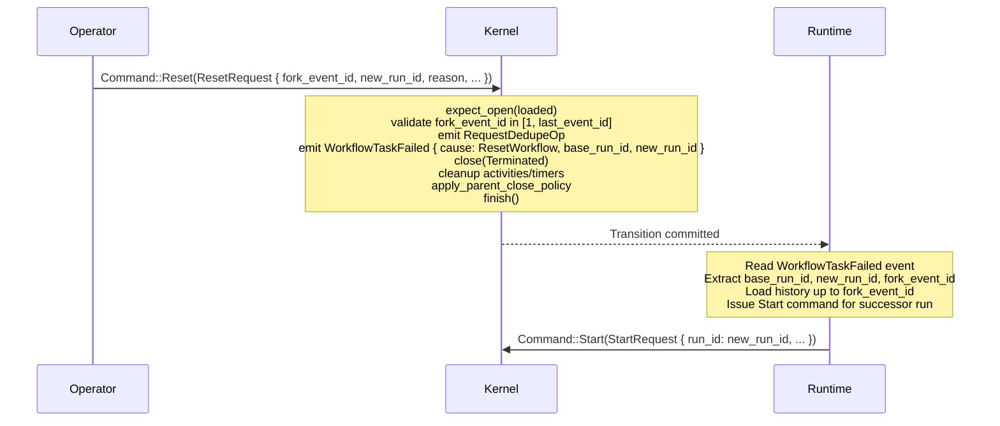

# Design: Kernel Reset (Feature 10)

## Overview

Reset is a top-level kernel command issued by an operator that terminates the current workflow execution and emits metadata for the runtime to create a successor run replaying from a chosen historical event. It follows the Terminate pattern: `expect_open` → validate `fork_event_id` → emit `RequestDedupeOp` → emit `WorkflowTaskFailed` event with `RESET_WORKFLOW` cause and reset metadata → `close(Terminated)` → entity cleanup (`std::mem::take` activities/timers + `apply_parent_close_policy`) → `finish`.

The kernel does NOT copy history or construct the successor run. The runtime reads the `WorkflowTaskFailed` event's reset metadata (`base_run_id`, `new_run_id`) and issues a `Start` command for the new run.

Changes:
- `Command` gains `Reset(ResetRequest)` variant
- `Reject` gains `ResetConstraintViolation { reason: String }` variant
- `WorkflowTaskFailedCause` gains `ResetWorkflow` variant
- `WorkflowTaskFailed` `HistoryEventKind` gains 3 optional fields: `base_run_id: Option<RunId>`, `new_run_id: Option<RunId>`, `fork_event_version: Option<i64>`
- All existing `WorkflowTaskFailed` construction sites provide `None` for the new fields

## Architecture



## Components and Interfaces

### New Types

**`command.rs` — `ResetRequest`:**
```rust
#[derive(Clone, Debug, PartialEq)]
pub struct ResetRequest {
    pub fork_event_id: i64,
    pub new_run_id: RunId,
    pub reason: String,
    pub request: RequestContext,
    pub now: OffsetDateTime,
}
```

### Enum Variant Additions

**`Command`** gains:
```rust
Reset(ResetRequest),
```

**`WorkflowTaskFailedCause`** gains:
```rust
ResetWorkflow,
```

**`Reject`** gains:
```rust
#[error("reset constraint violation: {reason}")]
ResetConstraintViolation { reason: String },
```

### Existing Type Modifications

**`HistoryEventKind::WorkflowTaskFailed`** gains 3 optional fields:
```rust
WorkflowTaskFailed {
    logical_seq: LogicalTaskSeq,
    scheduled_event_id: i64,
    started_event_id: i64,
    failure_cause: WorkflowTaskFailedCause,
    failure_details: Option<Payload>,
    identity: WorkerIdentity,
    // New optional reset metadata fields:
    base_run_id: Option<RunId>,
    new_run_id: Option<RunId>,
    fork_event_version: Option<i64>,
    fork_event_id: Option<i64>,
},
```

All existing construction sites (`apply_workflow_task_failed` in kernel.rs) must provide `None` for these four fields.

### Kernel Logic

**`BasicKernel::apply`** — new match arm:
```rust
Command::Reset(req) => self.apply_reset(loaded, req),
```

**`apply_reset`** — follows the Terminate pattern:
```rust
fn apply_reset(&self, loaded: LoadedRun, req: ResetRequest) -> Result<Transition, Reject> {
    let state = expect_open(loaded)?;

    // Validate fork_event_id
    if req.fork_event_id <= 0 {
        return Err(Reject::ResetConstraintViolation {
            reason: format!("fork_event_id must be positive, got {}", req.fork_event_id),
        });
    }
    if req.fork_event_id > state.last_event_id {
        return Err(Reject::ResetConstraintViolation {
            reason: format!(
                "fork_event_id {} exceeds last_event_id {}",
                req.fork_event_id, state.last_event_id
            ),
        });
    }

    // Determine scheduled/started event IDs from pending WFT (if any)
    let (scheduled_event_id, started_event_id) = match &state.pending_workflow_task {
        Some(pending) => (
            pending.scheduled_event_id,
            pending.started_event_id.unwrap_or(0),
        ),
        None => (0, 0),
    };

    let logical_seq = state.next_workflow_task_seq;
    let base_run_id = state.run_id;

    let mut builder = TransitionBuilder::new(state, req.now);
    builder.request_dedupe_ops.push(RequestDedupeOp {
        request_id: req.request.request_id.clone(),
    });
    builder.emit(HistoryEventKind::WorkflowTaskFailed {
        logical_seq,
        scheduled_event_id,
        started_event_id,
        failure_cause: WorkflowTaskFailedCause::ResetWorkflow,
        failure_details: None,
        identity: WorkerIdentity("reset".into()),
        base_run_id: Some(base_run_id),
        new_run_id: Some(req.new_run_id),
        fork_event_version: None,
        fork_event_id: Some(req.fork_event_id),
    });
    builder.close(ExecutionStatus::Terminated);

    let activities = std::mem::take(&mut builder.state.activities);
    for (activity_id, _) in activities {
        builder.activity_ops.push(ActivityOp::Delete { activity_id });
    }

    let timers = std::mem::take(&mut builder.state.timers);
    for (timer_id, _) in timers {
        builder.timer_ops.push(TimerOp::Delete { timer_id });
    }

    builder.apply_parent_close_policy();

    Ok(builder.finish())
}
```

### WorkflowTaskFailed Event — WFT Reference Logic

The `WorkflowTaskFailed` event emitted by Reset references the pending WFT if one exists:
- **Pending WFT with started_event_id**: use `pending.scheduled_event_id` and `pending.started_event_id`
- **Pending WFT without started_event_id**: use `pending.scheduled_event_id` and `0` (sentinel)
- **No pending WFT**: use `0` and `0` (sentinel values)

The `logical_seq` is always `state.next_workflow_task_seq` (the next available sequence, since this is a synthetic event).

### Downstream Breakage

1. `BasicKernel::apply` match — add `Command::Reset(req)` arm
2. `WorkflowTaskFailed` event construction in `apply_workflow_task_failed` — add `base_run_id: None, new_run_id: None, fork_event_version: None`
3. `WorkflowTaskFailedCause` exhaustive matches across workspace — add `ResetWorkflow` arm
4. `Reject` exhaustive matches across workspace — add `ResetConstraintViolation` arm
5. Test files: any pattern match on `WorkflowTaskFailed` event kind must include the new fields

## Data Models

No new storage tables. `ResetRequest` is a command struct, not persisted state.

Changes to existing models:
- `WorkflowTaskFailed` `HistoryEventKind` variant gains `base_run_id: Option<RunId>`, `new_run_id: Option<RunId>`, `fork_event_version: Option<i64>`
- `WorkflowTaskFailedCause` gains `ResetWorkflow`
- `Command` gains `Reset(ResetRequest)`
- `Reject` gains `ResetConstraintViolation { reason: String }`

The reset metadata is carried in the history event, not in `WorkflowState`. The runtime reads it from the committed event to create the successor run.

## Correctness Properties

*A property is a characteristic or behavior that should hold true across all valid executions of a system — essentially, a formal statement about what the system should do. Properties serve as the bridge between human-readable specifications and machine-verifiable correctness guarantees.*

### Property 1: Reset closes the run with terminal state invariants

*For any* valid open `WorkflowState` with `last_event_id >= 1` and *for any* valid `ResetRequest` with `fork_event_id` in `[1, last_event_id]`, when Reset is applied: `next_state.status` shall be `ExecutionStatus::Terminated`, `next_state.closed_at` shall be `Some`, `next_state.pending_workflow_task` shall be `None`, `next_state.sticky` shall be `None`, and all entity maps (`activities`, `timers`, `children`, `pending_external_signals`, `pending_external_cancels`, `pending_updates`, `pending_nexus_operations`) shall be empty.

**Validates: Requirements 2.1.3, 2.3.4, 6.3.1, 6.3.2, 6.3.3, 6.3.4, 6.3.5, 6.3.6, 6.3.7, 6.3.8, 6.3.9, 6.3.10, 6.3.11, 7.1.1**

### Property 2: Reset entity cleanup ops match input state

*For any* valid open `WorkflowState` with N open activities and M open timers, when Reset is applied with a valid `fork_event_id`: the `activity_ops` shall contain exactly N `ActivityOp::Delete` ops, the `timer_ops` shall contain exactly M `TimerOp::Delete` ops, every `ActivityOp::Delete` shall reference an `activity_id` that existed in the input state's activities map, and every `TimerOp::Delete` shall reference a `timer_id` that existed in the input state's timers map.

**Validates: Requirements 2.3.1, 2.3.2, 6.4.1, 6.4.2, 6.4.3, 6.4.4, 7.2.1**

### Property 3: Reset emits exactly one RequestDedupeOp

*For any* valid Reset transition, `request_dedupe_ops` shall contain exactly one entry, and its `request_id` shall match the `ResetRequest`'s `request.request_id`.

**Validates: Requirements 2.1.1, 6.5.1, 7.3.1**

### Property 4: Reset fork_event_id validation rejects invalid values

*For any* valid open `WorkflowState` and *for any* `fork_event_id` value that is `<= 0` or `> last_event_id`, when Reset is applied, the Kernel shall return `Err(Reject::ResetConstraintViolation { .. })`.

**Validates: Requirements 2.4.1, 2.4.2, 7.4.1**

### Property 5: Reset WorkflowTaskFailed event carries correct metadata

*For any* valid Reset transition, the emitted `WorkflowTaskFailed` event shall have: `failure_cause` equal to `WorkflowTaskFailedCause::ResetWorkflow`, `base_run_id` equal to `Some` containing the input state's `run_id`, `new_run_id` equal to `Some` containing the `ResetRequest`'s `new_run_id`, `fork_event_id` equal to `Some` containing the `ResetRequest`'s `fork_event_id`, `fork_event_version` equal to `None`, `failure_details` equal to `None`, `logical_seq` equal to the input state's `next_workflow_task_seq`, and `identity` equal to `WorkerIdentity("reset")`.

**Validates: Requirements 1.4.5, 2.1.2, 2.2.4, 2.2.5, 2.2.6, 6.7.1, 6.7.2, 6.7.3, 7.5.1**

### Property 6: Reset emits no WFT dispatch ops

*For any* valid Reset transition, `dispatch_ops` shall not contain any `DispatchOp::EnqueueWorkflowTask` entries.

**Validates: Requirements 6.6.1, 7.6.1**

### Property 7: Regular WorkflowTaskFailed events carry no reset metadata

*For any* `WorkflowTaskFailed` transition produced by the existing `WorkflowTaskFailed` command (non-reset), the emitted `WorkflowTaskFailed` event's `base_run_id`, `new_run_id`, `fork_event_version`, and `fork_event_id` fields shall all be `None`.

**Validates: Requirements 1.4.4, 6.8.1**

## Error Handling

| Scenario | Reject variant | Notes |
|---|---|---|
| Reset against `LoadedRun::Absent` | `MissingRun` | Standard `expect_open` |
| Reset against closed run | `RunClosed(status)` | Standard `expect_open` |
| Reset with `fork_event_id <= 0` | `ResetConstraintViolation { reason }` | Reason indicates fork_event_id must be positive |
| Reset with `fork_event_id > last_event_id` | `ResetConstraintViolation { reason }` | Reason indicates fork_event_id exceeds last event |

## Testing Strategy

Tests extend the existing `golden_tests.rs` and `property_tests.rs` files. No new test files.

### Golden Tests (in `golden_tests.rs`)

Individual `#[test]` functions covering:

1. `reset_happy_path_no_pending_wft` — Reset against open run with no pending WFT. Assert: `WorkflowTaskFailed` event with `ResetWorkflow` cause, `scheduled_event_id=0`, `started_event_id=0`, `base_run_id=Some(run_id)`, `new_run_id=Some(req.new_run_id)`, status=Terminated, closed_at=Some, one RequestDedupeOp, no EnqueueWorkflowTask dispatch ops.
2. `reset_happy_path_with_started_wft` — Reset against open run with pending started WFT. Assert: `WorkflowTaskFailed` event references pending WFT's scheduled/started event IDs.
3. `reset_happy_path_with_scheduled_wft` — Reset against open run with pending scheduled-but-not-started WFT. Assert: `WorkflowTaskFailed` event uses pending WFT's scheduled_event_id and `started_event_id=0`.
4. `reset_cleans_up_activities_and_timers` — Reset against run with open activities and timers. Assert: `ActivityOp::Delete` and `TimerOp::Delete` for each, maps empty in next_state.
5. `reset_applies_parent_close_policy` — Reset against run with open children. Assert: appropriate `DispatchOp::TerminateChild`/`CancelChild` ops, children map empty.
6. `reset_rejects_fork_event_id_zero` — Assert: `Reject::ResetConstraintViolation`.
7. `reset_rejects_fork_event_id_negative` — Assert: `Reject::ResetConstraintViolation`.
8. `reset_rejects_fork_event_id_exceeds_last` — Assert: `Reject::ResetConstraintViolation`.
9. `reset_accepts_fork_event_id_one` — Assert: Ok transition (boundary).
10. `reset_accepts_fork_event_id_equals_last` — Assert: Ok transition (boundary).
11. `reset_rejects_absent_run` — Assert: `Reject::MissingRun`.
12. `reset_rejects_closed_run` — Assert: `Reject::RunClosed`.

### Property Tests (in `property_tests.rs`)

Uses `proptest` crate with `proptest! { }` block style. Minimum 100 iterations per property (proptest default is 256).

Each property test is tagged with a comment: `// Feature: kernel-reset, Property N: <title>`

New arbitrary strategies needed:
- `arb_reset_request(state, now)` — generates random `ResetRequest` with `fork_event_id` in `[1, state.last_event_id]`
- `arb_open_state_for_reset(now)` — generates random open `WorkflowState` with `last_event_id >= 1` and varying numbers of activities, timers, children, and pending entities

The existing `arb_valid_pair` strategy must be extended to include `Command::Reset` with a valid state/request pair. This ensures the existing structural property tests (event ID contiguity via property_4, transition_seq increment via property_5) automatically cover Reset.

The existing `arb_wft_failed_cause` strategy must be extended to include `WorkflowTaskFailedCause::ResetWorkflow`.

Property tests to implement (one `proptest!` test per property):
1. Property 1 — new test: generate random open state with entities, apply Reset, assert all terminal state invariants.
2. Property 2 — new test: generate random open state with N activities and M timers, apply Reset, assert cleanup op counts and ID references.
3. Property 3 — new test: generate random valid Reset, assert exactly one RequestDedupeOp with correct request_id.
4. Property 4 — new test: generate random open state and invalid fork_event_id (<=0 or >last_event_id), assert ResetConstraintViolation.
5. Property 5 — new test: generate random valid Reset, assert WorkflowTaskFailed event metadata fields.
6. Property 6 — new test: generate random valid Reset, assert no EnqueueWorkflowTask in dispatch_ops.
7. Property 7 — extend existing WFT failure property test or add new test: generate random WFT failure, assert base_run_id/new_run_id/fork_event_version are all None.

**Property-based testing library:** `proptest` (already in use).
**Minimum iterations:** 100 (proptest default is 256).
**Tag format:** `// Feature: kernel-reset, Property N: <title>`

