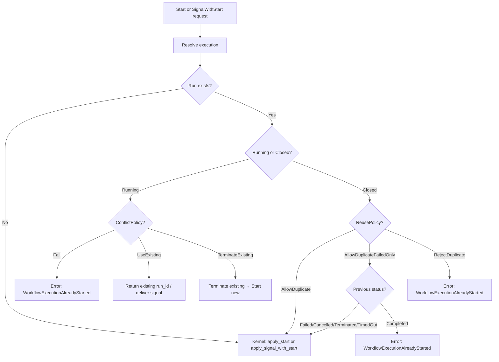

# Design Document: Atomic SignalWithStart and Workflow ID Conflict Resolution

## Overview

This design adds three capabilities to tokeira: an atomic signal-with-start kernel primitive, WorkflowIdConflictPolicy for running workflows, and WorkflowIdReusePolicy for closed workflows. The design is validated against the Temporal server implementation in `temporal-dsql/service/history/api/signalwithstartworkflow/` and `temporal-dsql/service/history/api/workflow_id_dedup.go`.

The work spans three layers:
- **Kernel** — new `apply_signal_with_start` method producing the 3-event transition
- **Runtime** — new conflict resolution logic that inspects the existing run's state and applies the appropriate policy before calling the kernel
- **Edge** — extract policies from proto requests, migrate deprecated enum values, delegate to runtime

## Architecture

### Conflict Resolution Flow



This matches the Temporal server's `ResolveDuplicateWorkflowID` function which branches on `currentState` (running vs completed) and then applies the appropriate policy.

### Design Decisions

1. **Conflict resolution lives in the runtime, not the kernel.** The kernel is pure — it doesn't know about "existing runs" or "policies." The runtime resolves the execution, inspects the state, applies the policy, and then calls the appropriate kernel command. This matches Temporal's architecture where the history engine handles resolution before calling mutable state methods.

2. **`apply_signal_with_start` only handles `LoadedRun::Absent`.** When the workflow exists and is running with `UseExisting`, the runtime routes through `apply_signal`. When `TerminateExisting`, the runtime terminates first, then starts fresh. The kernel method is focused on the novel case: absent → 3-event transition.

3. **Policy migration at the edge.** The deprecated `WORKFLOW_ID_REUSE_POLICY_TERMINATE_IF_RUNNING` is migrated to `ConflictPolicy::TerminateExisting` + `ReusePolicy::AllowDuplicate` at the edge layer, matching Temporal's `MigrateWorkflowIdReusePolicyForRunningWorkflow`.

4. **TerminateExisting is sequential orchestration, not atomic.** The runtime terminates the existing workflow (first commit, clears current-execution mapping), then starts the new workflow (second commit, recreates current-execution mapping). There is a real intermediate state where the workflow ID has no current run. The runtime does not return success until both commits complete. If the second commit fails, the termination stands and the caller receives an error. This matches the strongest guarantee the current storage surface can provide without a cross-run atomic primitive.

## Components and Interfaces

### 1. Kernel Layer

#### New Request Struct

```rust
pub struct SignalWithStartRequest {
    // All StartRequest fields
    pub run_key: RunKey,
    pub namespace_id: NamespaceId,
    pub workflow_id: WorkflowId,
    pub run_id: RunId,
    pub workflow_type: WorkflowType,
    pub task_queue: TaskQueueName,
    pub input: Payloads,
    pub memo: Memo,
    pub search_attributes: SearchAttributes,
    pub workflow_execution_timeout: Option<Duration>,
    pub workflow_run_timeout: Option<Duration>,
    pub workflow_task_timeout: Duration,
    pub retry_policy: Option<RetryPolicy>,
    pub deployment: Option<DeploymentId>,
    pub build_id: Option<BuildId>,
    pub attempt: u32,
    pub continued_execution_run_id: Option<RunId>,
    pub first_execution_run_id: Option<RunId>,
    pub parent_run_key: Option<RunKey>,
    pub parent_workflow_id: Option<WorkflowId>,
    pub first_run_started_at: Option<OffsetDateTime>,
    pub request: RequestContext,
    pub now: OffsetDateTime,
    // Signal fields
    pub signal_name: String,
    pub signal_input: Payloads,
}
```

#### `apply_signal_with_start` Method

Only handles `LoadedRun::Absent`. Produces:
1. `WorkflowExecutionStarted` (event_id=1)
2. `WorkflowExecutionSignaled` (event_id=2)  
3. `WorkflowTaskScheduled` (event_id=3)

The implementation reuses the same `WorkflowState` initialization as `apply_start`, then emits the signal event before scheduling the WFT.

### 2. Runtime Layer — Conflict Resolution

#### New Types

```rust
/// Policy for handling workflow ID conflicts with running workflows.
#[derive(Clone, Copy, Debug, PartialEq, Eq)]
pub enum WorkflowIdConflictPolicy {
    Fail,
    UseExisting,
    TerminateExisting,
}

/// Policy for handling workflow ID reuse with closed workflows.
#[derive(Clone, Copy, Debug, PartialEq, Eq)]
pub enum WorkflowIdReusePolicy {
    AllowDuplicate,
    AllowDuplicateFailedOnly,
    RejectDuplicate,
}

/// Outcome of conflict resolution.
enum ConflictResolution {
    /// No existing run — proceed with start.
    Absent,
    /// Existing run is running — use it (for UseExisting policy).
    UseExisting { run_key: RunKey, run_id: RunId },
    /// Existing run is running — terminate it first, then start new.
    TerminateAndStart { run_key: RunKey },
    /// Existing run is closed — allowed to start new run.
    ClosedAllowReuse,
    /// Conflict — return error to caller.
    Rejected { message: String },
}
```

#### Resolution Logic

The runtime's conflict resolution is a two-step process that matches the current storage contract:

1. **Resolve**: Call `repo.resolve_execution(ExecutionRef { namespace_id, workflow_id, run_id: None })` to get `Option<RunKey>`
2. **Load**: If a `RunKey` exists, call `repo.load_run(run_key)` to get `LoadedRun::Existing(state)` with the current `ExecutionStatus`

The resolution function then operates on the loaded state:

```rust
fn resolve_conflict(
    existing_status: Option<ExecutionStatus>,  // None = absent, Some = loaded state
    run_key: Option<RunKey>,
    run_id: Option<RunId>,
    conflict_policy: WorkflowIdConflictPolicy,
    reuse_policy: WorkflowIdReusePolicy,
) -> ConflictResolution {
    match existing_status {
        None => ConflictResolution::Absent,
        Some(status) if status.is_open() => {
            // Running workflow — apply ConflictPolicy
            match conflict_policy {
                WorkflowIdConflictPolicy::Fail => ConflictResolution::Rejected { ... },
                WorkflowIdConflictPolicy::UseExisting => ConflictResolution::UseExisting { run_key, run_id },
                WorkflowIdConflictPolicy::TerminateExisting => ConflictResolution::TerminateAndStart { run_key },
            }
        }
        Some(status) => {
            // Closed workflow — apply ReusePolicy
            match reuse_policy {
                WorkflowIdReusePolicy::AllowDuplicate => ConflictResolution::ClosedAllowReuse,
                WorkflowIdReusePolicy::AllowDuplicateFailedOnly => {
                    if is_failed_status(status) {
                        ConflictResolution::ClosedAllowReuse
                    } else {
                        ConflictResolution::Rejected { ... }
                    }
                }
                WorkflowIdReusePolicy::RejectDuplicate => ConflictResolution::Rejected { ... },
            }
        }
    }
}
```

This mirrors Temporal's `ResolveDuplicateWorkflowID` which branches on `currentState` (running vs completed) and then applies the policy-specific logic.

#### Runtime Methods

`start_workflow` and `signal_with_start_workflow` both use the two-step resolve → load → apply pattern:

```rust
pub async fn signal_with_start_workflow(&self, req: SignalWithStartRequest) -> Result<SignalWithStartResult> {
    // Step 1: Resolve execution to RunKey
    let maybe_run_key = self.repo.resolve_execution(&execution_ref).await?;

    // Step 2: Load state if run exists
    let (existing_status, run_key, run_id) = match maybe_run_key {
        Some(rk) => {
            let loaded = self.repo.load_run(rk).await?;
            match loaded {
                LoadedRun::Existing(state) => (Some(state.status), Some(rk), Some(state.run_id)),
                LoadedRun::Absent => (None, None, None),
            }
        }
        None => (None, None, None),
    };

    // Step 3: Apply conflict resolution
    let resolution = resolve_conflict(existing_status, run_key, run_id, req.conflict_policy, req.reuse_policy);

    match resolution {
        ConflictResolution::Absent | ConflictResolution::ClosedAllowReuse => {
            // Kernel: apply_signal_with_start → 3-event transition
            let transition = self.kernel.apply_signal_with_start(LoadedRun::Absent, req)?;
            self.commit(transition).await?;
            Ok(SignalWithStartResult::Started { run_id })
        }
        ConflictResolution::UseExisting { run_key, run_id } => {
            // Kernel: apply_signal → signal-only transition
            let loaded = self.repo.load_run(run_key).await?;
            let signal_req = extract_signal(&req);
            let transition = self.kernel.apply_signal(loaded, signal_req)?;
            self.commit(transition).await?;
            Ok(SignalWithStartResult::Signaled { run_id })
        }
        ConflictResolution::TerminateAndStart { run_key } => {
            // Two sequential commits:
            // 1. Terminate existing (clears current-execution mapping)
            // 2. Start new with signal (recreates current-execution mapping)
            // Return success only after both commits complete.
            self.terminate_and_start_with_signal(run_key, req).await
        }
        ConflictResolution::Rejected { message } => {
            Err(anyhow!("WorkflowExecutionAlreadyStarted: {}", message))
        }
    }
}
```

### 3. Edge Layer

#### Policy Extraction and Migration

```rust
fn extract_conflict_policy(proto_value: i32) -> WorkflowIdConflictPolicy {
    match WorkflowIdConflictPolicyProto::try_from(proto_value) {
        Ok(WorkflowIdConflictPolicyProto::Fail) => WorkflowIdConflictPolicy::Fail,
        Ok(WorkflowIdConflictPolicyProto::UseExisting) => WorkflowIdConflictPolicy::UseExisting,
        Ok(WorkflowIdConflictPolicyProto::TerminateExisting) => WorkflowIdConflictPolicy::TerminateExisting,
        _ => WorkflowIdConflictPolicy::Fail, // default
    }
}

fn migrate_reuse_policy(
    reuse: &mut WorkflowIdReusePolicy,
    conflict: &mut WorkflowIdConflictPolicy,
) {
    // Temporal migration: TERMINATE_IF_RUNNING → TerminateExisting + AllowDuplicate
    if *reuse == WorkflowIdReusePolicy::TerminateIfRunning {
        *conflict = WorkflowIdConflictPolicy::TerminateExisting;
        *reuse = WorkflowIdReusePolicy::AllowDuplicate;
    }
}
```

#### Updated StartRequest and SignalWithStartRequest

Both carry the policies:

```rust
pub struct StartRequest {
    // ... existing fields ...
    pub conflict_policy: WorkflowIdConflictPolicy,
    pub reuse_policy: WorkflowIdReusePolicy,
}
```

## Data Models

No new persistent data models. The policies are transient request fields. The `ConflictResolution` enum is internal to the runtime.

### State Transitions

| Existing State | ConflictPolicy | ReusePolicy | Action |
|---|---|---|---|
| Absent | — | — | Start (or SignalWithStart) |
| Running | Fail | — | Error |
| Running | UseExisting | — | Return existing / deliver signal |
| Running | TerminateExisting | — | Terminate → Start new |
| Closed (Completed) | — | AllowDuplicate | Start new |
| Closed (Completed) | — | AllowDuplicateFailedOnly | Error |
| Closed (Completed) | — | RejectDuplicate | Error |
| Closed (Failed/Cancelled/Terminated/TimedOut) | — | AllowDuplicate | Start new |
| Closed (Failed/Cancelled/Terminated/TimedOut) | — | AllowDuplicateFailedOnly | Start new |
| Closed (Failed/Cancelled/Terminated/TimedOut) | — | RejectDuplicate | Error |

## Correctness Properties

### Property 1: Three-event history structure

*For any* valid `SignalWithStartRequest` applied to `LoadedRun::Absent`, the kernel produces exactly three events: `Started(1) → Signaled(2) → WFTScheduled(3)`.

**Validates: Requirements 1.2, 5.1**

### Property 2: Field pass-through

*For any* valid `SignalWithStartRequest`, the `WorkflowExecutionSignaled` event contains the exact `signal_name` and `signal_input` from the request, and `WorkflowExecutionStarted` contains the exact `workflow_type`, `task_queue`, and `input`. Signal header fidelity is deferred.

**Validates: Requirements 5.2, 5.3**

### Property 3: Conflict resolution correctness

*For any* combination of `(ExecutionStatus, ConflictPolicy, ReusePolicy)`, `resolve_conflict` returns the correct `ConflictResolution` variant matching the state transition table above.

**Validates: Requirements 2.1–2.7, 3.1–3.6**

### Property 4: Policy migration

*For any* proto request with `WORKFLOW_ID_REUSE_POLICY_TERMINATE_IF_RUNNING`, the migration produces `ConflictPolicy::TerminateExisting` and `ReusePolicy::AllowDuplicate`.

**Validates: Requirements 4.2**

## Error Handling

| Scenario | Error |
|---|---|
| Running workflow + Fail policy | `WorkflowExecutionAlreadyStarted` (gRPC `ALREADY_EXISTS`) |
| Closed completed + AllowDuplicateFailedOnly | `WorkflowExecutionAlreadyStarted` |
| Closed any + RejectDuplicate | `WorkflowExecutionAlreadyStarted` |
| OCC conflict on commit | Lane retries via existing OCC loop |
| Terminate fails | Propagate error, don't start new workflow |

New `EdgeError` variant: `WorkflowExecutionAlreadyStarted { workflow_id, run_id }` → `Status::already_exists`.

## Testing Strategy

### Property-based tests (proptest, 100 iterations)

1. **Property 1** — Generate random `SignalWithStartRequest`, apply to `Absent`, verify 3 events with correct kinds and IDs
2. **Property 2** — Same generation, verify event fields match request fields
3. **Property 3** — Generate random `(ExecutionStatus, ConflictPolicy, ReusePolicy)` tuples, verify `resolve_conflict` output matches the state table
4. **Property 4** — Generate random proto policy values including deprecated ones, verify migration

### Golden tests

- Absent + SignalWithStart → 3 events
- Running + Fail → error
- Running + UseExisting → existing run_id
- Running + TerminateExisting → terminate + new run
- Closed Completed + AllowDuplicate → new run
- Closed Completed + AllowDuplicateFailedOnly → error
- Closed Failed + AllowDuplicateFailedOnly → new run
- Closed + RejectDuplicate → error

### Integration tests

- Full signal-with-start flow through runtime with in-memory storage
- TerminateExisting flow: verify old run is terminated, new run has signal
