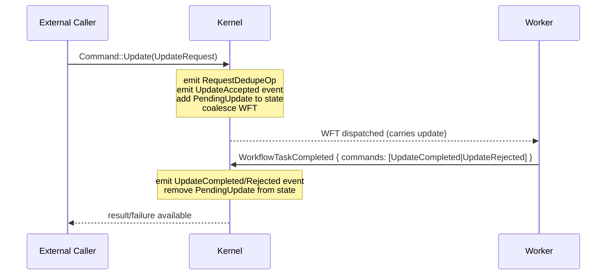

# Design: Kernel Updates (Feature 7)

## Overview

This design adds Temporal's Update feature to `tokeira-kernel`. Updates are synchronous, tracked write requests that span two transitions: acceptance (external caller sends update) and completion/rejection (worker processes update within a WFT). The kernel tracks pending updates in `WorkflowState` and clears them on close, following the same discard-on-close pattern as `pending_external_signals` and `pending_external_cancels`.

The change surface is deliberately narrow: new struct/enum variants, one new top-level command handler (`apply_update`), three new `apply_workflow_command` match arms, and a one-line addition to `TransitionBuilder::close()`.

## Architecture

The Update feature follows the existing kernel architecture exactly. No new architectural patterns are introduced.



Two-phase lifecycle:
1. **Acceptance** — `Command::Update` (top-level, external). Same pattern as `Signal`: `expect_open` → emit dedup → emit event → add to pending → coalesce WFT → `finish`.
2. **Completion/Rejection** — `WorkflowCommand::UpdateCompleted` or `WorkflowCommand::UpdateRejected` (within WFT completion). Same pattern as other workflow commands: look up in pending map → emit event → remove from pending → return `false`.

`ProtocolMessage` is a no-op sequencing directive: return `false`, no event, no state change.

## Components and Interfaces

### New Types

**`state.rs` — `PendingUpdate`:**
```rust
#[derive(Clone, Debug, PartialEq)]
pub struct PendingUpdate {
    pub update_id: String,
    pub accepted_event_id: i64,
    pub name: String,
}
```

**`command.rs` — `UpdateRequest`:**
```rust
#[derive(Clone, Debug, PartialEq)]
pub struct UpdateRequest {
    pub update_id: String,
    pub update_name: String,
    pub input: Payloads,
    pub request: RequestContext,
    pub now: OffsetDateTime,
}
```

### Enum Variant Additions

**`Command`** gains:
```rust
Update(UpdateRequest),
```

**`WorkflowCommand`** gains:
```rust
UpdateCompleted { update_id: String, result: Payloads },
UpdateRejected { update_id: String, failure: String },
ProtocolMessage { message_id: String, body: UpdateProtocolBody },
```

**New enum — `UpdateProtocolBody`:**
```rust
#[derive(Clone, Debug, PartialEq)]
pub enum UpdateProtocolBody {
    Accepted { update_id: String, update_name: String, input: Payloads },
    Completed { update_id: String, result: Payloads },
    Rejected { update_id: String, failure: String },
}
```

**`HistoryEventKind`** gains:
```rust
WorkflowExecutionUpdateAccepted { update_id: String, update_name: String, input: Payloads },
WorkflowExecutionUpdateCompleted { update_id: String, result: Payloads },
WorkflowExecutionUpdateRejected { update_id: String, failure: String },
```

**`Reject`** gains:
```rust
#[error("unknown update: {0}")]
UnknownUpdate(String),
#[error("duplicate update id: {0}")]
DuplicateUpdateId(String),
```

### `WorkflowState` Change

Add field after `pending_external_cancels`:
```rust
pub pending_updates: BTreeMap<String, PendingUpdate>,
```

### Kernel Logic

**`BasicKernel::apply`** — new match arm:
```rust
Command::Update(req) => self.apply_update(loaded, req),
```

**`apply_update`** — follows Signal pattern exactly:
```rust
fn apply_update(&self, loaded: LoadedRun, req: UpdateRequest) -> Result<Transition, Reject> {
    let state = expect_open(loaded)?;
    if state.pending_updates.contains_key(&req.update_id) {
        return Err(Reject::DuplicateUpdateId(req.update_id));
    }
    let mut builder = TransitionBuilder::new(state, req.now);
    builder.request_dedupe_ops.push(RequestDedupeOp {
        request_id: req.request.request_id.clone(),
    });
    let accepted_event_id = builder.emit(HistoryEventKind::WorkflowExecutionUpdateAccepted {
        update_id: req.update_id.clone(),
        update_name: req.update_name.clone(),
        input: req.input,
    });
    builder.state.pending_updates.insert(
        req.update_id.clone(),
        PendingUpdate {
            update_id: req.update_id,
            accepted_event_id,
            name: req.update_name,
        },
    );
    if builder.state.pending_workflow_task.is_none() {
        builder.schedule_workflow_task();
    }
    Ok(builder.finish())
}
```

**`apply_workflow_command`** — three new match arms:
```rust
WorkflowCommand::UpdateCompleted { update_id, result } => {
    if !builder.state.pending_updates.contains_key(&update_id) {
        return Err(Reject::UnknownUpdate(update_id));
    }
    builder.emit(HistoryEventKind::WorkflowExecutionUpdateCompleted {
        update_id: update_id.clone(),
        result,
    });
    builder.state.pending_updates.remove(&update_id);
    Ok(false)
}
WorkflowCommand::UpdateRejected { update_id, failure } => {
    if !builder.state.pending_updates.contains_key(&update_id) {
        return Err(Reject::UnknownUpdate(update_id));
    }
    builder.emit(HistoryEventKind::WorkflowExecutionUpdateRejected {
        update_id: update_id.clone(),
        failure,
    });
    builder.state.pending_updates.remove(&update_id);
    Ok(false)
}
WorkflowCommand::ProtocolMessage { message_id: _, body } => {
    match body {
        UpdateProtocolBody::Accepted { update_id, update_name, input } => {
            if builder.state.pending_updates.contains_key(&update_id) {
                return Err(Reject::DuplicateUpdateId(update_id));
            }
            let accepted_event_id = builder.emit(HistoryEventKind::WorkflowExecutionUpdateAccepted {
                update_id: update_id.clone(),
                update_name: update_name.clone(),
                input,
            });
            builder.state.pending_updates.insert(
                update_id.clone(),
                PendingUpdate { update_id, accepted_event_id, name: update_name },
            );
        }
        UpdateProtocolBody::Completed { update_id, result } => {
            if !builder.state.pending_updates.contains_key(&update_id) {
                return Err(Reject::UnknownUpdate(update_id));
            }
            builder.emit(HistoryEventKind::WorkflowExecutionUpdateCompleted {
                update_id: update_id.clone(), result,
            });
            builder.state.pending_updates.remove(&update_id);
        }
        UpdateProtocolBody::Rejected { update_id, failure } => {
            if !builder.state.pending_updates.contains_key(&update_id) {
                return Err(Reject::UnknownUpdate(update_id));
            }
            builder.emit(HistoryEventKind::WorkflowExecutionUpdateRejected {
                update_id: update_id.clone(), failure,
            });
            builder.state.pending_updates.remove(&update_id);
        }
    }
    Ok(false)
}
```

This means ProtocolMessage is the primary mechanism for update event emission within a WFT completion. The `UpdateCompleted` and `UpdateRejected` standalone workflow commands remain as a simpler alternative for cases where ordering relative to other commands doesn't matter. Both paths produce the same events and state changes.

**`TransitionBuilder::close`** — add one line:
```rust
self.state.pending_updates.clear();
```

**`apply_start`** — `WorkflowState` initializer gains:
```rust
pending_updates: BTreeMap::new(),
```

### Downstream Breakage

All exhaustive `match` arms on `Command`, `WorkflowCommand`, `HistoryEventKind`, and `Reject` must add the new variants. `WorkflowState` construction sites must include `pending_updates`. The `close()` change is in `TransitionBuilder` only.

## Data Models

No new storage tables. `PendingUpdate` is part of `WorkflowState` which is already persisted as a full-state replacement per transition. The `pending_updates` map is keyed by `update_id: String` and contains `PendingUpdate { update_id, accepted_event_id, name }`.

Lifecycle:
- **Created**: when `Command::Update` succeeds (acceptance transition)
- **Removed**: when `WorkflowCommand::UpdateCompleted` or `WorkflowCommand::UpdateRejected` succeeds (completion transition)
- **Cleared**: when any close path executes (`TransitionBuilder::close`)


## Correctness Properties

*A property is a characteristic or behavior that should hold true across all valid executions of a system — essentially, a formal statement about what the system should do. Properties serve as the bridge between human-readable specifications and machine-verifiable correctness guarantees.*

### Property 1: Start initializes pending_updates to empty

*For any* valid `StartRequest`, the resulting `next_state.pending_updates` shall be an empty map.

**Validates: Requirements 1.2.2, 9.1.2**

### Property 2: Update acceptance produces correct event, dedup op, and pending entry

*For any* valid `UpdateRequest` against an open run, the transition shall: (a) contain exactly one `RequestDedupeOp` matching the request ID, (b) contain a `WorkflowExecutionUpdateAccepted` event with the correct `update_id`, `update_name`, and `input`, and (c) `next_state.pending_updates` shall contain an entry keyed by `update_id` with `accepted_event_id` equal to the emitted event's ID and `name` equal to `update_name`.

**Validates: Requirements 2.1.1, 2.1.2, 2.1.3, 8.4.1, 8.6.1**

### Property 3: Update WFT coalescing

*For any* valid `UpdateRequest` against an open run, if `pending_workflow_task` is `None` before the command, then `next_state.pending_workflow_task` shall be `Some` and the transition shall contain a `DispatchOp::EnqueueWorkflowTask`. If `pending_workflow_task` is `Some` before the command, then no `DispatchOp::EnqueueWorkflowTask` shall be emitted and the existing pending WFT shall be preserved.

**Validates: Requirements 2.1.4, 2.1.5, 8.3.1, 8.3.2**

### Property 4: UpdateCompleted removes pending update and emits correct event

*For any* open run with at least one pending update, issuing `WorkflowCommand::UpdateCompleted` for that `update_id` within a valid `WorkflowTaskCompleted` shall: (a) emit a `WorkflowExecutionUpdateCompleted` event with the correct `update_id` and `result`, (b) remove the entry from `next_state.pending_updates`, and (c) leave the run open (not closed).

**Validates: Requirements 3.1.1, 3.1.2, 3.1.3, 8.4.2**

### Property 5: UpdateRejected removes pending update and emits correct event

*For any* open run with at least one pending update, issuing `WorkflowCommand::UpdateRejected` for that `update_id` within a valid `WorkflowTaskCompleted` shall: (a) emit a `WorkflowExecutionUpdateRejected` event with the correct `update_id` and `failure`, (b) remove the entry from `next_state.pending_updates`, and (c) leave the run open (not closed).

**Validates: Requirements 4.1.1, 4.1.2, 4.1.3, 8.4.3**

### Property 6: ProtocolMessage emits the correct event based on body variant

*For any* `WorkflowCommand::ProtocolMessage` within a valid `WorkflowTaskCompleted`: if the body is `Accepted`, the kernel shall emit `WorkflowExecutionUpdateAccepted` and add a `PendingUpdate`; if the body is `Completed`, the kernel shall emit `WorkflowExecutionUpdateCompleted` and remove the pending entry; if the body is `Rejected`, the kernel shall emit `WorkflowExecutionUpdateRejected` and remove the pending entry. In all cases, the run shall not be closed.

**Validates: Requirements 5.1.6, 5.1.7, 5.1.8, 5.1.9, 5.1.10**

### Property 7: Close clears pending_updates with no dispatch ops for cleared entries

*For any* transition that closes a run (Terminate, WorkflowExecutionTimedOut, CompleteWorkflow, FailWorkflow, CancelWorkflow, ContinueAsNew), `next_state.pending_updates` shall be empty regardless of how many pending updates existed before the close. No `DispatchOp` shall reference any cleared update entry.

**Validates: Requirements 7.1.1, 7.1.2, 7.1.3, 7.1.4, 7.1.5, 7.1.6, 7.1.7, 8.5.1, 9.1.3**

### Property 8: Existing structural invariants hold for update transitions

*For any* successful transition involving Update commands (top-level or workflow), the existing structural invariants shall hold: (a) event IDs are contiguous starting from `last_event_id + 1`, (b) `next_state.transition_seq == expected_seq + 1`, (c) at most one `PendingWorkflowTask` in `next_state`, (d) workflow commands (UpdateCompleted, UpdateRejected, ProtocolMessage) produce zero `RequestDedupeOps`.

**Validates: Requirements 8.1.1, 8.1.2, 8.1.3, 8.2.1, 8.3.1, 8.6.2**

## Error Handling

| Scenario | Reject variant | Notes |
|---|---|---|
| Update against `LoadedRun::Absent` | `MissingRun` | Same as Signal/Cancel |
| Update against closed run | `RunClosed(status)` | Same as Signal/Cancel |
| Update with duplicate update_id | `DuplicateUpdateId(update_id)` | New variant |
| UpdateCompleted with unknown `update_id` | `UnknownUpdate(update_id)` | New variant |
| UpdateRejected with unknown `update_id` | `UnknownUpdate(update_id)` | New variant |
| Workflow command after close in same WFT | `CommandsAfterClose { index }` | Existing — applies if UpdateCompleted/Rejected follows a close command |

No new error handling patterns. All rejection paths use existing `expect_open` or explicit map lookup, consistent with how `UnknownActivity`, `UnknownTimer`, etc. work.

## Testing Strategy

Tests extend the existing `golden_tests.rs` and `property_tests.rs` files. No new test files.

### Golden Tests (in `golden_tests.rs`)

Individual `#[test]` functions covering:

1. `update_with_no_pending_wft` — Update against open state, no WFT pending. Assert: UpdateAccepted event, WFT scheduled, dedup op, PendingUpdate in state.
2. `update_with_pending_wft` — Update against open state with existing WFT. Assert: UpdateAccepted event, no new WFT, dedup op, PendingUpdate in state.
3. `update_rejected_missing_run` — Update against `LoadedRun::Absent`. Assert: `Reject::MissingRun`.
4. `update_rejected_closed_run` — Update against closed state. Assert: `Reject::RunClosed`.
5. `update_completed_happy_path` — WFT completion with `UpdateCompleted` for a known pending update. Assert: UpdateCompleted event, update removed from pending, run still open.
6. `update_rejected_happy_path` — WFT completion with `UpdateRejected` for a known pending update. Assert: UpdateRejected event, update removed from pending, run still open.
7. `update_completed_unknown_update` — WFT completion with `UpdateCompleted` for unknown update_id. Assert: `Reject::UnknownUpdate`.
8. `update_rejected_unknown_update` — WFT completion with `UpdateRejected` for unknown update_id. Assert: `Reject::UnknownUpdate`.
9. `protocol_message_is_noop` — WFT completion with `ProtocolMessage`. Assert: no extra events, run still open.
10. `terminate_clears_pending_updates` — Terminate with pending updates in state. Assert: `next_state.pending_updates` is empty.
11. `complete_workflow_clears_pending_updates` — CompleteWorkflow with pending updates. Assert: `next_state.pending_updates` is empty.

### Property Tests (in `property_tests.rs`)

Uses `proptest` crate with `proptest! { }` block style. Minimum 100 iterations per property (proptest default is 256).

Each property test is tagged with a comment: `// Feature: kernel-updates, Property N: <title>`

New arbitrary strategies needed:
- `arb_update_request(now)` — generates random `UpdateRequest`
- `arb_update_completed_command()` — generates random `UpdateCompleted` workflow command
- `arb_update_rejected_command()` — generates random `UpdateRejected` workflow command
- `with_pending_update(state, update_id)` — helper to add a `PendingUpdate` to state

The existing `arb_valid_pair` strategy must be extended to include:
- `Command::Update` against open state (with and without pending WFT)
- `WorkflowTaskCompleted` containing `UpdateCompleted`, `UpdateRejected`, and `ProtocolMessage` commands

This ensures the existing structural property tests (event ID contiguity, transition_seq increment, at-most-one-WFT, dedup boundary) automatically cover update transitions.

Property tests to implement (one `proptest!` test per property):
1. Property 1 — already covered by existing `property_1_start_field_pass_through`, just needs assertion on `pending_updates`.
2. Property 2 — new test: generate random `UpdateRequest`, apply, assert event + dedup + pending entry.
3. Property 3 — new test: generate random `UpdateRequest` against states with/without WFT, assert coalescing.
4. Property 4 — new test: generate random `UpdateCompleted` against state with pending update, assert event + removal + open.
5. Property 5 — new test: generate random `UpdateRejected` against state with pending update, assert event + removal + open.
6. Property 6 — new test: generate `ProtocolMessage` in WFT completion, assert no extra events.
7. Property 7 — covered by extending existing close property tests to include states with `pending_updates`.
8. Property 8 — covered by extending `arb_valid_pair` with Update variants.
