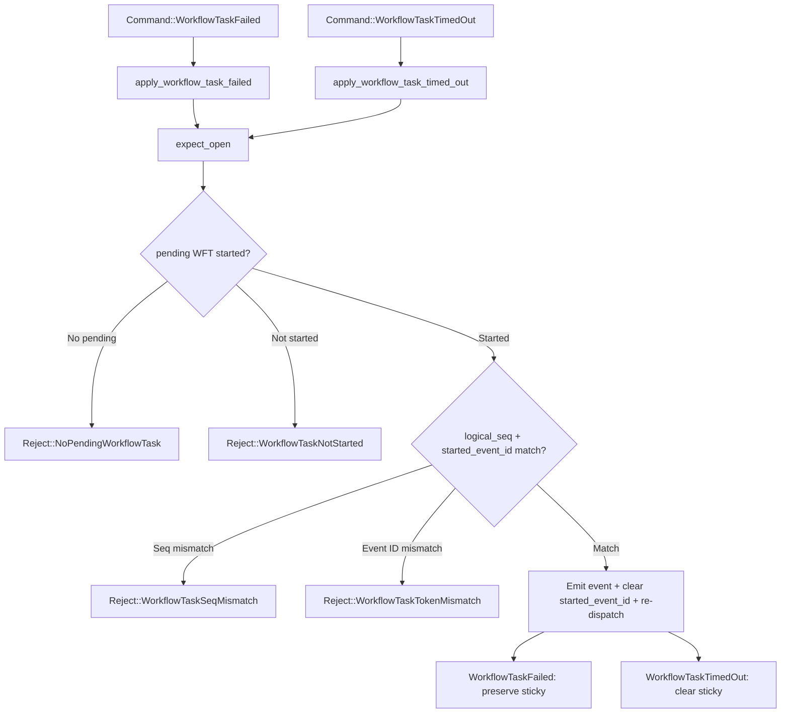

# Design Document: WFT Failure and Timeout Recovery (Feature 2)

## Overview

This feature adds two new kernel commands — `WorkflowTaskFailed` and `WorkflowTaskTimedOut` — to the `tokeira-kernel` crate. Both commands handle WFT recovery: they require an open run with a started pending WFT, emit one history event, clear `started_event_id` (reverting the WFT to scheduled-but-not-started), and re-dispatch the WFT for retry.

The key behavioral difference: `WorkflowTaskTimedOut` clears `StickyAffinity` (the worker is presumed dead), while `WorkflowTaskFailed` preserves it (the worker is still reachable, the task just produced bad output).

Neither command is terminal for the workflow. Both are internal runtime machinery and carry no request dedup.

## Architecture

The changes are purely additive to the existing kernel state machine. No existing code paths change.



Both methods follow the same pattern as existing `apply_*` methods:
1. Call `expect_open` to validate the run exists and is open
2. Validate a pending WFT exists and has been started
3. Validate `logical_seq` matches the pending WFT (fence against stale reports)
4. Validate `started_event_id` matches the pending WFT (fence against stale reports)
5. Construct a `TransitionBuilder`
6. Emit the appropriate history event
7. Clear `started_event_id` on the pending WFT
8. (Timeout only) Clear `sticky` on state
9. Push `DispatchOp::EnqueueWorkflowTask` for re-dispatch
10. Call `finish()`

## Components and Interfaces

### New Domain Enums

```rust
// command.rs (or a dedicated types module within tokeira-kernel)

#[derive(Clone, Debug, PartialEq)]
pub enum WorkflowTaskFailedCause {
    NonDeterminismError,
    BadScheduleActivityAttributes,
    BadStartTimerAttributes,
    UnhandledCommand,
    BadRequestCancelActivityAttributes,
    WorkflowWorkerUnhandledFailure,
    BadSignalWorkflowExecutionAttributes,
}

#[derive(Clone, Debug, PartialEq)]
pub enum WorkflowTaskTimeoutType {
    StartToClose,
}
```

### New Request Structs

```rust
// command.rs
pub struct WorkflowTaskFailedRequest {
    pub logical_seq: LogicalTaskSeq,
    pub started_event_id: i64,
    pub failure_cause: WorkflowTaskFailedCause,
    pub failure_details: Option<Payload>,
    pub worker_identity: WorkerIdentity,
    pub now: OffsetDateTime,
}

pub struct WorkflowTaskTimedOutRequest {
    pub logical_seq: LogicalTaskSeq,
    pub started_event_id: i64,
    pub timeout_type: WorkflowTaskTimeoutType,
    pub now: OffsetDateTime,
}
```

The `logical_seq` and `started_event_id` fields fence both commands against stale reports. The kernel validates that these match the current pending WFT before acting, using the same `WorkflowTaskSeqMismatch` and `WorkflowTaskTokenMismatch` rejections as `WorkflowTaskCompleted`.

### New Command Variants

```rust
// command.rs — add to existing Command enum
pub enum Command {
    // ... existing variants ...
    WorkflowTaskFailed(WorkflowTaskFailedRequest),
    WorkflowTaskTimedOut(WorkflowTaskTimedOutRequest),
}
```

### New HistoryEventKind Variants

```rust
// event.rs — add to existing HistoryEventKind enum
WorkflowTaskFailed {
    logical_seq: LogicalTaskSeq,
    scheduled_event_id: i64,
    started_event_id: i64,
    failure_cause: WorkflowTaskFailedCause,
    failure_details: Option<Payload>,
    identity: WorkerIdentity,
},
WorkflowTaskTimedOut {
    logical_seq: LogicalTaskSeq,
    scheduled_event_id: i64,
    started_event_id: i64,
    timeout_type: WorkflowTaskTimeoutType,
},
```

### New Kernel Methods

```rust
// kernel.rs — add to BasicKernel impl
fn apply_workflow_task_failed(
    &self, loaded: LoadedRun, req: WorkflowTaskFailedRequest
) -> Result<Transition, Reject>;

fn apply_workflow_task_timed_out(
    &self, loaded: LoadedRun, req: WorkflowTaskTimedOutRequest
) -> Result<Transition, Reject>;
```

### Routing in `BasicKernel::apply`

Two new match arms in the existing `apply` method:

```rust
Command::WorkflowTaskFailed(req) => self.apply_workflow_task_failed(loaded, req),
Command::WorkflowTaskTimedOut(req) => self.apply_workflow_task_timed_out(loaded, req),
```

### Rejection Paths

Both commands reuse existing `Reject` variants — no new variants needed:
- `Reject::MissingRun` — `LoadedRun::Absent`
- `Reject::RunClosed` — closed run
- `Reject::NoPendingWorkflowTask` — no pending WFT
- `Reject::WorkflowTaskNotStarted` — pending WFT has no `started_event_id`
- `Reject::WorkflowTaskSeqMismatch` — request `logical_seq` does not match pending WFT
- `Reject::WorkflowTaskTokenMismatch` — request `started_event_id` does not match pending WFT
- `Reject::RunClosed` — closed run
- `Reject::NoPendingWorkflowTask` — no pending WFT
- `Reject::WorkflowTaskNotStarted` — pending WFT has no `started_event_id`

## Data Models

No new data model types are introduced. The feature adds variants to existing enums (`Command`, `HistoryEventKind`) and adds two new request structs. `WorkflowState`, `PendingWorkflowTask`, `Transition`, and all other state types remain unchanged.

### State Mutations Summary

| Field | WorkflowTaskFailed | WorkflowTaskTimedOut |
|---|---|---|
| `pending_workflow_task.started_event_id` | Set to `None` | Set to `None` |
| `pending_workflow_task.logical_seq` | Preserved | Preserved |
| `pending_workflow_task.scheduled_event_id` | Preserved | Preserved |
| `sticky` | Preserved | Set to `None` |
| `status` | Unchanged (Running) | Unchanged (Running) |
| `last_event_id` | +1 | +1 |
| `transition_seq` | +1 | +1 |

### Transition Side Effects Summary

| Side Effect | WorkflowTaskFailed | WorkflowTaskTimedOut |
|---|---|---|
| `history_events` | 1 (WorkflowTaskFailed) | 1 (WorkflowTaskTimedOut) |
| `dispatch_ops` | 1 (EnqueueWorkflowTask) | 1 (EnqueueWorkflowTask) |
| `request_dedupe_ops` | 0 | 0 |
| `activity_ops` | 0 | 0 |
| `timer_ops` | 0 | 0 |
| `projection_ops` | 0 | 0 |


## Correctness Properties

*A property is a characteristic or behavior that should hold true across all valid executions of a system — essentially, a formal statement about what the system should do. Properties serve as the bridge between human-readable specifications and machine-verifiable correctness guarantees.*

### Property 1: WFT Failed event field pass-through

*For any* valid open WorkflowState with a started pending WFT and *for any* valid WorkflowTaskFailedRequest, when WorkflowTaskFailed is applied, the single emitted WorkflowTaskFailed event SHALL carry: the pending WFT's `logical_seq`, `scheduled_event_id`, and `started_event_id` from state; and the request's `failure_cause`, `failure_details`, and `worker_identity`.

**Validates: Requirements 2.1.1**

### Property 2: WFT TimedOut event field pass-through

*For any* valid open WorkflowState with a started pending WFT and *for any* valid WorkflowTaskTimedOutRequest, when WorkflowTaskTimedOut is applied, the single emitted WorkflowTaskTimedOut event SHALL carry: the pending WFT's `logical_seq`, `scheduled_event_id`, and `started_event_id` from state; and the request's `timeout_type`.

**Validates: Requirements 3.1.1**

### Property 3: Both commands preserve pending WFT identity

*For any* valid open WorkflowState with a started pending WFT and *for any* valid WorkflowTaskFailed or WorkflowTaskTimedOut request, after applying the command: `next_state.pending_workflow_task` SHALL be `Some`, its `logical_seq` and `scheduled_event_id` SHALL equal the input state's values, and its `started_event_id` SHALL be `None`.

**Validates: Requirements 2.1.2, 2.1.3, 3.1.2, 3.1.3, 4.1.1, 4.1.2, 4.1.3, 4.1.4, 7.1.1**

### Property 4: WFT Failed preserves sticky affinity and dispatch carries sticky_preferred

*For any* valid open WorkflowState with a started pending WFT and optional StickyAffinity, and *for any* valid WorkflowTaskFailedRequest, after applying WorkflowTaskFailed: `next_state.sticky` SHALL equal the input state's `sticky`, and the single `DispatchOp::EnqueueWorkflowTask` SHALL carry `sticky_preferred` matching the input state's sticky worker identity (or `None` if no sticky was set).

**Validates: Requirements 2.1.5, 4.2.1, 4.2.2, 7.3.1**

### Property 5: WFT TimedOut clears sticky affinity and dispatch carries no sticky

*For any* valid open WorkflowState with a started pending WFT (with or without StickyAffinity), and *for any* valid WorkflowTaskTimedOutRequest, after applying WorkflowTaskTimedOut: `next_state.sticky` SHALL be `None`, and the single `DispatchOp::EnqueueWorkflowTask` SHALL carry `sticky_preferred` as `None`.

**Validates: Requirements 3.1.4, 3.1.5, 4.2.3, 4.2.4, 7.2.1**

### Property 6: Both commands produce minimal side effects

*For any* valid WorkflowTaskFailed or WorkflowTaskTimedOut transition: `history_events` SHALL contain exactly one event (of the matching kind), `dispatch_ops` SHALL contain exactly one `EnqueueWorkflowTask` carrying the pending WFT's `logical_seq` and a `QueueKey` with the run's `task_queue` and `namespace_id`, `request_dedupe_ops` SHALL be empty, `activity_ops` SHALL be empty, `timer_ops` SHALL be empty, `projection_ops` SHALL be empty, and `next_state.status` SHALL remain `Running`.

**Validates: Requirements 2.1.4, 2.1.6, 2.1.7, 2.1.8, 3.1.5, 3.1.6, 3.1.7, 3.1.8, 4.3.1, 4.3.2, 4.3.3, 4.3.4, 5.3.3, 5.4.1, 5.4.2, 5.4.3, 5.4.4, 5.4.5, 5.4.6, 5.4.7, 5.4.8, 7.4.1, 7.4.2, 7.5.1, 7.5.2**

### Property 7: Structural invariants hold for new commands (via arb_valid_pair extension)

*For any* valid WorkflowTaskFailed or WorkflowTaskTimedOut transition (generated by extending `arb_valid_pair()`), the existing structural invariant properties SHALL hold: event IDs are contiguous from `last_event_id + 1` (Property 4), `transition_seq` increments exactly once (Property 5), closed workflows have no pending WFT or dispatch (Property 7), `last_event_id` equals the last emitted event's ID (Property 8), activity/timer ops are consistent with state (Property 9), and request dedup ops are empty for internal commands (Property 10).

**Validates: Requirements 5.1.1, 5.1.2, 5.1.3, 5.2.1, 5.2.2, 5.3.1, 5.3.2, 7.6.1, 7.6.2, 7.6.3, 7.6.4**

## Error Handling

Both commands reuse the existing rejection infrastructure. No new `Reject` variants are needed.

| Condition | Reject Variant | Applies To |
|---|---|---|
| `LoadedRun::Absent` | `MissingRun` | Both |
| Run is closed | `RunClosed(status)` | Both |
| No pending WFT | `NoPendingWorkflowTask` | Both |
| Pending WFT not started | `WorkflowTaskNotStarted { logical_seq }` | Both |

The rejection checks happen in order: `expect_open` first (handles MissingRun and RunClosed), then pending WFT existence, then started_event_id presence. This matches the existing pattern used by `apply_workflow_task_completed`.

## Testing Strategy

### Property-Based Tests (proptest)

The project already uses `proptest` for property-based testing in `tests/property_tests.rs`. The new properties extend the existing test infrastructure.

**Generator extension:** Add two new arms to `arb_valid_pair()`:
- `WorkflowTaskFailed`: generate a random `WorkflowTaskFailedRequest` against a state with a started pending WFT (with optional sticky affinity)
- `WorkflowTaskTimedOut`: generate a random `WorkflowTaskTimedOutRequest` against a state with a started pending WFT (with optional sticky affinity)

This automatically extends existing properties 4, 5, 7, 8, 9, 10 to cover the new commands (Property 7).

**New property tests (6 tests):**
- `property_11_wft_failed_event_field_pass_through` — Feature: kernel-wft-failure-timeout, Property 1: WFT Failed event field pass-through
- `property_12_wft_timed_out_event_field_pass_through` — Feature: kernel-wft-failure-timeout, Property 2: WFT TimedOut event field pass-through
- `property_13_failure_timeout_preserve_pending_wft_identity` — Feature: kernel-wft-failure-timeout, Property 3: Both commands preserve pending WFT identity
- `property_14_wft_failed_preserves_sticky` — Feature: kernel-wft-failure-timeout, Property 4: WFT Failed preserves sticky affinity
- `property_15_wft_timed_out_clears_sticky` — Feature: kernel-wft-failure-timeout, Property 5: WFT TimedOut clears sticky affinity
- `property_16_failure_timeout_minimal_side_effects` — Feature: kernel-wft-failure-timeout, Property 6: Both commands produce minimal side effects

Each property test runs a minimum of 100 iterations (proptest default is 256).

**New generators needed:**
- `arb_wft_failed_request(logical_seq, started_event_id)` — generates random `WorkflowTaskFailedCause` variant, optional failure_details, worker_identity; fencing fields passed in to match state
- `arb_wft_timed_out_request(logical_seq, started_event_id)` — generates `WorkflowTaskTimeoutType::StartToClose`; fencing fields passed in to match state
- `arb_sticky_affinity()` — generates optional `StickyAffinity` for state setup (or reuse existing patterns)

### Golden Tests

Individual `#[test]` functions in `tests/golden_tests.rs`. Each test constructs a specific input state, applies the command, and asserts the exact transition output.

**Happy path tests (4 tests):**
- `wft_failed_with_started_wft` — WorkflowTaskFailed on started WFT with sticky affinity (Req 8.1)
- `wft_timed_out_with_started_wft` — WorkflowTaskTimedOut on started WFT with sticky affinity (Req 8.2)
- `wft_failed_no_sticky` — WorkflowTaskFailed with no sticky affinity (Req 8.3)
- `wft_timed_out_no_sticky` — WorkflowTaskTimedOut with no sticky affinity (Req 8.4)

**Rejection path tests (8 tests):**
- `reject_wft_failed_absent_run` — MissingRun (Req 8.5.1)
- `reject_wft_failed_closed_run` — RunClosed (Req 8.5.2)
- `reject_wft_failed_no_pending` — NoPendingWorkflowTask (Req 8.5.3)
- `reject_wft_failed_not_started` — WorkflowTaskNotStarted (Req 8.5.4)
- `reject_wft_timed_out_absent_run` — MissingRun (Req 8.6.1)
- `reject_wft_timed_out_closed_run` — RunClosed (Req 8.6.2)
- `reject_wft_timed_out_no_pending` — NoPendingWorkflowTask (Req 8.6.3)
- `reject_wft_timed_out_not_started` — WorkflowTaskNotStarted (Req 8.6.4)

### Test File Organization

All tests extend existing files:
- Property tests → `tokeira/crates/tokeira-kernel/tests/property_tests.rs`
- Golden tests → `tokeira/crates/tokeira-kernel/tests/golden_tests.rs`

No new test files are created.
