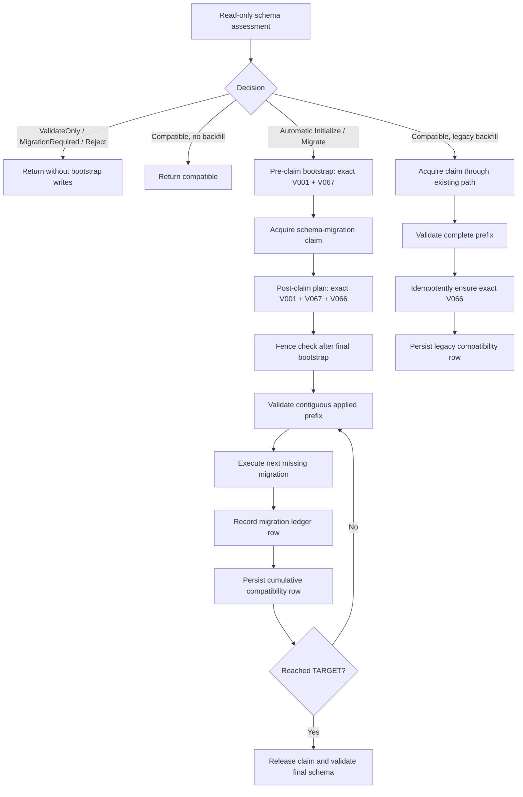

# Design Document: Managed Embedded DSQL Schema Bootstrap Repair

## Overview

This design removes the bug condition defined in
[`bugfix.md`](bugfix.md) by making the V066 `schema_compatibility` table an explicit,
fenced, post-claim prerequisite of automatic schema application. The implementation
continues to use the exact embedded migration bytes and later executes or recognizes
V066 as an ordinary numbered migration, so physical schema, ledger identity, prefix
digests, and release compatibility metadata remain aligned.

The behavioral ground truth is the current Tokeira implementation at
`4e8cd6e81a6f18f41d350a8adb8b4cd625c665bc`, the existing
[managed embedded DSQL requirements](../managed-embedded-dsql/requirements.md#requirement-5-mode-specific-migration-policy),
and the existing
[migration protocol design](../managed-embedded-dsql/design.md#5-compatibility-assessment-and-migrations-tokeira-storage).
No new Aurora DSQL API behavior is introduced by this correction.

## Dependencies and Non-Goals

### Owning Relationships

- [`MigrationRunner`](../../../crates/tokeira-storage/src/dsql/migration.rs) owns
  assessment, exact migration bytes, fenced application, ledger ordering, and
  compatibility persistence. This design changes only its post-claim ordering.
- [`apply_embedded_schema`](../../../crates/tokeira-engine/src/lib.rs) owns connection
  admission, claim acquisition/release, final validate-only assessment, and startup
  result projection. It continues to call the storage-owned protocol.
- [`live_managed_dsql.rs`](../../../crates/tokeira-engine/tests/live_managed_dsql.rs)
  owns billable live-AWS lifecycle evidence. Its cleanup control flow changes, but
  cluster lifecycle authority remains in `ManagedDsqlAdmin`.
- The existing managed embedded DSQL spec remains the feature contract. This package
  supplies the focused bug condition, correction design, and implementation evidence.

### Non-Goals

- No migration file, schema table, schema-contract field, prefix digest, or build-info
  value changes.
- No kernel, runtime transition, connection reservoir, DynamoDB coordination, IAM
  signing, descriptor, or cluster-lifecycle change.
- No new public error shape and no exposure of nested SQLx, AWS SDK, connection,
  descriptor, token, or credential text.
- No `tkr`, `tkp`, Odori, or live AWS mutation in the upstream implementation work.
- No pre-claim V066 bootstrap. V066 is application recovery metadata, not a prerequisite
  for acquiring the migration claim.

## Architecture

Assessment remains read-only. Only automatic `Initialize` and `Migrate`, plus the
existing automatic legacy backfill, enter a mutating path. V001 and V067 remain the
minimal pre-claim coordination bootstrap. After claim acquisition, the runner consumes
one private ordered bootstrap plan containing exact V001, V067, and V066 statements,
with a fence validation before every statement and once more after the final statement.
The existing migration loop then validates the ledger, executes each missing migration,
records it, and persists compatibility metadata.



This is entirely storage/runtime orchestration. Nothing enters `tokeira-kernel`, and no
workflow request can be served until final schema validation and embedded ownership
acquisition succeed.

## Components and Interfaces

### 1. Post-Claim Bootstrap Plan

[`crates/tokeira-storage/src/dsql/migration.rs`](../../../crates/tokeira-storage/src/dsql/migration.rs)
gains one private, production-consumed plan seam:

```rust
fn post_claim_bootstrap_statements() -> &'static [&'static str];
```

The final plan is ordered as follows:

| Position | Migration source | Purpose | Existing ledger treatment |
|---|---|---|---|
| 1 | V001 `schema_version` | Ensure ledger availability | V001 still executes or is recognized and is recorded normally |
| 2 | V067 `tokeira_control_lease` | Ensure claim table availability | V067 still executes or is recognized and is recorded normally |
| 3 | V066 `schema_compatibility` | Ensure per-version recovery metadata can be persisted | V066 still executes or is recognized and is recorded normally |

`apply_decision` interprets this slice directly. For each statement it calls
`ensure_migration_fence`, then executes the single statement on the existing admitted
control connection. It calls `ensure_migration_fence` once more after the slice and
before migration iteration. The final check closes the interval after V066; the existing
checks before migration execution, ledger recording, and compatibility persistence remain
unchanged.

Task 1 first extracts the current V001/V067 prelude into this seam without adding V066.
The exploration property therefore observes the real production plan and fails. The
correction is the minimal subsequent change: append
`schema_compatibility_bootstrap_sql()` to the plan and add the final fence check.

`bootstrap_statements_for_decision` is unchanged and remains limited to V001/V067 for
automatic `Initialize` and `Migrate`.

Because ledger recording precedes compatibility persistence, interruption at that
boundary can leave otherwise valid compatibility metadata behind the authoritative
ledger. Assessment accepts only a checksum-valid lag, validates the digest at the
metadata's own version, and selects `legacy_backfill: true` under automatic policy.
Metadata ahead of the ledger remains impossible and is rejected. Validate-only policy
accepts a validated lag without writing it.

### 2. Pure Application-Ordering Model

A test-only submodule at
`crates/tokeira-storage/src/dsql/migration/schema_bootstrap_property_tests.rs` models the
observable operation order while consuming the production bootstrap plan and embedded
migration identities.

```rust
#[derive(Clone, Copy, Debug, PartialEq, Eq)]
enum ModelOperation {
    AcquireFence,
    CheckFence,
    Bootstrap { migration_version: u32 },
    Execute { migration_version: u32 },
    Record { migration_version: u32 },
    PersistCompatibility { schema_version: u32 },
}

#[derive(Clone, Debug, PartialEq, Eq)]
struct ApplicationModelState {
    applied_prefix: u32,
    physically_completed: BTreeSet<u32>,
    compatibility_table_available: bool,
    compatibility_version: Option<u32>,
    fence_owned: bool,
}
```

The model does not simulate SQL or AWS. It represents only ordering facts already
visible in `apply_decision`. Generated inputs are contiguous recognized prefixes from
zero through `TARGET`, automatic decisions appropriate to those prefixes, an owned fence,
and optional crash/fence-loss boundaries. A bootstrap operation changes physical table
availability but never advances the ledger. Migration execution and ledger recording
remain distinct operations.

The model is test-only; it introduces no durable format or public API. Its production
anchor is the exact slice interpreted by `apply_decision`, preventing a separately
invented bootstrap order from passing while production remains wrong.

### 3. Startup Error Documentation

[`startup_phase`](../../../crates/tokeira-engine/src/lib.rs) retains its phase-only,
bounded public error. The inaccurate comment claiming discarded inner errors remain in
host telemetry is corrected to describe the actual behavior. This PR does not add a
diagnostic payload. A later diagnostic design must use an allowlisted reason enum and
secret-canary tests rather than retaining arbitrary nested errors.

### 4. Live Test Cleanup Control Flow

[`live_managed_dsql.rs`](../../../crates/tokeira-engine/tests/live_managed_dsql.rs) is
factored after the descriptor reaches `Ready` into two sequential operations:

```rust
async fn exercise_ready_cluster(/* existing resolved inputs */) -> anyhow::Result<()>;

async fn destroy_ready_cluster(/* control plane + descriptor store */)
    -> anyhow::Result<()>;

fn combine_ready_cluster_results(
    exercise: anyhow::Result<()>,
    teardown: anyhow::Result<()>,
) -> anyhow::Result<()>;
```

`exercise_ready_cluster` owns both engine generations and attempts explicit engine
shutdown for every engine handle it successfully creates. The outer test captures its
result without `?`, then always calls `destroy_ready_cluster`. Destruction continues to
use `plan_destroy`, exact plan-derived confirmation, `apply_destroy`, and tombstone
verification.

Result combination follows resource-safety precedence:

| Engine exercise | Administrative teardown | Test result |
|---|---|---|
| Success | Success | Success |
| Failure | Success | Bounded engine-exercise failure |
| Success | Failure | Bounded teardown failure stating the cluster may remain live |
| Failure | Failure | Bounded combined failure stating the cluster may remain live |

The combined message contains no nested debug/display value, descriptor content,
cluster identity, endpoint, client token, database token, connection string, or
credential. The operator uses the unchanged descriptor-bound recovery runbook for a
possible live resource.

### 5. Tracked Schema Policy and Existing Design

[`crates/tokeira-storage/AGENTS.md`](../../../crates/tokeira-storage/AGENTS.md) is updated
to distinguish an uncoordinated locked-migration edit from an explicitly approved
pre-release re-cut. The baseline lock remains enforced and unchanged in this correction;
it is a consistency guard, not evidence that the product has declared its first durable
release baseline.

The existing managed embedded DSQL design is corrected to distinguish:

- pre-claim coordination bootstrap: exact V001 and V067 bytes; and
- post-claim application-metadata bootstrap: exact V066 bytes before migration
  iteration.

No migration, `schema-baseline.lock`, `schema-contract.toml`, generated build metadata,
or digest is changed.

## Data Models

There is no durable data-model change. Existing tables and rows retain their current
definitions and meanings.

| Model | Lifetime | Field | Contract source |
|---|---|---|---|
| Post-claim bootstrap slice | Compile-time process data | Ordered SQL references | Exact embedded V001, V067, and V066 migration bytes |
| `ModelOperation` | Test only | Operation kind and migration/schema version | Current `apply_decision` control flow |
| `ApplicationModelState` | Test only | `applied_prefix` | Contiguous `schema_version` ledger invariant |
| `ApplicationModelState` | Test only | `physically_completed` | Successful migration statement completion before ledger recording |
| `ApplicationModelState` | Test only | `compatibility_table_available` | Physical effect of exact V066 |
| `ApplicationModelState` | Test only | `compatibility_version` | Latest persisted `schema_compatibility.schema_version` |
| `ApplicationModelState` | Test only | `fence_owned` | Active `schema-migration` claim required for later writes |

The model deliberately permits physical bootstrap tables to exist ahead of their ledger
versions. This is the expected state created by idempotent bootstrap; only ordinary
migration iteration advances the authoritative ledger.

## Correctness Properties

### Property 1: Bug Condition Is Eliminated

*For any* recognized contiguous prefix below `TARGET` and corresponding automatic
`Initialize` or `Migrate` decision with an owned claim, the production-derived operation
plan SHALL contain exact V066 bootstrap after claim acquisition, with a fence check
immediately before and after that bootstrap, and before the first compatibility
persistence operation. Therefore `C(X)` is not satisfiable.

**Validates: Requirements 1.1, 1.2, 1.3, 1.4, 1.5**

### Property 2: Every Valid Prefix Converges

*For any* recognized contiguous prefix from zero through `TARGET - 1`, applying the
corrected automatic operation plan without injected failure SHALL end with every
migration through `TARGET` physically completed, a contiguous ledger headed by `TARGET`,
and compatibility metadata at `TARGET` with the expected cumulative digest.

**Validates: Requirements 1.6, 2.1, 2.3, 2.4, 2.5**

### Property 3: Every Crash Boundary Recovers

*For any* valid starting prefix and any operation boundary in the automatic application
plan, interrupting at that boundary and replaying from the resulting state SHALL
converge to the same physical schema, ledger, compatibility version, and cumulative
digest as an uninterrupted application.

**Validates: Requirements 2.2, 2.3, 2.4, 2.5**

### Property 4: Fence Loss Stops Mutation

*For any* valid automatic application plan and any fence-check boundary, changing the
model to a lost fence at that boundary SHALL prevent all subsequent bootstrap,
migration, ledger, and compatibility mutations.

**Validates: Requirements 1.3, 1.4, 1.7**

### Property 5: Decisions Outside the Bug Condition Are Preserved

*For any* valid observation and migration policy producing `MigrationRequired`,
validate-only behavior, or `Compatible { legacy_backfill: false }`, application SHALL
emit no bootstrap mutation; for automatic `Compatible { legacy_backfill: true }` with
missing or validated lagging metadata, it SHALL use the validated metadata-backfill
operation sequence.

**Validates: Requirements 3.1, 3.2, 3.3, 3.4**

### Property 6: Bootstrap Sources and Schema Contract Are Preserved

*For any* statement selected by the pre-claim or post-claim bootstrap plans, the
statement SHALL be byte-for-byte equal to its embedded numbered migration, contain one
validated migration statement, and leave the recognized migration identities, target,
maximum readable version, immutable-through consistency marker, and migration-set
digest unchanged.

**Validates: Requirements 1.2, 1.5, 5.2**

## Error Handling

No public error variant changes. Because schema startup completes before an engine handle
is returned, there is no gRPC status mapping for these failures.

| Condition | Internal result | Embedded caller result | Mutation boundary |
|---|---|---|---|
| Post-claim bootstrap database failure | `SchemaCompatibilityError::Database` | `EmbeddedEngineStartError::Phase { Schema }` | No migration-loop write follows |
| Fence absent, expired, or replaced | `SchemaCompatibilityError::Fenced` | `EmbeddedEngineStartError::Phase { Schema }` | No later write follows |
| Invalid ledger/checksum/digest/future schema | `SchemaCompatibilityError::Incompatible` | `EmbeddedEngineStartError::Phase { Schema }` | Rejected before later migration |
| Validate-only schema below target | `SchemaCompatibilityError::MigrationRequired` or engine migration-required result | `EmbeddedEngineStartError::Phase { Schema }` | Read-only |
| Shared startup deadline expires | Existing timeout result | `EmbeddedEngineStartError::DeadlineExceeded { Schema }` | Rollback guard closes resources |
| Engine exercise fails after cluster readiness; teardown succeeds | Test-only `anyhow::Error` captured internally | Bounded exercise-failure message | Cluster destroyed and tombstoned |
| Administrative teardown fails after readiness | Test-only `anyhow::Error` captured internally | Bounded teardown-failure message | Cluster may remain live; descriptor retained |

The phase-only production error remains intentionally secret-safe. This correction fixes
the false telemetry documentation claim rather than widening the public error ad hoc.

## Testing Strategy

### Property Tests

- Place Properties 1–6 in
  `crates/tokeira-storage/src/dsql/migration/schema_bootstrap_property_tests.rs` using the
  workspace `proptest` dependency and at least 100 cases per property.
- Write Property 1 first against the extracted but unfixed production plan. Its expected
  failure must shrink to `applied_prefix = 0` and first persistence after V001. If it
  passes, stop and re-investigate before changing the plan.
- After appending V066, rerun the same exploration property unchanged as the regression
  proof, then add Properties 2–6.
- Use ordered collections and deterministic operation generation so shrinking is stable.

### Example-Based Unit Tests

- Extend migration unit tests to assert the exact pre-claim set `{V001, V067}`, exact
  post-claim order `[V001, V067, V066]`, and byte equality with `include_str!` sources.
- Keep the fixed decision-table tests for validate-only, migration-required, compatible,
  and legacy-backfill cases.
- Add engine live-harness helper tests for all four exercise/teardown result combinations
  and secret canaries in combined messages. These are exhaustive fixed cases rather than
  property inputs.
- Retain existing engine tests proving a failed startup returns no handle and embedded
  transport binds no listener.

### Opt-In DSQL Integration

- Add `crates/tokeira-storage/tests/dsql_schema_bootstrap.rs` behind
  `dsql-integration`. It uses only an explicitly supplied disposable test database and
  never deletes or resets an unrecognized schema.
- Cover real recovery from the minimal V001 ledger prefix by installing exact recognized
  prefix state, acquiring the real control lease, invoking `apply_decision`, and verifying
  ledger head `TARGET` plus the exact target compatibility digest.
- The live managed-engine test supplies the empty-cluster case through the full managed
  lifecycle, then exercises `service_override`, clean restart, preserved workflow state,
  and explicit destruction.
- Both live paths remain ignored/opt-in where applicable. No live test is run without the
  existing explicit operator acknowledgement and private descriptor controls.

### Completion Validation

Run focused storage and engine tests while iterating, then the repository finish-green
bar with `--locked`. `Cargo.lock` must remain unchanged. The billable live-AWS test is a
separate, explicitly authorized validation step and its result must state whether a
destroyed descriptor tombstone was verified or a live-resource owner remains.
