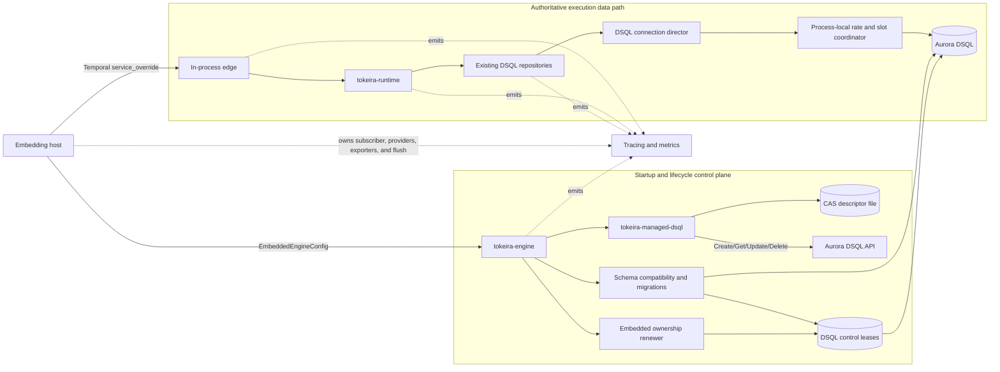
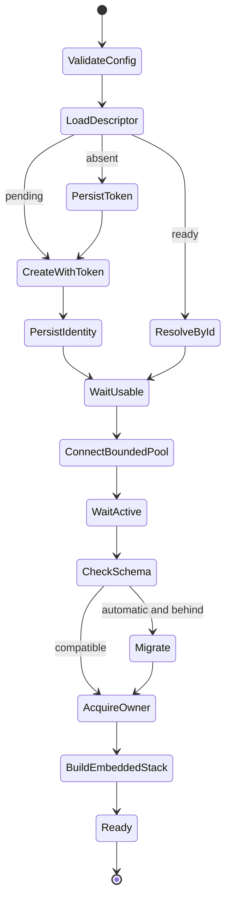

# Managed Aurora DSQL for Embedded Tokeira — Design

## Overview

This design adds durable Aurora DSQL storage to the existing zero-listener embedded
engine. It introduces an explicit embedded configuration surface, a narrow managed-DSQL
control-plane crate, a crash-safe local cluster descriptor, process-local connection
coordination, release-bound schema compatibility, exclusive embedded ownership, and
host-composable telemetry. The existing Temporal `service_override` transport and the
existing DSQL repositories remain the execution and persistence paths.

The design is derived from the approved [requirements](requirements.md), the current
[`Engine`](../../../crates/tokeira-engine/src/lib.rs),
[`DsqlStore`](../../../crates/tokeira-storage/src/dsql/mod.rs),
[`MigrationRunner`](../../../crates/tokeira-storage/src/dsql/migration.rs), and
[`InProcessGrpcService`](../../../crates/tokeira-edge/src/in_process.rs). AWS control
behaviour follows the current official
[`CreateCluster`](https://docs.aws.amazon.com/aurora-dsql/latest/APIReference/API_CreateCluster.html),
[`GetCluster`](https://docs.aws.amazon.com/aurora-dsql/latest/APIReference/API_GetCluster.html),
[`UpdateCluster`](https://docs.aws.amazon.com/aurora-dsql/latest/APIReference/API_UpdateCluster.html),
and
[`DeleteCluster`](https://docs.aws.amazon.com/aurora-dsql/latest/APIReference/API_DeleteCluster.html)
contracts. SQL concurrency and migration behaviour follows Aurora DSQL's documented
[optimistic concurrency control](https://docs.aws.amazon.com/aurora-dsql/latest/userguide/working-with-concurrency-control.html),
[supported SQL](https://docs.aws.amazon.com/aurora-dsql/latest/userguide/working-with-postgresql-compatibility-supported-sql-features.html),
[distributed DDL rules](https://docs.aws.amazon.com/aurora-dsql/latest/userguide/working-with-ddl.html),
and
[asynchronous-index contract](https://docs.aws.amazon.com/aurora-dsql/latest/userguide/working-with-create-index-async.html).

No component in this design changes `tokeira-kernel`. AWS calls, SQL, leases, context
propagation, and telemetry remain in engine, storage, edge, runtime, and observability
layers. The existing per-run transition log remains authoritative.

## Dependencies and Non-Goals

### Owning relationships

| Owner | Responsibility in this design |
|---|---|
| `tokeira-config` | Serializable embedded-mode, migration-policy, resource-envelope, and startup-deadline configuration. |
| New `tokeira-managed-dsql` crate | Cluster descriptor, AWS control-plane adapter, create/recover state machine, identity validation, retry classification, and explicit destruction planning/application. |
| `tokeira-storage` | Process-local versus distributed connection coordination, schema contract generation, compatibility decisions, migrations, and DSQL control leases. |
| `tokeira-build-info` | Exposes the storage-owned schema compatibility fields as immutable build metadata. |
| `tokeira-engine` | Orders startup and shutdown, selects the storage path, builds the existing service stack over DSQL, exposes the startup report, and owns the live embedded lifecycle. |
| `tokeira-edge` | Preserves zero-listener request dispatch, W3C parent extraction, stable RPC attributes, and shutdown admission/drain. |
| `tokeira-runtime` and `tokeira-observability` | Propagate transient trace context through internal channels, attach stable execution identifiers, and keep metrics bounded. |
| Embedding host | Installs subscribers/providers/exporters, injects context into external provider/MCP/handoff carriers, and flushes its providers after engine shutdown. |

The new crate is an architectural dependency approved through this specification. It is
narrower than depending on `tokeira-aws`: the latter is an unpublished IaC provider and
would pull EC2, EKS, ECS, IAM, and other unrelated SDKs into the embeddable engine. The
new crate uses AWS DSQL dependencies already present in the workspace lockfile and has no
dependency on the engine, storage, runtime, edge, observability, or kernel crates.

### Non-goals

- Multi-Region DSQL creation or peering.
- Tag-based discovery, endpoint-based identity, or implicit adoption.
- Replacing the existing distributed DynamoDB coordination path.
- Making managed embedded mode safe for multiple serving processes.
- Changing Temporal wire behaviour, workflow state transitions, or history semantics.
- Persisting trace IDs, span IDs, or exporter state in workflow history.
- Installing OpenTelemetry, Logfire, Prometheus, or another process-global integration.
- Defining external provider, MCP, or handoff APIs inside Tokeira.
- Deleting a cluster from `Engine::drop` or `Engine::shutdown`.
- Adding or changing `tkr` or `tkp` command surfaces; a separate activity may adapt the
  lifecycle library without changing its embedded contracts.
- Refactoring the existing `tokeira-aws::DsqlCluster` IaC resource in the first slice.

## Architecture

Managed embedded startup has a control-plane path and a data path. The control-plane path
persists identity before mutation, resolves the AWS cluster, checks schema compatibility,
and acquires exclusive ownership. The data path is the existing in-process edge → runtime
→ DSQL repository stack. Telemetry observes both paths but is never authoritative.



### Managed startup sequence

1. Validate `EmbeddedEngineConfig` without network or filesystem mutation.
2. Load the versioned descriptor under its CAS store.
3. If absent, generate a creation token and win the empty-version CAS before making an
   AWS call. A CAS loser reloads the winner's token.
4. If the descriptor is pending, call `CreateCluster` with that exact token. If it is
   ready, call `GetCluster` by the persisted cluster ID.
5. Validate ID, ARN, and Region. Persist a returned ID/ARN/endpoint by CAS. Refresh only
   the endpoint on later observations.
6. Wait through `CREATING` or `UPDATING`. Treat `IDLE` and `INACTIVE` as recoverable
   states rather than failures.
7. Construct `DsqlStore::connect_embedded`. Its bounded reservoir makes the wake-up
   connection when needed; after the first connection succeeds, wait until AWS reports
   `ACTIVE` before schema work.
8. Bootstrap the idempotent control-lease table, acquire the schema-migration lease,
   assess compatibility, and apply the approved forward plan if policy is automatic.
9. Acquire the separate embedded-owner lease and start its renewer.
10. Factor the current DSQL service-stack builder through `StackTransport::Embedded`,
    recover from authoritative DSQL state, and open in-process admission.
11. Return an `Engine` with an immutable redacted startup report. Failure at any phase
    unwinds already-created local resources in reverse order and returns no endpoint.



### Shutdown and ownership-loss sequence

Explicit `Engine::shutdown` closes in-process admission first, cancels background work,
drains tracked handlers/tasks, releases the embedded-owner claim, shuts down the
connection director, and returns to the host. The host may then flush and shut down its
own providers. A plain `Drop` performs only synchronous cancellation and local handle
drop; it never invokes AWS mutation. If the owner renewer loses its claim, it closes the
same admission gate and cancels the stack, so subsequent SDK calls receive
`UNAVAILABLE`.

Cluster destruction is not part of this sequence. It is a separate administrative
plan/apply path described below.

## Components and Interfaces

### 1. Embedded configuration (`crates/tokeira-config`)

The daemon-oriented `TokeiraConfig` remains intact. A new wrapper makes embedded storage
intent impossible to infer from a DSQL endpoint.

```rust
#[derive(Clone, Debug, Serialize, Deserialize, PartialEq)]
#[serde(deny_unknown_fields)]
pub struct EmbeddedEngineConfig {
    pub server: TokeiraConfig,
    #[serde(default)]
    pub storage: EmbeddedStorageConfig,
    #[serde(default = "default_embedded_startup_timeout_ms")]
    pub startup_timeout_ms: u64,
}

#[derive(Clone, Debug, Default, Serialize, Deserialize, PartialEq)]
#[serde(tag = "mode", rename_all = "snake_case", deny_unknown_fields)]
pub enum EmbeddedStorageConfig {
    #[default]
    InMemory,
    ManagedDsql(ManagedEmbeddedDsqlConfig),
    ExistingDsql(ExistingEmbeddedDsqlConfig),
}

#[derive(Clone, Debug, Serialize, Deserialize, PartialEq)]
#[serde(deny_unknown_fields)]
pub struct ManagedEmbeddedDsqlConfig {
    pub intent: ManagedClusterIntent,
    pub descriptor_path: PathBuf,
    pub region: String,
    #[serde(default)]
    pub migration_policy: Option<DsqlMigrationPolicy>,
    #[serde(default)]
    pub limits: EmbeddedDsqlLimits,
    #[serde(default)]
    pub tags: BTreeMap<String, String>,
}

#[derive(Clone, Copy, Debug, Serialize, Deserialize, PartialEq, Eq)]
#[serde(rename_all = "snake_case")]
pub enum ManagedClusterIntent {
    CreateOrRecover,
}

#[derive(Clone, Debug, Serialize, Deserialize, PartialEq)]
#[serde(deny_unknown_fields)]
pub struct ExistingEmbeddedDsqlConfig {
    pub region: String,
    pub cluster_id: String,
    pub cluster_arn: String,
    pub endpoint: String,
    pub migration_policy: DsqlMigrationPolicy,
    #[serde(default)]
    pub limits: EmbeddedDsqlLimits,
}

#[derive(Clone, Copy, Debug, Serialize, Deserialize, PartialEq, Eq)]
#[serde(rename_all = "snake_case")]
pub enum DsqlMigrationPolicy {
    Automatic,
    ValidateOnly,
}

#[derive(Clone, Debug, Serialize, Deserialize, PartialEq)]
#[serde(deny_unknown_fields)]
pub struct EmbeddedDsqlLimits {
    pub max_connections: usize,
    pub concurrent_connection_creations: usize,
    pub connection_rate_per_second: f64,
    pub connection_burst: u64,
}
```

`startup_timeout_ms` defaults to 900,000 (15 minutes), matching the current DSQL IaC
wait budget while remaining one end-to-end deadline shared by AWS polling, wake-up,
schema work, ownership, and stack construction.

`EmbeddedDsqlLimits::default()` is `(8, 2, 8.0, 2)`. Validation enforces the
requirements' `(16, 4, 16.0, 4)` maxima, positive values, and
`concurrent_connection_creations <= max_connections`. Hosts may choose a smaller
physical pool; the five existing `DbClass` semaphores remain positive logical admission
budgets and contend for that smaller shared reservoir.

`Engine::start()` and `Engine::start_with_config(TokeiraConfig)` remain backward
compatible and construct `EmbeddedEngineConfig` with `InMemory`. The new durable entry
point requires `Engine::start_with_embedded_config` and therefore cannot create AWS
resources from an old call site.

For listener-backed distributed DSQL, `DsqlInfraConfig` gains
`migration_policy: Option<DsqlMigrationPolicy>`. Validation rejects DSQL startup when it
is absent. Managed embedded defaulting to `Automatic` happens only after the explicit
`ManagedDsql` mode and `CreateOrRecover` intent have been validated.

### 2. Managed DSQL control plane (`crates/tokeira-managed-dsql`)

This new crate owns AWS lifecycle behaviour without importing the IaC engine.

```rust
#[async_trait]
pub trait DsqlControlPlane: Send + Sync + Debug {
    async fn create_cluster(
        &self,
        request: CreateClusterRequest,
    ) -> Result<ClusterObservation, DsqlControlError>;

    async fn get_cluster(
        &self,
        region: &str,
        cluster_id: &str,
    ) -> Result<ClusterObservation, DsqlControlError>;

    async fn set_deletion_protection(
        &self,
        request: SetDeletionProtectionRequest,
    ) -> Result<ClusterObservation, DsqlControlError>;

    async fn delete_cluster(
        &self,
        request: DeleteClusterRequest,
    ) -> Result<ClusterStatus, DsqlControlError>;
}

pub struct ManagedDsqlLifecycle<C, S, T> {
    control: C,
    descriptors: S,
    time: T,
    retry: RetryPolicy,
}

impl<C, S, T> ManagedDsqlLifecycle<C, S, T> {
    pub async fn create_or_recover(
        &self,
        request: CreateOrRecoverRequest,
        deadline: StartupDeadline,
    ) -> Result<ResolvedCluster, ManagedDsqlError>;

    pub async fn refresh_until_usable(
        &self,
        cluster: ResolvedCluster,
        deadline: StartupDeadline,
    ) -> Result<UsableCluster, ManagedDsqlError>;
}
```

The production adapter wraps `aws_sdk_dsql::Client` built from the standard AWS SDK
credential and Region chain. Tests use the contract-shaped trait; no generated SDK type
escapes this crate.

#### Complete `CreateCluster` request policy

| AWS request field | Design policy | Persistence / side effect |
|---|---|---|
| `clientToken` | Always the explicit descriptor token; never allow the SDK to invent it. | Persisted before the request and reused. |
| `deletionProtectionEnabled` | Always `true`. | Verified again by `GetCluster`; never disabled by startup or shutdown. |
| `tags` | Optional caller metadata after AWS validation. | Sent only on create; never queried for identity or recovery. |
| `multiRegionProperties` | Omitted. | Managed embedded creates one single-Region cluster. |
| `kmsEncryptionKey` | Omitted in this feature. | AWS service default applies; a future explicit encryption policy needs its own spec. |
| `policy` | Omitted in this feature. | No implicit resource policy is installed. |
| `bypassPolicyLockoutSafetyCheck` | Omitted/false. | Startup never bypasses AWS policy safety. |

#### Cluster descriptor store

```rust
#[async_trait]
pub trait ClusterDescriptorStore: Send + Sync + Debug {
    async fn load(&self) -> Result<Option<VersionedClusterDescriptor>, DescriptorError>;
    async fn compare_and_swap(
        &self,
        expected_revision: Option<u64>,
        next: &ClusterDescriptorV1,
    ) -> Result<u64, DescriptorError>;
}

pub struct LocalClusterDescriptorStore {
    path: PathBuf,
}
```

The local store holds a sidecar-file exclusive lock across read/revision-check/write,
writes a unique temporary file in the same directory, calls `sync_all` on the file,
atomically renames it, and syncs the parent directory before releasing the lock. The
descriptor's monotonically increasing revision is the CAS token. New files are created
with owner-only permissions where the platform supports them.

Two creators racing on an absent descriptor generate separate candidate tokens, but only
one empty-revision CAS can win. The loser discards its candidate, reloads, and uses the
winner's persisted token. A crash after AWS success but before identity persistence leaves
the winning token intact, so the next request resolves the same AWS idempotency record.

Descriptor states are `PendingCreate`, `Ready`, and `Destroyed`. A destroyed descriptor is
a tombstone: normal startup fails rather than silently creating a replacement cluster at
the same path.

Existing embedded DSQL bypasses the descriptor and every create/update/delete operation.
It calls `GetCluster` with the configured cluster ID, validates the returned ID/ARN/Region,
uses the returned endpoint for this process, and then enters the same bounded local-pool
and explicit schema-policy path. It requires `GetCluster` plus database-connect IAM
permission but never requires create or delete permission. Intentional multi-process use
continues to require distributed mode and its distributed coordination configuration.

#### Identity and status state machine

The ARN parser verifies partition syntax, service `dsql`, Region, account, resource type
`cluster`, and the same 26-character ID returned in `identifier`. A ready descriptor is
always recovered with `GetCluster(identifier)`. The returned endpoint may replace the
stored endpoint; returned ID, ARN, or Region disagreement is fatal.

| AWS status | Startup action |
|---|---|
| `CREATING`, `UPDATING` | Poll `GetCluster` with bounded retry. |
| `ACTIVE` | Permit connection and schema phases. |
| `IDLE`, `INACTIVE` | Permit bounded pool construction to wake the cluster, then poll for `ACTIVE`. |
| `FAILED`, `DELETING`, `DELETED` | Fail with status and canonical identity. |
| `PENDING_SETUP`, `PENDING_DELETE` | Fail because these multi-Region states contradict managed embedded mode. |

Access-denied, validation, quota, and identity errors are terminal. Throttling, internal
service errors, and documented conflicts are retryable only inside `StartupDeadline`.
`retryAfterSeconds` is a lower bound on the next retry delay. Exponential backoff is
bounded and jittered in production; tests inject a deterministic clock/sleeper and never
sleep.

### 3. Connection-foundation isolation (`crates/tokeira-storage/src/dsql`)

Initial-launch embedded support does not refactor the established distributed reservoir.
The distributed path continues to construct `DistributedTokenBucket`, validate its
DynamoDB table, start `SlotBlockManager`, and pass both concrete components directly to
`Reservoir::start`. The implementation in `reservoir.rs` retains one refiller task, its
existing immediate empty-reservoir backpressure, its existing acquire/release ordering,
and its existing DynamoDB shutdown path. `distributed_bucket.rs` and
`slot_block_manager.rs` are unchanged by this feature.

Embedded mode instead owns a separate `EmbeddedReservoir` and a private
`EmbeddedConnectionCoordinator`. This keeps its bounded parallel creation,
deadline-aware warmup, cancellation-safe pending slot charge, ready-channel waiting, and
draining shutdown out of `tokeirad`'s distributed connection mechanics.

```rust
#[async_trait]
pub(crate) trait EmbeddedConnectionCoordinator: Send + Sync + Debug {
    async fn validate(&self) -> anyhow::Result<()>;
    async fn acquire_slot(&self) -> anyhow::Result<()>;
    async fn acquire_creation_token(&self) -> anyhow::Result<()>;
    fn release_slot(&self);
    async fn shutdown(&self) -> anyhow::Result<()>;
}

pub(crate) struct ProcessLocalConnectionCoordinator<C = SystemMonotonicClock> {
    bucket: ProcessLocalTokenBucket<C>,
    slots: AtomicSlotBudget,
}

pub(crate) struct EmbeddedReservoir { /* embedded-only lifecycle state */ }

impl DsqlStore {
    pub async fn connect_distributed(
        auth: DsqlAuthConfig,
        config: DsqlPoolConfig,
        ddb_client: aws_sdk_dynamodb::Client,
    ) -> anyhow::Result<Self>;

    pub async fn connect_embedded(
        auth: DsqlAuthConfig,
        config: EmbeddedDsqlPoolConfig,
        warmup_deadline: WarmupDeadline,
    ) -> anyhow::Result<Self>;
}
```

`connect_embedded` constructs no AWS DynamoDB config, client, or table names. The engine
passes the remaining startup budget as `WarmupDeadline`, so waking an inactive cluster is
bounded by the host deadline. The local token bucket starts with the configured burst,
replenishes from a monotonic clock, and uses `Notify` to wake waiters. Its atomic slot
counter is capped at `max_connections`, which also equals the embedded ready-channel
capacity and maximum idle count. That cap prevents multiple embedded refillers from
creating `target + in-flight` physical connections.

The repository implementations, five `DbClass` budgets, connection-lifetime policy, and
permit API remain shared. The connection director selects one of two reservoir variants:
its distributed branch performs the pre-feature immediate checkout and concrete
`SlotBlockManager` return; its embedded branch waits on the bounded embedded channel and
drains checked-out permits during shutdown. This dispatch does not adapt the distributed
DynamoDB primitives behind a new interface.

#### Deferred post-launch shared-reservoir proposal

A shared-reservoir redesign is explicitly outside the initial public launch and requires
a separate consent-gated specification. The future design should evaluate the complete
distributed concurrency model rather than enabling additional refill workers in
isolation:

- Account atomically for ready, creating, checked-out, and retiring connections so a
  refill target is also a provable physical-connection bound.
- Couple slot-block allocation to the cluster's effective concurrent-connection quota,
  serialize process-local block expansion, and avoid deterministic low-block probing
  during fleet cold starts.
- Separate the distributed token bucket's monotonic CAS revision from its wall-clock
  refill timestamp and use jittered conflict/throttling retries.
- Model the single global rate row under the documented 100-connections/second and
  1,000-connection burst limits, including the DynamoDB capacity consumed by failed
  conditional writes and hot-key contention.
- Require deterministic concurrency properties plus multi-process cold-start,
  cancellation, throttling, and scale-to-zero recovery tests before changing
  `tokeirad` defaults.

The relevant service boundaries are the current
[Aurora DSQL quotas](https://docs.aws.amazon.com/aurora-dsql/latest/userguide/CHAP_quotas.html),
[DynamoDB partition-key limits](https://docs.aws.amazon.com/amazondynamodb/latest/developerguide/bp-partition-key-design.html),
and [conditional-write capacity rules](https://docs.aws.amazon.com/amazondynamodb/latest/developerguide/WorkingWithItems.html).
Recording these questions is not approval to implement the redesign in this feature.

### 4. Schema contract and build metadata

`tokeira-storage` owns a checked-in `schema-contract.toml` and
`schema-baseline.lock`. The contract contains:

```toml
format_version = 1
tokeira_release = "0.1.0"
minimum_supported_version = 1
target_version = 0 # replaced with the current contiguous target
maximum_readable_version = 0 # replaced with the reviewed readable ceiling
migration_set_digest = "sha256:..."
immutable_through_version = 0 # advanced when the durable baseline is cut
```

The zeros above are schema placeholders, not valid releasable values. Implementation
selects the then-current contiguous migration versions after accounting for concurrent
repository work and commits nonzero reviewed values before the baseline gate can pass.

`schema-baseline.lock` records `(version, name, checksum)` for every immutable migration.
The storage build script rejects gaps, duplicate versions, version ordering violations,
contract/release disagreement, a digest mismatch, or any mutation at or below
`immutable_through_version`. A releasable contract requires
`immutable_through_version >= maximum_readable_version`, so a release cannot claim to
read a migration whose interpretation may still change.

The digest input is canonical and platform-independent:

```text
tokeira-dsql-migration-set-v1\n
<decimal-version>\0<name>\0<lowercase-sha256-of-sql>\n
...
```

Entries are ordered by numeric version. The digest covers the complete migration set the
release recognizes through `maximum_readable_version`, while automatic migration stops at
`target_version`. The build requires every version through `MAX` to be present and lets
the runner compute the same cumulative prefix digest for any observed readable version.
Before the initial baseline is locked, all existing table and index migrations are
normalized to an idempotent form supported by DSQL, including `CREATE INDEX ASYNC IF NOT
EXISTS` and seed `INSERT ... ON CONFLICT DO NOTHING`.

`tokeira-build-info` reads the checked-in contract and exposes the following additional
immutable fields on `BuildInfo`: `schema_min_supported_version`,
`schema_target_version`, `schema_max_readable_version`, and
`schema_migration_set_digest`. The storage build script remains the authority that
validates the manifest against actual migration bytes.

### 5. Compatibility assessment and migrations (`tokeira-storage`)

```rust
#[derive(Clone, Debug, PartialEq, Eq)]
pub struct SchemaCompatibilityContract {
    pub tokeira_release: &'static str,
    pub minimum_supported_version: u32,
    pub target_version: u32,
    pub maximum_readable_version: u32,
    pub migration_set_digest: &'static str,
}

#[derive(Clone, Debug, PartialEq, Eq)]
pub enum SchemaDecision {
    Initialize { target: u32 },
    Migrate { from: u32, to: u32 },
    Compatible { current: u32, legacy_backfill: bool },
    MigrationRequired { current: u32, target: u32 },
    Reject(SchemaIncompatibility),
}

impl MigrationRunner {
    pub async fn assess_connection(
        &self,
        connection: &mut PgConnection,
        contract: &SchemaCompatibilityContract,
        policy: SchemaMigrationPolicy,
    ) -> Result<SchemaDecision, SchemaCompatibilityError>;

    pub async fn apply_decision(
        &self,
        connection: &mut PgConnection,
        decision: &SchemaDecision,
        migration_lease: &ControlLeaseGuard,
    ) -> Result<MigrationReport, SchemaCompatibilityError>;
}
```

`SchemaMigrationPolicy` is the storage-local two-variant enum. The engine maps the
configuration crate's `DsqlMigrationPolicy` into it with an exhaustive match, avoiding a
new `tokeira-storage` → `tokeira-config` dependency.

Assessment begins with catalog/ledger reads that tolerate missing metadata tables and
performs no DDL. Only an automatic `Initialize` or `Migrate` decision creates the exact
V001 `schema_version` and V067 `tokeira_control_lease` tables with idempotent bootstrap
DDL before acquiring the migration claim. This pre-claim exception is necessary because
the lease table cannot protect its own first creation. Validate-only assessment never
bootstraps either table.

After the claim is acquired, automatic application revalidates the fence before each
exact V001, V067, and V066 bootstrap statement and once more after V066. V066 makes
`schema_compatibility` available before the first per-version compatibility write. All
three canonical statements remain ordinary numbered migrations: the ordered loop still
executes or recognizes them and records their exact identities in the ledger, so the
ledger and digest account for every bootstrap table.

The migration ledger is authoritative for the applied prefix. Because ledger recording
precedes compatibility persistence, a crash may leave checksum-valid compatibility
metadata behind the ledger head. Assessment validates that metadata against its own
prefix digest, rejects metadata ahead of the ledger, and lets automatic policy backfill
a validated lag; validate-only policy remains read-only.

An uninitialized cluster carrying a managed descriptor is always `Initialize`, including
recovery after a crash between cluster creation and schema installation. This is the one
managed-mode action that does not become validate-only: a Tokeira-created dedicated
cluster is not usable until it has the complete target schema. An uninitialized
operator-supplied cluster under `ValidateOnly` is left unchanged and returns
`MigrationRequired`.

Aurora DSQL permits only one DDL statement per transaction and forbids mixing DDL and DML
in that transaction. The runner therefore uses this crash-safe sequence per migration:

1. Revalidate the migration claim and all already-applied checksums.
2. Execute one idempotent DDL or DML migration in its own transaction.
3. For `CREATE INDEX ASYNC`, capture the job, wait for completion, and verify the named
   index is valid. If a crash lost the job ID, inspect the named index and current job
   state before deciding whether to wait or fail.
4. Insert the `(version, name, checksum, applied_at)` ledger row in a separate DML
   transaction using conflict-safe semantics.
5. Persist the cumulative digest for the resulting schema version in
   `schema_compatibility`.

Retries occur only for DSQL `40001` OCC errors and only when the step is proven
idempotent. An invalid or failed asynchronous index is an actionable migration failure;
the runner does not silently drop it.

### 6. DSQL control leases

A new forward migration creates one narrow table used for two independent claim names:
`schema-migration` and `embedded-owner`.

```sql
CREATE TABLE IF NOT EXISTS tokeira_control_lease (
    claim_name  TEXT        NOT NULL,
    cluster_id  TEXT        NOT NULL,
    cluster_arn TEXT        NOT NULL,
    owner_id    TEXT,
    fence_token BIGINT      NOT NULL,
    expires_at  TIMESTAMPTZ NOT NULL,
    updated_at  TIMESTAMPTZ NOT NULL DEFAULT now(),
    PRIMARY KEY (claim_name)
);
```

Acquisition first uses `INSERT ... ON CONFLICT DO NOTHING`, then a repeatable-read
transaction with `SELECT ... FOR UPDATE` constrained by the exact primary key. It verifies
cluster identity and expiry using database time, replaces the owner, increments
`fence_token`, and commits. DSQL reports a concurrent winner as `40001`; the loser retries
from a fresh transaction inside its deadline. Renewal and release condition on
`(claim_name, owner_id, fence_token)` and treat zero affected rows as fencing.

The owner lease defaults to 60 seconds and renews every 20 seconds. A local monotonic
admission deadline closes before the database expiry if renewal cannot be confirmed.
`DsqlConnectionDirector` and the in-process edge share that admission gate, preventing
new RPCs and new checkouts after local expiry. DSQL's documented five-minute maximum
[transaction duration](https://docs.aws.amazon.com/aurora-dsql/latest/userguide/CHAP_quotas.html)
bounds already-started database work; takeover after an unclean expiry includes a
quiescence window for prior in-flight work, while clean release permits immediate
takeover. These timings are internal constants, not user-tunable correctness knobs.

The ownership claim is runtime/storage coordination, not workflow state. Its token is
never added to kernel commands or history events.

### 7. Embedded engine orchestration (`crates/tokeira-engine`)

```rust
impl Engine {
    pub async fn start_with_embedded_config(
        config: EmbeddedEngineConfig,
    ) -> Result<Self, EmbeddedEngineStartError>;

    pub fn startup_report(&self) -> &EngineStartupReport;

    pub async fn shutdown(self) -> Result<(), EmbeddedEngineShutdownError>;
}

#[derive(Clone, Debug, PartialEq, Eq)]
pub struct EngineStartupReport {
    pub storage_mode: EmbeddedStorageMode,
    pub cluster: Option<ClusterStartupReport>,
    pub schema: Option<SchemaStartupReport>,
    pub ownership: Option<OwnershipStartupReport>,
}
```

The current DSQL branch in `build_and_serve` is factored into a reusable
`build_dsql_stack(StackTransport, ...)`. Distributed network mode passes the existing
distributed coordinator. Embedded DSQL passes the process-local coordinator and receives
`ConstructedStack::Embedded`; it does not bind gRPC, Nexus callback, metrics, or control
listeners.

`EmbeddedStack` gains an `EmbeddedShutdownCoordinator` containing the runtime shutdown
handle, in-process RPC drain handle, connection director, optional owner guard, and
tracked engine tasks. `Engine` owns this coordinator rather than losing the DSQL director
when `DsqlStore::into_parts` is called. Startup uses an async rollback guard so every
failure after pool creation closes the pool and every failure after claim acquisition
attempts conditional release.

The embedded-owner claim complements rather than replaces the existing per-shard DSQL
leases and epochs. After owner acquisition, the existing self-assignment path acquires all
configured shards for the same process incarnation before admission opens. Clean shutdown
relinquishes those shard leases before releasing the singleton owner claim; crash recovery
waits for their existing expiry/fencing rules. No shard epoch or transition shape changes.

`Engine::shutdown` ordering is:

1. Close endpoint and in-process service admission.
2. Cancel runtime and engine background work.
3. Drain in-flight RPC handlers and join tracked runtime tasks within the shutdown
   deadline.
4. Finish Tokeira-owned shutdown spans and emit final bounded metrics.
5. Relinquish self-assigned shard leases.
6. Conditionally release the embedded-owner claim.
7. Shut down the DSQL director and close physical connections.
8. Return to the host without touching any global provider.

`Drop` closes admission and cancels tokens synchronously. It intentionally leaves an
unreleased claim to expire and never calls the AWS control plane.

### 8. In-process drain and runtime task ownership

`InProcessGrpcService` gains a shared admission state, in-flight counter, and `Notify`.
Every spawned handler owns a guard that decrements the count even on cancellation or
panic. `begin_shutdown` is synchronous; `drain` awaits zero handlers with a deadline.

The runtime's existing scanner handles are consolidated behind a non-kernel
`RuntimeShutdownHandle`. Engine-spawned refreshers, repairers, ownership renewal, and
cleanup loops use `tokio_util::task::TaskTracker`. Embedded construction closes the
tracker after startup and explicit shutdown awaits it after cancellation. This makes the
host's subsequent exporter flush a real happens-after boundary rather than a timing
guess.

### 9. Composable context propagation and telemetry

No embedded path calls `install_process_observability`, sets a global propagator, starts a
metrics HTTP server, or owns an exporter. Existing `tracing` and `metrics` macros remain
the emission APIs.

`ChannelTraceContext` is extended from raw IDs to a serializable W3C span context:

```rust
#[derive(Clone, Debug, Serialize, Deserialize, PartialEq, Eq)]
pub struct ChannelTraceContext {
    pub trace_id: [u8; 16],
    pub span_id: [u8; 8],
    pub trace_flags: u8,
    pub trace_state: String,
}

impl ChannelTraceContext {
    pub fn capture_current() -> Option<Self>;
    pub fn as_remote_parent(&self) -> opentelemetry::Context;
}
```

It carries data, never a `tracing::Span` handle, and is never serialized into workflow
history. Receiving spans call `set_parent` or add a link according to the boundary rather
than merely recording origin IDs as strings.

| Boundary | Relationship and carrier | Stable correlation attributes |
|---|---|---|
| `service_override` request | Extract W3C `traceparent`/`tracestate` from copied gRPC metadata; invalid/absent input starts a root. | Namespace, Workflow ID when present, request ID. |
| Internal lane/dispatch channel | Parent for direct causal work; link for fanout/handoff where one parent would be misleading. | Workflow ID, Run ID, command/task kind. |
| Workflow task | Server-side processing span; SDK/host remains responsible for application workflow interceptor context. | Workflow ID, Run ID, task queue, attempt. |
| Activity task | Server-side processing span; opaque Temporal headers remain preserved. | Workflow ID, Run ID, Activity ID, Activity Type, attempt. |
| Tokeira-owned HTTP/Nexus call | Inject current W3C fields into outbound headers with a dedicated W3C propagator. | Operation kind and bounded outcome. |
| Provider/MCP/handoff owned by host | Host injects/extracts using its integration; Tokeira provides stable IDs and context only when it mediates the carrier. | Host policy, with Tokeira stable execution IDs where available. |
| Restart | New trace is permitted. | Durable Workflow, Run, Activity, and attempt identifiers correlate the resumed work. |

Trace and structured-event attributes may include high-cardinality stable identifiers.
Metrics may include only bounded dimensions such as storage mode, cluster status, schema
outcome, ownership outcome, database class, operation kind, and error class. The metric
manifest's forbidden-label set expands to cover `activity_id`, `activity_type` when
unbounded, `prompt`, `tool_input`, `tool_output`, credential/token names, and existing
Workflow/Run/trace/request IDs.

RPC and database spans use the stable semantic conventions provided by the repository's
pinned OpenTelemetry version. Tokeira-specific execution and lifecycle fields use the
documented `tokeira.*` namespace. This feature does not claim GenAI/provider semantic
conventions because provider execution is outside this repository; the embedding host
may apply the conventions supported by its pinned integration.

Tokeira spans never record prompt bodies, tool inputs, tool outputs, workflow/activity
payloads, AWS credentials, DSQL authentication tokens, connection-string passwords, or
the creation client token. This feature adds no Tokeira content-capture switch. A host
that deliberately creates content-bearing spans owns its redaction and size policy; the
Tokeira attributes remain content-free.

### 10. Explicit destruction (`tokeira-managed-dsql`)

```rust
pub struct ManagedDsqlAdmin<C, S> { /* control plane and descriptor store */ }

impl<C, S> ManagedDsqlAdmin<C, S> {
    pub async fn plan_destroy(
        &self,
        deadline: AdminDeadline,
    ) -> Result<DestroyPlan, ManagedDsqlError>;

    pub async fn apply_destroy(
        &self,
        plan: &DestroyPlan,
        confirmation: ExplicitConfirmation,
        deadline: AdminDeadline,
    ) -> Result<DestroyReport, ManagedDsqlError>;
}
```

`DestroyPlan` binds descriptor revision, cluster ID, ARN, Region, observed deletion
protection, and a plan digest. Apply reloads the descriptor by CAS revision, repeats
`GetCluster` identity validation, disables protection with an operation-specific
idempotency token, calls `DeleteCluster` with a separate operation token, waits for
`DELETED` or not-found, and CAS-writes a `Destroyed` tombstone. Neither operation token
is printed. Both are deterministically derived from the plan digest and operation name,
so retrying the same approved plan reuses the same AWS idempotency keys.

The library keeps planning, confirmation, and application distinct without choosing a
CLI, deployment language, or user-interface policy. `plan_destroy` is read-only.
`apply_destroy` rejects a missing or digest-mismatched `ExplicitConfirmation` before any
AWS mutation. The confirmation type is constructed only from an observed `DestroyPlan`,
so an adapter must present or otherwise review that exact plan before authorizing it.
Command and deployment adapters are deferred to the separate operator-tooling activity.

The embedded engine does not construct or retain `ManagedDsqlAdmin`; startup receives
only `ManagedDsqlLifecycle`, whose public interface has no protection-disable or delete
operation. This capability separation makes the administrative API the only path in this
feature that can disable deletion protection or call `DeleteCluster`.

## Data Models

### Durable cluster descriptor

```rust
#[derive(Clone, Debug, Serialize, Deserialize, PartialEq, Eq)]
#[serde(deny_unknown_fields)]
pub struct ClusterDescriptorV1 {
    pub format_version: u32,
    pub revision: u64,
    pub region: String,
    pub creation_client_token: SecretString,
    pub state: ClusterDescriptorState,
}

#[derive(Clone, Debug, Serialize, Deserialize, PartialEq, Eq)]
#[serde(tag = "phase", rename_all = "snake_case", deny_unknown_fields)]
pub enum ClusterDescriptorState {
    PendingCreate,
    Ready {
        cluster_id: String,
        cluster_arn: String,
        endpoint: String,
    },
    Destroyed {
        cluster_id: String,
        cluster_arn: String,
        endpoint: String,
        destroyed_at: OffsetDateTime,
    },
}
```

| Field | Contract source | Validation | Telemetry |
|---|---|---|---|
| `format_version` | Descriptor evolution | Exactly `1`; unknown future versions reject. | Bounded version only. |
| `revision` | CAS requirement | Monotonic; store controls increments. | Omitted. |
| `region` | Requirements 2/3 | Non-empty and equal to ARN/control-plane Region. | Allowed as bounded deployment attribute. |
| `creation_client_token` | AWS `CreateCluster.clientToken` | Printable, 1–128 bytes; generated once. | Always redacted/omitted. |
| `cluster_id` | AWS identifier | `[a-z0-9]{26}` and equal to ARN resource ID. | Trace/event only, never metric label. |
| `cluster_arn` | AWS ARN | DSQL service, matching Region/account/resource ID. | Trace/event only. |
| `endpoint` | AWS response | Non-empty DSQL locator; refreshable. | Redacted by configuration logging. |
| `destroyed_at` | Administrative result | Written only after deleted/not-found. | Bounded outcome timestamp if host records it. |

`SecretString` redacts `Debug` and `Display` but serializes its value only inside the
descriptor. Error types contain token-presence/revision facts, never token contents.

### Schema compatibility record

```sql
CREATE TABLE IF NOT EXISTS schema_compatibility (
    schema_version        INTEGER     NOT NULL,
    tokeira_release       TEXT        NOT NULL,
    migration_set_digest TEXT        NOT NULL,
    recorded_at           TIMESTAMPTZ NOT NULL DEFAULT now(),
    PRIMARY KEY (schema_version)
);
```

The row at current schema version stores the cumulative digest through that version. A
binary computes the expected prefix digest from its recognized migration set. A missing
record on a pre-contract database can be backfilled only after every migration ledger
row has been recognized and checksum-validated, and only under automatic policy.
Validate-only policy reports the verified legacy state without writing the backfill.

### Runtime ownership data

`ControlLeaseGuard` is in-memory and contains claim name, owner incarnation, fence token,
database expiry, and a local monotonic admission deadline. It is not serializable and is
not part of history. `OwnershipAdmissionGate` is an `Arc` shared by edge, director, and
renewer; its states are `Open`, `Closing`, and `Fenced`.

### Startup report

| Structure | Fields |
|---|---|
| `EngineStartupReport` | storage mode; optional cluster/schema/ownership sections |
| `ClusterStartupReport` | action (`created`, `recovered`, `existing`), Region, ID, ARN, endpoint, final AWS status |
| `SchemaStartupReport` | observed version, target, maximum readable, digest identifier, decision, applied count |
| `OwnershipStartupReport` | outcome (`acquired`, `clean_takeover`, `expired_takeover`), non-secret owner incarnation, expiry |

The report has a manual redacted `Debug`. It contains no descriptor revision/path,
creation token, credentials, auth token, SQL, or payload content.

## Correctness Properties

Each property is implemented with `proptest` using a pure reference model or a fake
boundary. Async properties use injected clocks, sleepers, and deterministic operation
sequences; they do not use wall-clock sleeps.

### Property 1: Embedded configuration is explicit and closed

*For any* serialized embedded configuration, decoding and validation SHALL select exactly
one of the three declared modes, default an absent mode only to in-memory, default managed
migration only after explicit `create_or_recover`, require existing/distributed migration
policy, reject unknown fields, and enforce the embedded resource envelope without
changing modes.

**Validates: Requirements 1.1–1.6, 5.1–5.3, 6.5–6.12, 7.10–7.11**

### Property 2: Descriptor CAS admits one canonical history

*For any* valid descriptor and any two writers using the same expected revision, at most
one writer SHALL commit, every successful reload SHALL equal the committed value, and no
committed form SHALL omit Region/token or contain a partial canonical identity.

**Validates: Requirements 2.2, 2.8–2.11, 3.8, 13.1, 13.6**

### Property 3: Creation is idempotent across every crash point

*For any* crash point before token persistence, before/after `CreateCluster`, or
before/after identity persistence, replaying the create-or-recover state machine SHALL
issue no create before a token is durable, SHALL reuse the winning durable token, and
SHALL converge on at most one canonical cluster identity.

**Validates: Requirements 2.1–2.9, 2.12, 13.1–13.2**

### Property 4: AWS request construction is complete and identity-neutral

*For any* valid managed configuration, the generated create request SHALL set the exact
persisted token and deletion protection, SHALL pass only configured tags as metadata,
SHALL omit every unsupported create field, and no get/update/delete request SHALL be
derived from tags or endpoint.

**Validates: Requirements 2.5–2.7, 3.1–3.5, 3.9–3.10, 9.11, 13.3**

### Property 5: Recovery follows the cluster-status reference model

*For any* sequence of AWS observations and retryable/terminal errors, recovery SHALL
refresh only endpoint, reject identity disagreement and terminal/multi-Region statuses,
wake healthy scale-to-zero statuses, respect retry-after and deadline, and proceed to
schema only after `ACTIVE`.

**Validates: Requirements 3.5–3.16, 8.14, 13.4–13.6**

### Property 6: The release schema contract is deterministic and immutable

*For any* ordered migration set, canonical digest computation SHALL be deterministic,
SHALL change when any recognized version/name/content changes, SHALL reject gaps or
`MIN > TARGET`/`TARGET > MAX`, and SHALL reject mutation of any baseline-locked entry.

**Validates: Requirements 4.1–4.10, 13.8**

### Property 7: Schema compatibility matches the decision table

*For any* valid contract, observed ledger, cumulative digest, and migration policy, the
pure compatibility function SHALL return exactly the approved table decision; every
rejection SHALL leave the modeled database unchanged and identify observed version,
supported interval, target, and mismatch category.

**Validates: Requirements 4.11–4.17, 5.4–5.6, 13.7**

### Property 8: Migration replay is serialized, fenced, and idempotent

*For any* migration sequence, OCC conflict schedule, crash point between DDL/job
completion/ledger write, and competing lease owner, automatic migration SHALL apply each
recognized migration at most once logically, record it only after completion, stop after
fencing, and converge on target or an explicit failure without checksum drift.

**Validates: Requirements 5.5–5.12, 13.8–13.9**

### Property 9: Process-local creation limiting obeys rate and burst

*For any* monotonic time/arrival sequence, the local token-bucket model SHALL admit no
more than the initial burst plus replenished tokens, SHALL never exceed configured rate or
burst capacity, and SHALL make progress when time and capacity advance.

**Validates: Requirements 6.1, 6.7–6.12, 13.10–13.11**

### Property 10: Connection slot and class accounting is conserved

*For any* sequence of create successes/failures, checkouts, bad returns, expirations,
leaks, and shutdown, occupied plus available physical slots SHALL never exceed the
configured maximum, every physical connection SHALL own exactly one slot, each class
SHALL remain explicitly bounded, and final shutdown SHALL reach zero slots/connections.

**Validates: Requirements 6.2–6.6, 6.13–6.18, 13.10–13.11**

### Property 11: Embedded ownership has at most one admitted owner

*For any* interleaving of two or more process incarnations, acquire/renew/release,
database-time advance, OCC conflict, clean shutdown, and crash expiry, the lease reference
model SHALL expose at most one open admission gate, SHALL increment the fence on takeover,
and SHALL admit an expired takeover only after the prior claim and quiescence rules allow
it.

**Validates: Requirements 7.1–7.9, 13.12–13.13**

### Property 12: Startup is prefix-safe and failure-atomic

*For any* startup phase and injected failure at that phase, all completed prerequisite
phases SHALL precede it, no service handle SHALL escape on failure, acquired claims and
pools SHALL be unwound in reverse order, and success SHALL return a complete redacted
report matching the resolved cluster/schema/ownership state.

**Validates: Requirements 8.1–8.14, 1.6**

### Property 13: Destruction is explicit, bound, and idempotent

*For any* engine drop/shutdown sequence and any administrative plan replay, ordinary
engine lifecycle SHALL issue zero AWS mutations, while confirmed apply SHALL mutate only
the plan-bound ID/ARN, disable protection before delete, converge on a destroyed tombstone,
and never select a target by tags or endpoint.

**Validates: Requirements 9.1–9.11, 13.14**

### Property 14: Embedded construction is transport- and global-state-neutral

*For any* preinstalled host tracing dispatcher, meter/metrics recorder, propagator, and
exporter setup, starting any embedded storage mode SHALL bind no Tokeira listener and
SHALL leave every host-owned global unchanged while still emitting through the installed
local instrumentation.

**Validates: Requirements 1.7–1.10, 10.1–10.7, 10.11, 13.15**

### Property 15: `service_override` preserves W3C parentage

*For any* valid W3C trace/span/flags/tracestate encoded in callback metadata, the
in-process server span SHALL have that remote parent; for any absent or invalid context,
the operation SHALL start a valid root without changing its Temporal result.

**Validates: Requirements 11.1, 11.14, 13.16**

### Property 16: Transient context and durable identifiers compose

*For any* generated chain of service call, internal channel, workflow task, activity
task, outbound call, handoff, and restart boundaries, live boundaries SHALL preserve the
modeled parent/link relationship, post-restart telemetry SHALL retain the available
stable execution identifiers, and no transient context SHALL enter authoritative
history.

**Validates: Requirements 11.2–11.11, 13.17–13.19**

### Property 17: Metric dimensions stay bounded

*For any* number and contents of workflow, run, activity, request, prompt, and tool
identifiers, emitted metric label keys/values SHALL remain within the declared bounded
manifest while trace/event attributes may retain the stable execution identifiers.

**Validates: Requirements 10.6–10.7, 10.12–10.13, 11.12–11.13, 13.20**

### Property 18: Sensitive content is absent by default

*For any* generated prompt, tool input/output, payload, credential, authentication token,
creation token, connection string, error chain, and host redactor, Tokeira's default
spans, events, metrics, errors, reports, and `Debug` output SHALL contain none of the
generated secret material, while an explicitly enabled host fixture SHALL emit at most
the redactor's bounded output.

**Validates: Requirements 2.12, 8.13, 12.1–12.10, 13.22**

### Property 19: Shutdown establishes the host flush boundary

*For any* admitted-call/task completion order and shutdown point, explicit shutdown SHALL
close admission before draining, finish Tokeira-owned spans before returning, release a
still-owned claim, close the pool, and leave the host provider usable for a subsequent
host-owned flush/shutdown.

**Validates: Requirements 6.17–6.18, 7.8, 10.8–10.10, 13.21**

### Property 20: Telemetry is observational only

*For any* identical request sequence executed with no subscriber, a recording subscriber,
or an exporter that drops/fails, the resulting accepted/rejected operations and committed
per-run transition bytes SHALL be identical.

**Validates: Requirements 11.10–11.11, 14.4–14.6**

## Error Handling

Startup errors occur before a service handle exists and are returned as typed Rust errors.
The existing `Engine::start*` compatibility methods adapt them into `anyhow::Error`.
After ownership loss, calls through existing endpoint clones return gRPC `UNAVAILABLE`.

| Condition | Internal error | External result |
|---|---|---|
| Invalid mode, missing intent, missing identity/policy, invalid limit | `EmbeddedConfigError` | `EngineStartError::InvalidConfiguration`; no endpoint |
| Missing descriptor for destruction, or corrupt/future descriptor format | `DescriptorError::{Missing,Corrupt,UnsupportedVersion}` | Administrative/startup error naming path and repair action, with no secrets; absence during explicit create-or-recover remains the normal create path |
| Descriptor CAS conflict beyond deadline | `DescriptorError::Conflict` | Startup deadline/conflict error; no AWS call using a losing token |
| Descriptor persistence/fsync failure | `DescriptorError::Io` | Startup error; persisted prior state retained |
| AWS access denied | `DsqlControlError::AccessDenied` | Startup/admin error naming required action and canonical target |
| AWS quota exceeded | `DsqlControlError::QuotaExceeded { service_code, quota_code }` | Startup error with quota remediation context |
| AWS validation failure | `DsqlControlError::Validation` | Non-retryable startup/admin error |
| AWS throttling/internal/conflict within deadline | `DsqlControlError::Retryable { retry_after }` | Retried; terminal `DeadlineExceeded` when budget ends |
| Cluster not found during ready-descriptor recovery | `ManagedDsqlError::ClusterNotFound` | Startup error requiring descriptor/cluster repair; no implicit create |
| ID/ARN/Region mismatch | `ManagedDsqlError::IdentityMismatch` | Non-retryable startup/admin error |
| Terminal or multi-Region-only cluster status | `ManagedDsqlError::UnsupportedStatus` | Startup error including status and canonical identity |
| Wake or pool warmup timeout | `EmbeddedStorageError::WakeTimeout` | Startup error; pool closed |
| Invalid build schema contract/baseline | Build-script failure | Compilation fails |
| Schema too old/future/unknown/checksum/digest mismatch | `SchemaCompatibilityError::Incompatible` | Startup/schema-command error with observed/allowed/target/category |
| Validate-only schema behind target | `SchemaCompatibilityError::MigrationRequired` | Startup/schema-command error; schema unchanged |
| DSQL OCC during idempotent schema step | `SchemaCompatibilityError::OccConflict` | Bounded retry under migration claim |
| Migration claim busy | `ControlLeaseError::Busy` | Startup/schema-command error with owner and expiry |
| Migration fenced or async index invalid/failed | `SchemaCompatibilityError::{Fenced,IndexFailed}` | Startup fails; no service handle |
| Embedded owner busy | `ControlLeaseError::Busy` | Startup error with redacted owner/expiry |
| Embedded owner lost after startup | `ControlLeaseError::Fenced` | Admission closes; endpoint calls return `UNAVAILABLE` |
| Startup phase failure after local resources exist | `EmbeddedEngineStartError::Phase` | Reverse unwind; no endpoint |
| In-process drain deadline | `EmbeddedEngineShutdownError::DrainTimeout` | Explicit shutdown returns error after cancellation; claim release/pool close still attempted |
| Conditional claim release fails | `EmbeddedEngineShutdownError::OwnershipRelease` | Aggregated shutdown error; claim expires naturally |
| Pool shutdown fails | `EmbeddedEngineShutdownError::Storage` | Aggregated shutdown error; no AWS delete/protection mutation |
| Invalid/absent trace context | No error | New root span; Temporal operation proceeds |
| Destruction lacks confirmation | `ManagedDsqlError::ConfirmationRequired` | No AWS mutation; presentation and confirmation policy are adapter-owned |
| Destruction plan descriptor revision/identity changed | `ManagedDsqlError::StalePlan` | No AWS mutation; operator must re-plan |
| Delete reaches `DELETED` or not-found | No error | Success and descriptor tombstone |

Shutdown aggregates independent cleanup failures so one failed release does not skip pool
closure. Error formatting is explicitly redacted and never includes request debug output
from AWS SDK builders.

## Testing Strategy

### Property-based tests

All 20 properties are required, use the workspace `proptest` dependency, execute at least
100 cases, and carry `// Feature: managed-embedded-dsql, Property N` tags.

| Properties | Placement |
|---|---|
| 1 | `crates/tokeira-config` embedded-config tests |
| 2–5, 13 | `crates/tokeira-managed-dsql` descriptor/lifecycle/admin tests with fake AWS and fake time |
| 6–8 | `crates/tokeira-storage/src/dsql/migration.rs` and schema-contract build-helper tests |
| 9–10 | `crates/tokeira-storage/src/dsql` local coordinator/reservoir tests |
| 11 | `crates/tokeira-storage/src/dsql/control_lease.rs` reference-model tests |
| 12, 19 | `crates/tokeira-engine` startup/shutdown orchestration tests with injected phase failures |
| 14–18, 20 | `tokeira-edge`, `tokeira-runtime`, `tokeira-observability`, and embedded integration tests according to the boundary under test |

### Example-based unit tests

- Exact default values and maximum-bound error messages.
- ARN parsing and every AWS status/error mapping.
- `CreateCluster` field closure, including all omitted fields.
- Descriptor owner-only permissions, fsync/rename failure injection, and redacted debug.
- Each fixed row of the schema compatibility table.
- DSQL `40001`, invalid async index, and migration-required operator messages.
- Startup report contents and secret omissions.
- `Engine::drop` makes zero AWS calls.
- `ManagedDsqlAdmin` confirmation binding, stale-plan rejection, idempotent retry, and
  tombstone persistence.
- Metric manifest rejects every forbidden high-cardinality/sensitive label name.
- Structural dependency test proves `tokeira-kernel` gained no dependency or feature.

### Integration tests

1. **Embedded storage integration:** Build the full `StackTransport::Embedded` service
   stack over the DSQL repository path and run Temporal SDK calls through
   `service_override`, asserting no listener and no DynamoDB client/table access.
2. **Restart integration:** Stop and recreate the engine from the same descriptor and
   DSQL state, verify the same cluster identity and workflow/run correlation, and verify
   a new trace may be created.
3. **Ownership integration:** Run two process incarnations against one database; verify
   one starts, clean takeover is immediate, expired takeover follows quiescence, and the
   old endpoint is unavailable.
4. **Telemetry integration:** Install a local test subscriber/provider/recorder before
   startup, verify W3C parentage and stable IDs across RPC/runtime/activity paths, run a
   host fixture through provider, MCP-tool, and handoff carriers, then shut down the
   engine and flush the still-live host provider.
5. **Sensitive-data integration:** Seed unique canary secrets in all payload/token/error
   sources and assert no captured span/event/metric/report/error contains a canary.
6. **Live AWS integration:** Under an explicit, non-default, credentialed operator
   command, create one disposable single-Region cluster, inject a crash after create,
   recover with the same token, wake from scale-to-zero where feasible, install/validate
   schema, exercise ownership, render a destroy plan, and explicitly destroy it. The
   runbook identifies permissions, Region, cost, timeout, descriptor path, and cleanup.

The default workspace suite requires neither AWS credentials nor Docker. DSQL SQL
integration remains behind the existing `dsql-integration` feature. Tests synchronize
with injected clocks, channels, `Notify`, and deterministic fakes; no test uses an
explicit sleep.

### Requirements coverage

| Requirement | Primary design evidence |
|---|---|
| 1 | Configuration API, architecture transport split, Properties 1 and 14 |
| 2 | Descriptor store and creation state machine, Properties 2–4 |
| 3 | Identity/status state machine, Properties 4–5 |
| 4 | Schema contract/build metadata, Properties 6–7 |
| 5 | Compatibility/migration runner and control lease, Properties 7–8 |
| 6 | Connection coordinator/director, Properties 9–10 and 19 |
| 7 | Control lease and admission gate, Property 11 |
| 8 | Engine orchestration/startup report, Property 12 |
| 9 | Administrative destruction, Property 13 |
| 10 | Host-owned telemetry and shutdown, Properties 14, 17, and 19 |
| 11 | Context boundary table, Properties 15–17 and 20 |
| 12 | Sensitive-data policy, Property 18 |
| 13 | Required PBT/unit/integration suites above |
| 14 | Crate ownership, non-goals, structural dependency test, Property 20 |

## Design Gate

This document is the design phase only. `tasks.md` requires separate user approval under
the repository's one-document consent gate.
