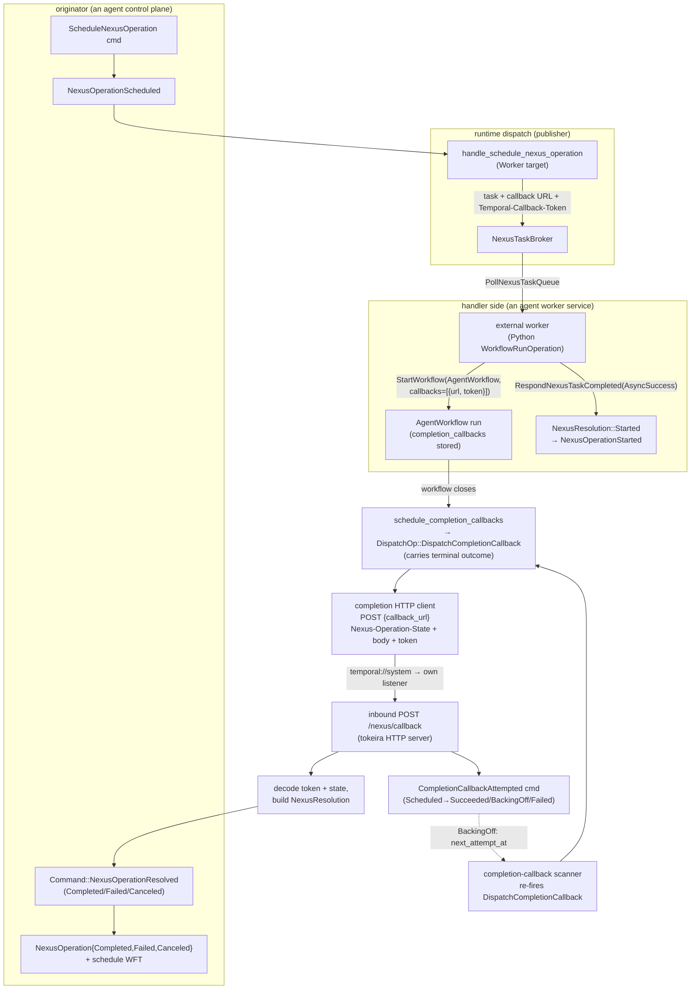

# Design Document — Async Nexus Operation Completion Delivery

## Overview

This design delivers the eventual outcome of an **asynchronous** Nexus operation back to the caller
workflow. When a tokeira workflow schedules a Nexus operation whose handler is a
`WorkflowRunOperation` (the Python guest's `@workflow_run_operation`, or any handler that returns an
operation token), the handler's `StartOperation` returns `AsyncSuccess` — tokeira records
`NexusOperationStarted` and the operation stays pending. The real result arrives only when the
handler-side backing workflow (e.g. a downstream agent framework's run workflow) reaches a terminal state and a
**completion callback** registered on that workflow fires. tokeira does not implement this: the
runtime's `DispatchOp::DispatchCompletionCallback` is a no-op stub, so a started async operation
never resolves and the caller blocks until schedule-to-close timeout.

The design closes that loop along the path v1.31.0 uses, adapted to tokeira's single-cluster,
gRPC-broker Nexus transport:

1. **Outbound attachment** — when tokeira dispatches a Nexus `StartOperation` it sends a callback URL
   and a `Temporal-Callback-Token` so the handler side attaches a completion callback to its backing
   workflow. The URL is a **concrete `http(s)://…/nexus/callback` address** (tokeira's own inbound
   listener), not the `temporal://system` sentinel: the Worker handler POSTs the eventual outcome
   itself, and a Worker SDK rejects a non-HTTP callback scheme ("unknown scheme: temporal://system").
   This is the `UseSystemCallbackURL = false` shape (the callback-URL-template mode,
   `components/nexusoperations/executors.go:122-160 @ v1.31.0`) — tokeira delivers Worker completions
   over HTTP to its own listener rather than via the SDK's system-callback internal route, so it
   resolves the address up front from `NexusCompletionConfig.system_callback_url`. The
   `temporal://system` sentinel remains the *stored* callback URL for an in-cluster handler **workflow**
   (resolved to the same listener at fire time, item 2).
2. **Handler-close firing** — when a tokeira workflow that carries a Nexus completion callback reaches
   a chain-terminal close, the runtime fires the callback: it builds the outcome from the workflow's
   terminal event and, for an in-cluster (`temporal://system`) callback, delivers it **in-process** to
   the originator's pending operation; delivery advances a durable callback lifecycle with bounded
   retry/backoff. Continuation closes preserve the callback in `Standby` for the successor.
3. **Originator resolution** — delivery submits the existing `Command::NexusOperationResolved`
   (`Completed`/`Failed`/`Canceled`) to the originator run, which records the terminal
   `NexusOperation*` event and schedules a workflow task. This reuses the resolution machinery already
   driving `RespondNexusTaskCompleted`.

Ground truth (all `@ v1.31.0`): caller-side callback/token construction in
`components/nexusoperations/executors.go` (`buildCallbackURL`, `CallbackTokenGenerator.Tokenize`);
the token codec in `common/nexus/callback_token.go` (versioned + base64, **not** signed); the
`temporal://system` sentinel and `/nexus/callback` route in `common/nexus/{constants,routes}.go`;
handler-close firing in `components/callbacks/{executors,nexus_invocation,request}.go`; the
outcome→completion mapping in `service/history/workflow/mutable_state_impl.go` (`GetNexusCompletion`:
completed→result payload, failed/canceled→Nexus failure, plus a workflow-event start link); and the
inbound completion handler in `components/nexusoperations/frontend/handler.go`
(`completionHandler.CompleteOperation` → `HistoryClient.CompleteNexusOperation`).

## Requirement refinements (ground-truth corrections)

- **Req 1.5 (token integrity) — corrected to match v1.31.0.** v1.31.0 does **not** sign or encrypt
  the callback token. `CallbackTokenGenerator` is a zero-field struct; `Tokenize` is
  `proto.Marshal(NexusOperationCompletion)` → `base64.URLEncoding` → `{v:1, d}` JSON; decode does only
  a **version check** ("minimal data verification"; the source comments state signing/encryption "will
  come later"). Integrity is enforced **not** by a signature but by the inbound completion validating
  the referenced operation: v1.31.0's token carries a `StateMachineRef` (version + transition count)
  that `CompleteNexusOperation` staleness-checks. tokeira's equivalent already exists —
  `apply_nexus_operation_resolved` fences on `(operation_id, scheduled_event_id)` and rejects
  `StaleNexusResolution`. So this design uses a **versioned, opaque, version-checked** token whose
  integrity rests on op-fencing, matching v1.31.0. Token signing is a future extension (as in
  Temporal).

- **Req 3 (inbound endpoint) — HTTP endpoint IS in scope (decision: build it now).** tokeira stands up
  a real inbound `POST /nexus/callback` HTTP endpoint and fires callbacks over the Nexus completion
  HTTP protocol, matching v1.31.0 (where even a `temporal://system` callback is delivered by an HTTP
  POST to the cluster's own frontend `/nexus/callback`, `request.go routeSystemCallbackRequest @
  v1.31.0`). The `temporal://system` sentinel resolves to tokeira's own HTTP listener address (the
  loopback v1.31.0 performs), so the same endpoint serves in-cluster firing today and external/cross-
  cluster callers later. What remains deferred to `nexus-multi-cluster` is only **cross-cluster
  routing** of the POST (the active-cluster lookup + `FrontendHTTPClientCache` + `forwardCompleteOperation`);
  single-cluster delivery (handler-side firing → own `/nexus/callback` → originator resolution) is
  fully built here.

## Dependencies and Non-Goals

- **Reuses** the resolution path from `edge-nexus-task-transport` / `kernel-nexus-operations`:
  `Command::NexusOperationResolved { resolution: Completed|Failed|Canceled }` → `NexusOperation*`
  terminal event. This design *feeds* that path from the callback; it does not change it.
- **Reuses** the existing `CompletionCallback`/`CallbackState` model in `tokeira-kernel` (state.rs)
  and the on-close `schedule_completion_callbacks` that already emits `DispatchCompletionCallback`.
- **Non-goal:** synchronous completions (`NexusStartResult::SyncCompleted` already resolves inline).
- **Non-goal:** **cross-cluster routing** of the completion POST — the active-cluster lookup,
  `FrontendHTTPClientCache`, and `forwardCompleteOperation` (→ `nexus-multi-cluster`). The inbound
  `/nexus/callback` HTTP endpoint and single-cluster (incl. loopback for `temporal://system`) delivery
  ARE built here.
- **Non-goal:** locally-computed schedule/start-to-close timeouts (existing `nexus_timeout` scanner)
  and outbound cancel-request delivery (existing `handle_cancel_nexus_operation`).
- **Non-goal:** token signing/encryption (future extension, per Req 1.5 refinement).

## Architecture



The originator and the handler workflow may live in **different namespaces**; routing is namespace-
independent because the completion token carries the originator's global `run_key`.

## Components and Interfaces

### 1. Completion token (`tokeira-runtime/src/nexus.rs`)

A new `NexusCompletionToken` carrying exactly what completion delivery needs to address the
originator's pending operation. The v1.31.0 `NexusOperationCompletion` carries
namespace/workflow/run/ref/request_id; tokeira's global `run_key` subsumes the workflow handle.

```rust
/// Routes an async Nexus completion back to the originator's pending operation. Mirrors the role of
/// v1.31.0's `tokenspb.NexusOperationCompletion` (callback_token.go @ v1.31.0): versioned + opaque,
/// verified only by version on decode (not signed — signing is a future extension, per Req 1.5).
#[derive(Clone, Debug, PartialEq, Serialize, Deserialize)]
pub struct NexusCompletionToken {
    pub version: u8,                 // == COMPLETION_TOKEN_VERSION; rejected otherwise
    pub originator_run_key: RunKey,  // global handle → cross-namespace routing
    pub operation_id: String,
    pub scheduled_event_id: i64,
    pub request_id: String,          // wire-parity with NexusOperationCompletion.request_id
}
impl NexusCompletionToken { pub fn encode(&self) -> Result<String>; pub fn decode(s: &str) -> Result<Self>; }
```

Encoding mirrors v1.31.0: a `{v, d}` envelope, `d = base64(serialized inner)`. `decode` rejects a
version mismatch (`InvalidArgument`, matching `DecodeCallbackToken`). The header key constant is
`TEMPORAL_CALLBACK_TOKEN_HEADER = "Temporal-Callback-Token"` and the in-cluster callback URL is
`SYSTEM_CALLBACK_URL = "temporal://system"` (both verbatim from v1.31.0 `common/nexus`).

### 2. Outbound attachment (`tokeira-runtime/src/publisher.rs`, `tokeira-edge/src/translate/nexus.rs`, `nexus_http.rs`)

When a Nexus operation is dispatched, the `StartOperation` request must carry the callback so the
handler attaches it to its backing workflow:

- **Worker target (in scope):** in `handle_schedule_nexus_operation`'s Worker arm, generate a
  `NexusCompletionToken` from the dispatch op's `(originator_run_key, operation_id, scheduled_event_id,
  request_id)` and attach `callback_url = SYSTEM_CALLBACK_URL` + `callback_header = {Temporal-Callback-Token:
  token}` to the published `NexusTask`. The poll-response translation
  (`start_operation_to_proto`) — which today synthesizes **empty** `callback`/`callback_header`
  (edge-nexus-task-transport task 1.4) — is changed to emit these fields so the SDK's
  `WorkflowRunOperation` reads `nexusOptions.CallbackURL`/`CallbackHeader` and registers the callback.
- **External target (interface only; delivery deferred):** `HttpNexusClient::start_operation` gains
  the callback URL + token-header arguments (today it sends none — `runtime-nexus-http-client` Req 1.5
  deviation). Same-cluster External targets can use `SYSTEM_CALLBACK_URL`; real external completion
  delivery is `nexus-multi-cluster`.

`NexusTaskRequest::StartOperation` gains `callback_url: String` and `callback_token: String`
(populated for Worker dispatch). This keeps the broker task self-describing; `NexusTaskToken`
round-trip (the *poll/respond* token) is unchanged.

### 3. Handler-close firing (`tokeira-kernel` + `tokeira-runtime/src/publisher.rs`)

- **Kernel** (`schedule_completion_callbacks`, `transition.rs`): `DispatchOp::DispatchCompletionCallback`
  gains an `outcome: CallbackCompletionOutcome` carrying the terminal result/failure, built from the
  closing event — mirroring `GetNexusCompletion @ v1.31.0`:
  - `WorkflowExecutionCompleted` → `Success { result: Option<Payload> }` (first payload, or nil).
  - `WorkflowExecutionFailed` / `TimedOut` / `Terminated` → `Failure { failure }` (the terminal
    failure; terminated/timed-out synthesize the v1.31.0 failure shape).
  - `WorkflowExecutionCanceled` → `Canceled { failure }` ("operation canceled").
  - `WorkflowExecutionContinuedAsNew`, plus `WorkflowExecutionFailed` or
    `WorkflowExecutionTimedOut` with retry state `InProgress`, produce no callback outcome and no
    dispatch. Temporal carries the callback into the successor on these paths
    (`ApplyWorkflowExecutionContinuedAsNewEvent`, `ApplyWorkflowExecutionFailedEvent`,
    `ApplyWorkflowExecutionTimedoutEvent`, and `retry.go @ v1.31.0`). The kernel may clamp eligibility
    to false here because the closing event contains the authoritative retry/continuation decision.
  This is derived data available at close; including it keeps the kernel free of result-lookup I/O
  and the runtime free of terminal-event interpretation.
- **Runtime** (`DispatchCompletionCallback` handler, replacing the no-op stub): for each callback whose
  `spec` is `CallbackSpec::Nexus { url, header }`, fire it over the **Nexus completion HTTP protocol**
  via a completion client (component 4): `POST {url}` with header `Nexus-Operation-State:
  succeeded|failed|canceled`, the `Temporal-Callback-Token` header (carried from `spec.header`), and a
  body of the result payload (succeeded) or the Nexus failure (failed/canceled), content-type per the
  payload serializer. The `temporal://system` sentinel is resolved to tokeira's own HTTP listener
  address (the loopback v1.31.0 performs via `routeSystemCallbackRequest`). The HTTP response status
  drives the lifecycle (2xx → `Succeeded`; retryable status/transport error → `BackingOff`;
  non-retryable 4xx → `Failed`). External (non-system) URLs are POSTed directly; cross-cluster routing
  of that POST is deferred (`nexus-multi-cluster`).

### 4. Inbound completion HTTP endpoint + outbound completion client (`tokeira-edge`, `tokeira-runtime`, `apps/tokeirad`)

- **Inbound completion HTTP handler** (`tokeira-edge`): a Nexus completion handler mirroring
  `completionHandler.CompleteOperation @ v1.31.0`. It reads the `Temporal-Callback-Token` header
  (decode + version-check → `NexusCompletionToken`), the `Nexus-Operation-State` header, and the body
  (result payload for `succeeded`; Nexus failure for `failed`/`canceled`), maps to a `NexusResolution`,
  and submits `Command::NexusOperationResolved` to the originator's lane. Returns the Nexus handler-
  result status v1.31.0 returns: 2xx on success; `NOT_FOUND`-class handler error for an absent/already-
  resolved originator (so the caller's retry treats it terminal); `BAD_REQUEST` for a missing/
  undecodable token or invalid state. A bad/forged token that decodes but addresses no live pending op
  is rejected by the kernel fencing (`StaleNexusResolution`/`UnknownNexusOperation`) → mapped to the
  not-found handler result.

  **Route set + namespace source (conformance correction).** v1.31.0 serves **two** completion-callback
  routes (`common/nexus/routes.go @ v1.31.0`):
  - `PathCompletionCallbackNoIdentifier` = `/nexus/callback` — identity carried only by the callback
    token in the headers; this is the `temporal://system` loopback path.
  - `RouteCompletionCallback` = `/namespaces/{namespace}/nexus/callback` — namespace in the URL path.

  **The namespace is resolved from the callback *token*, not the URL path.** For BOTH routes the handler
  decodes the token, reads its `NamespaceId`, and `GetNamespaceByID` (absent → a pre-process error +
  `HandlerErrorTypeNotFound, "namespace %q not found"`, `handler.go:98-104,99 @ v1.31.0`); the metric
  `namespace` tag is the *token's* namespace name. On the namespaced route the path namespace is only a
  **cross-check** — `nsName != ns.Name()` → `BAD_REQUEST "invalid callback token"` (`handler.go:140 @
  v1.31.0`). (This corrects an earlier note here that the handler "validates the path namespace exists":
  the path is a cross-check; the token's `NamespaceId` is the authority. The corpus proves it — the
  `…NoIdentifier` variants drive the same not-found/preprocess behaviour from a bad-namespace token on
  the bare route, `tests/nexus_workflow_test.go:1244-1259 @ v1.31.0`.)

  **tokeira scope — completion-handler metric tests are a deliberate deviation, out of public scope.**
  The corpus completion-handler *metric* tests (`TestNexusOperationAsyncCompletion`,
  `TestNexusOperationAsyncFailure`, `TestNexusOperationAsyncCompletionErrors`) decode/mutate/re-encode the
  callback token with Temporal's `CallbackTokenGenerator` and assert on
  `StateMachineRef.MachineInitialVersionedTransition` staleness — i.e. they assert Temporal's **internal**
  `NexusOperationCompletion` proto token wire format and the per-run state-machine staleness model that
  tokeira **deliberately does not adopt** (opaque versioned token + op-fencing as the staleness analogue,
  `tokeira-runtime/src/nexus.rs:523`). The callback token is opaque to real workers (minted by tokeira,
  echoed back, decoded by tokeira — proven by a downstream consumer's round-trip), so it is **not a client-observable
  contract**; only the corpus test constructs/decodes it. These tests are therefore **out of public
  scope** and stay skipped, reclassified as deliberate-deviation. The observable contract (stale/invalid
  completion → not-found; async completion/failure delivery; pre-process errors) is upheld by op-fencing
  and covered by tokeira-owned behavioural tests. tokeira still serves the routes for its own
  single-cluster loopback; the worker-dispatch callback URL and the `temporal://system` loopback both
  target the bare `/nexus/callback` (no namespaced worker template is minted, since the token — not the
  path — would carry identity in a conformant build).

  **Outbound metrics (in scope, honest).** tokeira emits `nexus_outbound_requests` / `nexus_outbound_latency`
  at the genuine caller-side StartOperation sites (mirroring `OutboundRequestCounter`,
  `components/nexusoperations/executors.go:320-331 @ v1.31.0`), tagged `{namespace, destination, method,
  outcome, failure_source}` with the `startCallOutcomeTag` taxonomy — `successful` / `pending` /
  `operation-unsuccessful:<state>` / `handler-error:<TYPE>` (`executors.go:899-933 @ v1.31.0`) — and
  `failure_source` defaulting to `_unknown_` (`worker` only when the worker reported the failure,
  `common/metrics/tags.go:264-268`, `common/nexus/failure.go:25-26 @ v1.31.0`). Two emission sites: the
  **External**-endpoint HTTP `start_operation` (publisher arm; `_unknown_`) and the **Worker**-endpoint
  StartOperation resolved by the worker's `RespondNexusTask{Completed,Failed}` (edge; `worker` on a
  worker-reported failure). This flips the 4 outbound-metric corpus tests
  (`TestNexusOperationSyncNexusFailure`, `TestNexusCallbackAfterCallerComplete`,
  `TestNexus{Sync,Async}OperationErrorRehydration`) honestly.
- **HTTP server wiring** (`apps/tokeirad`): stand up an HTTP/1.1 listener for the Nexus completion
  route alongside the gRPC server (a `hyper`/`axum` service on a configured `nexus_http` address;
  `tonic` already depends on `hyper`). The runtime's completion client resolves `temporal://system`
  to this listener's address. The listener address is config (raise, never hardcode).
- **Outbound completion client** (`tokeira-runtime`): a `NexusCompletionClient` trait + `reqwest`
  implementation (`CompleteOperation`-style: `POST {url}`, state header, token header, payload/failure
  body) reused by the `DispatchCompletionCallback` handler. A `NoopNexusCompletionClient` for tests.

### 5. Wire format (Nexus completion protocol — ground truth)

The POST body/headers follow the Nexus completion wire shape v1.31.0's `CompletionHTTPClient`/
`completionHandler` use: `Nexus-Operation-State` ∈ {`succeeded`,`failed`,`canceled`};
`Temporal-Callback-Token` header; succeeded → result `Payload` body with the payload serializer
content-type; failed/canceled → a Nexus `Failure` body (the originator decodes it back to a kernel
failure payload, reusing the `RespondNexusTaskFailed` failure conversion already in
`translate/nexus.rs`). Links (the workflow-event start link from `GetNexusCompletion`) are carried as
`Nexus-Link` headers; link delivery is best-effort (non-essential to resolution), matching v1.31.0.

### 6. Durable callback lifecycle (`tokeira-kernel` + a runtime scanner)

The `CompletionCallback.state` machine (already `Standby|Scheduled|BackingOff|Failed|Succeeded|Blocked`
in state.rs) becomes load-bearing:

- **Kernel command** `CompletionCallbackAttempted { callback_index, outcome: CallbackAttemptOutcome }`:
  - `Succeeded` → `state = Succeeded` (terminal; never re-fired).
  - `RetryableFailure { failure }` → `state = BackingOff`, `attempt += 1`,
    `last_attempt_failure = failure`, `next_attempt_at = now + backoff(attempt)`.
  - `NonRetryableFailure { failure }` → `state = Failed` (terminal), `last_attempt_failure = failure`.
  `schedule_completion_callbacks` continues to set `Standby → Scheduled` on close and emit the dispatch
  op; the scanner re-emits for `BackingOff` callbacks past `next_attempt_at`.
- **Runtime scanner** (`scan_completion_callbacks_once`, mirroring `scan_nexus_timeouts_once`): a
  volatile index of `(run_key, callback_index)` with `BackingOff` callbacks; on each tick, reload the
  run (history is authority), re-fire `DispatchCompletionCallback` for callbacks whose
  `next_attempt_at` has passed, bounded by `max_per_scan`. The index is rebuilt from durable state on
  shard takeover (like the Nexus timeout index).
- **`next_attempt_at`** and `attempt` persist on `CompletionCallback` (serde; build-phase fold, no
  ALTER).

Backoff defaults come from config (raise, never hardcode — FINDINGS Implementer mandate rule 3):
initial interval, max interval, coefficient, max attempts. v1.31.0 callback retry policy is the
component's default (`components/callbacks`); the concrete values are pinned in the Configuration
section.

### 7. Originator resolution (unchanged; reused)

`Command::NexusOperationResolved` already: looks up the pending op by `(operation_id,
scheduled_event_id)`, fences stale resolutions, emits the terminal `NexusOperation*` event, removes
the pending op, and schedules a WFT (`kernel-nexus-operations`). **Idempotency** falls out of this:
a completion for an already-resolved op is rejected by the kernel (`UnknownNexusOperation` /
already-terminal), which the runtime maps to callback `Succeeded` (the result is already recorded),
recording no second event.

### 8. Observability (`tokeira-edge` Describe)

`DescribeWorkflowExecution` already carries `callbacks` from `WorkflowState.completion_callbacks`;
this design ensures `state`/`attempt`/`last_attempt_failure` are populated through the lifecycle so
the Describe surface reflects delivery progress (Req 6), matching v1.31.0's `callbacks` field.

## Data Models

- `NexusCompletionToken { version, originator_run_key, operation_id, scheduled_event_id, request_id }`
  (runtime; encode/decode; version-checked).
- `CallbackCompletionOutcome { Success { result: Option<Payload> } | Failure { failure: Payload } |
  Canceled { failure: Payload } }` (kernel; on the dispatch op; derived from the closing event).
- `CallbackAttemptOutcome { Succeeded | RetryableFailure { failure: Payload } | NonRetryableFailure {
  failure: Payload } }` (kernel command payload).
- `CompletionCallback` gains `next_attempt_at: Option<OffsetDateTime>` (serde-default; build-phase
  fold). `attempt`, `state`, `last_attempt_failure` already exist.
- `DispatchOp::DispatchCompletionCallback` gains `outcome: CallbackCompletionOutcome` and (already)
  `callback_index`, `callback`.
- `NexusTaskRequest::StartOperation` gains `callback_url: String`, `callback_token: String`.

## Correctness Properties

### Property 1: Outbound StartOperation carries a decodable, version-checked callback token

For any Worker-target Nexus dispatch, the published task's `StartOperation` carries `callback_url ==
SYSTEM_CALLBACK_URL` and a `Temporal-Callback-Token` that decodes to a `NexusCompletionToken` whose
`(originator_run_key, operation_id, scheduled_event_id)` equal the dispatched operation's; a token with
a wrong version is rejected on decode.

**Validates: Requirements 1.1, 1.2, 1.4, 1.5**

### Property 2: A chain-terminal workflow delivers exactly the matching terminal resolution

For a workflow that reaches a chain-terminal close carrying a `temporal://system` Nexus completion
callback, the runtime submits exactly one `NexusOperationResolved` to the originator whose variant
matches the close: completed→`Completed{result}`, non-retrying failed/timed-out/terminated→
`Failed{failure}`, canceled→`Canceled`.

**Validates: Requirements 2.1, 2.2, 2.3, 4.1, 4.2, 4.3**

### Property 3: Delivery is idempotent

Re-delivering a completion for an already-resolved pending operation records no second
`NexusOperation*` event and leaves the callback `Succeeded`; the originator history is identical to a
single delivery.

**Validates: Requirements 5.1, 5.3**

### Property 4: Callback lifecycle is well-formed and bounded

A callback advances `Standby→Scheduled` only on a chain-terminal close; a delivery attempt moves it to
`Succeeded` (terminal), `BackingOff` (with `attempt` incremented and `next_attempt_at` in the future),
or `Failed` (terminal). Every outcome increments `attempt` and records
`last_attempt_complete_time`; success clears the prior failure. A Nexus handler failure is decoded to
the v1.31.0 handler-error text before being persisted. `BackingOff` is re-fired only after
`next_attempt_at` and only up to the configured max attempts; a `Succeeded`/`Failed` callback is never
re-fired.

**Validates: Requirements 2.1, 2.4, 2.5, 2.8, 6.1**

### Property 5: Completion token round-trip

For any `NexusCompletionToken`, `decode(encode(t)) == t`; encoding is the versioned `{v,d}` envelope.

**Validates: Requirements 1.4, 1.5**

### Property 6: Cross-namespace routing

When the handler workflow is in namespace B and the originator is in namespace A, the completion is
delivered to the originator in A (routing keys on the token's `run_key`, not the firing workflow's
namespace).

**Validates: Requirements 4.1, 7.1**

### Property 7: Describe reflects callback state

After a delivery attempt, `DescribeWorkflowExecution.callbacks` reports the callback's current
`state`, one-based `attempt`, `last_attempt_complete_time`, and `last_attempt_failure`; a successful
attempt clears the prior failure.

**Validates: Requirements 6.1**

### Property 8: Fan-out completes

For K async operations started against one handler workflow, when that workflow closes all K
originators receive the matching completion and no started operation is left pending.

**Validates: Requirements 7.1, 7.2, 7.3**

### Property 9: Inbound /nexus/callback endpoint resolves a completion

A `POST /nexus/callback` carrying a valid `Temporal-Callback-Token`, a `Nexus-Operation-State`, and a
result/failure body submits the matching `NexusResolution` to the originator and returns a 2xx; a
missing/undecodable/wrong-version token returns a bad-request handler error and resolves nothing; a
token addressing an absent/already-resolved op returns a not-found handler result and records no
second event.

**Validates: Requirements 3.1, 3.3, 3.4, 3.5, 5.2**

### Property 10: Continuation closes preserve callbacks for the successor

For any `Standby` completion callback, closing by continue-as-new or by a failure/timeout whose retry
state is `InProgress` emits no `DispatchCompletionCallback`, leaves the predecessor's callback
unscheduled, and gives the successor the same callback in `Standby`. A corresponding chain-terminal
close emits exactly one dispatch per `Standby` callback.

**Validates: Requirements 2.1, 2.6, 2.7**

### Property 11: Due callback retries do not head-of-line block

For any two `BackingOff` callbacks whose retry deadlines have passed, the scanner starts both
delivery effects without waiting for either handler response. Holding both responses until both
requests have arrived therefore makes progress rather than deadlocking the scan.

**Validates: Requirement 2.9**

## Error Handling

| Condition | Handling | Source @ v1.31.0 |
|---|---|---|
| Callback token missing / undecodable / wrong version | callback → `Failed` (non-retryable); no resolution submitted | `DecodeCallbackToken` (version check) |
| Originator run absent / pending op already resolved | inbound returns **`404` NotFound**; firing classifies NotFound as non-retryable → callback → `Failed`; **no second terminal event** (idempotent at the operation level — the outcome is already recorded) | `CompletionHandler` maps a closed op's `hsm.ErrInvalidTransition` to `serviceerror.NewNotFound` (`components/nexusoperations/completion.go:198-200 @ v1.31.0`); the firing side treats `NotFound` as non-retryable (`isRetryableCallError` → `HandlerError.Retryable()`, `components/callbacks/nexus_invocation.go @ v1.31.0`) |
| Originator lane submit / POST transient (5xx, transport) | callback → `BackingOff`; retried with bounded backoff | callbacks component retry |
| Workflow failed/timed-out/terminated | `Failure` outcome → `NexusResolution::Failed` | `GetNexusCompletion` failed arm |
| Workflow canceled | `Canceled` outcome → `NexusResolution::Canceled` | `GetNexusCompletion` canceled arm |
| External (non-system) callback URL | POSTed directly; **cross-cluster routing** of the POST deferred to `nexus-multi-cluster` | (deviation) |
| Max attempts exhausted | callback → `Failed` (terminal); logged/metered | callbacks component |

## Configuration

Raise, never hardcode (FINDINGS Implementer mandate rule 3). New `tokeira-config` knobs with
v1.31.0-faithful defaults:

- **Nexus HTTP listener address** — the bind address/port for the inbound `/nexus/callback` server,
  and the address `temporal://system` resolves to for loopback firing. Default: a dedicated loopback
  port co-located with the gRPC frontend.
- **Callback retry policy** — initial interval, max interval, backoff coefficient, max attempts, for
  the `BackingOff` lifecycle. Defaults from the v1.31.0 `components/callbacks` default retry policy.

## Testing Strategy

- **Kernel golden/unit:** `DispatchCompletionCallback` carries the correct `outcome` per close kind
  (completed/failed/canceled/timed-out/terminated); `CompletionCallbackAttempted` transitions
  Standby→Scheduled→{Succeeded|BackingOff|Failed} with attempt/next_attempt_at; closed-run callbacks
  cleared appropriately.
- **Kernel property:** Property 4 (lifecycle), Property 2 (outcome→resolution mapping).
- **Runtime:** in-process delivery submits the matching `NexusOperationResolved`; idempotent
  re-delivery (Property 3); scanner re-fires only past `next_attempt_at` and bounded (mirror the
  nexus-timeout scanner tests); cross-namespace delivery (Property 6). Synchronize on observable state,
  no sleeps.
- **Runtime property:** Property 1 (token on dispatch), Property 5 (token round-trip), Property 8
  (fan-out).
- **Edge:** Describe surfaces callback state (Property 7); `start_operation_to_proto` emits
  callback_url + token (Property 1 at the wire); the inbound `/nexus/callback` handler resolves a
  completion and returns the right status for valid / bad-token / not-found cases (Property 9).
- **HTTP server:** the inbound listener accepts a real `POST /nexus/callback` (state header + token
  header + body) and drives resolution; the completion client POSTs the correct wire shape (round-trip
  the client against the in-process listener).
- **Integration (`apps/tokeirad/tests/`):** the async analogue of the verified sync round-trip —
  schedule an async op, external poller replies `AsyncSuccess`, a second (handler) workflow closes,
  tokeira fires the callback (loopback POST to its own `/nexus/callback`), assert the caller observes
  `NexusOperationCompleted` with the handler's result. Pairs with the pending sync regression test.
- **Conformance (operator-run):** `TestNexusWorkflowTestSuite` async-completion cases; the
  deferred-skip async-completion-callback tests revisited.

## Out of Scope

- **Cross-cluster routing** of the completion POST (active-cluster lookup, `FrontendHTTPClientCache`,
  `forwardCompleteOperation`) — `nexus-multi-cluster`. The inbound endpoint and single-cluster delivery
  (incl. `temporal://system` loopback) are in scope.
- Token signing/encryption (future extension, as in v1.31.0).
- Sync completions; local timeout firing; outbound cancel-request delivery (existing paths).
- The inbound Nexus **StartOperation** HTTP API (external callers invoking tokeira's Nexus services) —
  only the **completion** callback endpoint is added here.

## Change Classification

**Architectural.** Adds: a wire contract (callback URL + completion token on outbound StartOperation);
an **inbound HTTP server** for `POST /nexus/callback` and an outbound Nexus completion HTTP client (new
`hyper`/`axum` server surface — `hyper` is already a `tonic` dependency; `axum` would be a new
dependency to confirm, or hand-rolled `hyper` to avoid it); a kernel command
(`CompletionCallbackAttempted`) and dispatch-op field (`outcome`); a durable callback field
(`next_attempt_at`, build-phase fold); a runtime delivery path + retry scanner; new config (HTTP
listener address, callback retry policy); and a Describe surface. Reuses the existing
`NexusOperationResolved` resolution path and `CompletionCallback` model. The token-not-signed and
HTTP-endpoint-included decisions are recorded under "Requirement refinements."

## Async error rehydration (LANDED 2026-06)

`TestNexusWorkflowTestSuite/TestNexusAsyncOperationErrorRehydration` (corpus, v1.31.0
`tests/nexus_workflow_test.go:2218`) was run out-of-process against `tokeirad` during the
functional-conformance loop. The async completion delivery built by this spec works (the
`StartOperation` reaches "pending"), but all four sub-cases failed on error rehydration. Three
distinct gaps (A + B + C below), now all fixed; the leaf passes all four sub-cases (3× stress)
and is unskipped. Gaps A/B are as originally raised; Gap C is the deeper finding instrumentation
surfaced once the B token fix landed.

### Gap A — completion failure not wrapped in `NexusOperationFailureInfo` (runtime/edge, no kernel)

For `fail` / `wait-terminate` / `timeout`, the caller workflow fails with the **inner** error
(`ApplicationError` / `TerminatedError` / `TimeoutError`) but it is **not** wrapped in a
`NexusOperationError`. Root cause: the inbound completion handler
`tokeira-edge/src/nexus_callback.rs` (the `failed` arm) resolves
`NexusResolution::Failed { failure: failure_body.failure }` with the handler failure **raw**,
unlike every sibling path — `wrap_handler_failure_as_resolution`
(`translate/nexus.rs:441-468`) and `external_handler_error_resolution`
(`publisher.rs` `1267-1304`) — which wrap the cause in
`NexusOperationFailureInfo{endpoint,service,operation,scheduled_event_id}` (outer message
"nexus operation completed unsuccessfully"). The sending side already synthesizes the inner
failure only (`deliver_completion_callback`, `publisher.rs:1079-1091`:
`synth_terminated_failure` / `synth_timed_out_failure` / app-error payload), so the receiver
must wrap.

**Fix (no kernel):** in `nexus_callback.rs`, wrap the decoded completion failure exactly as
`wrap_handler_failure_as_resolution` does. The wrap needs the caller's
endpoint/service/operation, which `handle_nexus_callback` does not currently have
(`runtime: &dyn WorkflowRuntimeApi` only, no `repo`). Cleanest source: carry
endpoint/service/operation on tokeira's own opaque `NexusCompletionToken` (minted at schedule
time in `handle_schedule_nexus_operation` where all three are in scope; `publisher.rs:811`) —
avoids widening `WorkflowRuntimeApi` or loading the run. Decode the failure `Payload` →
`failure_proto::Failure` via `payload_to_failure` (`tokeira-proto/src/conversions/common.rs:50`),
wrap, re-encode. Verified scope: this flips the `fail`/`wait-terminate`/`timeout` sub-cases.

**Token stays opaque/integrity-bound.** The added routing fields are read exactly like the rest
of the `NexusCompletionToken` (decode + version check); they are never operator-forgeable inputs
that could redirect a completion to a different operation. The token remains tokeira's own
opaque blob — this enriches it, it does not adopt Temporal's wire token format.

### Gap B — handler `operation_token` not round-tripped on cancel (kernel field; stop-and-raise)

`wait-cancel` fails with `handler error (BAD_REQUEST): invalid operation token` →
`failed to unmarshal workflow run operation token`. When the caller cancels an async op,
tokeira dispatches `CancelOperation` to the handler but sends **its own `operation_id`** in
place of the handler-issued token (`publisher.rs:916-920`, which explicitly defers "faithful
handler-token persistence" on the false assumption the conformance handler does not gate
cancel on the token). A `temporalnexus.NewWorkflowRunOperation` handler unmarshals the token as
JSON and rejects tokeira's substitute. The handler's token arrives on the `StartOperation`
async response and is emitted to the `NexusOperationStarted` **history event**
(`translate/nexus.rs:261-268`, `kernel.rs:1883-1897`) but is **not** stored on the kernel
`PendingNexusOperation` (`state.rs:590-619` has no `operation_token` field), and the runtime's
projected run state carries no history events — so the cancel dispatch cannot recover it.

**Fix (LANDED):** added `operation_token: String` to `PendingNexusOperation`, set in the
`NexusResolution::Started` arm + the replay `NexusOperationStarted` handler, threaded through
`NexusTaskRequest::CancelOperation` and the External `cancel_operation`, and emitted as the wire
`operation_token` (deprecated `operation_id` field keeps tokeira's id). The handler now accepts
the cancel — but that only changed the symptom (no more `BAD_REQUEST`), surfacing Gap C.

### Gap C — tokeira resolved the caller op on cancel-ack; v1.31.0 decouples it (LANDED)

After Gap B, `wait-cancel` still failed: `fut.Get()` returned **nil** (the op resolved as a
*success*). Temporary tracing showed the caller op was resolved twice — first `Canceled` from
the **cancel-ack** (`respond_nexus_task_completed` → `proto_response_to_resolution`'s
`CancelOperation` arm), then `Canceled` again from the genuine completion when the backing
workflow closed canceled. Two ground-truthed divergences from v1.31.0:

1. **Cancel-ack must not resolve the operation.** v1.31.0 `EventCancelationSucceeded`
   (`components/nexusoperations/statemachine.go:671 @ v1.31.0`) only advances the *cancelation*
   sub-machine; the operation resolves solely via its completion (`GetNexusCompletion`), and a
   completion that already resolved the op wins over a later cancel (`statemachine.go:424`).
   Fix: `proto_response_to_resolution` returns `Option<NexusResolution>` and yields `None` for a
   `CancelOperation` response (ack only); the External cancel path likewise no longer submits
   `NexusResolution::Canceled` (`publisher.rs`). The op resolves only when the backing workflow
   closes.
2. **The `NexusOperationCanceled` event must carry a failure.** Even resolved via the completion,
   tokeira's canceled event had no `failure`, so the SDK's `fut.Get` saw no error and returned
   nil. v1.31.0 records `NexusOperationCanceledEventAttributes.Failure =
   createNexusOperationFailure(op, eventID, CanceledFailureInfo)`
   (`components/nexusoperations/completion.go:88-104 @ v1.31.0`). Fix: carry
   endpoint/service/operation/operation_token on the `NexusOperationCanceled` kernel event (as
   `NexusOperationTimedOut` already does) and have the history serializer build the outer
   `NexusOperationFailureInfo` with a `CanceledFailureInfo` cause. `fut.Get` then returns a
   `NexusOperationError` wrapping a `CanceledError`.

(See the sibling kernel work for `StartOperation` retry state in `.kiro/specs/nexus-retry-policy`.)

**This is contract-matching, not a tokeira invention.** v1.31.0 persists the handler's
operation token in the NexusOperation **mutable-state machine data**, not only on the
`NexusOperationStarted` event — so cancel/get read it from state. tokeira must store it on the
`PendingNexusOperation` for the same reason: the runtime cancel path works off the projected run
state, which carries no history events. `operation_token` is `#[serde(default)]` (additive
read-compat). Note: tokeira already uses the operation id as the async token for the
`TimedOut`/`Canceled` events when the handler issued none (`kernel.rs:1966-1971`); storing the
real handler token makes those faithful too.
