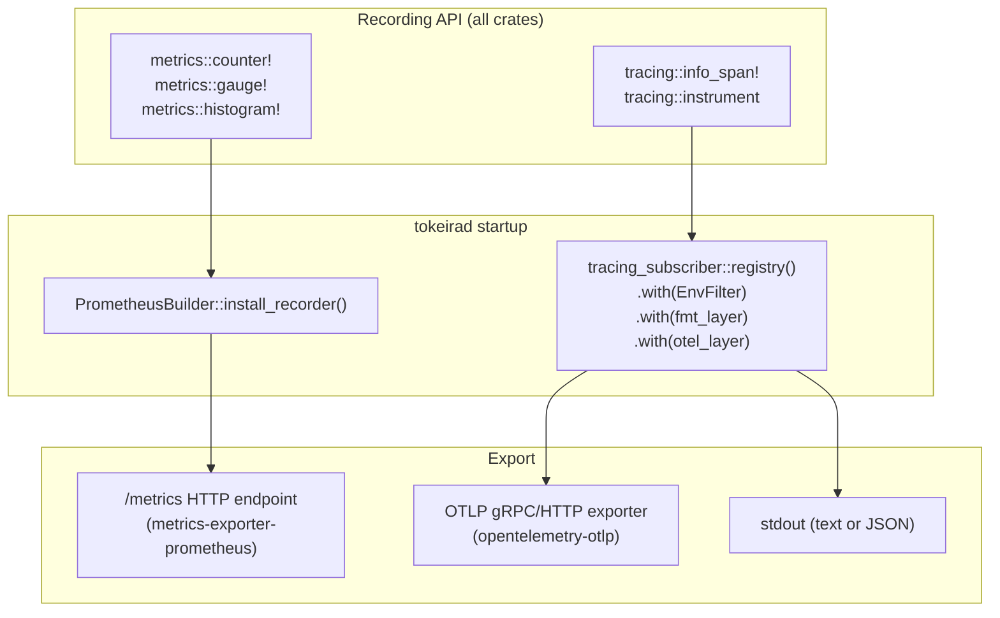
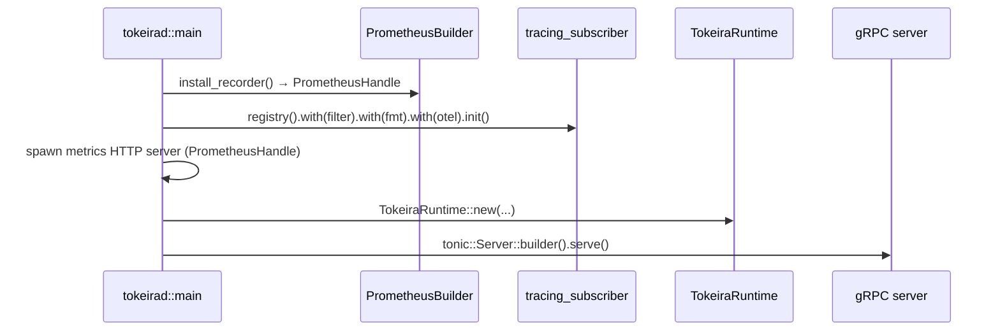

# Design Document: Observability Foundation

## Overview

This design establishes Tokeira's cross-cutting observability infrastructure: metrics recording, Prometheus export, OpenTelemetry tracing, and structured logging. The stack is layered so that recording APIs (`metrics` macros, `tracing` macros) are used by all crates, while subscriber/recorder setup and export configuration live exclusively in `tokeirad`.

The design follows three principles:

1. **Zero-cost when unobserved.** The `metrics` crate's no-op recorder and `tracing`'s compile-time filtering ensure instrumentation adds no overhead when no exporter is installed.
2. **Convention over configuration.** A strict naming pattern (`tokeira_{crate}_{subsystem}_{metric}_{unit}`) and per-crate `metrics.rs` modules make metrics discoverable without a central registry file.
3. **Composition via layers.** `tracing-subscriber`'s layer architecture lets us compose `fmt`, `EnvFilter`, and `tracing-opentelemetry` layers independently — each can be enabled/disabled without affecting the others.

The implementation is phased to match the requirements document:

- **Phase 1:** `metrics` crate integration, Prometheus endpoint, naming conventions
- **Phase 2:** Baseline metrics for kernel, runtime, edge, storage, projection; `DeliveryMetrics` migration
- **Phase 3:** OpenTelemetry tracing via `tracing-opentelemetry`, OTLP export, span conventions
- **Phase 4:** Correlation IDs in logs, JSON log format, per-module log levels with runtime reload

## Architecture



### Crate Dependency Graph

Only `tokeirad` depends on exporter crates. Library crates depend only on the recording APIs:

| Crate | New dependencies |
|---|---|
| `tokeira-kernel` | `metrics` (recording API only) |
| `tokeira-runtime` | `metrics` |
| `tokeira-storage` | `metrics`, `tracing` (already present) |
| `tokeira-edge` | `metrics`, `tracing` (already present), `opentelemetry` (for trace context extraction) |
| `tokeira-projection` | `metrics` |
| `tokeirad` | `metrics-exporter-prometheus`, `tracing-opentelemetry`, `opentelemetry`, `opentelemetry-otlp`, `opentelemetry-sdk` |

### Initialization Sequence



The recorder MUST be installed before any `metrics::counter!()` call. The `metrics` crate guarantees that calls before installation are no-ops, but installing after subsystem startup would lose early metrics. The `tracing_subscriber` registry MUST be initialized before any `tracing::info!()` call (replacing the current `tracing_subscriber::fmt().init()` in `main.rs`).

## Components and Interfaces

### 1. Metrics Initialization (`tokeirad`)

The `PrometheusBuilder` from `metrics-exporter-prometheus` is configured and installed as the global recorder. It returns a `PrometheusHandle` that renders the Prometheus text exposition format on demand.

```rust
// tokeirad/src/observability.rs
use metrics_exporter_prometheus::PrometheusBuilder;

pub struct ObservabilityConfig {
    pub metrics_enabled: bool,
    pub metrics_addr: SocketAddr,       // default: 0.0.0.0:9090
    pub otlp_enabled: bool,
    pub otlp_endpoint: String,          // default: http://localhost:4317
    pub otlp_protocol: OtlpProtocol,    // grpc | http
    pub trace_sample_rate: f64,         // default: 1.0
    pub log_format: LogFormat,          // text | json
}

pub fn install_metrics(config: &ObservabilityConfig) -> Option<PrometheusHandle> {
    if !config.metrics_enabled { return None; }
    let builder = PrometheusBuilder::new();
    let handle = builder.install_recorder()
        .expect("metrics recorder already installed");
    record_build_info();
    Some(handle)
}
```

The metrics HTTP server is a minimal `hyper` or `axum` handler that calls `handle.render()` on each `/metrics` GET request. It runs on a dedicated Tokio task, separate from the gRPC server.

### 2. Per-Crate Metric Modules

Each crate that records metrics defines a `src/metrics.rs` module exporting metric name constants and recording helper functions. The module depends only on the `metrics` crate.

```rust
// tokeira-runtime/src/metrics.rs
use metrics::{counter, gauge, histogram};

/// Broker publish events. Labels: namespace, task_queue, task_type.
pub fn record_broker_publish(namespace: &str, task_queue: &str, task_type: &str) {
    counter!("tokeira_runtime_broker_publish_total",
        "namespace" => namespace.to_owned(),
        "task_queue" => task_queue.to_owned(),
        "task_type" => task_type.to_owned(),
    )
    .increment(1);
}

/// Current queue depth. Labels: namespace, task_queue, task_type, tier.
pub fn set_queue_depth(namespace: &str, task_queue: &str, task_type: &str, tier: &str, depth: f64) {
    gauge!("tokeira_runtime_broker_queue_depth",
        "namespace" => namespace.to_owned(),
        "task_queue" => task_queue.to_owned(),
        "task_type" => task_type.to_owned(),
        "tier" => tier.to_owned(),
    )
    .set(depth);
}
```

The naming validation function lives in a shared location (either `tokeira-types` or a new `tokeira-observability` utility crate) and is called at test time to verify all metric names conform to the convention:

```rust
/// Validates a metric name against the Tokeira naming convention.
/// Pattern: tokeira_{crate}_{subsystem}_{metric}_{unit}
pub fn validate_metric_name(name: &str, metric_type: MetricType) -> Result<(), NamingError> {
    // Must start with "tokeira_"
    // Must have at least 4 segments separated by '_' after the prefix
    // Counter names must end with "_total"
    // Duration histograms must end with "_seconds"
    // Size histograms must end with "_bytes"
}
```

### 3. Tracing Subscriber Composition (`tokeirad`)

The subscriber replaces the current `tracing_subscriber::fmt().init()` with a layered registry:

```rust
// tokeirad/src/observability.rs
pub fn install_tracing(config: &ObservabilityConfig) -> Option<ReloadHandle> {
    let filter = EnvFilter::try_from_default_env()
        .unwrap_or_else(|_| EnvFilter::new("info"));
    let (filter_layer, reload_handle) = tracing_subscriber::reload::Layer::new(filter);

    let fmt_layer = match config.log_format {
        LogFormat::Text => tracing_subscriber::fmt::layer().boxed(),
        LogFormat::Json => tracing_subscriber::fmt::layer().json().boxed(),
    };

    let registry = tracing_subscriber::registry()
        .with(filter_layer)
        .with(fmt_layer);

    if config.otlp_enabled {
        let tracer = init_otlp_tracer(config);
        let otel_layer = tracing_opentelemetry::layer().with_tracer(tracer);
        registry.with(otel_layer).init();
    } else {
        registry.init();
    }

    Some(reload_handle)
}
```

### 4. gRPC Trace Context Propagation (`tokeira-edge`)

A tonic interceptor extracts W3C `traceparent`/`tracestate` headers from incoming gRPC metadata and creates a child span. When no trace context is present, a new root span is created.

```rust
// tokeira-edge/src/grpc/tracing_interceptor.rs
use opentelemetry::propagation::TextMapPropagator;
use opentelemetry_sdk::propagation::TraceContextPropagator;

pub fn extract_trace_context(metadata: &MetadataMap) -> Option<SpanContext> {
    let propagator = TraceContextPropagator::new();
    let extractor = MetadataExtractor(metadata);
    let context = propagator.extract(&extractor);
    // Returns the remote span context if traceparent was present
}
```

For outgoing calls (Nexus HTTP dispatch), the `NexusHttpClient` implementation in `tokeira-runtime` injects the current span context into outgoing HTTP headers using the same propagator. This happens at the runtime boundary, not in the edge layer, because Nexus HTTP dispatch is performed by `RuntimeDispatchPublisher`.

### 5. Correlation ID Formatting

Correlation IDs are injected via a custom `FormatEvent` implementation (not a `Layer::on_event` override, which cannot mutate event fields). The custom formatter wraps the standard `fmt::format::Full` or `fmt::format::Json` formatter and prepends `trace_id` and `span_id` fields by reading the current OpenTelemetry span context from the span extensions.

```rust
// tokeirad/src/correlation_format.rs
use tracing_subscriber::fmt::FormatEvent;

pub struct CorrelationFormat<F> {
    inner: F,
}

impl<S, N, F> FormatEvent<S, N> for CorrelationFormat<F>
where
    F: FormatEvent<S, N>,
    S: Subscriber + for<'a> LookupSpan<'a>,
    N: for<'a> FormatFields<'a> + 'static,
{
    fn format_event(
        &self,
        ctx: &FmtContext<'_, S, N>,
        mut writer: format::Writer<'_>,
        event: &Event<'_>,
    ) -> fmt::Result {
        // Read OtelData from the current span's extensions
        // If present, write trace_id and span_id before delegating to inner
        if let Some(span_ref) = ctx.lookup_current() {
            if let Some(otel_data) = span_ref.extensions().get::<OtelData>() {
                write!(writer, "trace_id={} span_id={} ", otel_data.trace_id, otel_data.span_id)?;
            }
        }
        self.inner.format_event(ctx, writer, event)
    }
}
```

For JSON output, the custom formatter emits `trace_id` and `span_id` as JSON fields within the record object. When no span context is active, the fields are omitted entirely.

### 6. DeliveryMetrics Migration

The existing `DeliveryMetrics` struct in `tokeira-runtime/src/fairness.rs` tracks sync-match/non-sync-match/poll-timeout counts per queue for the fairness control loop. The migration:

1. Replace `DeliveryMetrics::record_sync_match()` etc. with `metrics::counter!()` calls via the new `metrics.rs` module.
2. The fairness control loop needs a snapshot of per-queue counts. Since the `metrics` crate doesn't expose per-label counter reads, maintain a parallel `Arc<DashMap<QueueKey, QueueCounters>>` that the recording functions update alongside the `metrics` calls. The control loop reads from this map.
3. Remove `DeliveryMetrics` and `DeliveryMetricsInner` after the parallel snapshot is wired in.

This preserves the fairness algorithm's behavior while exporting the same data via Prometheus.

## Data Models

### ObservabilityConfig

| Field | Type | Default | Env Var |
|---|---|---|---|
| `metrics_enabled` | `bool` | `true` | `TOKEIRA_METRICS_ENABLED` |
| `metrics_addr` | `SocketAddr` | `0.0.0.0:9090` | `TOKEIRA_METRICS_ADDR` |
| `otlp_enabled` | `bool` | `false` | `TOKEIRA_OTLP_ENABLED` |
| `otlp_endpoint` | `String` | `http://localhost:4317` | `TOKEIRA_OTLP_ENDPOINT` |
| `otlp_protocol` | `OtlpProtocol` | `grpc` | `TOKEIRA_OTLP_PROTOCOL` |
| `trace_sample_rate` | `f64` | `1.0` | `TOKEIRA_TRACE_SAMPLE_RATE` |
| `log_format` | `LogFormat` | `text` | `TOKEIRA_LOG_FORMAT` |
| `log_filter` | `String` | `info` | `RUST_LOG` |

### Metric Name Constants (per crate)

Each crate's `metrics.rs` exports constants following the naming convention:

**tokeira-kernel:**
- `tokeira_kernel_transition_committed_total` (counter) — labels: `namespace`, `command_type`
- `tokeira_kernel_events_emitted_total` (counter) — labels: `event_type`
- `tokeira_kernel_commands_processed_total` (counter) — labels: `command_type`

**tokeira-runtime:**
- `tokeira_runtime_broker_publish_total` (counter) — labels: `namespace`, `task_queue`, `task_type`
- `tokeira_runtime_broker_sync_match_total` (counter) — labels: `namespace`, `task_queue`, `task_type`
- `tokeira_runtime_broker_non_sync_match_total` (counter) — labels: `namespace`, `task_queue`, `task_type`
- `tokeira_runtime_broker_poll_timeout_total` (counter) — labels: `namespace`, `task_queue`, `task_type`
- `tokeira_runtime_broker_queue_depth` (gauge) — labels: `namespace`, `task_queue`, `task_type`, `tier`
- `tokeira_runtime_lane_submit_duration_seconds` (histogram) — labels: `lane_id`
- `tokeira_runtime_scanner_tick_total` (counter) — labels: `scanner_type`, `shard_id`
- `tokeira_runtime_scanner_dispatched_total` (counter) — labels: `scanner_type`, `shard_id`
- `tokeira_runtime_occ_retry_total` (counter) — labels: `outcome`

**tokeira-edge:**
- `tokeira_edge_grpc_request_total` (counter) — labels: `method`, `namespace`, `status`
- `tokeira_edge_grpc_request_duration_seconds` (histogram) — labels: `method`, `namespace`
- `tokeira_edge_grpc_error_total` (counter) — labels: `method`, `namespace`, `error_code`
- `tokeira_edge_grpc_active_requests` (gauge) — labels: `method`

**tokeira-storage:**
- `tokeira_storage_commit_transition_duration_seconds` (histogram) — labels: `namespace`, `outcome`
- `tokeira_storage_load_run_duration_seconds` (histogram)
- `tokeira_storage_read_history_duration_seconds` (histogram)
- `tokeira_storage_operation_total` (counter) — labels: `operation`, `outcome`

**tokeira-projection:**
- `tokeira_projection_records_processed_total` (counter) — labels: `partition_id`
- `tokeira_projection_lag_records` (gauge) — labels: `partition_id`
- `tokeira_projection_sink_write_duration_seconds` (histogram) — labels: `partition_id`
- `tokeira_projection_sink_error_total` (counter) — labels: `partition_id`

### Span Naming Convention

| Layer | Span Name | Key Attributes |
|---|---|---|
| Edge | `grpc.{method}` | `namespace`, `workflow_id`, `method` |
| Runtime | `kernel.transition` | `command_type`, `run_key`, `transition_seq` |
| Storage | `storage.{operation}` | `operation`, `namespace` |

### Histogram Bucket Boundaries

**Latency (seconds):** `[0.001, 0.005, 0.01, 0.025, 0.05, 0.1, 0.25, 0.5, 1.0, 2.5, 5.0, 10.0]`

**Size (bytes):** `[256, 1024, 4096, 16384, 65536, 262144, 1048576]`

### Standard Label Names

| Label | Description | Example |
|---|---|---|
| `namespace` | Temporal namespace | `default` |
| `task_queue` | Task queue name | `my-queue` |
| `operation` | Operation type | `commit_transition` |
| `status` | Outcome | `ok`, `error` |
| `method` | gRPC method | `StartWorkflowExecution` |
| `task_type` | Task type | `workflow`, `activity` |


## Correctness Properties

*A property is a characteristic or behavior that should hold true across all valid executions of a system — essentially, a formal statement about what the system should do. Properties serve as the bridge between human-readable specifications and machine-verifiable correctness guarantees.*

### Property 1: Metric name validation

*For any* metric name string and metric type (counter, gauge, histogram), the `validate_metric_name` function SHALL accept the name if and only if it matches the pattern `tokeira_{crate}_{subsystem}_{metric}_{unit}` AND the suffix matches the metric type (`_total` for counters, `_seconds` for duration histograms, `_bytes` for size histograms).

**Validates: Requirements 1.3.1, 1.3.2**

### Property 2: Metric accounting accuracy

*For any* sequence of N metric-recording operations (counter increments, gauge sets, histogram observations) applied to a test recorder, the recorded metric value SHALL equal the expected aggregate: counters equal the sum of increments, gauges equal the last set value, and histograms contain exactly N observations.

**Validates: Requirements 2.1.2, 2.2.5, 2.4.4, 2.6.1**

### Property 3: Fairness control loop equivalence

*For any* sequence of delivery events (sync-match, non-sync-match, poll-timeout) applied to a set of queues, the drain share computed by `evaluate_drain_share` using the new metrics-backed snapshot SHALL produce the same value as the drain share computed using the legacy `DeliveryMetrics` snapshot.

**Validates: Requirements 2.7.2**

### Property 4: W3C trace context extraction round-trip

*For any* valid W3C `traceparent` header value (version-00, valid trace ID, valid span ID, valid flags), extracting the trace context via `extract_trace_context` and then injecting it back via the `TraceContextPropagator` SHALL produce a `traceparent` header with the same trace ID and span ID.

**Validates: Requirements 3.2.1**

### Property 5: JSON log record validity

*For any* log event with arbitrary message content, level, and target, when the JSON log format is active, the emitted output SHALL be a valid JSON object containing at minimum the fields `timestamp`, `level`, `target`, and `message`.

**Validates: Requirements 4.2.2**

## Error Handling

### Metrics Recording Failures

The `metrics` crate is designed to never panic on recording calls. If no recorder is installed, calls are no-ops. If the Prometheus exporter encounters an internal error during rendering, the `/metrics` HTTP handler returns a 500 status with an error message — it does not crash the process.

### OTLP Export Failures

When the OTLP endpoint is unreachable:
- The `opentelemetry-otlp` batch exporter retries with exponential backoff (default: 3 retries).
- After exhausting retries, spans are dropped silently.
- A `tracing::warn!` is emitted on the first drop event per flush cycle to avoid log flooding.
- The hot path is never blocked — the batch exporter runs on a dedicated Tokio task and communicates via a bounded channel. If the channel is full, new spans are dropped.

### Subscriber Initialization Failures

If `install_recorder()` fails (e.g., a recorder is already installed), `tokeirad` panics at startup. This is intentional — running without metrics when metrics are configured is an operator error that should be caught immediately.

If the OTLP tracer fails to initialize (e.g., invalid endpoint URL), `tokeirad` logs a warning and falls back to the non-OTLP subscriber stack. Tracing degradation is acceptable; total startup failure is not.

### Prometheus HTTP Server Failures

If the metrics HTTP listener fails to bind (e.g., port already in use), `tokeirad` logs an error and continues without the metrics endpoint. The metrics are still recorded internally — only the scrape endpoint is unavailable. This matches the principle that observability failures should not block the primary workload.

## Testing Strategy

### Property-Based Tests

Property-based tests use the `proptest` crate (already available in the workspace for `tokeira-runtime` fairness tests). Each property test runs a minimum of 100 iterations.

| Property | Test Location | Generator Strategy |
|---|---|---|
| Property 1: Metric name validation | `tokeira-types/src/metrics_naming.rs` (or shared observability crate) | Generate random strings with varying segment counts, prefixes, and suffixes. Include valid names, names with wrong prefixes, wrong suffixes, too few segments. |
| Property 2: Metric accounting accuracy | `tokeira-runtime/tests/metrics_accounting.rs` | Generate random sequences of (operation_type, count) pairs. Install a `metrics` `DebuggingRecorder` or `SharedString`-based test recorder, replay the sequence, assert aggregates match. |
| Property 3: Fairness equivalence | `tokeira-runtime/tests/fairness_migration.rs` | Reuse the existing `arb_metrics()` strategy from `fairness.rs`. Generate random `QueueMetricsSnapshot` values, compute drain shares via both old and new paths, assert equality. |
| Property 4: Trace context round-trip | `tokeira-edge/tests/trace_context.rs` | Generate random 16-byte trace IDs, 8-byte span IDs, and flag bytes. Format as `traceparent`, extract, re-inject, assert trace ID and span ID are preserved. |
| Property 5: JSON log validity | `tokeirad/tests/json_logging.rs` | Generate random log messages (including special characters, unicode, newlines), emit via `tracing::info!`, capture output, parse as JSON, assert required fields exist. |

### Unit Tests (Example-Based)

- **Build info metric:** Verify `tokeira_build_info` gauge exists with `version`, `commit`, `rustc_version` labels after initialization.
- **Histogram buckets:** Verify latency and size bucket constants match the documented values.
- **Standard labels:** Verify label name constants (`namespace`, `task_queue`, `operation`, `status`) are defined.
- **Disabled exporter:** Verify `tokeirad` starts without binding the metrics port when `TOKEIRA_METRICS_ENABLED=false`.
- **OTLP disabled:** Verify the OpenTelemetry layer is not installed when `TOKEIRA_OTLP_ENABLED=false`.
- **Root span creation:** Verify a new root span is created when no `traceparent` header is present.
- **Span naming:** Verify span names match `grpc.{method}`, `kernel.transition`, `storage.{operation}`.
- **Text format default:** Verify text log format is used when `TOKEIRA_LOG_FORMAT` is unset.
- **Default log level:** Verify `info` level is the default when `RUST_LOG` is unset.
- **Correlation ID omission:** Verify `trace_id`/`span_id` are absent from logs emitted outside a span context.

### Integration Tests

- **Prometheus scrape:** Start `tokeirad`, record a metric, HTTP GET `/metrics`, verify the metric appears in Prometheus text format.
- **Span hierarchy:** Make a gRPC `StartWorkflowExecution` call, capture exported spans via an in-memory OTLP collector, verify the span tree: `grpc.StartWorkflowExecution` → `kernel.transition` → `storage.commit_transition`.
- **Runtime reload:** Change log level via the reload handle, verify the new level takes effect for subsequent log events.
- **DeliveryMetrics removal:** Verify the fairness control loop continues to adjust drain shares correctly after the migration (run the existing `control_loop_tick` tests against the new metrics path).
