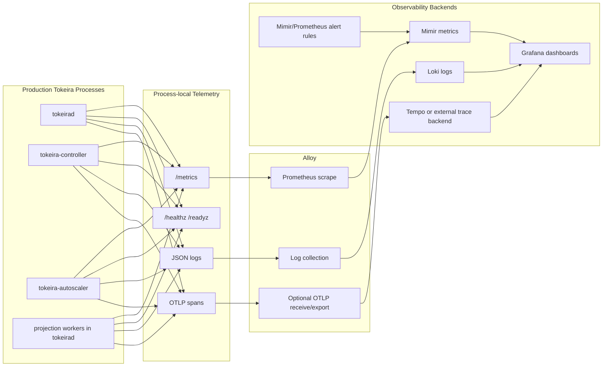
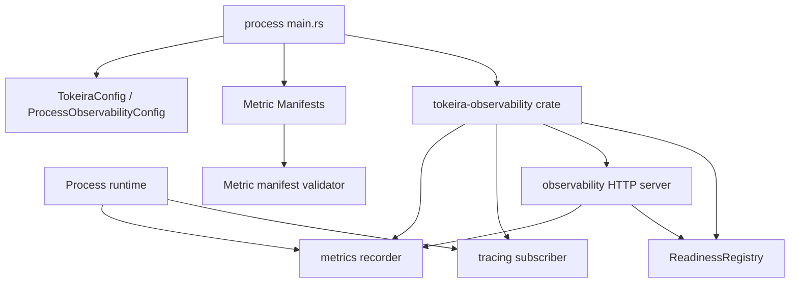

# Design Document

## Overview

This design implements production-facing observability for the full Tokeira ECS deployment surface:

- `tokeirad` — edge, runtime, kernel invocation, and storage access.
- `tokeira-controller` — placement, routing snapshot generation, drain coordination, and connection budget allocation.
- `tokeira-autoscaler` — scaling loops, runtime scale-out, runtime retirement, and active reconciler ownership.
- projection workers — visibility projection workers, currently embedded in `tokeirad`.
- Observability infrastructure — Alloy, Mimir, Loki, Grafana, and optional OTLP trace backends such as Tempo or an externally provided backend.

The design builds on the existing observability foundation already present in the repository:

- `apps/tokeirad/src/observability.rs` currently installs Prometheus metrics, tracing, OTLP span export, JSON/text logging, `/metrics`, `/config`, and `/loglevel`.
- `apps/tokeirad/src/correlation_format.rs` currently enriches logs with trace correlation fields.
- `crates/tokeira-types/src/observability.rs` currently defines metric naming validation and shared histogram buckets.
- `crates/tokeira-runtime/src/metrics.rs`, `crates/tokeira-storage/src/metrics.rs`, `crates/tokeira-edge/src/metrics.rs`, and `crates/tokeira-projection/src/metrics.rs` currently expose metric manifests and recorder helpers.
- `crates/tokeira-edge/src/grpc/tracing_interceptor.rs` and runtime publisher code already propagate W3C trace context.

The main implementation strategy is to extract and generalise the existing `tokeirad` observability machinery into a shared crate, then use it consistently from every production process. Metrics are recorded through the existing `metrics` facade. Tracing uses `tracing`, `tracing-subscriber`, `tracing-opentelemetry`, and `opentelemetry-otlp`. Logs are emitted through `tracing_subscriber` in JSON mode for production. Alloy is responsible for scraping metrics, collecting logs, and forwarding telemetry to Mimir/Loki and optional trace backends.

Projection currently runs embedded in `tokeirad`. The per-process telemetry requirement for projection workers is satisfied by `tokeirad`'s existing metrics endpoint exposing projection metrics. A standalone projection binary is a future packaging concern and is not required by this spec.

Log and metric retention is configured at the Mimir/Loki infrastructure level, not by Tokeira processes. The compose platform defaults to 7 days; ECS deployments configure retention through the ECS infrastructure modules.

This feature deliberately does not turn observability into business logic. Instrumentation must remain low overhead, bounded-cardinality, cancellable-safe, and testable.

## Goals

1. Every production process exposes independent `/metrics`, `/healthz`, and `/readyz` endpoints.
2. Every production process emits structured JSON logs in production mode, with trace correlation fields when available.
3. Trace context is propagated through gRPC, edge, runtime, kernel, and storage boundaries.
4. Metrics are governed by manifests that define metric type, allowed labels, label cardinality, and naming validation.
5. DSQL connection, retry, reservoir, rate-limiter, class-budget, migration, and leak signals are fully instrumented.
6. Controller, autoscaler, projection worker, runtime, and edge signals are exposed through bounded metrics and structured logs.
7. Compose and ECS platforms provision Alloy, Mimir, Loki, Grafana dashboards, alert rules, and runbook links.
8. `tkr observability check` verifies that the telemetry path is working end-to-end.

## Non-Goals

1. This design does not require a trace backend to be enabled by default. Trace export remains configurable and disabled unless configured.
2. This design does not require per-workflow or per-run metrics labels. High-cardinality workflow identifiers remain logs/span fields, not metric labels.
3. This design does not implement a general-purpose metrics DSL. It extends the existing manifest approach with typed descriptors.
4. This design does not require Grafana-managed alerting. Alert rules are generated as Prometheus/Mimir-compatible rules files.
5. This design does not replace existing `metrics` macro usage; it standardises wrappers and validation around it.

## Architecture

### High-Level Telemetry Flow



### In-Process Architecture



## Component Design

### 1. Shared `tokeira-observability` crate

Add a new workspace crate:

```text
crates/tokeira-observability/
  Cargo.toml
  src/
    lib.rs
    config.rs
    metrics.rs
    manifest.rs
    labels.rs
    http.rs
    logging.rs
    tracing.rs
    readiness.rs
    redaction.rs
    shutdown.rs
    testing.rs
```

This crate is used by:

- `apps/tokeirad`
- `apps/tokeira-controller`
- `apps/tokeira-autoscaler`
- projection workers through `tokeirad` today; a standalone `apps/tokeira-projection` wrapper is future work
- library crates that need shared metric descriptors, labels, or test helpers

The crate must have no dependency on Tokeira runtime/storage internals. It may depend on `tokeira-types` and `tokeira-config` only for shared identifiers/configuration, if that does not introduce cycles.

#### Public API

```rust
pub struct ProcessObservabilityConfig {
    pub service_name: ServiceName,
    pub cluster_name: String,
    pub deployment_name: String,
    pub node_id: Option<String>,
    pub task_id: Option<String>,
    pub metrics_enabled: bool,
    pub metrics_addr: SocketAddr,
    pub log_format: LogFormat,
    pub log_filter: String,
    pub otlp_metrics: OtlpMetricsConfig,
    pub tracing: TraceExportConfig,
    pub shutdown_flush_timeout: Duration,
}

pub enum ServiceName {
    // Projection metrics are exposed through Tokeirad until a standalone
    // projection binary exists.
    Tokeirad,
    Controller,
    Autoscaler,
}

pub enum LogFormat {
    Text,
    Json,
}

pub struct OtlpMetricsConfig {
    pub enabled: bool,
    pub endpoint: Option<String>,
    pub protocol: OtlpProtocol,
    pub max_buffered_batches: usize,
    pub export_interval: Duration,
}

pub struct TraceExportConfig {
    pub enabled: bool,
    pub endpoint: Option<String>,
    pub protocol: OtlpProtocol,
    pub head_sample_rate: f64,
    pub error_biased_sampling: bool,
}

pub enum OtlpProtocol {
    Grpc,
    Http,
}

pub struct ObservabilityRuntime {
    pub metrics_handle: Option<PrometheusHandle>,
    pub log_reload: tracing_subscriber::reload::Handle<EnvFilter, tracing_subscriber::Registry>,
    pub http_task: tokio::task::JoinHandle<Result<(), ObservabilityError>>,
    pub shutdown: ObservabilityShutdown,
}

#[derive(Debug, thiserror::Error)]
pub enum ObservabilityError {
    #[error("metrics recorder installation failed: {0}")]
    RecorderInstall(String),
    #[error("OTLP exporter configuration failed: {0}")]
    OtlpConfig(String),
    #[error("tracing subscriber installation failed: {0}")]
    TracingInstall(String),
}

pub async fn install_observability(
    config: ProcessObservabilityConfig,
    manifests: &'static [&'static MetricManifest],
    readiness: ReadinessRegistry,
) -> Result<ObservabilityRuntime, ObservabilityError>;
```

The shared observability crate is a library crate, so public APIs return `Result<T, ObservabilityError>` and define errors with `thiserror`. Binary crates such as `tokeirad`, `tokeira-controller`, and `tokeira-autoscaler` convert those errors to `anyhow` at their call sites with `.context(...)`.

`install_observability` performs these actions in order:

1. Validate all provided metric manifests.
2. Install the global `metrics` recorder if metrics are enabled.
3. Register build/process metadata gauges.
4. Install W3C TraceContext propagation.
5. Install `tracing_subscriber` with JSON or text formatting.
6. Install OTLP span exporter if trace export is enabled.
7. Validate Phase 2 OTLP metrics configuration if present. Do not install a Rust-side OTLP metrics exporter in Phase 1.
8. Spawn an HTTP observability server exposing `/metrics`, `/healthz`, `/readyz`, `/config` if supplied, and `/loglevel` where enabled.

Only one global `metrics` recorder and one global tracing subscriber can be installed per process. The function must return a clear error if called twice.

### 2. Metric manifest model

The existing `METRIC_NAMES: &[(&str, MetricType)]` pattern is not sufficient for cardinality governance. Replace or extend it with typed descriptors while keeping compatibility helper methods for existing tests.

#### Data Types

```rust
#[derive(Clone, Copy, Debug, PartialEq, Eq)]
pub enum MetricType {
    Counter,
    Gauge,
    Histogram,
    DurationHistogram,
    SizeHistogram,
    RatioGauge,
    InfoGauge,
}

#[derive(Clone, Copy, Debug, PartialEq, Eq)]
pub enum LabelCardinality {
    BoundedEnum,
    BoundedNumericRange,
    ConfigurationBounded,
    UnboundedForbidden,
}

#[derive(Clone, Debug, PartialEq, Eq)]
pub struct LabelDescriptor {
    pub name: &'static str,
    pub cardinality: LabelCardinality,
    pub allowed_values: &'static [&'static str],
    pub max_cardinality_hint: Option<usize>,
    pub description: &'static str,
}

#[derive(Clone, Debug, PartialEq, Eq)]
pub struct MetricDescriptor {
    pub name: &'static str,
    pub metric_type: MetricType,
    pub unit: Option<&'static str>,
    pub description: &'static str,
    pub labels: &'static [LabelDescriptor],
}

#[derive(Clone, Debug)]
pub struct MetricManifest {
    pub crate_name: &'static str,
    pub metrics: &'static [MetricDescriptor],
}
```

#### Validation Rules

Metric validation must reject:

- Names without the `tokeira_` prefix.
- Counter names not ending in `_total`.
- Duration histogram names not ending in `_seconds`.
- Size histogram names not ending in `_bytes`.
- Ratio gauge names not ending in `_ratio`.
- Metadata gauge names not ending in `_info`, except explicitly exempted legacy names such as `tokeira_build_info`.
- Label names not in snake case.
- Undeclared labels in typed recording helpers.
- Labels with unbounded values such as `workflow_id`, `run_id`, `request_id`, `trace_id`, raw SQL text, raw error messages, node endpoint, task ARN, or arbitrary user input.

The validation code should live in `tokeira-types` if it remains dependency-light, or in `tokeira-observability` if it needs richer helper types. Library crate tests should call the same validation function.

#### Compatibility

Existing `METRIC_NAMES` constants may be retained temporarily as:

```rust
pub const METRIC_NAMES: &[(&str, MetricType)] = manifest_metric_names(METRIC_MANIFEST);
```

If const conversion is awkward, keep both constants during migration and add a test that they match.

#### Metric Name Compatibility

Existing emitted metric names are authoritative. This spec must not rename production metrics unless the same change atomically updates dashboards, alert rules, runbooks, smoke tests, and autoscaler query references.

The compatibility table is maintained from source by grepping metric constants, `counter!`, `gauge!`, and `histogram!` call sites, dashboard JSON, alert rules, and autoscaler query strings.

| Proposed or historical spec name | Authoritative emitted name | Label changes | Notes |
| --- | --- | --- | --- |
| `tokeira_edge_grpc_requests_total` | `tokeira_edge_grpc_request_total` | Add `service` label; preserve existing `method`, `namespace`, `status`. | Existing edge metric and dashboards use singular `request`. |
| `tokeira_edge_grpc_request_duration_seconds` | `tokeira_edge_grpc_request_duration_seconds` | Add `service` label; preserve existing `method`, `namespace`. | Label addition distinguishes edge service surfaces without renaming the metric. |
| `tokeira_projection_lag_records` | `tokeira_projection_worker_lag_records` | None. | Existing projection worker lag gauge. |
| `tokeira_projection_batch_apply_duration_seconds` | `tokeira_projection_sink_write_duration_seconds` | None. | Existing sink write duration signal; add a separate batch metric only with manifest and dashboard updates. |
| `tokeira_projection_records_processed_total` | `tokeira_projection_records_processed_total` | Add bounded `outcome` label; preserve existing `partition_id`. | Label addition is backward-compatible because aggregate queries roll up across `outcome`. |
| `tokeira_projection_sink_errors_total` | `tokeira_projection_sink_error_total` | Add bounded `error_kind` label; preserve existing `partition_id`. | Existing projection sink error counter uses singular `error`. |
| `tokeira_storage_dsql_operation_retry_attempts` | `tokeira_storage_dsql_commit_retries` | None. | Existing retry distribution metric is unitless and intentionally not suffixed `_seconds`. |
| `tokeira_storage_dsql_commit_duration_seconds` | `tokeira_storage_dsql_operation_duration_seconds` and `tokeira_storage_dsql_statement_duration_seconds` | None. | Existing code records operation-level and statement-level duration rather than a separate commit-duration metric. |
| `tokeira_dsql_reservoir_*` | Existing `tokeira_dsql_pool_*` metrics where present | None. | The reservoir redesign preserved existing pool metric names for dashboard compatibility. |

Label additions are backward-compatible: existing queries that do not filter on the new label aggregate across its values. Dashboard panels, alert rules, and manifest descriptors should still be updated in the same task that adds each label so the documented surface matches emitted telemetry.

### 3. Typed label enums and recorders

Add bounded enums for high-risk labels. These should live close to the metric domain if they are domain-specific, or in `tokeira-observability::labels` if shared.

```rust
pub enum OutcomeLabel {
    Success,
    Failure,
    Exhausted,
    NotRetried,
    Skipped,
    RolledBack,
    Accepted,
    Rejected,
    Timeout,
    Conflict,
    Error,
}

pub enum DbClassLabel {
    Control,
    Commit,
    Read,
    Projection,
    Maintenance,
}

pub enum AutoscalerLoopLabel {
    Replica,
    ScaleOut,
    Retirement,
}

pub enum ScalingDirectionLabel {
    Up,
    Down,
    Hold,
}

pub enum StorageOperationLabel {
    CommitTransition,
    LoadRun,
    ResolveCurrentExecution,
    AppendProjectionRecord,
    AcquireLease,
    RenewLease,
    ListBundleLeases,
    ApplyMigration,
}
```

Each enum implements:

```rust
impl AsRef<str> for OutcomeLabel { ... }
```

Recording helpers should accept these enums rather than arbitrary strings for cardinality-sensitive labels.

Existing labels are classified instead of rejected wholesale. `namespace` and `task_queue` are configuration-bounded labels with documented operator-owned limits. `partition_id`, `shard_id`, and `lane_id` are configuration-bounded by projection partition count, shard count, and lane count. `worker_instance_key` is unbounded-but-accepted because the heartbeat store has a hard 1M entry cap and the metric is operationally useful for identifying stale workers. Truly unbounded labels such as workflow IDs, run IDs, request IDs, trace IDs, raw SQL, and raw errors remain prohibited.

### 4. Process observability endpoints

The shared HTTP server replaces duplicated per-app code and exposes:

| Endpoint | Method | Purpose | Notes |
|---|---:|---|---|
| `/metrics` | GET | Prometheus exposition | Returns `200` even when no samples exist. |
| `/healthz` | GET | Liveness | Returns `200` if event loop and process are alive. |
| `/readyz` | GET | Readiness | Returns `200` only when readiness checks pass. |
| `/config` | GET | Redacted effective config | Optional; disabled or protected in future if needed. |
| `/loglevel` | PUT | Dynamic log filter reload | Optional; accepts an `EnvFilter` string. |

#### HTTP Response Rules

- `/metrics` returns `text/plain; version=0.0.4`.
- `/healthz` returns JSON: `{"status":"ok","service":"..."}`.
- `/readyz` returns JSON with overall status and per-check results.
- Non-existent paths return `404`.
- Invalid `/loglevel` values return `400`.
- Redacted config serialization failures return `500` and a sanitized message.

### 5. Readiness model

Readiness is process-specific but implemented through a shared registry.

```rust
#[async_trait]
pub trait ReadinessCheck: Send + Sync {
    fn name(&self) -> &'static str;
    async fn check(&self) -> ReadinessResult;
}

pub struct ReadinessResult {
    pub status: ReadinessStatus,
    pub message: Option<String>,
    pub checked_at: SystemTime,
    pub latency: Duration,
}

pub enum ReadinessStatus {
    Ready,
    Degraded,
    NotReady,
}

#[derive(Clone)]
pub struct ReadinessRegistry {
    checks: Arc<Vec<Arc<dyn ReadinessCheck>>>,
}
```

#### Required Checks

`tokeirad`:

- Storage connectivity check.
- Runtime service loop check.
- Edge listener check.
- Routing/ownership availability check where applicable.
- Projection sink connectivity only if embedded projection is enabled.

`tokeira-controller`:

- Placement state store connectivity.
- Ability to read bundle leases.
- Routing snapshot publication health.

`tokeira-autoscaler`:

- Mimir query health.
- ECS control-plane reachability in ECS deployments.
- Active reconciler lease state if enabled.

Projection workers hosted by `tokeirad`:

- Storage read health.
- Visibility sink write health.
- Checkpoint persistence health.

Readiness failure must not crash the process. It affects `/readyz`, ECS health checks, and dashboards.

### 6. Structured logging

Production logs are JSON by default for ECS and Compose production profiles. Text logs remain available for local developer ergonomics.

#### Required Fields

Every structured log record must include:

- `timestamp`
- `level`
- `target`
- `message`
- `service`
- `cluster`
- `deployment`
- `node_id` if available
- `task_id` if available
- `trace_id` and `span_id` if a current span exists

Workflow-related logs may include these as structured fields, not Loki labels:

- `namespace`
- `workflow_id`
- `run_id`
- `workflow_type`
- `task_queue`
- `shard_id`
- `bundle_id`
- `request_id`

Sensitive values must never be logged:

- passwords
- tokens
- secret ARNs containing secret names if considered sensitive
- connection strings
- AWS credentials
- SQL text containing user values
- raw error messages that include credentials

Use sanitized `error_kind`, SQLSTATE, and bounded operation labels for metrics. Raw error details may be logged only after redaction.

### 7. Tracing design

#### Propagation

Use W3C TraceContext propagation globally:

```rust
global::set_text_map_propagator(TraceContextPropagator::new());
```

Existing edge gRPC interceptors should continue extracting inbound trace context from metadata. Runtime publisher and internal RPC clients should inject trace context into outbound metadata.

Runtime lane dispatch uses Tokio channels, which do not implicitly preserve the current span context. The lane command envelope carries best-effort trace context by embedding `origin_trace_id: Option<[u8; 16]>` and `origin_span_id: Option<[u8; 8]>` captured at dispatch time rather than a `tracing::Span` handle. On receive, the lane executor creates a new processing span and records `origin_trace_id` and `origin_span_id` as hex-encoded span attributes. This provides correlation without requiring parent-child span linking through the `tracing` API. If the OpenTelemetry layer is active, it can use these attributes to construct proper span links at export time. Do not attempt to use `tracing::Span::follows_from` with reconstructed IDs; the tracing API does not support that.

#### Span Boundaries

Use explicit `tracing::span!` for hot or cancellable paths:

- storage commit paths
- DSQL checkout paths
- reservoir refill loops
- runtime lane execution
- workflow task dispatch
- activity dispatch
- timer processing
- projection batch application

Use `#[instrument]` only for low-concurrency entry points:

- gRPC handler entry
- controller placement loop iteration
- autoscaler control loop iteration
- CLI command entry

#### Required Span Attributes

Edge gRPC ingress spans:

- `rpc.system = "grpc"`
- `rpc.service`
- `rpc.method`
- `server.address` where available
- `tokeira.namespace` when known
- `tokeira.request_id` when available

Runtime spans:

- `tokeira.lane_id`
- `tokeira.shard_id`
- `tokeira.bundle_id`
- `tokeira.command_type`
- `tokeira.run_id` as span attribute only, not metric label
- `tokeira.workflow_type`
- `tokeira.transition_number`

Storage spans:

- `tokeira.storage_operation`
- `tokeira.dsql_class`
- `tokeira.occ_retries`
- `db.system = "aws_dsql"` or `db.system = "postgresql"` if using Postgres-compatible local storage
- `db.operation.name` when known

Controller spans:

- `tokeira.controller.loop = "placement"`
- `tokeira.routing_generation`
- `tokeira.bundle_count`
- `tokeira.node_count`

Autoscaler spans:

- `tokeira.autoscaler.loop`
- `tokeira.scaling_direction`
- `tokeira.scaling_reason`
- `tokeira.metric_freshness_age_seconds`

Projection spans:

- `tokeira.partition_id`
- `tokeira.batch_size`
- `tokeira.checkpoint_sequence`
- `tokeira.sink`

#### Sampling

The first implementation uses parent-based head sampling. Error-biased sampling is implemented by forcing error spans to be recorded and exporting traces for operationally significant failures where the SDK supports it. If the selected OpenTelemetry SDK cannot retroactively force sample a trace, the implementation must document this and implement the closest supported behaviour:

- always record error logs with trace IDs;
- always increment error metrics;
- ensure head sample rate can be set to `1.0` during incidents;
- add tests for configured sampling decisions where possible.

Operationally significant failures:

- storage commit errors
- OCC retry exhaustion
- `NotShardOwner`
- projection sink failures
- migration failures
- controller placement errors
- autoscaler reconciliation errors

### 8. OTLP metrics export

Prometheus scrape is the primary metrics path for Compose and ECS. OTLP metrics push is a Phase 2 capability. Phase 1 validates and completes the Prometheus surface.

TODO(phase-2-otlp-metrics): the current `metrics` crate global recorder pattern does not support dual export to Prometheus scrape and OTLP push without either a fanout recorder or a bridge. Phase 2 design options:

1. `metrics-util` fanout recorder wrapping both the Prometheus recorder and an OTLP recorder.
2. Alloy remote-write to an OTLP-compatible endpoint.
3. A periodic scrape-and-push bridge.

Option 2 is preferred because it requires no Rust code changes: Alloy already owns metrics collection and can bridge Prometheus-style telemetry to compatible backends.

Required runtime behaviour:

- Endpoint unreachable: retry with exponential backoff.
- Buffer full: drop oldest batch and increment `tokeira_otlp_metrics_dropped_batches_total{service=...}`.
- Graceful shutdown: flush pending batches within `shutdown_flush_timeout`.

### 9. Build and process metadata metrics

Every process registers:

```text
tokeira_build_info{version,commit,rustc_version,service} 1
tokeira_process_metadata_start_time_seconds{service,cluster,deployment} <unix_timestamp>
```

Optional ECS/environment metadata labels:

- `cluster`
- `deployment`
- `node_id`
- `task_id`

These optional labels must be bounded by process identity. Do not include full ECS task ARN unless explicitly reduced to a bounded/stable task id field.

### 10. DSQL instrumentation

DSQL metrics live in `crates/tokeira-storage/src/metrics.rs` and typed helpers live in the same module or a `metrics/` submodule.

#### OCC and Retry

Record:

- `tokeira_storage_dsql_occ_conflict_total{operation}`
- `tokeira_storage_dsql_commit_retries` histogram
- `tokeira_storage_dsql_retry_total{operation,outcome}`
- `tokeira_storage_dsql_operation_duration_seconds{operation,outcome}` histogram
- `tokeira_storage_dsql_statement_duration_seconds{operation,statement}` histogram

All `operation` values must come from `StorageOperationLabel`.

#### Migration Events

Migration code records:

- structured logs for applied, skipped, failed, and rolled-back migrations;
- `tokeira_storage_migration_applied_total{status}`;
- `tokeira_storage_migration_duration_seconds`.

Migration logs include:

- migration filename
- previous schema version
- resulting schema version
- duration
- SQLSTATE when available
- sanitized error kind/message

#### Reservoir

Record:

- `tokeira_dsql_reservoir_ready_connections`
- `tokeira_dsql_reservoir_in_flight`
- `tokeira_dsql_reservoir_target_connections`
- `tokeira_dsql_reservoir_utilization_ratio`
- `tokeira_dsql_pool_connections_total`
- `tokeira_dsql_pool_empty_reservoir_total`
- `tokeira_dsql_reservoir_refill_errors_total{error_kind}`
- `tokeira_dsql_reservoir_refill_duration_seconds`

Reservoir pressure warning logs fire when utilization exceeds the configured threshold. To prevent log storms, use a rate-limited warning helper keyed by reservoir/class.

#### Rate Limiter

Record:

- `tokeira_dsql_rate_limiter_tokens_remaining`
- `tokeira_dsql_rate_limiter_throttled_total`
- `tokeira_dsql_rate_limiter_throttle_duration_seconds`
- `tokeira_dsql_pool_rate_limiter_rate`

#### Class Budgets

Record:

- `tokeira_dsql_pool_class_budget_total{class}`
- `tokeira_dsql_pool_class_in_use{class}`
- `tokeira_dsql_pool_class_waiters{class}`
- `tokeira_dsql_class_permit_wait_duration_seconds{class}`

Class saturation warning logs fire when `in_use / budget_total` exceeds the configured warning threshold. Use bounded `class` values only.

#### Leak Detection

Implement a low-overhead checkout tracker:

```rust
pub struct CheckoutTracker {
    id: CheckoutId,
    class: DbClassLabel,
    callsite: &'static str,
    checked_out_at: Instant,
    reported: AtomicBool,
}
```

The tracker is associated with the checked-out connection guard. On `Drop`, it updates gauges and overdue histograms if needed.

A background task scans active checkout records at a configurable interval. When a checkout exceeds the deadline and has not already been reported:

- emit WARN structured log;
- increment `tokeira_dsql_connection_leak_detected_total{class}`;
- update `tokeira_dsql_connection_leak_suspects`.

Do not capture full backtraces on checkout. Call sites pass an explicit static identifier such as `"commit_transition"`, `"load_run"`, or `"projection_batch"`.

### 11. Edge and runtime instrumentation

Edge metrics live in `crates/tokeira-edge/src/metrics.rs`.

Add or validate helpers for:

- gRPC request duration by service/method/status;
- request counts by service/method/status;
- worker poll admission, rejection, and wait duration;
- `NotShardOwner` recovery counts;
- routing cache invalidation counts;
- query buffering and direct-dispatch decisions.

Runtime metrics live in `crates/tokeira-runtime/src/metrics.rs`.

Add or validate helpers for:

- lane processing duration by command type;
- broker publish/dispatch counts;
- workflow task started/completed/failed/timed-out counts;
- activity started/completed/failed/retried/timed-out counts;
- timer fired counts;
- query buffer wait duration and query dispatch outcome;
- kernel transition evaluation duration.

Runtime and edge labels must be bounded enums where possible. `workflow_id`, `run_id`, and `request_id` are never metric labels.

### 12. Controller instrumentation

Add `crates/tokeira-controller/src/metrics.rs` or extend the existing controller crate with a metrics module.

Metric manifest:

- `tokeira_controller_placement_loop_duration_seconds`
- `tokeira_controller_generation_cas_total{outcome}`
- `tokeira_controller_routing_snapshot_size`
- `tokeira_controller_bundle_ownership_churn_total`
- `tokeira_controller_drain_active_nodes`
- `tokeira_controller_budget_allocation_total{outcome}`
- `tokeira_controller_membership_nodes_total`

Instrumentation points:

- At the start/end of each placement computation cycle.
- Around generation CAS attempts.
- When routing snapshots are built/published.
- When a bundle changes owner.
- When a node enters or exits drain.
- Around connection budget allocation CAS attempts.
- When membership registry changes.

### 13. Autoscaler instrumentation

Add `crates/tokeira-autoscaler/src/metrics.rs` if not present.

Metric manifest:

- `tokeira_autoscaler_loop_duration_seconds{loop}`
- `tokeira_autoscaler_scaling_decisions_total{loop,direction,reason}`
- `tokeira_autoscaler_metric_freshness_age_seconds`
- `tokeira_autoscaler_stale_metrics_total`
- `tokeira_autoscaler_desired_replicas{service}`
- `tokeira_autoscaler_nomination_total{outcome}`
- `tokeira_autoscaler_active_reconciler_lease_held`
- `tokeira_autoscaler_mimir_query_duration_seconds`

Use `active_reconciler` terminology rather than generic leader election terminology. The process may internally use a lease, but dashboards and metrics should describe active reconciliation ownership.

Scale-in decisions are suppressed when metric freshness exceeds the configured staleness threshold. That suppression must emit:

- structured WARN log;
- `tokeira_autoscaler_stale_metrics_total` increment;
- scaling decision with `direction="hold"` and bounded reason `stale_metrics`.

### 14. Projection instrumentation

Projection metrics live in `crates/tokeira-projection/src/metrics.rs`.

Metric manifest:

- `tokeira_projection_records_processed_total{partition_id,outcome}`
- `tokeira_projection_worker_lag_records{partition_id}`
- `tokeira_projection_sink_write_duration_seconds{partition_id}`
- `tokeira_projection_sink_error_total{partition_id,error_kind}`
- `tokeira_projection_checkpoint_lag_seconds`
- `tokeira_projection_checkpoint_transition_sequence{partition_id}`
- `tokeira_projection_latest_transition_sequence{partition_id}`
- `tokeira_projection_worker_batch_records{partition_id}`
- `tokeira_projection_poll_empty_total{partition_id}`

`partition_id` is configuration-bounded. The manifest must include the configured upper bound or a clear max-cardinality hint.

Projection dashboards should use a `partition_id` template variable and top-N panels rather than rendering all partition series by default.

### 15. Infrastructure telemetry

Compose and ECS Alloy configuration must scrape:

- all Tokeira process `/metrics` targets;
- Alloy self metrics;
- Mimir `/metrics`;
- Loki `/metrics`;
- Grafana metrics or datasource health endpoint where available.

Infrastructure dashboard panels:

- Alloy scrape success by target.
- Alloy target count by job.
- Mimir ingestion rate.
- Mimir query latency p95.
- Mimir compaction health where available.
- Loki ingestion rate.
- Loki query latency p95.
- Loki chunk store health where available.
- Grafana datasource health.

### 16. Dashboard provisioning

Dashboard JSON files are generated and committed under platform-specific dashboard directories. Compose provisioning automatically picks up new dashboard JSON files on `tkr infra apply`.

Recommended layout:

```text
platforms/compose/dashboards/
  dsql-connection-health.json
  occ-contention.json
  broker-runtime-health.json
  storage-projection-health.json
  placement-controller.json
  autoscaler.json
  projection-workers.json
  infrastructure-health.json

platforms/compose/alerts/
  tokeira-production-observability.rules.yaml

platforms/ecs/dashboards/
  ... same dashboard files or generated copies ...

platforms/ecs/alerts/
  tokeira-production-observability.rules.yaml
```

If the actual repository uses crates such as `crates/tokeira-compose` rather than `platforms/compose`, place the files in the existing platform resource locations and update the generated provisioning config accordingly. The task implementation must not create a parallel unused directory tree.

#### Dashboard Style Contract

Every dashboard JSON file must pass `DashboardValidator` tests:

- has a `$datasource` template variable defaulting to the Mimir datasource;
- rows are used for organisation;
- secondary detail rows are collapsed by default;
- time-series panels use smooth interpolation;
- time-series panels disable point markers;
- every panel has a non-empty description;
- every panel declares a unit;
- legends use meaningful names, not raw metric names where Grafana legend format supports overrides.

### 17. Alert rules and runbooks

Generate a production alert rules file for Mimir ruler and Prometheus-compatible deployments.

Minimum alerts:

- `DsqlReservoirExhaustion`
- `DsqlOccConflictSpike`
- `DsqlConnectionLeakDetected`
- `DsqlRateLimiterThrottling`
- `DsqlClassBudgetSaturation`
- `ScrapeFailing`
- `TelemetryIngestionStalled`
- `ProjectionLagHigh`
- `AutoscalerStaleMetrics`
- `ControllerPlacementLoopFailing`

Each alert includes labels:

- `severity`
- `service`
- `component`

Each alert includes annotations:

- `summary`
- `description`
- `runbook_url`
- `dashboard_url` where applicable

Thresholds are generated from observability configuration defaults. Operators can override thresholds without editing generated templates.

Runbook files live under:

```text
docs/runbooks/observability/
  dsql-reservoir-exhaustion.md
  dsql-occ-conflict-spike.md
  dsql-connection-leak-detected.md
  dsql-rate-limiter-throttling.md
  dsql-class-budget-saturation.md
  scrape-failing.md
  telemetry-ingestion-stalled.md
  projection-lag-high.md
  autoscaler-stale-metrics.md
  controller-placement-loop-failing.md
```

Each runbook contains:

- alert meaning;
- likely causes;
- first dashboard to open;
- first PromQL queries to run;
- relevant Loki queries;
- safe remediation steps;
- escalation notes.

### 18. Observability smoke test command

Add a `tkr observability check` command.

#### CLI Shape

```text
tkr observability check \
  --platform compose|ecs \
  --deployment <name> \
  --timeout 120s \
  --emit-synthetic true
```

#### Checks

The command verifies:

1. Process `/healthz` endpoints are reachable.
2. Process `/readyz` endpoints return ready or degraded with details.
3. Process `/metrics` endpoints expose build/process metadata.
4. Alloy scrape targets exist for each process type.
5. Mimir can query recent Tokeira samples.
6. Loki can query recent Tokeira logs.
7. Dashboard provisioning has loaded expected dashboard UIDs.
8. Alert rule groups are loaded.
9. Optional trace backend can query a synthetic trace when tracing is enabled.

Synthetic telemetry:

- emit one counter increment, one structured log, and optionally one span from the target process if a safe admin endpoint exists;
- otherwise query for existing recent telemetry and report that synthetic emission is unavailable.

The command exits non-zero when a critical check fails. It prints a concise human-readable summary and supports `--json` output for CI.

### 19. Configuration model

Extend `tokeira-config` observability config.

```rust
pub struct ObservabilityConfig {
    pub metrics_enabled: bool,
    pub metrics_addr: String,
    pub otlp_metrics_enabled: bool,
    pub otlp_metrics_endpoint: Option<String>,
    pub otlp_metrics_protocol: OtlpProtocol,
    pub otlp_metrics_max_buffered_batches: usize,
    pub tracing_enabled: bool,
    pub trace_endpoint: Option<String>,
    pub trace_protocol: OtlpProtocol,
    pub trace_sample_rate: f64,
    pub trace_error_biased_sampling: bool,
    pub log_format: LogFormatConfig,
    pub log_filter: String,
    pub structured_logs_enabled: bool,
    pub readiness_enabled: bool,
    pub leak_detection_deadline_seconds: u64,
    pub reservoir_warning_threshold: f64,
    pub class_budget_warning_threshold: f64,
    pub alert_thresholds: AlertThresholdConfig,
}
```

Defaults:

- metrics enabled: true
- metrics address: `0.0.0.0:9090` unless process-specific override is required
- structured logs in ECS/production profiles: true JSON
- text logs in local developer profiles: allowed
- tracing enabled: false unless endpoint configured
- OTLP metrics enabled: false unless endpoint configured
- trace sample rate: `0.01` for production default when tracing enabled
- error-biased sampling: true
- leak deadline: 60 seconds
- reservoir warning threshold: 0.8
- class budget warning threshold: 0.9

All config surfaced through `/config` must use existing redaction mechanisms.

This changes the default log format only for production mode. `LogFormat::Text` remains the default for local development workflows such as `tkr dev`.

### 20. Platform integration

#### Compose

Compose platform generation must:

- expose process metrics ports or service-network scrape targets;
- configure Alloy scrape jobs for each process type;
- collect container logs and forward to Loki;
- provision Mimir, Loki, Grafana, dashboards, and alert rules;
- include dashboard JSON files automatically when added to dashboard directory;
- include an Infrastructure Health dashboard;
- support optional Tempo or external OTLP trace endpoint configuration.

#### ECS

ECS platform generation must:

- expose `/metrics`, `/healthz`, and `/readyz` on each service task;
- configure Alloy sidecar or Alloy service discovery to scrape tasks;
- include stable labels: `service`, `cluster`, `deployment`, `task_id`, and `node_id` where available;
- collect stdout/stderr JSON logs into Loki through Alloy or the selected log path;
- provision dashboards and alert rules through the ECS observability stack;
- configure ECS health checks to use `/healthz` or `/readyz` according to service semantics;
- avoid exposing metrics endpoints publicly.

Metrics, health, and readiness endpoints must remain private-only in ECS deployments.

## Data Models

### Metric manifest example

```rust
pub const STORAGE_OPERATION_LABEL: LabelDescriptor = LabelDescriptor {
    name: "operation",
    cardinality: LabelCardinality::BoundedEnum,
    allowed_values: &[
        "commit_transition",
        "load_run",
        "resolve_current_execution",
        "append_projection_record",
        "acquire_lease",
        "renew_lease",
        "list_bundle_leases",
        "apply_migration",
    ],
    max_cardinality_hint: Some(16),
    description: "Bounded storage operation name.",
};

pub const STORAGE_METRICS: &[MetricDescriptor] = &[
    MetricDescriptor {
        name: "tokeira_storage_dsql_occ_conflict_total",
        metric_type: MetricType::Counter,
        unit: None,
        description: "Total DSQL optimistic concurrency conflicts by storage operation.",
        labels: &[STORAGE_OPERATION_LABEL],
    },
];

pub const METRIC_MANIFEST: MetricManifest = MetricManifest {
    crate_name: "tokeira-storage",
    metrics: STORAGE_METRICS,
};
```

### Readiness JSON

```json
{
  "status": "not_ready",
  "service": "tokeirad",
  "checked_at": "2026-05-22T10:00:00Z",
  "checks": [
    {
      "name": "storage",
      "status": "ready",
      "latency_ms": 8,
      "message": null
    },
    {
      "name": "routing_ownership",
      "status": "not_ready",
      "latency_ms": 2,
      "message": "no owned bundles assigned yet"
    }
  ]
}
```

### Alert threshold config

```rust
pub struct AlertThresholdConfig {
    pub dsql_reservoir_exhaustion_ratio: f64,
    pub dsql_occ_conflict_spike_per_second: f64,
    pub dsql_connection_leak_minutes: u64,
    pub dsql_rate_limiter_throttles_per_second: f64,
    pub dsql_class_budget_saturation_ratio: f64,
    pub scrape_success_min_ratio: f64,
    pub telemetry_ingestion_stalled_minutes: u64,
    pub projection_lag_records: u64,
    pub autoscaler_metric_staleness_seconds: u64,
}
```

## Error Handling

### Observability installation failures

- Metrics recorder installation failure is fatal when `metrics_enabled=true`.
- Metrics recorder installation is skipped when `metrics_enabled=false`.
- Tracing subscriber installation failure is fatal because logs would be unreliable.
- OTLP trace exporter build failure is fatal only when `tracing_enabled=true`; otherwise ignored.
- Phase 2 OTLP metrics exporter build failure is fatal only when `otlp_metrics_enabled=true` and that exporter has been implemented. Phase 1 does not install a Rust-side OTLP metrics exporter.
- Invalid log filter falls back to `info` at startup and returns `400` through `/loglevel` at runtime.

### Runtime telemetry failures

- Metric recording must never panic due to invalid label values; typed helpers prevent invalid labels at compile time.
- If a dynamic label is unavoidable, validate it and map invalid values to bounded `unknown` or `other` labels.
- Logging failures are handled by the subscriber; application code does not retry logs.
- Trace export failure must not fail business operations. Exporter backoff/drop metrics record exporter health.

### Dashboard and alert provisioning failures

- Invalid dashboard JSON fails platform generation tests.
- Invalid alert rules fail platform generation tests.
- `tkr infra apply` should surface dashboard/alert provisioning failures as deployment errors rather than warnings.

### Smoke test failures

`tkr observability check` returns:

- exit code `0` when all critical checks pass;
- exit code `1` when one or more critical checks fail;
- exit code `2` when configuration is invalid or required connection details are missing.

The command prints degraded non-critical checks separately.

## Testing Strategy

### Unit Tests

1. Metric manifest validation accepts all declared metrics.
2. Metric manifest validation rejects invalid prefixes, suffixes, label names, and unbounded forbidden labels.
3. Typed label enums produce expected string values.
4. Build/process metadata metrics are registered with service labels.
5. Redaction removes secrets from `/config` output.
6. Readiness aggregation returns correct overall status.
7. Leak detector reports a checkout once and decrements suspect count on return.
8. Reservoir utilization handles zero denominator safely.
9. Alert threshold config serializes/deserializes with defaults.
10. Dashboard validator rejects missing descriptions, units, datasource variables, and invalid time-series styling.

### Integration Tests

1. `tokeirad` observability server returns `/metrics`, `/healthz`, `/readyz`, `/config`, and `/loglevel` responses.
2. `tokeira-controller` installs shared observability and exposes controller metrics.
3. `tokeira-autoscaler` installs shared observability and exposes autoscaler metrics.
4. Projection worker records batch, lag, checkpoint, and sink error metrics.
5. Edge gRPC tracing interceptor extracts inbound trace context.
6. Runtime publisher injects trace context into outbound metadata.
7. Storage OCC conflict handling increments retry/conflict metrics.
8. Migration success/failure emits structured logs and metrics.
9. Compose generated Alloy config includes scrape jobs for every process type.
10. Compose generated dashboard provisioning includes every dashboard JSON file.
11. Compose generated alert rules parse as valid YAML and contain required labels/annotations.

### Platform Tests

1. Compose stack includes Mimir, Loki, Grafana, Alloy, and optional trace backend config.
2. ECS task definitions include private metrics/health ports and environment config for observability.
3. ECS Alloy config includes service discovery or static targets for all Tokeira services.
4. ECS log pipeline preserves JSON fields and does not promote high-cardinality fields to labels.
5. Dashboard files are identical or intentionally platform-specific between Compose and ECS.

### Smoke Tests

1. `tkr observability check --platform compose` succeeds against a local Compose deployment.
2. Smoke test verifies Mimir query for `tokeira_build_info`.
3. Smoke test verifies Loki query for a recent Tokeira log line.
4. Smoke test verifies Grafana dashboard UID availability if Grafana credentials are configured.
5. Smoke test verifies alert rule group loading.
6. Trace smoke test runs only when tracing is enabled.

### Property Tests

1. Metric name generation property tests continue to validate suffix/prefix rules.
2. Label validation property tests reject non-snake-case and high-cardinality forbidden names.
3. Dashboard validator property tests reject empty descriptions and missing units.

## Implementation Notes

### Migration from existing code

1. Move generic code from `apps/tokeirad/src/observability.rs` and `apps/tokeirad/src/correlation_format.rs` into `crates/tokeira-observability`.
2. Keep thin app-level wrappers in `apps/tokeirad` to build `ProcessObservabilityConfig` from `TokeiraConfig`.
3. Update `apps/tokeira-controller/src/main.rs` and `apps/tokeira-autoscaler/src/main.rs` to use the shared crate instead of local Prometheus/tracing setup.
4. Add process-specific readiness checks gradually, using a default always-ready registry only in tests or local developer mode.
5. Convert metric manifests one crate at a time to `MetricDescriptor` while retaining legacy manifest tests during transition.
6. Add dashboards and alert rules after metrics exist, so generated panels reference real metric names.

### Dependency guidance

Add dependencies only where needed. The new crate likely needs:

- `anyhow`
- `async-trait`
- `http-body-util`
- `hyper`
- `hyper-util`
- `metrics`
- `metrics-exporter-prometheus`
- `opentelemetry`
- `opentelemetry-otlp`
- `opentelemetry_sdk`
- `serde`
- `serde_json`
- `thiserror`
- `tokio`
- `tracing`
- `tracing-opentelemetry`
- `tracing-subscriber`

Avoid adding heavy dependencies for dashboard generation unless already present. Static JSON plus validation tests are acceptable.

### Cardinality rules for implementers

Never use these as metric labels:

- `workflow_id`
- `run_id`
- `request_id`
- `trace_id`
- `span_id`
- raw SQL
- raw error message
- raw endpoint URL
- full ECS task ARN
- user-supplied namespace or task queue unless explicitly accepted by the existing metric conventions

Use these as log fields or span attributes when useful and safe.

### Span lifecycle rules for implementers

Do not add `#[instrument]` to hot async functions in storage commit, runtime lane, reservoir checkout, or projection loops. Use explicit spans:

```rust
let span = tracing::span!(
    tracing::Level::DEBUG,
    "storage.commit_transition",
    tokeira.storage_operation = "commit_transition",
    tokeira.dsql_class = "commit",
);
let _entered = span.enter();
```

For async blocks, prefer:

```rust
async move {
    // work
}
.instrument(span)
.await
```

only when the future's lifetime is stable and cancellation behaviour is understood.

## Requirement Traceability

| Requirement Area | Design Sections |
|---|---|
| Per-process telemetry surfaces | Components 1, 4, 5, 20 |
| Prometheus endpoint completeness | Components 1, 4, 9 |
| OTLP metrics push | Components 1, 8, 19; Phase 2 only |
| Structured logging | Components 1, 6, 20 |
| Trace propagation/export/sampling | Components 1, 7 |
| Metric naming validation | Components 2, Data Models, Testing |
| Metric label cardinality | Components 2, 3, Implementation Notes |
| DSQL OCC/retry/migration/reservoir/rate limiter/class budgets/leaks | Component 10 |
| Edge/runtime observability | Component 11 |
| Controller observability/dashboard | Components 12, 16 |
| Autoscaler observability/dashboard | Components 13, 16 |
| Projection observability/dashboard | Components 14, 16 |
| Infrastructure health | Components 15, 20 |
| Alert rules and runbooks | Component 17 |
| Health/readiness endpoints | Components 4, 5 |
| Observability smoke tests | Component 18 |
| Redaction and sensitive data safety | Components 6, 19, Error Handling |
| Platform integration | Component 20 |
