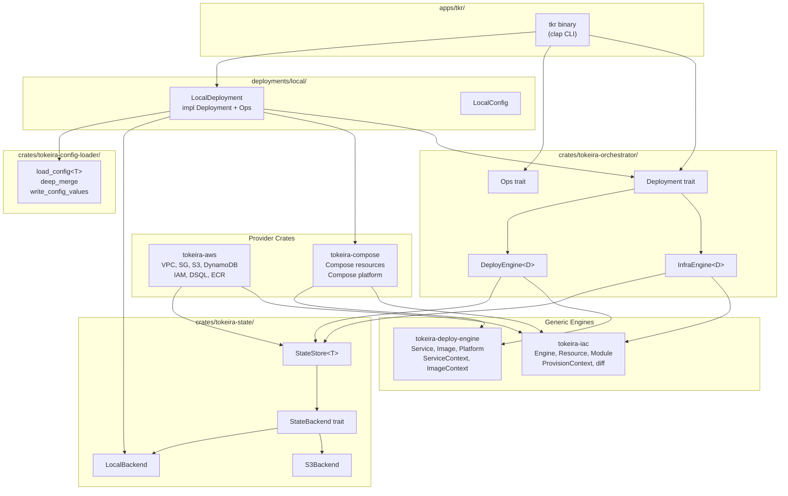

# Design Document: Orchestrator Framework

## Overview

This design migrates the proven orchestration framework from `temporal-dsql-deploy-eks` into the tokeira workspace as first-class crates, adds a Docker Compose provider and local filesystem state backend, and delivers a working local development deployment with a CLI.

The architecture follows a strict layering:

```
cli → deployment (custom) → orchestrator → {iac, deploy-engine, aws, compose} → state
```

Five new generic crates (`tokeira-state`, `tokeira-iac`, `tokeira-deploy-engine`, `tokeira-config-loader`, `tokeira-orchestrator`) provide the framework. Two provider crates (`tokeira-aws`, `tokeira-compose`) implement platform-specific resources. A concrete `deployments/local/` crate wires everything together for local development, and `apps/tkr/` provides the CLI.

Key design decisions:

- **`StateBackend` trait** — `StateStore<T>` is parameterized by a `StateBackend` trait with `S3Backend` and `LocalBackend` implementations. The `Deployment` trait returns `Box<dyn StateBackend>` so deployments choose their storage medium.
- **Typed extension maps** — `ProvisionContext` and `ServiceContext` use `TypeId → Box<dyn Any>` maps. Providers register their handles (e.g., `AwsClients`, `ComposePlatform`) without generic crates knowing about them.
- **Compose as IaC** — The compose provider uses `bollard` (Docker Engine API client) for container lifecycle management. The compose YAML file is the desired-state artifact; reconciliation happens through the Docker API, not CLI invocations.
- **CLI is deployment-agnostic** — `apps/tkr/` is parameterized by `Deployment`. Adding a new deployment target requires no CLI changes.
- **Config loader is generic** — `tokeira-config-loader` is generic over `T: DeserializeOwned`. Each deployment defines its own config model. This is separate from the `tokeirad` configuration foundation (which handles server runtime config).

## Architecture



### Dependency Hierarchy

```
Layer 0 (leaf):     tokeira-state, tokeira-config-loader
Layer 1 (engines):  tokeira-iac → tokeira-state
                    tokeira-deploy-engine (no state dep)
Layer 2 (orch):     tokeira-orchestrator → tokeira-iac, tokeira-deploy-engine, tokeira-state
Layer 3 (providers): tokeira-aws → tokeira-iac, tokeira-state
                     tokeira-compose → tokeira-iac, tokeira-deploy-engine
Layer 4 (deploy):   deployments/local/ → tokeira-orchestrator, tokeira-compose, tokeira-config-loader
Layer 5 (binary):   apps/tkr/ → tokeira-orchestrator, deployments/local/
```

No reverse dependencies. Generic crates never depend on providers or deployments. Providers never depend on the orchestrator or deployments.

### Repo Layout

```
tokeira/
├── apps/
│   ├── tokeirad/              # The server binary (existing)
│   └── tkr/                   # The deployment CLI (new)
├── crates/
│   ├── tokeira-kernel/        # (existing)
│   ├── tokeira-runtime/       # (existing — workflow runtime)
│   ├── tokeira-storage/       # (existing)
│   ├── tokeira-edge/          # (existing)
│   ├── tokeira-types/         # (existing)
│   ├── tokeira-proto/         # (existing)
│   ├── tokeira-projection/    # (existing)
│   ├── tokeira-state/         # Generic CAS store — NEW
│   ├── tokeira-iac/           # Generic infra engine — NEW
│   ├── tokeira-deploy-engine/ # Generic service/image engine — NEW
│   ├── tokeira-orchestrator/  # Deployment trait, engine facades — NEW
│   ├── tokeira-aws/           # AWS resource provider — NEW
│   ├── tokeira-compose/       # Docker Compose provider — NEW
│   └── tokeira-config-loader/ # TOML config loading — NEW
├── deployments/
│   └── local/                 # Local dev deployment — NEW
└── dev/                       # (existing scaffolding)
```

## Components and Interfaces

### tokeira-state — Generic CAS State Store

The state store provides compare-and-swap persistence for any serializable document type. It uses a manifest + snapshot model: the manifest is a mutable pointer (CAS-updated via ETags or file locks) and snapshots are immutable blobs addressed by SHA-256 checksum.

#### StateBackend Trait

```rust
/// Abstracts the storage medium for state persistence.
/// All operations return the unified StateError for object safety.
#[async_trait]
pub trait StateBackend: Send + Sync {
    /// Read the current manifest bytes and return (bytes, version_tag).
    /// Returns Ok(None) if no manifest exists yet.
    async fn read_manifest(&self, key: &str) -> Result<Option<(Vec<u8>, String)>, StateError>;

    /// Write manifest bytes with CAS semantics.
    /// `expected_version` is the version_tag from the last read (empty string for initial write).
    /// Returns Err(StateError::Conflict) if the current version doesn't match.
    async fn write_manifest(&self, key: &str, data: &[u8], expected_version: &str) -> Result<(), StateError>;

    /// Read an immutable snapshot by its checksum key.
    async fn read_snapshot(&self, key: &str) -> Result<Vec<u8>, StateError>;

    /// Write an immutable snapshot. Idempotent — writing the same key twice is a no-op.
    async fn write_snapshot(&self, key: &str, data: &[u8]) -> Result<(), StateError>;

    /// List all snapshot keys under a prefix.
    async fn list_snapshots(&self, prefix: &str) -> Result<Vec<String>, StateError>;
}
```

#### StateStore\<T\>

```rust
/// Generic CAS state store parameterized by document type and backend.
pub struct StateStore<T> {
    backend: Box<dyn StateBackend>,
    key_prefix: String,
    _phantom: PhantomData<T>,
}

impl<T> StateStore<T>
where
    T: Serialize + DeserializeOwned + Default + Validate,
{
    pub fn new(backend: Box<dyn StateBackend>, key_prefix: String) -> Self;

    /// Load the current state document, or Default if none exists.
    pub async fn load(&self) -> Result<(T, String), StateError>;

    /// Save a state document with CAS semantics.
    /// Returns StateError::Conflict if the version has changed since load.
    pub async fn save(&self, doc: &T, expected_version: &str) -> Result<String, StateError>;
}
```

#### Validate Trait

```rust
/// Post-deserialization integrity check.
pub trait Validate {
    fn validate(&self) -> Result<(), StateError>;
}
```

#### S3Backend (feature-gated)

```rust
/// S3-backed state storage. Lives in tokeira-state behind `feature = "s3"`.
/// Accepts a pre-configured S3 client. Uses ETags for CAS on manifest writes.
#[cfg(feature = "s3")]
pub struct S3Backend {
    client: aws_sdk_s3::Client,
    bucket: String,
    key_prefix: String,
}
```

Uses S3 ETags for CAS on manifest writes. Snapshots are stored under `{key_prefix}/snapshots/{sha256}`.

#### LocalBackend

```rust
/// Filesystem-backed state storage using atomic file operations.
pub struct LocalBackend {
    base_dir: PathBuf,
}
```

Uses `tempfile` + atomic rename for writes. File-level advisory locking (`flock`) for CAS on manifests. Stores manifests at `{base_dir}/{key}/manifest.json` and snapshots at `{base_dir}/{key}/snapshots/{sha256}`.

#### Error Types

```rust
#[derive(Debug, thiserror::Error)]
pub enum StateError {
    #[error("version conflict on key '{key}': expected {expected}, found {actual}")]
    Conflict { key: String, expected: String, actual: String },

    #[error("state not found: {key}")]
    NotFound { key: String },

    #[error("validation failed for state document: {0}")]
    Validation(String),

    #[error("backend error on key '{key}': {source}")]
    Backend { key: String, #[source] source: anyhow::Error },
}
```

### tokeira-iac — Generic Infrastructure-as-Code Engine

#### Resource Trait

```rust
#[async_trait]
pub trait Resource: Send + Sync {
    fn name(&self) -> &str;
    fn resource_type(&self) -> &str;

    async fn create(&self, ctx: &mut ProvisionContext) -> Result<serde_json::Value>;
    async fn update(&self, ctx: &mut ProvisionContext, current: &serde_json::Value) -> Result<serde_json::Value>;
    async fn delete(&self, ctx: &mut ProvisionContext, current: &serde_json::Value) -> Result<()>;
    async fn describe(&self, ctx: &ProvisionContext) -> Result<Option<serde_json::Value>>;
    async fn diff(&self, ctx: &ProvisionContext, current: &serde_json::Value) -> Result<ResourceDiff>;
}
```

#### Module Trait

```rust
pub trait Module: Send + Sync {
    fn name(&self) -> &str;
    fn dependencies(&self) -> Vec<String>;
    fn resources(&self, ctx: &ModuleContext) -> Vec<Box<dyn Resource>>;
}
```

#### ProvisionContext

```rust
/// Typed extension map for sharing values between modules during provisioning.
pub struct ProvisionContext {
    extensions: HashMap<TypeId, Box<dyn Any + Send + Sync>>,
    tags: HashMap<String, String>,
    state: InfraState,
    progress: Vec<Box<dyn ProgressReporter>>,
}

impl ProvisionContext {
    pub fn insert<T: Send + Sync + 'static>(&mut self, value: T);
    pub fn get<T: Send + Sync + 'static>(&self) -> Option<&T>;
    pub fn get_mut<T: Send + Sync + 'static>(&mut self) -> Option<&mut T>;
    pub fn state(&self) -> &InfraState;
    pub fn state_mut(&mut self) -> &mut InfraState;
    pub fn tags(&self) -> &HashMap<String, String>;
}
```

#### Engine

```rust
pub struct Engine;

impl Engine {
    /// Compute a plan showing what would change, without side effects.
    pub async fn plan(
        modules: &[Box<dyn Module>],
        ctx: &mut ProvisionContext,
    ) -> Result<Vec<Change>>;

    /// Apply changes: create/update/delete resources in topological order.
    pub async fn apply(
        modules: &[Box<dyn Module>],
        ctx: &mut ProvisionContext,
    ) -> Result<Vec<Change>>;

    /// Destroy resources in reverse topological order.
    pub async fn destroy(
        modules: &[Box<dyn Module>],
        ctx: &mut ProvisionContext,
    ) -> Result<Vec<Change>>;
}
```

#### Diff Types

```rust
#[derive(Debug, Clone)]
pub enum ChangeKind {
    Create,
    Update { fields: Vec<FieldDiff> },
    Delete,
    NoChange,
}

#[derive(Debug, Clone)]
pub struct Change {
    pub module: String,
    pub resource: String,
    pub resource_type: String,
    pub kind: ChangeKind,
}

#[derive(Debug, Clone)]
pub struct FieldDiff {
    pub field: String,
    pub old: String,
    pub new: String,
}

#[derive(Debug, Clone)]
pub struct ResourceDiff {
    pub kind: ChangeKind,
}
```

#### Composition Types

```rust
/// Represents a composed set of modules filtered by selection criteria.
pub struct InfraComposition {
    pub modules: Vec<Box<dyn Module>>,
}

/// Controls which modules are included in a composition.
pub enum ModuleSelection {
    All,
    Only(Vec<String>),
    Except(Vec<String>),
}
```

#### State Documents

```rust
/// Persisted infrastructure state — maps resource names to their last-known state.
#[derive(Debug, Clone, Default, Serialize, Deserialize)]
pub struct InfraState {
    pub resources: HashMap<String, serde_json::Value>,
}

impl Validate for InfraState {
    fn validate(&self) -> Result<()> { Ok(()) }
}
```

#### Error Types

```rust
#[derive(Debug, thiserror::Error)]
pub enum IacError {
    #[error("dependency cycle detected: {cycle:?}")]
    DependencyCycle { cycle: Vec<String> },

    #[error("resource '{resource}' in module '{module}' failed: {source}")]
    ResourceFailed {
        module: String,
        resource: String,
        #[source] source: anyhow::Error,
    },

    #[error("module '{module}' not found")]
    ModuleNotFound { module: String },

    #[error("state error: {0}")]
    State(#[from] StateError),
}
```

### tokeira-deploy-engine — Generic Service Deployment Engine

#### Service Trait

```rust
#[async_trait]
pub trait Service: Send + Sync {
    fn name(&self) -> &str;
    fn module(&self) -> &str;
    fn dependencies(&self) -> Vec<String>;
    async fn manifests(&self, ctx: &ServiceContext) -> Result<Vec<serde_json::Value>>;
}
```

#### Image Trait

```rust
pub trait Image: Send + Sync {
    fn name(&self) -> &str;
    fn source_type(&self) -> ImageSourceType;
    fn desired_ref(&self, ctx: &ImageContext) -> String;
}

pub enum ImageSourceType {
    Registry,
    Build { context: PathBuf, dockerfile: PathBuf },
}
```

#### Platform Trait

```rust
#[async_trait]
pub trait Platform: Send + Sync {
    async fn apply_manifests(&self, manifests: Vec<serde_json::Value>) -> Result<()>;
}
```

#### ServiceContext / ImageContext

```rust
/// Typed extension map for service deployment.
pub struct ServiceContext {
    extensions: HashMap<TypeId, Box<dyn Any + Send + Sync>>,
}

/// Typed extension map for image operations.
pub struct ImageContext {
    extensions: HashMap<TypeId, Box<dyn Any + Send + Sync>>,
}
```

Both provide `insert<T>`, `get<T>`, `get_mut<T>` methods identical to `ProvisionContext`.

#### RuntimeState

```rust
/// Persisted deployment state — tracks deployed services and images.
#[derive(Debug, Clone, Default, Serialize, Deserialize)]
pub struct RuntimeState {
    pub services: HashMap<String, serde_json::Value>,
    pub images: HashMap<String, String>,
}

impl Validate for RuntimeState {
    fn validate(&self) -> Result<()> { Ok(()) }
}
```

#### DeployEngine (the engine, not the facade)

```rust
pub struct ServiceEngine;

impl ServiceEngine {
    pub async fn plan_services(
        services: &[Box<dyn Service>],
        ctx: &mut ServiceContext,
        state: &RuntimeState,
    ) -> Result<Vec<ServiceChange>>;

    pub async fn apply_services(
        services: &[Box<dyn Service>],
        platform: &dyn Platform,
        ctx: &mut ServiceContext,
        state: &mut RuntimeState,
    ) -> Result<Vec<ServiceChange>>;

    pub async fn record_images(
        images: &[Box<dyn Image>],
        ctx: &ImageContext,
        state: &mut RuntimeState,
    ) -> Result<()>;
}
```

### tokeira-config-loader — Generic TOML Config Loader

```rust
/// Load a base TOML config, optionally deep-merge a profile overlay,
/// substitute variables, and deserialize into T.
pub fn load_config<T: DeserializeOwned>(
    base_path: &Path,
    profile_path: Option<&Path>,
) -> Result<T, ConfigLoaderError>;

/// Recursive deep-merge: tables merge key-by-key, leaves override.
pub fn deep_merge(base: &mut toml::Value, overlay: toml::Value);

/// Substitute {project} and other declared placeholders in string values.
pub fn substitute_vars(value: &mut toml::Value, vars: &HashMap<String, String>);

/// Validate a config using a caller-provided validation function.
pub fn validate_config<T>(
    config: &T,
    validator: impl Fn(&T) -> Result<(), Vec<String>>,
) -> Result<(), ConfigLoaderError>;

/// Serialize a config back to TOML for inspection.
pub fn write_config_values<T: Serialize>(config: &T) -> Result<String, ConfigLoaderError>;
```

```rust
#[derive(Debug, thiserror::Error)]
pub enum ConfigLoaderError {
    #[error("failed to read config file '{path}': {source}")]
    ReadFile { path: PathBuf, #[source] source: std::io::Error },

    #[error("TOML parse error in '{path}': {source}")]
    Parse { path: PathBuf, #[source] source: toml::de::Error },

    #[error("TOML serialization error: {0}")]
    Serialize(#[from] toml::ser::Error),

    #[error("validation errors: {errors:?}")]
    Validation { errors: Vec<String> },
}
```

### tokeira-orchestrator — Deployment Trait, Ops Trait, Engine Facades

#### Deployment Trait

```rust
#[async_trait]
pub trait Deployment: Send + Sync {
    type Config: Send + Sync + Clone + 'static;

    /// Return the remote-state module that provisions the storage backend.
    /// For cloud deployments this creates an S3 bucket; for local dev this
    /// ensures the state directory exists. Follows the remote-state module →
    /// resource → state store lifecycle from the deploy-eks architecture.
    fn remote_state_module(&self, config: &Self::Config) -> Box<dyn iac::Module>;

    /// Return infrastructure modules filtered by selection.
    fn infra_modules(&self, config: &Self::Config, selection: &ModuleSelection) -> Vec<Box<dyn iac::Module>>;

    /// Return services to deploy.
    fn services(&self, config: &Self::Config) -> Vec<Box<dyn deploy_engine::Service>>;

    /// Return images to track.
    fn images(&self, config: &Self::Config) -> Vec<Box<dyn deploy_engine::Image>>;

    /// Return namespaces required by this deployment.
    fn required_namespaces(&self, config: &Self::Config) -> Vec<String>;

    /// Register deployment-specific extensions on the provision context.
    async fn register_infra_extensions(
        &self,
        config: &Self::Config,
        ctx: &mut iac::ProvisionContext,
    ) -> Result<()>;

    /// Register deployment-specific extensions on the service context.
    async fn register_deploy_extensions(
        &self,
        config: &Self::Config,
        ctx: &mut deploy_engine::ServiceContext,
    ) -> Result<()>;

    /// Create the state backend for infrastructure state.
    fn create_infra_store(&self, config: &Self::Config) -> Box<dyn state::StateBackend>;

    /// Create the state backend for deployment state.
    fn create_deploy_store(&self, config: &Self::Config) -> Box<dyn state::StateBackend>;

    /// Hydrate config with values from infrastructure state (e.g., resource ARNs).
    fn hydrate_config(&self, config: &Self::Config, state: &iac::InfraState) -> Self::Config;

    /// Collect key-value pairs to write back to config files after infra apply.
    fn collect_writeback(&self, config: &Self::Config, state: &iac::InfraState) -> Vec<(String, String)>;
}
```

#### Ops Trait

```rust
#[async_trait]
pub trait Ops: Send + Sync {
    type Config;

    /// Map a short service name to its full deployment name.
    fn deployment_name(&self, short: &str) -> Option<&str>;

    /// List valid service names for this deployment.
    fn valid_services(&self) -> &[&str];

    /// Get the namespace for a service.
    fn service_namespace(&self, short: &str, config: &Self::Config) -> String;

    /// Get port-forward target for a named service.
    fn port_forward_target(&self, name: &str, config: &Self::Config) -> Option<PortForwardTarget>;

    /// Get startup replica counts for services.
    fn startup_replicas(&self, config: &Self::Config) -> Vec<ServiceReplicas>;

    /// Get a job manifest by name.
    fn job(&self, name: &str, config: &Self::Config, namespace: &str) -> Option<serde_json::Value>;
}

pub struct PortForwardTarget {
    pub host: String,
    pub port: u16,
    pub protocol: String,
}

pub struct ServiceReplicas {
    pub service: String,
    pub replicas: u32,
}
```

#### InfraEngine\<D\> Facade

```rust
pub struct InfraEngine<D: Deployment> {
    deployment: D,
    engine: iac::Engine,
    ctx: iac::ProvisionContext,
    config: D::Config,
    state_store: StateStore<InfraState>,
}

impl<D: Deployment> InfraEngine<D> {
    pub async fn new(deployment: D, config: &D::Config) -> Result<Self>;

    /// Compose modules based on selection criteria.
    /// Always prepends the remote-state module from `Deployment::remote_state_module()`
    /// ahead of the selected infrastructure modules, ensuring the state backend
    /// is provisioned before any other module runs.
    pub fn compose(&self, selection: ModuleSelection) -> Result<InfraComposition>;

    /// Plan changes without side effects.
    pub async fn plan(&mut self, composition: &InfraComposition) -> Result<Vec<Change>>;

    /// Apply changes and persist state.
    pub async fn apply(&mut self, composition: &InfraComposition) -> Result<Vec<Change>>;

    /// Destroy resources in reverse order and persist state.
    pub async fn destroy(&mut self, composition: &InfraComposition) -> Result<Vec<Change>>;

    /// Collect writeback values from current state.
    pub fn collect_writeback(&self) -> Vec<(String, String)>;
}
```

#### DeployEngine\<D\> Facade

```rust
pub struct DeployEngine<D: Deployment> {
    deployment: D,
    engine: deploy_engine::ServiceEngine,
    ctx: deploy_engine::ServiceContext,
    config: D::Config,
    state_store: StateStore<RuntimeState>,
}

impl<D: Deployment> DeployEngine<D> {
    pub async fn new(deployment: D, config: &D::Config) -> Result<Self>;
    pub async fn plan(&mut self) -> Result<Vec<ServiceChange>>;
    pub async fn apply(&mut self) -> Result<Vec<ServiceChange>>;
}
```

### tokeira-aws — AWS Resource Provider

Implements `iac::Resource` for the 7 resource types tokeira needs. Each resource uses the `ProvisionContext` extension map to read/write shared values (e.g., VPC ID).

```rust
/// AWS SDK clients registered as a ProvisionContext extension.
pub struct AwsClients {
    pub ec2: aws_sdk_ec2::Client,
    pub s3: aws_sdk_s3::Client,
    pub dynamodb: aws_sdk_dynamodb::Client,
    pub iam: aws_sdk_iam::Client,
    pub dsql: aws_sdk_dsql::Client,
    pub ecr: aws_sdk_ecr::Client,
}
```

Resource implementations:

| Resource | Creates | Reads from ctx | Publishes to ctx |
|----------|---------|----------------|------------------|
| `VpcResource` | VPC + subnets | — | VPC ID, subnet IDs |
| `SecurityGroupResource` | Security groups | VPC ID | Security group IDs |
| `S3BucketResource` | S3 buckets | — | Bucket ARNs |
| `DynamoDbTableResource` | DynamoDB tables | — | Table ARNs |
| `IamRoleResource` | IAM roles + policies | Various ARNs | Role ARNs |
| `DsqlClusterResource` | DSQL clusters | VPC ID, SG IDs | Cluster endpoint |
| `EcrRepositoryResource` | ECR repositories | — | Repository URIs |

### tokeira-compose — Docker Compose Provider

#### Compose Resources

Implements `iac::Resource` where the "infrastructure" is a docker-compose.yml file and running containers.

```rust
pub struct ComposeService {
    pub name: String,
    pub image: String,
    pub ports: Vec<PortMapping>,
    pub volumes: Vec<VolumeMapping>,
    pub environment: HashMap<String, String>,
    pub depends_on: Vec<String>,
    pub healthcheck: Option<Healthcheck>,
}

impl Resource for ComposeService {
    // create: use bollard to create and start container, update compose file
    // update: stop + remove via bollard, recreate with new config
    // delete: stop + remove via bollard, remove entry from compose file
    // describe: bollard::Docker::list_containers with label filtering
    // diff: compare desired config vs running container state from bollard
}
```

#### Compose Platform

```rust
/// Docker Engine API-based platform using bollard.
/// The compose YAML file is the desired-state artifact; reconciliation
/// happens through the Docker API, not CLI invocations.
pub struct ComposePlatform {
    docker: bollard::Docker,
    compose_file: PathBuf,
    project_name: String,
}

impl ComposePlatform {
    pub fn new(socket_path: &str, compose_file: PathBuf, project_name: String) -> Result<Self> {
        let docker = bollard::Docker::connect_with_socket(socket_path, 120, bollard::API_DEFAULT_VERSION)?;
        Ok(Self { docker, compose_file, project_name })
    }
}

#[async_trait]
impl Platform for ComposePlatform {
    async fn apply_manifests(&self, manifests: Vec<serde_json::Value>) -> Result<()> {
        // Merge manifests into docker-compose.yml (desired-state artifact)
        // Reconcile via bollard: create/start containers matching desired state
        // Label containers with com.docker.compose.service for discovery
    }
}
```

### deployments/local/ — Local Development Deployment

```rust
pub struct LocalDeployment;

impl Deployment for LocalDeployment {
    type Config = LocalConfig;

    fn remote_state_module(&self, config: &LocalConfig) -> Box<dyn Module> {
        // Returns a module that ensures the local state directory exists
        Box::new(LocalStateModule::new(&config.state_dir))
    }

    fn infra_modules(&self, config: &LocalConfig, selection: &ModuleSelection) -> Vec<Box<dyn Module>> {
        // Returns modules for: tokeirad, mimir, grafana, loki, alloy
        // Each module is a ComposeService resource
    }

    fn create_infra_store(&self, config: &LocalConfig) -> Box<dyn StateBackend> {
        Box::new(LocalBackend::new(&config.state_dir)) // .tokeira-state/
    }

    fn create_deploy_store(&self, config: &LocalConfig) -> Box<dyn StateBackend> {
        Box::new(LocalBackend::new(&config.state_dir))
    }
    // ... other trait methods
}

impl Ops for LocalDeployment {
    type Config = LocalConfig;

    fn valid_services(&self) -> &[&str] {
        &["tokeirad", "mimir", "grafana", "loki", "alloy"]
    }
    // scale_up/down → bollard create/remove container instances
    // logs → bollard::Docker::logs with follow mode
    // port_forward → read port mappings from running container via bollard
}
```

#### LocalConfig

```rust
#[derive(Clone, Debug, Serialize, Deserialize)]
pub struct LocalConfig {
    pub project_name: String,           // default: "tokeira"
    pub state_dir: PathBuf,             // default: ".tokeira-state"
    pub compose_file: PathBuf,          // default: ".tokeira-state/docker-compose.yml"
    pub tokeirad: TokeiradServiceConfig,
    pub observability: ObservabilityConfig,
}

#[derive(Clone, Debug, Serialize, Deserialize)]
pub struct TokeiradServiceConfig {
    pub image: String,                  // default: "tokeirad:local"
    pub grpc_port: u16,                 // default: 7233
    pub metrics_port: u16,              // default: 9090
}

#[derive(Clone, Debug, Serialize, Deserialize)]
pub struct ObservabilityConfig {
    pub mimir_image: String,
    pub grafana_image: String,
    pub loki_image: String,
    pub alloy_image: String,
    pub grafana_port: u16,              // default: 3000
}
```

### apps/tkr/ — Deployment CLI

```rust
#[derive(clap::Parser)]
#[command(name = "tkr")]
pub struct Cli {
    #[arg(long, default_value = "local")]
    deployment: String,

    #[arg(long)]
    config: Option<PathBuf>,

    #[arg(long)]
    profile: Option<PathBuf>,

    #[command(subcommand)]
    command: Command,
}

#[derive(clap::Subcommand)]
pub enum Command {
    Infra {
        #[command(subcommand)]
        action: InfraAction,
    },
    Deploy {
        #[command(subcommand)]
        action: DeployAction,
    },
    Scale {
        #[command(subcommand)]
        action: ScaleAction,
    },
    Logs {
        service: String,
    },
    PortForward {
        service: String,
        port: u16,
    },
    Config {
        #[command(subcommand)]
        action: ConfigAction,
    },
}

#[derive(clap::Subcommand)]
pub enum InfraAction {
    Plan,
    Apply { #[arg(long)] yes: bool },
    Destroy { #[arg(long)] yes: bool },
}

#[derive(clap::Subcommand)]
pub enum DeployAction {
    Plan,
    Apply { #[arg(long)] yes: bool },
}

#[derive(clap::Subcommand)]
pub enum ScaleAction {
    Up { service: String, replicas: u32 },
    Down { service: String, replicas: u32 },
}

#[derive(clap::Subcommand)]
pub enum ConfigAction {
    Init,
    Dump,
}
```

The CLI is deployment-agnostic. At the binary level, it matches on `--deployment` and constructs the appropriate `Deployment` impl:

```rust
async fn main() -> Result<()> {
    let cli = Cli::parse();
    match cli.deployment.as_str() {
        "local" => run::<LocalDeployment>(cli).await,
        // Future: "ecs" => run::<EcsDeployment>(cli).await,
        other => bail!("unknown deployment target: {other}"),
    }
}

async fn run<D: Deployment + Ops>(cli: Cli) -> Result<()>
where
    D::Config: DeserializeOwned,
{
    let config: D::Config = load_config(cli.config, cli.profile)?;
    let deployment = D::default();
    match cli.command {
        Command::Infra { action: InfraAction::Plan } => {
            let mut engine = InfraEngine::new(deployment, &config).await?;
            let composition = engine.compose(ModuleSelection::All)?;
            let changes = engine.plan(&composition).await?;
            print_plan(&changes);
        }
        // ... other commands
    }
}
```

## Data Models

### State Document: InfraState

```rust
#[derive(Debug, Clone, Default, Serialize, Deserialize)]
pub struct InfraState {
    /// Maps "{module}/{resource}" → last-known resource state as JSON.
    pub resources: HashMap<String, serde_json::Value>,
}
```

Persisted via `StateStore<InfraState>`. The manifest contains a pointer to the latest snapshot checksum. Snapshots are immutable JSON blobs.

### State Document: RuntimeState

```rust
#[derive(Debug, Clone, Default, Serialize, Deserialize)]
pub struct RuntimeState {
    /// Maps service name → last-applied manifest as JSON.
    pub services: HashMap<String, serde_json::Value>,
    /// Maps image name → deployed image reference.
    pub images: HashMap<String, String>,
}
```

### Manifest Format

```json
{
  "version": 1,
  "latest_snapshot": "abc123def456...",
  "updated_at": "2025-01-15T10:30:00Z"
}
```

The `latest_snapshot` field is the SHA-256 checksum of the current snapshot blob. CAS updates compare the entire manifest content (via ETag for S3, file lock + content hash for local).

### Change Plan Output

The `plan` commands produce a list of `Change` values rendered as:

```
Module: tokeirad
  + [compose_service] tokeirad          CREATE
  ~ [compose_service] alloy             UPDATE
    - ports: "4317:4317" → "4317:4317,4318:4318"
  - [compose_service] old-service       DELETE

Module: observability
  = [compose_service] grafana           NO CHANGE
```

### Local Deployment Config (TOML)

```toml
# deployments/local/config/config.toml
project_name = "tokeira"
state_dir = ".tokeira-state"
compose_file = ".tokeira-state/docker-compose.yml"

[tokeirad]
image = "tokeirad:local"
grpc_port = 7233
metrics_port = 9090

[observability]
mimir_image = "grafana/mimir:3.0.6"
grafana_image = "grafana/grafana-oss:12.4.3"
loki_image = "grafana/loki:3.7.1"
alloy_image = "grafana/alloy:v1.16.0"
grafana_port = 3000
```


## Correctness Properties

*A property is a characteristic or behavior that should hold true across all valid executions of a system — essentially, a formal statement about what the system should do.*

### Property 1: State store round-trip

*For any* valid state document `T` that implements `Serialize + DeserializeOwned + Default + Validate`, writing it to a `StateStore<T>` via `save()` and then reading it back via `load()` SHALL produce a document equal to the original, regardless of whether the backend is `S3Backend` or `LocalBackend`.

**Validates: Requirements 1.1.1, 1.1.9**

### Property 2: Config loader round-trip

*For any* valid TOML configuration value `T: Serialize + DeserializeOwned`, serializing it to TOML and then loading it via `load_config` (with no profile overlay) SHALL produce a value equal to the original.

**Validates: Requirements 1.4.8**

### Property 3: Deep-merge preserves unmentioned fields

*For any* valid base config TOML and *for any* profile overlay TOML that sets a subset of fields, deep-merging the overlay onto the base SHALL produce a result where: (a) every field present in the overlay has the overlay's value, and (b) every field NOT present in the overlay retains the base value.

**Validates: Requirements 1.4.2**

### Property 4: Module dependency ordering

*For any* set of Modules with declared dependencies forming a DAG, the IAC_Engine's topological sort SHALL produce an ordering where every Module appears after all of its dependencies. *For any* set of Modules with a dependency cycle, the sort SHALL return an error.

**Validates: Requirements 1.2.3, 1.2.4**

### Property 5: Plan idempotence

*For any* set of Resources and a state where all Resources have been successfully applied, calling `plan()` SHALL produce only `NoChange` entries — no creates, updates, or deletes.

**Validates: Requirements 1.2.5, 1.2.7**

### Property 6: Local backend atomic writes

*For any* concurrent pair of `save()` calls to the same `LocalBackend` state path, exactly one SHALL succeed and the other SHALL return a conflict error. The resulting state file SHALL contain the complete document from the successful write — never a partial or interleaved document.

**Validates: Requirements 1.1.6, 1.1.7**

## Error Handling

### State Store Errors

| Error | Cause | Behavior |
|-------|-------|----------|
| `Conflict` | CAS version mismatch during `save()` | Return error with current version; caller retries with fresh state |
| `Corrupted` | Checksum mismatch on snapshot load | Return error with expected vs actual checksum |
| `Locked` | Another writer holds the lease | Return error with lock owner and expiry |
| `BackendError` | S3 access denied, local I/O failure | Wrap source error with key path context |

### IAC Engine Errors

| Error | Cause | Behavior |
|-------|-------|----------|
| `CyclicDependency` | Module dependency graph has a cycle | Return error listing the cycle path |
| `ResourceFailed` | A Resource's create/update/delete returned an error | Wrap with resource ID, type, and module name |
| `StateNotFound` | A Resource references a dependency not in state | Return error with the missing resource ID |
| `DiffFailed` | A Resource's describe returned an error during refresh | Log warning, treat as drift, include in plan |

### Deploy Engine Errors

| Error | Cause | Behavior |
|-------|-------|----------|
| `PlatformNotRegistered` | No `Platform` extension on `ServiceContext` | Return error naming the missing extension |
| `ManifestFailed` | A Service's `manifests()` returned an error | Wrap with service name and module |
| `ApplyFailed` | Platform's `apply_manifests()` returned an error | Wrap with service name |

### Compose Provider Errors

| Error | Cause | Behavior |
|-------|-------|----------|
| `DockerNotAvailable` | bollard cannot connect to Docker socket | Return descriptive error with socket path |
| `ContainerFailed` | bollard container create/start/stop returned an error | Return error with container name and API error |
| `ComposeFileFailed` | Failed to write `docker-compose.yml` | Wrap I/O error with file path |

### Config Loader Errors

| Error | Cause | Behavior |
|-------|-------|----------|
| `FileNotFound` | Base config or profile file doesn't exist | Return error with attempted path |
| `ParseError` | TOML syntax error | Wrap `toml::de::Error` with file path |
| `ValidationFailed` | Caller's validation function returned errors | Return all errors, not just the first |

## Testing Strategy

### Property-Based Tests

Property-based tests use `proptest` with minimum 100 iterations per property.

| Property | Test Location | Generator Strategy |
|----------|---------------|-------------------|
| Property 1: State round-trip | `tokeira-state/tests/` | Generate random JSON-serializable documents, write/read via both S3 (mocked) and Local backends |
| Property 2: Config round-trip | `tokeira-config-loader/tests/` | Generate random TOML-compatible structs, serialize/load, assert equality |
| Property 3: Deep-merge preservation | `tokeira-config-loader/tests/` | Generate random base TOML tables and overlay subsets, merge, assert overlay fields override and non-overlay fields preserved |
| Property 4: Module ordering | `tokeira-iac/tests/` | Generate random DAGs of module dependencies, verify topological order; generate graphs with cycles, verify error |
| Property 5: Plan idempotence | `tokeira-iac/tests/` | Generate random resource sets, apply to empty state, plan again, assert all NoChange |
| Property 6: Local atomic writes | `tokeira-state/tests/` | Spawn concurrent save tasks to the same local path, assert exactly one succeeds and the file is valid |

### Unit Tests

- **StateStore**: Load from empty (returns default), save then load (round-trip), concurrent save conflict, corrupted snapshot detection
- **LocalBackend**: Atomic write (no partial files), directory creation, file locking
- **IAC Engine**: Topological sort (linear, diamond, independent), cycle detection, plan with no state (all creates), plan after apply (all no-change), destroy in reverse order
- **Deploy Engine**: Plan services (manifest generation), apply services (platform called), missing platform error
- **Config Loader**: Load base only, load with profile merge, unknown keys rejected, type mismatch errors, variable substitution, empty profile (no-op merge)
- **Compose Provider**: Generate compose YAML from resource definitions, diff against existing compose file, create/update/delete service entries
- **Deployment trait**: Local deployment returns correct modules, services, state backend type
- **Ops trait**: Local ops delegates to bollard Docker API, unknown service name returns error

### Integration Tests

- **Local deployment end-to-end**: `tkr --deployment local infra apply` → verify containers running via bollard, `tkr infra destroy` → containers stopped and removed
- **State persistence**: Apply infra, restart CLI, verify state loaded from `.tokeira-state/`, plan shows no changes
- **Config profile merge**: Load base + profile, verify merged values, `tkr config dump` shows resolved config
- **Compose provider lifecycle**: Create a compose service, verify container running via bollard, update it, verify change applied, delete it, verify container removed


## Correctness Properties

*A property is a characteristic or behavior that should hold true across all valid executions of a system — essentially, a formal statement about what the system should do. Properties serve as the bridge between human-readable specifications and machine-verifiable correctness guarantees.*

### Property 1: State store round-trip

*For any* valid state document `T` (implementing `Serialize + DeserializeOwned + Default + Validate`), saving it to a `StateStore` and then loading from the same store SHALL produce a document equal to the original.

**Validates: Requirements 1.1.9**

### Property 2: CAS conflict detection

*For any* state document and *for any* version string that does not match the current version in the store, calling `save` with that stale version SHALL return a `ConflictError` containing the actual current version, and the stored document SHALL remain unchanged.

**Validates: Requirements 1.1.4**

### Property 3: Topological ordering

*For any* valid DAG of modules (no cycles), the IAC engine's `apply` SHALL process modules in an order where every module's dependencies appear before it. Conversely, `destroy` SHALL process modules in reverse dependency order (every module is destroyed before its dependencies).

**Validates: Requirements 1.2.3, 1.2.5**

### Property 4: Cycle detection

*For any* module dependency graph containing at least one cycle, the IAC engine SHALL return a `DependencyCycle` error identifying the cycle, rather than entering an infinite loop or silently proceeding.

**Validates: Requirements 1.2.4**

### Property 5: Typed extension map round-trip

*For any* typed value `T: Send + Sync + 'static`, inserting it into a `ProvisionContext` (or `ServiceContext` or `ImageContext`) and then retrieving it by type SHALL return a reference equal to the original value.

**Validates: Requirements 1.2.6, 1.3.5, 1.3.6**

### Property 6: Diff engine classification

*For any* pair of current state and desired state maps, the diff engine SHALL classify each resource as: `Create` if the resource exists only in desired state, `Delete` if it exists only in current state, `Update` if it exists in both with differences, and `NoChange` if it exists in both and is identical.

**Validates: Requirements 1.2.7**

### Property 7: Deep merge semantics

*For any* two TOML value trees (base and overlay), deep-merging overlay into base SHALL produce a result where: (a) every leaf value present in the overlay has the overlay's value, (b) every leaf value present only in the base is preserved, and (c) nested tables are merged recursively following the same rules.

**Validates: Requirements 1.4.2**

### Property 8: Variable substitution completeness

*For any* TOML value tree containing string values with `{project}` placeholders, and *for any* non-empty replacement string, calling `substitute_vars` SHALL produce a tree where no string value contains the literal `{project}` substring, and every former placeholder position contains the replacement string.

**Validates: Requirements 1.4.3**

### Property 9: Validation reports all errors

*For any* configuration value and *for any* validation function that would report N distinct errors (N ≥ 1), calling `validate_config` SHALL return exactly N errors — it SHALL NOT stop at the first error.

**Validates: Requirements 1.4.4**

### Property 10: Config TOML round-trip

*For any* valid configuration value `T: Serialize + DeserializeOwned`, serializing it with `write_config_values` and then deserializing the resulting TOML string with `load_config` (no profile) SHALL produce a value equal to the original.

**Validates: Requirements 1.4.8**

### Property 11: Compose service serialization completeness

*For any* `ComposeService` with non-empty image, ports, volumes, environment, depends_on, and healthcheck fields, serializing it to a docker-compose YAML fragment SHALL produce output containing all specified field values.

**Validates: Requirements 4.1.2**

### Property 12: Port mapping extraction

*For any* docker-compose configuration containing services with port mappings, extracting port-forward targets SHALL return the correct host port and container port for each mapped service.

**Validates: Requirements 4.2.4**

### Property 13: Invalid service name error includes valid alternatives

*For any* string that is not in the set of valid service names, calling an Ops method with that string SHALL return an error whose message contains all valid service names.

**Validates: Requirements 5.3.4**

### Property 14: Error context enrichment

*For any* resource failure in the IAC engine, the propagated error SHALL contain both the resource name and the module name. *For any* backend failure in the State store, the propagated error SHALL contain the key path.

**Validates: Requirements 6.3.3, 6.3.4**

## Error Handling

### Error Strategy

Each crate defines its own error enum using `thiserror`. Errors from downstream crates are wrapped with `#[from]` or `#[source]` to preserve the error chain. Context is added at each layer boundary.

### Error Enums by Crate

| Crate | Error Enum | Key Variants |
|-------|-----------|--------------|
| `tokeira-state` | `StateError` | `Conflict { key, expected, actual }`, `NotFound { key }`, `Validation(String)`, `Backend { key, source }` |
| `tokeira-iac` | `IacError` | `DependencyCycle { cycle }`, `ResourceFailed { module, resource, source }`, `ModuleNotFound { module }`, `State(StateError)` |
| `tokeira-deploy-engine` | `DeployError` | `ServiceFailed { service, source }`, `PlatformFailed { source }`, `State(StateError)` |
| `tokeira-config-loader` | `ConfigLoaderError` | `ReadFile { path, source }`, `Parse { path, source }`, `Serialize(toml::ser::Error)`, `Validation { errors }` |
| `tokeira-orchestrator` | `OrchestratorError` | `Infra(IacError)`, `Deploy(DeployError)`, `Config(ConfigLoaderError)`, `State(StateError)` |
| `tokeira-aws` | `AwsError` | `SdkError { service, operation, source }`, `ResourceNotFound { resource_type, name }` |
| `tokeira-compose` | `ComposeError` | `DockerNotFound`, `ComposeCommandFailed { command, stderr }`, `YamlError { source }` |

### Error Propagation Pattern

```rust
// In tokeira-iac, wrapping resource errors with context:
async fn apply_resource(module: &str, resource: &dyn Resource, ctx: &mut ProvisionContext) -> Result<(), IacError> {
    resource.create(ctx).await.map_err(|source| IacError::ResourceFailed {
        module: module.to_string(),
        resource: resource.name().to_string(),
        source,
    })?;
    Ok(())
}

// In tokeira-state, wrapping backend errors with key context:
async fn load_manifest(&self, key: &str) -> Result<Option<Manifest>, StateError> {
    self.backend.read_manifest(key).await.map_err(|source| StateError::Backend {
        key: key.to_string(),
        source,
    })
}
```

### User-Facing Error Display

The CLI formats errors for human consumption:

```
Error: resource 'tokeirad-sg' in module 'network' failed
  Caused by: AWS SDK error (ec2, CreateSecurityGroup)
    Caused by: InvalidGroup.Duplicate: security group already exists
```

## Testing Strategy

### Testing Approach

The orchestrator framework uses a dual testing approach:

1. **Property-based tests** — verify universal properties across generated inputs using `proptest` (already a dev-dependency in the workspace). Minimum 100 iterations per property.
2. **Unit tests** — verify specific examples, edge cases, and error conditions.
3. **Integration tests** — verify end-to-end behavior with real or mocked external systems.

### Property-Based Testing

Property tests use the `proptest` crate (consistent with existing usage in `tokeira-storage`). Each property test references its design document property.

Tag format: **Feature: orchestrator-framework, Property {number}: {title}**

| Property | Crate | Test Location | Strategy |
|----------|-------|---------------|----------|
| 1: State store round-trip | `tokeira-state` | `src/lib.rs` (tests mod) | Generate random `InfraState`/`RuntimeState`, save/load via `StateStore<T>` with `LocalBackend` in tempdir |
| 2: CAS conflict detection | `tokeira-state` | `src/lib.rs` (tests mod) | Save doc, modify store externally, attempt save with stale version, verify `ConflictError` |
| 3: Topological ordering | `tokeira-iac` | `src/engine.rs` (tests mod) | Generate random DAGs via adjacency lists, verify apply order and destroy reverse order |
| 4: Cycle detection | `tokeira-iac` | `src/engine.rs` (tests mod) | Generate random graphs with forced cycles, verify `DependencyCycle` error |
| 5: Typed extension map round-trip | `tokeira-iac` | `src/context.rs` (tests mod) | Generate random `i64`, `String`, `Vec<u8>` values, insert/retrieve |
| 6: Diff engine classification | `tokeira-iac` | `src/diff.rs` (tests mod) | Generate random current/desired `HashMap<String, Value>` pairs, verify classification |
| 7: Deep merge semantics | `tokeira-config-loader` | `src/lib.rs` (tests mod) | Generate random TOML value trees, merge, verify overlay wins for leaves, base preserved for absent keys |
| 8: Variable substitution | `tokeira-config-loader` | `src/lib.rs` (tests mod) | Generate random TOML with `{project}` in strings, substitute, verify no placeholders remain |
| 9: Validation reports all errors | `tokeira-config-loader` | `src/lib.rs` (tests mod) | Generate configs with N failures, verify N errors returned |
| 10: Config TOML round-trip | `tokeira-config-loader` | `src/lib.rs` (tests mod) | Generate random config structs, serialize/deserialize, verify equality |
| 11: Compose serialization | `tokeira-compose` | `src/resource.rs` (tests mod) | Generate random `ComposeService` structs, serialize to YAML, verify all fields present |
| 12: Port mapping extraction | `tokeira-compose` | `src/platform.rs` (tests mod) | Generate random compose configs with ports, extract, verify correctness |
| 13: Invalid service name error | `deployments/local/` | `src/ops.rs` (tests mod) | Generate random invalid names, verify error lists valid services |
| 14: Error context enrichment | `tokeira-iac`, `tokeira-state` | respective test mods | Generate random names/paths, trigger failures, verify error contains context |

### Unit Tests

Unit tests cover specific examples and edge cases not addressed by property tests:

- **Empty state**: Loading from an empty store returns `Default::default()`
- **Module with no dependencies**: Processed first in topological order
- **Single-module deployment**: Plan/apply/destroy work with one module
- **Empty config file**: Loads with all defaults
- **Profile with no overlapping keys**: Merge produces union of both
- **Docker compose not installed**: Returns `ComposeError::DockerNotFound`
- **CLI argument parsing**: Each subcommand parses correctly
- **Unsupported ops command**: Returns descriptive error

### Integration Tests

Integration tests verify end-to-end behavior:

- **LocalBackend concurrent writes**: Multiple threads writing to the same key, verify no corruption
- **S3Backend with localstack**: Full CRUD cycle against localstack S3
- **Compose provider with Docker**: Full create/update/delete cycle against a real Docker daemon
- **Full local deployment**: `tkr infra plan` → `tkr infra apply` → `tkr deploy apply` → `tkr infra destroy`

### Test Configuration

```toml
# In each crate's Cargo.toml
[dev-dependencies]
proptest = "1"
tempfile = "3"
serde_json = "1"
```

Property tests run with `PROPTEST_CASES=100` minimum (the proptest default). Tests that are particularly fast may use higher iteration counts.
