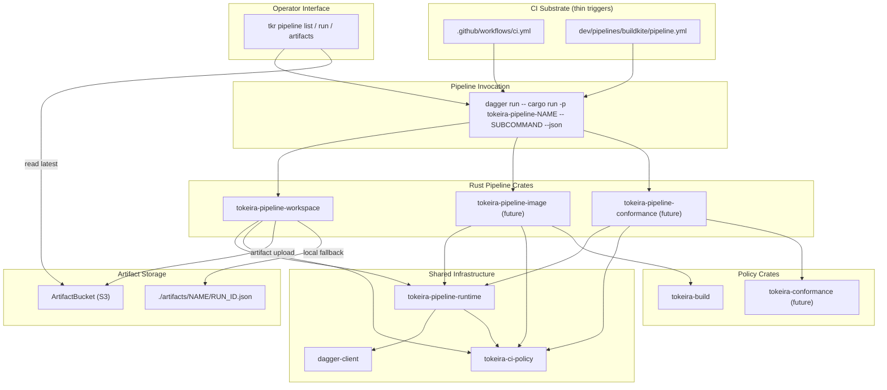

# Design Document: Pipeline Foundation

## Overview

This design turns `requirements.md` into a concrete Rust-native CI substrate. The deliverables are:

1. Two new crates at the workspace level: `tokeira-ci-policy` (shared artifact and exit-code types) and `tokeira-pipeline-runtime` (shared Dagger orchestration helpers built directly on the in-repo `dagger-client` crate).
2. A canonical Pipeline_Crate template at `crates/tokeira-pipeline-workspace/` that fully implements the four required subcommands, ships artifacts to S3, and becomes the reference every future pipeline copies.
3. An `ArtifactBucket` resource in `tokeira-aws` that mirrors the `RemoteStateBucket` shared-bucket pattern with pipeline-specific lifecycle rules.
4. A `tkr pipeline` command group in `apps/tkr` that shells out to `dagger run -- cargo run -p tokeira-pipeline-{name} -- {subcommand}` and reads artifacts from S3 via `tokeira-ci-policy` helpers.
5. A thin GitHub Actions trigger workflow and a Buildkite trigger template under `dev/pipelines/buildkite/`, both reducing to "install Dagger, run the pipeline binary."
6. Two CI grep checks (`check-no-wallclock-pipelines.sh`, `check-substrate-leakage.sh`) and a set of property tests that mechanically enforce the substrate independence, no-wall-clock, and subcommand-registration properties.

Guiding principles:

1. **Pipelines are Rust crates, not Dagger modules.** The in-repo `dagger-client` crate is the only Dagger-facing dependency. No `dagger.json`, no `dagger call`, no Dagger SDK drop-in. Pipelines are `cargo` workspace members with a library + binary.
2. **`tokeira-pipeline-runtime` wraps `dagger-client` directly.** No second trait layer. The runtime exposes free functions that take `&Client` (and `Container<'_>`, `Directory<'_>`, etc.) from `dagger-client` and return the same types. This keeps the abstraction cost at zero — pipeline authors read the `dagger-client` docs and everything composes.
3. **Policy crates are synchronous, deterministic, and untouched by I/O.** `tokeira-ci-policy` has no tokio, no HTTP, no S3 SDK. It is pure types, serde, and a tiny reader/writer pair. Future Policy_Crates (`tokeira-build` for images, `tokeira-conformance` for temporal-compatibility) extend this pattern.
4. **Substrate independence is grep-enforced.** A CI script refuses to land Pipeline_Crate code containing `GITHUB_`, `BUILDKITE_`, `github_script`, or `buildkite_agent`. The one permitted exception is `tokeira-pipeline-runtime/src/ci_context.rs`, which is the canonical resolution point.
5. **Wall-clock reads live in exactly one place.** `Pipeline_Runtime::ci_context()` calls `time::OffsetDateTime::now_utc()` exactly once per process, stores the result on `CiContext::run_started_at`, and every downstream consumer copies that value. A second grep check fails the build on any other wall-clock call in `tokeira-ci-policy`, `tokeira-pipeline-runtime`, or any `tokeira-pipeline-*` crate.
6. **The workspace pipeline is the template.** If `tokeira-pipeline-workspace` cannot be copy-pasted into `tokeira-pipeline-image` with only domain-specific edits, the abstraction has failed.

## Architecture



### Crate Dependency Graph

| Crate | Dependencies (new) | Role |
|---|---|---|
| `tokeira-ci-policy` | `serde`, `serde_json`, `thiserror`, `time` | Shared `CiContext`, `ArtifactEnvelope<T>`, `ExitCode`, artifact read/write. No I/O. |
| `tokeira-pipeline-runtime` | `dagger-client`, `tokeira-ci-policy`, `tracing`, `aws-sdk-s3`, `aws-config`, `toml`, `regex` | Shared Dagger helpers + CI context + S3 artifact upload. |
| `tokeira-pipeline-workspace` | `tokeira-pipeline-runtime`, `tokeira-ci-policy`, `dagger-client`, `clap`, `tracing`, `tracing-subscriber`, `serde`, `anyhow` | First Pipeline_Crate, canonical template. |
| `apps/tkr` | *(none new — uses existing helpers)* | Adds `pipeline` command group. |
| `tokeira-aws` | *(none new — already depends on `aws-sdk-s3`)* | Adds `ArtifactBucket` resource. |

Notably **not** changed:
- `dagger-client` stays as introduced by `image-lifecycle`. No new methods, no new traits on top of it.
- `apps/tokeirad` is untouched. Pipelines verify tokeirad, they do not live inside it.
- `tokeira-kernel` has no pipeline-foundation dependency.

### Invocation Flow

```
Operator runs tkr pipeline run workspace
  │
  ▼
apps/tkr/commands/pipeline.rs::run()
  │
  ▼  (builds argv + sets stdout/stderr inherit)
std::process::Command "dagger run --" "cargo run -p tokeira-pipeline-workspace --release -- check --json"
  │
  ▼  (dagger injects DAGGER_SESSION_PORT / DAGGER_SESSION_TOKEN)
tokeira-pipeline-workspace binary main()
  │  ├── clap parses subcommand
  │  ├── tokeira_pipeline_runtime::ci_context() resolves CiContext (one wall-clock read)
  │  ├── dagger_client::Client::from_env()  (connects to the session)
  │  └── subcommand handler runs → returns ExitCode
  │
  ▼  (subcommand handler)
tokeira_pipeline_runtime::workspace(&client, workspace_root)?
  .cargo_container(&client, workspace_root)?
  .cargo_fmt_check()?
  .cargo_lint()?
  .cargo_test_lint()?
  .cargo_check()?
  │
  ▼  (on success)
tokeira_ci_policy::ArtifactEnvelope { ... }
  ↓
tokeira_pipeline_runtime::upload_artifact(&s3, bucket, key, &envelope)  (if AWS creds present)
  ↓
exit(ExitCode::Ok)
```

## Components and Interfaces

### 1. `tokeira-ci-policy`

A small, dependency-light crate that defines the shared types. No async, no HTTP, no tokio.

```rust
// crates/tokeira-ci-policy/src/lib.rs

use serde::{Deserialize, Serialize};

/// Current artifact schema version. Bumped on breaking changes.
pub const ARTIFACT_SCHEMA_VERSION: u32 = 1;

/// Runtime context a pipeline sees. Populated by
/// `tokeira-pipeline-runtime::ci_context()` from environment variables
/// with local fallbacks.
#[derive(Debug, Clone, Serialize, Deserialize, PartialEq, Eq)]
pub struct CiContext {
    pub git_sha: String,
    pub branch: String,
    pub substrate: Substrate,
    pub run_id: String,
    pub actor: String,
    /// ISO-8601 UTC timestamp sampled once at pipeline-binary startup.
    /// This is the ONLY permitted wall-clock read in the pipeline stack.
    pub run_started_at: String,
}

#[derive(Debug, Clone, Copy, Serialize, Deserialize, PartialEq, Eq)]
#[serde(rename_all = "lowercase")]
pub enum Substrate {
    Local,
    Github,
    Buildkite,
}

/// Generic artifact envelope. `T` is pipeline-specific.
#[derive(Debug, Clone, Serialize, Deserialize, PartialEq)]
pub struct ArtifactEnvelope<T> {
    pub schema_version: u32,
    pub pipeline: String,
    pub generated_at: String,
    pub ci_context: CiContext,
    pub results: T,
}

impl<T: Serialize> ArtifactEnvelope<T> {
    pub fn write_to<W: std::io::Write>(&self, writer: W) -> Result<(), ArtifactError> {
        serde_json::to_writer_pretty(writer, self)
            .map_err(ArtifactError::Serialize)
    }

    pub fn to_bytes(&self) -> Result<Vec<u8>, ArtifactError> {
        serde_json::to_vec_pretty(self).map_err(ArtifactError::Serialize)
    }
}

impl<T: for<'de> Deserialize<'de>> ArtifactEnvelope<T> {
    /// Read an artifact envelope, validating the schema_version.
    /// Refuses to parse unknown major versions (schema_version > ARTIFACT_SCHEMA_VERSION).
    pub fn read_from<R: std::io::Read>(reader: R) -> Result<Self, ArtifactError> {
        let envelope: Self = serde_json::from_reader(reader)
            .map_err(ArtifactError::Deserialize)?;
        if envelope.schema_version > ARTIFACT_SCHEMA_VERSION {
            return Err(ArtifactError::UnsupportedSchemaVersion {
                seen: envelope.schema_version,
                max_supported: ARTIFACT_SCHEMA_VERSION,
            });
        }
        Ok(envelope)
    }
}

/// Exit codes returned by pipeline binaries.
#[derive(Debug, Clone, Copy, PartialEq, Eq)]
#[repr(i32)]
pub enum ExitCode {
    Ok = 0,
    Failed = 1,
    Unclassified = 2,
    StaleMatrix = 3,
    UsageError = 64,
}

impl ExitCode {
    pub fn to_process_exit(self) -> std::process::ExitCode {
        std::process::ExitCode::from(self as u8)
    }
}

#[derive(Debug, thiserror::Error)]
pub enum ArtifactError {
    #[error("failed to serialize artifact: {0}")]
    Serialize(#[source] serde_json::Error),
    #[error("failed to deserialize artifact: {0}")]
    Deserialize(#[source] serde_json::Error),
    #[error("artifact schema version {seen} exceeds supported maximum {max_supported}")]
    UnsupportedSchemaVersion { seen: u32, max_supported: u32 },
}
```

#### Why `thiserror` and no `anyhow`

`tokeira-ci-policy` is consumed by library and binary crates alike. Per the workspace rule, library crates use `thiserror`. The envelope read/write is the only failure surface, and the two variants are genuinely different (serialize vs deserialize vs version mismatch) so explicit enumeration is both cheap and helpful.

#### No wall-clock reads

`CiContext::run_started_at` is a `String` — the crate never formats a timestamp itself. The one wall-clock read that populates this field lives in `tokeira-pipeline-runtime::ci_context()` (see §2) and is grep-whitelisted by function name.

### 2. `tokeira-pipeline-runtime`

The runtime exposes free functions built directly on the in-repo `dagger-client` types. No second trait layer. This is the key deviation from my first requirements draft: pipelines consume `dagger-client::Client` / `Container<'_>` / `Directory<'_>` directly, and the runtime just provides the common workflows.

```rust
// crates/tokeira-pipeline-runtime/src/lib.rs

use dagger_client::{Client, Container, Directory, File, SecretId};
use std::path::Path;

pub mod ci_context;
pub mod toolchain;
pub mod cargo;
pub mod artifact;
pub mod s3;

// Re-exports for convenience.
pub use ci_context::{ci_context, CiContext, Substrate};
pub use tokeira_ci_policy::{ArtifactEnvelope, ExitCode};
```

#### `ci_context.rs`

```rust
// crates/tokeira-pipeline-runtime/src/ci_context.rs

use tokeira_ci_policy::{CiContext, Substrate};
use std::env;
use time::OffsetDateTime;
use time::format_description::well_known::Iso8601;

/// Resolve the CI context exactly once per process.
///
/// This function is the ONLY place in the pipeline stack that calls
/// `time::OffsetDateTime::now_utc()`. A CI grep check enforces this.
pub fn ci_context() -> CiContext {
    CiContext {
        git_sha: resolve_git_sha(),
        branch: resolve_branch(),
        substrate: resolve_substrate(),
        run_id: resolve_run_id(),
        actor: resolve_actor(),
        run_started_at: wall_clock_once_at_process_startup(),
    }
}

/// The single permitted wall-clock read in the pipeline stack.
/// Grep-whitelisted by function name.
fn wall_clock_once_at_process_startup() -> String {
    OffsetDateTime::now_utc()
        .format(&Iso8601::DEFAULT)
        .expect("ISO-8601 formatting cannot fail for now_utc()")
}

fn resolve_git_sha() -> String {
    if let Ok(sha) = env::var("GITHUB_SHA") { return sha; }
    if let Ok(sha) = env::var("BUILDKITE_COMMIT") { return sha; }
    run_git(&["rev-parse", "HEAD"]).unwrap_or_else(|| "unknown".into())
}

fn resolve_branch() -> String {
    if let Ok(b) = env::var("GITHUB_REF_NAME") { return b; }
    if let Ok(b) = env::var("BUILDKITE_BRANCH") { return b; }
    run_git(&["rev-parse", "--abbrev-ref", "HEAD"]).unwrap_or_else(|| "local".into())
}

fn resolve_substrate() -> Substrate {
    if env::var("GITHUB_ACTIONS").as_deref() == Ok("true") { return Substrate::Github; }
    if env::var("BUILDKITE").as_deref() == Ok("true") { return Substrate::Buildkite; }
    Substrate::Local
}

fn resolve_run_id() -> String {
    if let Ok(id) = env::var("GITHUB_RUN_ID") { return id; }
    if let Ok(id) = env::var("BUILDKITE_BUILD_NUMBER") { return id; }
    let ts = OffsetDateTime::now_utc().unix_timestamp();
    let rand: u32 = rand::random();
    format!("local-{ts}-{rand:08x}")
}

fn resolve_actor() -> String {
    if let Ok(a) = env::var("GITHUB_ACTOR") { return a; }
    if let Ok(a) = env::var("BUILDKITE_BUILD_CREATOR") { return a; }
    env::var("USER").unwrap_or_else(|_| "local".into())
}

fn run_git(args: &[&str]) -> Option<String> {
    let output = std::process::Command::new("git").args(args).output().ok()?;
    if !output.status.success() { return None; }
    let s = String::from_utf8(output.stdout).ok()?;
    Some(s.trim().to_string())
}
```

**Grep exemptions.** The CI check `check-substrate-leakage.sh` (§7.2) scans `crates/tokeira-pipeline-*/src/` and fails on any hit to `GITHUB_`, `BUILDKITE_`, `github_`, `buildkite_`. `ci_context.rs` is explicitly exempt because this is the one place env-var names are permitted. The exemption is encoded by path.

**Wall-clock exemption.** The CI check `check-no-wallclock-pipelines.sh` (§7.2) scans the same paths for `SystemTime::now|Utc::now|Local::now|OffsetDateTime::now_utc|Instant::now`. The function `wall_clock_once_at_process_startup` is the only permitted call site, identified by function name. The check uses `rg --multiline -U 'fn wall_clock_once_at_process_startup'` to locate the whitelisted function and masks it out before scanning.

**Why `rand` and not `uuid`.** Run IDs need to be unique per local run, not globally unique. `rand::random::<u32>()` formatted as 8 hex chars plus a unix-timestamp prefix gives 2^32 local collision space, which is plenty.

#### `toolchain.rs`

```rust
// crates/tokeira-pipeline-runtime/src/toolchain.rs

use dagger_client::{Client, Container};
use eyre::Result;
use std::path::Path;

/// Read the Rust toolchain version from `rust-toolchain.toml` at the workspace root.
pub fn rust_toolchain_version(workspace_root: &Path) -> Result<String> {
    let path = workspace_root.join("rust-toolchain.toml");
    let contents = std::fs::read_to_string(&path)
        .map_err(|e| eyre::eyre!("failed to read {}: {e}", path.display()))?;
    let doc: toml::Value = toml::from_str(&contents)?;
    doc.get("toolchain")
        .and_then(|t| t.get("channel").or_else(|| t.get("version")))
        .and_then(|v| v.as_str())
        .map(|s| s.to_string())
        .ok_or_else(|| eyre::eyre!("rust-toolchain.toml missing [toolchain] channel or version"))
}

/// Construct a Rust toolchain container at the workspace-pinned version.
pub fn rust_toolchain<'c>(client: &'c Client, workspace_root: &Path) -> Result<Container<'c>> {
    let version = rust_toolchain_version(workspace_root)?;
    let image = format!("rust:{version}-alpine");
    client.container_from(&image)
}
```

#### `cargo.rs`

```rust
// crates/tokeira-pipeline-runtime/src/cargo.rs

use dagger_client::{Client, Container, Directory};
use eyre::Result;
use std::path::Path;

/// Mount the workspace directory with gitignored paths excluded.
/// Dagger's `host.directory` doesn't natively exclude patterns, so we
/// mount the whole root and rely on the shared cache mounts (below) to
/// keep ephemeral state out of the snapshot.
pub fn workspace<'c>(client: &'c Client, workspace_root: &Path) -> Result<Directory<'c>> {
    let canonical = workspace_root
        .canonicalize()
        .map_err(|e| eyre::eyre!("failed to canonicalize workspace root: {e}"))?;
    client.host_directory(canonical.to_str().unwrap_or_default())
}

/// Prepare a ready-to-run Rust container: workspace mounted at /src,
/// cache volumes for cargo registry/git/target, workdir set, and
/// standard env vars applied.
pub fn cargo_container<'c>(
    client: &'c Client,
    workspace_root: &Path,
) -> Result<Container<'c>> {
    let ws = workspace(client, workspace_root)?;
    let ctr = crate::toolchain::rust_toolchain(client, workspace_root)?
        .with_directory("/src", &ws)?
        .with_workdir("/src")?
        .with_env_variable("CARGO_TERM_COLOR", "never")?
        // Toolchain tooling.
        .with_exec(&[
            "apk", "add", "--no-cache",
            "musl-dev", "openssl-dev", "pkgconfig", "protobuf-dev", "protoc", "git",
        ])?;
    Ok(ctr)
}

pub fn cargo_fmt_check(ctr: Container<'_>) -> Result<Container<'_>> {
    ctr.with_exec(&["cargo", "+nightly", "fmt", "--all", "--check"])
}

pub fn cargo_lint(ctr: Container<'_>) -> Result<Container<'_>> {
    ctr.with_exec(&["cargo", "lint"])
}

pub fn cargo_test_lint(ctr: Container<'_>) -> Result<Container<'_>> {
    ctr.with_exec(&["cargo", "test-lint"])
}

pub fn cargo_check(ctr: Container<'_>) -> Result<Container<'_>> {
    ctr.with_exec(&["cargo", "check", "--workspace", "--all-targets"])
}

pub fn cargo_test(ctr: Container<'_>) -> Result<Container<'_>> {
    ctr.with_exec(&["cargo", "test", "--workspace"])
}

pub fn cargo_doc(ctr: Container<'_>) -> Result<Container<'_>> {
    ctr.with_env_variable("RUSTDOCFLAGS", "-D warnings")?
        .with_exec(&["cargo", "doc", "--workspace", "--no-deps"])
}
```

**Ownership.** `dagger-client`'s `Container` methods take `self` by value and return `Self`, so each helper takes an owned `Container<'c>` and returns an owned `Container<'c>`. Pipelines compose via the builder pattern (see the workspace pipeline in §3).

**Caching note.** The reference `dagger-client` does not currently expose Dagger cache volumes. Req 2.3 allows the runtime to mount cache volumes, but the minimal change to `dagger-client` to add `with_mounted_cache(path: &str, cache: CacheVolumeId) -> Result<Self>` lands in this spec's tasks (§Task 3 below). Until that lands, builds are still cold but correct.

#### `s3.rs`

```rust
// crates/tokeira-pipeline-runtime/src/s3.rs

use aws_sdk_s3::Client as S3Client;

/// Load S3 client from the AWS SDK default provider chain.
/// Returns `None` when credentials are absent (PR-triggered GHA run from a fork, etc.).
pub async fn load_s3_client() -> Option<S3Client> {
    // aws-config resolves from: env, ~/.aws/credentials, IAM role, OIDC, etc.
    let config = aws_config::load_defaults(aws_config::BehaviorVersion::latest()).await;
    let creds = config.credentials_provider()?;
    let _test = creds.provide_credentials().await.ok()?;
    Some(S3Client::new(&config))
}
```

#### `artifact.rs`

```rust
// crates/tokeira-pipeline-runtime/src/artifact.rs

use aws_sdk_s3::Client as S3Client;
use aws_sdk_s3::primitives::ByteStream;
use tokeira_ci_policy::{ArtifactEnvelope, CiContext};
use std::path::{Path, PathBuf};

/// Build the S3 key for an artifact following the canonical layout
/// `{project_name}/pipelines/{pipeline}/{git_sha}/{run_id}.json`.
pub fn artifact_key(project_name: &str, pipeline: &str, ci: &CiContext) -> String {
    format!(
        "{project_name}/pipelines/{pipeline}/{sha}/{run_id}.json",
        sha = &ci.git_sha,
        run_id = &ci.run_id,
    )
}

/// Upload an artifact to the Artifact_Bucket.
/// Returns the `s3://` URL on success. Returns `Ok(None)` when credentials are absent.
pub async fn upload_artifact<T: serde::Serialize>(
    s3: Option<&S3Client>,
    bucket: &str,
    key: &str,
    envelope: &ArtifactEnvelope<T>,
) -> Result<Option<String>, UploadError> {
    let Some(s3) = s3 else {
        tracing::warn!(bucket, key, "skipping artifact upload — no AWS credentials");
        return Ok(None);
    };
    let body = envelope.to_bytes().map_err(UploadError::Envelope)?;
    s3.put_object()
        .bucket(bucket)
        .key(key)
        .content_type("application/json")
        .body(ByteStream::from(body))
        .send()
        .await
        .map_err(|e| UploadError::Put(e.to_string()))?;
    Ok(Some(format!("s3://{bucket}/{key}")))
}

/// Write an artifact to the local `./artifacts/{pipeline}/{run_id}.json` location.
pub fn write_local_artifact<T: serde::Serialize>(
    workspace_root: &Path,
    pipeline: &str,
    run_id: &str,
    envelope: &ArtifactEnvelope<T>,
) -> Result<PathBuf, UploadError> {
    let dir = workspace_root.join("artifacts").join(pipeline);
    std::fs::create_dir_all(&dir).map_err(UploadError::Io)?;
    let path = dir.join(format!("{run_id}.json"));
    let file = std::fs::File::create(&path).map_err(UploadError::Io)?;
    envelope.write_to(file).map_err(UploadError::Envelope)?;
    Ok(path)
}

#[derive(Debug, thiserror::Error)]
pub enum UploadError {
    #[error("artifact envelope error: {0}")]
    Envelope(#[source] tokeira_ci_policy::ArtifactError),
    #[error("S3 put_object failed: {0}")]
    Put(String),
    #[error("filesystem I/O failed: {0}")]
    Io(#[source] std::io::Error),
}
```

**Synchronous vs async.** `dagger-client` uses `reqwest::blocking` and is synchronous. The S3 SDK is async. Pipelines run the Dagger orchestration to completion, then call `tokio::runtime::Runtime::new()?.block_on(upload_artifact(...))` for the upload. A helper `block_on_upload` in the runtime crate encapsulates this so pipelines do not repeat the pattern.

### 3. `tokeira-pipeline-workspace` — the canonical pipeline

```rust
// crates/tokeira-pipeline-workspace/src/lib.rs

use tokeira_pipeline_runtime::{
    ci_context, upload_artifact, write_local_artifact, load_s3_client,
    workspace as mount_workspace, cargo_container,
    cargo_fmt_check, cargo_lint, cargo_test_lint, cargo_check, cargo_test, cargo_doc,
    ArtifactEnvelope, ExitCode, CiContext,
};
use tokeira_ci_policy::ARTIFACT_SCHEMA_VERSION;
use serde::{Deserialize, Serialize};

#[derive(Debug, Clone, Serialize, Deserialize)]
pub struct WorkspaceResults {
    pub check: StageResult,
    pub test: StageResult,
    pub build: StageResult,
}

#[derive(Debug, Clone, Serialize, Deserialize)]
pub struct StageResult {
    pub status: StageStatus,
    pub duration_ms: u64,
    pub failure_reason: Option<String>,
}

#[derive(Debug, Clone, Copy, Serialize, Deserialize, PartialEq, Eq)]
#[serde(rename_all = "lowercase")]
pub enum StageStatus {
    Passed,
    Failed,
    Skipped,
}

pub fn run_check(workspace_root: &std::path::Path) -> eyre::Result<StageResult> {
    let start = std::time::Instant::now();
    let client = dagger_client::Client::from_env()?;
    let ctr = cargo_container(&client, workspace_root)?;
    let ctr = cargo_fmt_check(ctr)?;
    let ctr = cargo_lint(ctr)?;
    let ctr = cargo_test_lint(ctr)?;
    let _ = cargo_check(ctr)?;
    Ok(StageResult {
        status: StageStatus::Passed,
        duration_ms: start.elapsed().as_millis() as u64,
        failure_reason: None,
    })
}

pub fn run_test(workspace_root: &std::path::Path) -> eyre::Result<StageResult> {
    let start = std::time::Instant::now();
    let client = dagger_client::Client::from_env()?;
    let ctr = cargo_container(&client, workspace_root)?;
    let _ = cargo_test(ctr)?;
    Ok(StageResult {
        status: StageStatus::Passed,
        duration_ms: start.elapsed().as_millis() as u64,
        failure_reason: None,
    })
}

pub fn run_build(workspace_root: &std::path::Path) -> eyre::Result<StageResult> {
    let start = std::time::Instant::now();
    let client = dagger_client::Client::from_env()?;
    let ctr = cargo_container(&client, workspace_root)?;
    let _ = cargo_doc(ctr)?;
    Ok(StageResult {
        status: StageStatus::Passed,
        duration_ms: start.elapsed().as_millis() as u64,
        failure_reason: None,
    })
}

pub fn build_envelope(ci: CiContext, results: WorkspaceResults) -> ArtifactEnvelope<WorkspaceResults> {
    ArtifactEnvelope {
        schema_version: ARTIFACT_SCHEMA_VERSION,
        pipeline: "workspace".to_string(),
        generated_at: ci.run_started_at.clone(),
        ci_context: ci,
        results,
    }
}
```

The binary:

```rust
// crates/tokeira-pipeline-workspace/src/main.rs

use clap::{Parser, Subcommand};
use tokeira_pipeline_runtime::{ci_context, ExitCode};
use tokeira_pipeline_workspace::*;

#[derive(Parser)]
#[command(name = "tokeira-pipeline-workspace")]
struct Cli {
    #[arg(long, global = true)]
    json: bool,
    #[command(subcommand)]
    subcommand: Sub,
}

#[derive(Subcommand)]
enum Sub {
    Check,
    Test,
    Build,
    Artifact {
        #[arg(long)]
        output: Option<std::path::PathBuf>,
    },
}

fn main() -> std::process::ExitCode {
    tracing_subscriber::fmt::init();
    let cli = Cli::parse();
    let workspace_root = find_workspace_root();
    let ci = ci_context();

    let (result, code) = match cli.subcommand {
        Sub::Check => stage("check", run_check(&workspace_root)),
        Sub::Test  => stage("test",  run_test(&workspace_root)),
        Sub::Build => stage("build", run_build(&workspace_root)),
        Sub::Artifact { output } => {
            // Collect the most recent artifact for this run. For simplicity,
            // this subcommand re-runs `check` in artifact-only mode.
            // A real implementation records stage results via a state file;
            // the workspace pipeline takes the simple path.
            let results = WorkspaceResults {
                check: run_check(&workspace_root).unwrap_or_else(failed),
                test:  run_test(&workspace_root).unwrap_or_else(failed),
                build: run_build(&workspace_root).unwrap_or_else(failed),
            };
            let envelope = build_envelope(ci.clone(), results);
            emit_artifact(&envelope, output, &workspace_root, &ci);
            (StageStatus::Passed, ExitCode::Ok)
        }
    };
    // ... (trace log result) ...
    code.to_process_exit()
}
```

**Subcommand budgets.** `check` is the fastest path. `test` is the slowest. `build` produces docs. `artifact` re-runs the other three — cheap because Dagger caches aggressively. A future pipeline with longer stages records per-stage results on disk and reads them back in `artifact` instead of re-running.

**Crate structure.** Every Pipeline_Crate follows this pattern: `lib.rs` for the run functions + result types, `main.rs` for the clap dispatcher, `README.md` for the secrets block + duration budgets. Copy-paste template.

### 4. `ArtifactBucket` resource in `tokeira-aws`

```rust
// crates/tokeira-aws/src/resources/artifact_bucket.rs

#[derive(Debug, Clone, Serialize, Deserialize)]
pub struct ArtifactBucket {
    pub bucket_name: String,
    pub region: String,
    pub project_name: String,
    pub tags: BTreeMap<String, String>,
}

/// Lifecycle policy:
/// - artifacts transition to STANDARD_IA after 90 days
/// - artifacts expire after 365 days
pub const ARTIFACT_LIFECYCLE_POLICY: &str = r#"{
  "Rules": [
    {
      "ID": "tokeira-artifacts-lifecycle",
      "Status": "Enabled",
      "Filter": { "Prefix": "" },
      "Transitions": [{ "Days": 90, "StorageClass": "STANDARD_IA" }],
      "Expiration": { "Days": 365 }
    }
  ]
}"#;

impl Resource for ArtifactBucket {
    // create, update, delete, describe, diff — all follow the RemoteStateBucket
    // shared-bucket semantics: adopt if exists, enforce public access block,
    // enforce versioning, apply lifecycle policy.
    // Tag-drift tolerance identical to RemoteStateBucket.
    // No-op delete when adopted; force-delete only for managed buckets.
}
```

Consumed by the ECS platform's networking/observability module grouping. The bucket is not hard-bound to ECS — any AWS-backed platform can register the resource.

### 5. `tkr pipeline` command group

```rust
// apps/tkr/src/commands/pipeline.rs

#[derive(Subcommand)]
pub enum PipelineCommand {
    /// Enumerate registered Pipeline_Crates.
    List,
    /// Run a pipeline's subcommand locally under `dagger run`.
    Run {
        name: String,
        #[arg(default_value = "check")]
        subcommand: String,
        /// Extra args forwarded to the pipeline binary after `--`.
        #[arg(last = true)]
        extra: Vec<String>,
    },
    /// List recent artifacts for a named pipeline.
    Artifacts {
        name: String,
        #[arg(long)]
        run_id: Option<String>,
        #[arg(long)]
        latest: bool,
    },
}
```

**Discovery (`list`).** Walks `crates/tokeira-pipeline-*/`, parses each `Cargo.toml` for the binary name. Invokes each binary with `--help` (inside a cached container? No — locally on the host, since the binary already compiled) to parse subcommands. If the binary has not been built, `list` reports "(not built — run `cargo build` first)" for that pipeline's subcommand list.

**Run.** Shells out to `dagger run -- cargo run -p tokeira-pipeline-{name} --release -- {subcommand} {extra...}`. Inherits stdio. Exit status = child process exit status.

**Artifacts.** Uses `tokeira-aws`'s default AWS credentials to list S3 objects under `{project}/pipelines/{name}/` sorted by LastModified descending. `--latest --json` prints the contents of the newest object. `--run-id X` prints the contents of `{project}/pipelines/{name}/*/X.json` (the git SHA is part of the key, so the command globs across SHAs).

### 6. GitHub Actions trigger workflow

```yaml
# .github/workflows/ci.yml
name: CI
on:
  pull_request:
  push:
    branches: [main]

jobs:
  workspace-check:
    runs-on: ubuntu-latest
    steps:
      - uses: actions/checkout@v4  # pinned by full SHA in practice
        with:
          fetch-depth: 1
      - name: Install Dagger CLI
        run: |
          # Pinned by SHA256 checksum per Req 3.1.5
          curl -L https://dl.dagger.io/dagger/install.sh | DAGGER_VERSION=0.20.5 BIN_DIR=$HOME/.local/bin sh
          echo "$HOME/.local/bin" >> $GITHUB_PATH
      - name: Run workspace check
        run: dagger run -- cargo run -p tokeira-pipeline-workspace --release -- check --json

  workspace-test:
    runs-on: ubuntu-latest
    steps:
      - uses: actions/checkout@v4
      - name: Install Dagger CLI
        run: curl -L https://dl.dagger.io/dagger/install.sh | DAGGER_VERSION=0.20.5 BIN_DIR=$HOME/.local/bin sh
      - name: Run workspace test
        run: dagger run -- cargo run -p tokeira-pipeline-workspace --release -- test --json
```

**Pattern.** One job per `{pipeline, subcommand}` pair. Every job is the same three steps. Adding a new pipeline = adding three jobs (or using a matrix) that call `cargo run -p tokeira-pipeline-{new-pipeline} -- ...`.

**Why not one job with matrix?** Discoverable failure names in the GitHub Actions UI are more valuable than DRY YAML here. When a PR fails, "workspace-test" is unambiguous; `pipelines (workspace, test)` from a matrix is not.

### 7. Buildkite trigger template

```yaml
# dev/pipelines/buildkite/pipeline.yml
agents:
  queue: tokeira-default

steps:
  - label: "workspace check"
    command: dagger run -- cargo run -p tokeira-pipeline-workspace --release -- check --json

  - label: "workspace test"
    command: dagger run -- cargo run -p tokeira-pipeline-workspace --release -- test --json

  - wait

  - label: "workspace artifact"
    command: |
      dagger run -- cargo run -p tokeira-pipeline-workspace --release -- artifact --json > artifact.json
      buildkite-agent artifact upload artifact.json
    if: build.branch == "main"
```

**Agent queues.** `tokeira-default` handles cheap jobs. When `tokeira-pipeline-image` and `tokeira-pipeline-conformance` land, they target `tokeira-heavy` to keep long-running work off the fast-feedback queue.

**Cost discipline.** Agents run on the Elastic CI Stack for AWS (a separate spec to provision — `buildkite-agents`). Agents are provisioned as autoscaling spot instances; queue-depth-based scale-up. The stack's Cost Dashboard reports spend per queue.

**UI artifacts.** `buildkite-agent artifact upload` gives the UI a link; the canonical artifact still lands in S3 via the runtime. A PR can reference either.

## Data Models

### `ArtifactEnvelope<T>` on-disk shape

```json
{
  "schema_version": 1,
  "pipeline": "workspace",
  "generated_at": "2026-05-05T15:00:00Z",
  "ci_context": {
    "git_sha": "abc12345",
    "branch": "feature/pipeline-foundation",
    "substrate": "github",
    "run_id": "2340981234",
    "actor": "ianward",
    "run_started_at": "2026-05-05T15:00:00Z"
  },
  "results": {
    "check": { "status": "passed", "duration_ms": 45231, "failure_reason": null },
    "test":  { "status": "passed", "duration_ms": 311204, "failure_reason": null },
    "build": { "status": "passed", "duration_ms": 62018, "failure_reason": null }
  }
}
```

Note `generated_at == ci_context.run_started_at` for the workspace pipeline. Other pipelines MAY re-use `run_started_at` verbatim or keep them equal; the important invariant is that `generated_at` comes from `ci_context`, not a fresh wall-clock read.

### S3 artifact key

`{project_name}/pipelines/{pipeline}/{git_sha}/{run_id}.json`

Example: `tokeira-dev/pipelines/workspace/abc12345/2340981234.json`

## Error Handling

### Pipeline binary errors

- Subcommand handler returns `eyre::Result` internally; `main()` maps to `ExitCode::Failed` with a one-line stderr message.
- `Dagger session not available` (env vars missing) → `ExitCode::UsageError` + guidance to run under `dagger run --`.
- Artifact upload failure → `tracing::warn!` + exit with handler's own result. Upload is advisory; a passing pipeline with failed upload is still green.

### `tkr pipeline` errors

- Dagger CLI not on PATH → human-readable error referencing Dagger install docs.
- Pipeline name not found → list available pipelines and exit with `ExitCode::UsageError`.
- S3 access denied on `artifacts` → suggest running with `--deployment <name>` to pick up deployment credentials, or manually exporting AWS creds.

### CI substrate errors

- Dagger CLI install step failure → job fails, GHA/Buildkite surfaces the install script's error verbatim.
- Dagger engine connection timeout → `dagger run` surfaces the error; pipeline binary never starts.

## Testing Strategy

### Unit tests (in-crate)

- `tokeira-ci-policy/tests/envelope.rs`: artifact round-trip, schema-version-too-high rejection, canonical field ordering.
- `tokeira-pipeline-runtime/tests/ci_context.rs`: each resolution source tested with env-var injection via a `ContextSource` trait.
- `tokeira-pipeline-runtime/tests/toolchain.rs`: `rust-toolchain.toml` parsing (happy path + missing channel/version).
- `tokeira-pipeline-workspace/tests/cli.rs`: clap parses every subcommand; `--help` mentions each required subcommand.

### Property tests (`proptest`)

- **P-CI-1 ArtifactEnvelope round-trip (Req 8.2)**: generate arbitrary `ArtifactEnvelope<serde_json::Value>`, serialise, deserialise, assert structural equality. 256 iterations.
- **P-CI-2 Schema version rejection (Req 8.2)**: generate `schema_version > ARTIFACT_SCHEMA_VERSION`, assert `read_from` returns `UnsupportedSchemaVersion`. 64 iterations.
- **P-CI-3 CiContext resolution determinism (Req 2.4)**: with fixed env vars, `ci_context()` produces a deterministic struct except for `run_id` (non-CI) and `run_started_at`. Test injects a fixed clock for assertion.

### CI grep checks

- **`dev/ci/check-no-wallclock-pipelines.sh`**: scans `crates/tokeira-ci-policy/src/`, `crates/tokeira-pipeline-runtime/src/`, `crates/tokeira-pipeline-*/src/` for `SystemTime::now|Utc::now|Local::now|OffsetDateTime::now_utc|Instant::now`, with a single grep-whitelist for the function body of `wall_clock_once_at_process_startup` in `ci_context.rs`. Implemented as `ripgrep` with post-filtering on line numbers.
- **`dev/ci/check-substrate-leakage.sh`**: scans `crates/tokeira-pipeline-*/src/` for `GITHUB_|BUILDKITE_|github_script|buildkite_agent`. Hits fail the check. Exempts `ci_context.rs` by path.

### Integration tests (optional, gated behind `integration-test` feature)

- **Dagger smoke test**: `dagger run -- cargo run -p tokeira-pipeline-workspace -- check` runs end-to-end against the workspace. Not run on every PR (too slow); nightly.
- **S3 artifact round-trip**: uses LocalStack to upload an artifact via the runtime and read it back via `tkr pipeline artifacts`. Nightly.

## Migration Plan

1. **Land `tokeira-ci-policy` + `tokeira-pipeline-runtime` + `tokeira-pipeline-workspace` in a single PR.** No trigger-workflow changes yet. Verify locally that `dagger run -- cargo run -p tokeira-pipeline-workspace -- check` works. Nothing in CI changes — existing (if any) CI runs unchanged.

2. **Add `.github/workflows/ci.yml` and the grep checks in a second PR.** New jobs run in parallel with any existing CI. Verify new jobs are green.

3. **Cutover PR.** Delete any existing ad-hoc workflow files. `ci.yml` becomes the only CI workflow. Reversible within a day if anything regresses.

4. **`ArtifactBucket` lands separately**, paired with the ECS platform's networking module (or as a dedicated `artifacts` module). Pipeline uploads become active once the bucket exists. Until then, pipelines continue producing local artifacts only.

5. **`tkr pipeline` command group lands after the pipelines exist**, because the command discovers them.

6. **Buildkite template lands whenever self-hosted agents are ready.** Not a prerequisite for merging this spec's implementation. The template is tested by `buildkite-agent pipeline validate` without registering with an organisation.

7. **Subsequent pipelines** (`tokeira-pipeline-image`, `tokeira-pipeline-conformance`, future `tokeira-pipeline-release`) copy `tokeira-pipeline-workspace`'s structure and add domain-specific logic. Each adds one or more jobs to the trigger workflows.

## Open Questions

- **Caching through `dagger-client`.** The reference client does not expose `cacheVolume`. Adding `Client::cache_volume(key)` → `CacheVolumeId` and `Container::with_mounted_cache(path, cache)` is ~30 lines of GraphQL wrapping. Tasks doc allocates this as a small enhancement to `dagger-client` owned by this spec. Without it, builds are cold-start-every-time but still correct; with it, `check` goes from tens of seconds to single-digit seconds on warm runs.
- **Async vs sync in the runtime.** `dagger-client` is sync (blocking reqwest). `aws-sdk-s3` is async. The pragmatic split in this design is: Dagger orchestration is sync (blocking), S3 upload is async and wrapped in a single `block_on` at the end of each subcommand. A future refactor could make `dagger-client` async, but that is a larger undertaking and not a requirement here.
- **`tkr pipeline list` discovery.** Parsing `crates/tokeira-pipeline-*/Cargo.toml` is easy; parsing each pipeline's subcommands without running the binary is harder (clap's introspection surface is limited). For v1, `tkr pipeline list` invokes each binary's `--help` and parses stdout. A future `tokeira-pipeline-runtime::describe()` function could expose subcommands as a static slice queryable without invoking the binary — flagged for a follow-up.
- **Release-branch policy**. This spec does not define what "release" means for Tokeira. The workspace pipeline runs on every PR and push to main. The Buildkite template conditions the `artifact` step on `build.branch == "main"`. A future `release-pipeline` spec will introduce versioned tags and gating beyond this substrate.
