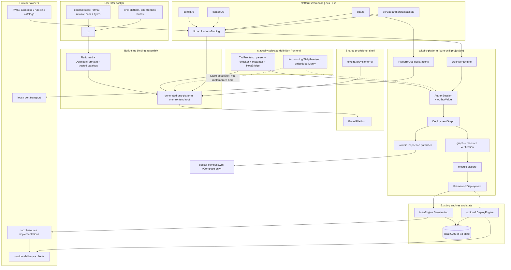

# Design Document: Platform Builder Abstraction

## Overview

This design introduces `crates/tokeira-platform` as the definition-language-neutral platform framework
for Compose, ECS, and EKS. It extracts the Authoring Contract, graph, handles, kind dispatch, module
selection, engine projection, writeback, definition verification, content coupling, and derived-artifact
publication that are duplicated or platform-local today. A platform package retains only its typed
configuration, invocation context, pure operations declarations, binding assembly, and its service and
artifact content.

The approved behavior baseline is
`.kiro/specs/platform-builder-abstraction/requirements.md` at SHA-256
`6d3f975862a487475ac1a0cff42bdcb2c39a49e047a041dad2094cdfee6002cb`. The design is grounded in:

- `crates/tokeira-tkd/src/{bridge,eval,subset,value}.rs`, which owns the existing generic interpreter and
  `HostBridge` seam;
- `platforms/compose/src/{builder,bridge,adapter,provisioner}.rs` and
  `platforms/eks/src/{builder,bridge}.rs`, which expose the duplicated framework behavior being moved;
- `crates/tokeira-iac/src/{lib,module,engine,types}.rs` and
  `crates/tokeira-orchestrator/src/lib.rs`, which remain the provider-neutral lifecycle contracts;
- `crates/tokeira-provisioner-cli/src/`, which remains the lifecycle, binding, locking, revision, and
  reporting owner;
- `apps/tkr/src/{cli,deployment_dir,bundle_create,metadata}.rs` and
  `crates/tokeira-orchestrator/src/lib.rs`, where `tkr` currently selects and persists a closed
  `PlatformKind` and the source/bundle build path separately hard-codes the Compose package; the target
  replaces both with catalog-resolved `PlatformId`;
- `crates/tokeira-build/src/{closure,pipelines/provisioner}.rs`, whose current build request accepts one
  provisioner build-root Cargo package and binary target and therefore provides the correct owner for
  metadata-derived composition-root generation and multi-root source-closure resolution;
- `.kiro/specs/ecs-deployment/`, `.kiro/specs/ecs-production-readiness/`, and
  `.kiro/specs/platform-eks/`, which remain authoritative for concrete ECS and EKS behavior except for the
  ownership and source-layout clauses superseded by this feature;
- Pydantic Monty
  [PR #626](https://github.com/pydantic/monty/pull/626), merged as
  [`35626eb`](https://github.com/pydantic/monty/commit/35626ebc037d45d903e76733143e9dd6b2e6d543),
  which supplies native sandboxed `@dataclass` support and makes a forthcoming Python-syntax `.tkdp`
  frontend practical without making Monty part of this implementation; and
- the Compose Specification: a valid document has a top-level `services` map keyed by service name; the
  obsolete top-level `version` selector is not required. See
  [Services top-level element](https://compose-spec.github.io/compose-spec/05-services.html) and
  [Version and name](https://compose-spec.github.io/compose-spec/04-version-and-name.html).

There is no neutral serialized `Composition` IR and this workstream implements no second deployment
language. `tokeira-platform` owns an in-memory, language-neutral Authoring Contract: host-free values,
opaque handles, graph operations, and framework invariants. The current `tokeira-tkd` frontend owns its
Rust-syntax parser, checker, evaluator, runtime values, and `HostBridge` adapter and drives that contract.
Forthcoming, separately specified `.tkdp` support will embed Monty in Rust and drive the same contract;
it will not require a Compose, ECS, or EKS binding change.

## Dependencies and Non-Goals

### Owning relationships

- `tokeira-platform` owns the language-neutral Authoring Contract and all standard graph semantics. It
  neither depends on a definition frontend nor contains a `HostBridge`, Monty adapter, syntax value, or
  parser-specific span type.
- `tokeira-tkd` continues to own parsing, subset checking, config-struct/enum evaluation, `#[create]`,
  `#[require]`, spans, located interpreter diagnostics, and the one `.tkd` `HostBridge` adapter. Its
  dependency points to `tokeira-platform`, where the adapter drives `AuthorSession<P>`.
- A forthcoming `TkdpFrontend` will own embedded-Monty execution and Python-value adaptation. Monty's
  native sandboxed dataclasses can represent operator config, while host-supplied Rust-backed values can
  expose safe authoring handles. Native values cross the frontend boundary only after explicit conversion
  to `AuthorValue`; no Monty type enters a platform or provider crate.
- `tokeira-iac` continues to own `Resource`, `Module`, dependency ordering, refresh, Delta, apply,
  destroy, state saving, `PlatformIssue`, and `verify_resources`.
- `tokeira-orchestrator` continues to own the thin `InfraEngine` and optional `DeployEngine` facades.
  `tokeira-platform` supplies one generic `Deployment` implementation to those facades.
- `tkr` continues to own platform selection and the `PlatformId` recorded in `metadata.json`, but it does
  not own the set of platform names. A trusted platform catalog supplies the supported inventory and
  default. It also owns definition-format selection and the recorded format/path, but not the supported
  frontend inventory: a trusted definition-frontend catalog supplies that. `tokeira-build` derives both
  source entries from Cargo metadata and generates the disposable binary composition root. Neither owner
  links all migrated platform or frontend packages.
- `tokeira-provisioner-cli` continues to own public lifecycle behavior. It wraps the supplied
  `PlatformBinding` and selected `DefinitionFrontend` in a generic `BoundPlatform` implementation of
  `ProvisionerPlatform`, while knowing no platform or format names and importing neither concrete crate.
- `tokeira-aws`, `tokeira-compose`, and `tokeira-k8s` own their typed provider kinds, resources, client
  acquisition, provider delivery, live operations, and provider-error classification.
- Platform packages own service manifests, images, dashboards, alerts, templates, artifact selection,
  and provider/topology policy. Provider crates may define the document types and rendering/apply
  mechanics but may not select or invent platform product content.
- The ECS design and all fifteen correctness properties in
  `.kiro/specs/ecs-production-readiness/design.md` remain required. Its platform-local graph closure,
  provisioner packaging, and direct scaling placement are replaced by the owners defined here.
- The accepted EKS topology and live Kubernetes behavior remain required. Its builder, bridge, kind
  wrappers, `k8s_resource.rs`, and adapter/provisioner placement are replaced by the framework and
  provider owners defined here.

### Non-goals

- `platforms/local` is not migrated or cleaned up by this workstream. Its existing in-process adapter may
  be selected through a catalog launch-class entry, but removing that adapter is future Local work.
- No public custom-kind API, dynamic kind loading, third-party registry, ABI, or compatibility promise is
  introduced.
- No provider resource lifecycle is moved into `tokeira-platform`.
- No Monty dependency, `.tkdp` runtime, Python shim, or claim of `.tkdp` completion is introduced. Those
  belong to a forthcoming dedicated specification.
- No platform service manifest, dashboard, alert, template, or image choice is moved into a generic or
  provider-owned product catalog.
- No direct `scale` mutation is added to `PlatformOps`. Compose and ECS desired capacity changes remain
  definition edits followed by plan/apply. EKS's previously accepted direct-scaling clause is superseded
  only in this ownership respect; its workload and live log/port behavior remain.
- A deployment definition of any format is not embedded in `tkr`, `tkp`, `tokeira-platform`, a frontend,
  or a platform crate. The existing provisioner-bundle work remains responsible for external seed
  acquisition and executable provenance. This work admits only format `tkd`, conventionally stored at
  `definition.tkd`; format and relative path are recorded data rather than inferred from the filename.
- `docker-compose.yml` is not an alternate execution path. Tokeira continues to reconcile Docker through
  `tokeira-compose`; the file is an inspection projection only.

## Architecture

The architecture has four paths with deliberately different side effects:

1. **Definition path:** select the recorded frontend, parse/evaluate through the Authoring Contract,
   decode config, inject immutable context, build and verify the graph. Pure.
2. **Lifecycle path:** project the verified graph through `InfraEngine`/`DeployEngine` and provider
   resources. Provider and state I/O occur here.
3. **Operations path:** resolve a logical service through platform declarations, then execute the typed
   provider operation. Platform code performs no I/O.
4. **Artifact path:** materialize declared operational artifacts during apply and publish inspection
   artifacts at creation and after a committed apply. Plan never writes either class.



The dependency direction is load-bearing:

```text
tokeira-iac       tokeira-orchestrator       tokeira-state
      \                    |                    /
       +------------ tokeira-platform --------+
                 ^             ^
                 |             |
          tokeira-tkd      future TkdpFrontend
                 \             /
                  +--- generated composition root --- tokeira-provisioner-cli
                                      ^
                                      |
       tokeira-aws / tokeira-compose / tokeira-k8s
                       ^
                       |
             platforms/compose|ecs|eks
                       |
                       +------ generated composition root
                                      ^
                                      |
                               tkr + tokeira-build
```

Provider crates depend on the provider-neutral kind/delivery traits from `tokeira-platform`;
`tokeira-platform` never depends on a provider crate. A platform package is the composition root for its
binding and selected provider registrations, independent of the definition format. A frontend crate
depends inward on the Authoring Contract. `tkr` treats the operator's selections as opaque, validated
`PlatformId` and `DefinitionFormatId` values; trusted catalogs resolve both. For source entries,
`tokeira-build` discovers the conventional platform and frontend library exports through Cargo metadata
and generates the binary composition root. `tokeira-provisioner-cli` has no platform or frontend feature,
inventory, or concrete package dependency; the generated binary links exactly one platform and one
frontend and contains no runtime match over either dimension.

## Components and Interfaces

### Framework crate (`crates/tokeira-platform`)

The new crate depends on `tokeira-iac`, `tokeira-orchestrator`, `tokeira-deploy-engine`,
`tokeira-state`, `serde`, `serde_json`, `sha2`, `hex`, `thiserror`, and `async-trait`, plus the workspace
`uuid` type already used for deployment identity. It contains no `tokeira-tkd`, Monty, Python, AWS,
Docker, Kubernetes, platform-package, CLI, provisioner, parser, or interpreter dependency.

Its public modules are:

```text
crates/tokeira-platform/src/
├── lib.rs
├── artifact.rs       # artifact declarations, content identity, atomic publication
├── author.rs         # language-neutral values, opaque handles and AuthorSession
├── binding.rs        # Platform, PlatformBinding and provider selection
├── catalog.rs        # typed first-party kind/service/delivery registrations
├── config.rs         # typed config decode/validation contracts
├── context.rs        # immutable context dispatch contracts
├── definition.rs     # frontend contract, format-neutral admission and identity
├── error.rs          # source-format-neutral diagnostics and framework errors
├── graph.rs          # graph, handles, output refs, service/artifact nodes
├── ops.rs            # pure declaration and provider-operation traits
├── projection.rs     # generic orchestrator::Deployment adapter
└── selection.rs      # prerequisite/dependent closure
```

### Platform binding (`tokeira-platform/src/binding.rs`)

`PlatformBinding` is a typed value, not a runtime registry of arbitrary plugins. Its generic parameter
keeps config, context, and context-produced values statically related without adding another `Any` bag.

```rust
pub trait Platform: Clone + Send + Sync + 'static {
    type Config: PlatformConfig;
    type Context: PlatformContext;

    fn binding(&self) -> PlatformBinding<Self>;
}

pub struct PlatformBinding<P: Platform> {
    pub id: PlatformId,
    pub bootstrap_module: &'static str,
    pub config: ConfigContract<P::Config>,
    pub context: ContextContract<P::Context>,
    pub kinds: KindSet,
    pub services: ServiceCatalog<P>,
    pub artifacts: ArtifactCatalog<P>,
    pub images: ImageCatalog<P>,
    pub providers: ProviderSet<P>,
    pub state: StateBinding<P>,
    pub ops: PlatformOps,
    pub inspection: Vec<InspectionSpec<P>>,
}
```

Construction is workspace-internal and validates the binding once: platform id, catalog names,
service identities, artifact identities, provider registrations, bootstrap module, and inspection paths
must be unique. Provider and service entries are closed over the selected first-party registrations; no
runtime load or public third-party registration method exists.

### Host-free values, typed config, and immutable context (`author.rs`, `config.rs`, `context.rs`)

`AuthorNode` is the only value tree accepted from a definition frontend. It is an in-memory command/value
seam, not a serialized desired-state format or a neutral deployment language. The variants are sufficient
to preserve Serde struct, tuple, sequence, map, and enum shapes without retaining a `.tkd` or Monty value.
Each node may carry a format-neutral byte range supplied by the frontend; the framework retains that
range when reporting config, kind, field, and receiver errors.

```rust
pub struct AuthorNode {
    pub value: AuthorValue,
    pub range: Option<SourceRange>,
}

pub enum AuthorValue {
    Unit,
    Bool(bool),
    Integer(i128),
    Float(f64),
    String(String),
    Sequence(Vec<AuthorNode>),
    Tuple(Vec<AuthorNode>),
    Option(Option<Box<AuthorNode>>),
    Map(Vec<(AuthorNode, AuthorNode)>),
    Struct { name: String, fields: Vec<(String, AuthorNode)> },
    Enum {
        name: String,
        variant: String,
        body: AuthorVariantBody,
    },
    ContextToken(ContextToken),
}

pub enum AuthorVariantBody {
    Unit,
    Tuple(Vec<AuthorNode>),
    Struct(Vec<(String, AuthorNode)>),
}

pub struct SourceRange {
    pub start: usize,
    pub end: usize,
}
```

`ContextToken` is an opaque owner/index handle. The corresponding `P::Context::Value` remains in a typed
vector owned by `AuthorSession<P>`; it never enters `AuthorValue`, provider decoding, or an `Any` bag.
Frontend adapters wrap the token in their own runtime host-object type. Platform context accessors return
either an ordinary `AuthorNode` or a typed context value for the session to intern; they never construct a
frontend runtime value.

```rust
pub trait PlatformConfig:
    Clone + Debug + Serialize + DeserializeOwned + Send + Sync + 'static
{
    fn validate(&self) -> Result<(), ConfigError>;
}

pub trait PlatformContext: Clone + Debug + Send + Sync + 'static {
    type Value: Clone + Debug + Serialize;

    fn fields() -> &'static [&'static str];
    fn methods() -> &'static [&'static str];
    fn field(&self, name: &str) -> Result<ContextProjection<Self::Value>, ContextError>;
    fn call(
        &self,
        method: &str,
        args: &[ContextArgument<Self::Value>],
    ) -> Result<ContextProjection<Self::Value>, ContextError>;
}

pub enum ContextArgument<T> {
    Value(AuthorNode),
    Token(T),
}

pub enum ContextProjection<T> {
    Value(AuthorNode),
    Token(T),
}

pub struct InvocationContext {
    pub deployment_id: String,
    pub deployment_uuid: uuid::Uuid,
    pub environment: Option<String>,
    pub region: Option<String>,
    pub account_id: Option<String>,
    pub deployment_dir: PathBuf,
}
```

`InvocationContext` is host input. Each platform's `context.rs` constructs its own context from the
admitted subset. Context values such as Compose volume anchors are typed, serializable tokens; host paths
remain private fields and are never returned as definition strings. A definition evaluation borrows one
immutable context value. Provider clients and credentials are not context fields.

Context construction is split from context access. The shell supplies recorded metadata and command
inputs; selected provider fact resolvers may supply immutable facts such as AWS account/region before
evaluation. The platform's pure constructor admits only the facts named by its `ContextContract` and
returns `P::Context`. Provider discovery remains in provider crates, and the resulting context contains
facts rather than a client or discovery callback. Authoring-mode definition checks receive explicit or
deterministic placeholder facts allowed by that platform and still perform no provider access during the
verification pass.

`DefinitionEngine` converts the frontend's config `AuthorNode` into `P::Config` through one Serde
deserializer implemented over `AuthorValue`. This is compile-time trait dispatch, not runtime reflection.
Unknown fields, invalid enum variants, range errors, and `PlatformConfig::validate` failures retain the
frontend-supplied source range. The typed config is not separately persisted. Cross-language config
semantics live in `ConfigContract` and `PlatformConfig::validate`; frontend syntax such as `.tkd`
attributes may adapt to that contract but cannot become the only expression of a platform invariant.

### Typed provider kinds and generic dispatch (`catalog.rs`)

Provider crates define concrete Serde types and implement `ProviderKind`. They do not import
`tokeira_tkd::Value`, `FieldMap`, or `HostBridge`.

```rust
pub trait ProviderKind: Debug + Send + Sync {
    fn kind_name(&self) -> &'static str;
    fn validate(&self) -> Result<(), KindError>;
    fn declared_outputs(&self) -> &'static [&'static str];
    fn desired_manifest(&self) -> serde_json::Value;
    fn realize(
        &self,
        placement: &PlacementContext,
    ) -> Result<Box<dyn tokeira_iac::Resource>, KindError>;
}

pub struct PlacementContext {
    pub deployment_id: String,
    pub module: String,
    pub logical_id: String,
    pub dependencies: Vec<tokeira_iac::ResourceId>,
    pub tags: BTreeMap<String, String>,
}

pub struct KindRegistration {
    pub name: &'static str,
    pub decode: fn(AuthorNode) -> Result<Box<dyn ProviderKind>, KindError>,
    pub defaults: Option<fn() -> serde_json::Map<String, serde_json::Value>>,
}

pub struct ProviderKindCatalog {
    pub provider: &'static str,
    pub entries: &'static [&'static KindRegistration],
}
```

`KindRegistration::typed::<T>()` is implemented once by the framework. It converts host-free author
values to `T: DeserializeOwned + ProviderKind`, invokes `validate`, and boxes the result. Provider types
use `#[serde(deny_unknown_fields)]`; nested types and enums are decoded by Serde rather than hand-written
field-taking arms. If a provider kind input contains a platform context token, dispatch rejects it before
deserialization. This keeps provider kinds reusable across platforms.

`ResourceHandle::output(name)` checks `declared_outputs` immediately. The graph retains the logical
handle, while post-apply resolution uses the realized resource's actual `ResourceId`; no dotted magic
resource address is introduced.

The first target catalogs are:

| Provider crate | First-party registrations selected as needed |
|---|---|
| `tokeira-aws::kinds` | VPC, endpoints, security groups, IAM roles/profiles, EC2/EBS, DSQL cluster/connection endpoint, DynamoDB, S3 bucket/object, Secrets Manager, ECR, ECS cluster/capacity/task/service/Cloud Map, ALB, EKS cluster, Pod Identity |
| `tokeira-compose::kinds` | Docker Compose service delivery, Docker-network capabilities, and the Compose deployment-local state-directory resource; no platform service inventory |
| `tokeira-k8s::kinds` | Namespace and generic manifest-bundle/resource delivery; no Tokeira service topology |

Resource-specific input and output lists remain documented beside these registrations. A provider kind
accepts explicit physical naming inputs where a platform needs a naming convention; it never hard-codes
`compose`, `ecs`, `eks`, or a platform module name.

### Authoring Contract and deployment graph (`author.rs`, `graph.rs`)

The framework exposes one `AuthorSession<P>` to every frontend. The session owns the mutable graph
builder, the immutable platform context, typed context values, and take-once provider-kind cells. A
frontend can perform only the standard operations below; it cannot obtain a provider client, state store,
filesystem writer, or arbitrary platform callback.

```rust
pub struct AuthorSession<P: Platform> {
    binding: PlatformBinding<P>,
    context: P::Context,
    graph: DeploymentGraphBuilder,
    context_values: Vec<P::Context::Value>,
    kinds: Vec<Option<Box<dyn ProviderKind>>>,
}

pub enum AuthorHandle {
    Deployment(DeploymentHandle),
    Module(ModuleHandle),
    Resource(ResourceHandle),
    Output(OutputReference),
    Kind(KindHandle),
    Context(ContextHandle),
    ContextValue(ContextToken),
}

pub enum AuthorArgument {
    Value(AuthorNode),
    Handle(AuthorHandle),
}

pub enum AuthorResult {
    Value(AuthorNode),
    Handle(AuthorHandle),
}

pub struct AuthorSchema {
    pub associated_functions: Vec<AssociatedFunctionSchema>,
    pub receivers: Vec<ReceiverSchema>,
    pub kinds: Vec<KindSchema>,
    pub context_fields: Vec<String>,
    pub context_methods: Vec<MethodSchema>,
}

impl<P: Platform> AuthorSession<P> {
    pub fn schema(&self) -> AuthorSchema;

    pub fn construct_kind(
        &mut self,
        name: &str,
        input: AuthorNode,
    ) -> Result<KindHandle, AuthorError>;

    pub fn call(
        &mut self,
        receiver: AuthorHandle,
        method: &str,
        args: Vec<AuthorArgument>,
    ) -> Result<AuthorResult, AuthorError>;

    pub fn associated(
        &mut self,
        name: &str,
        args: Vec<AuthorArgument>,
    ) -> Result<AuthorResult, AuthorError>;

    pub fn field(
        &mut self,
        receiver: AuthorHandle,
        name: &str,
    ) -> Result<AuthorResult, AuthorError>;

    pub fn finish(self, deployment: DeploymentHandle) -> Result<VerifiedGraph, GraphError>;
}
```

`AuthorHandle` is the Rust-side vocabulary, not a value serialized into a definition or graph. Each
frontend owns its runtime representation of these opaque tokens: `TkdFrontend` uses the Interpreter's
ordinary `HostObj`; a future `TkdpFrontend` may use Monty host-supplied dataclass-backed objects. The
session validates receiver kind and owner before every call. A `KindHandle` indexes a take-once cell, so
copying a frontend wrapper shares identity and cannot install one provider declaration at two graph
locations. No runtime downcast or additional `Any` storage is introduced.

```rust
pub struct DeploymentGraph {
    owner: Arc<GraphOwner>,
    namespaces: Vec<String>,
    modules: Vec<ModuleNode>,
    resources: Vec<ResourceNode>,
    workloads: Vec<WorkloadNode>,
    writeback: Vec<WritebackEntry>,
}

pub struct ModuleHandle {
    owner: Weak<GraphOwner>,
    index: ModuleIndex,
}

pub struct ResourceHandle {
    owner: Weak<GraphOwner>,
    index: ResourceIndex,
}

pub struct OutputReference {
    pub module: String,
    pub resource: String,
    pub output: String,
}

pub enum WritebackValue {
    Literal(String),
    Output(OutputReference),
}

impl DeploymentGraph {
    pub fn add_module(
        &mut self,
        name: String,
        dependencies: Vec<ModuleHandle>,
    ) -> Result<ModuleHandle, GraphError>;

    pub fn add_resource(
        &mut self,
        module: &ModuleHandle,
        logical_id: String,
        kind: Box<dyn ProviderKind>,
        dependencies: Vec<ResourceHandle>,
    ) -> Result<ResourceHandle, GraphError>;

    pub fn add_workload(
        &mut self,
        module: &ModuleHandle,
        declaration: WorkloadDeclaration,
    ) -> Result<(), GraphError>;

    pub fn finish(self) -> Result<VerifiedGraph, GraphError>;
}
```

Handles carry an unforgeable in-process owner token and an index. Every accepting method checks both the
owner and the indexed node before mutation. Foreign, expired, or already-consumed handles are errors,
never panics. Logical names and declaration order are stored independently of vector indexes. `finish`
checks unique module names, module dependency targets and acyclicity, unique resource identities within a
module, resource dependency targets, workload service membership, and writeback key uniqueness. It then
returns an immutable `VerifiedGraph` with read-only iterators for projection and tests.

The Authoring Contract owns these standard operations:

- `Deployment::new`, namespace declaration, module declaration, resource/workload insertion, writeback,
  and output-reference creation;
- config-value admission into `P::Config` and platform-context field/method dispatch;
- kind lookup, defaults, typed construction, receiver checking, and take-once consumption; and
- conversion of Serde paths and graph errors into format-neutral located author diagnostics.

Platform bindings supply values and catalogs only. A platform cannot override a standard builder verb or
the meaning of a handle. This prevents Compose, ECS, and EKS from acquiring subtly different graph
semantics.

`TkdFrontend`, implemented in `tokeira-tkd`, is the sole frontend delivered by this workstream. Its
adapter converts `tokeira_tkd::Value` to `AuthorNode`, wraps `AuthorHandle` values as Interpreter host
objects, translates `AuthorResult` back to runtime values, and attaches `.tkd` spans to diagnostics. The
accepted parser, subset, evaluator, `#[create]`, and `#[require]` behavior stays in `tokeira-tkd`; the
three migrated platforms delete their bridges and never import a frontend runtime type.

Forthcoming `TkdpFrontend` work will embed Monty and supply the analogous adapter. Monty's native
`@dataclass` values remain sandbox-native and therefore must be converted explicitly to `AuthorNode`
through plain host-free data inside the sandbox before config admission. Rust-backed authoring handles
remain opaque host values. The current design does not prescribe the Python facade or config-default
representation and adds no Monty tests; those decisions belong to the separate `.tkdp` specification.
In particular, the cited dataclass merge does not implement `field()`/`default_factory`, decorator
keyword options, post-init hooks, or `InitVar`, so the future spec must not assume the illustrative config
syntax works unchanged.

### Platform services, artifacts, and provider delivery (`catalog.rs`, `artifact.rs`)

Platform service and artifact catalogs are immutable desired-content inputs assembled in the platform's
`lib.rs`, usually from package assets outside `src/`. The framework knows their logical identity and
relationships but does not interpret their provider-specific body.

```rust
pub struct PlatformService {
    pub logical_id: &'static str,
    pub image: ImageSelection,
    pub command: Vec<String>,
    pub ports: Vec<ServicePort>,
    pub health: HealthDeclaration,
    pub placement: PlacementDeclaration,
    pub configuration: Vec<ArtifactUse>,
    pub delivery: DeliveryKey,
    pub document: DesiredDocument,
}

pub struct PlatformArtifact {
    pub logical_id: &'static str,
    pub class: ArtifactClass,
    pub content: DesiredContent,
    pub consumers: Vec<&'static str>,
    pub delivery: DeliveryKey,
}

pub enum ArtifactClass {
    Operational,
    Inspection,
}

pub struct DesiredDocument {
    pub schema: &'static str,
    pub value: serde_json::Value,
}

#[async_trait]
pub trait ProviderDelivery: Debug + Send + Sync {
    fn key(&self) -> DeliveryKey;
    fn canonicalize(
        &self,
        document: &DesiredDocument,
    ) -> Result<CanonicalDocument, DeliveryError>;
    fn realize(
        &self,
        declaration: &WorkloadDeclaration,
        placement: &PlacementContext,
        content: &ContentIdentitySet,
    ) -> Result<DeliveryProjection, DeliveryError>;
    async fn materialize_operational(
        &self,
        request: OperationalArtifactRequest<'_>,
        context: &ProvisionContext<'_>,
    ) -> Result<OperationalArtifactReceipt, DeliveryError>;
}
```

`DesiredDocument` is an envelope for provider-defined structured data, not a neutral workload model.
Provider crates own schema identifiers, typed document constructors, canonicalization, validation, and
conversion into `iac::Resource` or deploy-engine workload values. Platform packages choose and populate
those provider types and retain the source assets. A delivery implementation may normalize syntax but
must preserve semantic content; it cannot add a product service or replace platform-owned choices.

`ContentIdentity` is the SHA-256 identity of a domain-separated canonical byte sequence. It includes
only non-secret content explicitly consumed by a workload. Secret references, credentials, credential
bytes, and opaque secret values are never hashed into manifests, state, or evidence. The provider embeds
the identity in the natural desired representation: a Compose label or manifest field, an ECS task
definition environment/tag field, or a Kubernetes pod-template annotation. This makes changed content a
normal desired-state delta while unchanged content remains stable.

Operational artifact rendering occurs inside provider delivery only during apply. The platform supplies
the desired template/content and declares its consumers. The provider chooses safe staging, permissions,
publication, and the exact provider reference. Neither provider delivery nor the framework discovers
desired content by rereading the output.

### Definition engine and generic engine projection (`definition.rs`, `projection.rs`)

```rust
pub trait DefinitionFrontend<P: Platform>: Clone + Send + Sync + 'static {
    fn format(&self) -> &DefinitionFormatId;

    fn evaluate(
        &self,
        source: FrontendSource<'_>,
        author: &mut AuthorSession<P>,
    ) -> Result<FrontendOutput, FrontendDiagnostic>;
}

pub struct FrontendSource<'a> {
    pub source_name: &'a DefinitionSourceName,
    pub bytes: &'a [u8],
}

pub struct FrontendOutput {
    pub config: AuthorNode,
    pub deployment: DeploymentHandle,
}

pub struct DefinitionRequest<P: Platform> {
    pub source: DefinitionSource,
    pub context: P::Context,
}

pub struct DefinitionSource {
    pub format: DefinitionFormatId,
    pub source_name: DefinitionSourceName,
    pub bytes: Arc<[u8]>,
}

pub enum DefinitionSourceName {
    DeploymentRelative(RelativeDefinitionPath),
    AuthoringPath(PathBuf),
}

pub struct EvaluatedDefinition<P: Platform> {
    pub config: P::Config,
    pub graph: VerifiedGraph,
    pub configuration_identity: ConfigurationIdentity,
}

pub struct DefinitionEngine<P: Platform, F: DefinitionFrontend<P>> {
    binding: PlatformBinding<P>,
    frontend: F,
}

impl<P: Platform, F: DefinitionFrontend<P>> DefinitionEngine<P, F> {
    pub fn evaluate(
        &self,
        request: DefinitionRequest<P>,
    ) -> Result<EvaluatedDefinition<P>, DefinitionError>;

    pub fn verify(
        &self,
        definition: &EvaluatedDefinition<P>,
    ) -> Result<VerifiedDefinition<'_, P>, VerificationReport>;
}

pub struct FrameworkDeployment<P: Platform> {
    definition: EvaluatedDefinition<P>,
    providers: ProviderSet<P>,
}
```

`evaluate` first requires `request.source.format == frontend.format()`, then lets the frontend parse,
check, and evaluate while driving a fresh `AuthorSession<P>`. The framework decodes the returned config,
requires the returned deployment handle to belong to that session, finishes the graph, and computes
configuration identity entirely in memory. The identity is a versioned,
domain-separated SHA-256 reference over the canonical Definition Format identifier and exact live source
bytes. A source edit under one format advances configuration identity without changing executable or
platform-binding identity; changing format advances configuration identity and selects a different
statically assembled frontend, and therefore a different Bound Provisioner engine identity, while the
same `PlatformBinding` remains valid.

`FrontendDiagnostic` contains the format, source name, optional byte range, category, and message. A
deployment lifecycle admits only the recorded `DeploymentRelative` form; standalone authoring mode may
display the operator-supplied path after the shell has read it. Neither form participates in
configuration identity. The framework may attach or refine a range from `AuthorNode`, but cannot invent a
parser span. The shell alone renders byte ranges as `.tkd` spans today and as Monty/Python locations when
that frontend is separately implemented.

`verify` realizes the complete provider-resource set without clients, state, or provider calls, then
invokes `tokeira_iac::verify_resources`. It reports every non-describing resource and every dependency
whose target is absent. A resource may be admitted only when its provider implementation truthfully
describes live state once its prerequisites exist. In particular, ECS S3-published configuration cannot
be complete until `tokeira-aws` performs a live object description rather than returning a stub.

`FrameworkDeployment<P>` is the one `tokeira_orchestrator::Deployment` implementation. It:

- realizes module resources in definition order through `ProviderKind::realize`;
- uses one logical-to-physical resource map for dependencies and output lookup;
- wraps modules for `InfraEngine`, and projects workloads to `DeployEngine` only where the selected
  delivery has a separate workload universe;
- keeps Kubernetes manifest bundles as ordinary infrastructure resources for EKS;
- preserves namespace and writeback declaration order; and
- delegates clients, stores, hydration, images, provider refresh, apply, destroy, and operational
  materialization to selected provider registrations and existing engine contexts.

There is no platform adapter trait with arbitrary methods. Demonstrated variation is data on
`PlatformBinding`: state policy, selected provider catalogs, workload projection mode, service/artifact
catalogs, and operation declarations.

### Selection, state isolation, and reachability (`selection.rs`, `projection.rs`)

The selector indexes the immutable graph once and computes:

- all modules when no selector is supplied;
- requested modules plus transitive prerequisites for plan/apply; or
- requested modules plus transitive dependents for destroy.

Unknown or empty selectors are errors. The result is filtered back through declaration order, making it
stable regardless of traversal order. The same effective selection is passed to infrastructure,
workloads, writeback, and reporting. If an underlying engine cannot represent it, the shared command path
refuses before execution. State replacement is scoped to selected modules/workloads so unrelated state
survives partial reconciliation.

`StateBinding` declares the existing local or S3 state implementation and its bootstrap transition. The
Provisioner Shell commits deployment binding/integrity to the bootstrap store before any non-state
provider mutation. For ECS/EKS, the effective plan converges the `remote-state` module through the
bootstrap backend before switching to the admitted S3 namespace under the existing state migration/CAS
contract. Compose retains its deployment-local CAS path. The framework orders this declared phase but
does not implement a store or bypass optimistic concurrency.

Provider SDK seams remain the only place that classifies reachability. Planning a recorded resource that
requires live description may return `PlatformIssue { component, fact, evidence, direction }`.
The framework transports these fields without rewriting and an issue-carrying outcome contains no
changes. Apply and destroy return hard provider errors because mutation cannot safely proceed. A desired
downstream endpoint that is absent because its own prerequisite resource is scheduled for first creation
is not treated as an unreachable recorded substrate and therefore does not block the creation plan.

### Provisioner shell and one-platform, one-frontend assembly

`tokeira-provisioner-cli` gains a generic `BoundPlatform<P, F>` that adapts a `PlatformBinding<P>` and
`DefinitionFrontend<P>` to its existing `ProvisionerPlatform` lifecycle seam. The shell, not the platform
or frontend package, owns argument parsing, binding/integrity gates, state envelopes, locks,
plan/apply/destroy sequencing, configuration history, revert, upgrade/rollback, reports, and exit status.

`tokeira-provisioner-cli` remains a library and exports one generic entry function:

```rust
pub fn run<P, F>(
    expected_platform: &str,
    expected_format: &str,
    binding: PlatformBinding<P>,
    frontend: F,
) -> std::process::ExitCode
where
    P: Platform,
    F: DefinitionFrontend<P>;

#[macro_export]
macro_rules! bound_provisioner_main {
    (
        expected_platform: $expected_platform:literal,
        binding: $binding:path,
        expected_format: $expected_format:literal,
        frontend: $frontend:path $(,)?
    ) => {
        fn main() -> std::process::ExitCode {
            $crate::run(
                $expected_platform,
                $expected_format,
                $binding(),
                $frontend(),
            )
        }
    };
}
```

The small macro is the `tokeira-provisioner-cli`-owned executable entrypoint contract required by
Requirement 3.24; the generated crate supplies only the selected identities and conventional exports.
The CLI contains no Compose/ECS/EKS/TKD/Monty imports, Cargo features, package-name table, or binary target.
The expected platform and format are assembly inputs; `run` checks them against `binding.id`,
`frontend.format()`, bundle evidence, and deployment metadata before definition evaluation, binding, or
mutation.

The closed `PlatformKind`/`CliPlatformKind` enums are replaced in the operator path by a validated,
serde-transparent identifier owned by `tokeira-orchestrator`; the legacy enum may remain only where the
out-of-scope Local adapter still requires it. `clap` parses `--platform <name>` into this type without
compiling a value list into `tkr`:

```rust
#[derive(Clone, Debug, Eq, Hash, Ord, PartialEq, PartialOrd, Serialize, Deserialize)]
#[serde(transparent)]
pub struct PlatformId(String);
```

`PlatformId` admits canonical lower-kebab identifiers only. If `--platform` is omitted, `tkr` asks the
catalog for its unique default rather than spelling `local` in CLI code. Unsupported-name errors render
the deterministic catalog inventory. Catalog admission requires exactly one visible default; the
first-party catalog may continue to mark Local as that default without compiling its name into `tkr`.

Each migrated platform package advertises one source-build descriptor and the same `lib.rs` export:

```toml
[package.metadata.tokeira.platform]
id = "compose"
binding-contract = 1
launch-class = "bound-provisioner"
default = false
```

```rust
pub fn binding() -> PlatformBinding<ComposePlatform> {
    // Compose-owned config, context, catalogs, providers, state and ops selection.
}
```

The metadata does not carry a free-form Rust path. `tokeira-build` derives the crate identifier from the
package's single Cargo library target and uses the fixed `binding()` convention. It rejects duplicate
platform ids, unknown contract versions, a missing or ambiguous library target, any platform binary
target, or a missing conventional export when the generated root is compiled. A platform descriptor does
not name, constrain, or default a Definition Format.

Definition frontends use a parallel trusted descriptor and conventional library export. The only entry
admitted by this workstream is the descriptor on `tokeira-tkd`:

```toml
[package.metadata.tokeira.definition-frontend]
format = "tkd"
frontend-contract = 1
source-extension = "tkd"
default-relative-path = "definition.tkd"
```

```rust
pub fn frontend() -> TkdFrontend {
    TkdFrontend::new()
}
```

`TkdFrontend` is a non-generic value implementing `DefinitionFrontend<P>` for every valid `P`. The
generated root names this one fixed export and performs no runtime lookup. Metadata carries no arbitrary
Rust path. Catalog admission validates canonical format, contract version, extension, and safe relative
default path; source resolution validates exactly one library target and no frontend binary target. The
extension and default path are seed-materialization conventions, never a basis for inferring the format
of a live deployment. Standalone `definition check --definition <path>` requires an explicitly resolved
format (for example `--format tkd`) and resolves that id through the same trusted catalog. A frontend
descriptor names no platform; the Definition Seed/bundle catalog selects an admitted platform/format
pair outside both packages. The forthcoming `.tkdp` spec is expected to publish an equivalent
`format = "tkdp"`, `default-relative-path = "definition.tkdp"` descriptor whose selected library brings
the embedded Monty closure; this work neither publishes nor admits that descriptor.

`tkr` resolves the two independent identities through parallel catalog interfaces:

```rust
#[async_trait]
pub trait PlatformCatalog {
    async fn default(&self) -> Result<PlatformDescriptor, PlatformCatalogError>;
    async fn resolve(&self, id: &PlatformId)
        -> Result<PlatformDescriptor, PlatformCatalogError>;
    async fn list(&self) -> Result<Vec<PlatformDescriptor>, PlatformCatalogError>;
}

#[async_trait]
pub trait DefinitionFrontendCatalog {
    async fn resolve(
        &self,
        format: &DefinitionFormatId,
    ) -> Result<DefinitionFrontendDescriptor, DefinitionFrontendCatalogError>;

    async fn list(
        &self,
    ) -> Result<Vec<DefinitionFrontendDescriptor>, DefinitionFrontendCatalogError>;
}
```

The interfaces and shared source precedence live in `apps/tkr` catalog modules.
`crates/tokeira-build` owns workspace Cargo-metadata decoding and generated-root construction; the
provisioner bundle vocabulary owns the published platform/frontend descriptor and locator
representations.

- In a recognized source workspace, `WorkspacePlatformCatalog` scans workspace-member Cargo metadata.
  It is the developer build source and resolves the package/library information required to generate the
  provisioner composition root.
- In that same recognized workspace, `WorkspaceDefinitionFrontendCatalog` scans only the trusted
  `package.metadata.tokeira.definition-frontend` entries and resolves the selected frontend library.
- For an installed `tkr`, `PublishedPlatformCatalog` reads the admitted bundle/seed catalog produced by
  the release pipeline from the same package descriptors. Its entries are covered by the existing bundle
  authority/admission policy; `tkr` does not scan arbitrary installed crates or accept an untrusted JSON
  file as executable authority.
- `PublishedDefinitionFrontendCatalog` reads the corresponding admitted format/frontend descriptors.
  Adding a future published `tkdp` descriptor makes that format resolvable without adding a `tkr` enum
  variant, platform-name branch, or frontend match arm.

Workspace and published sources return the same provider-neutral platform shape and the same
language-neutral frontend shape. Published forms replace source-only package paths with admitted
definition-seed and bundle locators. Exactly one source family has precedence for a command; equal ids
from multiple active sources are not silently merged.

This is discovery of first-party distributions, not a public platform/frontend plugin contract. Source
discovery is limited to the recognized workspace and supported private contract versions; installed
discovery is limited to admitted catalog entries. No dynamic library, external ABI, arbitrary crate path,
or compatibility promise is introduced.

The selected `PlatformId`, `DefinitionFormatId`, and safe relative definition path are written directly to
`metadata.json`. Subsequent commands resolve those recorded identities rather than infer platform or
format from filename, extension, or source presence. The platform descriptor's generic `launch_class`
chooses `BoundProvisioner` for Compose/ECS/EKS. Local may retain a catalog-selected
`LegacyInProcess` launch class backed by its existing adapter while Local remains outside this migration;
that is mechanism knowledge, not a hard-coded platform-name branch. A future Local migration can remove
the legacy launch class without changing platform identity or discovery. The only Local-facing change in
this workstream is its external catalog entry; `platforms/local/src` and Local behavior are untouched.

The transitional Compose-only provisioner build-root constant
(`SEED_PACKAGE = "tokeira-compose-deployment"`), direct platform binary build, direct Compose/ECS
platform dependencies in `tkr`, and definition-file-based `is_forwarded` detection are removed. The
constant names the Cargo package used to build `tkp`; it is unrelated to `Definition_Seed`. Publishing an
EKS descriptor makes EKS selectable without adding an enum variant or match arm to `tkr`; publishing a
future Monty-backed `tkdp` descriptor will do the same for that format.

For a source build, `tokeira-build` generates a temporary composition-root package in the frozen build
staging area. Its entire Rust source is:

```rust
tokeira_provisioner_cli::bound_provisioner_main!(
    expected_platform: "compose",
    binding: selected_platform::binding,
    expected_format: "tkd",
    frontend: selected_frontend::frontend,
);
```

Its generated manifest depends on `tokeira-provisioner-cli`, one resolved platform library, and one
resolved frontend library only. The source/lock closure is the union of those three dependency roots plus
the generated manifest/source; the generated bytes, selected platform, selected format, and both private
contract versions are engine-identity inputs. Source edits under one format do not re-key the engine;
changing format selects a different frontend closure and does. The native developer build and hermetic
bundle build use the same resolver and generated root, avoiding two assembly models. The bundle records
platform, format, and frontend contract explicitly as admission metadata in addition to its
closure-scoped engine identity. `tkr` refuses a bundle whose platform or format differs from
`metadata.json`; the running provisioner repeats those checks before evaluation or mutation.

There is therefore no committed `tkp.rs` in the provisioner CLI, a frontend, or a platform package. The
build pipeline owns the disposable binary composition root, while `tokeira-provisioner-cli::run` owns
every executable behavior after static assembly.

Creation stages all deployment-directory content away from the final path. The selected one-platform,
one-frontend engine exposes a pure prepare/check operation so `tkr` can validate the materialized source
at the seed's declared format and relative path and render required inspection bytes before atomically
publishing the complete directory. `tkr` invokes that operation through the staged, verified executable;
it imports neither package and does not interpret the definition in process. The original seed is not
consulted after publication. This design changes only the validation/assembly seam; seed sourcing remains
owned by the separately specified bundle pipeline.

After a successful apply, the shell commits engine state, configuration identity/history, and declared
writeback before asking the platform inspection renderer for bytes. A publication error is reported as
"apply committed; inspection publication failed" and does not misrepresent convergence as rolled back.
Because publication itself is atomic, the prior inspection file remains complete and unchanged on that
failure. Plan, failed apply, destroy, rollback, operations, and definition check do not publish inspection
artifacts.

### Operations (`ops.rs`)

The common contract separates a platform's topology declaration from a provider's live transport:

```rust
pub struct PlatformOps {
    pub services: Vec<ServiceOps>,
}

pub struct ServiceOps {
    pub logical_service: &'static str,
    pub logs: Option<OperationRequest>,
    pub ports: Vec<OperationRequest>,
}

pub struct OperationRequest {
    provider: ProviderKey,
    operation: OperationKey,
    target: serde_json::Value,
}

impl OperationRequest {
    pub fn typed<T: Serialize>(
        registration: &'static OperationRegistration<T>,
        target: T,
    ) -> Result<Self, OpsError>;
}
```

The concrete target structures and typed `OperationRequest` constructors live with `tokeira-compose`,
`tokeira-aws`, and `tokeira-k8s`. Each provider registers the matching decoder and executor under its
closed operation key. A platform calls, for example, the provider's typed Compose-published-port or
AWS-SSM factory; binding construction decodes and validates every stored target against that same
registration before it can be used. The framework stores the admitted provider-neutral envelope and
dispatches it to the selected provider registration. No provider type dependency or API logic enters
`tokeira-platform`, and no `Any` downcast is introduced.

`PlatformBinding` verifies every operations identity against the same `PlatformService` catalog and
builds one sorted supported-service inventory. The platform's `ops.rs` resolves only logical service,
topology target, remote port, and access mode. The provider executor performs live discovery, logs,
published-port lookup, SSM session construction/validation, Kubernetes pod selection, and kube
port-forwarding. `tkr` owns public command parsing, local-port override, confirmation and process/session
management. A local-port override changes only the local bind port.

The concrete declarations are:

| Platform | Log declaration | Port declaration |
|---|---|---|
| Compose | logical service to Compose project/service | logical service plus container port; Docker discovers the live published host mapping |
| ECS | logical service to the accepted Loki-first/break-glass target | the accepted six service/remote-port/capacity-provider entries, each marked direct instance or remote Service Connect host |
| EKS | logical service to namespace/workload/container | logical service to namespace/Service/remote port; Kubernetes owns pod and local tunnel mechanics |

Desired capacity, ECS Exec, and general administration are absent from `PlatformOps`. Capacity changes
are definition edits followed by plan/apply. ECS Exec remains a separate `tkr` orchestration backed by
AWS mechanics.

### Inspection artifacts (`artifact.rs`)

An inspection specification names a deployment-relative path and a pure renderer selected by the
platform. Shared publication validates that the path stays under the deployment directory, creates a
same-directory temporary file with safe permissions, flushes it, and atomically renames it over the
previous artifact. It never opens the existing target for input.

Compose selects one inspection renderer for root `docker-compose.yml`. The platform owns the projection
and document content; `tokeira-compose` owns the Compose document model and YAML serialization. The
document has a generated/non-authoritative comment, an optional top-level `name`, and a top-level
`services` mapping keyed by Compose service name. It omits the obsolete top-level `version`, internal
ledger fields, resource handles, provider state, and secrets. Stable map ordering and canonical provider
documents make equal desired state byte-identical. If Docker retains an operational private ledger, it is
stored only beneath `state/` and is never the root inspection file.

ECS and EKS publish no inspection artifact until their own binding explicitly selects one. Their
operational S3 objects, ConfigMaps, rendered service configuration, dashboards, and alert rules are
provider/workload-consumed artifacts, not inspection files.

## Platform Targets and Migration

### Compose target

The idealized Rust source directory is exactly:

```text
platforms/compose/src/
├── lib.rs       # binding and Compose-owned catalog assembly
├── config.rs    # typed Compose policy and pure validation
├── context.rs   # immutable invocation facts and safe volume-anchor tokens
└── ops.rs       # logical Compose log/published-port declarations
```

Compose assets remain in package-owned `templates/`, `dashboards/`, `alerts/`, and any dedicated
manifest directory. `lib.rs` may use `include_bytes!`/`include_str!` for those service artifacts because
they are product content, but it may not embed a deployment-definition seed of any format.

| Current Compose source | Target |
|---|---|
| `adapter.rs` | delete after moving selection, projection, namespaces, desired replicas, and writeback to `tokeira-platform` |
| `builder.rs` | delete after moving graph, handles, content coupling orchestration, and realization traversal to `tokeira-platform`; provider canonicalization moves to `tokeira-compose` |
| `bridge.rs` and `interp.rs` | delete after `TkdFrontend` owns the single `.tkd` adapter to the language-neutral Authoring Contract |
| `kinds.rs` | reusable AWS/Compose/local-state mappings move to their provider owners; Compose topology and service selection move to the binding/assets |
| `provisioner.rs` and `bin/tkp.rs` | delete after generic `BoundPlatform<P, F>` and metadata-derived generated composition-root assembly land |
| `images/` Rust modules | image publication mechanics move to provider/build owners; Compose image choices remain catalog data assembled by `lib.rs` |
| `observability_config.rs` | desired templates/content remain Compose assets; rendering/canonicalization mechanics move to provider delivery |
| `config.rs`, `context.rs`, `ops.rs`, `lib.rs` | narrow to their conventional responsibilities |
| retired `definition.rs`, embedded constants, and differential snapshots | delete; structural graph/catalog and behavior tests become authoritative |

The migrated graph preserves `local-state`, optional `dsql`, `observability`, and `runtime` ordering and
dependencies for both in-memory and DSQL storage. Existing logical/physical identities, writeback,
generated observability content, service manifests, volumes, configuration dependencies, replica intent,
local state paths, Docker reachability behavior, and live log/port behavior remain externally identical.
The generated root `docker-compose.yml` is added as a valid deterministic inspection projection, never as
the provider's ledger or desired input.

### ECS target and production-readiness completion

```text
platforms/ecs/src/
├── lib.rs       # binding and ECS-owned catalog assembly
├── config.rs    # typed ECS topology/security/capacity policy
├── context.rs   # immutable recorded identity and resolved AWS facts
└── ops.rs       # six endpoint declarations and log-target topology
```

| Current ECS source | Target |
|---|---|
| `lib.rs` compiled deployment and direct provider calls | binding assembly remains; graph/selection/provisioner concerns move to the framework/shell; AWS calls and scaling mechanics move to `tokeira-aws` or are removed from ops |
| `config.rs` | remains and absorbs only pure ECS policy/default/validation types; no AWS discovery |
| `gates.rs` | pure configuration/admission gates join `config.rs`; IAM/live-evidence mechanics join `tokeira-aws` |
| `modules/` | module declarations move into the recorded Deployment Definition (`definition.tkd` in this workstream); ECS-specific desired topology/manifests become binding-selected assets; closure and engine wrappers move to `tokeira-platform` |
| `services.rs` | ECS task/service desired content stays ECS-owned outside `src/`; ECS/AWS API mechanics move to `tokeira-aws` |
| `images/` | ECS image choices stay platform catalog data; build/ECR mechanics move to their existing provider/build owners |
| logs, port forwarding, scaling, and client acquisition mixed into `lib.rs` | topology-only log/endpoint declarations move to `ops.rs`; AWS/SSM/log mechanics move to `tokeira-aws`; direct desired-count mutation is removed |
| absent `context.rs` and `ops.rs` | added to express immutable runtime facts and the accepted operations topology |

The binding preserves the accepted
`remote-state → networking → dsql → cluster → observability → services` graph, private networking and
security isolation, capacity-provider placement, Service Connect, internal ALB, DSQL, S3 state,
configuration publication, image flow, dashboards/alerts, and operator behavior. The generic selector
replaces the ECS-local graph resolver while preserving the sibling spec's exact prerequisite/dependent
closure and order.

The six port entries are the requirement table's exact `grafana`, `mimir`, `loki`, `edge-api`,
`edge-poll`, and `controller` projections. `tokeira-aws` owns ECS/container-instance discovery, direct
versus remote SSM mechanics, preflight validation, cleanup, and verbatim evidence. ECS owns its Loki-first
log policy and break-glass target declaration; the provider owns transport. S3 object support gains a
live `HeadObject`-equivalent description and content-coupled desired identity before ECS is considered
production-ready.

All accepted `ecs-production-readiness` properties and qualification evidence remain completion gates.
Its Requirement 6 and tasks 9/11/12 are amended during implementation only to replace `tkp-ecs` source
ownership, ECS-local generic graph work, and platform-local provider/ops mechanics with the owners here.
No functional readiness item is deferred by the migration.

### EKS target

```text
platforms/eks/src/
├── lib.rs       # binding and EKS-owned catalog assembly
├── config.rs    # typed AWS/EKS/Kubernetes policy and validation
├── context.rs   # immutable identity, AWS, cluster, and namespace facts
└── ops.rs       # logical Kubernetes log and port-forward targets
```

| Current EKS source | Target |
|---|---|
| `builder.rs` and `bridge.rs` | delete after using the shared graph, handles, Authoring Contract, `TkdFrontend`, verification, selection, and projection |
| `kinds.rs` | reusable mappings move to `tokeira-aws::kinds` and `tokeira-k8s::kinds`; EKS selects them in `lib.rs` |
| `k8s_resource.rs` | live describe/plan/apply/delete mechanics move to `tokeira-k8s` |
| `manifests.rs` | EKS-owned manifest content moves outside `src/`; provider document types/render/apply mechanics move to `tokeira-k8s` |
| `context.rs` | remains, narrowed to immutable admitted facts and host-private plumbing |
| current `lib.rs` | narrows to binding/catalog assembly |
| absent `config.rs` and `ops.rs` | added to express accepted policy and topology declarations |

The migration preserves `remote_state → foundation → cluster`, S3 state, private EKS access, Pod
Identity, DSQL writeback, namespace/workload topology, content coupling, and live Kubernetes behavior.
Kubernetes objects remain `iac::Resource` instances on the single infrastructure path; EKS does not gain
Compose bind volumes or a separate deploy-engine workload universe. Failure to reach a recorded AWS or
Kubernetes substrate yields a no-change `PlatformIssue`; absence of the cluster while the cluster itself
is scheduled for first creation remains plannable.

The implementation amends only the `platform-eks` ownership/layout claims identified by Requirement 13.
Unfinished or unverified topology, provider, wiring, and live-qualification tasks remain unfinished until
their own evidence exists.

### Sibling-spec precedence and delivery sequence

| Sibling claim | Superseding design owner | Retained contract |
|---|---|---|
| platform-local `src/bin/tkp.rs` / `tkp-ecs` source | metadata-derived temporary composition root generated by `tokeira-build`, calling generic `tokeira-provisioner-cli::run` | deployment-married, one-platform, one-frontend verified executable and three-part provenance |
| platform-local builder/bridge/adapter | `tokeira-platform` for graph semantics and `tokeira-tkd` for the current frontend adapter | accepted `.tkd` behavior, graph identities, closure, writeback, and verification |
| ECS-local selection resolver | `tokeira-platform::selection` | accepted prerequisite/dependent semantics and deterministic order |
| EKS has no `config.rs` and owns kinds/resources | EKS `config.rs`; `tokeira-aws`/`tokeira-k8s` providers | accepted policy, AWS topology, Kubernetes behavior, and manifests |
| platform scaling in operations | definition plus plan/apply; separate future command spec if needed | accepted desired capacity, logs, ports, and ECS administrative flows |
| platform-embedded default definition | external versioned seed acquisition keyed by platform and Definition Format | one recorded live deployment-root source and same-format retained revision history |

Implementation is deliberately sequenced:

1. land the language-neutral framework contracts, `TkdFrontend` adapter, metadata-derived platform and
   frontend catalogs, generated bundle composition root, multi-root closure, and provider-neutral tests;
2. move reusable Compose/AWS/state kinds and Compose delivery mechanics, then migrate and clean Compose;
3. land the ECS definition dependency, reusable AWS capabilities, and live S3 description, then migrate
   ECS and complete every production-readiness item;
4. move reusable EKS AWS/Kubernetes capabilities, then migrate EKS without claiming unrelated readiness;
5. remove transitional shims, amend superseded sibling ownership/tasks, run boundary checks, and update
   the final architecture documentation, explicitly leaving Monty-backed `.tkdp` to its forthcoming spec.

Each slice must leave its own package tests green. A platform is not called migrated until its four-file
boundary, behavioral parity, provider reachability, operations, and artifact-authority tests all pass.

## Data Models

### Graph identity and ordering

| Model | Identity | Ordered fields | Validation |
|---|---|---|---|
| `ModuleNode` | unique logical module name | dependencies, resources/workloads by declaration | known dependencies; module DAG |
| `ResourceNode` | `(module, logical_id)` | resource dependencies | known handles, selected kind, declared outputs |
| `WorkloadNode` | `(module, logical_service)` | dependencies, artifacts | service exists in same platform catalog; selected delivery exists |
| `OutputReference` | `(module, resource, output)` | n/a | resource exists and provider kind declares output |
| `WritebackEntry` | unique dotted key | graph declaration order | literal or resolvable output reference |
| `Namespace` | string | graph declaration order | platform binding admits namespace use |

Definition order is semantic for presentation and stable projection, but it never substitutes for
dependency edges. Logical identities survive provider realization. Physical `ResourceId` values are
recorded in the realized index and used for state/output lookup; indexes and owner tokens are in-memory
implementation details and are never serialized.

### Definition and configuration identity

`ConfigurationIdentity` is the versioned, domain-separated SHA-256 reference of the canonical
`DefinitionFormatId` followed by the exact admitted source bytes. It excludes the relative and absolute
source path, provider clients, credentials acquired outside the definition, timestamps, inspection output
bytes, live provider descriptions, and state. Equal bytes under unequal valid formats therefore have
unequal identities. The binding/provenance record separately carries platform and engine identity.
Consequently every source-byte edit under one format advances configuration identity without changing
Bound Provisioner identity; changing format changes both configuration identity and the statically
selected frontend/engine identity without changing `PlatformBinding` identity.

In deployment mode, `DefinitionSource` carries the independently validated format,
deployment-relative path, and bytes. `RelativeDefinitionPath` rejects absolute paths, `..`, empty
components, and platform-dependent path aliases before any read. Metadata and each retained revision
record format and relative path explicitly. Standalone authoring mode instead carries an `AuthoringPath`
for diagnostics and never persists it as deployment metadata. Restore is same-engine and same-format
only; a retained revision with another format is refused before replacing the live source.

`Platform_Config` uses serde with `deny_unknown_fields`, explicit defaults, and pure validation. The
recorded live definition remains its only persisted desired-state representation. `Platform_Context` is
a borrowed immutable value for an evaluation and is excluded from the source-derived configuration identity.
Platform-approved stable facts may intentionally affect the realized graph (for example recorded
deployment UUID or region), but they do not alter the identity of the definition bytes.

### Platform resolution and bundle identity

| Model | Owner | Fields / invariant |
|---|---|---|
| `PlatformId` | `tokeira-orchestrator` shared operator/platform vocabulary | validated canonical lower-kebab string; serialized transparently in CLI values, metadata, catalogs, bundles, and bindings; no compiled inventory |
| `PlatformDescriptor` | source or published `PlatformCatalog` | id, unique-default flag, launch class, binding-contract version, and either source binding coordinates or admitted seed/bundle locators |
| `PlatformPackageDescriptor` | `tokeira-build` | platform id, contract version, Cargo package id/name, one library target name, manifest path; exactly one descriptor per discovered id and no bin target |
| `DefinitionFormatId` | `tokeira-orchestrator` shared operator/frontend vocabulary | validated canonical lower-kebab string; serialized transparently in metadata, seeds, catalogs, bundles, and frontend descriptors; no compiled inventory |
| `DefinitionFrontendDescriptor` | source or published `DefinitionFrontendCatalog` | format id, frontend-contract version, source extension, safe default relative path, and either source library coordinates or admitted seed/bundle locators |
| `DefinitionFrontendPackageDescriptor` | `tokeira-build` | format id, contract version, Cargo package id/name, one library target name, manifest path; exactly one descriptor per discovered format and no bin target |
| `BoundProvisionerSource` | `tokeira-build` | selected platform and frontend descriptors, deterministic generated `Cargo.toml` and `main.rs`, their digest, and the union source/lock closure of CLI plus selected platform plus selected frontend |
| `ProvisionerBundle.platform/format` | `tokeira-provisioner` bundle model | the `PlatformId` and `DefinitionFormatId` assembled into the artifact; both must equal the create request, seed, and deployment metadata before placement |
| `PlatformBinding.id` | selected platform library | must equal package metadata, generated-root expected id, bundle platform, and deployment metadata before execution |
| `DefinitionFrontend.format` | selected frontend library | must equal package metadata, generated-root expected format, seed format, bundle format, retained revision format, and deployment metadata before evaluation |

The generated composition-root files join the immutable build snapshot as explicit overlay inputs. The
engine source-closure digest is computed over the repository closure plus a canonical manifest of those
files, so changing the selected platform, dependency aliases, binding contract, or generated source
re-keys the engine. Changing the selected format, frontend contract, or frontend closure also re-keys the
engine. The lock closure is resolved from the provisioner CLI, selected platform, and selected frontend
roots. The bundle's explicit platform and format fields are admission/audit evidence; they do not replace
the content-derived engine identity. Definition bytes are deliberately absent from engine identity and
remain configuration identity instead.

### Artifact records

| Record | Stored facts | Forbidden facts |
|---|---|---|
| `ContentIdentity` | algorithm/version, domain, non-secret digest | source secret bytes, credentials, raw tokens |
| `OperationalArtifactReceipt` | logical artifact, provider reference/path, content identity, consumer set | second desired-state copy presented as editable authority |
| `InspectionSpec` | relative path, renderer key, write boundaries | provider/state read contract |
| `InspectionPublication` | target path, content digest, publication result | inference that provider convergence rolled back on publication failure |

Operational receipts may be recorded only where an engine already records derived provider state.
Inspection publication evidence is diagnostic and cannot participate in planning or refresh.

### Platform issue and verification findings

`PlatformIssue` retains the existing `component`, `fact`, verbatim `evidence`, and optional `direction`
fields. It is a plan outcome, not an error string. `VerificationFinding` is a closed sum with at least
`MissingDependency { resource, dependency }` and
`CannotDescribe { resource, provider_kind }`. Verification accumulates all findings in deterministic
resource order so one run presents a complete actionable report.

## Correctness Properties

Every property below is universally quantified and is implemented with `proptest` unless it is explicitly
assigned to an integration/boundary harness. Generated cases use valid small identifiers and bounded DAGs;
invalid cases are produced by one deliberate mutation so failures identify the violated invariant.

### Property 1: Graph declarations preserve order and reject foreign handles

For every sequence of namespace, module, resource, workload, and writeback declarations, read-only graph
inspection returns accepted declarations in their original order; substituting any handle from another
graph causes the receiving operation to return `ForeignHandle` without changing either graph.

**Validates: Requirements 7.1–7.8, 7.10, 14.5, 14.7**

### Property 2: Finished graphs are exactly the well-formed graphs

For every generated graph, `finish` succeeds if and only if module names, scoped resource identities,
workload identities, and writeback keys are unique, every dependency target exists, and module
dependencies are acyclic; every rejected graph reports the offending logical identities.

**Validates: Requirements 7.7, 7.11, 14.7**

### Property 3: Typed kind admission is schema-total

For every selected provider kind and generated host-free `AuthorNode`, generic kind admission succeeds
exactly when Serde decoding, provider validation, and context-token exclusion succeed; unknown fields,
variants, kinds, or outputs are rejected without invoking provider I/O, and a successful round trip
preserves the kind's safe authored semantics and declared outputs without retaining a frontend runtime
value.

**Validates: Requirements 4.1–4.8, 8.3, 8.6–8.7, 14.11, 14.22**

### Property 4: Provider realization preserves logical placement

For every verified resource DAG and every provider kind implementation in a selected catalog, realization
visits resources in module/declaration order and supplies the same logical module, logical resource id,
realized dependency ids, and platform naming inputs recorded by the graph; no provider kind can infer a
platform or module name not present in its input.

**Validates: Requirements 4.5, 4.7–4.9, 7.3–7.5, 14.5, 14.11**

### Property 5: Platform config admission round-trips and rejects surplus input

For every valid Compose, ECS, or EKS `Platform_Config`, serialization followed by generic admission
returns an equal value, while adding an unknown field or violating a declared range/relationship causes a
located config error and no graph or provider effect. Equal `AuthorNode` values produce equal admitted
config regardless of which conforming frontend constructed them.

**Validates: Requirements 2.1–2.4, 8.4, 14.9**

### Property 6: Platform context exposure is immutable and allow-listed

For every platform context and every sequence of admitted field/method reads, repeated reads return equal
typed values and leave the context unchanged; any name outside the platform's declared field/method set is
rejected, and no returned value contains a host path, client, credential, or provider handle.

**Validates: Requirements 2.5–2.8, 8.5, 8.9, 14.10**

### Property 7: Configuration identity follows admitted semantics

For every admitted format and definition source, repeated evaluation of an equal format/byte pair yields
the same configuration identity, every generated byte edit under that format yields a changed identity,
and equal bytes under unequal valid formats yield unequal identities. A same-format source edit leaves
Bound Provisioner and Platform Binding identity unchanged; a format change advances Bound Provisioner
engine identity but leaves Platform Binding identity unchanged. Changes to relative/absolute path,
context, timestamps, state, or inspection files cannot alter configuration identity.

**Validates: Requirements 3.7, 3.17–3.20, 3.45–3.46, 14.12, 14.47, 14.49**

### Property 8: Definition verification is complete and pure

For every realized resource set, verification succeeds exactly when every dependency target is a member
and every resource truthfully supports live description with prerequisites present; otherwise it reports
all and only missing edges and non-describing resources in deterministic order, with zero provider calls
and zero state or filesystem writes.

**Validates: Requirements 3.34–3.39, 4.16–4.18, 9.17, 14.27–14.28**

### Property 9: Module selection computes the required closure

For every module DAG and every non-empty known selector, plan/apply selection is exactly the selected
nodes plus their transitive prerequisites, destroy selection is exactly the selected nodes plus their
transitive dependents, and both results preserve definition order; no selector means all nodes, while an
empty or unknown selector is refused.

**Validates: Requirements 9.1–9.8, 14.8**

### Property 10: Writeback is explicit, ordered, and resolved through physical state

For every ordered set of literal and output writebacks, resolution emits only declared keys in
declaration order, preserves literals byte-for-byte, and resolves outputs through the graph's logical to
physical mapping. If a logical resource, physical state entry, named property, or string value is absent,
resolution omits only that writeback entry while preserving the relative order of every remaining entry.
Changing omission into a hard error is a future policy decision and requires a requirements amendment.

**Validates: Requirements 7.5–7.6, 9.10–9.15, 14.6**

### Property 11: Content coupling is deterministic, sensitive, and secret-free

For every platform service and admitted non-secret consumed content, identical canonical bytes produce
the same content identity and any byte change produces a different workload desired representation;
adding or changing secret/credential material never places those bytes or a digest derived from them in
the manifest, state, evidence, or configuration identity.

**Validates: Requirements 6.16–6.20, 11.5, 11.20–11.21, 12.20–12.21, 13.18, 14.29**

### Property 12: Provider canonicalization preserves platform semantic content

For every valid provider document produced by a platform catalog, canonicalization is idempotent and its
typed decode is semantically equal to the original platform-owned document; provider normalization may
change syntax or key order but cannot add, remove, or replace a platform product choice.

**Validates: Requirements 6.1–6.13, 6.21–6.23, 14.39**

### Property 13: Reachability issues are lossless no-change outcomes

For every provider SDK failure classified as a planning `PlatformIssue`, the resulting outcome contains
no changes and preserves component, fact, evidence bytes, and evidence-grounded direction exactly; absent
evidence yields no direction, the shell emits the complete issue report once, and the command refuses
with non-zero status.

**Validates: Requirements 9.18–9.24, 11.22, 12.22, 13.19, 14.30–14.32**

### Property 14: Partial reconciliation preserves unrelated state

For every valid graph, state map, and effective module selection, replacing state with the selected
reconciliation result changes only selected module/resource/workload entries and leaves all unrelated
recorded state byte-for-byte equal.

**Validates: Requirements 9.4–9.8**

### Property 15: Operations declarations are catalog-bound and deterministic

For every migrated platform binding, every declared log or port operation names a service in that same
platform's service catalog, the supported inventory is deterministic and duplicate-free, unknown names
return that inventory, and a local-port override changes only the local endpoint while leaving the remote
target and access mode unchanged.

**Validates: Requirements 6.14, 10.2, 10.6–10.16, 14.16–14.17, 14.38**

### Property 16: Compose graph migration has storage-mode parity

For every valid Compose config, the migrated in-memory graph has exactly the accepted local-state,
observability, and runtime identities/dependencies; selecting DSQL adds exactly the accepted managed or
preexisting DSQL nodes and edges. Realization preserves physical ids, services, replicas, volumes,
manifests, writeback, and local-state namespace for both modes.

**Validates: Requirements 11.2–11.4, 11.9, 11.18, 11.23**

### Property 17: Compose inspection projection is deterministic and non-authoritative

For every verified Compose desired graph, the inspection renderer produces a valid Compose document with
one service-map entry per realized Compose service, stable bytes for equal desired state, no secret or
private ledger fields, and an explicit generated/non-authoritative marker. For every operator edit to the
published file, subsequent check/plan/apply/operations outcomes are identical to those obtained without
the edit; only creation and committed apply may atomically replace it.

**Validates: Requirements 3.21, 3.43–3.44, 11.25–11.33, 14.40–14.43**

### Property 18: ECS migration preserves the accepted graph and endpoint model

For every valid ECS config and named selection, the migrated binding produces the accepted six-stage DAG,
the generic selector produces the sibling-spec prerequisite/dependent closure in deterministic order,
and the operations catalog contains exactly the six accepted service/port/capacity-provider/access-mode
tuples with provider-owned SSM execution.

**Validates: Requirements 12.1–12.9, 12.19, 12.23–12.24, 14.17, 14.35**

### Property 19: EKS migration preserves one-path topology and staged reachability

For every valid EKS config, the migrated binding produces the ordered
`remote_state → foundation → cluster` graph with Kubernetes objects represented only as infrastructure
resources; a recorded unreachable AWS/Kubernetes substrate yields a no-change issue, while an absent
cluster that is itself in the first-creation plan does not.

**Validates: Requirements 13.4–13.9, 13.18–13.20, 14.34**

### Property 20: Platform packages obey the ownership boundary

For every migrated platform package inventory, its Rust `src/` set equals
`{lib.rs, config.rs, context.rs, ops.rs}`, it declares no binary, embeds no definition seed, imports no
other platform's content, and contains no builder, bridge, adapter, frontend/runtime value,
provider-kind/resource, provisioner, client, or provider API implementation.

**Validates: Requirements 2.10–2.16, 3.23, 3.27, 4.10, 8.8, 14.1–14.4, 14.18–14.21, 14.37**

### Property 21: Framework and provider dependencies do not invert

For every workspace dependency/import edge after migration, `tokeira-platform` names no concrete
platform, provider, `tokeira-tkd`, Monty, or frontend runtime type; `tokeira-tkd` depends inward on the
framework Authoring Contract; provider-kind modules import no frontend host/value/field-map type; and
platform service or artifact bodies occur only in their owning package, never in the framework or
provider crates. The workspace dependency graph contains no Monty package in this workstream.

**Validates: Requirements 1.10–1.14, 4.6–4.7, 5.1–5.4, 6.5–6.10, 8.7–8.12, 14.21–14.22, 14.36–14.37, 14.44, 14.48**

### Property 22: Catalog resolution and assembly select exactly one platform and frontend

For every generated trusted platform catalog, admission succeeds exactly when all `PlatformId` values are
canonical and unique, descriptor contracts/launch classes are supported, and exactly one entry is the
default. Every explicit known id resolves its one equal descriptor, omission resolves the unique default,
and invalid or unknown ids return the deterministic admitted inventory. For every generated trusted
frontend catalog, admission succeeds exactly when all `DefinitionFormatId` values are canonical and
unique, contracts/extensions/relative paths are valid, and every known format resolves one descriptor.
For every resolved platform/frontend source pair, assembly succeeds exactly when each package has one
library target, no binary target, and its conventional `binding()` or `frontend()` export compiles. A
successful root depends on only the provisioner CLI, that platform, and that frontend; records equal
platform and format identities in its bundle; loads only that pair; and performs no runtime dispatch over
either dimension. Missing, duplicate, malformed, unsupported, untrusted, or mismatched descriptors are
refused. Repeating an equal resolution produces equal generated bytes and source/lock identity; changing
platform, format, either contract, generated source, or any of the three dependency closures changes the
corresponding engine-identity input, while changing format alone does not change Platform Binding identity.

**Validates: Requirements 3.12–3.15, 3.24–3.26, 3.45, 3.47–3.48, 8.12, 14.15, 14.46, 14.49**

### Property 23: Creation publication is all-or-nothing

For every injected failure point during seed resolution, definition admission/verification, bundle
admission, provisioner staging, or required inspection rendering/staging, no final deployment directory or
`.latest` update is visible; if all stages succeed, one complete directory containing the admitted local
definition at its recorded relative path, format-bearing metadata, matching one-platform/one-frontend
bound provisioner, runtime config, state root, evidence, and required inspection artifact becomes visible.

**Validates: Requirements 3.3–3.6, 3.9, 3.12–3.14, 3.28–3.33, 3.48, 14.13–14.15, 14.46**

### Property 24: Artifact write boundaries are disjoint

For every lifecycle verb and artifact declaration, plan/check/operations/rollback/destroy perform no
operational or inspection publication; apply materializes only declared operational artifacts and only
their declared consumers use them, while inspection publication occurs only after a committed apply and
is never read by any lifecycle/provider path.

**Validates: Requirements 3.21, 3.41–3.44, 6.21–6.23, 11.8, 11.28–11.32**

## Error Handling

Errors remain typed until the Provisioner Shell or `tkr` presentation boundary. Located author errors
include Definition Format, source name, and a frontend-supplied byte range when available; provider
evidence is never converted into an author diagnostic.

| Failure | Detecting owner | Typed result | Command behavior / recovery |
|---|---|---|---|
| duplicate platform/catalog/service/artifact/operation registration | `PlatformBinding` construction | `BindingError` | artifact/unit build fails; fix binding |
| malformed or unknown `PlatformId` | `tkr` + active platform catalog | `PlatformCatalogError::InvalidId` / `NotFound` | deterministic supported inventory; no deployment staging |
| malformed or unknown `DefinitionFormatId` | `tkr` + active frontend catalog | `DefinitionFrontendCatalogError::InvalidId` / `NotFound` | deterministic supported-format inventory; no deployment staging |
| duplicate catalog id, zero/multiple defaults, unsupported launch/binding contract, or conflicting active sources | catalog admission | `PlatformCatalogError::InvalidCatalog` | refuse the catalog; no selection, build, or deployment staging |
| duplicate format, unsafe path/extension, unsupported frontend contract, or conflicting active sources | frontend catalog admission | `DefinitionFrontendCatalogError::InvalidCatalog` | refuse the catalog; no selection, build, or deployment staging |
| missing/ambiguous source lib target or package bin target | `tokeira-build` workspace resolver | `PlatformResolutionError` / `DefinitionFrontendResolutionError` | correct the selected package metadata/targets; no build or bundle publication |
| generated binding export does not compile | generated composition-root build | `BuildError` with package/export context | correct the platform's conventional `lib.rs::binding`; no bundle publication |
| generated frontend export does not compile | generated composition-root build | `BuildError` with package/export context | correct the frontend's conventional `lib.rs::frontend`; no bundle publication |
| requested, bundle, binding, and deployment platform identities disagree | `tkr` admission and generic provisioner startup | `PlatformBindingMismatch` | refuse placement or execution before mutation |
| requested, seed, bundle, frontend, retained revision, and deployment format identities disagree | `tkr` admission and generic provisioner startup | `DefinitionFormatMismatch` | refuse placement, evaluation, restore, or execution before mutation |
| recorded live or retained relative path is absolute, escaping, or non-canonical | metadata/revision admission | `DefinitionPathError` | refuse the read or restore before touching the live source; standalone authoring paths are not metadata |
| recorded or explicitly selected source cannot be read | Provisioner Shell source loader | `DefinitionSourceError::Read` | report the selected path and OS cause; no evaluation, provider access, or state mutation |
| definition parse/check/evaluation failure | selected `DefinitionFrontend` | located `FrontendDiagnostic` | complete format-appropriate diagnostic, non-zero; no provider/state access |
| unknown/invalid config field, enum, range, or relationship | generic config admission / platform config | located `ConfigError` | correct the recorded live definition; no graph/provider effect |
| unknown context field/method or invalid arguments | generic context dispatch | located `ContextError` | supported names/signature reported; context unchanged |
| unknown kind, invalid kind field, context token in kind input | kind dispatch/provider validation | located `KindError` | provider/kind and field path reported; no I/O |
| unknown declared output | `ResourceHandle::output` | `GraphError::UnknownOutput` | kind and supported outputs reported |
| foreign, expired, or consumed handle | graph/`AuthorSession` | `GraphError` / located author error | owning graph/receiver problem reported; no panic or partial mutation |
| duplicate identity, missing dependency, or module cycle | `DeploymentGraph::finish` | accumulated `GraphError` | all stable structural findings reported |
| empty/unknown/unrepresentable module selection | shared selector/command seam | `SelectionError` | accepted modules reported; refuse before engine execution |
| non-describing resource or dangling realized dependency | definition verification | `VerificationReport` | complete report once, non-zero, no provider/state access |
| provider unavailable while plan must describe recorded state | provider SDK seam | no-change `PlanOutcome` with `PlatformIssue` | complete issue report once, non-zero; preserve evidence verbatim |
| absent desired downstream provider during first creation | projection/provider prerequisite model | not an issue when its resource is in effective plan | plan creation in dependency order |
| provider unavailable during apply/destroy | provider execution | `ProviderError` | hard failure; do not claim success or synthesize plan issue |
| provider document invalid/canonicalization changes semantics | provider delivery | `DeliveryError` | refuse before provider mutation; platform content owner fixes input |
| operational artifact staging/publication fails | provider delivery | `DeliveryError` | apply fails before consumer convergence; staged bytes are not authority |
| state CAS or remote operation lock conflict | existing shell/state owner | existing typed conflict | refuse/retry under existing binding/lock policy; never force overwrite |
| create-time stage fails | `tkr` creation transaction | typed creation/bundle/definition/artifact error | remove only owned staging path; publish neither final directory nor `.latest` |
| post-commit inspection render fails | platform renderer | `InspectionError` | report apply committed plus publication failure; old file remains |
| atomic inspection publication fails | shared publisher | `PublicationError` | report target and OS cause; old file remains complete |
| unsupported logs/port service or port | common operations lookup | `OpsError::Unsupported` | deterministic supported inventory; no provider call |
| provider operation discovery/session fails | provider operations executor | typed provider operation error | provider evidence/reporting policy; desired state unchanged |
| requested direct scale through ops | command/ops surface | unsupported command | direct operator to edit definition and plan/apply |

## Testing Strategy

### Property-based tests

`tokeira-platform` owns generators for platform/format identifiers, source bytes, ordered module DAGs,
resource DAGs, selectors, writebacks, host-free author values, service catalogs, artifact uses, provider
registrations, issues, and state maps. Provider crates extend these with kind-input and provider-document strategies. Each property test
runs at least 100 cases and carries both the invariant sentence and
`// Feature: platform-builder-abstraction, Property N`.

- Framework tests cover Properties 1–10, 13–15, 21–22, and 24.
- `tokeira-compose`, `tokeira-aws`, and `tokeira-k8s` cover typed provider schemas, realization,
  canonicalization, content coupling, live-description classification, and operation-request decoding.
- Platform-package tests cover config/context/catalog generation and Properties 16–20.
- The ECS production-readiness test suite retains all fifteen sibling-spec properties and adds this
  design's abstraction-boundary assertions; an existing passing property is moved, not weakened or
  silently replaced.

Property failures persist the minimal seed/case through proptest's normal regression mechanism. Tests use
fake clients and in-memory/local temporary state; generated values never require Docker, AWS credentials,
or a Kubernetes cluster.

### Unit and compile-time tests

- `AuthorSession` tests exercise every receiver/method, owner check, take-once kind behavior,
  frontend-neutral Serde path/range conversion, and complete supported-name diagnostics.
- `TkdFrontend` adapter tests exercise every runtime wrapper, `.tkd` value-to-`AuthorNode` conversion,
  source-span retention, and accepted parser/subset/evaluator behavior against pre-extraction fixtures.
- Provider tests exercise each exported first-party kind's defaults, unknown fields, validation, declared
  outputs, desired manifest, physical resource id, dependency injection, and live-description claim.
- AWS S3 object tests prove recorded objects use a live description seam and preserve SDK evidence.
- Content tests use fixed public vectors to prove domain separation, canonicalization stability, changed
  non-secret content sensitivity, and secret exclusion.
- Generated catalog and Cargo-metadata fixtures prove `PlatformId` and `DefinitionFormatId` validation,
  serde round trips, deterministic platform inventory/default selection, safe format/path conventions,
  equivalent source/published resolution, and acceptance of exactly one conforming source library per
  selected dimension. They reject unknown, duplicate, malformed, binary-owning, conflicting-source, and
  unsupported-contract entries. Build fixtures compile each generated composition root and prove its
  dependency closure contains the provisioner CLI, selected platform, and selected frontend, but no
  sibling platform or frontend.
- Compile fixtures prove public platform/config/context types, `DefinitionFrontend<P>`, and the
  conventional `binding()`/`frontend()` exports satisfy the required trait bounds.
- Workspace boundary tests inspect Cargo metadata and source/import inventories for the four-file rule,
  no platform/frontend binary, no embedded deployment definition, no cross-platform assets, dependency
  direction from `tokeira-tkd` to `tokeira-platform`, no Monty dependency, no migrated concrete
  platform/frontend dependency or feature in `tokeira-provisioner-cli`, and no migrated concrete library
  dependency or closed platform/format enum or match in `tkr` selection and bundle-resolution paths.

### Integration tests

- A hermetic `tkr` creation harness injects a seed/bundle source and every staging failure point, then
  verifies atomic directory and `.latest` publication (Property 23).
- `tkr` catalog tests cover arbitrary valid platform and format ids through CLI/seed/metadata,
  catalog-selected bound-versus-legacy routing, source-workspace descriptor resolution, published bundle
  selection, and refusal when request, catalog, seed, bundle, binding/frontend, or deployment metadata
  disagree. Adding an EKS entry to an authoritative platform fixture or injecting a synthetic second
  frontend into an isolated catalog fixture makes it selectable without changing `tkr` source; the
  shipped catalog still admits only `tkd` in this workstream.
- Shared provisioner tests cover create/first-run binding, live definition reload, definition check,
  plan/apply/destroy, selection, format-bearing config revision retention/same-format revert, mismatch
  refusal, writeback, issue reporting, and argument forwarding to the verified deployment-local executable.
- Tkd frontend integration tests prove the accepted Compose/ECS/EKS `.tkd` fixtures produce the same
  typed config and verified graph through `AuthorSession` as before extraction. No `.tkdp` execution test
  or Monty dependency is added by this workstream.
- Compose golden tests parse generated `docker-compose.yml` with the provider's Compose model, compare
  deterministic bytes, verify the generated marker and absence of secrets/internal fields, inject
  publication failures, and prove plans/operator edits cannot influence lifecycle behavior.
- Compose migration tests assert the complete in-memory and DSQL graphs directly rather than comparing
  against the retired compiled `definition.rs` oracle.
- ECS integration tests exercise the accepted six endpoint projections, SSM direct/remote-host plans,
  Loki-first log mapping, private topology, live S3 description, content publication coupling, and every
  production-readiness qualification claim through fake AWS seams.
- EKS integration tests exercise the single InfraEngine path, remote-state/foundation/cluster ordering,
  typed Kubernetes operations, recorded-substrate failure, and first-creation downstream-cluster case.
- Provider-operation contract tests assert platform `ops.rs` performs no I/O and that only provider
  executors touch Docker/AWS/Kubernetes/process/network seams.

### Migration and completion gates

The default workspace suite requires no live provider credentials. Live Docker/AWS/Kubernetes
qualification remains in the platform-specific opt-in harnesses already required by their sibling specs.
A migration slice is complete only when:

1. its behavior/property/integration tests pass;
2. its `src/` boundary and dependency checks pass;
3. obsolete files, fixtures, dependencies, comments, and sibling completed-task claims are corrected;
4. applicable sibling-spec acceptance criteria and evidence ledgers are satisfied; and
5. the repository completion bar passes:
   `cargo +nightly fmt --all`, `cargo lint --locked`, `cargo check --workspace --locked`,
   `cargo test --workspace --locked`, and
   `RUSTDOCFLAGS="-D warnings" cargo doc --workspace --no-deps --locked`.

Final documentation identifies `crates/tokeira-platform` as the definition-language-neutral framework,
`tokeira-tkd` as the only frontend implemented by this workstream, and Monty-backed `.tkdp` as forthcoming
separately specified support. It documents the present (revisitable) deferral of custom kinds and states
that platform packages own their service/artifact content while providers own delivery mechanics.
