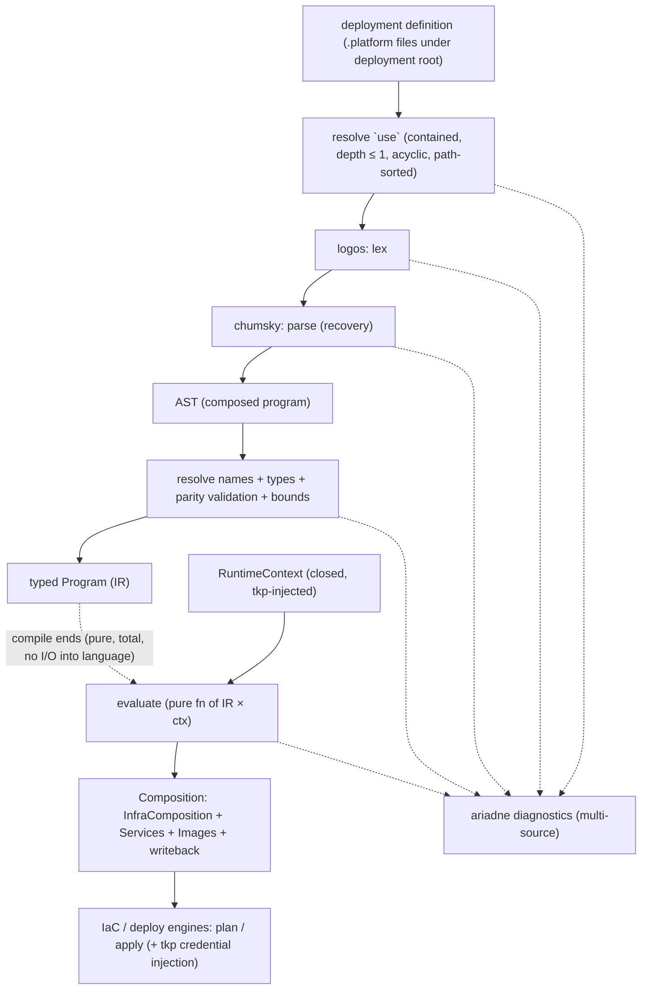

# Design

## Overview

The platform configuration DSL replaces the compiled, fixed-arity platform definition (today
`platforms/compose/src/{config,compose,modules,services,images,observability_config,gates}.rs`) with a
**strongly-typed, total language** whose programs describe a deployment's infra+services. A **compiler
embedded in `tkp`** processes a **deployment definition** (one or more `.platform` files under a
deployment root) in two distinct phases:

- **Compile (pure, total, deterministic):** resolve `use` imports within the deployment root → lex
  (`logos`) → parse (`chumsky`) → resolve → type-check → lower to a typed, executable **Program** (IR).
  No I/O into the language; diagnostics rendered with `ariadne`.
- **Execute (in `tkp`, with the runtime context):** `tkp` evaluates the Program against an injected
  **`RuntimeContext`** (deployment dir, home, region — a closed, typed record) to produce a
  **Composition**: the `InfraComposition` the IaC engine consumes, the deploy-engine `Service` set, the
  `Image` set, and declarative writeback targets.

The binary carries a **fixed library of typed resource/service/image kinds** — the executable Rust
implementations and their compiled assets (templates, dashboards). The DSL describes only their
**composition**; it never defines a kind's behaviour, and it has **no ambient authority** — no OS
environment, network, clock, or arbitrary filesystem. Secrets are *declared, never read*. Compile-time
purity makes plans reproducible; the runtime context enters only at execution, supplied explicitly by
the host (effects at the edge).

**Terminology.** *Deployment* — the provisioned reality + the thing described. *Deployment definition*
— the rooted set of `.platform` files that describes it (the retained, digested artifact). *Deployment
root* — the boundary directory; nothing resolves outside it. *Program* — the in-memory compiled form
the compiler builds from a definition.

**Authoring origin (Req 16).** A `.platform` definition is a **platform-author artifact** authored in
the owning platform crate (`platforms/{local,compose,ecs,…}`) — the DSL analog of today's
`config.rs`/`modules.rs`/`services.rs` it replaces. It is **not** generated for the operator and there
is no starter-generator. The operator's interaction is **select a platform + supply input values**
(Req 8); `tkr deployment create` then **persists** the authored file set into the deployment, and every
subsequent `plan`/`apply` compiles that **persisted copy**, never the live crate file — so a deployment
pins its definition independently of later crate edits. The persistence/retention mechanics belong to
`platform-provisioner-binary`; this spec owns the language, compiler, and the authored definition.

**Evolution envelope (Req 16.6).** Once persisted, a definition is freely **evolvable** — structurally
or by value — as ordinary `apply`s, because it is data, not compiled Rust. The boundary is the running
`tkp`'s `(language, kind-library)` version, enforced by the compiler: any composition of the kinds and
constructs `tkp` provides applies directly; a reference to a kind/field/provider/construct the running
`tkp` lacks is a compile rejection (Properties 3, 12) that becomes possible only via an engine upgrade
to a `tkp` that provides it (Req 9.3). Evolution is unbounded in composition, bounded by engine version.

This design is scoped to the **compose platform** as the worked example. ECS and Local parity follow on
the same machinery (Requirement 10).

> **Adopted refinement (governing):** This design adopts
> `proposals/001-platform-framework-and-realizer.md` **in full** — the generic `tokeira-platform`
> framework crate and its `Realizer` seam, the generic `ConfigurationRevision` config type, the
> `Composition*` IR naming, compile-time `FieldSpec` defaults, `RealizeContext`, and the `platform/` +
> `inputs.toml` on-disk layout. Where this document and Proposal 001 differ, **Proposal 001 governs**;
> tasks 10–13 are its realization.

## Dependencies and Non-Goals

- **Consumed by** `.kiro/specs/platform-provisioner-binary/`: the engine identity it binds against is
  the `(language, kind-library)` version compiled into `tkp`; the **deployment definition** is the
  deployment-married configuration it records, retains (as a file set + digest), and rolls back. This
  spec owns the language, compiler, and lowering.
- **Substrate (decided):** bespoke front end on `logos` (lexer) + `chumsky` (parser) + `ariadne`
  (diagnostics). Not embedding Nickel/Dhall/KCL.
- **Non-goals:** defining resource *behaviour* in the DSL (stays compiled Rust); a Turing-complete or
  effectful language; OS-environment access of any kind; the running server's `tokeirad.toml`
  (`TokeiraConfig`); adding new resource *kinds* (a kind-library code change, i.e. an engine-identity
  change handled by the provisioner's `upgrade`).

## Worked example — the compose platform (modular)

A deployment definition under the deployment root, depth ≤ 1, composed by relative `use`:

```
<deployment root>/
  compose.platform        # root: platform decl, inputs, shared lets, use, namespaces, writeback
  infra.platform          # module local_state; module dsql (conditional)
  runtime.platform        # module runtime
  observability.platform  # module observability + observability_config resource
  images.platform         # image declarations
```

`compose.platform` (root):

```
// Compiled by tkp's compose kind-library. The (language, kind-library) version is derived by the
// compiler and recorded by the provisioner, never declared here (Req 9).
platform compose {
  use "infra.platform"
  use "runtime.platform"
  use "observability.platform"
  use "images.platform"

  // Inputs — operator-tunable values (Req 8). Declaration order is irrelevant; resolution is whole-program.
  input project_name:   String  = "tokeira"
  input storage:        Storage  = InMemory          // sum type; carries DSQL data when present
  input tokeirad_image: String   = "tokeirad:latest"
  input grpc_port:      Port     = 7233
  input metrics_port:   Port     = 9090
  input tokeirad_replicas:   Int = 1
  input mimir_image:    String   = "grafana/mimir:3.0.6"
  input loki_image:     String   = "grafana/loki:3.7.1"
  input grafana_image:  String   = "grafana/grafana-oss:12.4.3"
  input alloy_image:    String   = "grafana/alloy:v1.16.0"
  input aws_cli_image:  String   = "public.ecr.aws/aws-cli/aws-cli:latest"
  input busybox_image:  String   = "public.ecr.aws/docker/library/busybox:latest"
  input grafana_port:   Port     = 3000
  input mimir_replicas: Int = 1
  input loki_replicas:  Int = 1
  input grafana_replicas: Int = 1
  input alloy_replicas: Int = 1

  // Shared, pure path building over the closed RuntimeContext (ctx). No OS access.
  //   ctx.deployment_dir : Path,  ctx.home : Path,  ctx.region : String
  let state_dir  = ctx.deployment_dir / ".tokeira-state"
  let config_dir = ctx.deployment_dir / "config"

  namespaces [ "default" ]

  // Declarative writeback (collect_writeback): what tkp writes to tokeirad.toml after infra apply.
  // tkp performs the effectful state read + write; the DSL only names source → target.
  writeback when storage is Dsql {
    "infrastructure.storage"                  = "dsql",
    "infrastructure.dsql.endpoint"            = dsql.cluster.cluster_endpoint,
    "infrastructure.dsql.region"              = storage.region,
    "infrastructure.dsql.rate_limiter_table"  = dsql.rate_limiter.table_name,
    "infrastructure.dsql.conn_lease_table"    = dsql.conn_lease.table_name,
  }
}
```

`infra.platform` (remote-state + conditional DSQL):

```
// remote_state_module → the local state directory resource.
module local_state {
  resource state_dir = LocalStateDir { }
}

// DsqlModule — present only under DSQL storage. The typed sum makes "preexisting requires endpoint /
// managed forbids it" a *type* obligation on the DsqlCluster kind (Req 5.2).
module dsql when storage is Dsql {
  depends_on [ local_state ]
  // `storage as Dsql(d)` binds the variant payload within a conditionally-present module.
  resource cluster      = DsqlCluster   { mode: d.mode, region: d.region, endpoint: d.endpoint, arn: d.arn }
  resource rate_limiter = DynamoDbTable { hash_key: "pk", ttl: "ttl_epoch" }
  resource conn_lease   = DynamoDbTable { hash_key: "pk", ttl: "ttl_epoch" }
}
```

`runtime.platform`:

```
module runtime {
  depends_on match storage { Dsql(_) => [ observability ], _ => [ local_state ] }

  service tokeirad = ComposeService {
    image:    tokeirad_image,
    replicas: tokeirad_replicas,
    ports:    [ port(grpc_port), port(metrics_port) ],
    // Declares the credential need; tkp injects the ~/.aws mount + AWS_* secrets at materialization.
    // The DSL never names or reads a secret (Req 12.2).
    aws_auth: match storage { Dsql(_) => true, _ => false },
    volumes:  [ bind(ctx.deployment_dir / "tokeirad.toml", "/etc/tokeira/tokeirad.toml", ro) ],
    env:      match storage {
                Dsql(d) => { "TOKEIRA_CONFIG": "/etc/tokeira/tokeirad.toml", "AWS_REGION": d.region },
                _       => { "TOKEIRA_CONFIG": "/etc/tokeira/tokeirad.toml" },
              },
    command:  [ ],
  }
}
```

`observability.platform` (note the config-files resource every service depends on):

```
module observability {
  depends_on match storage { Dsql(_) => [ local_state, dsql ], _ => [ local_state, runtime ] }

  // ObservabilityConfigFilesResource — the kind renders ~16 files (alloy/mimir/loki configs,
  // grafana datasources/dashboards, alert rules, dashboard JSON) from these params; the *templates
  // and dashboards are compiled assets of the kind*, not part of the deployment definition.
  resource observability_config = ObservabilityConfigFiles {
    metrics_target_host: "tokeirad",
    metrics_target_port: metrics_port,
    cluster:    project_name,
    deployment: project_name,
  }

  service mimir = ComposeService {
    image: mimir_image, replicas: mimir_replicas, ports: [ "9009:9009" ],
    volumes: [ bind(state_dir / "mimir", "/data", rw),
               bind(config_dir / "mimir.yaml", "/etc/mimir/mimir.yaml", rw),
               bind(config_dir / "mimir/rules", "/data/mimir/rules", rw) ],
    command: [ "--config.file=/etc/mimir/mimir.yaml" ],
    depends_on: [ observability_config ],
  }
  service loki = ComposeService {
    image: loki_image, replicas: loki_replicas, ports: [ "3100:3100" ],
    volumes: [ bind(state_dir / "loki", "/loki", rw),
               bind(config_dir / "loki.yaml", "/etc/loki/loki.yaml", rw) ],
    command: [ "--config.file=/etc/loki/loki.yaml" ],
    depends_on: [ observability_config ],
  }
  service grafana = ComposeService {
    image: grafana_image, replicas: grafana_replicas, ports: [ port(grafana_port) ],
    volumes: [ bind(state_dir / "grafana", "/var/lib/grafana", rw),
               bind(config_dir / "grafana/provisioning", "/etc/grafana/provisioning/", rw),
               bind(config_dir / "grafana/dashboards", "/var/lib/grafana/dashboards/", rw) ],
    env: { "GF_SECURITY_ADMIN_USER": "admin", "GF_SECURITY_ADMIN_PASSWORD": "admin",
           "GF_METRICS_ENABLED": "true" },
    depends_on: [ observability_config, mimir, loki ],
  }
  service alloy = ComposeService {
    image: alloy_image, replicas: alloy_replicas, ports: [ "4317:4317", "4318:4318" ],
    volumes: [ bind("/var/run/docker.sock", "/var/run/docker.sock", rw),
               bind(config_dir / "alloy.alloy", "/etc/alloy/config.alloy", rw) ],
    command: [ "run", "/etc/alloy/config.alloy" ],
    depends_on: [ observability_config, tokeirad, mimir, loki ],   // cross-module refs resolve by name
  }
}
```

`images.platform` (the deploy-engine image registry):

```
// tokeirad is built locally; the rest are mirrored from upstream. desired_ref/writeback are the kind's.
image tokeirad      = Build  { repository: "tokeira/tokeirad" }                      // writeback: tokeirad.image
image grafana_mimir = Mirror { repository: "tokeira/grafana-mimir", upstream: mimir_image }
image grafana_loki  = Mirror { repository: "tokeira/grafana-loki",  upstream: loki_image }
image grafana       = Mirror { repository: "tokeira/grafana",       upstream: grafana_image }
image grafana_alloy = Mirror { repository: "tokeira/grafana-alloy", upstream: alloy_image }
image aws_cli       = Mirror { repository: "tokeira/aws-cli",       upstream: aws_cli_image }
image busybox       = Mirror { repository: "tokeira/busybox",       upstream: busybox_image }
```

Conventions (locked): `Path` for filesystem values; `/` is path-join; `++` is **list concatenation
only**; record merge is **spread** `{ ..a, key: v }`; field assignment is always explicit `key: expr`;
bare identifiers are lexically-resolved references (no implicit import); `ctx.*` are reads of the
closed `RuntimeContext` — never OS access. The deploy-apply gate `validate_local_build` and the `Ops`
verbs (`scale`/`logs`/`port_mappings`) are **host-runtime**, not DSL.

## Construct correspondence

Every construct in the compiled compose platform has a DSL analog or is a host-runtime concern.

| Current Rust construct (source) | DSL analog / disposition |
|---------------------------------|--------------------------|
| `iac::Module` (`modules.rs`) | `module <name> { … }`; ownership is lexical |
| `Module::dependencies()`, storage-conditional | `depends_on <expr>` (conditionable via `match`) |
| conditional module presence (DsqlModule only under DSQL) | `module <name> when <cond> { … }` |
| `LocalStateModule` / `LocalStateResource` (`remote_state_module`) | `module local_state { resource state_dir = LocalStateDir { } }` |
| `DsqlCluster`, `DynamoDbTable` (`modules.rs`) | `resource … = DsqlCluster/DynamoDbTable { … }` |
| `ObservabilityConfigFilesResource` (+ askama templates, dashboards) | `resource observability_config = ObservabilityConfigFiles { …params }`; templates/dashboards are compiled kind assets |
| `ComposeService` (`compose.rs`) | `service <id> = ComposeService { … }` |
| `OwnedComposeResource` (IaC) + `ComposeWorkload` (deploy-engine) | one `service` declaration **lowers to both** an infra `Resource` and a deploy-engine `Service` |
| `module_for_service` | lexical module of the declaration |
| `Service::dependencies()` (grafana/alloy) + `ComposeService.depends_on` | `depends_on: [ … ]` on the service |
| conditional DSQL env/volumes (`compose_services`) | `match storage { … }` + list `++` / record spread |
| AWS credential passthrough (host `std::env` reads) | `aws_auth` sugar → `tkp` resolves the `env` credential chain + `~/.aws` (implicit `home`) and injects at materialization (Req 14.5); the `env` provider is the general mechanism |
| `ComposeService.healthcheck` | optional `healthcheck` field on the kind schema |
| `images::construct()` (`images/`) — Build + Mirror | `image <name> = Build/Mirror { … }`; `desired_ref`/`writeback_targets` are the kind's |
| `required_namespaces` | `namespaces [ "default" ]` |
| `Ops::valid_services` / `desired_replicas` | derived from the declared `service` set + each service's `replicas` |
| `collect_writeback` | `writeback when … { key = <module>.<resource>.<output> }` (tkp performs the write) |
| `register_infra_extensions` (ComposePlatform handle, AWS clients) | **host-runtime** — provider handles, not the DSL |
| `create_infra_store` / `create_deploy_store` / `hydrate_config` | **host-runtime** — provisioner/state concern |
| `gates::validate_local_build` (deploy-apply image gate) | **host-runtime** gate |
| `Ops::scale` / `logs` / `port_mappings` | **host-runtime** operational verbs |

The line: anything that *describes* the desired graph is a DSL analog; anything that *performs an
effect or supplies the world* (credentials, provider clients, state stores, the writeback write, the
build gate, operational verbs) is host-runtime and crosses the boundary as `RuntimeContext` in or
writeback targets / declared needs (`aws_auth`) out.

> ECS preview (deferred parity pass): the Grafana admin secret is **not** a context provider — it is a
> `SecretsManagerSecret` **resource kind** (generated password) consumed by a container `value_from`
> **reference**, resolved by ECS at task start. It belongs to the kind library + composition, not the
> `RuntimeContext`. Recorded here so the ECS pass models it as a resource/reference, not a provider.

## ECS parity pass

ECS exercises the same machinery as compose with a larger kind library and one new language feature. It
needs **no context providers** (it uses inputs + host-runtime AWS auth + IAM task roles + S3 state, not
`deployment_dir`/`env`), confirming `env` is compose-specific.

**New language feature — output references** (Req 15). ECS resources consume provisioned outputs of
other resources, resolved at apply: the DSQL IAM role policy needs the cluster ARN
(`DsqlIamRoleResource::create` reads `cluster.properties["cluster_arn"]`), the ALB listener needs its
target groups, container secrets reference a secret resource. The DSL models `<resource>.<output>`,
lowering to a dependency edge + deferred binding (see `OutputRef`).

**Module/dependency chain (static `depends_on`):** `remote-state → { images, networking } → dsql →
cluster → observability → services`.

**Kind library additions** (more `KindSchema` impls, no new language): `Vpc`, `SecurityGroup`,
`VpcEndpoint` (Interface/Gateway), `Alb`/`AlbTargetGroup`/`AlbListener`, `EcsCluster`, `LaunchTemplate`,
`Asg`, `CapacityProvider`, `IamRole`/`IamInstanceProfile`, `S3Bucket`/`S3Object`,
`SecretsManagerSecret`, `SsmParameter` (secure), `CloudMapNamespace`, `TaskDefinition`, `EcsService`,
`DsqlCluster`/`DsqlConnectionEndpoint`, and adopted variants for preexisting DSQL.

Representative snippet (the novel parts only — output refs, the managed/preexisting sum, secret by
reference, IAM-grant wiring):

```
// dsql is an input sum, mirroring compose `storage`:
//   input dsql: DsqlMode = Managed
//   DsqlMode = Managed | Preexisting { endpoint, management_endpoint_id, connection_endpoint_id,
//                                      runtime_role_arn, admin_role_arn }
module dsql {
  depends_on [ networking ]
  match dsql {
    Managed => {
      resource cluster       = DsqlCluster           { mode: Managed, region: ctx.region }
      resource conn_endpoint = DsqlConnectionEndpoint { vpc: networking.vpc, cluster: cluster }
      // output reference: the policy needs the ARN, known only after the cluster is created (Req 15)
      resource runtime_role  = DsqlIamRole { action: "dsql:DbConnect",      cluster_arn: cluster.cluster_arn }
      resource admin_role    = DsqlIamRole { action: "dsql:DbConnectAdmin", cluster_arn: cluster.cluster_arn }
    }
    Preexisting(p) => {
      // adopt: record by id/arn; the kind creates and deletes nothing
      resource conn_endpoint = AdoptedDsqlEndpoint { endpoint_id: p.connection_endpoint_id }
      resource runtime_role  = AdoptedIamRole      { role_arn: p.runtime_role_arn }
      resource admin_role    = AdoptedIamRole      { role_arn: p.admin_role_arn }
    }
  }
}

module observability {
  depends_on [ cluster ]
  resource grafana_admin = SecretsManagerSecret { value: generated_password(len: 32), username: "admin" }
  service grafana = EcsService {
    // by-reference: ECS resolves the value at task start; it never enters the program or RuntimeContext
    secrets: { "GRAFANA_ADMIN_PASSWORD": value_from(grafana_admin, key: "password") },
    grants:  [ secret_read(grafana_admin) ],   // task-role read grant wired from the same reference
    // … task def, service-connect, placement …
  }
}
```

**Confirmations (reuse, not new):** secrets are purely by-reference (no value in the DSL/context — the
strongest form of the Req 14.7 posture); IAM policy documents and the per-service Alloy config (an SSM
secure parameter) are **kind-internal templates** parameterized by typed params, like the observability
askama templates; DSQL managed/preexisting is the typed-sum conditional (adopt behaviour kind-internal);
ALB is an enum input + conditional-required `certificate_arn` (validation-parity pattern); `hydrate_config`
and `prototypical_server_config` are **host-runtime** (state↔config plumbing and starter generation),
not DSL.

## Architecture



`use` resolution and compile are I/O-free *into the language* (the compiler reads only files inside the
deployment root) and terminating. Execute is a pure total function of `(Program, RuntimeContext)`; only
`tkp` performs effects — resolving the runtime context and reading the definition before, injecting
credentials and applying the composition (and writeback) after.

## Security Posture

The deployment definition is treated as untrusted input; the compiler is the trust boundary. The
guarantees:

1. **No ambient authority.** Compilation does no I/O into the language; execution reads only the closed
   `RuntimeContext` and the compiled kind library. No OS environment, network, clock, or arbitrary
   filesystem — and **no environment-variable or key-based lookup construct exists** in the language
   (Req 12.1).
2. **Import containment is the boundary primitive.** Every `use` is relative and downward; after
   symlink canonicalization the real path MUST be strictly within the deployment root; `..`, absolute
   paths, symlink escapes, and folder depth > 1 are fail-closed diagnostics. The compiler never reads a
   file outside the deployment root (Req 13.2, 13.3).
3. **Secrets are declared, never read.** A workload's credential need is a typed declaration
   (`aws_auth`); `tkp` performs the injection at materialization. Secret values never enter the
   program, its evaluation, or its output (Req 12.2).
4. **Secret hygiene in diagnostics.** Diagnostics carry names and spans only — never resolved
   `RuntimeContext` values — so nothing is echoed to logs/telemetry (Req 12.3).
5. **Bounded compile.** Totality bars non-termination; explicit caps (file count, per-file and total
   bytes, import depth, AST nesting/size) bar resource exhaustion on adversarial input (Req 12.4).
6. **Definition integrity.** The content digest over the sorted `(relative_path, sha256)` set is what
   the provisioner records, retains, and verifies; tampering is detectable; rollback restores the exact
   file set (Req 13.6, Req 11).

## Modular deployment definition and import containment

A definition is one or more `.platform` files under the deployment root, composed into a single program:

- **`use "relative.platform"`** includes another file; the composed program is the union of all files'
  top-level declarations (`input`, `let`, `module`, `image`, `namespaces`, `writeback`).
- **Resolution is fail-closed and deterministic:** targets are relative, no `..`, no absolute;
  canonicalized real path strictly within the deployment root; folder depth ≤ 1; the include graph is a
  cycle-checked DAG; files are composed in stable **path-sorted** order so the program is identical
  regardless of read order (Req 13.4).
- **Whole-program name resolution:** names resolve across the composed program; a duplicate top-level
  declaration across files is a diagnostic — no silent shadowing (Req 13.5).
- **The artifact** is the file set + its digest; the provisioner retains and rolls back the set.

## Runtime context and providers

`RuntimeContext` is resolved by `tkp` and injected at execution; the composition reads only typed
`ctx.<field>` values and can never name or read a provider (Req 14.4). Two parts:

- **Implicit** — kind-library-delivered, platform-specific. Derived from the platforms: `deployment_dir`
  (local/compose/ecs) and `home` (compose, for the `~/.aws` mount). `tkp` always provides these.
- **Declared** — an operator `context { }` block binding fields to a canonical provider catalog **fixed
  by the `(language, kind-library)` version**. Derived strictly from the platforms, the catalog is just
  `env`:

  | Provider | Yields | Evidenced by |
  |----------|--------|--------------|
  | `env "NAME"` / `env.secret "NAME"` | `String?` / `Secret<String>?` | compose AWS credential passthrough (`compose.rs` `std::env` reads) |

  ```
  context {
    extra_flag           = env "TOKEIRA_EXTRA"          // String?
    custom_token: Secret = env.secret "CUSTOM_TOKEN"    // Secret<String>?, tainted
  }
  ```

Everything else is *not* runtime context: the Grafana admin secret (ECS) is a `SecretsManagerSecret`
**resource** consumed by a container `value_from` **reference** (composition, not context); the
provisioner's own AWS credential chain and STS caller-identity check are **host-runtime auth/validation**;
`region` is an **input**. New providers (a secret-value provider, Vault, …) arrive only via an engine
upgrade (Req 9.3, Req 14.2).

**`aws_auth` is sugar over the standard chain.** `aws_auth: true` tells `tkp` to resolve the standard AWS
credential chain (the `env` provider plus the `~/.aws` location from the implicit `home`) and inject it
into the container at materialization — so the common case needs no explicit `context` block and no
secret value enters the program (Req 14.5).

**Determinism.** Provider resolution is effectful and may vary between applies (a changed env value); the
language stays deterministic *given* the resolved `RuntimeContext`, which `tkp` resolves once and injects
(Property 2). The variability lives at the `tkp` edge.

**Precedence (recorded vs ambient).** `RuntimeContext` fields split by meaning. **Recorded
identity-bearing** values (`region`, later `account`) are persisted with the deployment at creation and
are authoritative: a differing ambient/host source is a *retarget* that `tkp` surfaces and that requires
explicit operator confirmation — never a silent override (mirroring the deployment-lock mis-apply guard).
**Machine-local ambient** values (`deployment_dir`, `home`) are supplied by the host per invocation, need
no confirmation, and are not persisted (re-derived per host — the ambient-never-retained rule). So
precedence is *recorded identity > ambient host > defaults*, with confirmation required only on a
conflict against a recorded identity value (Req 14.8, 14.9).

## Components and Interfaces

New crate `tokeira-platform-dsl` (engine surface; part of `source_tree_hash`):

- **Import resolver** — `fn assemble(root: &Path) -> Result<SourceSet, Vec<Diag>>`; resolves `use`
  within the deployment root with the containment rules and bounds; returns the path-sorted source set.
- **Lexer** (`logos`) — `enum Token` with spans.
- **Parser** (`chumsky`) — `fn parse(SourceSet) -> Result<ast::Program, Vec<Diag>>`; recursive grammar,
  error recovery, multi-source spans, one-pass multi-error reporting.
- **Resolver + type checker** — `fn check(ast::Program, &KindLibrary) -> Result<ir::Program, Vec<Diag>>`;
  whole-program name resolution, type checking against kind schemas, parity validation, duplicate-decl
  detection. No partial IR escapes on error (Req 3.3).
- **Evaluator** — `fn evaluate(&ir::Program, &RuntimeContext) -> Result<Composition, Vec<Diag>>`; pure,
  total; the only path from program to engine input; asserts the engine composition invariants before
  returning (Req 7.2).
- **Kind library** — `trait KindSchema { fn kind_id() -> KindId; fn params() -> ParamSchema;
  fn validate(&Value) -> Result<(), Vec<Constraint>>; fn lower(&Value, &RuntimeContext) -> LoweredKind }`,
  implemented per resource/service/image kind, registered in a `KindLibrary`. How a compiled
  `Resource`/`Service`/`Image` advertises its typed parameter schema, its constraints (canonical ports,
  cpu/mem, capacity, sufficiency, preexisting-requires-endpoint), and its lowering. Kinds also carry
  compiled assets (e.g. `ObservabilityConfigFiles`'s askama templates + dashboards).
- **Diagnostics** (`ariadne`) — `struct Diag { span, severity, message, hint }`; human + `--json`.
- **`RuntimeContext`** — the host-injected closed record (see Data Models).
- **Lowering target** — `tokeira_iac::InfraComposition`, `Vec<Box<dyn deploy_engine::Service>>`,
  `Vec<Box<dyn deploy_engine::Image>>`, `Vec<WritebackTarget>`. A `ComposeService` declaration lowers
  into both an infra `Resource` and a deploy-engine `Service` (today's `OwnedComposeResource` +
  `ComposeWorkload`). An `aws_auth: true` service emits a `CredentialNeed` the host honours at
  materialization.

## Data Models

- **`ast::Program`** — `{ platform: Ident, items: Vec<Item> }` (no version field — a program pins none);
  `Item ∈ { Use, Input, Let, Module, Image, Namespaces, Writeback }`; expressions cover literals,
  records, lists, name refs, `.` access, `match`, `if`, `when`, `++`, spread, and builtin calls
  (`port`, `bind`, path-join). Every node carries a `Span` and a source id (multi-file).
- **`ir::Program`** — type-checked, name-resolved: bindings by resolved symbol, module tree with
  resolved (and conditioned) dependency edges, kind references resolved to `KindId`, expressions
  annotated with `Type`. Deterministic function of the definition (Req 4.2).
- **`Type`** — `String | Int | Bool | Port | Path | List<T> | Record<fields> | Enum(name) |
  Optional<T> | KindRef(KindId)`. Sum types (`Storage = InMemory | Dsql { mode, endpoint, arn, region }`)
  model conditional requirements as types (Req 5.2).
- **`RuntimeContext`** — the closed record `tkp` injects, in two parts:
  - **implicit** (kind-library-delivered, platform-specific): at minimum `deployment_dir: PathBuf`, and
    `home: PathBuf` where the platform needs it (compose's `~/.aws`).
  - **declared** (operator `context { }` block): fields bound to canonical providers and resolved by
    `tkp`; secret-bearing fields are `Secret<T>` (taint rules, Req 12.3).
  **Closed**: the composition reads only typed `ctx.<field>` values and names no provider; no OS-env,
  network, clock, or arbitrary-filesystem access from the language. **Ambient, never retained** —
  rollback restores the definition, never the context (Req 12.1, Req 14). `region` is an *input*, not
  context.
- **`KindId`** — `{ name: String }`; a program references a kind by name only; the running `tkp`
  resolves names within its single kind-library version, which it exposes for the provisioner to record
  (Req 9.1).
- **`SourceSet`** — the path-sorted `Vec<(RelPath, String)>` of definition files, plus the content
  digest over the sorted `(RelPath, sha256)` pairs (Req 13.6).
- **`Composition`** — `{ infra: InfraComposition, services: Vec<Box<dyn Service>>,
  images: Vec<Box<dyn Image>>, writeback: Vec<WritebackTarget>, credential_needs: Vec<CredentialNeed> }`.
- **`WritebackTarget`** — `{ key: String, source: OutputRef }`; the declarative form of
  `collect_writeback`; `tkp` resolves the output from post-apply state and performs the write.
- **`OutputRef`** — `{ resource: ResourceId, output: String }`; a first-class expression usable in a
  resource parameter, a container secret reference (`value_from`), or a writeback target. Lowers to a
  dependency edge **plus** a deferred binding the engine resolves at apply from the referenced
  resource's provisioned state — exactly as `DsqlIamRoleResource::create` reads the cluster ARN today.
  Generalizes the writeback-only output reference; an unresolved value at compile time is expected
  (Req 15).
- **`CredentialNeed`** — `{ service: Ident, kind: AwsAuth }`; emitted by `aws_auth: true`; honoured by
  `tkp` at materialization (the `~/.aws` mount + `AWS_*` injection). Carries no secret value.

## Correctness Properties

### Property 1: Compilation is pure and total

*For any* deployment definition, compilation (resolve → lex → parse → resolve → type-check → lower)
SHALL read only files within the deployment root, perform no other I/O into the language, and terminate.

**Validates: Requirements 4.1, 4.3**

### Property 2: Execution is deterministic given the runtime context

*For any* compiled Program and *any* `RuntimeContext`, repeated evaluation SHALL yield an identical
Composition — the same resources, services, images, ids, dependency edges, and module ownership.

**Validates: Requirements 4.2**

### Property 3: Unknown kind, unknown field, or missing required parameter is rejected

*For any* program that references a kind absent from the running kind library, supplies a parameter not
in a kind's schema, or omits a required one, the compiler SHALL emit a diagnostic and SHALL NOT lower.

**Validates: Requirements 2.2, 2.3, 3.1, 3.2**

### Property 4: Unresolved names are rejected

*For any* program containing a name reference that resolves to no in-scope binding, the compiler SHALL
emit a diagnostic and SHALL NOT lower.

**Validates: Requirements 3.1**

### Property 5: Validation parity is enforced at compile time

*For any* program violating a Validation Parity Policy rule (canonical ports, cpu/memory pairing,
capacity range, task-resource sufficiency, non-empty CIDR/AZs, or the DSQL
`preexisting`-requires-endpoint / `managed`-forbids-endpoint typed sum), the compiler SHALL emit a
diagnostic and SHALL NOT lower.

**Validates: Requirements 5.1, 5.2, 5.3**

### Property 6: No partial composition escapes on error

*For any* program that fails any compile phase, no Composition (partial or whole) SHALL be passed to the
IaC or deploy engines.

**Validates: Requirements 3.3**

### Property 7: Lowering preserves identity and is the sole constructor path

*For any* valid program, lowering SHALL preserve every declared resource id, dependency edge, and module
ownership; a `ComposeService` declaration SHALL lower to both an infra `Resource` and a deploy-engine
`Service`; and no engine object SHALL be produced except by a kind in the library.

**Validates: Requirements 7.1, 7.3**

### Property 8: Lowered compositions satisfy the engine invariants

*For any* program whose lowering would yield a duplicate module/resource id, a `desired` resource absent
from `known`, a dependency absent without an external declaration, or a dependency cycle, the compiler
SHALL emit a diagnostic instead of returning a Composition.

**Validates: Requirements 7.2**

### Property 9: Diagnostics are located and recovered

*For any* rejected definition, each diagnostic SHALL carry a source (file + span) and a message; *for
any* definition with multiple independent errors, the compiler SHALL report more than one in a single
pass.

**Validates: Requirements 6.1, 6.2**

### Property 10: Value-only edits change only values

*For any* two programs differing only in input values (not structure), their lowered Compositions SHALL
differ only in those values, with identical resource sets, ids, dependencies, and module ownership, and
SHALL require no change of `(language, kind-library)` version.

**Validates: Requirements 8.2**

### Property 11: Unbound or mistyped inputs are rejected

*For any* required input left unbound, or bound to a value of the wrong type, the compiler SHALL emit a
diagnostic and SHALL NOT lower.

**Validates: Requirements 8.3**

### Property 12: The program pins no version; the version is derived from the compiler

*For any* program, the source SHALL contain no language or kind-library version; the
`(language, kind-library)` version SHALL be derived solely from the compiling `tkp` and exposed for the
provisioner to record. A reference to a kind, field, or construct the running library does not provide
is rejected by Property 3 — never via a program-declared version.

**Validates: Requirements 9.2**

### Property 13: Compose parity

*For any* current `ComposeConfig` (both storage modes), the equivalent deployment definition SHALL lower
— for the same inputs and runtime context — to a Composition equivalent to today's: the same compose
services (mimir, loki, tokeirad, grafana, alloy) with their replicas, the `local_state` and (under
DSQL) `dsql` infra resources, the `observability_config` resource with every observability service
depending on it, the same image set (Build + 6 mirrors), the `default` namespace, the same dependency
edges, and the same module ownership.

**Validates: Requirements 10.1, 10.2, 10.3**

### Property 14: Retained definition round-trips

*For any* deployment definition the provisioner records, recompiling the retained file set under the
paired `(language, kind-library)` version SHALL reproduce the same Program (and thus, with the same
runtime context, the same Composition); a rollback checkpoint SHALL pair a definition with a version
able to compile it.

**Validates: Requirements 11.1, 11.3**

### Property 15: No ambient authority; the closed context is the only external read

*For any* program, evaluation SHALL read no data other than the closed `RuntimeContext` and the kind
library; the language SHALL provide no construct to read the OS environment, network, clock, or any
filesystem path outside the deployment definition, and no construct to execute host code.

**Validates: Requirements 12.1, 12.5**

### Property 16: Secrets are declared, never read or echoed

*For any* program, no secret-bearing value SHALL be readable by the program; a credential need SHALL be
expressible only as a typed declaration (`aws_auth`) honoured by `tkp` at materialization; and *for any*
diagnostic, no resolved `RuntimeContext` value SHALL appear in its text.

**Validates: Requirements 12.2, 12.3**

### Property 17: Import containment is fail-closed

*For any* `use` whose target is absolute, contains `..`, escapes the deployment root after symlink
canonicalization, or exceeds folder depth 1, the compiler SHALL emit a diagnostic and SHALL NOT compile;
the compiler SHALL never read a file outside the deployment root.

**Validates: Requirements 13.2, 13.3**

### Property 18: Compile is bounded

*For any* deployment definition exceeding the configured bounds (file count, per-file or total bytes,
import depth, AST nesting/size), the compiler SHALL refuse with a diagnostic rather than consume
unbounded resources.

**Validates: Requirements 12.4**

### Property 19: Definition composition is deterministic and digest-stable

*For any* deployment definition, the composed program SHALL be identical regardless of file read order
(path-sorted composition), an import cycle SHALL be a diagnostic, a duplicate top-level declaration
across files SHALL be a diagnostic, and the content digest over the sorted `(relative_path, sha256)`
set SHALL be stable and SHALL change iff any file changes.

**Validates: Requirements 13.4, 13.5, 13.6**

### Property 20: Runtime context is implicit + declared; the composition names no provider

*For any* program, the composition SHALL read context only as typed `ctx.<field>` values and SHALL
contain no provider reference; the provider catalog SHALL be fixed by the running `tkp` version; the
`env` provider SHALL resolve only operator-declared names; and a secret-typed context value SHALL be
subject to the taint rules of Property 16.

**Validates: Requirements 14.1, 14.2, 14.4**

### Property 21: Output references create dependency edges and resolve at apply

*For any* output reference `<resource>.<output>` in a program, lowering SHALL add a dependency edge to
the referenced resource and SHALL NOT require the output value at compile time; the value SHALL be
resolved by the engine during apply from the referenced resource's provisioned state; an output
reference to a resource absent from the composition or to an output the kind does not declare SHALL be a
diagnostic.

**Validates: Requirements 15.2, 15.3**

### Property 22: Recorded identity context is authoritative over ambient sources

*For any* recorded identity-bearing `RuntimeContext` value (e.g. `region`), evaluation SHALL use the
recorded value; *for any* ambient host source that supplies a differing value, the provisioner SHALL
require explicit operator confirmation and SHALL NOT silently override the recorded value; *for any*
machine-local ambient value (`deployment_dir`, `home`), the host value SHALL be used without confirmation
and SHALL NOT be persisted.

**Validates: Requirements 14.8, 14.9**

### Property 23: The authored definition is the persisted copy; applies never read the live crate file

*For any* deployment created from a platform, the definition compiled by every `plan`/`apply` SHALL be
the file set persisted at create, byte-for-byte — not the platform-crate file; *for any* subsequent edit
to the live platform-crate `.platform` file, an already-created deployment's lowered Composition SHALL be
unchanged until its persisted definition is itself edited. (The persistence mechanics are owned by
`platform-provisioner-binary`; this property fixes the contract this spec depends on: compilation reads
the persisted copy.)

**Validates: Requirements 16.1, 16.3, 16.5**

## Error Handling

| Condition | Handling |
|-----------|----------|
| `use` absolute / contains `..` / escapes root / depth > 1 | fail-closed diagnostic; file never read (Property 17) |
| Import cycle / duplicate top-level declaration | diagnostic; no compile (Property 19) |
| Definition exceeds resource bounds | diagnostic; bounded refusal (Property 18) |
| Lex / parse error | `ariadne` diagnostic at source+span; recovered where possible; one-pass multi-error (Req 6.2) |
| Unresolved name | type-phase diagnostic at the reference (Property 4) |
| Unknown kind / unknown field / missing required | type diagnostic; no lowering (Property 3) |
| Wrong-typed value / unbound required input | type diagnostic; no lowering (Property 11) |
| Parity-rule violation | validation diagnostic naming the field/constraint; no lowering (Property 5) |
| Composition-invariant violation (dup id, `desired ⊄ known`, missing dep, cycle) | diagnostic instead of a Composition (Property 8) |
| Attempt to read OS env / network / unbounded fs | impossible — no such construct exists (Property 15) |
| Declared `env` context var absent at execution | optional field → `none`; required → host-runtime error; never silent substitution (Req 14.6) |
| Output reference to a missing resource or undeclared output | compile diagnostic; no lowering (Property 21) |
| Any compile failure | no partial Composition reaches the engines (Property 6) |
| Effectful failure (writeback output missing, credential injection, build gate) | host-runtime error surfaced by `tkp`, outside the language |

## Testing Strategy

- **Unit:** import resolver containment (relative/`..`/absolute/symlink-escape/depth); lexer token/span
  round-trips; parser AST + recovery; whole-program name resolution + duplicate-decl; type-checker
  accept/reject per rule; each kind's `validate` (parity constraints); lowering of one `ComposeService`
  to both an infra `Resource` and a deploy-engine `Service`; `aws_auth` → `CredentialNeed`; the
  `port`/`bind`/path-join builtins.
- **Property (proptest):** Properties 1–19, tagged to their requirements. Notably: P2/P19 determinism
  over arbitrary file orders and runtime contexts; P5 generates parity-violating programs; P10 generates
  value-only deltas; P13 generates arbitrary `ComposeConfig`s, derives the equivalent definition, and
  asserts composition equivalence against today's `compose_services()` + module assembly + images;
  P17 generates adversarial `use` paths and asserts no out-of-root read.
- **Integration (no live AWS, no Docker):** compile-then-execute the worked multi-file definition
  against a synthetic `RuntimeContext` for both `InMemory` and `Dsql`; assert the lowered
  `InfraComposition`, service set, image set, namespaces, and writeback targets equal those the current
  compiled platform produces for the same config.
- **Diagnostics snapshot tests:** rendered `ariadne` output for representative errors (unknown kind,
  mistyped input, preexisting-without-endpoint, `use` escaping the root) — asserting no secret value
  ever appears.
- No tests require live AWS credentials, network, or Docker.
